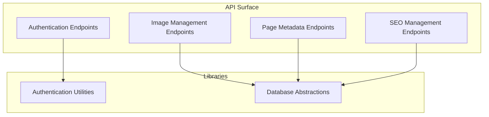
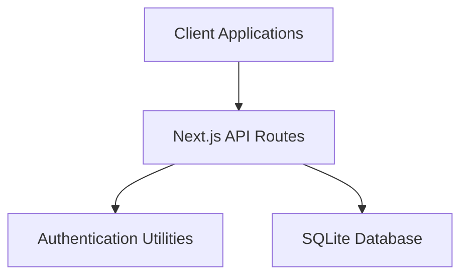
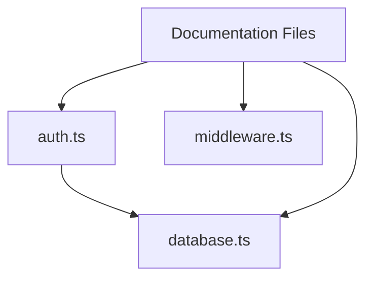
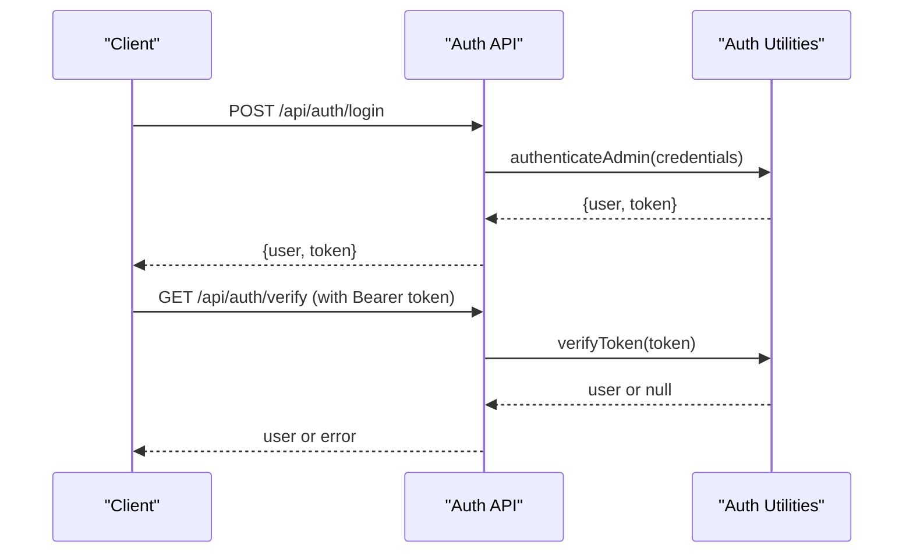
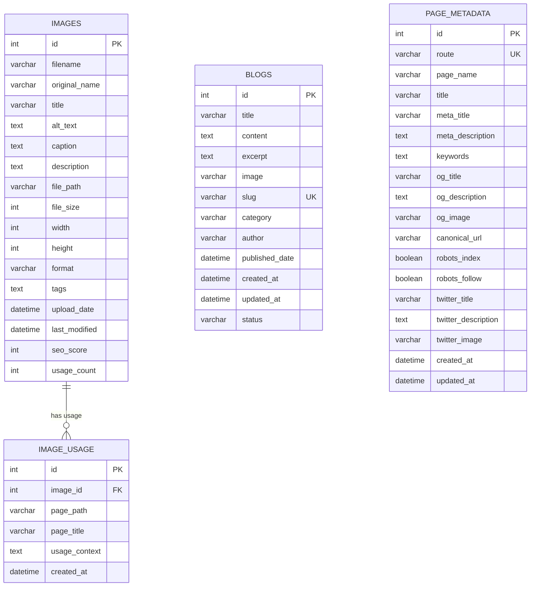

# API Reference

<cite>
**Referenced Files in This Document**
- [PRD_Image_Management_Dashboard.md](file://PRD_Image_Management_Dashboard.md)
- [IMAGE_MANAGEMENT_SETUP.md](file://IMAGE_MANAGEMENT_SETUP.md)
- [PAGE_EDITOR_README.md](file://PAGE_EDITOR_README.md)
- [SEO_MANAGEMENT_GUIDE.md](file://SEO_MANAGEMENT_GUIDE.md)
- [auth.ts](file://src/lib/auth.ts)
- [database.ts](file://src/lib/database.ts)
- [middleware.ts](file://middleware.ts)
</cite>

## Table of Contents
1. [Introduction](#introduction)
2. [Project Structure](#project-structure)
3. [Core Components](#core-components)
4. [Architecture Overview](#architecture-overview)
5. [Detailed Component Analysis](#detailed-component-analysis)
6. [Dependency Analysis](#dependency-analysis)
7. [Performance Considerations](#performance-considerations)
8. [Troubleshooting Guide](#troubleshooting-guide)
9. [Conclusion](#conclusion)
10. [Appendices](#appendices)

## Introduction
This document provides comprehensive API documentation for the attechglobal.com REST endpoints. It covers authentication, blog management, image management, page metadata editing, and SEO management. For each endpoint, you will find HTTP methods, URL patterns, request/response schemas, authentication requirements, parameters, and error handling guidance. Practical examples using curl and JavaScript fetch are included, along with security, CORS, rate limiting, and integration notes.

## Project Structure
The API surface is primarily defined by the product and setup documentation files. The backend logic for authentication and database operations is implemented in dedicated libraries. The middleware file indicates admin route protection and static hosting constraints.

**Section sources**
- [PRD_Image_Management_Dashboard.md](file://PRD_Image_Management_Dashboard.md#L146-L167)
- [IMAGE_MANAGEMENT_SETUP.md](file://IMAGE_MANAGEMENT_SETUP.md#L101-L113)
- [PAGE_EDITOR_README.md](file://PAGE_EDITOR_README.md#L74-L88)
- [SEO_MANAGEMENT_GUIDE.md](file://SEO_MANAGEMENT_GUIDE.md#L14-L18)
- [auth.ts](file://src/lib/auth.ts#L1-L85)
- [database.ts](file://src/lib/database.ts#L1-L255)
- [middleware.ts](file://middleware.ts#L1-L15)

## Core Components
- Authentication utilities: JWT-based login, token verification, and admin role checks.
- Database abstractions: SQLite-backed models for images, image usage, blogs, and page metadata.
- Middleware: Admin route protection and static hosting constraints.

Key responsibilities:
- Authentication: Validate credentials, issue tokens, verify tokens, enforce admin roles.
- Data persistence: Create tables, insert/update/delete records, query helpers.
- Admin routing: Protect admin routes; note static hosting limitations.

**Section sources**
- [auth.ts](file://src/lib/auth.ts#L1-L85)
- [database.ts](file://src/lib/database.ts#L1-L255)
- [middleware.ts](file://middleware.ts#L1-L15)

## Architecture Overview
The API follows a layered architecture:
- Presentation: Next.js API routes (defined in documentation).
- Application: Authentication utilities and page editor logic.
- Persistence: SQLite database via typed models.

**Diagram sources**
- [auth.ts](file://src/lib/auth.ts#L1-L85)
- [database.ts](file://src/lib/database.ts#L1-L255)

**Section sources**
- [auth.ts](file://src/lib/auth.ts#L1-L85)
- [database.ts](file://src/lib/database.ts#L1-L255)

## Detailed Component Analysis

### Authentication Endpoints
- Base URL: /api/auth
- Methods and endpoints:
  - POST /api/auth/login
  - POST /api/auth/logout
  - GET /api/auth/verify

Authentication requirements:
- Login: Requires email and password.
- Logout: Requires a valid session/token.
- Verify: Requires a valid session/token.

Request/response schemas:
- Login request:
  - Body: email, password
  - Response: user object and token
- Verify response:
  - Body: user object if valid, otherwise error

Common failures:
- Invalid credentials
- Expired or malformed token
- Missing or invalid Authorization header

Security considerations:
- Tokens expire after 24 hours.
- Admin role enforcement is available.

Example curl:
- Login: curl -X POST https://yoursite.com/api/auth/login -H "Content-Type: application/json" -d '{"email":"admin@attechglobal.com","password":"admin123"}'
- Verify: curl -X GET https://yoursite.com/api/auth/verify -H "Authorization: Bearer YOUR_TOKEN"

Example JavaScript fetch:
- Login: fetch('/api/auth/login', { method: 'POST', headers: {'Content-Type': 'application/json'}, body: JSON.stringify({email, password}) })
- Verify: fetch('/api/auth/verify', { headers: {'Authorization': 'Bearer ' + token} })

**Section sources**
- [PRD_Image_Management_Dashboard.md](file://PRD_Image_Management_Dashboard.md#L148-L151)
- [auth.ts](file://src/lib/auth.ts#L34-L59)
- [auth.ts](file://src/lib/auth.ts#L62-L79)

### Image Management Endpoints
- Base URL: /api/images
- Methods and endpoints:
  - GET /api/images
  - POST /api/images
  - GET /api/images/[id]
  - PUT /api/images/[id]
  - DELETE /api/images/[id]
  - POST /api/images/[id]/replace
  - GET /api/images/[id]/usage
  - POST /api/images/scan
  - GET /api/seo/analysis

Authentication requirements:
- All endpoints require admin authentication.

Request/response schemas:
- GET /api/images: Query parameters for pagination and filtering; response is a list of images.
- POST /api/images: Multipart form upload; response includes created image metadata.
- GET /api/images/[id]: Response is a single image record.
- PUT /api/images/[id]: Body updates image metadata; response confirms changes.
- DELETE /api/images/[id]: No content on success.
- POST /api/images/[id]/replace: Multipart form replacement; response includes updated metadata.
- GET /api/images/[id]/usage: Response lists usage contexts across pages.
- POST /api/images/scan: Scans existing images and adds them to the database.
- GET /api/seo/analysis: Response includes SEO metrics and recommendations.

Parameters and query options:
- Pagination and filtering options are documented for listing images.

Common failures:
- Unauthorized access
- Invalid image ID
- Upload errors (size/type)
- Database constraint violations

Security considerations:
- File type validation and size limits are enforced.
- SQL injection protection and XSS safeguards are applied.

Example curl:
- List images: curl -X GET https://yoursite.com/api/images -H "Authorization: Bearer YOUR_TOKEN"
- Upload image: curl -X POST https://yoursite.com/api/images -H "Authorization: Bearer YOUR_TOKEN" -F "file=@/path/to/image.jpg"
- Replace image: curl -X POST https://yoursite.com/api/images/123/replace -H "Authorization: Bearer YOUR_TOKEN" -F "file=@/path/to/new-image.png"
- Get usage: curl -X GET https://yoursite.com/api/images/123/usage -H "Authorization: Bearer YOUR_TOKEN"

Example JavaScript fetch:
- Upload: fetch('/api/images', { method: 'POST', headers: {'Authorization': 'Bearer ' + token}, body: formData })
- Replace: fetch('/api/images/123/replace', { method: 'POST', headers: {'Authorization': 'Bearer ' + token}, body: formData })

**Section sources**
- [PRD_Image_Management_Dashboard.md](file://PRD_Image_Management_Dashboard.md#L153-L167)
- [IMAGE_MANAGEMENT_SETUP.md](file://IMAGE_MANAGEMENT_SETUP.md#L104-L113)
- [database.ts](file://src/lib/database.ts#L18-L61)

### Page Metadata Endpoints
- Base URL: /api/pages
- Methods and endpoints:
  - GET /api/pages
  - POST /api/pages

Authentication requirements:
- All endpoints require admin authentication.

Request/response schemas:
- GET /api/pages: Response enumerates available pages with editable components.
- POST /api/pages: Body specifies filePath, componentId, oldContent, newContent; response confirms update.

Common failures:
- Invalid file path
- Component not found
- Invalid content format

Security considerations:
- Restricted to configured pages directory.
- Automatic backups and logging.

Example curl:
- Get pages: curl -X GET https://yoursite.com/api/pages -H "Authorization: Bearer YOUR_TOKEN"
- Update component: curl -X POST https://yoursite.com/api/pages -H "Authorization: Bearer YOUR_TOKEN" -H "Content-Type: application/json" -d '{"filePath":"src/app/(home1)/page.tsx","componentId":"text-25-0-45","oldContent":"Original text","newContent":"Updated text"}'

Example JavaScript fetch:
- Update: fetch('/api/pages', { method: 'POST', headers: {'Authorization': 'Bearer ' + token, 'Content-Type': 'application/json'}, body: JSON.stringify(payload) })

**Section sources**
- [PAGE_EDITOR_README.md](file://PAGE_EDITOR_README.md#L75-L88)
- [PAGE_EDITOR_README.md](file://PAGE_EDITOR_README.md#L140-L145)

### SEO Management Endpoints
- Base URL: /api/seo
- Methods and endpoints:
  - GET /api/seo/analysis
  - POST /api/seo/optimize
  - POST /api/seo/seed

Authentication requirements:
- All endpoints require admin authentication.

Request/response schemas:
- GET /api/seo/analysis: Response includes SEO analysis for pages/images.
- POST /api/seo/optimize: Body contains optimization directives; response confirms changes.
- POST /api/seo/seed: Seeds initial page metadata; response confirms seeding.

Common failures:
- Database not initialized
- Route mismatch
- Invalid optimization payload

Security considerations:
- Admin-only access.
- Fallback system ensures pages remain functional without database entries.

Example curl:
- Seed metadata: curl -X POST https://yoursite.com/api/seo/seed -H "Authorization: Bearer YOUR_TOKEN"
- Get analysis: curl -X GET https://yoursite.com/api/seo/analysis -H "Authorization: Bearer YOUR_TOKEN"
- Optimize: curl -X POST https://yoursite.com/api/seo/optimize -H "Authorization: Bearer YOUR_TOKEN" -H "Content-Type: application/json" -d '{}'

Example JavaScript fetch:
- Seed: fetch('/api/seo/seed', { method: 'POST', headers: {'Authorization': 'Bearer ' + token} })
- Optimize: fetch('/api/seo/optimize', { method: 'POST', headers: {'Authorization': 'Bearer ' + token, 'Content-Type': 'application/json'}, body: JSON.stringify(optimizePayload) })

**Section sources**
- [PRD_Image_Management_Dashboard.md](file://PRD_Image_Management_Dashboard.md#L165-L167)
- [SEO_MANAGEMENT_GUIDE.md](file://SEO_MANAGEMENT_GUIDE.md#L14-L18)

## Dependency Analysis
- Authentication depends on JWT secret and admin credentials.
- API endpoints depend on database models and helpers.
- Middleware protects admin routes and adapts to static hosting.

**Diagram sources**
- [auth.ts](file://src/lib/auth.ts#L1-L85)
- [database.ts](file://src/lib/database.ts#L1-L255)
- [middleware.ts](file://middleware.ts#L1-L15)

**Section sources**
- [auth.ts](file://src/lib/auth.ts#L1-L85)
- [database.ts](file://src/lib/database.ts#L1-L255)
- [middleware.ts](file://middleware.ts#L1-L15)

## Performance Considerations
- Pagination and filtering for listing images reduce payload sizes.
- Efficient database queries and indexing help maintain responsiveness.
- Image compression and CDN-ready formats improve load times.
- Token expiration prevents long-lived sessions.

[No sources needed since this section provides general guidance]

## Troubleshooting Guide
Common issues and resolutions:
- Authentication failures: Verify credentials and token validity.
- Unauthorized access: Ensure admin role and proper Authorization header.
- Database errors: Confirm database initialization and write permissions.
- Upload failures: Check file type, size limits, and disk space.
- SEO seeding: Initialize database and confirm route paths.

**Section sources**
- [IMAGE_MANAGEMENT_SETUP.md](file://IMAGE_MANAGEMENT_SETUP.md#L153-L160)
- [PAGE_EDITOR_README.md](file://PAGE_EDITOR_README.md#L114-L125)
- [SEO_MANAGEMENT_GUIDE.md](file://SEO_MANAGEMENT_GUIDE.md#L87-L92)

## Conclusion
The attechglobal.com API provides a cohesive set of endpoints for authentication, image management, page metadata editing, and SEO management. The documentation consolidates endpoint definitions, schemas, and operational guidance derived from the project’s product and setup documents, along with the underlying authentication and database libraries.

[No sources needed since this section summarizes without analyzing specific files]

## Appendices

### Authentication Flow

**Diagram sources**
- [PRD_Image_Management_Dashboard.md](file://PRD_Image_Management_Dashboard.md#L148-L151)
- [auth.ts](file://src/lib/auth.ts#L62-L79)
- [auth.ts](file://src/lib/auth.ts#L48-L59)

### Data Models Overview

**Diagram sources**
- [database.ts](file://src/lib/database.ts#L18-L81)

### CORS and Rate Limiting
- CORS: Configure origin and credentials policy according to deployment needs.
- Rate limiting: Enforce on login attempts and sensitive endpoints; consider IP-based quotas.
- Security headers: Add Content-Security-Policy, X-Frame-Options, and HSTS as appropriate.

[No sources needed since this section provides general guidance]

### API Versioning and Compatibility
- Versioning: No explicit version prefix observed in current endpoints.
- Backward compatibility: Maintain stable schemas and deprecation notices before breaking changes.
- Deprecation: Announce deprecations with migration timelines and alternatives.

[No sources needed since this section provides general guidance]