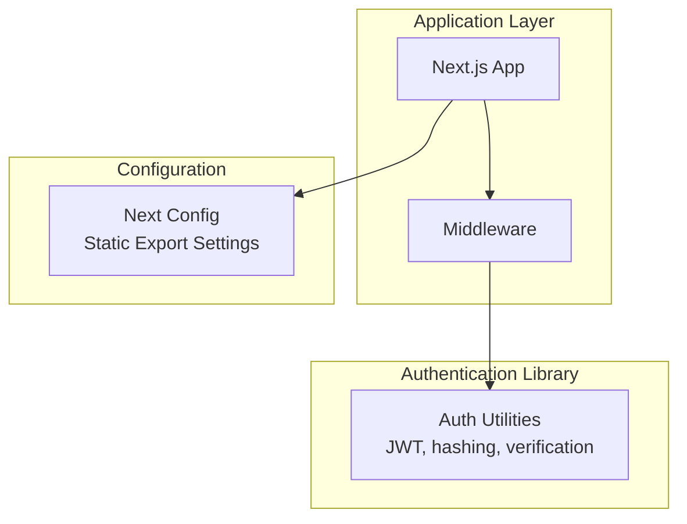
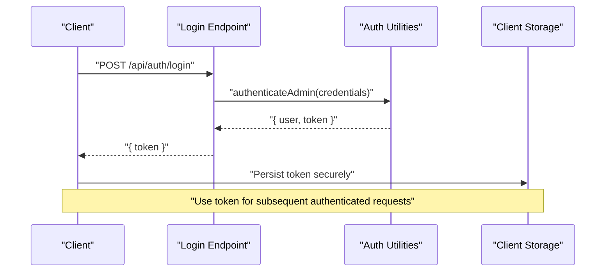
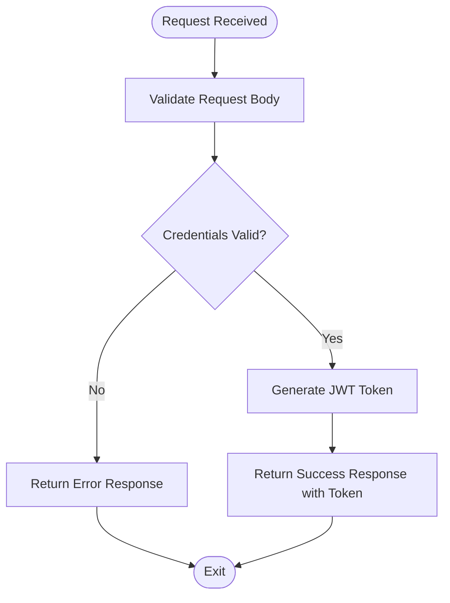
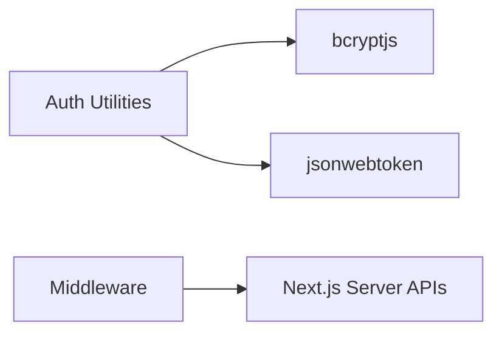

# Authentication API

<cite>
**Referenced Files in This Document**
- [src/lib/auth.ts](file://src/lib/auth.ts)
- [middleware.ts](file://middleware.ts)
- [next.config.mjs](file://next.config.mjs)
</cite>

## Table of Contents
1. [Introduction](#introduction)
2. [Project Structure](#project-structure)
3. [Core Components](#core-components)
4. [Architecture Overview](#architecture-overview)
5. [Detailed Component Analysis](#detailed-component-analysis)
6. [Dependency Analysis](#dependency-analysis)
7. [Performance Considerations](#performance-considerations)
8. [Troubleshooting Guide](#troubleshooting-guide)
9. [Conclusion](#conclusion)
10. [Appendices](#appendices)

## Introduction
This document provides comprehensive API documentation for the authentication system, focusing on the login endpoint and related authentication utilities. It covers the login endpoint specification, request/response formats, JWT token structure and expiration, middleware behavior, and practical usage examples. It also outlines security considerations, client-side integration patterns, and troubleshooting guidance.

## Project Structure
The authentication logic is implemented in a library module and integrated with Next.js middleware. The project is configured for static export in certain environments, which affects how server-side authentication middleware operates.

**Diagram sources**
- [middleware.ts](file://middleware.ts#L1-L15)
- [src/lib/auth.ts](file://src/lib/auth.ts#L1-L85)
- [next.config.mjs](file://next.config.mjs#L1-L129)

**Section sources**
- [middleware.ts](file://middleware.ts#L1-L15)
- [next.config.mjs](file://next.config.mjs#L1-L129)

## Core Components
- Authentication utilities: JWT signing and verification, password hashing and comparison, admin credential validation, and role checks.
- Middleware: Currently a placeholder that is intentionally disabled for static hosting scenarios.

Key responsibilities:
- Token generation and verification with a configurable secret and 24-hour expiration.
- Password hashing for secure credential storage.
- Admin role validation for access control.

**Section sources**
- [src/lib/auth.ts](file://src/lib/auth.ts#L1-L85)
- [middleware.ts](file://middleware.ts#L1-L15)

## Architecture Overview
The authentication flow centers around a login operation that produces a signed JWT. The middleware currently does not enforce authentication on admin routes in static hosting mode.

**Diagram sources**
- [src/lib/auth.ts](file://src/lib/auth.ts#L62-L79)

## Detailed Component Analysis

### Login Endpoint: POST /api/auth/login
Purpose:
- Accepts admin credentials and returns a JSON Web Token for sessionless authentication.

Endpoint:
- Method: POST
- Path: /api/auth/login

Request Body Schema:
- email: string (required)
- password: string (required)

Response Format:
- token: string (JWT)

Behavior:
- Validates credentials against stored admin credentials.
- On success, generates a JWT with a 24-hour expiration.
- On failure, returns an appropriate error response.

**Diagram sources**
- [src/lib/auth.ts](file://src/lib/auth.ts#L62-L79)

**Section sources**
- [src/lib/auth.ts](file://src/lib/auth.ts#L62-L79)

### JWT Token Structure and Expiration
- Signing algorithm: HS256 (standard for HMAC-based tokens).
- Claims included: id, email, role.
- Expiration: 24 hours.
- Secret: Loaded from environment variable; defaults to a development value if not set.

Expiration handling:
- Clients should proactively refresh or re-authenticate before expiration.
- Tokens are verified server-side using the shared secret.

**Section sources**
- [src/lib/auth.ts](file://src/lib/auth.ts#L34-L45)
- [src/lib/auth.ts](file://src/lib/auth.ts#L48-L59)

### Authentication Middleware
Current behavior:
- Middleware is present but intentionally disabled for static hosting environments.
- The matcher targets admin routes, but the handler currently does nothing.

Implications:
- No runtime authentication enforcement in static export mode.
- If deployed to a serverless or serverful environment, middleware can be enabled to protect admin routes.

**Section sources**
- [middleware.ts](file://middleware.ts#L1-L15)

### Password Security Utilities
- Password hashing: bcrypt-based hashing with a fixed salt strength.
- Password verification: bcrypt-based comparison for secure credential validation.

Recommendations:
- In production, store hashed passwords and avoid plain-text storage.
- Use environment variables for secrets and avoid hardcoding credentials.

**Section sources**
- [src/lib/auth.ts](file://src/lib/auth.ts#L24-L32)

### Admin Role Validation
- Role checks support super_admin and admin roles.
- Used to determine access privileges within the application.

**Section sources**
- [src/lib/auth.ts](file://src/lib/auth.ts#L82-L84)

## Dependency Analysis
The authentication utilities depend on external libraries for hashing and JWT operations. The middleware depends on Next.js server APIs.

**Diagram sources**
- [src/lib/auth.ts](file://src/lib/auth.ts#L1-L2)
- [middleware.ts](file://middleware.ts#L1-L2)

**Section sources**
- [src/lib/auth.ts](file://src/lib/auth.ts#L1-L2)
- [middleware.ts](file://middleware.ts#L1-L2)

## Performance Considerations
- JWT verification is lightweight and CPU-efficient.
- bcrypt hashing is intentionally computationally expensive; avoid hashing during hot paths.
- Keep token payloads minimal to reduce payload sizes.
- Consider shortening expiration for high-security endpoints and implementing proactive refresh.

## Troubleshooting Guide
Common issues and resolutions:
- Invalid credentials: Ensure email and password match the stored admin credentials. Confirm request body format and encoding.
- Token verification failures: Verify the JWT secret matches the one used to sign tokens and that the token is not expired.
- Middleware not enforcing auth: Confirm the middleware is enabled and not returning early in static hosting mode.
- Environment configuration: Ensure the JWT secret is set via environment variables in production.

**Section sources**
- [src/lib/auth.ts](file://src/lib/auth.ts#L48-L59)
- [middleware.ts](file://middleware.ts#L4-L7)

## Conclusion
The authentication system provides a straightforward login flow with JWT-based sessionless authentication and robust password handling utilities. While the current middleware is disabled for static hosting, the underlying JWT and credential validation logic is ready for deployment in serverful environments. Production deployments should focus on secure secret management, HTTPS enforcement, and client-side token storage best practices.

## Appendices

### API Definition: POST /api/auth/login
- Method: POST
- Path: /api/auth/login
- Request Body:
  - email: string
  - password: string
- Successful Response:
  - token: string (JWT)
- Error Responses:
  - Invalid credentials: 401 Unauthorized
  - Server error: 500 Internal Server Error

### Practical Examples

curl (successful login):
- curl -X POST https://example.com/api/auth/login -H "Content-Type: application/json" -d '{"email":"admin@attechglobal.com","password":"admin123"}'

JavaScript fetch (login and subsequent authenticated request):
- const res = await fetch('/api/auth/login', { method: 'POST', headers: {'Content-Type': 'application/json'}, body: JSON.stringify({email, password}) })
- const { token } = await res.json()
- const profileRes = await fetch('/api/admin/profile', { headers: {'Authorization': `Bearer ${token}`} })

### Security Considerations
- Transport security: Enforce HTTPS in production to prevent token interception.
- Token storage: Store tokens in secure, httpOnly cookies or secure storage mechanisms on the client. Avoid storing in localStorage or sessionStorage.
- Logout: Clear stored tokens and invalidate sessions server-side if implemented.
- Secrets: Use environment variables for JWT secret and avoid committing secrets to source control.

### Client-Side Integration Patterns
- Authentication state management: Maintain token and user role in memory or a state container.
- Automatic refresh: Implement a pre-request interceptor to detect expiration and trigger a refresh flow.
- Protected routes: Guard navigation to admin routes using stored token presence and role checks.