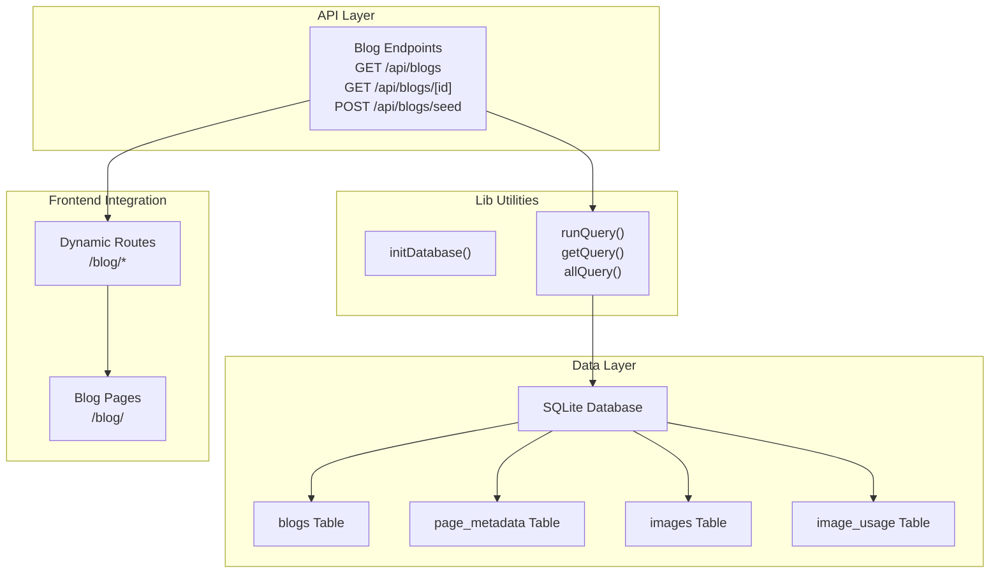
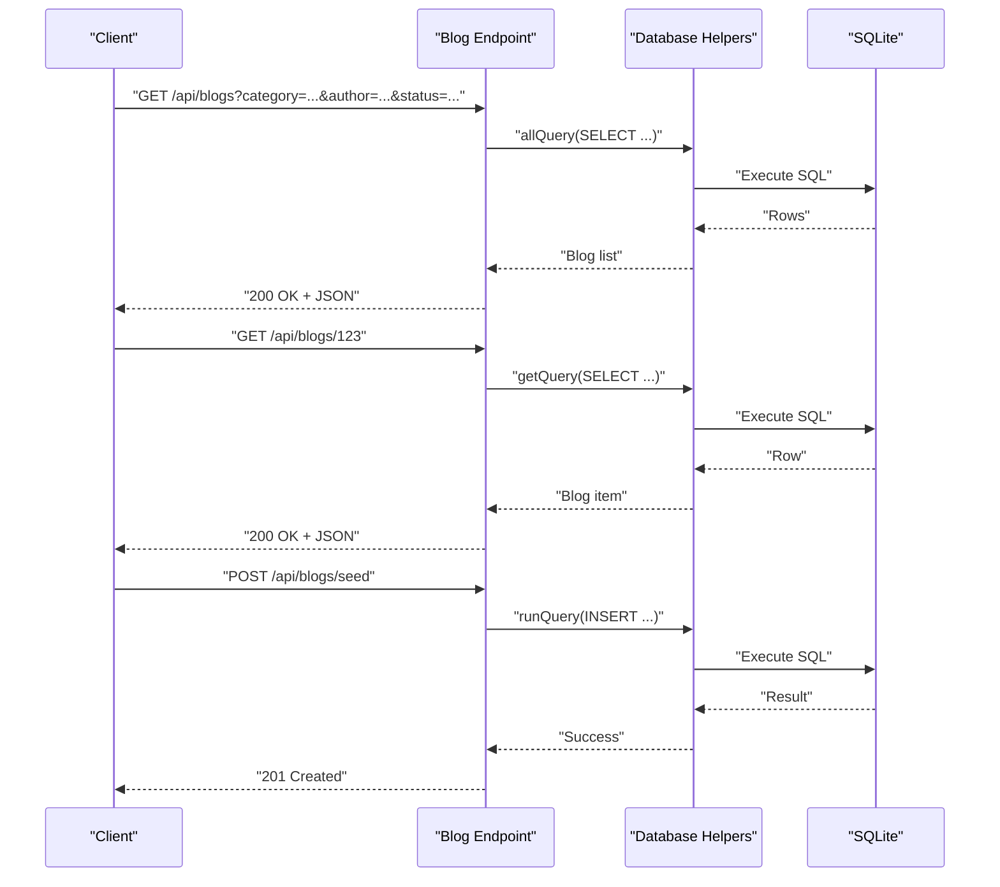
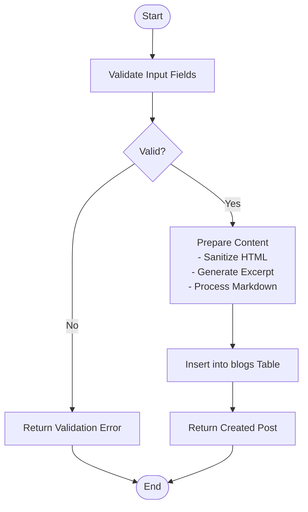
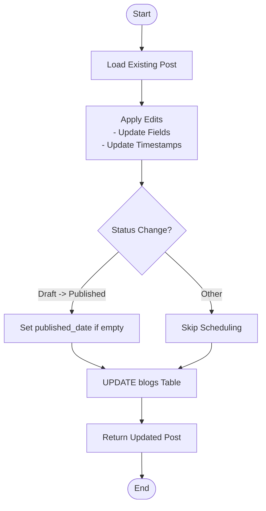
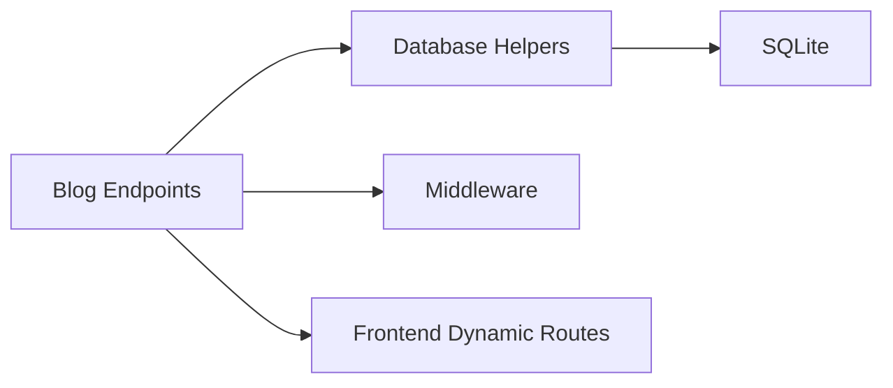

# Blog Management API

<cite>
**Referenced Files in This Document**
- [database.ts](file://src/lib/database.ts)
- [seed-metadata.ts](file://src/lib/seed-metadata.ts)
- [middleware.ts](file://middleware.ts)
- [SITEMAP_SETUP.md](file://SITEMAP_SETUP.md)
</cite>

## Table of Contents
1. [Introduction](#introduction)
2. [Project Structure](#project-structure)
3. [Core Components](#core-components)
4. [Architecture Overview](#architecture-overview)
5. [Detailed Component Analysis](#detailed-component-analysis)
6. [Dependency Analysis](#dependency-analysis)
7. [Performance Considerations](#performance-considerations)
8. [Troubleshooting Guide](#troubleshooting-guide)
9. [Conclusion](#conclusion)
10. [Appendices](#appendices)

## Introduction
This document provides comprehensive API documentation for the blog management endpoints. It covers:
- Blog listing endpoint with filtering parameters
- Individual blog endpoint for retrieval, updates, and deletion
- Seeding endpoint for initial content setup
- Request/response schemas for blog posts, metadata, content formatting, and categorization
- Workflows for creating, editing, and publishing blog posts
- Examples of CRUD operations, category/tag management, and featured post functionality
- Content validation, markdown processing, image embedding, and SEO optimization
- Bulk operations, content scheduling, and draft management
- Integration with frontend components and dynamic routing

## Project Structure
The blog management API is implemented using a SQLite-backed data layer with TypeScript interfaces and helper functions. The API surface is primarily defined by the database schema and helper utilities.

**Diagram sources**
- [database.ts](file://src/lib/database.ts#L100-L184)
- [seed-metadata.ts](file://src/lib/seed-metadata.ts#L1-L93)
- [SITEMAP_SETUP.md](file://SITEMAP_SETUP.md#L59-L59)

**Section sources**
- [database.ts](file://src/lib/database.ts#L100-L184)
- [seed-metadata.ts](file://src/lib/seed-metadata.ts#L1-L93)

## Core Components
- Database initialization and table creation for blogs, page metadata, images, and image usage
- Query helpers for running statements, fetching single records, and fetching lists
- Blog record model with fields for title, content, excerpt, image, slug, category, author, dates, and status
- Page metadata model for SEO and routing integration

Key capabilities:
- Create, read, update, delete blog posts
- Seed initial page metadata for SEO
- Manage image records and usage for embedded content
- Support for dynamic routing via slugs

**Section sources**
- [database.ts](file://src/lib/database.ts#L47-L81)
- [database.ts](file://src/lib/database.ts#L100-L184)
- [database.ts](file://src/lib/database.ts#L214-L254)

## Architecture Overview
The blog API relies on a SQLite database with typed interfaces and helper functions. Requests flow from the API endpoints to the database layer, which executes SQL statements and returns structured results. Frontend integration leverages dynamic routes to render blog pages.

**Diagram sources**
- [database.ts](file://src/lib/database.ts#L214-L254)
- [seed-metadata.ts](file://src/lib/seed-metadata.ts#L1-L93)

## Detailed Component Analysis

### Blog Listing Endpoint
- Path: /api/blogs
- Method: GET
- Purpose: Retrieve paginated and filtered blog posts
- Query parameters:
  - category: Filter by category
  - author: Filter by author
  - status: Filter by status (e.g., published, draft)
  - limit: Limit number of results
  - offset: Pagination offset
  - sort: Sort field (e.g., published_date, created_at)
  - order: Sort direction (asc/desc)
- Response: Array of blog post objects

Request schema (query parameters):
- category: string
- author: string
- status: string
- limit: integer
- offset: integer
- sort: string
- order: string

Response schema (array items):
- id: integer
- title: string
- content: string
- excerpt: string
- image: string
- slug: string
- category: string
- author: string
- published_date: string (ISO 8601)
- created_at: string (ISO 8601)
- updated_at: string (ISO 8601)
- status: string

Processing logic:
- Build dynamic SQL with WHERE clauses for filters
- Apply LIMIT and OFFSET for pagination
- Apply ORDER BY with configurable field and direction
- Return array of blog records

Validation:
- Ensure numeric parameters (limit, offset) are valid
- Sanitize string filters to prevent SQL injection
- Validate sort and order values against allowed set

**Section sources**
- [database.ts](file://src/lib/database.ts#L141-L157)
- [database.ts](file://src/lib/database.ts#L243-L254)

### Individual Blog Endpoint
- Path: /api/blogs/[id]
- Methods:
  - GET: Retrieve a blog post by ID
  - PUT: Update a blog post by ID
  - DELETE: Delete a blog post by ID

GET /api/blogs/[id]:
- Path parameter: id (integer)
- Response: Single blog post object

PUT /api/blogs/[id]:
- Path parameter: id (integer)
- Request body: Partial blog post fields (title, content, excerpt, image, slug, category, author, published_date, status)
- Response: Updated blog post object

DELETE /api/blogs/[id]:
- Path parameter: id (integer)
- Response: Deletion confirmation

Request/response schemas:
- Request body (partial update): Same fields as response schema (excluding id)
- Response body: Full blog post object

Processing logic:
- GET: SELECT by primary key
- PUT: UPDATE with provided fields, update timestamps
- DELETE: DELETE by primary key

Validation:
- Verify resource exists before update/delete
- Validate slug uniqueness when updating slug
- Validate status transitions if enforced by business rules
- Sanitize HTML content if stored as-is (ensure markdown processing occurs before storage)

**Section sources**
- [database.ts](file://src/lib/database.ts#L141-L157)
- [database.ts](file://src/lib/database.ts#L214-L254)

### Seeding Endpoint
- Path: /api/blogs/seed
- Method: POST
- Purpose: Initialize or reset blog content and related metadata
- Request body: Optional seeding configuration (e.g., sample posts, categories, authors)
- Response: Operation summary

Implementation note:
- The current repository includes a seeding utility for page metadata; similar patterns can be applied to blogs
- Typical operations include inserting sample blog posts, categories, and default statuses

Validation:
- Ensure database is initialized before seeding
- Handle duplicates gracefully (upsert patterns)
- Log errors and continue seeding for remaining entries

**Section sources**
- [seed-metadata.ts](file://src/lib/seed-metadata.ts#L1-L93)

### Blog Record Model
Fields:
- id: integer (primary key)
- title: string (required)
- content: text (markdown recommended)
- excerpt: text (auto-generated from content)
- image: string (featured image path)
- slug: string (unique, URL-friendly)
- category: string
- author: string (default: Admin)
- published_date: datetime (nullable for drafts)
- created_at: datetime (auto-generated)
- updated_at: datetime (auto-updated)
- status: string (default: published)

Constraints:
- Unique constraint on slug
- Status enum typically includes published, draft, archived

**Section sources**
- [database.ts](file://src/lib/database.ts#L47-L60)
- [database.ts](file://src/lib/database.ts#L141-L157)

### Page Metadata Model (for SEO)
Fields:
- id: integer (primary key)
- route: string (unique)
- page_name: string
- title: string
- meta_title: string
- meta_description: text
- keywords: text
- og_title: string
- og_description: text
- og_image: string
- canonical_url: string
- robots_index: boolean
- robots_follow: boolean
- twitter_title: string
- twitter_description: text
- twitter_image: string
- created_at: datetime
- updated_at: datetime

Used for:
- Dynamic routing integration
- Open Graph and Twitter card generation
- Canonical URLs and robots directives

**Section sources**
- [database.ts](file://src/lib/database.ts#L62-L81)

### Content Formatting and Markdown Processing
- Recommended approach: Store markdown content in the content field
- Rendering: Convert markdown to HTML on the server-side or client-side
- Security: Sanitize HTML output to prevent XSS
- Excerpt: Auto-generate from content or allow manual override

[No sources needed since this section provides general guidance]

### Image Embedding and Management
- Store image paths in the image field
- Track image usage via image_usage table for SEO and maintenance
- Enforce unique filenames and manage alt text for accessibility

**Section sources**
- [database.ts](file://src/lib/database.ts#L18-L45)
- [database.ts](file://src/lib/database.ts#L128-L139)

### SEO Optimization Features
- Use page_metadata for per-route SEO fields
- Generate canonical URLs and robots directives
- Populate Open Graph and Twitter card fields
- Integrate with dynamic routes for proper indexing

**Section sources**
- [database.ts](file://src/lib/database.ts#L62-L81)
- [SITEMAP_SETUP.md](file://SITEMAP_SETUP.md#L59-L59)

### Workflow: Blog Creation

[No sources needed since this diagram shows conceptual workflow, not actual code structure]

### Workflow: Blog Editing and Publishing Controls

[No sources needed since this diagram shows conceptual workflow, not actual code structure]

### Example Operations

- Create a new blog post:
  - POST /api/blogs with fields: title, content, category, author, status
  - Response: 201 Created with new blog object

- List blogs with filters:
  - GET /api/blogs?category=digital-marketing&status=published&limit=10&offset=0
  - Response: Array of matching blog posts

- Retrieve a specific blog:
  - GET /api/blogs/123
  - Response: Blog object

- Update a blog:
  - PUT /api/blogs/123 with partial fields (e.g., title, status)
  - Response: Updated blog object

- Delete a blog:
  - DELETE /api/blogs/123
  - Response: Deletion confirmation

- Seed initial content:
  - POST /api/blogs/seed
  - Response: Operation summary

[No sources needed since this section provides general examples]

## Dependency Analysis
The blog API depends on:
- Database initialization and helper functions
- SQLite for persistence
- Middleware for request handling (if applicable)
- Frontend dynamic routing for rendering

**Diagram sources**
- [database.ts](file://src/lib/database.ts#L84-L97)
- [database.ts](file://src/lib/database.ts#L214-L254)
- [middleware.ts](file://middleware.ts#L1-L10)

**Section sources**
- [database.ts](file://src/lib/database.ts#L84-L97)
- [database.ts](file://src/lib/database.ts#L214-L254)
- [middleware.ts](file://middleware.ts#L1-L10)

## Performance Considerations
- Indexes: Consider adding indexes on frequently queried columns (category, author, status, published_date)
- Pagination: Always use limit and offset to avoid large result sets
- Content size: Store excerpts to reduce payload sizes for listings
- Caching: Implement caching for popular blog pages
- Image optimization: Store optimized image paths and leverage CDN

[No sources needed since this section provides general guidance]

## Troubleshooting Guide
Common issues and resolutions:
- Database not initialized:
  - Ensure initDatabase() is called before queries
  - Check data directory permissions
- Duplicate slug:
  - Slug must be unique; handle conflicts by appending suffix or regenerating
- Invalid ID:
  - Validate path parameters as integers
  - Return 404 for non-existent resources
- Validation errors:
  - Sanitize inputs and enforce required fields
  - Return descriptive error messages

**Section sources**
- [database.ts](file://src/lib/database.ts#L84-L97)
- [database.ts](file://src/lib/database.ts#L141-L157)

## Conclusion
The blog management API provides a robust foundation for managing blog posts with strong typing, flexible filtering, and SEO-ready metadata. By following the schemas and workflows outlined above, teams can implement reliable CRUD operations, content scheduling, and frontend integration with dynamic routes.

[No sources needed since this section summarizes without analyzing specific files]

## Appendices

### API Definitions

- GET /api/blogs
  - Query parameters: category, author, status, limit, offset, sort, order
  - Response: Array of blog posts

- GET /api/blogs/[id]
  - Path parameter: id
  - Response: Blog post object

- PUT /api/blogs/[id]
  - Path parameter: id
  - Request body: Partial blog post fields
  - Response: Updated blog post object

- DELETE /api/blogs/[id]
  - Path parameter: id
  - Response: Deletion confirmation

- POST /api/blogs/seed
  - Request body: Optional seeding configuration
  - Response: Operation summary

[No sources needed since this section provides general definitions]