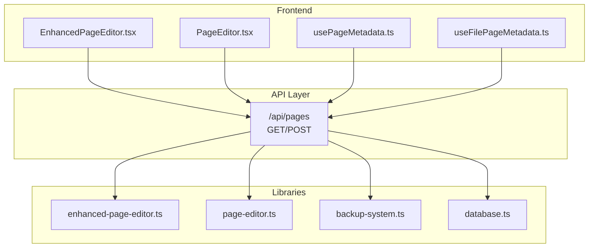
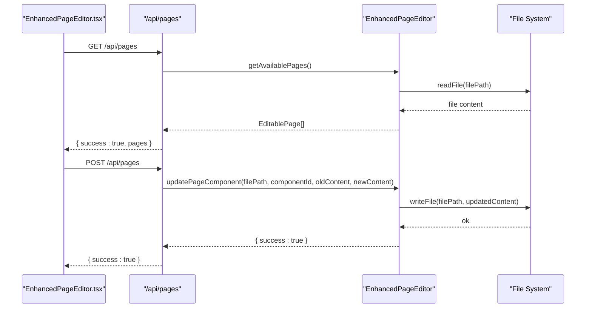
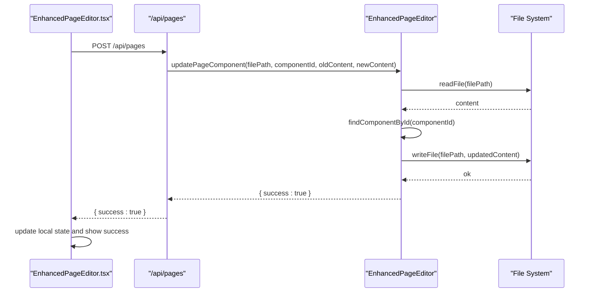
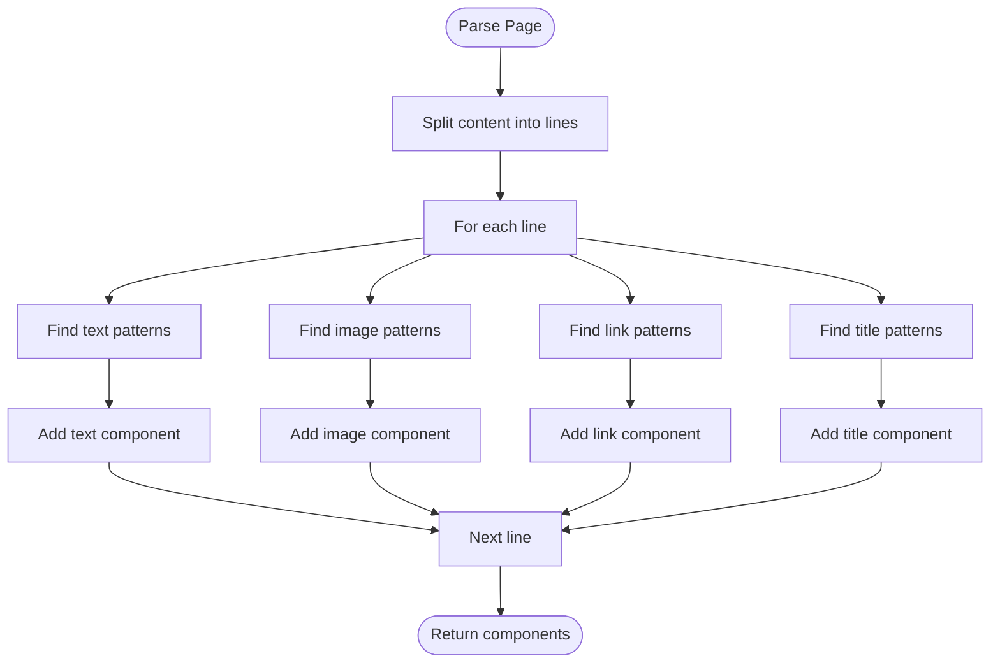
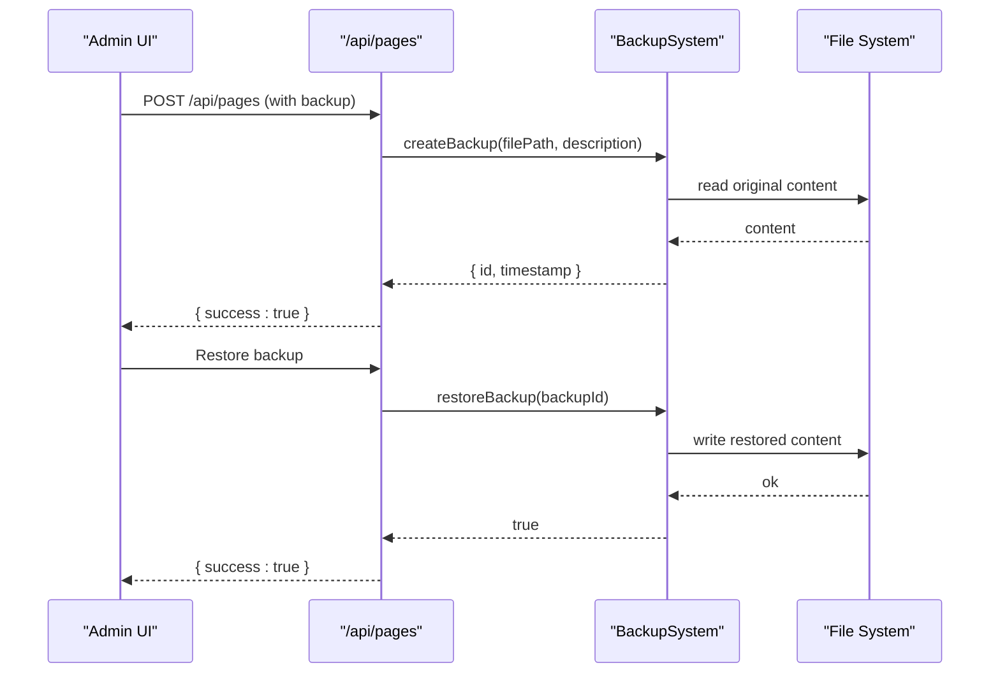
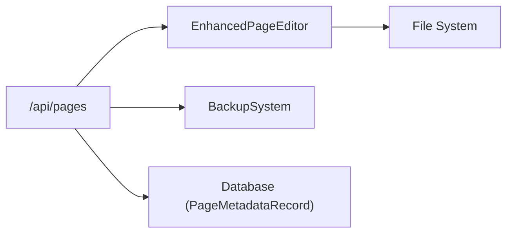

# Content Management API

<cite>
**Referenced Files in This Document**
- [PAGE_EDITOR_README.md](file://PAGE_EDITOR_README.md)
- [enhanced-page-editor.ts](file://src/lib/enhanced-page-editor.ts)
- [page-editor.ts](file://src/lib/page-editor.ts)
- [backup-system.ts](file://src/lib/backup-system.ts)
- [database.ts](file://src/lib/database.ts)
- [usePageMetadata.ts](file://src/hooks/usePageMetadata.ts)
- [useFilePageMetadata.ts](file://src/hooks/useFilePageMetadata.ts)
- [EnhancedPageEditor.tsx](file://src/app/Components/Admin/EnhancedPageEditor.tsx)
- [PageEditor.tsx](file://src/app/Components/Admin/PageEditor.tsx)
</cite>

## Table of Contents
1. [Introduction](#introduction)
2. [Project Structure](#project-structure)
3. [Core Components](#core-components)
4. [Architecture Overview](#architecture-overview)
5. [Detailed Component Analysis](#detailed-component-analysis)
6. [Dependency Analysis](#dependency-analysis)
7. [Performance Considerations](#performance-considerations)
8. [Troubleshooting Guide](#troubleshooting-guide)
9. [Conclusion](#conclusion)
10. [Appendices](#appendices)

## Introduction
This document provides comprehensive API documentation for the content management endpoints focused on page metadata and content editing. It covers:
- The pages endpoint (/api/pages) with GET for retrieving page metadata and POST for updating page content
- Request/response schemas for page data structures, component configurations, and content blocks
- Integration with the enhanced page editor, real-time content update mechanisms, and file-based content parsing
- Examples of page metadata retrieval, content modification workflows, and bulk content operations
- Validation rules, content sanitization, and error handling for malformed content
- Component-based content editing, dynamic content generation, and preview functionality
- Backup and restore operations, content versioning, and rollback mechanisms

## Project Structure
The content management system is composed of:
- Frontend React components that call the API endpoints
- Backend API handlers under src/app/api/pages/route.ts (referenced by the editor documentation)
- Utility libraries for parsing, editing, and backing up page content
- A SQLite-backed database for storing page metadata and related records

**Diagram sources**
- [PAGE_EDITOR_README.md](file://PAGE_EDITOR_README.md#L74-L88)
- [enhanced-page-editor.ts](file://src/lib/enhanced-page-editor.ts#L26-L287)
- [page-editor.ts](file://src/lib/page-editor.ts#L23-L194)
- [backup-system.ts](file://src/lib/backup-system.ts#L12-L119)
- [database.ts](file://src/lib/database.ts#L62-L81)
- [EnhancedPageEditor.tsx](file://src/app/Components/Admin/EnhancedPageEditor.tsx#L49-L81)
- [PageEditor.tsx](file://src/app/Components/Admin/PageEditor.tsx#L45-L76)
- [usePageMetadata.ts](file://src/hooks/usePageMetadata.ts#L18-L52)
- [useFilePageMetadata.ts](file://src/hooks/useFilePageMetadata.ts#L18-L52)

**Section sources**
- [PAGE_EDITOR_README.md](file://PAGE_EDITOR_README.md#L52-L96)
- [EnhancedPageEditor.tsx](file://src/app/Components/Admin/EnhancedPageEditor.tsx#L49-L81)
- [PageEditor.tsx](file://src/app/Components/Admin/PageEditor.tsx#L45-L76)

## Core Components
- EnhancedPageEditor: Parses page files to extract editable components, supports component updates, and generates previews.
- PageEditor: Provides basic page component extraction and simple content replacement.
- BackupSystem: Manages backups and restores for content files.
- Database: Defines PageMetadataRecord schema and provides helpers for database operations.
- React Hooks: Provide client-side integration for metadata retrieval and updates via SEO endpoints.

Key responsibilities:
- Parsing JSX content to identify text, images, links, and titles
- Updating content by replacing old text with new text in the target file
- Creating backups before applying edits
- Exposing API endpoints for listing pages and updating content

**Section sources**
- [enhanced-page-editor.ts](file://src/lib/enhanced-page-editor.ts#L26-L287)
- [page-editor.ts](file://src/lib/page-editor.ts#L23-L194)
- [backup-system.ts](file://src/lib/backup-system.ts#L12-L119)
- [database.ts](file://src/lib/database.ts#L62-L81)

## Architecture Overview
The system integrates frontend components with backend APIs and filesystem operations. The editor exposes two primary API endpoints:
- GET /api/pages: Returns available pages with editable components
- POST /api/pages: Updates a specific component in a page

**Diagram sources**
- [PAGE_EDITOR_README.md](file://PAGE_EDITOR_README.md#L74-L88)
- [enhanced-page-editor.ts](file://src/lib/enhanced-page-editor.ts#L50-L76)
- [enhanced-page-editor.ts](file://src/lib/enhanced-page-editor.ts#L239-L272)
- [EnhancedPageEditor.tsx](file://src/app/Components/Admin/EnhancedPageEditor.tsx#L49-L81)

## Detailed Component Analysis

### API Endpoints: Pages

#### Endpoint: GET /api/pages
- Purpose: Retrieve all available pages with their editable components.
- Behavior:
  - Scans configured page routes and parses each page file to extract editable components.
  - Returns a structured list of pages, each containing component metadata such as id, name, type, content, position, and context.
- Response schema:
  - success: boolean
  - pages: Array of EditablePage
    - route: string
    - name: string
    - components: Array of PageComponent
      - id: string
      - name: string
      - path: string
      - type: enum "text" | "image" | "link" | "title" | "subtitle" | "description"
      - content: string
      - attributes: object (optional)
      - position: { line: number, column: number }
      - context: string
    - filePath: string
    - preview: string (optional)

Notes:
- The endpoint relies on the enhanced page editor’s parsing logic to identify components.
- Client-side environments return an empty array for safety.

**Section sources**
- [PAGE_EDITOR_README.md](file://PAGE_EDITOR_README.md#L76-L78)
- [enhanced-page-editor.ts](file://src/lib/enhanced-page-editor.ts#L50-L76)
- [enhanced-page-editor.ts](file://src/lib/enhanced-page-editor.ts#L78-L100)
- [enhanced-page-editor.ts](file://src/lib/enhanced-page-editor.ts#L102-L205)

#### Endpoint: POST /api/pages
- Purpose: Update a specific component in a page.
- Request body schema:
  - filePath: string (absolute path resolved from process working directory)
  - componentId: string (unique identifier of the component to update)
  - oldContent: string (exact text to replace)
  - newContent: string (replacement text)
- Behavior:
  - Locates the component by id and replaces oldContent with newContent in the target line.
  - Falls back to global replacement if the component is not found.
  - Writes the updated content back to disk.
- Response schema:
  - success: boolean
  - If failure: error: string

Validation and sanitization:
- The editor determines component types heuristically (e.g., long text is treated as description, short text near navigation words as subtitle).
- Replacements are constrained to the identified component’s line to minimize unintended changes.
- Client-side environments return false to prevent filesystem writes.

**Section sources**
- [PAGE_EDITOR_README.md](file://PAGE_EDITOR_README.md#L79-L88)
- [enhanced-page-editor.ts](file://src/lib/enhanced-page-editor.ts#L239-L272)
- [enhanced-page-editor.ts](file://src/lib/enhanced-page-editor.ts#L274-L277)

### Enhanced Page Editor Integration
- Component-based editing:
  - Components are parsed from JSX with context-aware identification.
  - Supports filtering by type (text, title, subtitle, description, image, link).
- Real-time content update mechanism:
  - Frontend components call POST /api/pages to apply changes.
  - On success, the UI updates the in-memory representation of the page and displays a success notification.
- Preview functionality:
  - The editor can generate a preview for a given route.
  - The UI optionally renders an iframe preview of the selected page.

**Diagram sources**
- [EnhancedPageEditor.tsx](file://src/app/Components/Admin/EnhancedPageEditor.tsx#L49-L81)
- [enhanced-page-editor.ts](file://src/lib/enhanced-page-editor.ts#L239-L272)

**Section sources**
- [EnhancedPageEditor.tsx](file://src/app/Components/Admin/EnhancedPageEditor.tsx#L49-L81)
- [PAGE_EDITOR_README.md](file://PAGE_EDITOR_README.md#L28-L51)

### File-Based Content Parsing
- Parsing logic:
  - Text components: Identified by JSX content patterns and filtered by length and ignored patterns.
  - Image components: Identified by src attributes and background images; excludes data/blob URIs.
  - Link components: Identified by href attributes; excludes internal/javascript links.
  - Titles/subtitles: Identified by heading tags and title-like class patterns.
- Position and context:
  - Each component includes line/column positions and a context snippet for better identification.
- Replacement strategy:
  - Uses component-specific line replacement when possible; falls back to global replacement otherwise.

**Diagram sources**
- [enhanced-page-editor.ts](file://src/lib/enhanced-page-editor.ts#L78-L100)
- [enhanced-page-editor.ts](file://src/lib/enhanced-page-editor.ts#L102-L205)

**Section sources**
- [enhanced-page-editor.ts](file://src/lib/enhanced-page-editor.ts#L78-L100)
- [enhanced-page-editor.ts](file://src/lib/enhanced-page-editor.ts#L102-L205)

### Backup and Restore Operations
- Backup creation:
  - Captures the original content of a file and stores it with a unique id and timestamp.
  - Backups are persisted as JSON files in a dedicated backups directory.
- Restore:
  - Restores a file to its backed-up state using the backup id.
- Listing and deletion:
  - Retrieves all backups sorted by timestamp.
  - Deletes a specific backup by id.

**Diagram sources**
- [backup-system.ts](file://src/lib/backup-system.ts#L33-L66)
- [backup-system.ts](file://src/lib/backup-system.ts#L68-L82)
- [backup-system.ts](file://src/lib/backup-system.ts#L84-L104)

**Section sources**
- [backup-system.ts](file://src/lib/backup-system.ts#L12-L119)

### Page Metadata Retrieval and Modification
While the pages endpoint focuses on page content editing, the project also includes metadata management via SEO endpoints:
- GET /api/seo/metadata and related endpoints for page metadata CRUD operations
- Client-side hooks use these endpoints to fetch, update, and manage metadata

Note: The pages endpoint (/api/pages) is distinct from the SEO metadata endpoints documented in the hooks.

**Section sources**
- [usePageMetadata.ts](file://src/hooks/usePageMetadata.ts#L18-L52)
- [useFilePageMetadata.ts](file://src/hooks/useFilePageMetadata.ts#L18-L52)

## Dependency Analysis
The pages endpoint depends on:
- EnhancedPageEditor for parsing and updating page components
- BackupSystem for safeguarding changes
- Filesystem for reading/writing page files
- Database for page metadata records (used by SEO-related hooks)

**Diagram sources**
- [enhanced-page-editor.ts](file://src/lib/enhanced-page-editor.ts#L26-L36)
- [backup-system.ts](file://src/lib/backup-system.ts#L12-L23)
- [database.ts](file://src/lib/database.ts#L62-L81)

**Section sources**
- [enhanced-page-editor.ts](file://src/lib/enhanced-page-editor.ts#L26-L36)
- [backup-system.ts](file://src/lib/backup-system.ts#L12-L23)
- [database.ts](file://src/lib/database.ts#L62-L81)

## Performance Considerations
- Parsing complexity:
  - Linear in the number of lines in a page file.
  - Multiple passes over the file for different component types.
- File I/O:
  - Reads entire files into memory; consider streaming for very large files.
- Network overhead:
  - Frontend calls are lightweight; avoid excessive polling.
- Recommendations:
  - Cache parsed components per session.
  - Debounce frequent updates.
  - Limit concurrent requests to the same file.

[No sources needed since this section provides general guidance]

## Troubleshooting Guide
Common issues and resolutions:
- Content not updating:
  - Verify the filePath is correct and the file exists.
  - Ensure componentId matches an existing component.
- Images not showing:
  - Confirm the image URL is accessible and not a data/blob URI.
- Search/filter not working:
  - Ensure the search term matches content in the components.
- Backup failures:
  - Check backup directory permissions and disk space.
- Error messages:
  - “Failed to update page”: Check file permissions and paths.
  - “Component not found”: The component may have been moved or deleted.
  - “Invalid content”: The content does not match expected patterns.

**Section sources**
- [PAGE_EDITOR_README.md](file://PAGE_EDITOR_README.md#L114-L125)
- [enhanced-page-editor.ts](file://src/lib/enhanced-page-editor.ts#L268-L271)
- [backup-system.ts](file://src/lib/backup-system.ts#L62-L65)

## Conclusion
The content management API provides a robust foundation for component-based editing of Next.js pages. It integrates file-based parsing, safe editing with backups, and a preview workflow. By adhering to the documented schemas and validation rules, teams can reliably manage content while maintaining version control and rollback capabilities.

[No sources needed since this section summarizes without analyzing specific files]

## Appendices

### API Definitions

- GET /api/pages
  - Description: Returns all available pages with their editable components.
  - Response:
    - success: boolean
    - pages: Array of EditablePage

- POST /api/pages
  - Description: Updates a specific component in a page.
  - Request body:
    - filePath: string
    - componentId: string
    - oldContent: string
    - newContent: string
  - Response:
    - success: boolean
    - If failure: error: string

**Section sources**
- [PAGE_EDITOR_README.md](file://PAGE_EDITOR_README.md#L74-L88)
- [enhanced-page-editor.ts](file://src/lib/enhanced-page-editor.ts#L50-L76)
- [enhanced-page-editor.ts](file://src/lib/enhanced-page-editor.ts#L239-L272)

### Data Models

- EditablePage
  - route: string
  - name: string
  - components: Array of PageComponent
  - filePath: string
  - preview: string (optional)

- PageComponent
  - id: string
  - name: string
  - path: string
  - type: enum "text" | "image" | "link" | "title" | "subtitle" | "description"
  - content: string
  - attributes: object (optional)
  - position: { line: number, column: number }
  - context: string

- EnhancedPageComponent (extended)
  - id: string
  - name: string
  - path: string
  - type: enum "text" | "image" | "link" | "title" | "subtitle" | "description"
  - content: string
  - attributes: object (optional)
  - position: { line: number, column: number }
  - context: string

- BackupInfo
  - id: string
  - filePath: string
  - timestamp: Date
  - originalContent: string
  - description: string (optional)

- PageMetadataRecord
  - id: number
  - route: string
  - page_name: string
  - title: string
  - meta_title: string
  - meta_description: string
  - keywords: string
  - og_title: string
  - og_description: string
  - og_image: string
  - canonical_url: string
  - robots_index: boolean
  - robots_follow: boolean
  - twitter_title: string
  - twitter_description: string
  - twitter_image: string
  - created_at: string
  - updated_at: string

**Section sources**
- [enhanced-page-editor.ts](file://src/lib/enhanced-page-editor.ts#L18-L24)
- [enhanced-page-editor.ts](file://src/lib/enhanced-page-editor.ts#L4-L16)
- [backup-system.ts](file://src/lib/backup-system.ts#L4-L10)
- [database.ts](file://src/lib/database.ts#L62-L81)