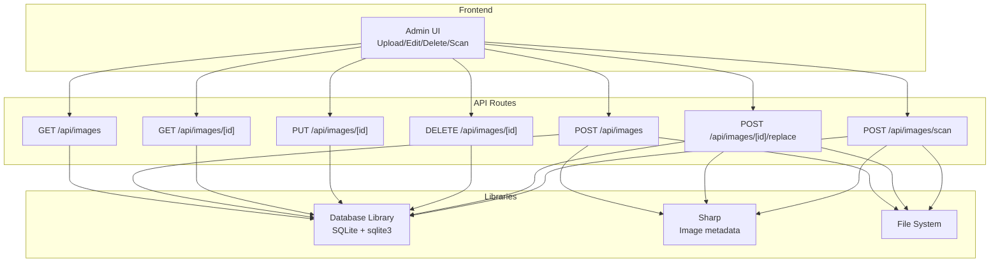
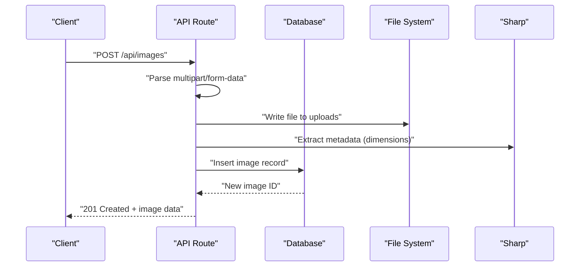
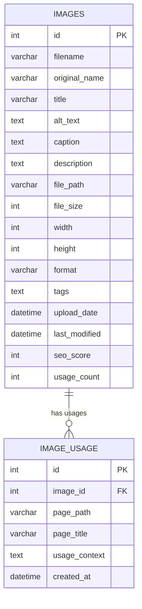
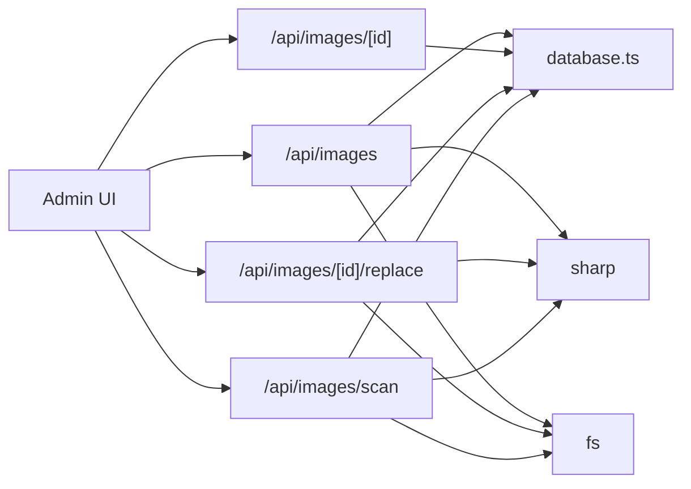

# Media Management API

<cite>
**Referenced Files in This Document**
- [src/app/api/images/route.ts](file://src/app/api/images/route.ts)
- [src/app/api/images/[id]/route.ts](file://src/app/api/images/[id]/route.ts)
- [src/app/api/images/[id]/replace/route.ts](file://src/app/api/images/[id]/replace/route.ts)
- [src/app/api/images/scan/route.ts](file://src/app/api/images/scan/route.ts)
- [src/lib/database.ts](file://src/lib/database.ts)
- [src/lib/image-tracker.ts](file://src/lib/image-tracker.ts)
- [scripts/init-database.js](file://scripts/init-database.js)
- [IMAGE_MANAGEMENT_SETUP.md](file://IMAGE_MANAGEMENT_SETUP.md)
</cite>

## Table of Contents
1. [Introduction](#introduction)
2. [Project Structure](#project-structure)
3. [Core Components](#core-components)
4. [Architecture Overview](#architecture-overview)
5. [Detailed Component Analysis](#detailed-component-analysis)
6. [Dependency Analysis](#dependency-analysis)
7. [Performance Considerations](#performance-considerations)
8. [Troubleshooting Guide](#troubleshooting-guide)
9. [Conclusion](#conclusion)
10. [Appendices](#appendices)

## Introduction
This document provides comprehensive API documentation for the media management endpoints that power the Image Management Dashboard. It covers:
- Image upload via multipart/form-data
- Retrieval, updates, and deletion of individual images
- Replacement of existing images while preserving metadata
- Scanning existing images to populate the database
- Request/response schemas for image metadata, optimization parameters, and usage tracking
- Sharp image processing integration for format conversion, resizing, and compression
- Examples of batch operations, usage analytics, and cleanup procedures
- Security measures for file uploads, virus scanning, and access control
- CDN integration and performance considerations
- Gallery management, thumbnail generation, and responsive image serving

## Project Structure
The media management API is implemented as Next.js App Router API routes backed by a SQLite database and Sharp for image metadata extraction. The frontend integrates with these endpoints to provide a dashboard for managing images and SEO.

**Diagram sources**
- [src/app/api/images/route.ts](file://src/app/api/images/route.ts#L1-L182)
- [src/app/api/images/[id]/route.ts](file://src/app/api/images/[id]/route.ts#L1-L158)
- [src/app/api/images/[id]/replace/route.ts](file://src/app/api/images/[id]/replace/route.ts#L1-L124)
- [src/app/api/images/scan/route.ts](file://src/app/api/images/scan/route.ts#L1-L124)
- [src/lib/database.ts](file://src/lib/database.ts#L1-L255)

**Section sources**
- [src/app/api/images/route.ts](file://src/app/api/images/route.ts#L1-L182)
- [src/app/api/images/[id]/route.ts](file://src/app/api/images/[id]/route.ts#L1-L158)
- [src/app/api/images/[id]/replace/route.ts](file://src/app/api/images/[id]/replace/route.ts#L1-L124)
- [src/app/api/images/scan/route.ts](file://src/app/api/images/scan/route.ts#L1-L124)
- [src/lib/database.ts](file://src/lib/database.ts#L1-L255)

## Core Components
- API Routes: Implement CRUD operations for images, replacement, and scanning.
- Database Library: Provides SQLite-backed persistence with typed interfaces for records.
- Image Tracker: Frontend utility to track image usage across pages and maintain analytics.
- Initialization Script: Creates the SQLite database and tables.

Key responsibilities:
- Validate and sanitize uploads
- Extract image metadata using Sharp
- Maintain usage tracking across pages
- Enforce file type and size limits
- Provide paginated and searchable listings

**Section sources**
- [src/lib/database.ts](file://src/lib/database.ts#L18-L81)
- [src/lib/image-tracker.ts](file://src/lib/image-tracker.ts#L1-L95)
- [scripts/init-database.js](file://scripts/init-database.js#L1-L120)

## Architecture Overview
The API follows a layered architecture:
- Presentation Layer: Next.js App Router API handlers
- Domain Layer: Business logic for uploads, replacements, scanning, and metadata extraction
- Persistence Layer: SQLite database with typed interfaces
- Image Processing: Sharp for metadata extraction

**Diagram sources**
- [src/app/api/images/route.ts](file://src/app/api/images/route.ts#L77-L182)
- [src/lib/database.ts](file://src/lib/database.ts#L214-L254)

## Detailed Component Analysis

### Image Listing and Upload Endpoint
- Endpoint: GET /api/images and POST /api/images
- Purpose: Paginated listing with search and sorting; upload new images via multipart/form-data

Request parameters (GET):
- page: integer (default: 1)
- limit: integer (default: 20)
- search: string (full-text search across filename, title, alt_text, tags)
- sortBy: string (upload_date, filename, file_size, seo_score, usage_count)
- sortOrder: string (ASC or DESC)

Response schema:
- images: array of image records
- pagination: { page, limit, total, totalPages }

Upload payload (multipart/form-data):
- file: binary image file
- title: optional string
- alt_text: optional string
- caption: optional string
- description: optional string
- tags: optional string

Validation:
- Allowed types: jpeg, jpg, png, gif, webp, svg+xml
- Max size: 10 MB
- Dimensions extracted via Sharp for non-SVG images

Optimization parameters:
- SEO score computed from presence of title, alt_text, caption, description, tags
- Width/height stored for all images except SVG

**Section sources**
- [src/app/api/images/route.ts](file://src/app/api/images/route.ts#L16-L75)
- [src/app/api/images/route.ts](file://src/app/api/images/route.ts#L77-L182)
- [src/lib/database.ts](file://src/lib/database.ts#L18-L45)

### Individual Image Endpoint
- Endpoint: GET /api/images/[id], PUT /api/images/[id], DELETE /api/images/[id]
- Purpose: Retrieve image details with usage history, update metadata, delete image and file

GET response schema:
- image: image record
- usage: array of usage records ordered by created_at desc

PUT request body:
- title, alt_text, caption, description, tags

PUT response:
- message: success message
- image: updated image record

DELETE:
- Removes usage records, image record, and physical file from public/uploads

Usage tracking:
- Usage records include page_path, page_title, usage_context, created_at

**Section sources**
- [src/app/api/images/[id]/route.ts](file://src/app/api/images/[id]/route.ts#L16-L53)
- [src/app/api/images/[id]/route.ts](file://src/app/api/images/[id]/route.ts#L55-L116)
- [src/app/api/images/[id]/route.ts](file://src/app/api/images/[id]/route.ts#L118-L158)
- [src/lib/database.ts](file://src/lib/database.ts#L38-L45)

### Image Replacement Endpoint
- Endpoint: POST /api/images/[id]/replace
- Purpose: Replace an existing image file while preserving metadata

Request:
- multipart/form-data with field file containing the new image

Validation and processing:
- Validates file type and size
- Deletes old file from disk
- Generates unique filename and writes new file to public/uploads
- Extracts dimensions via Sharp (non-SVG)
- Updates database with new filename, path, size, dimensions, format

Response:
- message: success message
- image: updated image record

**Section sources**
- [src/app/api/images/[id]/replace/route.ts](file://src/app/api/images/[id]/replace/route.ts#L16-L124)

### Scanning Endpoint
- Endpoint: POST /api/images/scan
- Purpose: Discover existing images in public/assets/img and public/uploads and add them to the database

Processing:
- Recursively scans directories for supported extensions (.jpg, .jpeg, .png, .gif, .webp, .svg)
- Skips duplicates based on file_path
- Extracts dimensions via Sharp for non-SVG images
- Inserts records with default empty metadata and zero SEO score

Response:
- message: completion message
- scannedCount: number of images added
- images: array of basic info for newly added images

**Section sources**
- [src/app/api/images/scan/route.ts](file://src/app/api/images/scan/route.ts#L16-L124)

### Usage Tracking and Analytics
- Frontend tracking utility:
  - Scans page for images and posts usage records to /api/images/[id]/usage
  - Supports React hooks and component wrappers for automatic tracking
- Backend usage model:
  - Tracks page_path, page_title, usage_context, created_at
  - Aggregates usage_count during listing queries

**Section sources**
- [src/lib/image-tracker.ts](file://src/lib/image-tracker.ts#L1-L95)
- [src/app/api/images/route.ts](file://src/app/api/images/route.ts#L54-L59)

### Database Schema
Core tables:
- images: stores metadata, file path, dimensions, format, SEO score, timestamps
- image_usage: tracks where each image is used across pages

**Diagram sources**
- [src/lib/database.ts](file://src/lib/database.ts#L105-L139)

**Section sources**
- [src/lib/database.ts](file://src/lib/database.ts#L105-L139)

## Dependency Analysis
- Next.js App Router API routes depend on:
  - Database library for persistence
  - Sharp for image metadata extraction
  - Node fs for file system operations
- Frontend depends on:
  - API endpoints for CRUD operations
  - Image tracker utility for usage analytics

**Diagram sources**
- [src/app/api/images/route.ts](file://src/app/api/images/route.ts#L1-L182)
- [src/app/api/images/[id]/route.ts](file://src/app/api/images/[id]/route.ts#L1-L158)
- [src/app/api/images/[id]/replace/route.ts](file://src/app/api/images/[id]/replace/route.ts#L1-L124)
- [src/app/api/images/scan/route.ts](file://src/app/api/images/scan/route.ts#L1-L124)
- [src/lib/database.ts](file://src/lib/database.ts#L1-L255)

**Section sources**
- [src/app/api/images/route.ts](file://src/app/api/images/route.ts#L1-L182)
- [src/app/api/images/[id]/route.ts](file://src/app/api/images/[id]/route.ts#L1-L158)
- [src/app/api/images/[id]/replace/route.ts](file://src/app/api/images/[id]/replace/route.ts#L1-L124)
- [src/app/api/images/scan/route.ts](file://src/app/api/images/scan/route.ts#L1-L124)
- [src/lib/database.ts](file://src/lib/database.ts#L1-L255)

## Performance Considerations
- Image metadata extraction: Offload to Sharp only when necessary; cache dimensions where feasible.
- File I/O: Ensure public/uploads directory is on fast storage; consider moving to object storage for scale.
- Database queries: Use indexed columns for search and sorting; avoid N+1 queries by precomputing usage counts.
- Pagination: Always use limit and offset to prevent large result sets.
- CDN integration: Serve images from a CDN to reduce origin load and improve global latency.
- Compression: Enable lossless/lossy compression based on format; adjust quality per use case.
- Thumbnails: Pre-generate common sizes and serve via responsive image attributes.

[No sources needed since this section provides general guidance]

## Troubleshooting Guide
Common issues and resolutions:
- Database not initialized: Run the initialization script to create tables.
- Upload failures: Verify file type and size constraints; check write permissions for public/uploads.
- Missing dimensions: Ensure Sharp is installed; some formats may not yield metadata.
- Usage tracking not appearing: Confirm frontend tracking is enabled and network requests succeed.

Security and access control:
- Authentication: All operations require admin authentication.
- File validation: Enforce allowed types and size limits.
- Sanitization: Validate and sanitize all inputs; protect against path traversal.
- Permissions: Ensure data/ and public/uploads are writable by the runtime.

**Section sources**
- [IMAGE_MANAGEMENT_SETUP.md](file://IMAGE_MANAGEMENT_SETUP.md#L145-L166)
- [src/app/api/images/route.ts](file://src/app/api/images/route.ts#L94-L103)
- [src/app/api/images/[id]/replace/route.ts](file://src/app/api/images/[id]/replace/route.ts#L43-L52)

## Conclusion
The media management API provides a robust foundation for uploading, organizing, optimizing, and tracking images. By leveraging Sharp for metadata extraction, SQLite for persistence, and frontend tracking utilities, it supports SEO optimization, usage analytics, and scalable image delivery. Extending the system with CDN integration, advanced compression, and automated cleanup will further enhance performance and maintainability.

[No sources needed since this section summarizes without analyzing specific files]

## Appendices

### API Definitions and Schemas

- GET /api/images
  - Query parameters: page, limit, search, sortBy, sortOrder
  - Response: { images[], pagination: { page, limit, total, totalPages } }

- POST /api/images
  - Form fields: file*, title, alt_text, caption, description, tags
  - Validation: type, size ≤ 10MB
  - Response: { message, image }

- GET /api/images/[id]
  - Response: { image, usage[] }

- PUT /api/images/[id]
  - Body: { title, alt_text, caption, description, tags }
  - Response: { message, image }

- DELETE /api/images/[id]
  - Response: { message }

- POST /api/images/[id]/replace
  - Form field: file*
  - Response: { message, image }

- POST /api/images/scan
  - Response: { message, scannedCount, images[] }

**Section sources**
- [src/app/api/images/route.ts](file://src/app/api/images/route.ts#L16-L75)
- [src/app/api/images/route.ts](file://src/app/api/images/route.ts#L77-L182)
- [src/app/api/images/[id]/route.ts](file://src/app/api/images/[id]/route.ts#L16-L53)
- [src/app/api/images/[id]/route.ts](file://src/app/api/images/[id]/route.ts#L55-L116)
- [src/app/api/images/[id]/route.ts](file://src/app/api/images/[id]/route.ts#L118-L158)
- [src/app/api/images/[id]/replace/route.ts](file://src/app/api/images/[id]/replace/route.ts#L16-L124)
- [src/app/api/images/scan/route.ts](file://src/app/api/images/scan/route.ts#L16-L124)

### Example Workflows

- Batch image operations:
  - Use the upload modal to select multiple files; the frontend sends separate POST requests per file.
  - After upload, update metadata in bulk via the edit modal.

- Usage analytics:
  - The frontend scans the page for images and posts usage records to the backend.
  - Aggregate usage_count during listing to inform cleanup decisions.

- Cleanup procedures:
  - Identify unused images by reviewing usage_count and usage records.
  - Delete images via DELETE /api/images/[id]; the endpoint removes file and records.

- Optimization workflows:
  - Replace images with optimized versions using POST /api/images/[id]/replace.
  - Monitor SEO score improvements after metadata updates.

- CDN integration:
  - Serve images from a CDN by updating file_path to CDN URLs.
  - Maintain original files locally for backup and reprocessing.

- Responsive image serving:
  - Pre-generate thumbnails and variants; serve via srcset and sizes attributes.
  - Use modern formats (AVIF/WebP) when supported by clients.

**Section sources**
- [src/lib/image-tracker.ts](file://src/lib/image-tracker.ts#L45-L80)
- [src/app/api/images/route.ts](file://src/app/api/images/route.ts#L54-L59)
- [src/app/api/images/[id]/route.ts](file://src/app/api/images/[id]/route.ts#L118-L158)
- [src/app/api/images/[id]/replace/route.ts](file://src/app/api/images/[id]/replace/route.ts#L74-L118)