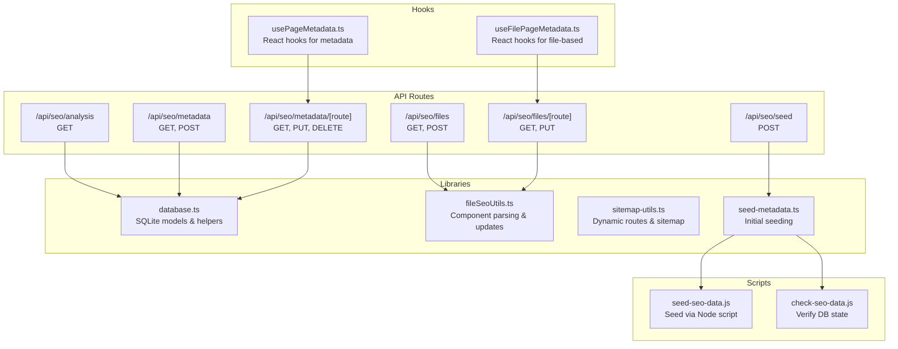
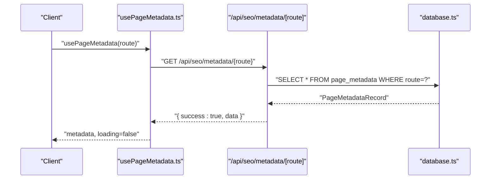
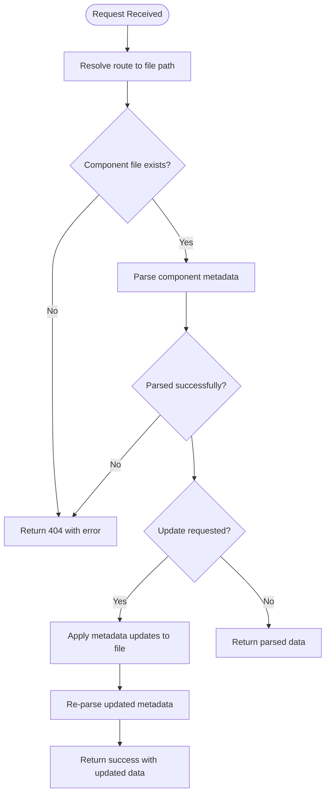
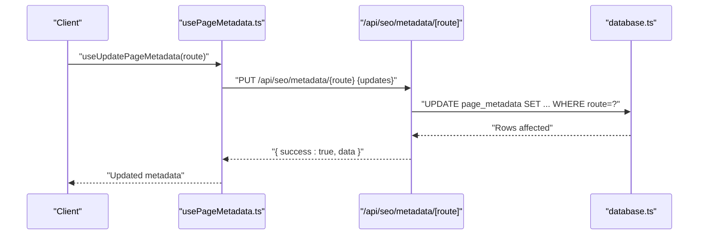
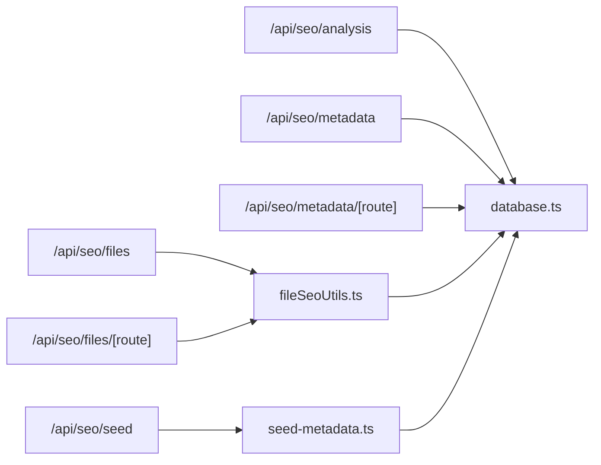

# SEO Management API

<cite>
**Referenced Files in This Document**
- [route.ts](file://src/app/api/seo/analysis/route.ts)
- [route.ts](file://src/app/api/seo/metadata/[route]/route.ts)
- [route.ts](file://src/app/api/seo/metadata/route.ts)
- [route.ts](file://src/app/api/seo/files/[route]/route.ts)
- [route.ts](file://src/app/api/seo/files/route.ts)
- [route.ts](file://src/app/api/seo/seed/route.ts)
- [database.ts](file://src/lib/database.ts)
- [fileSeoUtils.ts](file://src/lib/fileSeoUtils.ts)
- [sitemap-utils.ts](file://src/lib/sitemap-utils.ts)
- [seed-metadata.ts](file://src/lib/seed-metadata.ts)
- [seed-seo-data.js](file://scripts/seed-seo-data.js)
- [check-seo-data.js](file://scripts/check-seo-data.js)
- [usePageMetadata.ts](file://src/hooks/usePageMetadata.ts)
- [useFilePageMetadata.ts](file://src/hooks/useFilePageMetadata.ts)
</cite>

## Table of Contents
1. [Introduction](#introduction)
2. [Project Structure](#project-structure)
3. [Core Components](#core-components)
4. [Architecture Overview](#architecture-overview)
5. [Detailed Component Analysis](#detailed-component-analysis)
6. [Dependency Analysis](#dependency-analysis)
7. [Performance Considerations](#performance-considerations)
8. [Troubleshooting Guide](#troubleshooting-guide)
9. [Conclusion](#conclusion)
10. [Appendices](#appendices)

## Introduction
This document provides comprehensive API documentation for the SEO management endpoints powering the website’s SEO capabilities. It covers:
- SEO analysis endpoint for performance metrics and optimization suggestions
- File-based SEO management for bulk operations against React components
- Metadata endpoint for page-specific SEO data retrieval and updates
- Seeding endpoint for initial SEO setup
It also documents request/response schemas, automated SEO features, meta tag generation, sitemap creation, and integration points with analytics and monitoring tools.

## Project Structure
The SEO management system is organized around Next.js App Router API routes under src/app/api/seo, backed by a SQLite database and utility libraries for file-based metadata operations and sitemap generation.

**Diagram sources**
- [route.ts](file://src/app/api/seo/analysis/route.ts#L1-L120)
- [route.ts](file://src/app/api/seo/metadata/route.ts#L1-L134)
- [route.ts](file://src/app/api/seo/metadata/[route]/route.ts#L1-L174)
- [route.ts](file://src/app/api/seo/files/route.ts#L1-L90)
- [route.ts](file://src/app/api/seo/files/[route]/route.ts#L1-L82)
- [route.ts](file://src/app/api/seo/seed/route.ts#L1-L19)
- [database.ts](file://src/lib/database.ts#L62-L81)
- [fileSeoUtils.ts](file://src/lib/fileSeoUtils.ts#L1-L329)
- [sitemap-utils.ts](file://src/lib/sitemap-utils.ts#L1-L196)
- [seed-metadata.ts](file://src/lib/seed-metadata.ts#L1-L93)
- [seed-seo-data.js](file://scripts/seed-seo-data.js#L1-L171)
- [check-seo-data.js](file://scripts/check-seo-data.js#L1-L59)
- [usePageMetadata.ts](file://src/hooks/usePageMetadata.ts#L1-L218)
- [useFilePageMetadata.ts](file://src/hooks/useFilePageMetadata.ts#L1-L225)

**Section sources**
- [route.ts](file://src/app/api/seo/analysis/route.ts#L1-L120)
- [route.ts](file://src/app/api/seo/metadata/route.ts#L1-L134)
- [route.ts](file://src/app/api/seo/metadata/[route]/route.ts#L1-L174)
- [route.ts](file://src/app/api/seo/files/route.ts#L1-L90)
- [route.ts](file://src/app/api/seo/files/[route]/route.ts#L1-L82)
- [route.ts](file://src/app/api/seo/seed/route.ts#L1-L19)
- [database.ts](file://src/lib/database.ts#L62-L81)
- [fileSeoUtils.ts](file://src/lib/fileSeoUtils.ts#L1-L329)
- [sitemap-utils.ts](file://src/lib/sitemap-utils.ts#L1-L196)
- [seed-metadata.ts](file://src/lib/seed-metadata.ts#L1-L93)
- [seed-seo-data.js](file://scripts/seed-seo-data.js#L1-L171)
- [check-seo-data.js](file://scripts/check-seo-data.js#L1-L59)
- [usePageMetadata.ts](file://src/hooks/usePageMetadata.ts#L1-L218)
- [useFilePageMetadata.ts](file://src/hooks/useFilePageMetadata.ts#L1-L225)

## Core Components
- SEO Analysis Endpoint: Computes SEO metrics and issue counts for images stored in the database.
- Metadata Endpoint: CRUD operations for page metadata stored in the database.
- File-Based SEO Management: Reads and updates metadata embedded in React components.
- Seeding Endpoint: Initializes page metadata in the database.
- Database Models: Defines the page_metadata table and related helpers.
- File Utilities: Parses and updates component metadata and generates Next.js metadata.
- Sitemap Utilities: Discovers dynamic routes and computes priorities for sitemaps.
- Scripts: Seed and verification utilities for database initialization.

**Section sources**
- [route.ts](file://src/app/api/seo/analysis/route.ts#L14-L120)
- [route.ts](file://src/app/api/seo/metadata/route.ts#L15-L134)
- [route.ts](file://src/app/api/seo/metadata/[route]/route.ts#L15-L174)
- [route.ts](file://src/app/api/seo/files/route.ts#L5-L90)
- [route.ts](file://src/app/api/seo/files/[route]/route.ts#L5-L82)
- [route.ts](file://src/app/api/seo/seed/route.ts#L4-L19)
- [database.ts](file://src/lib/database.ts#L62-L81)
- [fileSeoUtils.ts](file://src/lib/fileSeoUtils.ts#L39-L115)
- [sitemap-utils.ts](file://src/lib/sitemap-utils.ts#L152-L181)
- [seed-seo-data.js](file://scripts/seed-seo-data.js#L14-L130)
- [check-seo-data.js](file://scripts/check-seo-data.js#L14-L57)

## Architecture Overview
The SEO management API follows a layered architecture:
- API Layer: Next.js App Router handlers expose REST-like endpoints.
- Domain Layer: Libraries encapsulate business logic (parsing, updating, seeding).
- Persistence Layer: SQLite database stores page metadata and image records.
- Frontend Integration: React hooks consume the endpoints for UI operations.

**Diagram sources**
- [usePageMetadata.ts](file://src/hooks/usePageMetadata.ts#L18-L51)
- [route.ts](file://src/app/api/seo/metadata/[route]/route.ts#L16-L49)
- [database.ts](file://src/lib/database.ts#L228-L240)

**Section sources**
- [usePageMetadata.ts](file://src/hooks/usePageMetadata.ts#L1-L218)
- [route.ts](file://src/app/api/seo/metadata/[route]/route.ts#L1-L174)
- [database.ts](file://src/lib/database.ts#L214-L254)

## Detailed Component Analysis

### SEO Analysis Endpoint
- Path: /api/seo/analysis
- Method: GET
- Purpose: Returns SEO performance metrics and actionable recommendations for images.
- Behavior:
  - Loads all images from the images table.
  - Aggregates totals, averages, and distribution across score ranges.
  - Counts issues (missing alt/title/caption/description/tags, large file size, low resolution).
  - Generates recommendations based on detected issues.
  - Returns top examples of images with specific issues.

Response Schema
- analysis
  - totalImages: integer
  - averageSeoScore: integer
  - seoDistribution: object
    - excellent: integer (score 80–100)
    - good: integer (score 60–79)
    - fair: integer (score 40–59)
    - poor: integer (score 0–39)
  - issues: object
    - missingAltText: integer
    - missingTitle: integer
    - missingCaption: integer
    - missingDescription: integer
    - missingTags: integer
    - largeFileSize: integer (threshold: >2MB)
    - lowResolution: integer (threshold: width<800 or height<600)
  - recommendations: array of string
- imagesWithIssues
  - missingAltText: array of image records (limited)
  - missingTitle: array of image records (limited)
  - lowSeoScore: array of image records (limited)
  - largeFiles: array of image records (limited)

Notes
- Uses force-dynamic to bypass caching for accurate runtime analysis.
- Issues thresholds are hard-coded for demonstration; production systems may externalize thresholds.

**Section sources**
- [route.ts](file://src/app/api/seo/analysis/route.ts#L14-L120)
- [database.ts](file://src/lib/database.ts#L18-L36)

### File-Based SEO Management
Endpoints
- GET /api/seo/files
  - Purpose: List all component-based pages with parsed metadata.
  - Query parameters: page, limit, search (route/page_name/title).
  - Pagination: currentPage, totalPages, totalCount, hasNext, hasPrev.
- POST /api/seo/files
  - Purpose: Update metadata for an existing component route.
  - Body: PageMetadataRecord fields (route required).
- GET /api/seo/files/[route]
  - Purpose: Retrieve parsed metadata for a specific route.
- PUT /api/seo/files/[route]
  - Purpose: Update metadata for a specific route.

Processing Logic
- Route-to-file mapping is resolved using ROUTE_TO_FILE_MAP.
- parseComponentMetadata reads component files and extracts metadata via regex.
- updateComponentMetadata updates either SEOHead props or Next.js metadata export depending on component usage.
- convertToNextJsMetadata maps PageMetadataRecord fields to Next.js metadata format (title, description, keywords, robots, openGraph, twitter, canonical).

Response Schema
- success: boolean
- data: PageMetadataRecord or array of PageMetadataRecord
- pagination: object (for list endpoints)
- error: string (when present)

**Diagram sources**
- [route.ts](file://src/app/api/seo/files/[route]/route.ts#L5-L82)
- [route.ts](file://src/app/api/seo/files/route.ts#L5-L90)
- [fileSeoUtils.ts](file://src/lib/fileSeoUtils.ts#L120-L178)
- [fileSeoUtils.ts](file://src/lib/fileSeoUtils.ts#L183-L298)

**Section sources**
- [route.ts](file://src/app/api/seo/files/route.ts#L5-L90)
- [route.ts](file://src/app/api/seo/files/[route]/route.ts#L5-L82)
- [fileSeoUtils.ts](file://src/lib/fileSeoUtils.ts#L6-L37)
- [fileSeoUtils.ts](file://src/lib/fileSeoUtils.ts#L120-L178)
- [fileSeoUtils.ts](file://src/lib/fileSeoUtils.ts#L183-L298)
- [fileSeoUtils.ts](file://src/lib/fileSeoUtils.ts#L47-L115)

### Metadata Endpoint (Database-backed)
Endpoints
- GET /api/seo/metadata
  - Purpose: Paginated listing of page metadata.
  - Query parameters: page, limit, search (route/page_name/title).
- POST /api/seo/metadata
  - Purpose: Create new page metadata.
  - Body: Route and PageMetadataRecord fields (route and page_name required).
- GET /api/seo/metadata/[route]
  - Purpose: Retrieve metadata for a specific route.
- PUT /api/seo/metadata/[route]
  - Purpose: Update metadata for a specific route.
- DELETE /api/seo/metadata/[route]
  - Purpose: Delete metadata for a specific route.

Response Schema
- success: boolean
- data: PageMetadataRecord or array of PageMetadataRecord
- pagination: object (for list endpoint)
- message: string (on success)
- error: string (on failure)

**Diagram sources**
- [usePageMetadata.ts](file://src/hooks/usePageMetadata.ts#L141-L177)
- [route.ts](file://src/app/api/seo/metadata/[route]/route.ts#L51-L135)
- [database.ts](file://src/lib/database.ts#L214-L226)

**Section sources**
- [route.ts](file://src/app/api/seo/metadata/route.ts#L15-L134)
- [route.ts](file://src/app/api/seo/metadata/[route]/route.ts#L15-L174)
- [database.ts](file://src/lib/database.ts#L62-L81)
- [usePageMetadata.ts](file://src/hooks/usePageMetadata.ts#L137-L177)

### Seeding Endpoint
- Path: /api/seo/seed
- Method: POST
- Purpose: Initialize page metadata for core routes.
- Behavior:
  - Seeds predefined pages (home, about, contact, services, web development, SEO) into the page_metadata table.
  - Skips duplicates using a uniqueness constraint on route.

Response Schema
- success: boolean
- message: string

**Section sources**
- [route.ts](file://src/app/api/seo/seed/route.ts#L4-L19)
- [seed-metadata.ts](file://src/lib/seed-metadata.ts#L3-L93)
- [seed-seo-data.js](file://scripts/seed-seo-data.js#L14-L130)
- [check-seo-data.js](file://scripts/check-seo-data.js#L14-L57)

### Database Models and Schemas
Page Metadata Model
- Fields: route (unique), page_name, title, meta_title, meta_description, keywords, og_title, og_description, og_image, canonical_url, robots_index, robots_follow, twitter_title, twitter_description, twitter_image, timestamps.
- Related tables: images, image_usage (for image SEO), blogs (for content SEO).

Sitemap Utilities
- getBlogPosts, getProjectRoutes, getTeamMemberRoutes: Discover dynamic routes from the filesystem.
- getRouteMetadata: Assign priority and change frequency based on route segments.
- getLastModified: Placeholder returning current date; can be extended to read file timestamps.

**Section sources**
- [database.ts](file://src/lib/database.ts#L62-L81)
- [database.ts](file://src/lib/database.ts#L159-L181)
- [sitemap-utils.ts](file://src/lib/sitemap-utils.ts#L13-L60)
- [sitemap-utils.ts](file://src/lib/sitemap-utils.ts#L62-L105)
- [sitemap-utils.ts](file://src/lib/sitemap-utils.ts#L107-L150)
- [sitemap-utils.ts](file://src/lib/sitemap-utils.ts#L152-L181)
- [sitemap-utils.ts](file://src/lib/sitemap-utils.ts#L183-L196)

### Automated SEO Features and Integrations
- Meta Tag Generation:
  - convertToNextJsMetadata maps PageMetadataRecord to Next.js metadata exports (title, description, keywords, robots, openGraph, twitter, canonical).
- Structured Data:
  - Open Graph and Twitter metadata are populated from PageMetadataRecord fields.
- Sitemap Creation:
  - Dynamic route discovery and metadata assignment enable automated sitemap generation.
- Analytics Reporting:
  - Integration points for analytics can be added by extending the metadata model and API responses.
- Performance Monitoring:
  - SEO analysis endpoint surfaces performance indicators (average score, distribution, recommendations).

**Section sources**
- [fileSeoUtils.ts](file://src/lib/fileSeoUtils.ts#L47-L115)
- [sitemap-utils.ts](file://src/lib/sitemap-utils.ts#L152-L181)

## Dependency Analysis
The following diagram shows key dependencies among components:

**Diagram sources**
- [route.ts](file://src/app/api/seo/analysis/route.ts#L1-L120)
- [route.ts](file://src/app/api/seo/metadata/route.ts#L1-L134)
- [route.ts](file://src/app/api/seo/metadata/[route]/route.ts#L1-L174)
- [route.ts](file://src/app/api/seo/files/route.ts#L1-L90)
- [route.ts](file://src/app/api/seo/files/[route]/route.ts#L1-L82)
- [route.ts](file://src/app/api/seo/seed/route.ts#L1-L19)
- [database.ts](file://src/lib/database.ts#L62-L81)
- [fileSeoUtils.ts](file://src/lib/fileSeoUtils.ts#L1-L329)
- [seed-metadata.ts](file://src/lib/seed-metadata.ts#L1-L93)

**Section sources**
- [route.ts](file://src/app/api/seo/analysis/route.ts#L1-L120)
- [route.ts](file://src/app/api/seo/metadata/route.ts#L1-L134)
- [route.ts](file://src/app/api/seo/metadata/[route]/route.ts#L1-L174)
- [route.ts](file://src/app/api/seo/files/route.ts#L1-L90)
- [route.ts](file://src/app/api/seo/files/[route]/route.ts#L1-L82)
- [route.ts](file://src/app/api/seo/seed/route.ts#L1-L19)
- [database.ts](file://src/lib/database.ts#L62-L81)
- [fileSeoUtils.ts](file://src/lib/fileSeoUtils.ts#L1-L329)
- [seed-metadata.ts](file://src/lib/seed-metadata.ts#L1-L93)

## Performance Considerations
- Force-dynamic endpoints: Analysis and metadata endpoints disable caching to reflect live data; consider adding selective caching or ETags for improved performance.
- Pagination: Use limit and page parameters to avoid large payloads.
- Regex parsing: Component parsing relies on regex; ensure patterns remain robust and efficient.
- Database queries: Prefer indexed columns (route) and limit result sets for large datasets.
- Recommendations: Aggregate metrics server-side to minimize client-side computation.

[No sources needed since this section provides general guidance]

## Troubleshooting Guide
Common Issues and Resolutions
- Database not initialized:
  - Ensure the database is created and tables exist before calling endpoints.
  - Use the seeding endpoint to initialize page metadata.
- Route not found:
  - Verify the route exists in ROUTE_TO_FILE_MAP for file-based operations.
  - Confirm the component file exists at the mapped path.
- Parsing failures:
  - Check component syntax for metadata export or SEOHead props.
  - Validate regex patterns if customizing parsing logic.
- Duplicate route errors:
  - The POST metadata endpoint rejects duplicate routes; update instead of create.

Verification Scripts
- Seed verification script checks for the existence of the page_metadata table and counts records.
- Use this to confirm successful seeding and database readiness.

**Section sources**
- [route.ts](file://src/app/api/seo/metadata/[route]/route.ts#L80-L91)
- [route.ts](file://src/app/api/seo/files/[route]/route.ts#L14-L19)
- [check-seo-data.js](file://scripts/check-seo-data.js#L14-L57)

## Conclusion
The SEO Management API provides a cohesive set of endpoints for analyzing SEO health, managing page metadata, and performing bulk file-based updates. With database-backed persistence and file-based utilities, it supports both traditional CMS-style workflows and component-driven metadata management. Extending the system with analytics integrations, structured data markup, and advanced performance monitoring aligns with the existing architecture.

[No sources needed since this section summarizes without analyzing specific files]

## Appendices

### Request/Response Schemas

SEO Analysis (GET /api/seo/analysis)
- Response:
  - analysis: object
    - totalImages: integer
    - averageSeoScore: integer
    - seoDistribution: object
      - excellent: integer
      - good: integer
      - fair: integer
      - poor: integer
    - issues: object
      - missingAltText: integer
      - missingTitle: integer
      - missingCaption: integer
      - missingDescription: integer
      - missingTags: integer
      - largeFileSize: integer
      - lowResolution: integer
    - recommendations: array of string
  - imagesWithIssues: object
    - missingAltText: array of image records
    - missingTitle: array of image records
    - lowSeoScore: array of image records
    - largeFiles: array of image records

Page Metadata (GET /api/seo/metadata)
- Query parameters:
  - page: integer (default: 1)
  - limit: integer (default: 50)
  - search: string (optional)
- Response:
  - data: array of PageMetadataRecord
  - pagination: object with currentPage, totalPages, totalCount, hasNext, hasPrev

Create Metadata (POST /api/seo/metadata)
- Request body: PageMetadataRecord without id, created_at, updated_at
- Response:
  - data: PageMetadataRecord
  - message: string

Get Metadata (GET /api/seo/metadata/[route])
- Response:
  - data: PageMetadataRecord

Update Metadata (PUT /api/seo/metadata/[route])
- Request body: Partial PageMetadataRecord
- Response:
  - data: PageMetadataRecord
  - message: string

Delete Metadata (DELETE /api/seo/metadata/[route])
- Response:
  - message: string

File-Based Listing (GET /api/seo/files)
- Query parameters:
  - page: integer (default: 1)
  - limit: integer (default: 20)
  - search: string (optional)
- Response:
  - data: array of FileBasedPageMetadata
  - pagination: object with currentPage, totalPages, totalCount, hasNext, hasPrev

Create/Update File-Based Metadata (POST /api/seo/files, PUT /api/seo/files/[route])
- Request body: PageMetadataRecord (route required)
- Response:
  - data: FileBasedPageMetadata

Seed Initial Metadata (POST /api/seo/seed)
- Response:
  - message: string

### SEO Audit Workflow Example
- Step 1: Seed initial metadata
  - POST /api/seo/seed
- Step 2: Review SEO analysis
  - GET /api/seo/analysis
- Step 3: Audit page metadata
  - GET /api/seo/metadata
  - GET /api/seo/metadata/[route]
- Step 4: Update metadata as needed
  - PUT /api/seo/metadata/[route]
- Step 5: Bulk file-based updates
  - GET /api/seo/files
  - PUT /api/seo/files/[route]

### Content Optimization Procedures
- Optimize images:
  - Use SEO analysis to identify large files and low-resolution images.
  - Apply compression and appropriate dimensions.
- Enhance metadata:
  - Add alt text, titles, captions, and descriptions.
  - Configure canonical URLs and robots directives.
- Structured data:
  - Populate Open Graph and Twitter fields for social previews.

### Performance Monitoring
- Monitor average SEO score and distribution trends.
- Track recommendations and remediation progress.
- Integrate analytics to correlate SEO improvements with traffic metrics.

### Structured Data Markup and Social Integration
- Open Graph and Twitter metadata are automatically generated from PageMetadataRecord fields.
- Canonical URL management ensures proper indexing and prevents duplicate content issues.

### Internationalization Support
- Current implementation uses hardcoded locale for Open Graph (en_US).
- Extend PageMetadataRecord to support localized fields and dynamic locale selection.

### Examples of Bulk Operations
- Bulk file-based updates:
  - Use GET /api/seo/files with pagination and search to identify pages needing updates.
  - Iterate and call PUT /api/seo/files/[route] per page.
- Duplicate content detection:
  - Compare canonical URLs and meta descriptions across routes.
  - Use search parameter to filter by page_name or route.

### Canonical URL Management
- Set canonical_url in PageMetadataRecord to guide search engines.
- Ensure consistency across metadata endpoints and sitemap generation.

### Integration with Google Search Console and Analytics
- Extend PageMetadataRecord to include analytics identifiers.
- Add endpoints to fetch analytics reports and surface insights alongside SEO data.

**Section sources**
- [route.ts](file://src/app/api/seo/analysis/route.ts#L14-L120)
- [route.ts](file://src/app/api/seo/metadata/route.ts#L15-L134)
- [route.ts](file://src/app/api/seo/metadata/[route]/route.ts#L15-L174)
- [route.ts](file://src/app/api/seo/files/route.ts#L5-L90)
- [route.ts](file://src/app/api/seo/files/[route]/route.ts#L5-L82)
- [route.ts](file://src/app/api/seo/seed/route.ts#L4-L19)
- [fileSeoUtils.ts](file://src/lib/fileSeoUtils.ts#L47-L115)
- [sitemap-utils.ts](file://src/lib/sitemap-utils.ts#L152-L181)
- [seed-metadata.ts](file://src/lib/seed-metadata.ts#L3-L93)
- [seed-seo-data.js](file://scripts/seed-seo-data.js#L14-L130)
- [check-seo-data.js](file://scripts/check-seo-data.js#L14-L57)