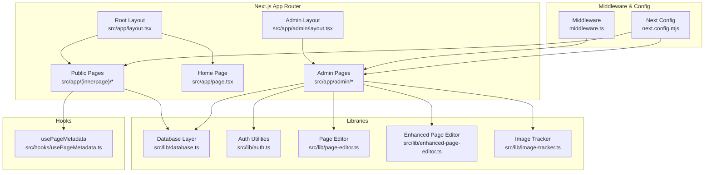
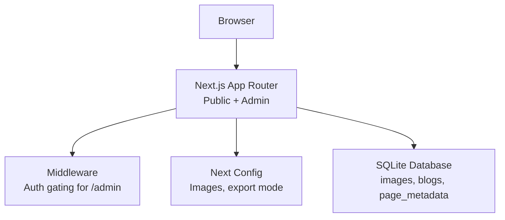
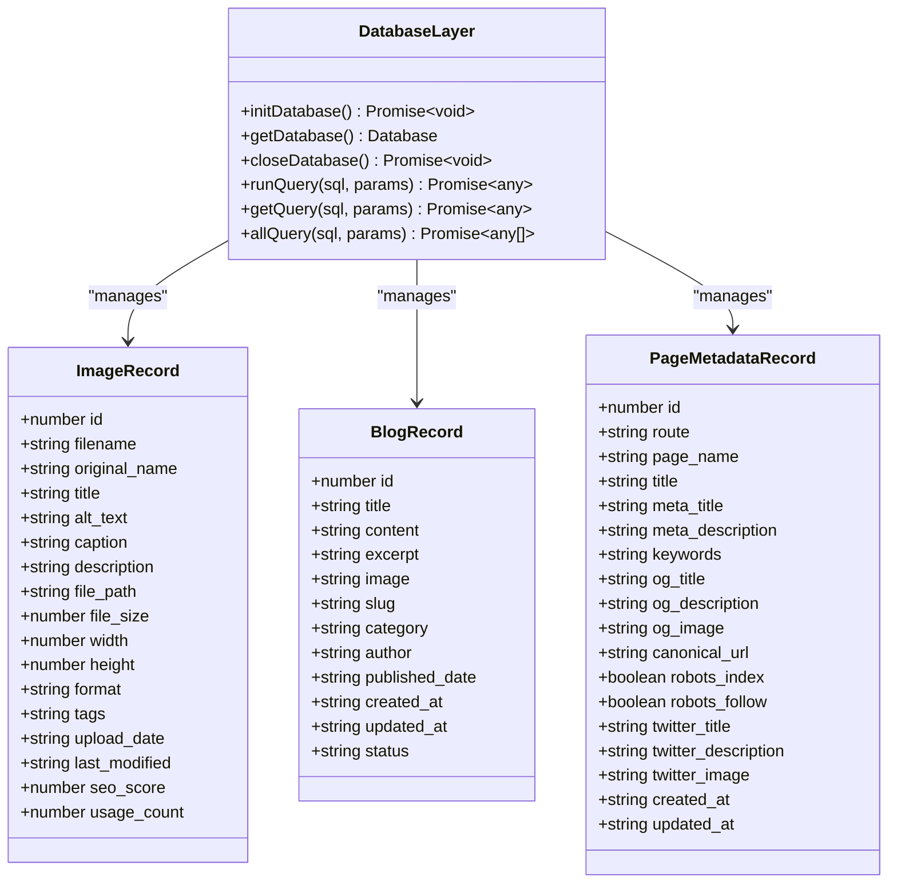
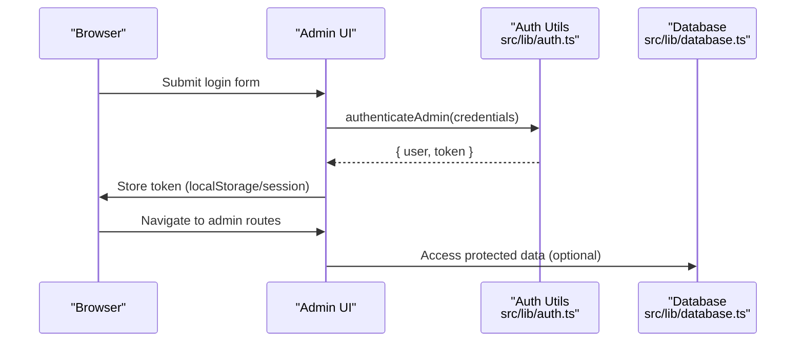
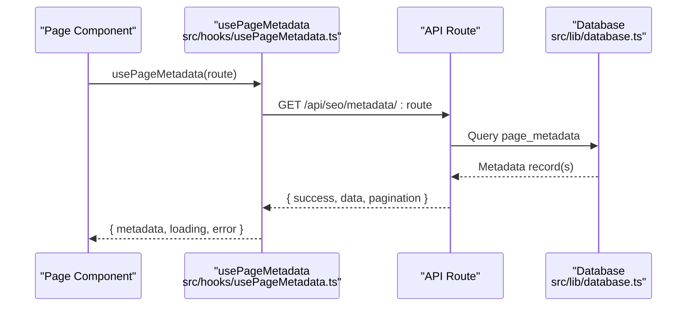
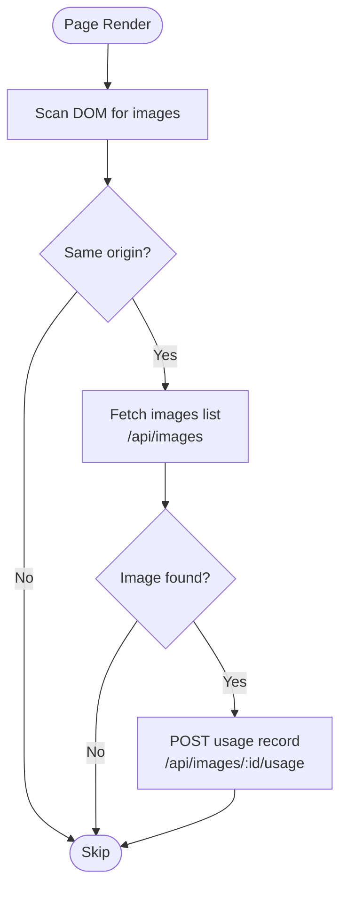
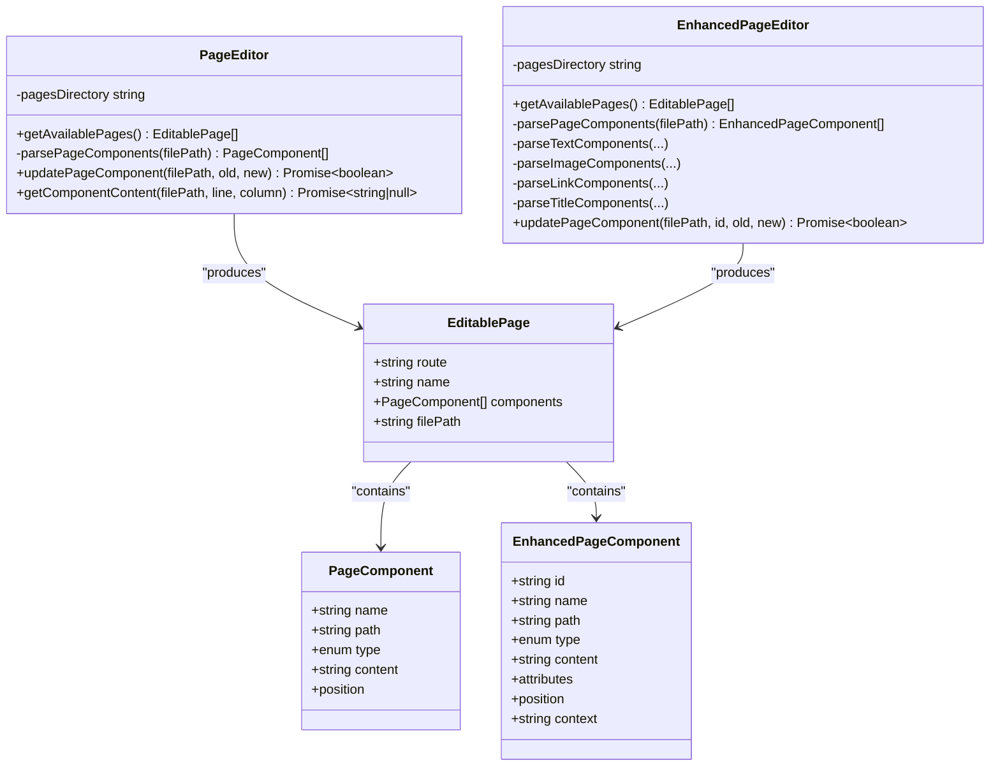
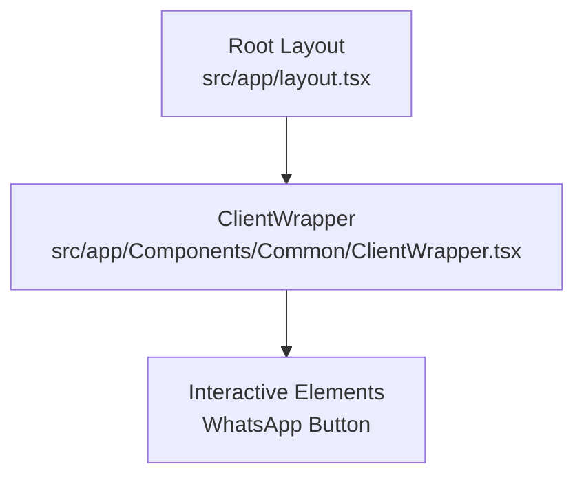
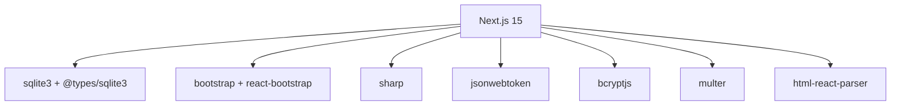

# Architecture Overview

<cite>
**Referenced Files in This Document**
- [package.json](file://package.json)
- [next.config.mjs](file://next.config.mjs)
- [middleware.ts](file://middleware.ts)
- [src/lib/database.ts](file://src/lib/database.ts)
- [src/app/layout.tsx](file://src/app/layout.tsx)
- [src/app/admin/layout.tsx](file://src/app/admin/layout.tsx)
- [src/app/page.tsx](file://src/app/page.tsx)
- [src/hooks/usePageMetadata.ts](file://src/hooks/usePageMetadata.ts)
- [src/lib/auth.ts](file://src/lib/auth.ts)
- [src/lib/image-tracker.ts](file://src/lib/image-tracker.ts)
- [src/lib/page-editor.ts](file://src/lib/page-editor.ts)
- [src/lib/enhanced-page-editor.ts](file://src/lib/enhanced-page-editor.ts)
- [src/app/Components/Common/ClientWrapper.tsx](file://src/app/Components/Common/ClientWrapper.tsx)
</cite>

## Table of Contents
1. [Introduction](#introduction)
2. [Project Structure](#project-structure)
3. [Core Components](#core-components)
4. [Architecture Overview](#architecture-overview)
5. [Detailed Component Analysis](#detailed-component-analysis)
6. [Dependency Analysis](#dependency-analysis)
7. [Performance Considerations](#performance-considerations)
8. [Troubleshooting Guide](#troubleshooting-guide)
9. [Conclusion](#conclusion)
10. [Appendices](#appendices)

## Introduction
This document describes the system architecture for attechglobal.com, a Next.js 15 marketing agency website implementing App Router with component-based design patterns and server-side rendering capabilities. The system supports a dual-layer architecture: a public website frontend and an admin CMS backend. It integrates a SQLite database for content and metadata, file-based content management via a page editor, and cross-cutting concerns such as authentication, SEO optimization, and image processing pipelines. The deployment targets include both static hosting and server-based environments, with configuration-driven behavior for images, exports, and performance.

## Project Structure
The project follows Next.js App Router conventions with a layered structure:
- Application shell and global layout under src/app
- Feature-specific pages grouped by route segments
- Shared components under src/app/Components
- Libraries for domain logic under src/lib
- Hooks for client-side data fetching under src/hooks
- Build and deployment configuration under next.config.mjs and scripts

**Diagram sources**
- [src/app/layout.tsx](file://src/app/layout.tsx#L14-L46)
- [src/app/admin/layout.tsx](file://src/app/admin/layout.tsx#L6-L22)
- [src/app/page.tsx](file://src/app/page.tsx#L24-L74)
- [src/lib/database.ts](file://src/lib/database.ts#L84-L184)
- [src/lib/auth.ts](file://src/lib/auth.ts#L62-L79)
- [src/lib/page-editor.ts](file://src/lib/page-editor.ts#L23-L75)
- [src/lib/enhanced-page-editor.ts](file://src/lib/enhanced-page-editor.ts#L26-L76)
- [src/lib/image-tracker.ts](file://src/lib/image-tracker.ts#L11-L43)
- [src/hooks/usePageMetadata.ts](file://src/hooks/usePageMetadata.ts#L13-L52)
- [middleware.ts](file://middleware.ts#L4-L14)
- [next.config.mjs](file://next.config.mjs#L5-L126)

**Section sources**
- [package.json](file://package.json#L1-L41)
- [next.config.mjs](file://next.config.mjs#L1-L129)
- [src/app/layout.tsx](file://src/app/layout.tsx#L1-L47)
- [src/app/admin/layout.tsx](file://src/app/admin/layout.tsx#L1-L23)
- [src/app/page.tsx](file://src/app/page.tsx#L1-L75)

## Core Components
- Root layout and global providers: Sets fonts, styles, and analytics scripts; wraps children with a client-side wrapper for interactive elements.
- Admin layout: Provides sidebar navigation and header for CMS operations.
- Home page: Composed of reusable components and SEO head management.
- Database abstraction: SQLite-backed with typed records for images, blogs, and page metadata.
- Authentication utilities: JWT-based admin authentication with token generation and verification.
- Page editors: File-based editors for extracting and updating page components.
- Image usage tracker: Client-side scanning and server-backed tracking of image usage per page.
- SEO hooks: Client-side hooks to fetch, paginate, and update page metadata via API endpoints.

**Section sources**
- [src/app/layout.tsx](file://src/app/layout.tsx#L1-L47)
- [src/app/admin/layout.tsx](file://src/app/admin/layout.tsx#L1-L23)
- [src/app/page.tsx](file://src/app/page.tsx#L1-L75)
- [src/lib/database.ts](file://src/lib/database.ts#L18-L81)
- [src/lib/auth.ts](file://src/lib/auth.ts#L13-L79)
- [src/lib/page-editor.ts](file://src/lib/page-editor.ts#L23-L75)
- [src/lib/enhanced-page-editor.ts](file://src/lib/enhanced-page-editor.ts#L26-L76)
- [src/lib/image-tracker.ts](file://src/lib/image-tracker.ts#L11-L43)
- [src/hooks/usePageMetadata.ts](file://src/hooks/usePageMetadata.ts#L13-L52)

## Architecture Overview
The system employs a dual-layer architecture:
- Public Website Frontend: Renders pages using App Router, SSR/SSG depending on configuration, with SEO hooks and image optimization.
- Admin CMS Backend: Provides authenticated administration of content, metadata, and images via dedicated pages and APIs.

**Diagram sources**
- [middleware.ts](file://middleware.ts#L4-L14)
- [next.config.mjs](file://next.config.mjs#L5-L126)
- [src/lib/database.ts](file://src/lib/database.ts#L84-L184)

## Detailed Component Analysis

### Database Layer
The database layer encapsulates SQLite operations with typed records for images, blogs, and page metadata. It initializes tables, exposes helpers for queries, and manages lifecycle.

**Diagram sources**
- [src/lib/database.ts](file://src/lib/database.ts#L18-L81)
- [src/lib/database.ts](file://src/lib/database.ts#L84-L184)

**Section sources**
- [src/lib/database.ts](file://src/lib/database.ts#L1-L255)

### Authentication and Admin Access
Admin authentication uses JWT tokens for secure access to admin routes. The middleware currently allows all admin paths without enforcement, with a configuration to gate protected routes.

**Diagram sources**
- [src/lib/auth.ts](file://src/lib/auth.ts#L62-L79)
- [src/lib/database.ts](file://src/lib/database.ts#L84-L184)
- [middleware.ts](file://middleware.ts#L4-L14)

**Section sources**
- [src/lib/auth.ts](file://src/lib/auth.ts#L1-L85)
- [middleware.ts](file://middleware.ts#L1-L15)

### SEO Metadata Management
The SEO hook fetches, paginates, updates, and creates page metadata via API endpoints. It encapsulates loading, error, and pagination states for client-side consumption.

**Diagram sources**
- [src/hooks/usePageMetadata.ts](file://src/hooks/usePageMetadata.ts#L13-L52)
- [src/lib/database.ts](file://src/lib/database.ts#L62-L81)

**Section sources**
- [src/hooks/usePageMetadata.ts](file://src/hooks/usePageMetadata.ts#L1-L218)
- [src/lib/database.ts](file://src/lib/database.ts#L62-L81)

### Image Usage Tracking
The image tracker scans rendered images on a page and records usage against the database through an API endpoint, enabling content audits and SEO insights.

**Diagram sources**
- [src/lib/image-tracker.ts](file://src/lib/image-tracker.ts#L46-L65)
- [src/lib/image-tracker.ts](file://src/lib/image-tracker.ts#L11-L43)

**Section sources**
- [src/lib/image-tracker.ts](file://src/lib/image-tracker.ts#L1-L95)

### Page Editors (File-Based Content Management)
Two editors enable programmatic extraction and updates of page components from source files:
- PageEditor: Basic parsing and replacement for editable components.
- EnhancedPageEditor: Improved parsing with context-aware component typing and safer replacements.

**Diagram sources**
- [src/lib/page-editor.ts](file://src/lib/page-editor.ts#L23-L75)
- [src/lib/enhanced-page-editor.ts](file://src/lib/enhanced-page-editor.ts#L26-L76)

**Section sources**
- [src/lib/page-editor.ts](file://src/lib/page-editor.ts#L1-L194)
- [src/lib/enhanced-page-editor.ts](file://src/lib/enhanced-page-editor.ts#L1-L287)

### Provider Pattern and Client Wrapper
The root layout applies global providers and injects a client-side wrapper that renders interactive elements (e.g., WhatsApp button) after hydration.

**Diagram sources**
- [src/app/layout.tsx](file://src/app/layout.tsx#L14-L46)
- [src/app/Components/Common/ClientWrapper.tsx](file://src/app/Components/Common/ClientWrapper.tsx#L4-L10)

**Section sources**
- [src/app/layout.tsx](file://src/app/layout.tsx#L1-L47)
- [src/app/Components/Common/ClientWrapper.tsx](file://src/app/Components/Common/ClientWrapper.tsx#L1-L11)

## Dependency Analysis
Key dependencies and their roles:
- Next.js 15: App Router, SSR/SSG, static export, and image optimization.
- SQLite3 and sqlite3 types: Local database for images, blogs, and metadata.
- Bootstrap and react-bootstrap: UI framework and components.
- sharp: Image processing pipeline.
- jsonwebtoken and bcryptjs: Authentication and password hashing.
- multer: File uploads for admin features.
- html-react-parser: Parsing HTML content into React nodes.

**Diagram sources**
- [package.json](file://package.json#L12-L30)

**Section sources**
- [package.json](file://package.json#L1-L41)

## Performance Considerations
- Static export mode: Enabled conditionally for cPanel deployments to produce a static site without server-side rendering.
- Image optimization: Unoptimized images for static export; optimized formats (webp, avif) and device sizes configured for dynamic builds.
- Console removal: Production builds strip console statements to reduce bundle size.
- Compression: Gzip compression enabled for responses.
- Trailing slash: Controlled per deployment target to avoid routing conflicts.

**Section sources**
- [next.config.mjs](file://next.config.mjs#L3-L126)

## Troubleshooting Guide
- Middleware not enforcing admin routes: The current middleware returns early for static hosting scenarios; adjust the matcher and enforcement logic as needed for server-based deployments.
- Database initialization errors: Ensure the data directory exists and the database file is writable; initialize the database before performing operations.
- SEO hook network errors: Verify API endpoints are reachable and return expected JSON structures; inspect browser network tab for failures.
- Image tracking failures: Confirm admin token is present and API endpoints accept Authorization headers; check CORS and server logs.

**Section sources**
- [middleware.ts](file://middleware.ts#L4-L14)
- [src/lib/database.ts](file://src/lib/database.ts#L84-L96)
- [src/hooks/usePageMetadata.ts](file://src/hooks/usePageMetadata.ts#L18-L38)
- [src/lib/image-tracker.ts](file://src/lib/image-tracker.ts#L14-L18)

## Conclusion
The attechglobal.com system leverages Next.js 15’s App Router to deliver a scalable, SEO-friendly marketing website with a robust admin CMS. The dual-layer architecture cleanly separates public content from administrative controls, while SQLite-backed persistence and file-based content management simplify deployment and maintenance. Cross-cutting concerns such as authentication, SEO, and image processing are integrated through focused libraries and hooks. With configuration-driven behavior for static and server deployments, the system balances simplicity and performance for a marketing agency website.

## Appendices

### Technology Stack Decisions
- Next.js 15: Modern React framework with App Router, ISR, and static export.
- SQLite: Lightweight, embedded database suitable for small to medium workloads and easy deployment.
- Bootstrap + React Bootstrap: Rapid UI development with responsive components.
- Sharp: Efficient image transformations and optimization.
- JWT + Bcrypt: Secure admin authentication with hashed credentials.
- Multer: Flexible file uploads for admin features.

**Section sources**
- [package.json](file://package.json#L12-L30)
- [next.config.mjs](file://next.config.mjs#L10-L126)

### Architectural Patterns
- Provider Pattern: Root layout and client wrapper provide global providers and interactive elements.
- Factory Pattern: Page editors encapsulate creation and configuration of page component editors.
- Hooks Pattern: Client-side hooks manage data fetching, pagination, and updates for SEO metadata.

**Section sources**
- [src/app/layout.tsx](file://src/app/layout.tsx#L14-L46)
- [src/app/Components/Common/ClientWrapper.tsx](file://src/app/Components/Common/ClientWrapper.tsx#L4-L10)
- [src/lib/page-editor.ts](file://src/lib/page-editor.ts#L23-L75)
- [src/lib/enhanced-page-editor.ts](file://src/lib/enhanced-page-editor.ts#L26-L76)
- [src/hooks/usePageMetadata.ts](file://src/hooks/usePageMetadata.ts#L13-L52)

### Scalability Considerations
- Static export for low-cost hosting and improved performance.
- Centralized image optimization and CDN-ready formats.
- Modular component architecture for maintainability and reuse.
- Database normalization to support future indexing and reporting.

**Section sources**
- [next.config.mjs](file://next.config.mjs#L10-L126)
- [src/lib/database.ts](file://src/lib/database.ts#L106-L181)