# Component Design

<cite>
**Referenced Files in This Document**
- [Root Layout](file://src/app/layout.tsx)
- [Home Page](file://src/app/page.tsx)
- [ClientWrapper](file://src/app/Components/Common/ClientWrapper.tsx)
- [DynamicWrapper](file://src/app/Components/Common/DynamicWrapper.tsx)
- [LazyWrapper](file://src/app/Components/Common/LazyWrapper.tsx)
- [WhatsAppButton](file://src/app/Components/Common/WhatsAppButton.tsx)
- [SEOHead](file://src/app/Components/Common/SEOHead.tsx)
- [Header1](file://src/app/Components/Header/Header1.tsx)
- [Nav](file://src/app/Components/Header/Nav.tsx)
- [Footer1](file://src/app/Components/Footer/Footer1.tsx)
- [HeroBanner1](file://src/app/Components/HeroBanner/HeroBanner1.tsx)
- [Services1](file://src/app/Components/Services/Services1.tsx)
- [Project1](file://src/app/Components/Project/Project1.tsx)
- [Team1](file://src/app/Components/Team/Team1.tsx)
</cite>

## Table of Contents
1. [Introduction](#introduction)
2. [Project Structure](#project-structure)
3. [Core Components](#core-components)
4. [Architecture Overview](#architecture-overview)
5. [Detailed Component Analysis](#detailed-component-analysis)
6. [Dependency Analysis](#dependency-analysis)
7. [Performance Considerations](#performance-considerations)
8. [Troubleshooting Guide](#troubleshooting-guide)
9. [Conclusion](#conclusion)

## Introduction
This document describes the React component architecture for attechglobal.com with a focus on component composition patterns, reusable UI components, dynamic and lazy loading strategies, and the component hierarchy from the root layout to page components and specialized sections. It also documents wrapper components (ClientWrapper, DynamicWrapper, LazyWrapper), prop interfaces, state management patterns, and integration with Bootstrap and custom styling. The goal is to provide a scalable component library suitable for a marketing agency website.

## Project Structure
The application follows Next.js App Router conventions with a strict separation of UI components under a dedicated folder. The root layout initializes global styles and wraps the application with a client-side wrapper. The home page composes multiple specialized sections and applies performance-focused wrappers around heavier components.

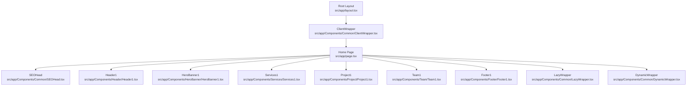

**Diagram sources**
- [Root Layout](file://src/app/layout.tsx#L1-L47)
- [ClientWrapper](file://src/app/Components/Common/ClientWrapper.tsx#L1-L11)
- [Home Page](file://src/app/page.tsx#L1-L75)
- [SEOHead](file://src/app/Components/Common/SEOHead.tsx#L1-L78)
- [Header1](file://src/app/Components/Header/Header1.tsx#L1-L94)
- [HeroBanner1](file://src/app/Components/HeroBanner/HeroBanner1.tsx#L1-L127)
- [Services1](file://src/app/Components/Services/Services1.tsx#L1-L56)
- [Project1](file://src/app/Components/Project/Project1.tsx#L1-L53)
- [Team1](file://src/app/Components/Team/Team1.tsx#L1-L52)
- [Footer1](file://src/app/Components/Footer/Footer1.tsx#L1-L112)
- [LazyWrapper](file://src/app/Components/Common/LazyWrapper.tsx#L1-L51)
- [DynamicWrapper](file://src/app/Components/Common/DynamicWrapper.tsx#L1-L42)

**Section sources**
- [Root Layout](file://src/app/layout.tsx#L1-L47)
- [Home Page](file://src/app/page.tsx#L1-L75)

## Core Components
- Root Layout: Initializes fonts, Bootstrap CSS, Bootstrap Icons, Slick carousel CSS, and custom styles. Wraps children with ClientWrapper and renders the HTML document head and body.
- ClientWrapper: Ensures client-side hydration and injects a persistent WhatsApp floating action button.
- LazyWrapper: Implements intersection observer-based lazy rendering with configurable thresholds and margins, and a spinner fallback.
- DynamicWrapper: Provides higher-order dynamic imports with loading fallbacks and disables SSR for client-heavy components.
- SEOHead: Renders SEO metadata using file-based metadata hook, falling back to defaults when data is unavailable.
- Header/Footer: Reusable navigation and branding/header/footer sections with responsive behavior and social links.
- HeroBanner/Services/Project/Team: Feature-rich sections with images, animations, and interactive elements.

**Section sources**
- [Root Layout](file://src/app/layout.tsx#L1-L47)
- [ClientWrapper](file://src/app/Components/Common/ClientWrapper.tsx#L1-L11)
- [LazyWrapper](file://src/app/Components/Common/LazyWrapper.tsx#L1-L51)
- [DynamicWrapper](file://src/app/Components/Common/DynamicWrapper.tsx#L1-L42)
- [SEOHead](file://src/app/Components/Common/SEOHead.tsx#L1-L78)
- [Header1](file://src/app/Components/Header/Header1.tsx#L1-L94)
- [Footer1](file://src/app/Components/Footer/Footer1.tsx#L1-L112)
- [HeroBanner1](file://src/app/Components/HeroBanner/HeroBanner1.tsx#L1-L127)
- [Services1](file://src/app/Components/Services/Services1.tsx#L1-L56)
- [Project1](file://src/app/Components/Project/Project1.tsx#L1-L53)
- [Team1](file://src/app/Components/Team/Team1.tsx#L1-L52)

## Architecture Overview
The architecture centers on a root layout that bootstraps global resources and client-side hydration. The home page composes specialized sections and applies wrappers to optimize performance. DynamicWrapper defers heavy components to the client, while LazyWrapper defers rendering until components are in viewport. SEOHead centralizes SEO metadata management.

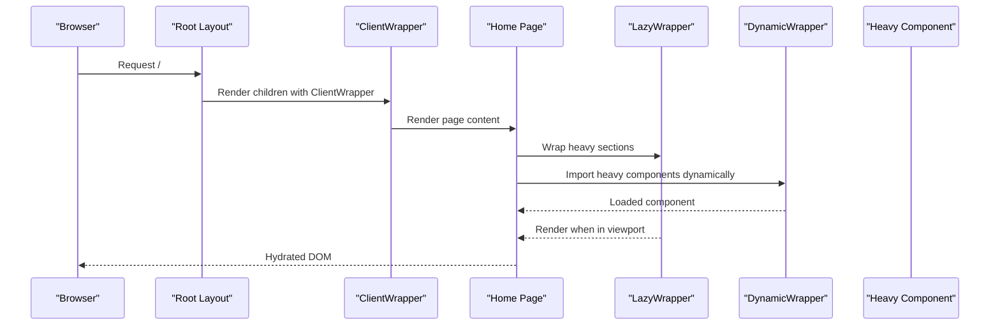

**Diagram sources**
- [Root Layout](file://src/app/layout.tsx#L1-L47)
- [ClientWrapper](file://src/app/Components/Common/ClientWrapper.tsx#L1-L11)
- [Home Page](file://src/app/page.tsx#L1-L75)
- [LazyWrapper](file://src/app/Components/Common/LazyWrapper.tsx#L1-L51)
- [DynamicWrapper](file://src/app/Components/Common/DynamicWrapper.tsx#L1-L42)

## Detailed Component Analysis

### Root Layout and Client Hydration
- Purpose: Initialize fonts, Bootstrap, icons, carousel, and custom CSS; wrap children with ClientWrapper; render GA script and meta tags.
- Integration: Imports global CSS and sets up the HTML document head/body. ClientWrapper ensures client-side-only features like the WhatsApp button are rendered after hydration.

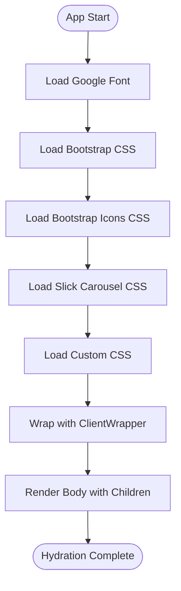

**Diagram sources**
- [Root Layout](file://src/app/layout.tsx#L1-L47)
- [ClientWrapper](file://src/app/Components/Common/ClientWrapper.tsx#L1-L11)

**Section sources**
- [Root Layout](file://src/app/layout.tsx#L1-L47)
- [ClientWrapper](file://src/app/Components/Common/ClientWrapper.tsx#L1-L11)

### ClientWrapper and Floating Action Button
- Purpose: Ensures client-side-only rendering and injects a persistent WhatsApp floating action button.
- Behavior: Renders children first, then appends the button fixed to the lower-right corner with hover scaling.

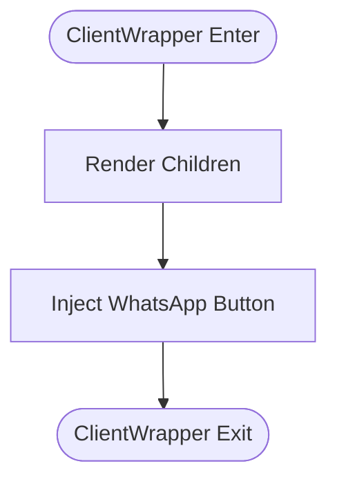

**Diagram sources**
- [ClientWrapper](file://src/app/Components/Common/ClientWrapper.tsx#L1-L11)
- [WhatsAppButton](file://src/app/Components/Common/WhatsAppButton.tsx#L1-L33)

**Section sources**
- [ClientWrapper](file://src/app/Components/Common/ClientWrapper.tsx#L1-L11)
- [WhatsAppButton](file://src/app/Components/Common/WhatsAppButton.tsx#L1-L33)

### LazyWrapper: Intersection-Based Deferred Rendering
- Purpose: Defer rendering of expensive sections until they enter the viewport to improve initial load performance.
- Props:
  - children: ReactNode
  - fallback: ReactNode (default spinner)
  - threshold: number (default 0.1)
  - rootMargin: string (default "50px")
- Behavior: Uses IntersectionObserver to detect visibility, toggles rendering once visible, and disconnects the observer after first load.

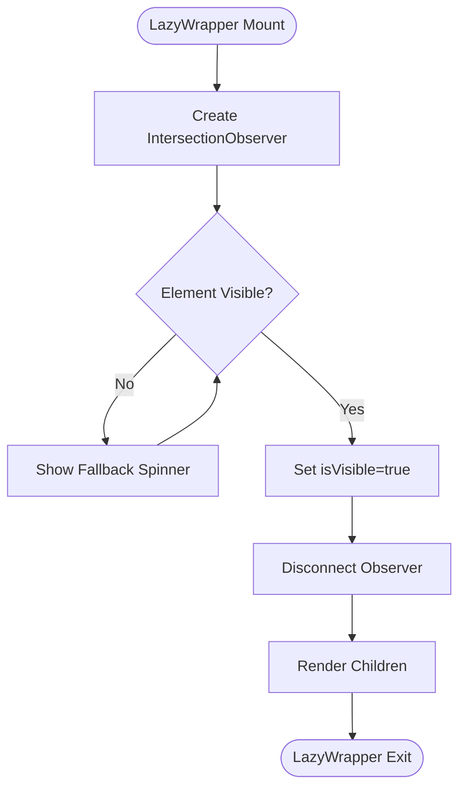

**Diagram sources**
- [LazyWrapper](file://src/app/Components/Common/LazyWrapper.tsx#L1-L51)

**Section sources**
- [LazyWrapper](file://src/app/Components/Common/LazyWrapper.tsx#L1-L51)

### DynamicWrapper: Client-Only Dynamic Imports
- Purpose: Dynamically import heavy components on the client with loading spinners and disable SSR for performance.
- Pattern: Higher-order withDynamicImport and pre-configured named exports for Project, Services, Testimonial, Team, and Blog components.
- Props:
  - importFunc: () => Promise<{ default: ComponentType<T> }>
  - fallback?: ComponentType
- Behavior: Returns Next.js dynamic component with loading fallback and ssr: false.

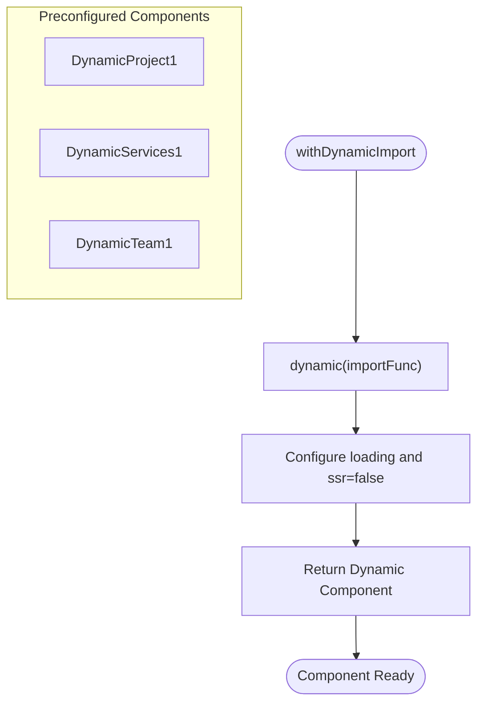

**Diagram sources**
- [DynamicWrapper](file://src/app/Components/Common/DynamicWrapper.tsx#L1-L42)

**Section sources**
- [DynamicWrapper](file://src/app/Components/Common/DynamicWrapper.tsx#L1-L42)

### SEOHead: Centralized Metadata Management
- Purpose: Render SEO metadata using file-based metadata hook, falling back to defaults when data is unavailable.
- Props:
  - route: string
  - defaultTitle?: string
  - defaultDescription?: string
  - defaultKeywords?: string
  - children?: React.ReactNode
- Behavior: Loads metadata via hook; if missing, renders defaults; otherwise merges database-provided values for title, description, keywords, OG, Twitter, robots, and canonical URL.

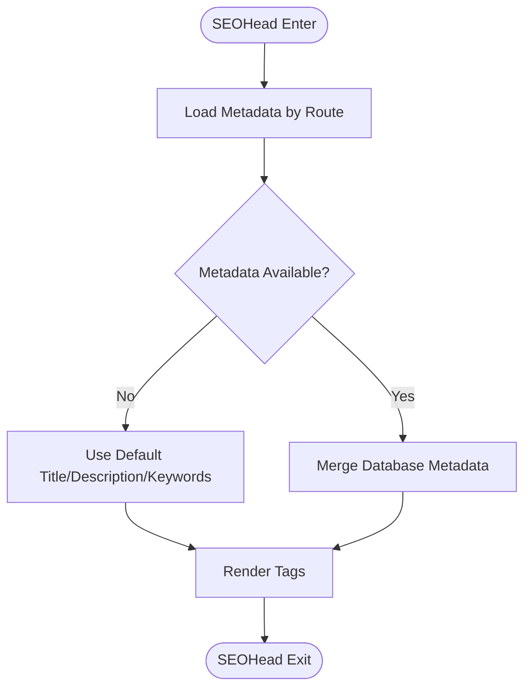

**Diagram sources**
- [SEOHead](file://src/app/Components/Common/SEOHead.tsx#L1-L78)

**Section sources**
- [SEOHead](file://src/app/Components/Common/SEOHead.tsx#L1-L78)

### Header1 and Nav: Responsive Navigation
- Purpose: Sticky header with responsive toggle, scroll-aware behavior, and nested navigation for services.
- State:
  - mobileToggle: boolean
  - isSticky: string (applied classes)
  - prevScrollPos: number
- Behavior: Optimized scroll handler using requestAnimationFrame; updates sticky class based on scroll direction and position; passes setMobileToggle to Nav.

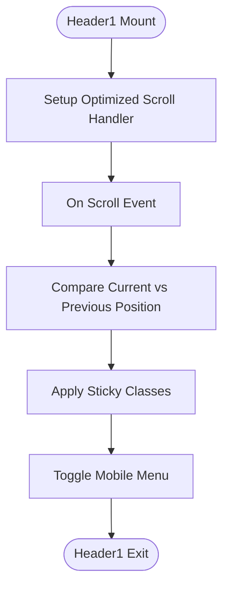

**Diagram sources**
- [Header1](file://src/app/Components/Header/Header1.tsx#L1-L94)
- [Nav](file://src/app/Components/Header/Nav.tsx#L1-L111)

**Section sources**
- [Header1](file://src/app/Components/Header/Header1.tsx#L1-L94)
- [Nav](file://src/app/Components/Header/Nav.tsx#L1-L111)

### HeroBanner1: Interactive Hero with Video Modal
- Purpose: Hero section with animated content, statistics, social links, and an embedded video modal trigger.
- State:
  - iframeSrc: string
  - toggle: boolean
- Behavior: Toggles iframeSrc and modal visibility; integrates with VideoModal component.

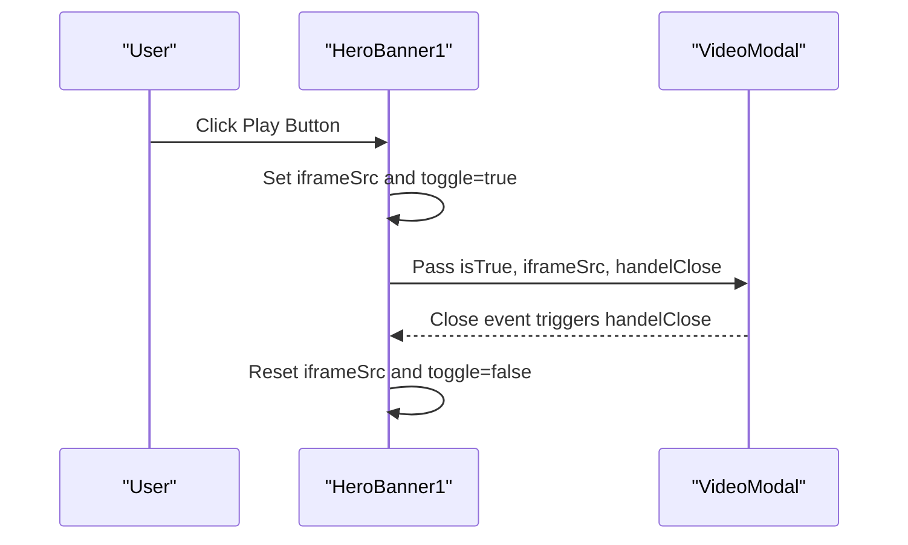

**Diagram sources**
- [HeroBanner1](file://src/app/Components/HeroBanner/HeroBanner1.tsx#L1-L127)

**Section sources**
- [HeroBanner1](file://src/app/Components/HeroBanner/HeroBanner1.tsx#L1-L127)

### Services1, Project1, Team1: Feature Sections
- Services1: Displays a grid of service items with images and links.
- Project1: Horizontal slider showcasing project thumbnails.
- Team1: Team member cards with names and roles.

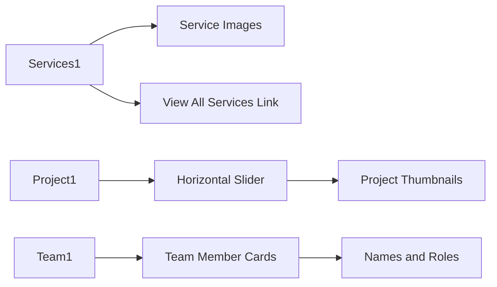

**Diagram sources**
- [Services1](file://src/app/Components/Services/Services1.tsx#L1-L56)
- [Project1](file://src/app/Components/Project/Project1.tsx#L1-L53)
- [Team1](file://src/app/Components/Team/Team1.tsx#L1-L52)

**Section sources**
- [Services1](file://src/app/Components/Services/Services1.tsx#L1-L56)
- [Project1](file://src/app/Components/Project/Project1.tsx#L1-L53)
- [Team1](file://src/app/Components/Team/Team1.tsx#L1-L52)

### Footer1: Multi-Column Footer with Social Links
- Purpose: Organizes quick links, services, contact info, and social media links with decorative shapes.

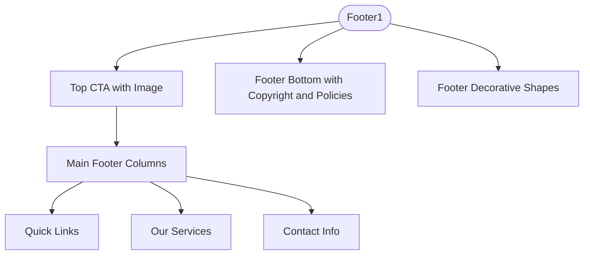

**Diagram sources**
- [Footer1](file://src/app/Components/Footer/Footer1.tsx#L1-L112)

**Section sources**
- [Footer1](file://src/app/Components/Footer/Footer1.tsx#L1-L112)

## Dependency Analysis
- Root Layout depends on ClientWrapper and global CSS imports.
- Home Page composes SEOHead, Header/Footer, HeroBanner, and multiple feature sections; it also composes LazyWrapper and DynamicWrapper around heavy components.
- DynamicWrapper depends on Next.js dynamic and provides higher-order and named dynamic components.
- LazyWrapper depends on browser IntersectionObserver APIs.
- Header1 depends on Nav and uses scroll events; Nav depends on DropDown (not included here).
- SEOHead depends on a metadata hook for per-route metadata.

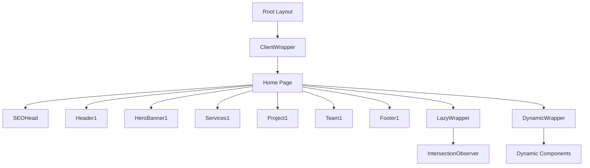

**Diagram sources**
- [Root Layout](file://src/app/layout.tsx#L1-L47)
- [ClientWrapper](file://src/app/Components/Common/ClientWrapper.tsx#L1-L11)
- [Home Page](file://src/app/page.tsx#L1-L75)
- [SEOHead](file://src/app/Components/Common/SEOHead.tsx#L1-L78)
- [Header1](file://src/app/Components/Header/Header1.tsx#L1-L94)
- [HeroBanner1](file://src/app/Components/HeroBanner/HeroBanner1.tsx#L1-L127)
- [Services1](file://src/app/Components/Services/Services1.tsx#L1-L56)
- [Project1](file://src/app/Components/Project/Project1.tsx#L1-L53)
- [Team1](file://src/app/Components/Team/Team1.tsx#L1-L52)
- [Footer1](file://src/app/Components/Footer/Footer1.tsx#L1-L112)
- [LazyWrapper](file://src/app/Components/Common/LazyWrapper.tsx#L1-L51)
- [DynamicWrapper](file://src/app/Components/Common/DynamicWrapper.tsx#L1-L42)

**Section sources**
- [Root Layout](file://src/app/layout.tsx#L1-L47)
- [Home Page](file://src/app/page.tsx#L1-L75)
- [DynamicWrapper](file://src/app/Components/Common/DynamicWrapper.tsx#L1-L42)
- [LazyWrapper](file://src/app/Components/Common/LazyWrapper.tsx#L1-L51)

## Performance Considerations
- Client-only hydration: Root Layout and ClientWrapper ensure client-side-only features avoid SSR overhead.
- Dynamic imports: DynamicWrapper disables SSR for heavy components and provides loading spinners to improve perceived performance.
- Intersection-based lazy rendering: LazyWrapper defers rendering until components are near the viewport, reducing initial bundle and paint costs.
- Optimized scroll handling: Header1 uses requestAnimationFrame to minimize layout thrashing during scroll.
- Image optimization: Next/Image is used across components with priority and lazy loading attributes where appropriate.
- CSS delivery: Global CSS (Bootstrap, Icons, Slick, Custom) is loaded at the root to avoid repeated fetches.

[No sources needed since this section provides general guidance]

## Troubleshooting Guide
- WhatsApp button not visible:
  - Verify ClientWrapper is present in Root Layout and that the button is appended after hydration.
  - Check browser console for errors related to external resources.
- Dynamic components not loading:
  - Confirm dynamic imports resolve correctly and that ssr is disabled for client-heavy components.
  - Ensure loading fallback is visible while component is being fetched.
- Lazy sections not rendering:
  - Verify IntersectionObserver is supported and that threshold/rootMargin values are appropriate for viewport.
  - Check for CSS that might hide the container or affect visibility calculations.
- SEO metadata not applied:
  - Confirm the metadata hook returns data for the requested route or defaults are acceptable.
  - Validate canonical URLs and social meta tags are present in the rendered head.

**Section sources**
- [ClientWrapper](file://src/app/Components/Common/ClientWrapper.tsx#L1-L11)
- [DynamicWrapper](file://src/app/Components/Common/DynamicWrapper.tsx#L1-L42)
- [LazyWrapper](file://src/app/Components/Common/LazyWrapper.tsx#L1-L51)
- [SEOHead](file://src/app/Components/Common/SEOHead.tsx#L1-L78)

## Conclusion
The component architecture at attechglobal.com leverages Next.js App Router conventions with a clear separation of concerns. Root-level hydration and global styling are handled in the root layout, while the home page composes reusable sections and applies performance-focused wrappers for lazy and dynamic rendering. The wrapper components (ClientWrapper, LazyWrapper, DynamicWrapper) enable scalable, maintainable UI patterns suited for a marketing agency website. Integration with Bootstrap and custom styling, combined with SEOHead for metadata management, provides a robust foundation for growth and maintenance.