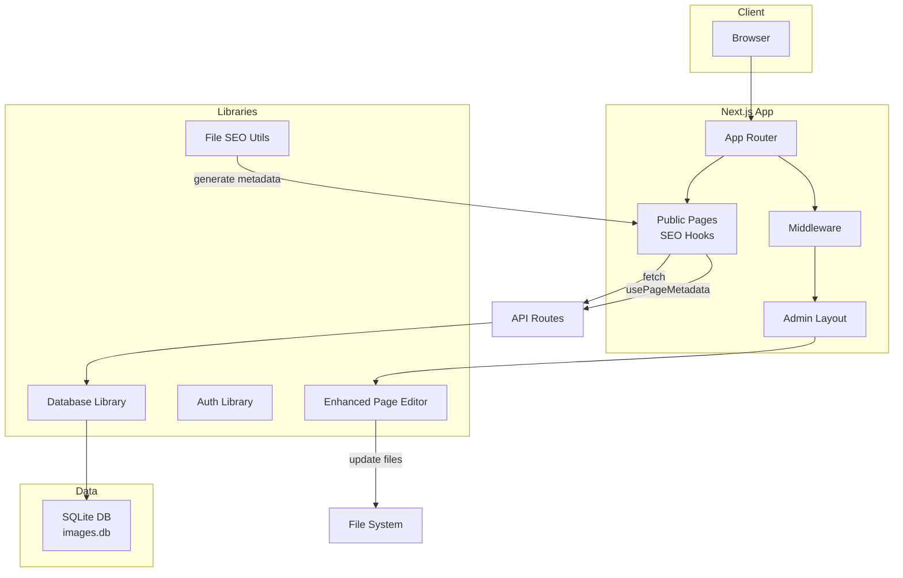
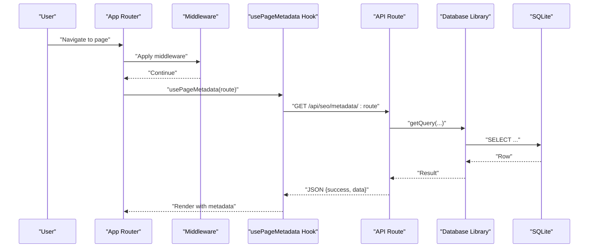
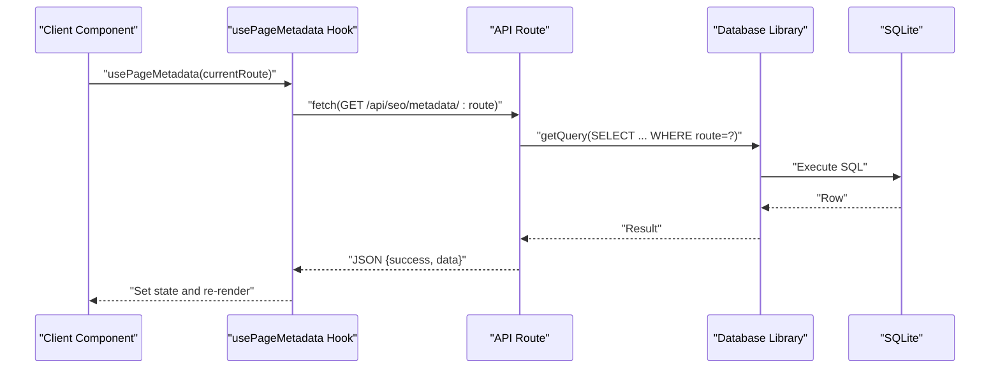
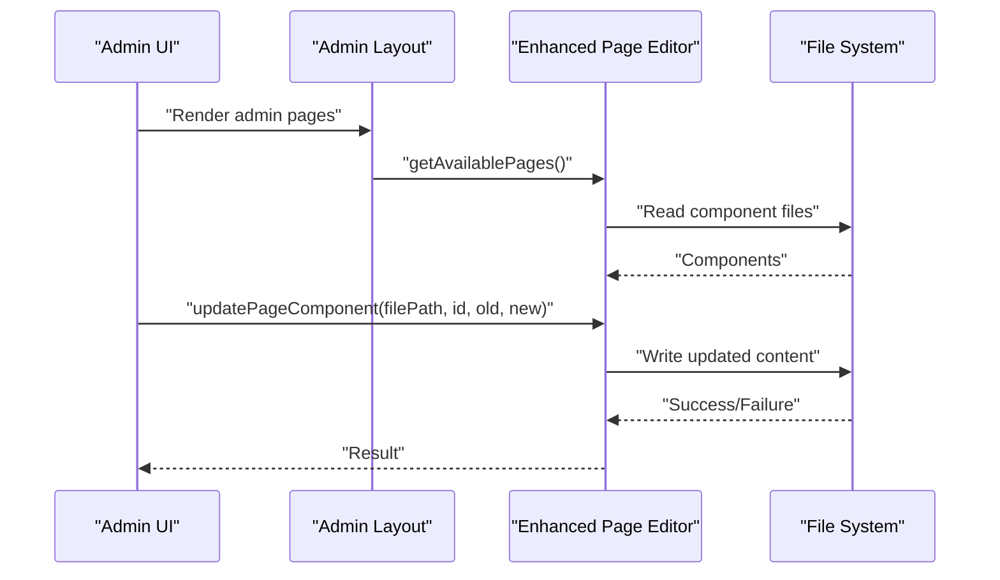
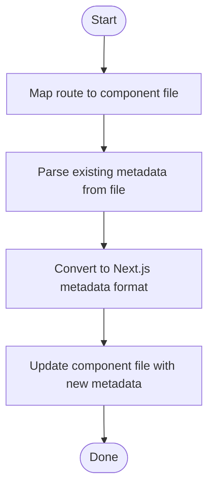
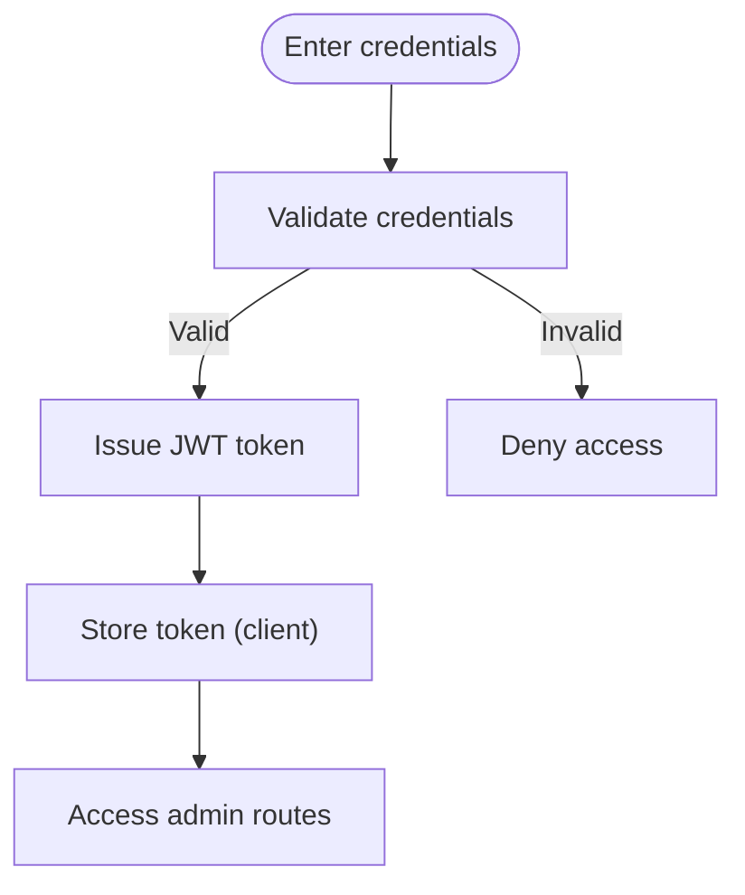
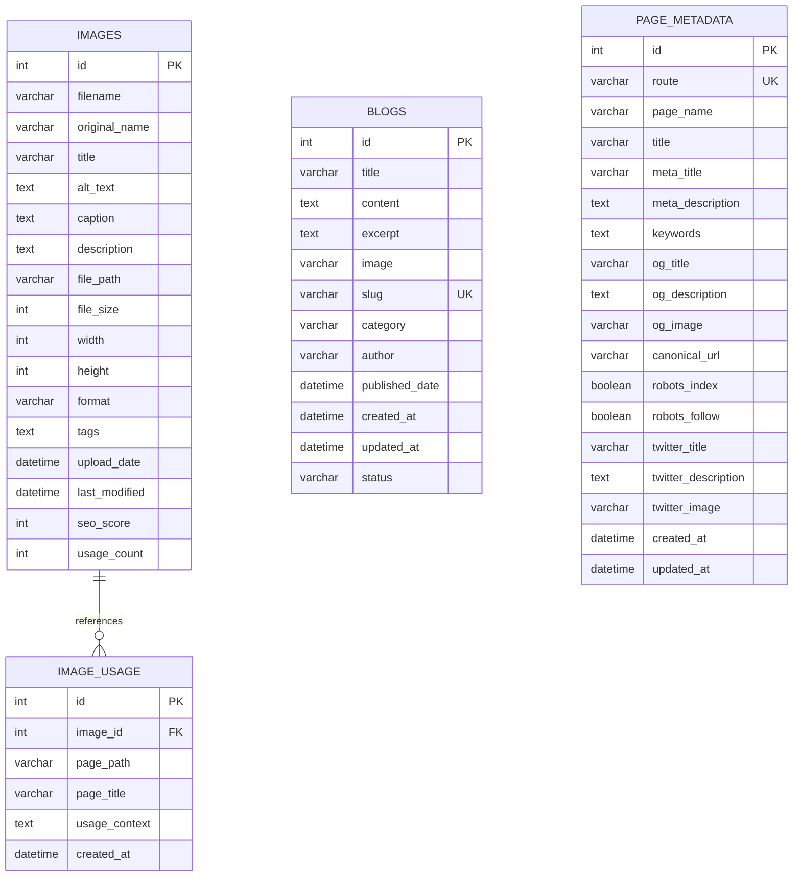
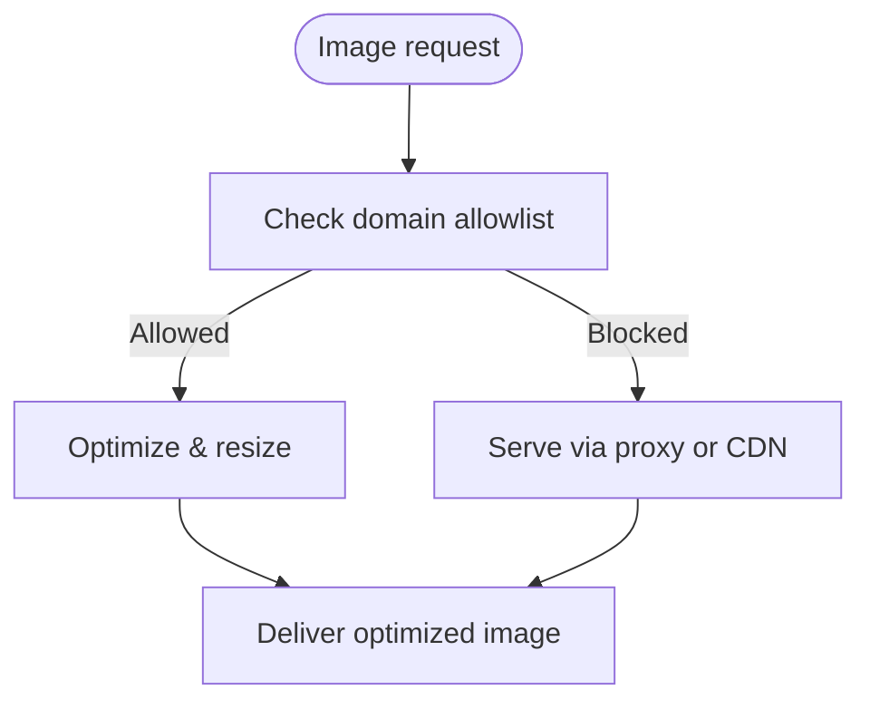
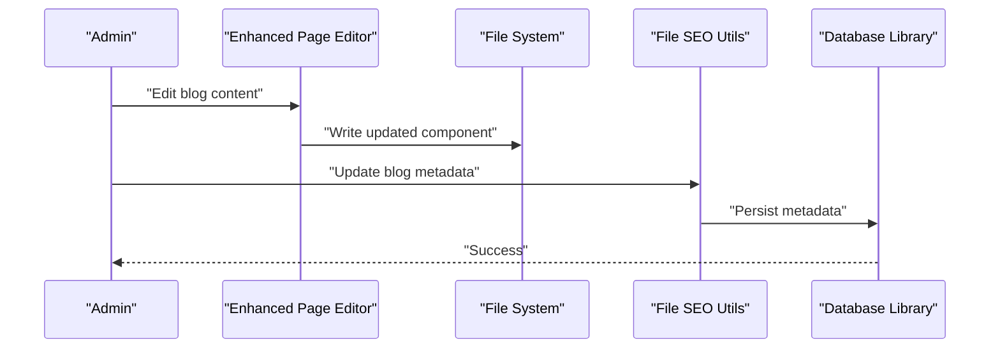
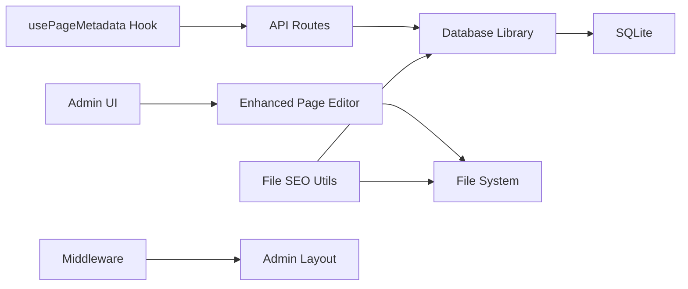

# Data Flow Patterns

<cite>
**Referenced Files in This Document**
- [RootLayout](file://src/app/layout.tsx)
- [Middleware](file://middleware.ts)
- [Next Config](file://next.config.mjs)
- [Database Library](file://src/lib/database.ts)
- [Auth Library](file://src/lib/auth.ts)
- [Enhanced Page Editor](file://src/lib/enhanced-page-editor.ts)
- [Page Editor](file://src/lib/page-editor.ts)
- [File SEO Utils](file://src/lib/fileSeoUtils.ts)
- [Use Page Metadata Hook](file://src/hooks/usePageMetadata.ts)
- [Admin Layout](file://src/app/admin/layout.tsx)
- [SQLite DB File](file://data/images.db)
</cite>

## Table of Contents
1. [Introduction](#introduction)
2. [Project Structure](#project-structure)
3. [Core Components](#core-components)
4. [Architecture Overview](#architecture-overview)
5. [Detailed Component Analysis](#detailed-component-analysis)
6. [Dependency Analysis](#dependency-analysis)
7. [Performance Considerations](#performance-considerations)
8. [Troubleshooting Guide](#troubleshooting-guide)
9. [Conclusion](#conclusion)
10. [Appendices](#appendices)

## Introduction
This document describes the data flow architecture for attechglobal.com, focusing on how client requests traverse the Next.js App Router, middleware, API routes, database operations, and component rendering. It documents two primary data flow patterns:
- Public content retrieval: client requests → App Router → API routes → database → component hydration
- Admin content management: client requests → admin layout → admin pages → page editors → file-based content updates → optional database synchronization

It also explains integration points for file-based content management, SQLite-backed metadata storage, real-time-like updates via client hooks, and SEO metadata generation. Validation, error handling, and caching strategies are covered, along with image processing and blog content management flows.

## Project Structure
The site is a Next.js application configured for static export in certain environments. Key areas:
- App Router pages under src/app
- Admin area under src/app/admin
- Libraries under src/lib for database, auth, SEO, and page editing
- Client hooks under src/hooks for metadata operations
- Middleware for admin route gating
- Next.js configuration for static export and image optimization
- SQLite database file under data/images.db

**Diagram sources**
- [RootLayout](file://src/app/layout.tsx#L14-L46)
- [Middleware](file://middleware.ts#L4-L14)
- [Admin Layout](file://src/app/admin/layout.tsx#L6-L22)
- [Database Library](file://src/lib/database.ts#L84-L254)
- [Enhanced Page Editor](file://src/lib/enhanced-page-editor.ts#L26-L284)
- [File SEO Utils](file://src/lib/fileSeoUtils.ts#L47-L115)
- [Use Page Metadata Hook](file://src/hooks/usePageMetadata.ts#L18-L52)
- [SQLite DB File](file://data/images.db)

**Section sources**
- [RootLayout](file://src/app/layout.tsx#L14-L46)
- [Middleware](file://middleware.ts#L4-L14)
- [Admin Layout](file://src/app/admin/layout.tsx#L6-L22)
- [Next Config](file://next.config.mjs#L1-L129)
- [Database Library](file://src/lib/database.ts#L84-L254)
- [Enhanced Page Editor](file://src/lib/enhanced-page-editor.ts#L26-L284)
- [File SEO Utils](file://src/lib/fileSeoUtils.ts#L47-L115)
- [Use Page Metadata Hook](file://src/hooks/usePageMetadata.ts#L18-L52)

## Core Components
- App Router and Root Layout: Provide global styles, fonts, and client wrapper for hydration.
- Middleware: Currently a pass-through for admin routes; designed for future server-side enforcement.
- Database Library: Initializes SQLite, defines tables, and exposes CRUD helpers.
- Auth Library: Provides admin authentication and token utilities.
- Page Editors: Parse and update page components in the file system for content management.
- File SEO Utils: Map routes to files, parse and update metadata in component files, and convert to Next.js metadata format.
- Client Hooks: Fetch, paginate, and mutate page metadata via API routes.
- Next Config: Controls static export mode, image optimization, and domain allowlists.

**Section sources**
- [RootLayout](file://src/app/layout.tsx#L14-L46)
- [Middleware](file://middleware.ts#L4-L14)
- [Database Library](file://src/lib/database.ts#L84-L254)
- [Auth Library](file://src/lib/auth.ts#L62-L84)
- [Enhanced Page Editor](file://src/lib/enhanced-page-editor.ts#L26-L284)
- [File SEO Utils](file://src/lib/fileSeoUtils.ts#L47-L115)
- [Use Page Metadata Hook](file://src/hooks/usePageMetadata.ts#L18-L52)
- [Next Config](file://next.config.mjs#L1-L129)

## Architecture Overview
The system supports dual data flows:
- Public content retrieval: client requests are served statically or via API routes depending on deployment mode. Metadata is fetched via client hooks to API endpoints backed by SQLite.
- Admin content management: admin pages render within an admin layout, leverage page editors to modify component files, and optionally synchronize with database-backed metadata.

**Diagram sources**
- [RootLayout](file://src/app/layout.tsx#L14-L46)
- [Middleware](file://middleware.ts#L4-L14)
- [Use Page Metadata Hook](file://src/hooks/usePageMetadata.ts#L18-L52)
- [Database Library](file://src/lib/database.ts#L229-L240)

## Detailed Component Analysis

### Public Content Retrieval Flow
- Request enters App Router and renders the requested page.
- The page uses the usePageMetadata hook to fetch metadata for the current route.
- The hook calls the API route to retrieve metadata from the database.
- The database library executes a SELECT query against SQLite and returns the result.
- The page renders with enriched metadata for SEO and social previews.

**Diagram sources**
- [Use Page Metadata Hook](file://src/hooks/usePageMetadata.ts#L18-L52)
- [Database Library](file://src/lib/database.ts#L229-L240)

**Section sources**
- [Use Page Metadata Hook](file://src/hooks/usePageMetadata.ts#L18-L52)
- [Database Library](file://src/lib/database.ts#L229-L240)

### Admin Content Management Flow
- Admin layout wraps admin pages and provides navigation.
- Page editors parse component files to discover editable regions and update them.
- Updates are written back to the file system; optional database synchronization can occur via API routes.

**Diagram sources**
- [Admin Layout](file://src/app/admin/layout.tsx#L6-L22)
- [Enhanced Page Editor](file://src/lib/enhanced-page-editor.ts#L50-L76)
- [Enhanced Page Editor](file://src/lib/enhanced-page-editor.ts#L239-L272)

**Section sources**
- [Admin Layout](file://src/app/admin/layout.tsx#L6-L22)
- [Enhanced Page Editor](file://src/lib/enhanced-page-editor.ts#L50-L76)
- [Enhanced Page Editor](file://src/lib/enhanced-page-editor.ts#L239-L272)

### SEO Metadata Generation and Updates
- File SEO Utils maps routes to component files, parses metadata, and updates component files with new metadata.
- It converts database-backed metadata into Next.js metadata format for rendering.

**Diagram sources**
- [File SEO Utils](file://src/lib/fileSeoUtils.ts#L120-L178)
- [File SEO Utils](file://src/lib/fileSeoUtils.ts#L183-L284)
- [File SEO Utils](file://src/lib/fileSeoUtils.ts#L47-L115)

**Section sources**
- [File SEO Utils](file://src/lib/fileSeoUtils.ts#L120-L178)
- [File SEO Utils](file://src/lib/fileSeoUtils.ts#L183-L284)
- [File SEO Utils](file://src/lib/fileSeoUtils.ts#L47-L115)

### Authentication and Authorization
- Admin authentication uses JWT tokens. Credentials are validated and a token is issued for subsequent admin requests.
- The auth library provides hashing, verification, token generation, and verification.

**Diagram sources**
- [Auth Library](file://src/lib/auth.ts#L62-L79)
- [Auth Library](file://src/lib/auth.ts#L34-L59)

**Section sources**
- [Auth Library](file://src/lib/auth.ts#L62-L79)
- [Auth Library](file://src/lib/auth.ts#L34-L59)

### Database Schema and Operations
- The database initializes images, image_usage, blogs, and page_metadata tables.
- Helpers encapsulate run, get, and all queries for consistent operation.

**Diagram sources**
- [Database Library](file://src/lib/database.ts#L106-L181)

**Section sources**
- [Database Library](file://src/lib/database.ts#L106-L181)
- [Database Library](file://src/lib/database.ts#L215-L254)

### Image Processing and Optimization
- Next.js image optimization is configured for static export with unoptimized images and allowlisted domains.
- Image formats include WebP and AVIF; device sizes and image sizes are tuned for performance.

**Diagram sources**
- [Next Config](file://next.config.mjs#L10-L112)

**Section sources**
- [Next Config](file://next.config.mjs#L10-L112)

### Blog Content Management
- Blogs are stored in the blogs table with fields for title, content, slug, category, author, dates, and status.
- Page editors and SEO utilities support content discovery and metadata updates for blog pages.

**Diagram sources**
- [Enhanced Page Editor](file://src/lib/enhanced-page-editor.ts#L239-L272)
- [File SEO Utils](file://src/lib/fileSeoUtils.ts#L183-L284)
- [Database Library](file://src/lib/database.ts#L215-L254)

**Section sources**
- [Enhanced Page Editor](file://src/lib/enhanced-page-editor.ts#L239-L272)
- [File SEO Utils](file://src/lib/fileSeoUtils.ts#L183-L284)
- [Database Library](file://src/lib/database.ts#L215-L254)

## Dependency Analysis
- Client hooks depend on API routes for metadata operations.
- API routes depend on the database library for persistence.
- Page editors depend on the file system for content updates.
- SEO utilities depend on file parsing and database persistence.
- Middleware depends on admin routes and can gate access.

**Diagram sources**
- [Use Page Metadata Hook](file://src/hooks/usePageMetadata.ts#L18-L52)
- [Database Library](file://src/lib/database.ts#L215-L254)
- [Enhanced Page Editor](file://src/lib/enhanced-page-editor.ts#L26-L284)
- [File SEO Utils](file://src/lib/fileSeoUtils.ts#L47-L115)
- [Middleware](file://middleware.ts#L4-L14)
- [Admin Layout](file://src/app/admin/layout.tsx#L6-L22)

**Section sources**
- [Use Page Metadata Hook](file://src/hooks/usePageMetadata.ts#L18-L52)
- [Database Library](file://src/lib/database.ts#L215-L254)
- [Enhanced Page Editor](file://src/lib/enhanced-page-editor.ts#L26-L284)
- [File SEO Utils](file://src/lib/fileSeoUtils.ts#L47-L115)
- [Middleware](file://middleware.ts#L4-L14)
- [Admin Layout](file://src/app/admin/layout.tsx#L6-L22)

## Performance Considerations
- Static export mode reduces server load but limits server-side features; API routes are still supported for dynamic needs.
- Image optimization is configured for performance with allowlisted domains and multiple formats.
- Database operations use prepared statements and helper functions to minimize overhead.
- Client-side caching via React state avoids redundant network calls during a session.

[No sources needed since this section provides general guidance]

## Troubleshooting Guide
Common issues and resolutions:
- Database initialization errors: ensure the data directory exists and the images.db file is writable.
- Middleware not enforcing: confirm the matcher targets admin routes and that server-side processing is available.
- API route failures: verify database connectivity and query parameters.
- SEO metadata not updating: check file permissions and regex patterns used for metadata replacement.
- Image optimization blocked: verify domains are included in the allowlist and images are served via HTTPS.

**Section sources**
- [Database Library](file://src/lib/database.ts#L84-L96)
- [Middleware](file://middleware.ts#L10-L14)
- [File SEO Utils](file://src/lib/fileSeoUtils.ts#L183-L284)
- [Next Config](file://next.config.mjs#L10-L112)

## Conclusion
The attechglobal.com data architecture combines static export readiness with server-side capabilities for admin and API-driven features. Two complementary data flows serve public content and enable admin content management. Robust libraries for database operations, authentication, SEO metadata, and page editing provide a cohesive foundation for content delivery and maintenance.

[No sources needed since this section summarizes without analyzing specific files]

## Appendices
- Deployment modes: static export vs. serverless API routes are controlled by environment variables in Next config.
- Environment variables: JWT secret and export flags influence runtime behavior.

**Section sources**
- [Next Config](file://next.config.mjs#L1-L129)
- [Auth Library](file://src/lib/auth.ts#L11-L11)