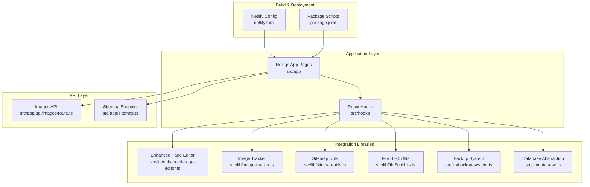
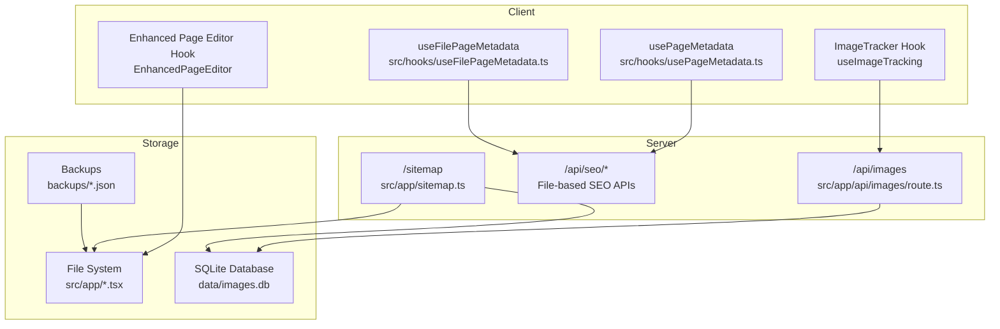
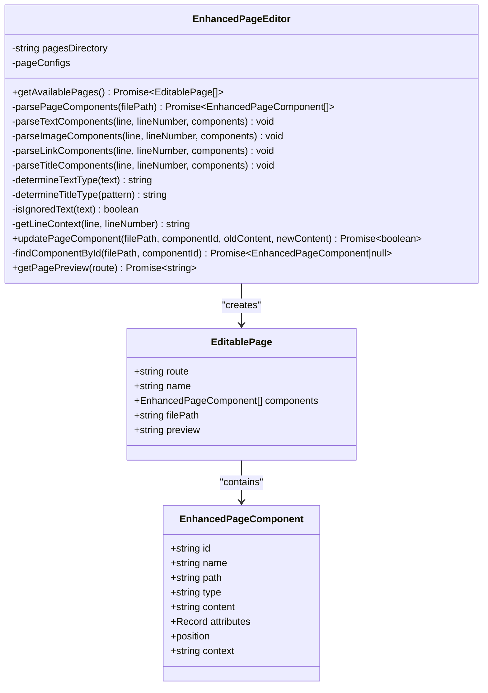
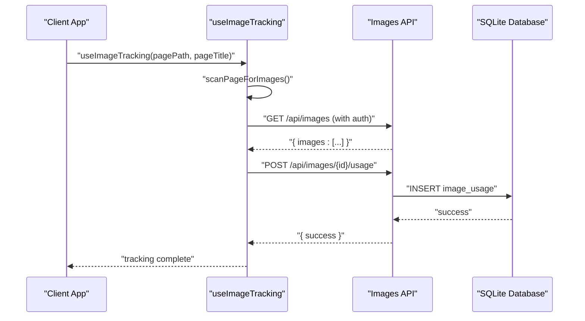
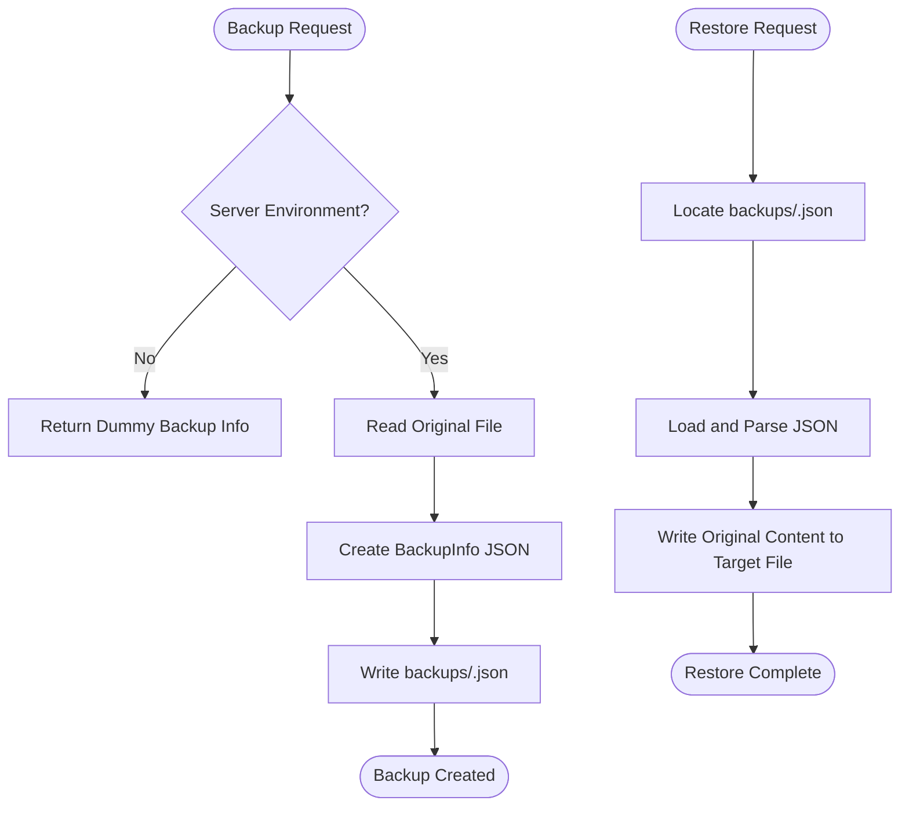
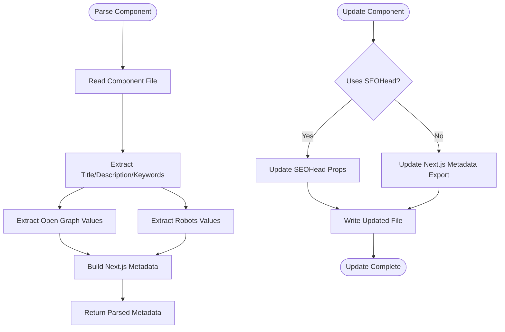
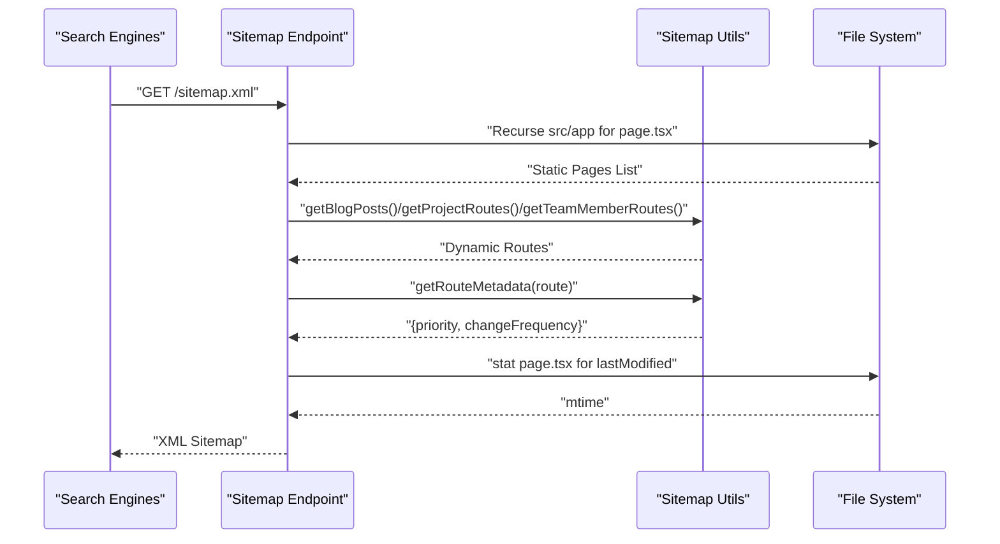
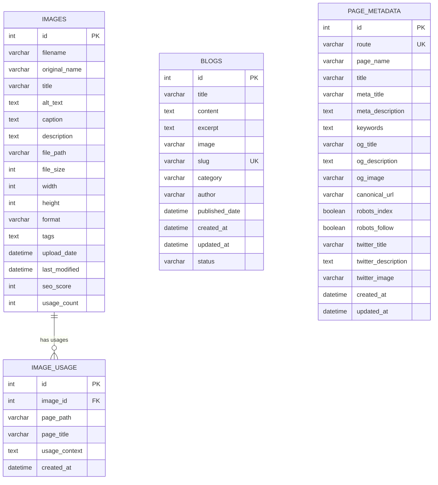
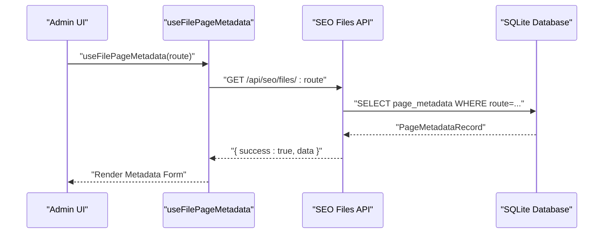
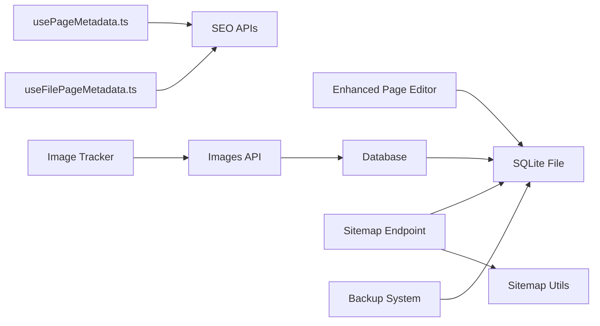

# Integration Architecture

<cite>
**Referenced Files in This Document**
- [README.md](file://README.md)
- [package.json](file://package.json)
- [enhanced-page-editor.ts](file://src/lib/enhanced-page-editor.ts)
- [image-tracker.ts](file://src/lib/image-tracker.ts)
- [backup-system.ts](file://src/lib/backup-system.ts)
- [sitemap-utils.ts](file://src/lib/sitemap-utils.ts)
- [fileSeoUtils.ts](file://src/lib/fileSeoUtils.ts)
- [database.ts](file://src/lib/database.ts)
- [sitemap.ts](file://src/app/sitemap.ts)
- [route.ts](file://src/app/api/images/route.ts)
- [route.ts](file://src/app/api/pages/route.ts)
- [usePageMetadata.ts](file://src/hooks/usePageMetadata.ts)
- [useFilePageMetadata.ts](file://src/hooks/useFilePageMetadata.ts)
- [seed-metadata.ts](file://src/lib/seed-metadata.ts)
- [netlify.toml](file://netlify.toml)
</cite>

## Table of Contents
1. [Introduction](#introduction)
2. [Project Structure](#project-structure)
3. [Core Components](#core-components)
4. [Architecture Overview](#architecture-overview)
5. [Detailed Component Analysis](#detailed-component-analysis)
6. [Dependency Analysis](#dependency-analysis)
7. [Performance Considerations](#performance-considerations)
8. [Troubleshooting Guide](#troubleshooting-guide)
9. [Conclusion](#conclusion)
10. [Appendices](#appendices)

## Introduction
This document describes the integration architecture for attechglobal.com, focusing on how the content management system, image processing pipeline, SEO optimization tools, and backup mechanisms interoperate. It also covers the enhanced page editor integration with file system parsing, real-time content updates, and component detection; file-based SEO integration including metadata generation, sitemap creation, and performance monitoring; the image tracking system integration with usage analytics, optimization workflows, and storage management; and the backup system integration for content preservation and disaster recovery. Third-party service integrations, API connections, and external tool compatibility are documented along with guidance for extending integrations and maintaining system interoperability.

## Project Structure
The project is a Next.js application with a modular architecture:
- Application pages under src/app
- Shared libraries under src/lib
- Client-side hooks under src/hooks
- API routes under src/app/api
- Static export build configuration under netlify.toml
- Deployment and build scripts under package.json

**Diagram sources**
- [enhanced-page-editor.ts](file://src/lib/enhanced-page-editor.ts#L1-L287)
- [image-tracker.ts](file://src/lib/image-tracker.ts#L1-L95)
- [sitemap-utils.ts](file://src/lib/sitemap-utils.ts#L1-L196)
- [fileSeoUtils.ts](file://src/lib/fileSeoUtils.ts#L1-L329)
- [backup-system.ts](file://src/lib/backup-system.ts#L1-L119)
- [database.ts](file://src/lib/database.ts#L1-L255)
- [route.ts](file://src/app/api/images/route.ts#L1-L182)
- [sitemap.ts](file://src/app/sitemap.ts#L1-L154)
- [netlify.toml](file://netlify.toml#L1-L21)
- [package.json](file://package.json#L1-L41)

**Section sources**
- [README.md](file://README.md#L1-L37)
- [package.json](file://package.json#L1-L41)
- [netlify.toml](file://netlify.toml#L1-L21)

## Core Components
- Enhanced Page Editor: Parses page components from the file system, detects text, images, links, and titles, and supports updating content via file manipulation.
- Image Tracking System: Tracks image usage across pages, integrates with the image database, and exposes hooks for automatic tracking.
- Backup System: Creates and restores backups of page files, enabling content preservation and disaster recovery.
- File-Based SEO Utilities: Parses and updates metadata in component files, supporting both SEOHead and Next.js metadata exports.
- Sitemap Utilities: Discovers static pages and dynamic routes, computes priorities and change frequencies, and generates sitemaps with last-modified timestamps.
- Database Abstraction: Provides typed interfaces and CRUD operations for images, image usage, blogs, and page metadata.
- API Routes: Expose endpoints for images, page metadata, and sitemap generation.

**Section sources**
- [enhanced-page-editor.ts](file://src/lib/enhanced-page-editor.ts#L26-L287)
- [image-tracker.ts](file://src/lib/image-tracker.ts#L11-L95)
- [backup-system.ts](file://src/lib/backup-system.ts#L12-L119)
- [fileSeoUtils.ts](file://src/lib/fileSeoUtils.ts#L120-L329)
- [sitemap-utils.ts](file://src/lib/sitemap-utils.ts#L13-L196)
- [database.ts](file://src/lib/database.ts#L18-L255)
- [route.ts](file://src/app/api/images/route.ts#L16-L182)
- [sitemap.ts](file://src/app/sitemap.ts#L88-L154)

## Architecture Overview
The system integrates multiple subsystems:
- File System Parsing: The Enhanced Page Editor reads page files and extracts components for editing.
- Image Management: The Images API handles uploads, metadata extraction, and database persistence; the Image Tracker monitors usage.
- SEO Management: File-based utilities parse/update metadata in component files; the Sitemap endpoint generates dynamic sitemaps.
- Backup and Recovery: The Backup System persists snapshots of page files for restoration.
- API and Hooks: Client-side hooks orchestrate metadata operations and integrate with the backend APIs.

**Diagram sources**
- [usePageMetadata.ts](file://src/hooks/usePageMetadata.ts#L13-L52)
- [useFilePageMetadata.ts](file://src/hooks/useFilePageMetadata.ts#L13-L52)
- [enhanced-page-editor.ts](file://src/lib/enhanced-page-editor.ts#L50-L76)
- [image-tracker.ts](file://src/lib/image-tracker.ts#L68-L95)
- [route.ts](file://src/app/api/images/route.ts#L16-L182)
- [sitemap.ts](file://src/app/sitemap.ts#L88-L154)
- [database.ts](file://src/lib/database.ts#L84-L192)
- [backup-system.ts](file://src/lib/backup-system.ts#L33-L82)

## Detailed Component Analysis

### Enhanced Page Editor Integration
The Enhanced Page Editor parses page components from the file system, detects text, images, links, and titles, and supports updating content by replacing matched text in the source file. It maintains component metadata including positions and surrounding context for precise editing.

**Diagram sources**
- [enhanced-page-editor.ts](file://src/lib/enhanced-page-editor.ts#L26-L287)

**Section sources**
- [enhanced-page-editor.ts](file://src/lib/enhanced-page-editor.ts#L50-L100)
- [enhanced-page-editor.ts](file://src/lib/enhanced-page-editor.ts#L102-L205)
- [enhanced-page-editor.ts](file://src/lib/enhanced-page-editor.ts#L239-L277)

### Image Tracking System Integration
The Image Tracking System monitors image usage across pages, integrates with the image database, and exposes hooks for automatic tracking. It scans DOM images, filters internal assets, and records usage contexts.

**Diagram sources**
- [image-tracker.ts](file://src/lib/image-tracker.ts#L46-L95)
- [route.ts](file://src/app/api/images/route.ts#L16-L75)
- [database.ts](file://src/lib/database.ts#L128-L139)

**Section sources**
- [image-tracker.ts](file://src/lib/image-tracker.ts#L11-L43)
- [image-tracker.ts](file://src/lib/image-tracker.ts#L46-L80)
- [route.ts](file://src/app/api/images/route.ts#L77-L182)
- [database.ts](file://src/lib/database.ts#L18-L45)

### Backup System Integration
The Backup System creates and restores backups of page files, enabling content preservation and disaster recovery. Backups are stored as JSON files with original content and metadata.

**Diagram sources**
- [backup-system.ts](file://src/lib/backup-system.ts#L33-L82)

**Section sources**
- [backup-system.ts](file://src/lib/backup-system.ts#L33-L66)
- [backup-system.ts](file://src/lib/backup-system.ts#L68-L115)

### File-Based SEO Integration
The File-Based SEO Utilities parse and update metadata in component files, supporting both SEOHead and Next.js metadata exports. They maintain mappings between routes and file paths and convert metadata to Next.js format.

**Diagram sources**
- [fileSeoUtils.ts](file://src/lib/fileSeoUtils.ts#L120-L178)
- [fileSeoUtils.ts](file://src/lib/fileSeoUtils.ts#L183-L298)

**Section sources**
- [fileSeoUtils.ts](file://src/lib/fileSeoUtils.ts#L6-L37)
- [fileSeoUtils.ts](file://src/lib/fileSeoUtils.ts#L120-L178)
- [fileSeoUtils.ts](file://src/lib/fileSeoUtils.ts#L183-L298)

### Sitemap Generation and Performance Monitoring
The Sitemap endpoint dynamically discovers static pages and dynamic routes, computes priorities and change frequencies, and generates sitemaps with last-modified timestamps. It leverages utility functions for route metadata and last-modified determination.

**Diagram sources**
- [sitemap.ts](file://src/app/sitemap.ts#L88-L154)
- [sitemap-utils.ts](file://src/lib/sitemap-utils.ts#L13-L60)
- [sitemap-utils.ts](file://src/lib/sitemap-utils.ts#L62-L150)
- [sitemap-utils.ts](file://src/lib/sitemap-utils.ts#L152-L196)

**Section sources**
- [sitemap.ts](file://src/app/sitemap.ts#L88-L154)
- [sitemap-utils.ts](file://src/lib/sitemap-utils.ts#L13-L105)
- [sitemap-utils.ts](file://src/lib/sitemap-utils.ts#L152-L196)

### Database Integration
The Database abstraction provides typed interfaces and CRUD operations for images, image usage, blogs, and page metadata. It initializes tables on first use and exposes helpers for queries.

**Diagram sources**
- [database.ts](file://src/lib/database.ts#L18-L81)
- [database.ts](file://src/lib/database.ts#L105-L181)

**Section sources**
- [database.ts](file://src/lib/database.ts#L84-L192)
- [database.ts](file://src/lib/database.ts#L214-L255)

### API Connections and External Tool Compatibility
- Images API: Handles uploads, validates file types/sizes, extracts dimensions for non-SVG images, calculates SEO scores, and persists records.
- Pages API: Provides mock endpoints for page discovery and updates to avoid build-time failures.
- Client Hooks: Integrate with SEO APIs for metadata retrieval, updates, and creation.

**Diagram sources**
- [useFilePageMetadata.ts](file://src/hooks/useFilePageMetadata.ts#L13-L52)
- [database.ts](file://src/lib/database.ts#L62-L81)

**Section sources**
- [route.ts](file://src/app/api/images/route.ts#L77-L182)
- [route.ts](file://src/app/api/pages/route.ts#L66-L110)
- [usePageMetadata.ts](file://src/hooks/usePageMetadata.ts#L13-L52)
- [useFilePageMetadata.ts](file://src/hooks/useFilePageMetadata.ts#L13-L52)

## Dependency Analysis
The system exhibits layered dependencies:
- Client hooks depend on API routes and database abstractions.
- API routes depend on database initialization and file system operations.
- Sitemap utilities depend on file system traversal and route metadata utilities.
- Backup system depends on file system operations and JSON serialization.

**Diagram sources**
- [usePageMetadata.ts](file://src/hooks/usePageMetadata.ts#L13-L52)
- [useFilePageMetadata.ts](file://src/hooks/useFilePageMetadata.ts#L13-L52)
- [enhanced-page-editor.ts](file://src/lib/enhanced-page-editor.ts#L50-L76)
- [image-tracker.ts](file://src/lib/image-tracker.ts#L46-L95)
- [route.ts](file://src/app/api/images/route.ts#L16-L182)
- [sitemap.ts](file://src/app/sitemap.ts#L88-L154)
- [sitemap-utils.ts](file://src/lib/sitemap-utils.ts#L13-L196)
- [backup-system.ts](file://src/lib/backup-system.ts#L33-L82)
- [database.ts](file://src/lib/database.ts#L84-L192)

**Section sources**
- [package.json](file://package.json#L12-L31)
- [netlify.toml](file://netlify.toml#L1-L21)

## Performance Considerations
- File System Operations: Parsing and writing page files should be minimized; batch updates and caching can reduce overhead.
- Image Processing: Use asynchronous metadata extraction and avoid blocking operations; leverage Sharp for non-SVG images.
- Database Queries: Use indexed columns (e.g., route, slug) and paginated queries for large datasets.
- Sitemap Generation: Cache computed metadata and last-modified timestamps to avoid repeated file system scans.
- Client Hooks: Debounce search/filter operations and implement optimistic updates for better UX.

## Troubleshooting Guide
- Database Initialization: Ensure the data directory exists and tables are created before performing operations.
- API Route Errors: Verify database initialization flag and handle missing parameters gracefully.
- File System Permissions: Confirm write permissions for uploads and backups directories.
- Client Hooks Network Errors: Implement retry logic and display user-friendly error messages.
- Sitemap Generation Failures: Validate route discovery logic and handle missing page files.

**Section sources**
- [database.ts](file://src/lib/database.ts#L84-L192)
- [route.ts](file://src/app/api/images/route.ts#L7-L14)
- [usePageMetadata.ts](file://src/hooks/usePageMetadata.ts#L18-L52)
- [sitemap.ts](file://src/app/sitemap.ts#L24-L63)

## Conclusion
The attechglobal.com integration architecture combines file-based content editing, robust image tracking, comprehensive SEO management, and reliable backup mechanisms. The layered design ensures modularity, while API routes and client hooks provide seamless integration with external tools and services. Extending the system involves adding new API endpoints, integrating additional SEO providers, and enhancing analytics hooks.

## Appendices
- Initial Metadata Seeding: Seed initial page metadata into the database for baseline SEO coverage.
- Build and Deployment: Configure Netlify for static export and client-side routing.

**Section sources**
- [seed-metadata.ts](file://src/lib/seed-metadata.ts#L3-L93)
- [netlify.toml](file://netlify.toml#L1-L21)