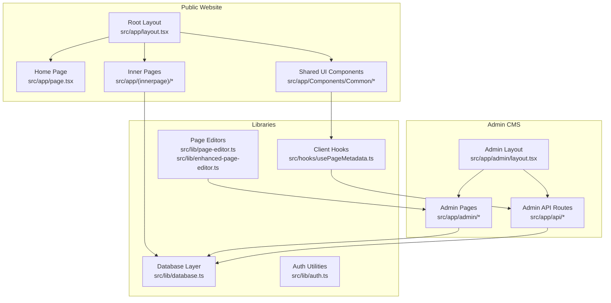
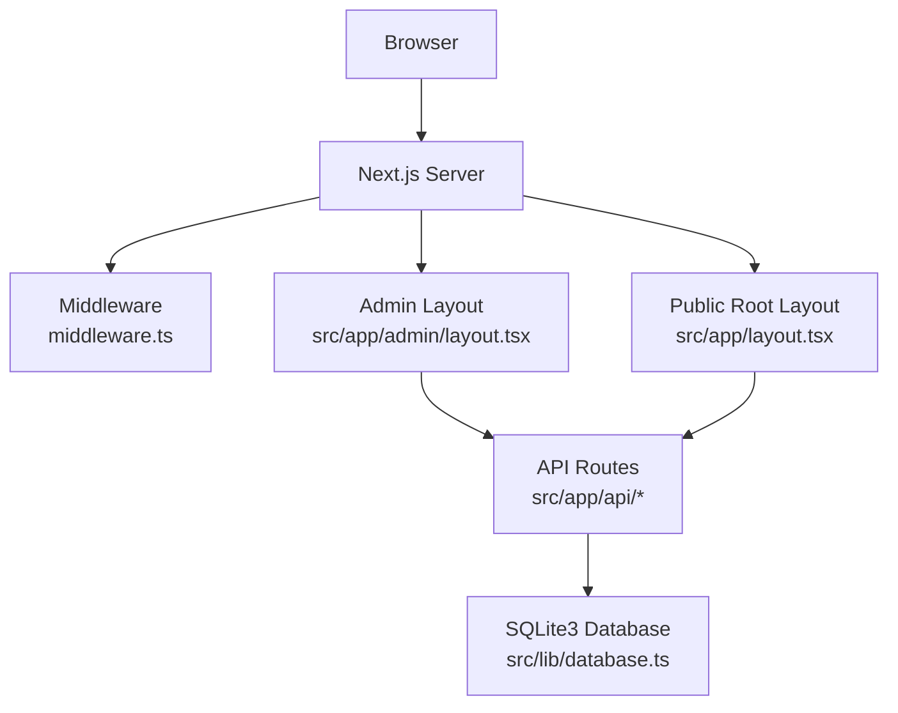
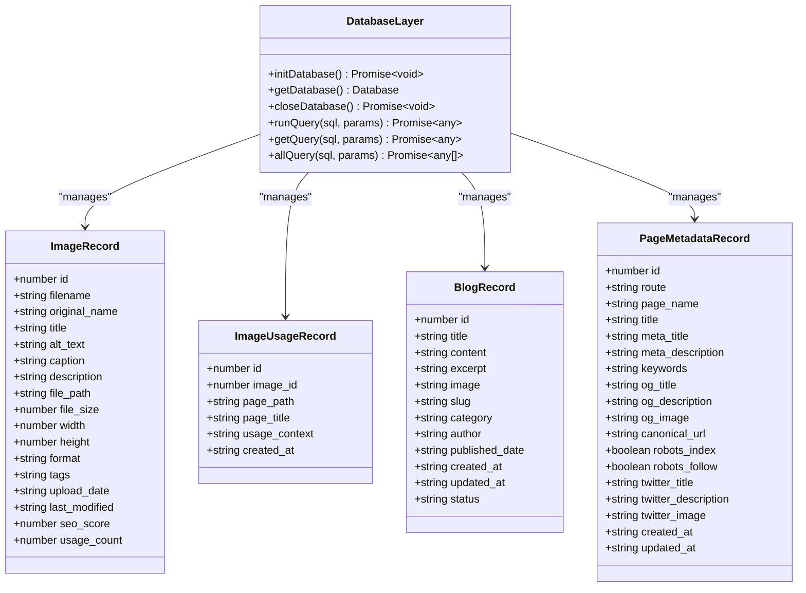
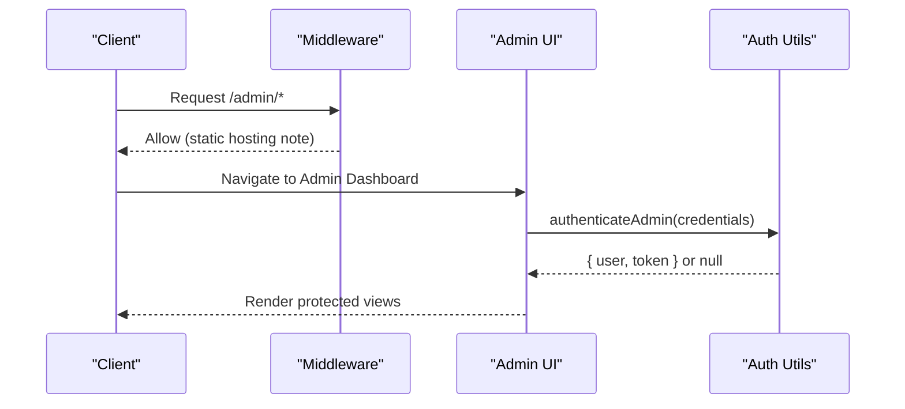
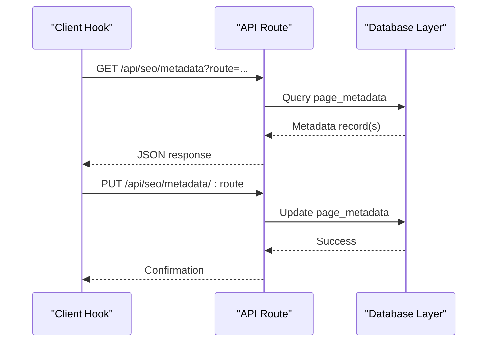
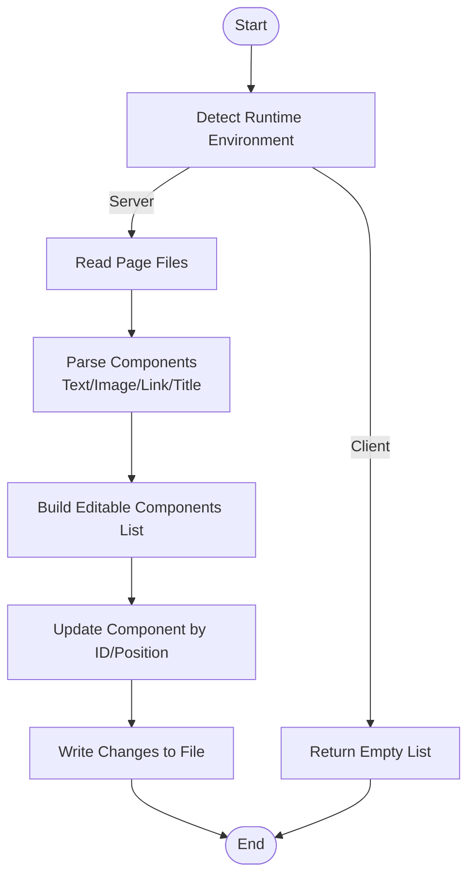
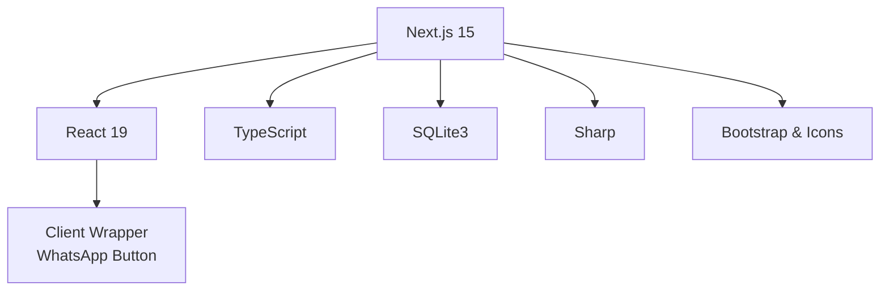

# System Architecture

<cite>
**Referenced Files in This Document**
- [package.json](file://package.json)
- [next.config.mjs](file://next.config.mjs)
- [middleware.ts](file://middleware.ts)
- [src/app/layout.tsx](file://src/app/layout.tsx)
- [src/lib/database.ts](file://src/lib/database.ts)
- [src/lib/auth.ts](file://src/lib/auth.ts)
- [src/app/admin/layout.tsx](file://src/app/admin/layout.tsx)
- [src/app/api/pages/route.ts](file://src/app/api/pages/route.ts)
- [src/app/api/blogs/route.ts](file://src/app/api/blogs/route.ts)
- [src/app/api/images/[id]/route.ts](file://src/app/api/images/[id]/route.ts)
- [src/app/Components/Common/ClientWrapper.tsx](file://src/app/Components/Common/ClientWrapper.tsx)
- [src/hooks/usePageMetadata.ts](file://src/hooks/usePageMetadata.ts)
- [src/lib/page-editor.ts](file://src/lib/page-editor.ts)
- [src/lib/enhanced-page-editor.ts](file://src/lib/enhanced-page-editor.ts)
</cite>

## Table of Contents
1. [Introduction](#introduction)
2. [Project Structure](#project-structure)
3. [Core Components](#core-components)
4. [Architecture Overview](#architecture-overview)
5. [Detailed Component Analysis](#detailed-component-analysis)
6. [Dependency Analysis](#dependency-analysis)
7. [Performance Considerations](#performance-considerations)
8. [Troubleshooting Guide](#troubleshooting-guide)
9. [Conclusion](#conclusion)
10. [Appendices](#appendices)

## Introduction
This document describes the system architecture of attechglobal.com, a Next.js 15 application leveraging the App Router dual-layer structure to serve both a public marketing website and an admin CMS backend. The system integrates server-side rendering and static generation, supports API routes for content and media management, and implements middleware-based authentication controls. The technology stack includes React 19, TypeScript, SQLite3 for local persistence, and Sharp for image processing. Deployment targets include cPanel static export with environment-specific build configurations.

## Project Structure
The project follows a Next.js 15 App Router layout with:
- Public website under src/app with route groups for home and inner pages
- Admin CMS under src/app/admin with dedicated pages and API routes
- Shared UI components under src/app/Components
- Libraries for database, authentication, and page editing under src/lib
- Client-side hooks for SEO metadata management under src/hooks

**Diagram sources**
- [src/app/layout.tsx](file://src/app/layout.tsx#L1-L47)
- [src/app/admin/layout.tsx](file://src/app/admin/layout.tsx#L1-L23)
- [src/lib/database.ts](file://src/lib/database.ts#L1-L255)
- [src/lib/auth.ts](file://src/lib/auth.ts#L1-L85)
- [src/hooks/usePageMetadata.ts](file://src/hooks/usePageMetadata.ts#L1-L218)
- [src/lib/page-editor.ts](file://src/lib/page-editor.ts#L1-L194)
- [src/lib/enhanced-page-editor.ts](file://src/lib/enhanced-page-editor.ts#L1-L287)

**Section sources**
- [src/app/layout.tsx](file://src/app/layout.tsx#L1-L47)
- [src/app/admin/layout.tsx](file://src/app/admin/layout.tsx#L1-L23)

## Core Components
- Root layout initializes global fonts, styles, and analytics, wraps children with a client-side wrapper that injects a WhatsApp button.
- Admin layout composes header and sidebar with a main content area for admin pages.
- Database library manages SQLite3 tables for images, image usage, blogs, and page metadata with helper functions for queries.
- Authentication utilities provide password hashing, JWT token generation/verification, and admin role checks.
- API routes expose endpoints for blogs, images, pages, and SEO metadata, with dynamic flags and database initialization on first request.
- Client hooks encapsulate fetching and updating page metadata via admin API endpoints.
- Page editors parse and update page components in source files for enhanced content editing.

**Section sources**
- [src/app/layout.tsx](file://src/app/layout.tsx#L1-L47)
- [src/app/admin/layout.tsx](file://src/app/admin/layout.tsx#L1-L23)
- [src/lib/database.ts](file://src/lib/database.ts#L1-L255)
- [src/lib/auth.ts](file://src/lib/auth.ts#L1-L85)
- [src/app/api/blogs/route.ts](file://src/app/api/blogs/route.ts#L1-L107)
- [src/app/api/images/[id]/route.ts](file://src/app/api/images/[id]/route.ts#L1-L158)
- [src/app/api/pages/route.ts](file://src/app/api/pages/route.ts#L1-L110)
- [src/hooks/usePageMetadata.ts](file://src/hooks/usePageMetadata.ts#L1-L218)
- [src/lib/page-editor.ts](file://src/lib/page-editor.ts#L1-L194)
- [src/lib/enhanced-page-editor.ts](file://src/lib/enhanced-page-editor.ts#L1-L287)

## Architecture Overview
The system employs a dual-layer architecture:
- Public website: renders pages with SSR/SSG, loads shared UI components, and integrates client-side analytics and a WhatsApp widget.
- Admin CMS: protected by middleware, provides dashboards for content management, image management, SEO metadata editing, and user administration.

**Diagram sources**
- [middleware.ts](file://middleware.ts#L1-L15)
- [src/app/layout.tsx](file://src/app/layout.tsx#L1-L47)
- [src/app/admin/layout.tsx](file://src/app/admin/layout.tsx#L1-L23)
- [src/app/api/blogs/route.ts](file://src/app/api/blogs/route.ts#L1-L107)
- [src/lib/database.ts](file://src/lib/database.ts#L1-L255)

## Detailed Component Analysis

### Database Layer
The database layer abstracts SQLite3 operations with typed interfaces for images, image usage, blogs, and page metadata. It ensures table creation on first use and exposes helpers for running queries, fetching single or multiple records, and closing connections.

**Diagram sources**
- [src/lib/database.ts](file://src/lib/database.ts#L1-L255)

**Section sources**
- [src/lib/database.ts](file://src/lib/database.ts#L1-L255)

### Authentication and Middleware
Authentication utilities provide password hashing, JWT signing/verification, and admin role checks. The middleware currently allows all admin routes without enforcement, noting that server-side processing is not available in static hosting mode.

**Diagram sources**
- [middleware.ts](file://middleware.ts#L1-L15)
- [src/lib/auth.ts](file://src/lib/auth.ts#L1-L85)

**Section sources**
- [middleware.ts](file://middleware.ts#L1-L15)
- [src/lib/auth.ts](file://src/lib/auth.ts#L1-L85)

### API Route Integration
Key API routes include:
- Blogs endpoint: paginated retrieval and creation of blog posts with SQLite3-backed persistence.
- Images endpoint: CRUD operations for image metadata and physical file deletion.
- Pages endpoint: mock data for page component discovery and simulated updates for the page editor.
- SEO metadata hooks: client-side hooks to fetch, update, create, and paginate page metadata.

**Diagram sources**
- [src/hooks/usePageMetadata.ts](file://src/hooks/usePageMetadata.ts#L1-L218)
- [src/app/api/blogs/route.ts](file://src/app/api/blogs/route.ts#L1-L107)
- [src/app/api/images/[id]/route.ts](file://src/app/api/images/[id]/route.ts#L1-L158)
- [src/lib/database.ts](file://src/lib/database.ts#L1-L255)

**Section sources**
- [src/app/api/blogs/route.ts](file://src/app/api/blogs/route.ts#L1-L107)
- [src/app/api/images/[id]/route.ts](file://src/app/api/images/[id]/route.ts#L1-L158)
- [src/app/api/pages/route.ts](file://src/app/api/pages/route.ts#L1-L110)
- [src/hooks/usePageMetadata.ts](file://src/hooks/usePageMetadata.ts#L1-L218)

### Page Editing Workflow
The enhanced page editor parses page components from source files, categorizing content by type and context, and supports targeted updates with context-aware replacements.

**Diagram sources**
- [src/lib/enhanced-page-editor.ts](file://src/lib/enhanced-page-editor.ts#L1-L287)
- [src/lib/page-editor.ts](file://src/lib/page-editor.ts#L1-L194)

**Section sources**
- [src/lib/enhanced-page-editor.ts](file://src/lib/enhanced-page-editor.ts#L1-L287)
- [src/lib/page-editor.ts](file://src/lib/page-editor.ts#L1-L194)

## Dependency Analysis
The application depends on Next.js 15, React 19, TypeScript, Bootstrap, and SQLite3. Image optimization leverages Next.js with Sharp for processing and WebP/AVIF formats. The configuration switches behavior for cPanel static export versus serverless hosting.

**Diagram sources**
- [package.json](file://package.json#L1-L41)
- [next.config.mjs](file://next.config.mjs#L1-L129)
- [src/app/Components/Common/ClientWrapper.tsx](file://src/app/Components/Common/ClientWrapper.tsx#L1-L11)

**Section sources**
- [package.json](file://package.json#L1-L41)
- [next.config.mjs](file://next.config.mjs#L1-L129)

## Performance Considerations
- Static export for cPanel: The build configuration enables output export and trailing slash adjustments for static hosting, with unoptimized images to satisfy static constraints.
- Image optimization: Next.js image optimization is configured with supported formats, device sizes, and CSP restrictions.
- Console removal and compression: Console logs are stripped in production builds, and compression is enabled to reduce payload sizes.
- Database initialization: API routes initialize the database on first request to minimize cold-start overhead.

[No sources needed since this section provides general guidance]

## Troubleshooting Guide
- Middleware behavior: The middleware is currently disabled for static hosting; admin routes are not enforced server-side.
- API route errors: Ensure database initialization occurs before queries and handle unique constraint violations for slugs.
- Image operations: Verify file paths and permissions when deleting physical files; confirm database cleanup for usage records.
- SEO metadata: Confirm route encoding and pagination parameters when using client hooks for fetching and updating metadata.

**Section sources**
- [middleware.ts](file://middleware.ts#L1-L15)
- [src/app/api/blogs/route.ts](file://src/app/api/blogs/route.ts#L98-L104)
- [src/app/api/images/[id]/route.ts](file://src/app/api/images/[id]/route.ts#L144-L148)
- [src/hooks/usePageMetadata.ts](file://src/hooks/usePageMetadata.ts#L23-L34)

## Conclusion
The attechglobal.com system combines a public marketing website and an admin CMS using Next.js 15’s App Router. The dual-layer architecture separates concerns between public presentation and administrative workflows, backed by SQLite3 and enhanced by Sharp for image processing. The current middleware and static export configuration align with cPanel hosting requirements, while API routes provide content and metadata management. For production hardening, secure environment variables, enforced middleware, and robust error handling should be prioritized.

## Appendices

### Technology Stack Details
- Frontend: Next.js 15, React 19, TypeScript
- Styling: Bootstrap and Bootstrap Icons
- Media: Next.js Image Optimization with Sharp for WebP/AVIF
- Persistence: SQLite3 with typed interfaces
- Utilities: Multer for uploads, html-react-parser for content, jsonwebtoken/bcryptjs for auth

**Section sources**
- [package.json](file://package.json#L1-L41)
- [next.config.mjs](file://next.config.mjs#L1-L129)

### Deployment Topology for cPanel Hosting
- Static export mode: Enabled via environment variable to produce a static site suitable for cPanel.
- Image handling: Unoptimized images required for static export; remote patterns configured for CDN-hosted assets.
- Trailing slashes: Adjusted for static hosting compatibility.

**Section sources**
- [next.config.mjs](file://next.config.mjs#L1-L129)