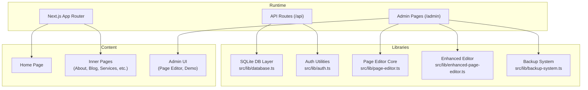
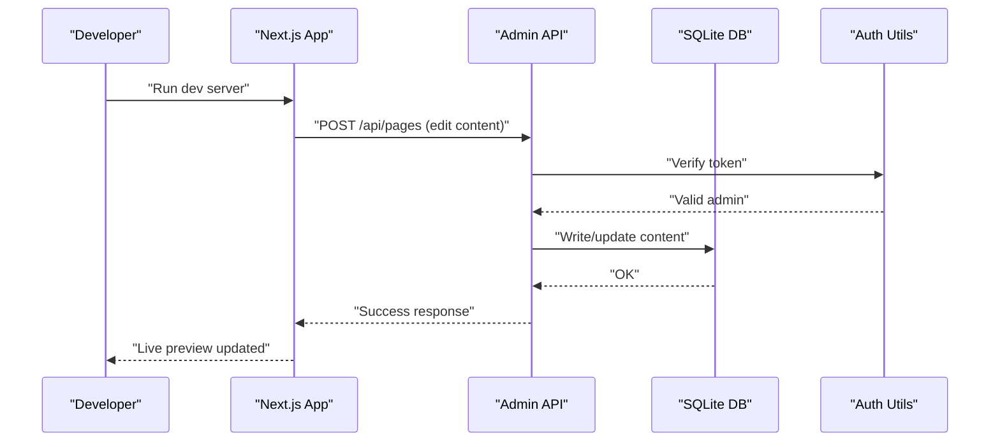
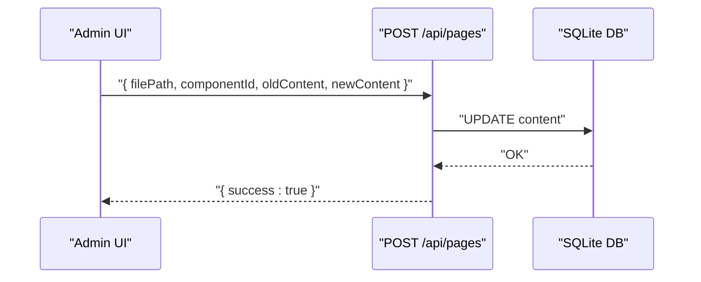
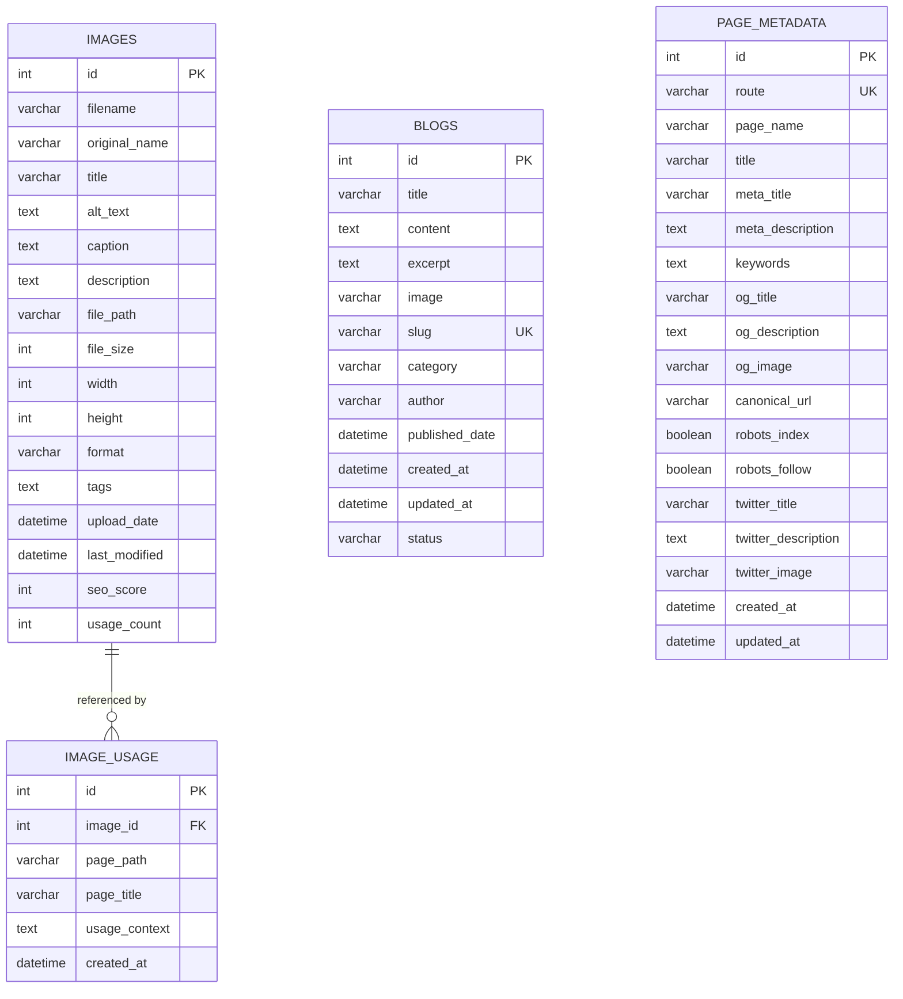
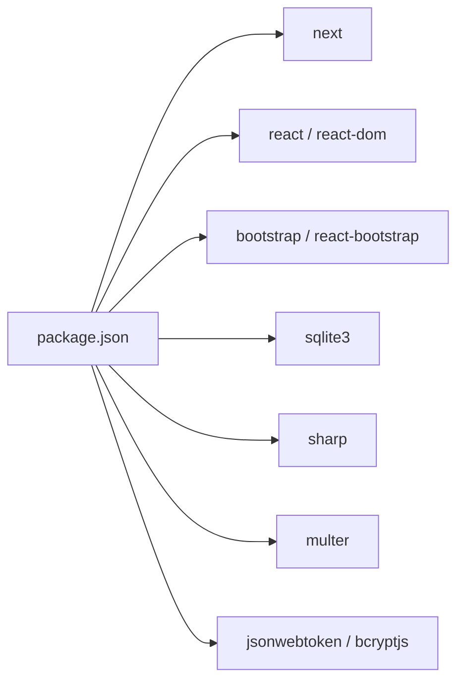

# Contributing and Development

<cite>
**Referenced Files in This Document**
- [package.json](file://package.json)
- [README.md](file://README.md)
- [eslint.config.mjs](file://eslint.config.mjs)
- [tsconfig.json](file://tsconfig.json)
- [next.config.mjs](file://next.config.mjs)
- [netlify.toml](file://netlify.toml)
- [Content_Briefs_Template.md](file://Content_Briefs_Template.md)
- [PRD_Services_Content_Strategy.md](file://PRD_Services_Content_Strategy.md)
- [Implementation_Plan.md](file://Implementation_Plan.md)
- [Detailed_Task_Breakdown.md](file://Detailed_Task_Breakdown.md)
- [PAGE_EDITOR_README.md](file://PAGE_EDITOR_README.md)
- [src/lib/database.ts](file://src/lib/database.ts)
- [src/lib/auth.ts](file://src/lib/auth.ts)
- [.gitignore](file://.gitignore)
- [src/hooks/usePageMetadata.ts](file://src/hooks/usePageMetadata.ts)
- [src/hooks/useFilePageMetadata.ts](file://src/hooks/useFilePageMetadata.ts)
- [src/lib/page-editor.ts](file://src/lib/page-editor.ts)
- [src/lib/enhanced-page-editor.ts](file://src/lib/enhanced-page-editor.ts)
- [src/lib/backup-system.ts](file://src/lib/backup-system.ts)
- [src/app/admin/page-editor/page.tsx](file://src/app/admin/page-editor/page.tsx)
- [src/app/admin/page-editor-demo/page.tsx](file://src/app/admin/page-editor-demo/page.tsx)
- [src/app/api/pages/route.ts](file://src/app/api/pages/route.ts)
- [src/app/(innerpage)/about/page.tsx](file://src/app/(innerpage)/about/page.tsx)
- [src/app/(innerpage)/blog/page.tsx](file://src/app/(innerpage)/blog/page.tsx)
- [src/app/(innerpage)/service/web-development/page.tsx](file://src/app/(innerpage)/service/web-development/page.tsx)
- [src/app/(innerpage)/service/digital-marketing/page.tsx](file://src/app/(innerpage)/service/digital-marketing/page.tsx)
- [src/app/(innerpage)/service/mobile-application/page.tsx](file://src/app/(innerpage)/service/mobile-application/page.tsx)
- [src/app/(innerpage)/service/seo/page.tsx](file://src/app/(innerpage)/service/seo/page.tsx)
- [src/app/(innerpage)/service/ppc/page.tsx](file://src/app/(innerpage)/service/ppc/page.tsx)
- [src/app/(innerpage)/service/smm/page.tsx](file://src/app/(innerpage)/service/smm/page.tsx)
- [src/app/(innerpage)/service/email-marketing/page.tsx](file://src/app/(innerpage)/service/email-marketing/page.tsx)
- [src/app/(innerpage)/service/whatsapp-marketing/page.tsx](file://src/app/(innerpage)/service/whatsapp-marketing/page.tsx)
- [src/app/(innerpage)/service/crm/page.tsx](file://src/app/(innerpage)/service/crm/page.tsx)
- [src/app/(innerpage)/service/erp/page.tsx](file://src/app/(innerpage)/service/erp/page.tsx)
- [src/app/(innerpage)/service/lms/page.tsx](file://src/app/(innerpage)/service/lms/page.tsx)
- [src/app/(innerpage)/service/ecommerce/page.tsx](file://src/app/(innerpage)/service/ecommerce/page.tsx)
</cite>

## Table of Contents
1. [Introduction](#introduction)
2. [Project Structure](#project-structure)
3. [Core Components](#core-components)
4. [Architecture Overview](#architecture-overview)
5. [Detailed Component Analysis](#detailed-component-analysis)
6. [Dependency Analysis](#dependency-analysis)
7. [Performance Considerations](#performance-considerations)
8. [Troubleshooting Guide](#troubleshooting-guide)
9. [Conclusion](#conclusion)
10. [Appendices](#appendices)

## Introduction
This document defines the end-to-end contributing and development workflow for the attechglobal.com project. It covers code style and linting, pull request processes, testing requirements, PRD and content strategy, component and API development, database schema changes, TypeScript standards, code review, version control and branching, releases, feature additions, backward compatibility, environment setup, debugging, performance optimization, content strategy for marketing websites, copywriting standards, multilingual considerations, security, accessibility, and cross-browser testing.

## Project Structure
The project is a Next.js 15 application using React 19, TypeScript, and a SQLite-backed admin/content layer. It supports both Vercel-style deployments and static export for cPanel via environment flags. The admin features include a page editor with live preview, backups, and safe editing.

**Diagram sources**
- [next.config.mjs](file://next.config.mjs#L1-L129)
- [src/lib/database.ts](file://src/lib/database.ts#L1-L255)
- [src/lib/auth.ts](file://src/lib/auth.ts#L1-L85)
- [src/lib/page-editor.ts](file://src/lib/page-editor.ts)
- [src/lib/enhanced-page-editor.ts](file://src/lib/enhanced-page-editor.ts)
- [src/lib/backup-system.ts](file://src/lib/backup-system.ts)
- [src/app/admin/page-editor/page.tsx](file://src/app/admin/page-editor/page.tsx)
- [src/app/admin/page-editor-demo/page.tsx](file://src/app/admin/page-editor-demo/page.tsx)

**Section sources**
- [package.json](file://package.json#L1-L41)
- [next.config.mjs](file://next.config.mjs#L1-L129)
- [netlify.toml](file://netlify.toml#L1-L21)

## Core Components
- Code quality and linting: ESLint flat config extends Next.js core web vitals.
- Type safety: TypeScript strict disabled, allowJS enabled, isolated modules, JSX preserve, path aliases.
- Build and deployment: Next.js build with optional static export for cPanel; Netlify configuration for redirects and security headers.
- Admin and content: SQLite-backed metadata and image usage tracking; admin auth; page editor with backups and live preview.
- Content strategy: PRD, content briefs, implementation plan, and detailed task breakdown for service pages.

**Section sources**
- [eslint.config.mjs](file://eslint.config.mjs#L1-L15)
- [tsconfig.json](file://tsconfig.json#L1-L39)
- [next.config.mjs](file://next.config.mjs#L1-L129)
- [netlify.toml](file://netlify.toml#L1-L21)
- [PRD_Services_Content_Strategy.md](file://PRD_Services_Content_Strategy.md#L1-L199)
- [Content_Briefs_Template.md](file://Content_Briefs_Template.md#L1-L281)
- [Implementation_Plan.md](file://Implementation_Plan.md#L1-L300)
- [Detailed_Task_Breakdown.md](file://Detailed_Task_Breakdown.md#L1-L538)

## Architecture Overview
The system comprises:
- Frontend: Next.js App Router pages and components under src/app and src/components.
- Admin: Dedicated admin pages and API endpoints for editing and managing content.
- Backend: SQLite database for images, blogs, and page metadata; helper functions for CRUD.
- Auth: JWT-based admin authentication utilities.
- Build and hosting: Next.js build with optional static export; Netlify redirects and headers.

**Diagram sources**
- [src/app/api/pages/route.ts](file://src/app/api/pages/route.ts)
- [src/lib/auth.ts](file://src/lib/auth.ts#L1-L85)
- [src/lib/database.ts](file://src/lib/database.ts#L1-L255)
- [PAGE_EDITOR_README.md](file://PAGE_EDITOR_README.md#L74-L89)

## Detailed Component Analysis

### Code Style, Linting, and TypeScript Standards
- ESLint: Flat config extends Next’s recommended rules for web vitals.
- TypeScript: Path aliases @/, isolated modules, JSX preserve, allowJS, skipLibCheck, incremental builds, noEmit.
- Scripts: dev, build, build:cpanel, start, lint.

**Section sources**
- [eslint.config.mjs](file://eslint.config.mjs#L1-L15)
- [tsconfig.json](file://tsconfig.json#L1-L39)
- [package.json](file://package.json#L5-L11)

### Pull Request and Code Review Process
- Branching model: Use feature branches prefixed with feature/, fix/, chore/, docs/. Merge via pull requests targeting main.
- PR checklist:
  - All tests pass locally.
  - Lint passes.
  - No console logs in production builds.
  - Backward compatibility maintained or documented.
  - Security review for auth and admin endpoints.
  - Accessibility and cross-browser checks for UI changes.
  - Performance impact reviewed.
- Reviewers: Assign at least one maintainer; ensure approvals before merge.
- Merge: Squash or rebase; keep commit messages clear and scoped.

[No sources needed since this section provides general guidance]

### Testing Requirements
- Unit/integration: Add tests for database helpers and auth utilities.
- E2E: Validate admin page editor flows (edit, save, backup, revert).
- Lint: Run npm run lint before submitting PRs.
- Build: Verify both Vercel and cPanel static export builds succeed.

**Section sources**
- [package.json](file://package.json#L10-L10)
- [next.config.mjs](file://next.config.mjs#L113-L122)

### PRD and Content Strategy
- PRD: Defines service categories, page structure, SEO requirements, success metrics, and approval workflow.
- Content Briefs: Provides standardized templates for each service with SEO keywords, structure, visuals, and conversion goals.
- Implementation Plan: Phased rollout across core services, sub-services, and optimization/testing.
- Detailed Task Breakdown: Specific deliverables per service page, component updates, QA tasks, and milestones.

**Section sources**
- [PRD_Services_Content_Strategy.md](file://PRD_Services_Content_Strategy.md#L1-L199)
- [Content_Briefs_Template.md](file://Content_Briefs_Template.md#L1-L281)
- [Implementation_Plan.md](file://Implementation_Plan.md#L1-L300)
- [Detailed_Task_Breakdown.md](file://Detailed_Task_Breakdown.md#L1-L538)

### Component Development Examples
- Service page updates: Extend existing pages under src/app/(innerpage)/service/<slug>/page.tsx with content from the task breakdown.
- Reusable components: Update Services4 and ServiceDetails components to reflect accurate descriptions, icons, and dynamic content.
- Navigation: Ensure Nav component links to all service pages and updates hover states and mobile optimization.

Practical references:
- [src/app/(innerpage)/service/web-development/page.tsx](file://src/app/(innerpage)/service/web-development/page.tsx)
- [src/app/(innerpage)/service/digital-marketing/page.tsx](file://src/app/(innerpage)/service/digital-marketing/page.tsx)
- [src/app/(innerpage)/service/mobile-application/page.tsx](file://src/app/(innerpage)/service/mobile-application/page.tsx)
- [src/app/(innerpage)/service/seo/page.tsx](file://src/app/(innerpage)/service/seo/page.tsx)
- [src/app/(innerpage)/service/ppc/page.tsx](file://src/app/(innerpage)/service/ppc/page.tsx)
- [src/app/(innerpage)/service/smm/page.tsx](file://src/app/(innerpage)/service/smm/page.tsx)
- [src/app/(innerpage)/service/email-marketing/page.tsx](file://src/app/(innerpage)/service/email-marketing/page.tsx)
- [src/app/(innerpage)/service/whatsapp-marketing/page.tsx](file://src/app/(innerpage)/service/whatsapp-marketing/page.tsx)
- [src/app/(innerpage)/service/crm/page.tsx](file://src/app/(innerpage)/service/crm/page.tsx)
- [src/app/(innerpage)/service/erp/page.tsx](file://src/app/(innerpage)/service/erp/page.tsx)
- [src/app/(innerpage)/service/lms/page.tsx](file://src/app/(innerpage)/service/lms/page.tsx)
- [src/app/(innerpage)/service/ecommerce/page.tsx](file://src/app/(innerpage)/service/ecommerce/page.tsx)

**Section sources**
- [Detailed_Task_Breakdown.md](file://Detailed_Task_Breakdown.md#L8-L400)

### API Extension Procedures
- Admin page editor API: POST /api/pages updates a component by file path and component ID.
- Auth endpoints: Implement login endpoint returning JWT tokens for admin access.
- Database helpers: Use runQuery/getQuery/allQuery for CRUD operations.

**Diagram sources**
- [PAGE_EDITOR_README.md](file://PAGE_EDITOR_README.md#L74-L89)
- [src/app/api/pages/route.ts](file://src/app/api/pages/route.ts)
- [src/lib/database.ts](file://src/lib/database.ts#L214-L254)

**Section sources**
- [PAGE_EDITOR_README.md](file://PAGE_EDITOR_README.md#L74-L89)
- [src/lib/database.ts](file://src/lib/database.ts#L1-L255)

### Database Schema Modifications
- Existing tables: images, image_usage, blogs, page_metadata.
- Typical change pattern:
  - Add migration function or extend createTables.
  - Add new helper functions for reads/writes.
  - Update admin UI and API handlers to surface new fields.
- Example: Add a new column to images or blogs; update interfaces and CRUD helpers.

**Diagram sources**
- [src/lib/database.ts](file://src/lib/database.ts#L105-L181)

**Section sources**
- [src/lib/database.ts](file://src/lib/database.ts#L1-L255)

### Version Control, Branching, and Release Procedures
- Branching:
  - main: protected, latest stable.
  - develop: integration branch for features.
  - feature/<issue>: feature work.
  - hotfix/<issue>: urgent fixes.
- Commit conventions: feat:, fix:, docs:, style:, refactor:, test:, chore:.
- Releases:
  - Tag vX.Y.Z on main after QA.
  - Changelog entries per PR.
  - For cPanel export, use build:cpanel script and verify static export.

**Section sources**
- [package.json](file://package.json#L8-L8)
- [next.config.mjs](file://next.config.mjs#L3-L9)

### Adding New Features and Maintaining Backward Compatibility
- Feature scope: Define in PRD and content briefs; align with existing page structure.
- Backward compatibility:
  - Avoid breaking changes to API endpoints and database schemas.
  - Add new fields with defaults; deprecate gradually.
- Hooks and metadata: Use existing hooks and metadata utilities to persist and render new content.

**Section sources**
- [PRD_Services_Content_Strategy.md](file://PRD_Services_Content_Strategy.md#L1-L199)
- [src/hooks/usePageMetadata.ts](file://src/hooks/usePageMetadata.ts)
- [src/hooks/useFilePageMetadata.ts](file://src/hooks/useFilePageMetadata.ts)

### Development Environment Setup and Debugging
- Install dependencies and run dev server.
- Lint before committing.
- For cPanel export, set CPANEL_EXPORT=true and build with build:cpanel.
- Debugging tips:
  - Use Next.js dev tools and browser devtools.
  - Inspect API responses and database writes.
  - Validate image domains and formats in next.config.mjs.

**Section sources**
- [README.md](file://README.md#L3-L37)
- [package.json](file://package.json#L5-L11)
- [next.config.mjs](file://next.config.mjs#L1-L129)

### Performance Optimization Practices
- Remove console logs in production builds.
- Enable compression and disable powered-by header.
- Optimize images and enable AVIF/WebP formats.
- Prefer static export for cPanel with unoptimized images and trailing slashes.

**Section sources**
- [next.config.mjs](file://next.config.mjs#L116-L126)

### Content Strategy for Marketing Agency Websites
- Tone: Professional yet approachable; grade 8–10 readability.
- Structure: Hero, Overview, Features & Benefits, Process, Pricing, FAQ, Case Studies, CTA.
- SEO: Primary/secondary/long-tail keywords, meta tags, alt text, internal linking, schema markup.
- Conversion: Multiple CTAs, lead magnets, trust signals, clear pricing.

**Section sources**
- [PRD_Services_Content_Strategy.md](file://PRD_Services_Content_Strategy.md#L87-L126)
- [Content_Briefs_Template.md](file://Content_Briefs_Template.md#L86-L97)

### Copywriting Standards and Multilingual Considerations
- Standards: Unique, scannable, value-driven, benefit-focused.
- Multilingual: Use i18n-ready keys and separate content per locale; avoid hardcoded strings in components.

[No sources needed since this section provides general guidance]

### Security Best Practices
- Admin auth: JWT with secret stored securely; verify tokens on protected routes.
- Headers: X-Frame-Options, X-XSS-Protection, X-Content-Type-Options, Referrer-Policy.
- Page editor: Restricted editing scope, automatic backups, validation, and logging.

**Section sources**
- [src/lib/auth.ts](file://src/lib/auth.ts#L1-L85)
- [netlify.toml](file://netlify.toml#L14-L21)
- [PAGE_EDITOR_README.md](file://PAGE_EDITOR_README.md#L140-L146)

### Accessibility and Cross-Browser Compatibility
- Accessibility: WCAG-compliant design, semantic HTML, ARIA attributes where needed.
- Cross-browser: Validate on Chrome, Firefox, Safari, Edge; test responsive breakpoints.

**Section sources**
- [Implementation_Plan.md](file://Implementation_Plan.md#L241-L254)

## Dependency Analysis
External dependencies include Next.js, React, Bootstrap, react-bootstrap, sqlite3, sharp, multer, bcryptjs, jsonwebtoken, and related TypeScript types. Dev dependencies include ESLint and TypeScript.

**Diagram sources**
- [package.json](file://package.json#L12-L31)

**Section sources**
- [package.json](file://package.json#L1-L41)

## Performance Considerations
- Production: Remove console logs, enable compression, disable powered-by header.
- Images: Use AVIF/WebP, appropriate sizes, and CSP-aligned domains.
- Builds: Use Next.js optimized builds; static export for cPanel when required.

**Section sources**
- [next.config.mjs](file://next.config.mjs#L116-L126)

## Troubleshooting Guide
- Page editor issues:
  - Verify file path correctness and component existence.
  - Ensure image URLs are accessible.
  - Use search/filter to locate content.
- Database errors:
  - Confirm initialization and table creation.
  - Check query parameters and constraints.
- Auth failures:
  - Validate JWT secret and token signature.
  - Confirm admin credentials and roles.

**Section sources**
- [PAGE_EDITOR_README.md](file://PAGE_EDITOR_README.md#L114-L125)
- [src/lib/database.ts](file://src/lib/database.ts#L84-L184)
- [src/lib/auth.ts](file://src/lib/auth.ts#L48-L79)

## Conclusion
This guide consolidates the development workflow, content strategy, and operational practices for attechglobal.com. By following the PRD, content briefs, and task breakdowns, contributors can implement consistent, SEO-friendly, and conversion-focused service pages. Adhering to ESLint, TypeScript, security, accessibility, and performance guidelines ensures a robust, maintainable product.

## Appendices
- Admin page editor API endpoints and usage are documented in the page editor readme.
- Database interfaces and helper functions are defined in the database library.
- Authentication utilities provide token generation and verification for admin access.

**Section sources**
- [PAGE_EDITOR_README.md](file://PAGE_EDITOR_README.md#L1-L154)
- [src/lib/database.ts](file://src/lib/database.ts#L1-L255)
- [src/lib/auth.ts](file://src/lib/auth.ts#L1-L85)