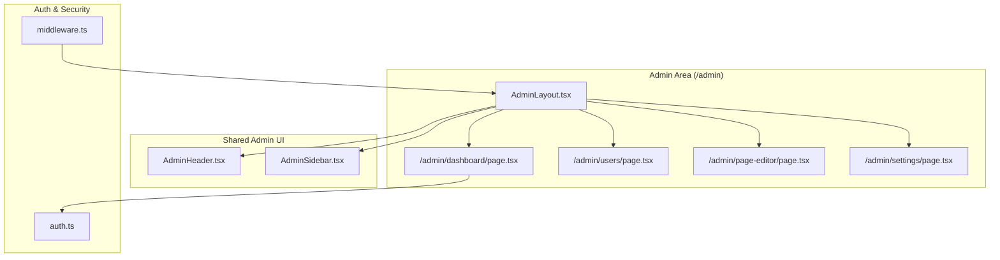
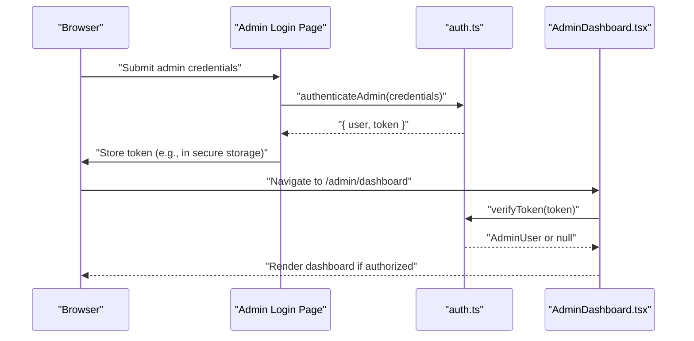
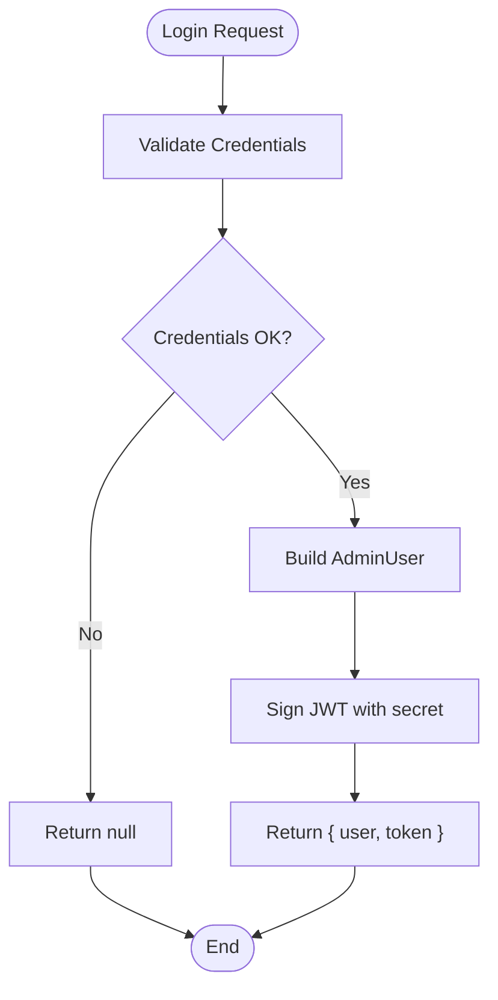
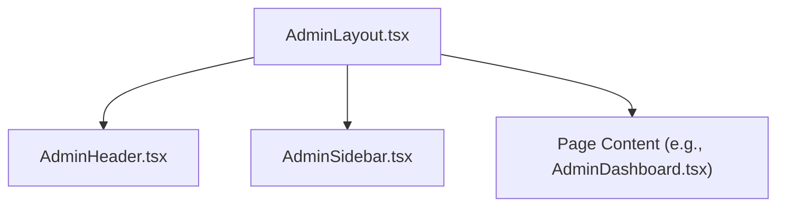
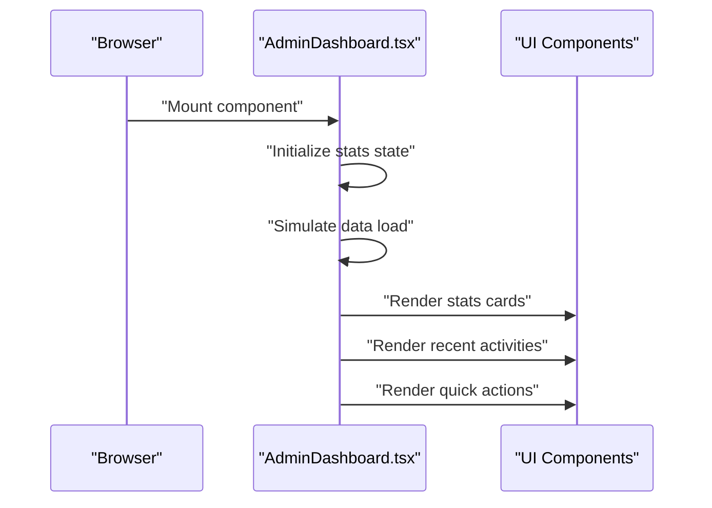
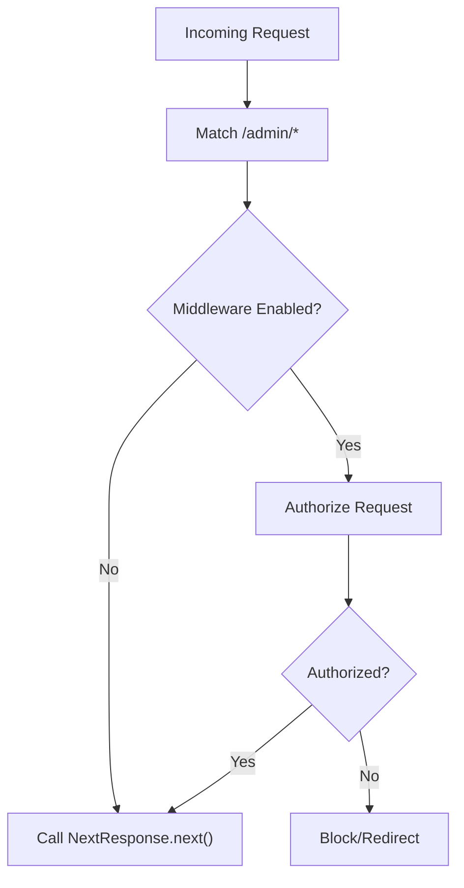
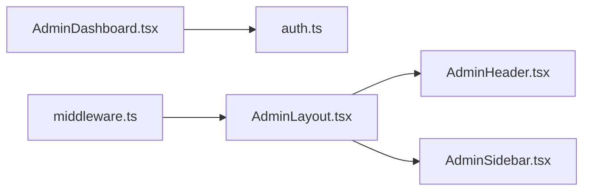

# Admin Dashboard

<cite>
**Referenced Files in This Document**
- [auth.ts](file://src/lib/auth.ts)
- [AdminLayout.tsx](file://src/app/admin/layout.tsx)
- [AdminHeader.tsx](file://src/app/Components/Admin/AdminHeader.tsx)
- [AdminSidebar.tsx](file://src/app/Components/Admin/AdminSidebar.tsx)
- [AdminDashboard.tsx](file://src/app/admin/dashboard/page.tsx)
- [middleware.ts](file://middleware.ts)
- [README.md](file://README.md)
</cite>

## Table of Contents
1. [Introduction](#introduction)
2. [Project Structure](#project-structure)
3. [Core Components](#core-components)
4. [Architecture Overview](#architecture-overview)
5. [Detailed Component Analysis](#detailed-component-analysis)
6. [Dependency Analysis](#dependency-analysis)
7. [Performance Considerations](#performance-considerations)
8. [Troubleshooting Guide](#troubleshooting-guide)
9. [Conclusion](#conclusion)
10. [Appendices](#appendices)

## Introduction
This document describes the attechglobal.com admin dashboard system. It explains the authentication and authorization framework using JWT tokens and bcrypt-based password verification, the admin layout structure with header navigation and sidebar, and the dashboard’s real-time-like content editing capabilities. It also documents user management concepts, session handling, and security considerations, along with examples of admin workflows and permission models.

## Project Structure
The admin dashboard is built with Next.js App Router. The admin area is organized under the `/admin` route group, with a shared admin layout wrapping page components. Authentication utilities reside in a dedicated library module. Middleware exists but is currently disabled for static hosting compatibility.

**Diagram sources**
- [AdminLayout.tsx](file://src/app/admin/layout.tsx#L1-L23)
- [AdminHeader.tsx](file://src/app/Components/Admin/AdminHeader.tsx#L1-L22)
- [AdminSidebar.tsx](file://src/app/Components/Admin/AdminSidebar.tsx#L1-L84)
- [AdminDashboard.tsx](file://src/app/admin/dashboard/page.tsx#L1-L197)
- [auth.ts](file://src/lib/auth.ts#L1-L85)
- [middleware.ts](file://middleware.ts#L1-L15)

**Section sources**
- [AdminLayout.tsx](file://src/app/admin/layout.tsx#L1-L23)
- [AdminHeader.tsx](file://src/app/Components/Admin/AdminHeader.tsx#L1-L22)
- [AdminSidebar.tsx](file://src/app/Components/Admin/AdminSidebar.tsx#L1-L84)
- [AdminDashboard.tsx](file://src/app/admin/dashboard/page.tsx#L1-L197)
- [auth.ts](file://src/lib/auth.ts#L1-L85)
- [middleware.ts](file://middleware.ts#L1-L15)

## Core Components
- Authentication utilities:
  - Password hashing and verification using bcrypt
  - JWT token generation and verification
  - Admin user model and role checks
- Admin layout:
  - Shared header and sidebar components
  - Main content container for admin pages
- Dashboard:
  - Stat cards and recent activity feed
  - Quick actions and page editor integration

Key implementation references:
- Authentication and roles: [auth.ts](file://src/lib/auth.ts#L1-L85)
- Admin layout composition: [AdminLayout.tsx](file://src/app/admin/layout.tsx#L1-L23)
- Header and sidebar: [AdminHeader.tsx](file://src/app/Components/Admin/AdminHeader.tsx#L1-L22), [AdminSidebar.tsx](file://src/app/Components/Admin/AdminSidebar.tsx#L1-L84)
- Dashboard page: [AdminDashboard.tsx](file://src/app/admin/dashboard/page.tsx#L1-L197)

**Section sources**
- [auth.ts](file://src/lib/auth.ts#L1-L85)
- [AdminLayout.tsx](file://src/app/admin/layout.tsx#L1-L23)
- [AdminHeader.tsx](file://src/app/Components/Admin/AdminHeader.tsx#L1-L22)
- [AdminSidebar.tsx](file://src/app/Components/Admin/AdminSidebar.tsx#L1-L84)
- [AdminDashboard.tsx](file://src/app/admin/dashboard/page.tsx#L1-L197)

## Architecture Overview
The admin dashboard uses a client-side layout with a shared header and sidebar. Authentication is handled via JWT tokens generated on the server-side utilities and verified on the client. The current middleware is disabled for static hosting; future deployments may enable it to enforce protected routes.

**Diagram sources**
- [auth.ts](file://src/lib/auth.ts#L62-L79)
- [auth.ts](file://src/lib/auth.ts#L48-L59)
- [AdminDashboard.tsx](file://src/app/admin/dashboard/page.tsx#L1-L197)

## Detailed Component Analysis

### Authentication and Authorization Framework
- Password hashing and verification:
  - bcrypt is used for hashing and comparing passwords.
  - Hashing is deterministic and computationally intensive to resist brute-force attacks.
- JWT token lifecycle:
  - Tokens are signed with a secret and expire after a configured duration.
  - Token verification decodes claims and returns an admin user object or null.
- Admin roles:
  - Role checks include super_admin and admin.
  - The system defines an AdminUser interface and a LoginCredentials shape.

**Diagram sources**
- [auth.ts](file://src/lib/auth.ts#L62-L79)
- [auth.ts](file://src/lib/auth.ts#L35-L45)

**Section sources**
- [auth.ts](file://src/lib/auth.ts#L1-L85)

### Admin Layout Structure
- AdminLayout composes the shared header and sidebar with the page content.
- The header displays the admin badge and branding.
- The sidebar provides navigation links to dashboard, users, content, services, projects, blog, image management, page editor, demo, and settings.

**Diagram sources**
- [AdminLayout.tsx](file://src/app/admin/layout.tsx#L1-L23)
- [AdminHeader.tsx](file://src/app/Components/Admin/AdminHeader.tsx#L1-L22)
- [AdminSidebar.tsx](file://src/app/Components/Admin/AdminSidebar.tsx#L1-L84)

**Section sources**
- [AdminLayout.tsx](file://src/app/admin/layout.tsx#L1-L23)
- [AdminHeader.tsx](file://src/app/Components/Admin/AdminHeader.tsx#L1-L22)
- [AdminSidebar.tsx](file://src/app/Components/Admin/AdminSidebar.tsx#L1-L84)

### Dashboard Interface and Real-Time Editing Capabilities
- Dashboard page renders statistics cards and recent activities.
- It integrates quick actions and a page editor quick-start component.
- The dashboard simulates loading and updates state accordingly.

**Diagram sources**
- [AdminDashboard.tsx](file://src/app/admin/dashboard/page.tsx#L1-L197)

**Section sources**
- [AdminDashboard.tsx](file://src/app/admin/dashboard/page.tsx#L1-L197)

### Protected Routes and Middleware Integration
- The middleware configuration targets the /admin route group.
- Currently, the middleware is disabled for static hosting environments.
- Enabling middleware would allow enforcing authentication and role checks per request.

**Diagram sources**
- [middleware.ts](file://middleware.ts#L4-L14)

**Section sources**
- [middleware.ts](file://middleware.ts#L1-L15)

## Dependency Analysis
- Admin components depend on shared UI components for header and sidebar.
- The dashboard depends on authentication utilities for role checks and token verification.
- Middleware depends on Next.js server APIs and is configured to match admin routes.

**Diagram sources**
- [AdminDashboard.tsx](file://src/app/admin/dashboard/page.tsx#L1-L197)
- [auth.ts](file://src/lib/auth.ts#L1-L85)
- [AdminLayout.tsx](file://src/app/admin/layout.tsx#L1-L23)
- [AdminHeader.tsx](file://src/app/Components/Admin/AdminHeader.tsx#L1-L22)
- [AdminSidebar.tsx](file://src/app/Components/Admin/AdminSidebar.tsx#L1-L84)
- [middleware.ts](file://middleware.ts#L1-L15)

**Section sources**
- [AdminDashboard.tsx](file://src/app/admin/dashboard/page.tsx#L1-L197)
- [auth.ts](file://src/lib/auth.ts#L1-L85)
- [AdminLayout.tsx](file://src/app/admin/layout.tsx#L1-L23)
- [AdminHeader.tsx](file://src/app/Components/Admin/AdminHeader.tsx#L1-L22)
- [AdminSidebar.tsx](file://src/app/Components/Admin/AdminSidebar.tsx#L1-L84)
- [middleware.ts](file://middleware.ts#L1-L15)

## Performance Considerations
- Client-side rendering: The dashboard and other admin pages are client components. Keep payloads small and lazy-load heavy widgets.
- Token caching: On the client, avoid frequent re-verification of valid tokens; reuse verified user state.
- Middleware overhead: With middleware disabled, reduce server-side checks. Enable it on server environments to centralize protection.
- Static hosting: The current setup targets static hosting; dynamic admin features require server-side routing and middleware.

[No sources needed since this section provides general guidance]

## Troubleshooting Guide
- Authentication failures:
  - Ensure credentials match the predefined admin account and that the JWT secret is configured.
  - Verify token expiration and re-login if needed.
- Middleware not enforcing:
  - Confirm middleware is enabled and deployed on a server environment that supports it.
- Navigation issues:
  - Check sidebar links and ensure the pathname comparison matches the intended routes.

**Section sources**
- [auth.ts](file://src/lib/auth.ts#L48-L59)
- [auth.ts](file://src/lib/auth.ts#L62-L79)
- [middleware.ts](file://middleware.ts#L4-L14)
- [AdminSidebar.tsx](file://src/app/Components/Admin/AdminSidebar.tsx#L6-L82)

## Conclusion
The attechglobal.com admin dashboard leverages a clean client-side layout with shared header and sidebar, a centralized authentication library for JWT and bcrypt, and a dashboard focused on statistics and quick actions. While middleware is currently disabled for static hosting, enabling it would strengthen route protection. The system provides a foundation for user management, content editing, and settings administration with clear separation of concerns and extensible components.

[No sources needed since this section summarizes without analyzing specific files]

## Appendices

### Admin Workflows and Examples
- Logging in:
  - Submit admin credentials to the login endpoint; receive a signed JWT token.
- Navigating the dashboard:
  - Use the sidebar to move between dashboard, users, content, services, projects, blog, images, page editor, demo, and settings.
- Editing content:
  - Use the page editor quick-start component on the dashboard to initiate content modifications.
- Managing users:
  - Navigate to the users section to manage accounts and permissions.

[No sources needed since this section provides general guidance]

### Security Considerations
- Environment variables:
  - Store the JWT secret securely and rotate it periodically.
- Token storage:
  - Prefer secure, httpOnly cookies or short-lived tokens with strict SameSite policies on compatible hosts.
- Rate limiting:
  - Apply rate limits on authentication endpoints to mitigate brute-force attempts.
- Least privilege:
  - Enforce role-based access control using the AdminUser role field.

[No sources needed since this section provides general guidance]