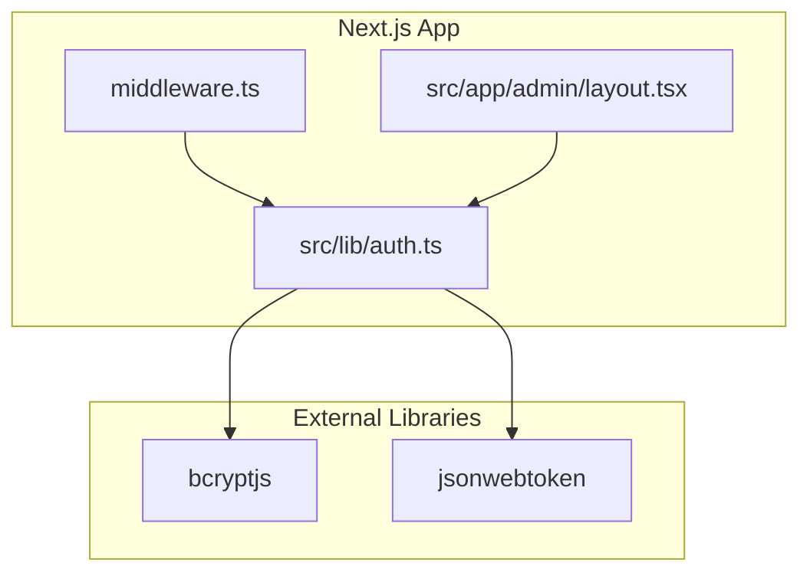
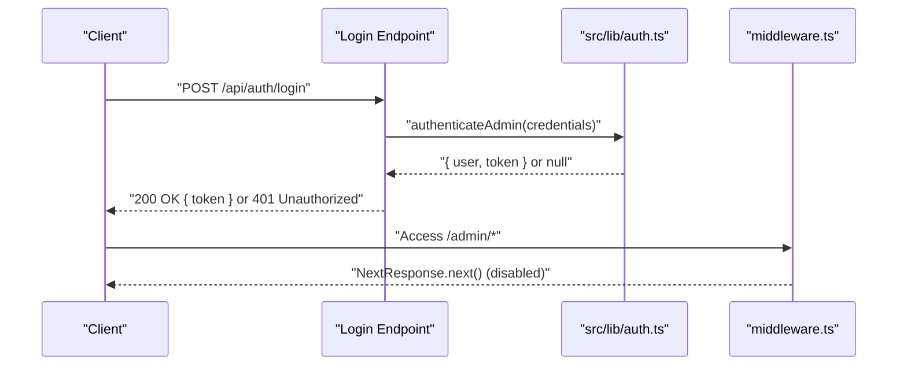
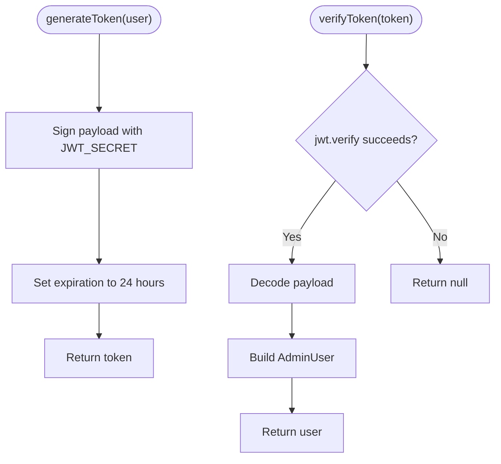
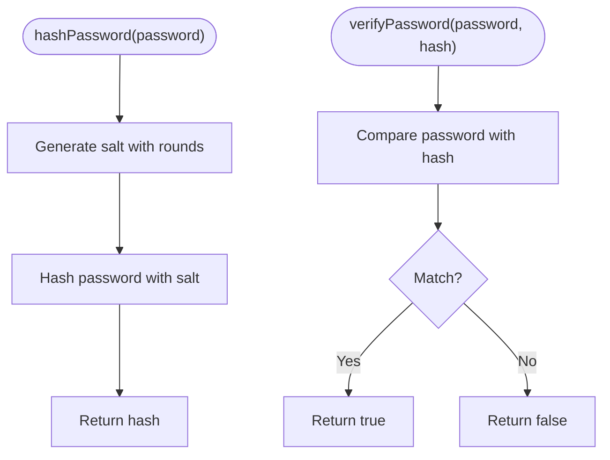
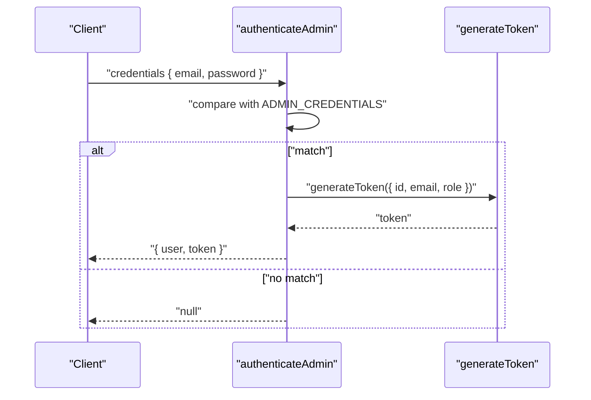
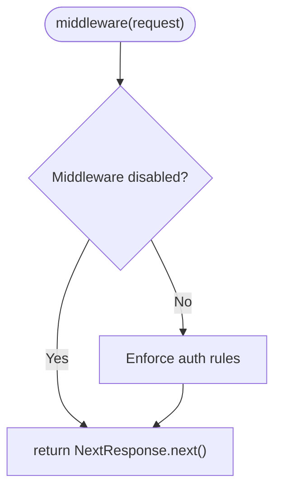
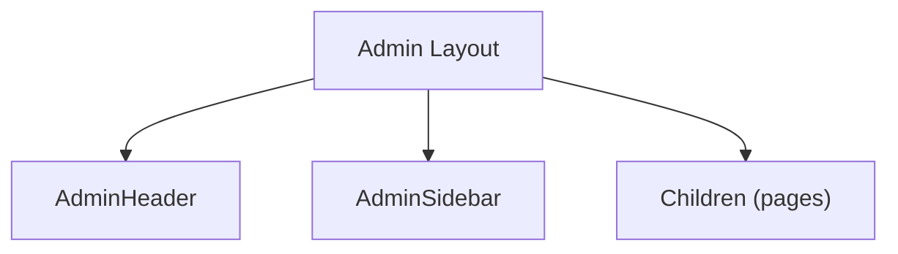
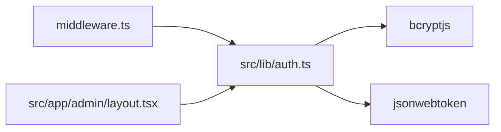

# Authentication System

<cite>
**Referenced Files in This Document**
- [auth.ts](file://src/lib/auth.ts)
- [middleware.ts](file://middleware.ts)
- [layout.tsx](file://src/app/admin/layout.tsx)
</cite>

## Table of Contents
1. [Introduction](#introduction)
2. [Project Structure](#project-structure)
3. [Core Components](#core-components)
4. [Architecture Overview](#architecture-overview)
5. [Detailed Component Analysis](#detailed-component-analysis)
6. [Dependency Analysis](#dependency-analysis)
7. [Performance Considerations](#performance-considerations)
8. [Security Measures](#security-measures)
9. [Troubleshooting Guide](#troubleshooting-guide)
10. [Conclusion](#conclusion)
11. [Appendices](#appendices)

## Introduction
This document describes the authentication system for attechglobal.com with a focus on JWT-based authentication, password hashing, and admin route protection. It explains how tokens are generated and validated, how passwords are hashed using bcrypt, and how admin routes are protected. It also covers middleware integration, session management strategies, logout procedures, and security measures such as CSRF protection, rate limiting, and brute force prevention. Finally, it provides troubleshooting guidance and client-side integration examples.

## Project Structure
The authentication system is primarily implemented in a library module and integrated with Next.js routing and middleware. The admin area is structured as a client-rendered layout that depends on the backend authentication logic.

**Diagram sources**
- [auth.ts](file://src/lib/auth.ts#L1-L85)
- [middleware.ts](file://middleware.ts#L1-L15)
- [layout.tsx](file://src/app/admin/layout.tsx#L1-L23)

**Section sources**
- [auth.ts](file://src/lib/auth.ts#L1-L85)
- [middleware.ts](file://middleware.ts#L1-L15)
- [layout.tsx](file://src/app/admin/layout.tsx#L1-L23)

## Core Components
- JWT utilities: token generation and verification with secret key and expiration.
- Password utilities: bcrypt-based hashing and comparison.
- Admin authentication: credential validation against stored admin credentials and token issuance.
- Middleware: placeholder for admin route protection (currently disabled for static hosting).
- Admin layout: client-side admin shell that integrates with authentication.

Key responsibilities:
- Token lifecycle: creation, validation, and decoding.
- Credential verification: comparing submitted credentials against configured admin credentials.
- Security: bcrypt hashing, JWT secret management, and role-based access checks.

**Section sources**
- [auth.ts](file://src/lib/auth.ts#L11-L17)
- [auth.ts](file://src/lib/auth.ts#L24-L32)
- [auth.ts](file://src/lib/auth.ts#L34-L59)
- [auth.ts](file://src/lib/auth.ts#L61-L79)
- [auth.ts](file://src/lib/auth.ts#L81-L85)
- [middleware.ts](file://middleware.ts#L4-L8)
- [layout.tsx](file://src/app/admin/layout.tsx#L1-L23)

## Architecture Overview
The authentication architecture centers around a library module that encapsulates JWT and bcrypt operations. Admin requests are routed through middleware and handled by the admin layout. The current middleware is disabled for static hosting, so admin routes are not actively protected at runtime.

**Diagram sources**
- [auth.ts](file://src/lib/auth.ts#L61-L79)
- [middleware.ts](file://middleware.ts#L4-L8)

## Detailed Component Analysis

### JWT Utilities
- Token generation: Creates a signed JWT with user identity and role, expiring after a fixed period.
- Token verification: Decodes and validates the token using the shared secret; returns null on failure.
- Secret management: Uses an environment variable for the JWT secret; defaults are present in code.

**Diagram sources**
- [auth.ts](file://src/lib/auth.ts#L34-L59)

**Section sources**
- [auth.ts](file://src/lib/auth.ts#L34-L59)
- [auth.ts](file://src/lib/auth.ts#L11-L11)

### Password Hashing with bcrypt
- Hashing: Uses bcrypt with a configurable number of salt rounds to produce a secure hash.
- Verification: Compares a plaintext password against a stored hash synchronously.

**Diagram sources**
- [auth.ts](file://src/lib/auth.ts#L24-L32)

**Section sources**
- [auth.ts](file://src/lib/auth.ts#L24-L32)

### Admin Authentication and Login Flow
- Credential validation: Compares submitted email and password against configured admin credentials.
- Token issuance: On successful match, generates a JWT for the admin user.
- Response: Returns user identity and token to the caller.

**Diagram sources**
- [auth.ts](file://src/lib/auth.ts#L61-L79)
- [auth.ts](file://src/lib/auth.ts#L34-L45)

**Section sources**
- [auth.ts](file://src/lib/auth.ts#L61-L79)

### Middleware Integration for Admin Routes
- Current behavior: The middleware is disabled and always forwards requests; admin routes are not protected at runtime.
- Matcher: Specifies admin routes to be considered for future protection.
- Recommendation: Enable middleware for server-side enforcement and integrate with token validation.

**Diagram sources**
- [middleware.ts](file://middleware.ts#L4-L8)
- [middleware.ts](file://middleware.ts#L10-L14)

**Section sources**
- [middleware.ts](file://middleware.ts#L4-L8)
- [middleware.ts](file://middleware.ts#L10-L14)

### Admin Layout and Session Management
- Client-side layout: Provides the admin UI shell with header and sidebar components.
- Session management: Not implemented in code; rely on JWT tokens stored by the client.

**Diagram sources**
- [layout.tsx](file://src/app/admin/layout.tsx#L3-L22)

**Section sources**
- [layout.tsx](file://src/app/admin/layout.tsx#L1-L23)

## Dependency Analysis
The authentication library depends on bcryptjs for password hashing and jsonwebtoken for JWT operations. Middleware and admin layout depend on the authentication library for user validation and token handling.

**Diagram sources**
- [auth.ts](file://src/lib/auth.ts#L1-L2)
- [middleware.ts](file://middleware.ts#L1-L2)
- [layout.tsx](file://src/app/admin/layout.tsx#L1-L5)

**Section sources**
- [auth.ts](file://src/lib/auth.ts#L1-L2)
- [middleware.ts](file://middleware.ts#L1-L2)
- [layout.tsx](file://src/app/admin/layout.tsx#L1-L5)

## Performance Considerations
- Token expiration: 24-hour expiry balances convenience and risk; adjust based on threat model.
- bcrypt rounds: Higher rounds increase security but CPU cost; tune according to server capacity.
- Middleware overhead: Currently disabled; enabling will add request processing cost.
- Client storage: Avoid storing tokens in insecure locations; prefer secure HTTP-only cookies or in-memory storage.

## Security Measures
- JWT secret: Use a strong, random secret via environment variables; avoid hardcoded defaults.
- Role-based access: Validate roles before granting admin privileges.
- Password hashing: Use bcrypt with sufficient rounds; never store plain-text passwords.
- Middleware protection: Enable middleware to enforce authentication on admin routes.
- CSRF protection: Implement anti-CSRF tokens for state-changing requests.
- Rate limiting: Apply per-IP or per-account limits on login attempts.
- Brute force prevention: Lock accounts temporarily after repeated failures and implement CAPTCHA.
- Logout: Invalidate tokens server-side if using refresh tokens; otherwise rely on token expiry.

## Troubleshooting Guide
Common issues and resolutions:
- Invalid token errors: Ensure the JWT secret matches the environment and token has not expired.
- Authentication failures: Confirm admin credentials match and bcrypt hashes are valid.
- Middleware not protecting routes: Verify middleware is enabled and properly configured.
- Token storage problems: Store tokens securely; avoid localStorage for sensitive operations.
- CORS and cookie issues: Configure appropriate headers and SameSite attributes for cookies.

## Conclusion
The attechglobal.com authentication system provides a solid foundation with JWT and bcrypt. To harden the system, enable middleware for admin route protection, implement CSRF and rate limiting, and adopt robust token storage and logout strategies. The current code demonstrates token generation, verification, and admin authentication, ready for production hardening.

## Appendices

### Authentication Flows
- Login flow: Submit credentials; receive a signed JWT with user identity and role.
- Access flow: Send the JWT with subsequent requests; validate on the server.
- Logout flow: Clear client-side token; optionally invalidate on server if refresh tokens are used.

### Token Storage Strategies
- HTTP-only cookies: Prefer for web apps to mitigate XSS.
- Secure storage: Avoid localStorage for sensitive tokens; use in-memory state when possible.
- Refresh tokens: Use separate short-lived access tokens and long-lived refresh tokens with secure storage.

### Logout Procedures
- Client-side: Remove stored token.
- Server-side: Maintain a revocation list if using refresh tokens; invalidate sessions on demand.