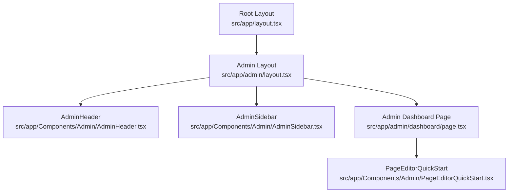
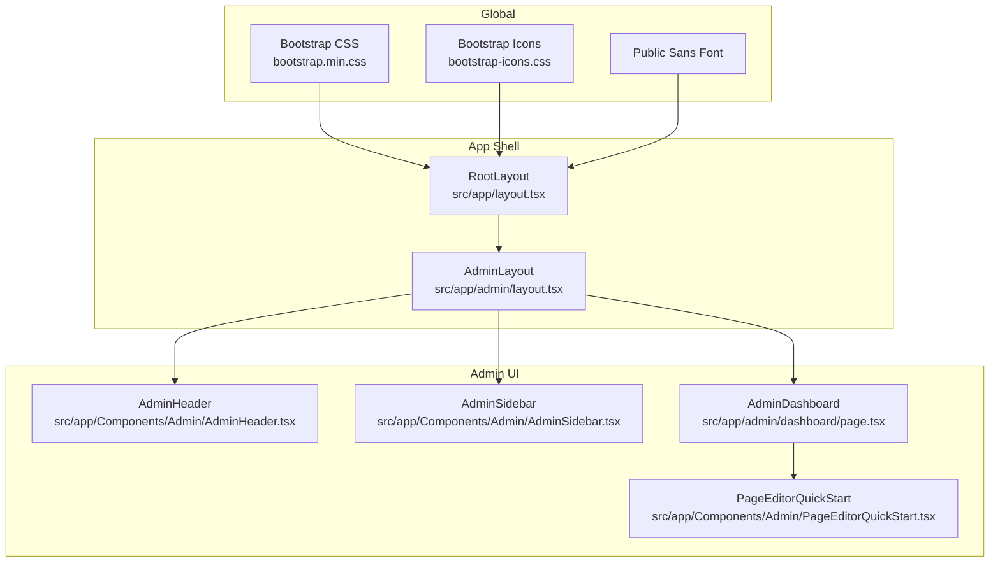
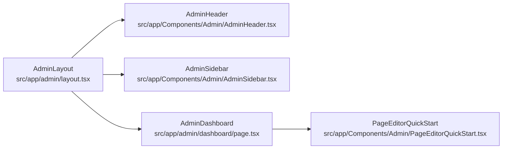

# Dashboard Interface

<cite>
**Referenced Files in This Document**
- [src/app/layout.tsx](file://src/app/layout.tsx)
- [src/app/admin/layout.tsx](file://src/app/admin/layout.tsx)
- [src/app/Components/Admin/AdminHeader.tsx](file://src/app/Components/Admin/AdminHeader.tsx)
- [src/app/Components/Admin/AdminSidebar.tsx](file://src/app/Components/Admin/AdminSidebar.tsx)
- [src/app/admin/dashboard/page.tsx](file://src/app/admin/dashboard/page.tsx)
- [src/app/Components/Admin/PageEditorQuickStart.tsx](file://src/app/Components/Admin/PageEditorQuickStart.tsx)
</cite>

## Table of Contents
1. [Introduction](#introduction)
2. [Project Structure](#project-structure)
3. [Core Components](#core-components)
4. [Architecture Overview](#architecture-overview)
5. [Detailed Component Analysis](#detailed-component-analysis)
6. [Dependency Analysis](#dependency-analysis)
7. [Performance Considerations](#performance-considerations)
8. [Troubleshooting Guide](#troubleshooting-guide)
9. [Conclusion](#conclusion)
10. [Appendices](#appendices)

## Introduction
This document explains the admin dashboard interface components and their integration within the Next.js App Router. It covers the layout structure using Bootstrap utility classes and Flexbox, the AdminHeader and AdminSidebar components, the main content rendering, and how child pages integrate under the admin route. It also provides responsive behavior guidance, accessibility considerations, and customization guidelines.

## Project Structure
The admin dashboard is organized under the Next.js app directory with a dedicated admin layout and pages. The root layout initializes global styles and fonts, while the admin layout composes the header, sidebar, and main content area.

**Diagram sources**
- [src/app/layout.tsx](file://src/app/layout.tsx#L1-L47)
- [src/app/admin/layout.tsx](file://src/app/admin/layout.tsx#L1-L23)
- [src/app/Components/Admin/AdminHeader.tsx](file://src/app/Components/Admin/AdminHeader.tsx#L1-L22)
- [src/app/Components/Admin/AdminSidebar.tsx](file://src/app/Components/Admin/AdminSidebar.tsx#L1-L84)
- [src/app/admin/dashboard/page.tsx](file://src/app/admin/dashboard/page.tsx#L1-L197)
- [src/app/Components/Admin/PageEditorQuickStart.tsx](file://src/app/Components/Admin/PageEditorQuickStart.tsx#L1-L90)

**Section sources**
- [src/app/layout.tsx](file://src/app/layout.tsx#L1-L47)
- [src/app/admin/layout.tsx](file://src/app/admin/layout.tsx#L1-L23)

## Core Components
- AdminLayout: Provides the overall admin shell with a sticky header, a vertical sidebar, and a flexible main content area.
- AdminHeader: Renders the top bar with branding and role indicator.
- AdminSidebar: Renders the navigation menu with active-state highlighting based on current path.
- AdminDashboard: The main content page showcasing statistics, recent activity, and quick actions.

Key integration points:
- Bootstrap CSS and icons are imported globally in the root layout.
- The admin layout uses Bootstrap utility classes for responsive spacing and alignment.
- Next.js navigation components are used for internal links and active state detection via pathname.

**Section sources**
- [src/app/admin/layout.tsx](file://src/app/admin/layout.tsx#L1-L23)
- [src/app/Components/Admin/AdminHeader.tsx](file://src/app/Components/Admin/AdminHeader.tsx#L1-L22)
- [src/app/Components/Admin/AdminSidebar.tsx](file://src/app/Components/Admin/AdminSidebar.tsx#L1-L84)
- [src/app/admin/dashboard/page.tsx](file://src/app/admin/dashboard/page.tsx#L1-L197)

## Architecture Overview
The admin interface follows a layered structure:
- Root layout sets global styles and fonts.
- Admin layout composes header, sidebar, and main content.
- Dashboard page renders content and integrates quick-start components.

**Diagram sources**
- [src/app/layout.tsx](file://src/app/layout.tsx#L1-L47)
- [src/app/admin/layout.tsx](file://src/app/admin/layout.tsx#L1-L23)
- [src/app/Components/Admin/AdminHeader.tsx](file://src/app/Components/Admin/AdminHeader.tsx#L1-L22)
- [src/app/Components/Admin/AdminSidebar.tsx](file://src/app/Components/Admin/AdminSidebar.tsx#L1-L84)
- [src/app/admin/dashboard/page.tsx](file://src/app/admin/dashboard/page.tsx#L1-L197)
- [src/app/Components/Admin/PageEditorQuickStart.tsx](file://src/app/Components/Admin/PageEditorQuickStart.tsx#L1-L90)

## Detailed Component Analysis

### AdminHeader
Responsibilities:
- Renders the top header bar with branding and role badge.
- Uses Bootstrap utility classes for alignment and spacing.

Responsive behavior:
- Uses flex utilities to align items and distribute space.
- Badge indicates user role for quick identification.

Accessibility:
- Semantic heading hierarchy and concise labels.
- Role badge provides clear identity context.

Customization guidelines:
- Modify branding text and role label.
- Adjust spacing and typography via Bootstrap utilities.
- Add notification bell or user avatar dropdown as needed.

**Section sources**
- [src/app/Components/Admin/AdminHeader.tsx](file://src/app/Components/Admin/AdminHeader.tsx#L1-L22)

### AdminSidebar
Responsibilities:
- Renders a vertical navigation menu with multiple items.
- Highlights the active menu item based on current pathname.
- Uses Next.js Link for client-side navigation.

Active state management:
- Compares current pathname with each menu item’s href.
- Applies an “active” class conditionally.

Collapsible functionality:
- Current implementation uses fixed width and full-height layout.
- Collapsible behavior can be added by toggling width and hiding text labels.

Responsive behavior:
- Menu width is fixed; consider adding a toggle to collapse on small screens.
- On extra-small screens, consider switching to a drawer or off-canvas pattern.

Accessibility:
- Keyboard navigable via default anchor behavior.
- Clear visual focus state recommended.

Customization guidelines:
- Add or remove menu items by editing the menuItems array.
- Change icons and labels per organizational needs.
- Integrate with a state store to persist expanded/collapsed state.

**Section sources**
- [src/app/Components/Admin/AdminSidebar.tsx](file://src/app/Components/Admin/AdminSidebar.tsx#L1-L84)

### AdminLayout and Main Content Area
Responsibilities:
- Wraps children with header, sidebar, and main content container.
- Uses Bootstrap grid and flex utilities for layout.

Main content rendering:
- Children passed from parent route are rendered inside a flex-grow container.
- Padding ensures content is readable and not flush against edges.

Integration with Next.js App Router:
- AdminLayout is scoped to the admin route segment.
- Child pages render inside the layout via the pages router integration.

Responsive behavior:
- Sidebar remains fixed-width; consider stacking on narrow screens.
- Main content area grows to fill remaining space.

Customization guidelines:
- Adjust padding and margins via Bootstrap spacing utilities.
- Modify background or container classes for branding.

**Section sources**
- [src/app/admin/layout.tsx](file://src/app/admin/layout.tsx#L1-L23)

### AdminDashboard
Responsibilities:
- Renders dashboard statistics cards, recent activities, and quick actions.
- Manages loading state and displays skeleton while data loads.

Data rendering:
- Uses a grid layout that adapts from single column to multiple columns based on viewport.
- Displays recent activity items with contextual icons.

Integration with quick-start component:
- Includes a quick-start panel for page editor actions.

Responsive behavior:
- Grid adjusts columns at md and lg breakpoints.
- Activity list remains readable across sizes.

Accessibility:
- Clear headings and semantic lists.
- Hover and focus states for interactive elements.

Customization guidelines:
- Replace mock data with API calls.
- Add charts or additional widgets as needed.
- Localize icons and labels.

**Section sources**
- [src/app/admin/dashboard/page.tsx](file://src/app/admin/dashboard/page.tsx#L1-L197)

### PageEditorQuickStart
Responsibilities:
- Provides quick-access links to common page editing tasks.
- Includes a call-to-action to view all editing options.

Integration:
- Linked from the dashboard page.
- Uses Next.js Link for navigation.

Responsive behavior:
- Grid layout adapts to two columns on medium screens.
- Consistent spacing and padding for touch-friendly targets.

Customization guidelines:
- Add or modify quick actions to match content strategy.
- Change icons and colors to reflect page types.

**Section sources**
- [src/app/Components/Admin/PageEditorQuickStart.tsx](file://src/app/Components/Admin/PageEditorQuickStart.tsx#L1-L90)

## Dependency Analysis
The admin layout depends on shared components and Next.js navigation primitives. The dashboard page depends on quick-start components and renders content dynamically.

**Diagram sources**
- [src/app/admin/layout.tsx](file://src/app/admin/layout.tsx#L1-L23)
- [src/app/Components/Admin/AdminHeader.tsx](file://src/app/Components/Admin/AdminHeader.tsx#L1-L22)
- [src/app/Components/Admin/AdminSidebar.tsx](file://src/app/Components/Admin/AdminSidebar.tsx#L1-L84)
- [src/app/admin/dashboard/page.tsx](file://src/app/admin/dashboard/page.tsx#L1-L197)
- [src/app/Components/Admin/PageEditorQuickStart.tsx](file://src/app/Components/Admin/PageEditorQuickStart.tsx#L1-L90)

**Section sources**
- [src/app/admin/layout.tsx](file://src/app/admin/layout.tsx#L1-L23)
- [src/app/admin/dashboard/page.tsx](file://src/app/admin/dashboard/page.tsx#L1-L197)

## Performance Considerations
- Minimize heavy computations in AdminLayout; keep it a lightweight shell.
- Defer non-critical dashboard data to reduce initial load time.
- Use lazy loading for images and optional widgets.
- Keep sidebar menu items minimal to avoid excessive re-renders.

## Troubleshooting Guide
Common issues and resolutions:
- Active link not highlighting: Verify pathname comparison matches exact href values.
- Sidebar overlaps content on small screens: Add a toggle to collapse sidebar and adjust widths.
- Missing Bootstrap styles: Ensure global imports are present in the root layout.
- Navigation not updating after route change: Confirm Next.js Link usage and pathname hook are correctly applied.

**Section sources**
- [src/app/Components/Admin/AdminSidebar.tsx](file://src/app/Components/Admin/AdminSidebar.tsx#L1-L84)
- [src/app/layout.tsx](file://src/app/layout.tsx#L1-L47)

## Conclusion
The admin dashboard leverages Bootstrap utilities and Next.js App Router to deliver a structured, responsive, and extensible interface. The AdminHeader and AdminSidebar provide consistent navigation and branding, while the AdminLayout composes the main content area. The AdminDashboard demonstrates responsive grids and quick-start integrations. With clear customization points and accessibility considerations, the layout supports iterative improvements and scaling.

## Appendices
- Responsive breakpoints used in the dashboard:
  - Single column on small screens.
  - Two columns at medium breakpoint.
  - Four columns at large breakpoint for statistics cards.
- Accessibility recommendations:
  - Add ARIA roles and labels where appropriate.
  - Ensure keyboard navigation support for sidebar and buttons.
  - Provide focus indicators for interactive elements.