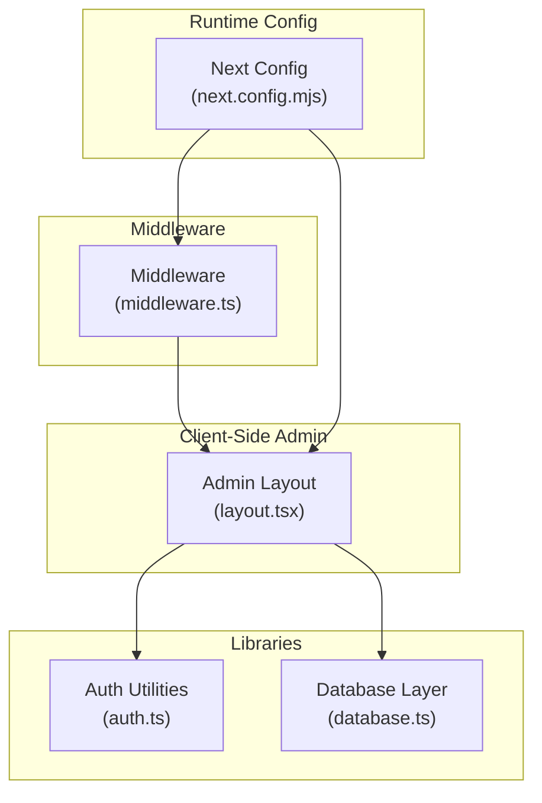
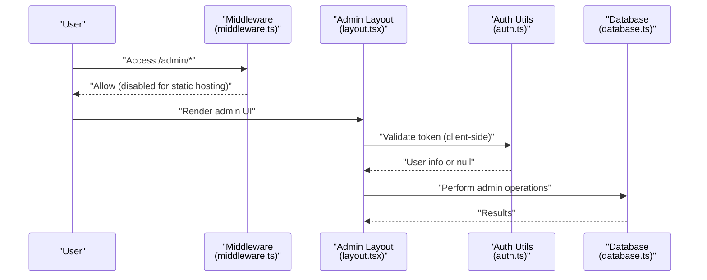
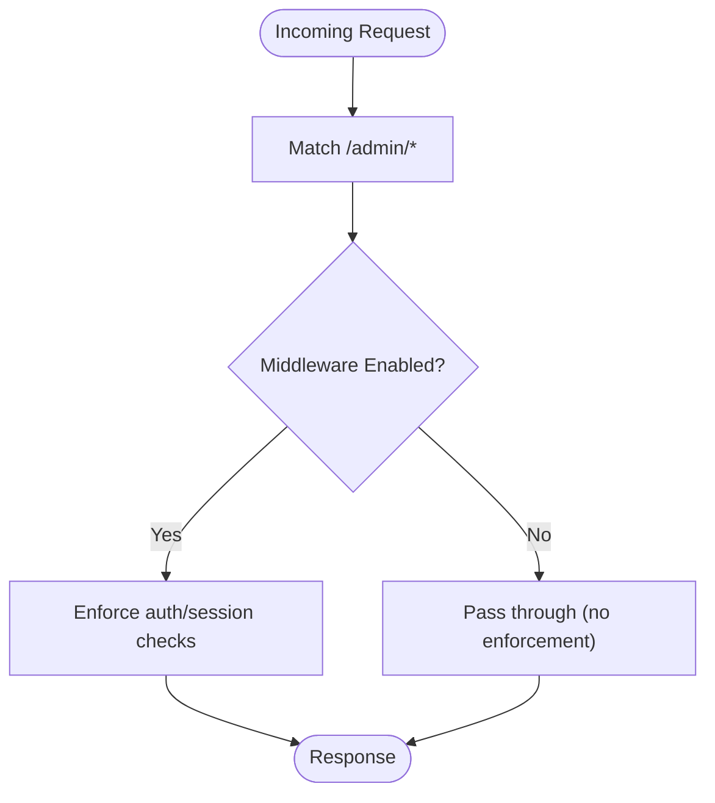
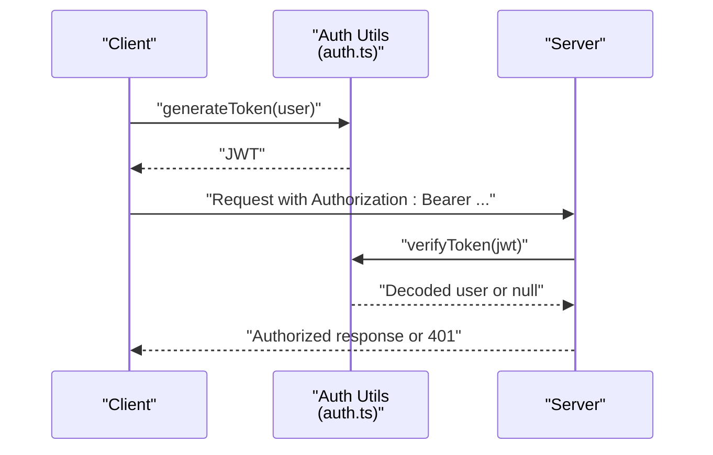
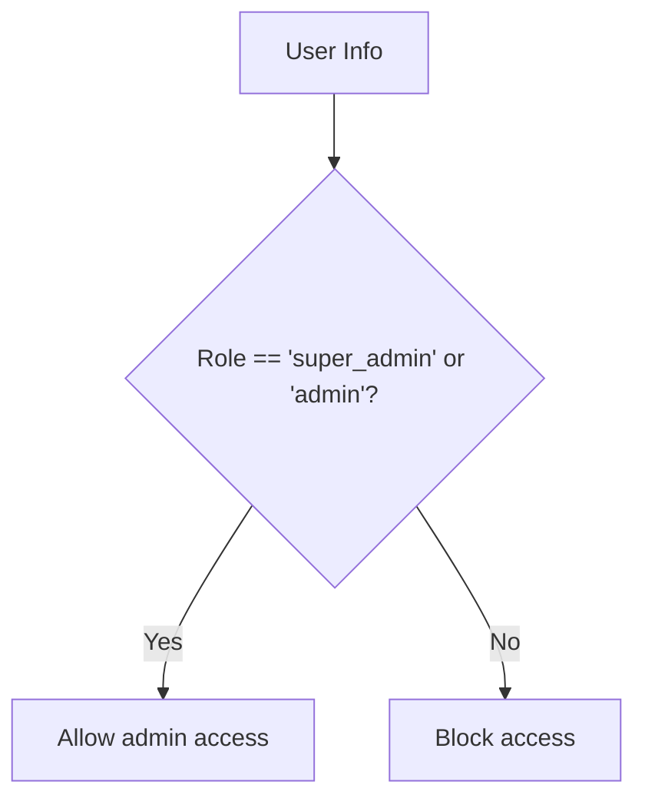
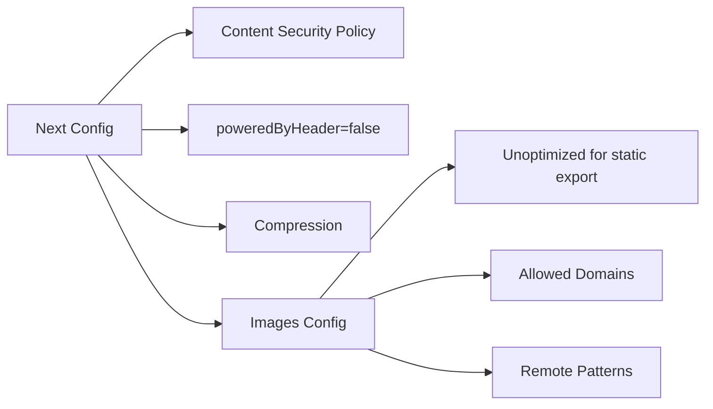
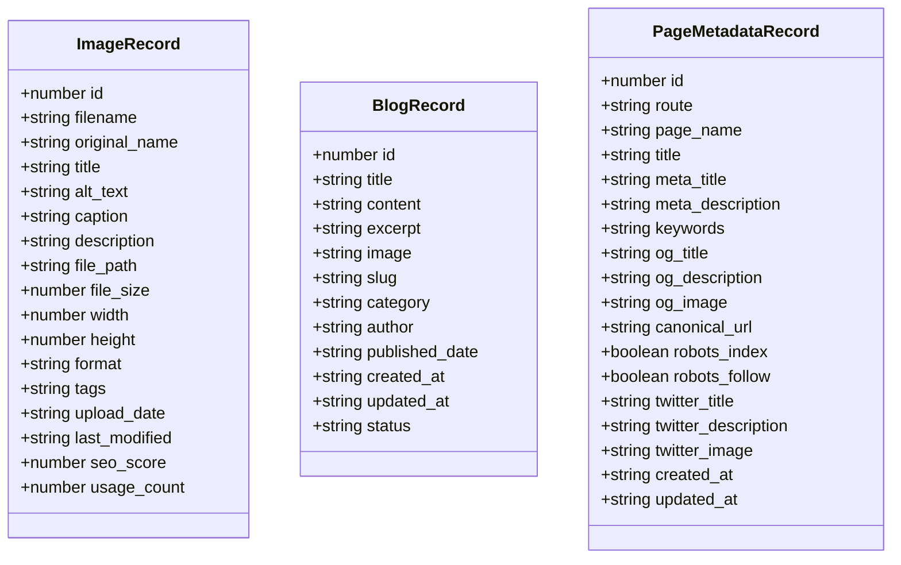
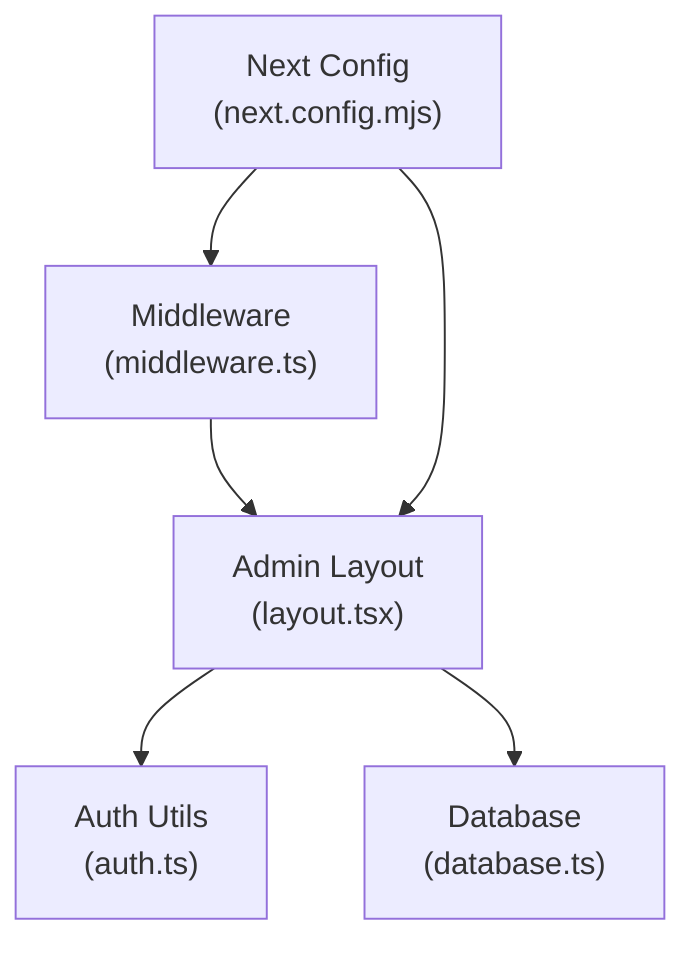

# Security Features

<cite>
**Referenced Files in This Document**
- [middleware.ts](file://middleware.ts)
- [auth.ts](file://src/lib/auth.ts)
- [database.ts](file://src/lib/database.ts)
- [layout.tsx](file://src/app/admin/layout.tsx)
- [next.config.mjs](file://next.config.mjs)
- [package.json](file://package.json)
</cite>

## Table of Contents
1. [Introduction](#introduction)
2. [Project Structure](#project-structure)
3. [Core Components](#core-components)
4. [Architecture Overview](#architecture-overview)
5. [Detailed Component Analysis](#detailed-component-analysis)
6. [Dependency Analysis](#dependency-analysis)
7. [Performance Considerations](#performance-considerations)
8. [Troubleshooting Guide](#troubleshooting-guide)
9. [Conclusion](#conclusion)
10. [Appendices](#appendices)

## Introduction
This document details the security posture of the admin dashboard, focusing on middleware-based route protection, JWT token handling, session-like behavior, role-based access control, security headers, CORS and image policies, input validation strategies, and audit/logging considerations. It also outlines secure coding practices, threat mitigations, and maintenance guidance tailored to admin interfaces.

## Project Structure
The admin dashboard is implemented as a Next.js application with a client-side admin layout and shared libraries for authentication and database operations. The middleware is present but currently disabled for static hosting environments. Authentication utilities provide JWT generation and verification, while the database library encapsulates SQLite operations.

**Diagram sources**
- [layout.tsx](file://src/app/admin/layout.tsx#L1-L23)
- [middleware.ts](file://middleware.ts#L1-L15)
- [auth.ts](file://src/lib/auth.ts#L1-L85)
- [database.ts](file://src/lib/database.ts#L1-L255)
- [next.config.mjs](file://next.config.mjs#L1-L129)

**Section sources**
- [layout.tsx](file://src/app/admin/layout.tsx#L1-L23)
- [middleware.ts](file://middleware.ts#L1-L15)
- [auth.ts](file://src/lib/auth.ts#L1-L85)
- [database.ts](file://src/lib/database.ts#L1-L255)
- [next.config.mjs](file://next.config.mjs#L1-L129)

## Core Components
- Middleware-based route protection: A Next.js middleware exists and targets admin routes, but is currently disabled for static hosting compatibility.
- JWT-based authentication: Utilities for generating and verifying tokens, with a secret configurable via environment variables.
- Role-based access control: Helpers to determine administrative roles.
- Database layer: Encapsulated SQLite operations with typed interfaces.
- Security headers and image policies: Next.js configuration sets CSP and related hardening flags.

**Section sources**
- [middleware.ts](file://middleware.ts#L1-L15)
- [auth.ts](file://src/lib/auth.ts#L11-L84)
- [database.ts](file://src/lib/database.ts#L18-L81)
- [next.config.mjs](file://next.config.mjs#L111-L126)

## Architecture Overview
The admin dashboard relies on client-side routing and a thin server-side middleware layer. Authentication is handled via JWT tokens generated on the server and validated on subsequent requests. The database layer abstracts storage operations. Security is enforced through middleware gating, CSP, and runtime flags.

**Diagram sources**
- [middleware.ts](file://middleware.ts#L4-L7)
- [layout.tsx](file://src/app/admin/layout.tsx#L1-L23)
- [auth.ts](file://src/lib/auth.ts#L34-L59)
- [database.ts](file://src/lib/database.ts#L214-L254)

## Detailed Component Analysis

### Middleware-Based Route Protection
- Purpose: Gate access to admin routes.
- Current state: Disabled for static hosting environments.
- Impact: No server-side enforcement; client-side controls must be sufficient.

**Diagram sources**
- [middleware.ts](file://middleware.ts#L10-L14)

**Section sources**
- [middleware.ts](file://middleware.ts#L1-L15)

### JWT Token Validation and Session Security Measures
- Token generation: Signed JWT with expiration configured in the auth utilities.
- Token verification: Verifies signature and decodes payload; errors return null.
- Secret management: Uses environment variable for JWT secret.
- Session-like behavior: Client stores token; server validates on demand.

**Diagram sources**
- [auth.ts](file://src/lib/auth.ts#L34-L59)

**Section sources**
- [auth.ts](file://src/lib/auth.ts#L11-L59)

### Role-Based Access Control and Permission Checking
- Role model: Supports super_admin and admin roles.
- Access check: Helper determines if a user has admin privileges.
- Recommendation: Extend to granular permissions per endpoint/resource.

**Diagram sources**
- [auth.ts](file://src/lib/auth.ts#L82-L84)

**Section sources**
- [auth.ts](file://src/lib/auth.ts#L82-L84)

### Security Headers, CORS, and Image Policies
- Content Security Policy: Strict CSP configured to limit script execution and enable sandboxing.
- Runtime flags: poweredBy header disabled; compression enabled.
- Image optimization: Unoptimized mode for static export; allowlisted domains and remote patterns.

**Diagram sources**
- [next.config.mjs](file://next.config.mjs#L111-L126)
- [next.config.mjs](file://next.config.mjs#L10-L112)

**Section sources**
- [next.config.mjs](file://next.config.mjs#L10-L126)

### Input Validation Strategies
- Database layer: Typed interfaces define schema for images, blogs, and page metadata.
- Query helpers: Parameterized helpers reduce risk of SQL injection.
- Recommendations: Add input sanitization and schema validation at the API boundary.

**Diagram sources**
- [database.ts](file://src/lib/database.ts#L18-L81)

**Section sources**
- [database.ts](file://src/lib/database.ts#L18-L81)
- [database.ts](file://src/lib/database.ts#L214-L254)

### Audit Logging and Security Event Tracking
- Current state: No explicit audit logging implementation detected in the reviewed files.
- Recommendation: Introduce structured logs for authentication events, permission checks, and sensitive admin actions.

[No sources needed since this section provides general guidance]

### Secure Coding Practices and Vulnerability Prevention
- Environment-driven secrets: Use environment variables for JWT secret and other sensitive values.
- Least privilege: Restrict admin roles and expand to resource-level permissions.
- Defense in depth: Combine client-side controls with server-side validation and middleware gating.
- Input hygiene: Validate and sanitize inputs; prefer parameterized queries.

**Section sources**
- [auth.ts](file://src/lib/auth.ts#L11-L11)
- [auth.ts](file://src/lib/auth.ts#L82-L84)
- [database.ts](file://src/lib/database.ts#L214-L254)

### Security Monitoring Approaches
- Observability: Monitor authentication failures, unusual admin activity, and rate-limiting events.
- Logging: Centralize logs and apply retention policies.
- Alerts: Configure alerts for repeated failures and anomalous access patterns.

[No sources needed since this section provides general guidance]

## Dependency Analysis
The admin layout depends on authentication utilities and the database layer. Middleware is decoupled and conditionally enforced. Next.js configuration influences runtime security posture.

**Diagram sources**
- [layout.tsx](file://src/app/admin/layout.tsx#L1-L23)
- [auth.ts](file://src/lib/auth.ts#L1-L85)
- [database.ts](file://src/lib/database.ts#L1-L255)
- [middleware.ts](file://middleware.ts#L1-L15)
- [next.config.mjs](file://next.config.mjs#L1-L129)

**Section sources**
- [layout.tsx](file://src/app/admin/layout.tsx#L1-L23)
- [auth.ts](file://src/lib/auth.ts#L1-L85)
- [database.ts](file://src/lib/database.ts#L1-L255)
- [middleware.ts](file://middleware.ts#L1-L15)
- [next.config.mjs](file://next.config.mjs#L1-L129)

## Performance Considerations
- Compression: Enabled to reduce payload sizes.
- CSP: Limits script execution to mitigate XSS and reduce attack surface.
- Static export: Unoptimized images and specific image domains configured for static builds.

**Section sources**
- [next.config.mjs](file://next.config.mjs#L124-L126)
- [next.config.mjs](file://next.config.mjs#L111-L112)
- [next.config.mjs](file://next.config.mjs#L10-L112)

## Troubleshooting Guide
- Authentication failures: Verify JWT secret environment variable and token expiration.
- Middleware not enforcing: Confirm deployment target supports server-side middleware; otherwise rely on client-side controls.
- Database connectivity: Ensure the data directory exists and the database initializes successfully.

**Section sources**
- [auth.ts](file://src/lib/auth.ts#L11-L11)
- [middleware.ts](file://middleware.ts#L5-L7)
- [database.ts](file://src/lib/database.ts#L84-L97)

## Conclusion
The admin dashboard incorporates JWT-based authentication, typed database operations, and a strict CSP via Next.js configuration. Middleware exists for route protection but is currently disabled for static hosting. To strengthen security, enable server-side middleware, implement robust audit logging, enforce RBAC with granular permissions, and add input validation and rate limiting.

[No sources needed since this section summarizes without analyzing specific files]

## Appendices

### Common Security Threats and Mitigations for Admin Interfaces
- Cross-Site Scripting (XSS): Leverage CSP and avoid inline scripts.
- Session Management Issues: Use short-lived tokens and secure storage.
- Insecure Direct Object References: Enforce RBAC and validate ownership.
- SQL Injection: Use parameterized helpers and typed interfaces.
- Misconfiguration: Centralize secrets and review environment variables.

[No sources needed since this section provides general guidance]

### Guidelines for Maintaining Security Updates and Assessments
- Regular dependency audits and updates.
- Automated security scanning for dependencies.
- Periodic penetration testing and code reviews.
- Incident response playbooks and log retention policies.

[No sources needed since this section provides general guidance]