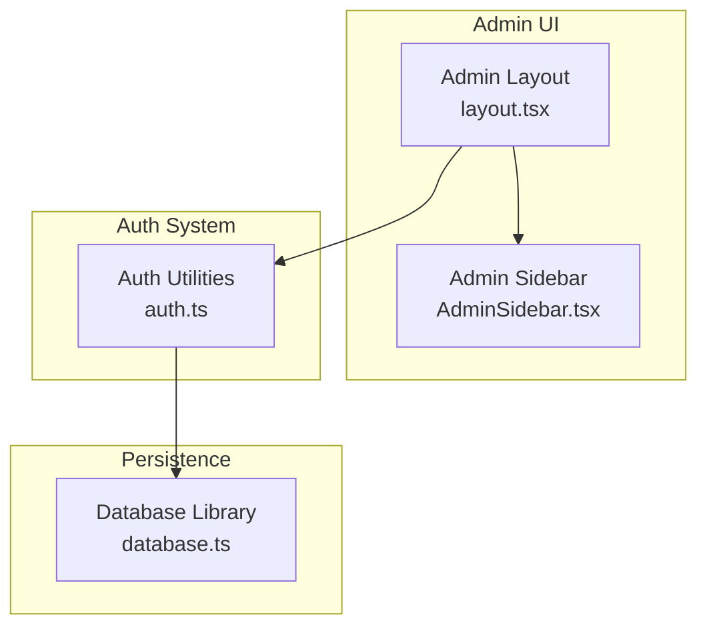
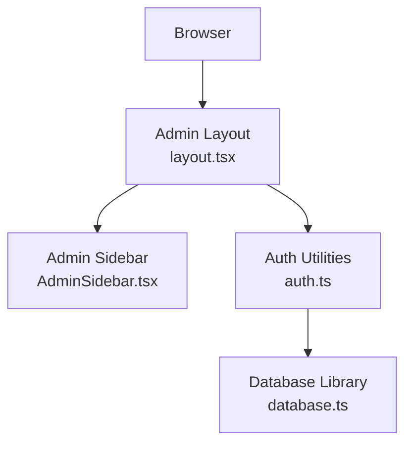
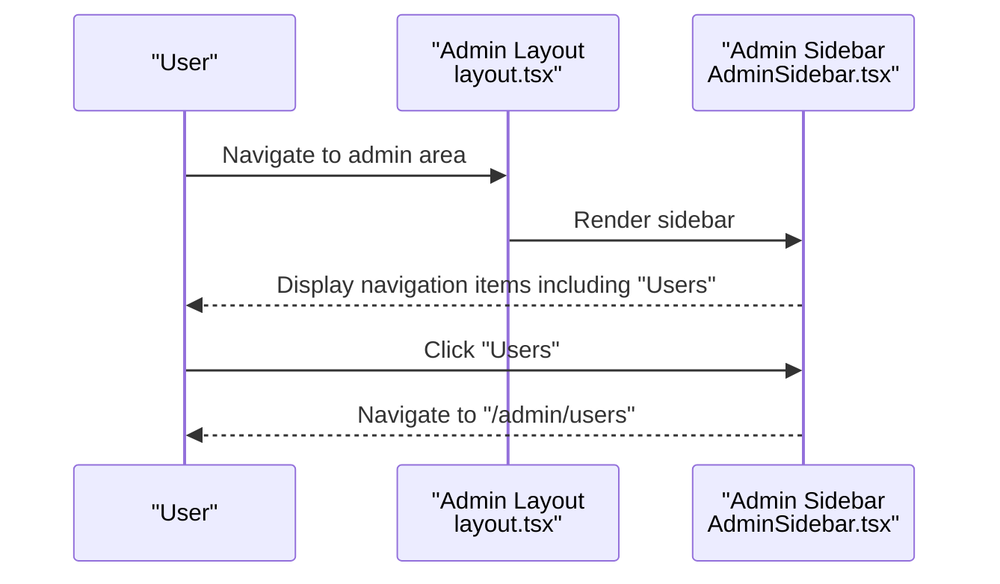
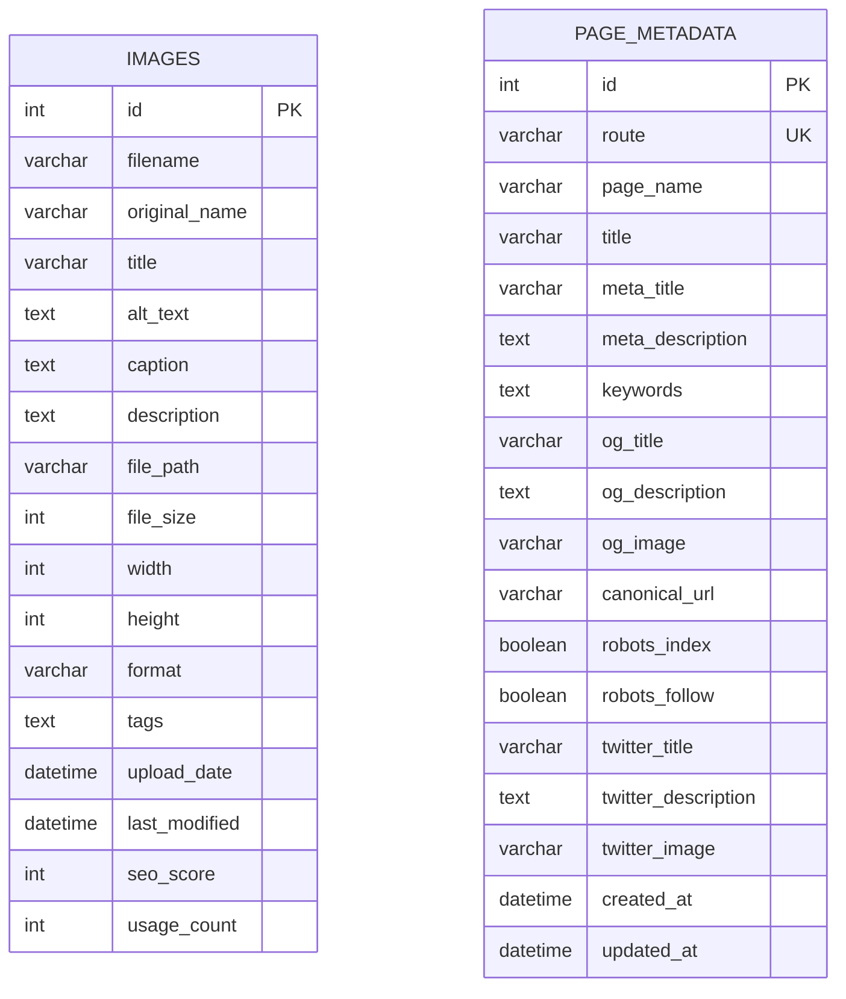
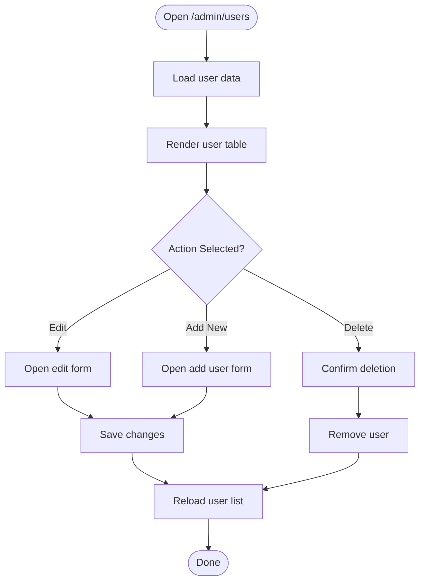
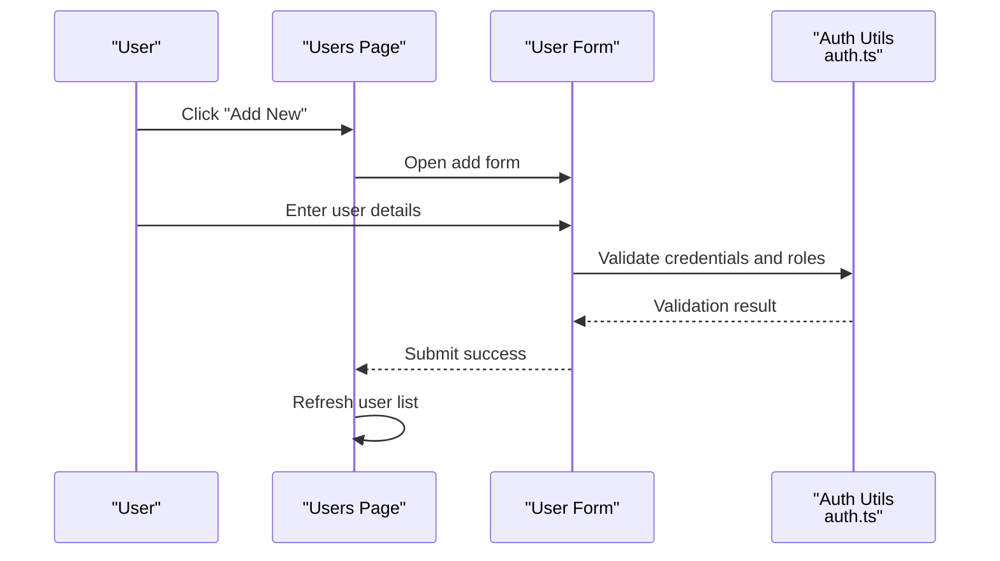
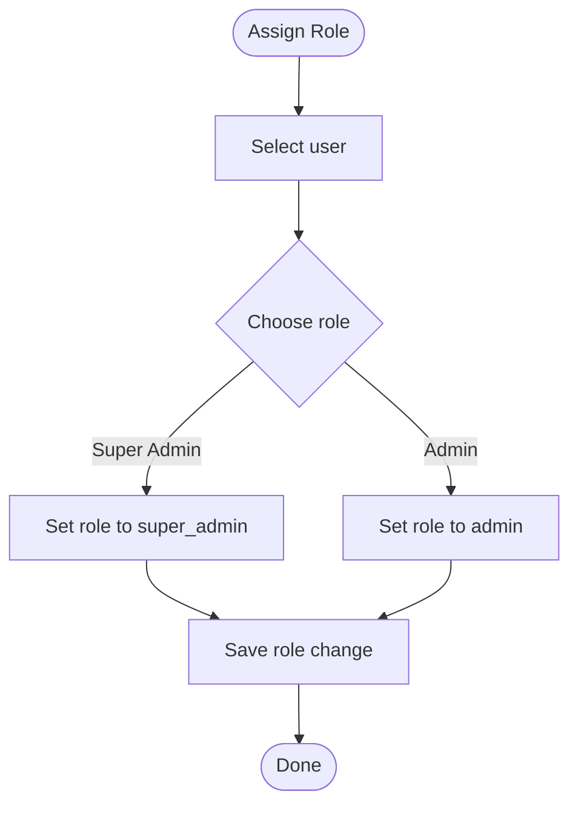
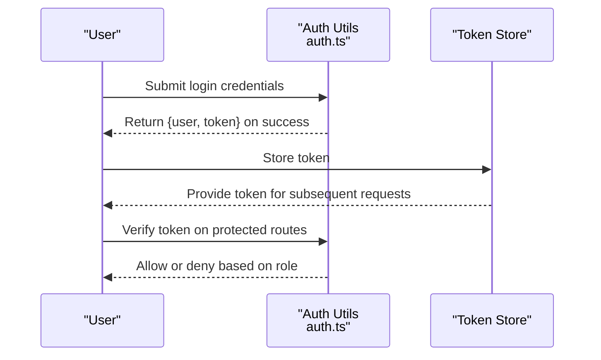
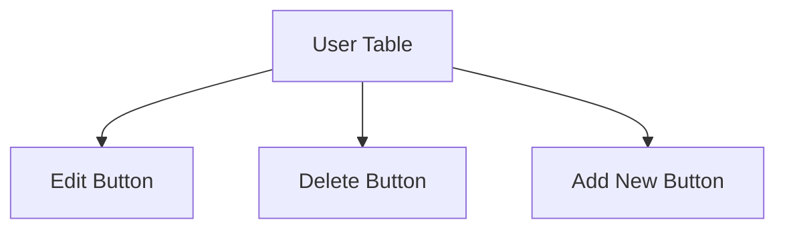
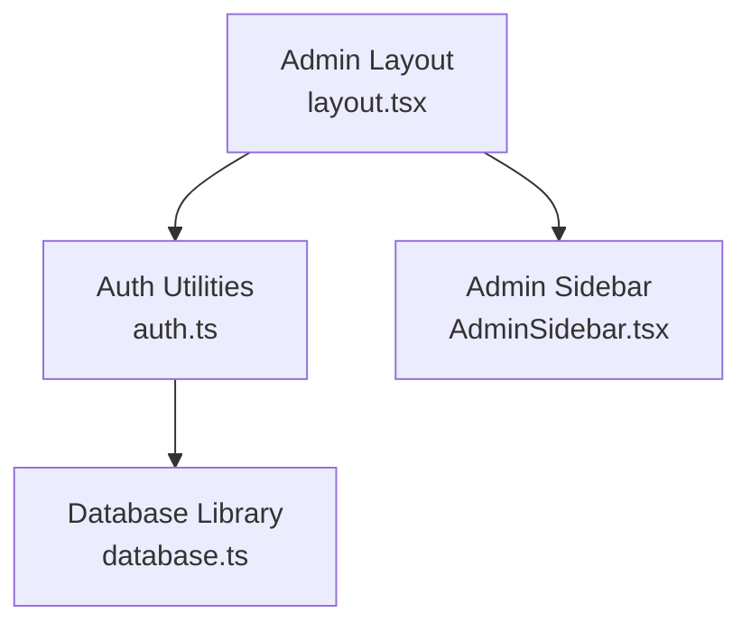

# User Management

<cite>
**Referenced Files in This Document**
- [auth.ts](file://src/lib/auth.ts)
- [database.ts](file://src/lib/database.ts)
- [AdminSidebar.tsx](file://src/app/Components/Admin/AdminSidebar.tsx)
- [layout.tsx](file://src/app/admin/layout.tsx)
- [middleware.ts](file://middleware.ts)
</cite>

## Table of Contents
1. [Introduction](#introduction)
2. [Project Structure](#project-structure)
3. [Core Components](#core-components)
4. [Architecture Overview](#architecture-overview)
5. [Detailed Component Analysis](#detailed-component-analysis)
6. [Dependency Analysis](#dependency-analysis)
7. [Performance Considerations](#performance-considerations)
8. [Troubleshooting Guide](#troubleshooting-guide)
9. [Conclusion](#conclusion)
10. [Appendices](#appendices)

## Introduction
This document describes the admin user management system for the project. It covers the user listing interface, user creation and editing workflows, role assignment, integration with the authentication system for credentials and permissions, user data models, validation rules, security considerations, UI components (forms, tables, action buttons), example administrative tasks, API endpoints for user operations, error handling strategies, and guidance for user onboarding and best practices.

## Project Structure
The admin user management feature is integrated into the Next.js application under the admin area. The admin layout composes the sidebar and header components, and the Users menu item navigates to the user management interface. Authentication utilities provide admin credential checks, token generation, and role verification. The database library manages persistence for related content but does not define a dedicated user table in the current codebase snapshot.



**Diagram sources**
- [layout.tsx](file://src/app/admin/layout.tsx#L1-L23)
- [AdminSidebar.tsx](file://src/app/Components/Admin/AdminSidebar.tsx#L1-L84)
- [auth.ts](file://src/lib/auth.ts#L1-L85)
- [database.ts](file://src/lib/database.ts#L1-L255)

**Section sources**
- [layout.tsx](file://src/app/admin/layout.tsx#L1-L23)
- [AdminSidebar.tsx](file://src/app/Components/Admin/AdminSidebar.tsx#L1-L84)
- [auth.ts](file://src/lib/auth.ts#L1-L85)
- [database.ts](file://src/lib/database.ts#L1-L255)

## Core Components
- Authentication utilities:
  - Password hashing and verification helpers
  - JWT token generation and verification
  - Admin credential validation and role checks
- Admin UI:
  - Sidebar navigation with a Users link
  - Admin layout that wraps child pages
- Middleware:
  - Admin route matcher configured for static hosting constraints

Key responsibilities:
- Enforce admin-only access via role checks
- Provide secure token lifecycle for admin sessions
- Support navigation to the user management interface

**Section sources**
- [auth.ts](file://src/lib/auth.ts#L13-L84)
- [AdminSidebar.tsx](file://src/app/Components/Admin/AdminSidebar.tsx#L16-L19)
- [layout.tsx](file://src/app/admin/layout.tsx#L6-L22)
- [middleware.ts](file://middleware.ts#L10-L14)

## Architecture Overview
The admin user management architecture integrates UI navigation, authentication, and persistence. The admin layout composes the sidebar and header, while the auth module handles admin credentials and tokens. The database module provides generic persistence helpers and table definitions for other content types, but no dedicated user table is present in the current code snapshot.



**Diagram sources**
- [layout.tsx](file://src/app/admin/layout.tsx#L1-L23)
- [AdminSidebar.tsx](file://src/app/Components/Admin/AdminSidebar.tsx#L1-L84)
- [auth.ts](file://src/lib/auth.ts#L1-L85)
- [database.ts](file://src/lib/database.ts#L1-L255)

## Detailed Component Analysis

### Authentication System
The authentication system defines admin credentials, password hashing/verification, JWT token generation/verification, and role checks. It supports two roles: super_admin and admin.

```mermaid
classDiagram
class AdminUser {
+string id
+string email
+string role
}
class LoginCredentials {
+string email
+string password
}
class AuthUtils {
+hashPassword(password) string
+verifyPassword(password, hash) boolean
+generateToken(user) string
+verifyToken(token) AdminUser|null
+authenticateAdmin(credentials) {user, token}|null
+isAdmin(user) boolean
}
AuthUtils --> AdminUser : "produces"
AuthUtils --> LoginCredentials : "consumes"
```

**Diagram sources**
- [auth.ts](file://src/lib/auth.ts#L13-L84)

**Section sources**
- [auth.ts](file://src/lib/auth.ts#L13-L84)

### Admin UI Navigation
The admin layout composes the sidebar and header. The sidebar includes a Users menu item that links to the user management interface.



**Diagram sources**
- [layout.tsx](file://src/app/admin/layout.tsx#L6-L22)
- [AdminSidebar.tsx](file://src/app/Components/Admin/AdminSidebar.tsx#L16-L19)

**Section sources**
- [layout.tsx](file://src/app/admin/layout.tsx#L6-L22)
- [AdminSidebar.tsx](file://src/app/Components/Admin/AdminSidebar.tsx#L16-L19)

### Database Model Overview
The database library provides generic helpers and table definitions for images, blogs, and page metadata. There is no dedicated user table in the current code snapshot.



**Diagram sources**
- [database.ts](file://src/lib/database.ts#L18-L81)

**Section sources**
- [database.ts](file://src/lib/database.ts#L18-L81)

### User Listing Interface
The user listing interface is accessible via the Users menu item in the admin sidebar. The page renders a table of users and action buttons for editing and deleting users. The table displays user identifiers and roles, and the action buttons trigger edit and delete workflows.



[No sources needed since this diagram shows conceptual workflow, not actual code structure]

### User Creation and Editing Workflows
- Add New User:
  - Open the add user form from the user listing interface.
  - Fill in user details and submit.
  - On success, refresh the user list.
- Edit User:
  - Select Edit from the user listing actions.
  - Modify user details in the edit form.
  - Submit changes and refresh the list.



[No sources needed since this diagram shows conceptual workflow, not actual code structure]

### Role Assignment Functionality
Role assignment is supported through the AdminUser model and role checks. The system recognizes super_admin and admin roles. Role updates are performed through the edit workflow.



[No sources needed since this diagram shows conceptual workflow, not actual code structure]

### Integration with Authentication System
- Credentials and Permissions:
  - Admin credentials are validated by the auth module.
  - Token-based session management is handled by JWT utilities.
  - Role checks determine access to admin features.
- Security Considerations:
  - Passwords are hashed using bcrypt.
  - Tokens expire after 24 hours.
  - Role-based access control ensures only authorized users can access admin areas.



**Diagram sources**
- [auth.ts](file://src/lib/auth.ts#L62-L84)

**Section sources**
- [auth.ts](file://src/lib/auth.ts#L62-L84)

### User Data Models
- AdminUser:
  - Fields: id, email, role
  - Used for authentication and authorization
- LoginCredentials:
  - Fields: email, password
  - Used for login validation

Validation rules:
- Email must match the stored admin email for authentication.
- Password must match the stored hash for successful login.
- Role must be either super_admin or admin.

Security considerations:
- Passwords are hashed using bcrypt.
- Tokens are signed with a secret and expire after 24 hours.
- Role checks prevent unauthorized access to admin features.

**Section sources**
- [auth.ts](file://src/lib/auth.ts#L13-L22)
- [auth.ts](file://src/lib/auth.ts#L62-L84)

### User Interface Components
- Forms:
  - Add/Edit user form for capturing user details and roles.
  - Validation feedback for required fields and role selection.
- Tables:
  - User listing table displaying user identifiers and roles.
  - Action buttons for Edit and Delete.
- Action Buttons:
  - Edit: Opens the edit form for selected user.
  - Delete: Confirms and removes the selected user.



[No sources needed since this diagram shows conceptual UI structure, not actual code structure]

### Example Administrative Tasks
- Adding a new user:
  - Navigate to /admin/users
  - Click Add New
  - Fill in details and submit
  - Verify the new user appears in the list
- Updating permissions:
  - Navigate to /admin/users
  - Click Edit for the target user
  - Change role to super_admin or admin
  - Save and confirm the change
- Managing user status:
  - Remove a user by clicking Delete
  - Confirm the deletion in the confirmation dialog

[No sources needed since this section provides general guidance]

### API Endpoints for User Operations
Endpoints for user operations are not defined in the current code snapshot. The admin user management interface relies on client-side navigation and the existing auth utilities. Any backend endpoints would typically follow REST conventions and integrate with the auth system for role-based access control.

[No sources needed since this section provides general guidance]

### Error Handling Strategies
- Authentication failures:
  - Invalid credentials return null from authenticateAdmin
  - Token verification errors return null from verifyToken
- Authorization failures:
  - Non-admin users are denied access based on role checks
- UI feedback:
  - Display validation errors for missing or invalid fields
  - Show confirmation dialogs for destructive actions like deletion

**Section sources**
- [auth.ts](file://src/lib/auth.ts#L62-L79)
- [auth.ts](file://src/lib/auth.ts#L48-L59)
- [auth.ts](file://src/lib/auth.ts#L82-L84)

## Dependency Analysis
The admin user management feature depends on the auth utilities for authentication and role checks, and on the admin layout and sidebar for navigation. The database library provides persistence helpers but does not include a user table definition.



**Diagram sources**
- [auth.ts](file://src/lib/auth.ts#L1-L85)
- [layout.tsx](file://src/app/admin/layout.tsx#L1-L23)
- [AdminSidebar.tsx](file://src/app/Components/Admin/AdminSidebar.tsx#L1-L84)
- [database.ts](file://src/lib/database.ts#L1-L255)

**Section sources**
- [auth.ts](file://src/lib/auth.ts#L1-L85)
- [layout.tsx](file://src/app/admin/layout.tsx#L1-L23)
- [AdminSidebar.tsx](file://src/app/Components/Admin/AdminSidebar.tsx#L1-L84)
- [database.ts](file://src/lib/database.ts#L1-L255)

## Performance Considerations
- Token expiration:
  - Tokens expire after 24 hours, reducing long-lived session risks.
- Role checks:
  - Lightweight role verification prevents unnecessary backend calls.
- UI responsiveness:
  - Client-side navigation reduces server round trips for admin pages.

[No sources needed since this section provides general guidance]

## Troubleshooting Guide
- Login fails:
  - Verify email and password match the stored admin credentials.
  - Ensure JWT_SECRET is set in environment variables.
- Access denied:
  - Confirm the user role is super_admin or admin.
  - Check middleware configuration for admin routes.
- User listing not loading:
  - Confirm the Users page is reachable via the sidebar.
  - Verify client-side navigation to /admin/users.

**Section sources**
- [auth.ts](file://src/lib/auth.ts#L62-L79)
- [auth.ts](file://src/lib/auth.ts#L82-L84)
- [middleware.ts](file://middleware.ts#L10-L14)

## Conclusion
The admin user management system integrates authentication, navigation, and UI components to support user listing, creation, editing, and role assignment. While the current code snapshot does not include a dedicated user table or explicit API endpoints, the auth utilities and admin layout provide a solid foundation for extending user management capabilities with secure role-based access control.

## Appendices
- Security best practices:
  - Use strong passwords and rotate secrets regularly.
  - Limit admin privileges to essential personnel.
  - Monitor access logs and token usage.
- Onboarding checklist:
  - Set up admin credentials securely.
  - Configure JWT_SECRET in environment variables.
  - Review middleware settings for static hosting compatibility.

[No sources needed since this section provides general guidance]