# Blog Management

<cite>
**Referenced Files in This Document**
- [README.md](file://README.md)
- [src/lib/database.ts](file://src/lib/database.ts)
- [src/lib/fileSeoUtils.ts](file://src/lib/fileSeoUtils.ts)
- [src/hooks/useFilePageMetadata.ts](file://src/hooks/useFilePageMetadata.ts)
- [src/hooks/usePageMetadata.ts](file://src/hooks/usePageMetadata.ts)
- [src/app/admin/page-editor/page.tsx](file://src/app/admin/page-editor/page.tsx)
- [src/app/admin/seo/page.tsx](file://src/app/admin/seo/page.tsx)
- [out/blog/index.html](file://out/blog/index.html)
- [out/blog/blog-details/index.html](file://out/blog/blog-details/index.html)
- [out/blog-sidebar/index.html](file://out/blog-sidebar/index.html)
- [scripts/add-all-pages-to-seo.js](file://scripts/add-all-pages-to-seo.js)
- [scripts/check-seo-data.js](file://scripts/check-seo-data.js)
- [scripts/seed-seo-data.js](file://scripts/seed-seo-data.js)
</cite>

## Table of Contents
1. [Introduction](#introduction)
2. [Project Structure](#project-structure)
3. [Core Components](#core-components)
4. [Architecture Overview](#architecture-overview)
5. [Detailed Component Analysis](#detailed-component-analysis)
6. [Dependency Analysis](#dependency-analysis)
7. [Performance Considerations](#performance-considerations)
8. [Troubleshooting Guide](#troubleshooting-guide)
9. [Conclusion](#conclusion)

## Introduction
This document describes the blog management system for attechglobal.com, focusing on the content creation workflow, category and tagging systems, publishing processes, and the integration with file-based SEO optimization and automatic metadata generation. It also documents the blog component architecture (listings, detailed views, and sidebar components), content validation mechanisms, and operational procedures for creating, editing, and deleting blog posts. Finally, it outlines the relationship between blog components and the broader website architecture, including navigation integration and responsive design considerations.

## Project Structure
The blog system is built with Next.js App Router and uses a SQLite-backed data model. Key areas include:
- Data modeling for blogs, images, and page metadata
- File-based SEO utilities for parsing and updating component metadata
- React hooks for fetching and managing SEO metadata
- Admin pages for page editing and SEO dashboard
- Static export artifacts for blog listings and details

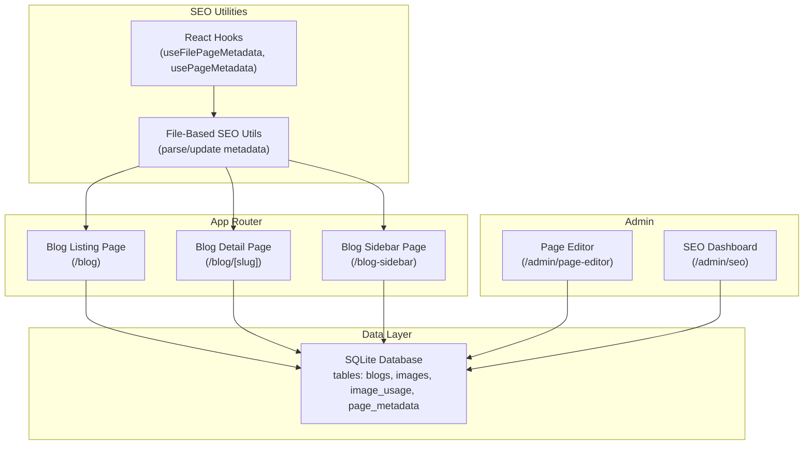

**Diagram sources**
- [src/lib/database.ts](file://src/lib/database.ts#L47-L81)
- [src/lib/fileSeoUtils.ts](file://src/lib/fileSeoUtils.ts#L6-L31)
- [src/hooks/useFilePageMetadata.ts](file://src/hooks/useFilePageMetadata.ts#L13-L52)
- [src/hooks/usePageMetadata.ts](file://src/hooks/usePageMetadata.ts#L13-L52)
- [src/app/admin/page-editor/page.tsx](file://src/app/admin/page-editor/page.tsx#L5-L12)
- [src/app/admin/seo/page.tsx](file://src/app/admin/seo/page.tsx#L6-L13)

**Section sources**
- [README.md](file://README.md#L1-L37)
- [src/lib/database.ts](file://src/lib/database.ts#L1-L255)
- [src/lib/fileSeoUtils.ts](file://src/lib/fileSeoUtils.ts#L1-L329)
- [src/hooks/useFilePageMetadata.ts](file://src/hooks/useFilePageMetadata.ts#L1-L225)
- [src/hooks/usePageMetadata.ts](file://src/hooks/usePageMetadata.ts#L1-L218)
- [src/app/admin/page-editor/page.tsx](file://src/app/admin/page-editor/page.tsx#L1-L14)
- [src/app/admin/seo/page.tsx](file://src/app/admin/seo/page.tsx#L1-L14)

## Core Components
- Blog data model: stores title, content, excerpt, featured image, slug, category, author, timestamps, and status.
- Page metadata model: centralizes SEO fields (title, meta description, keywords, Open Graph, Twitter, canonical URL, robots directives).
- File-based SEO utilities: map routes to component files, parse metadata from components, and update metadata in files.
- React hooks: provide client-side data fetching and pagination for both file-based and database-backed metadata.
- Admin pages: page editor and SEO dashboard for managing content and metadata.
- Static export: pre-rendered HTML for blog listings and details.

Key implementation specifics:
- Blog CRUD operations are supported via the database schema and can be integrated with admin APIs.
- File-based SEO parsing supports both Next.js metadata exports and a custom SEOHead component pattern.
- Metadata updates are persisted either to component files (file-based) or to the database (metadata-based).

**Section sources**
- [src/lib/database.ts](file://src/lib/database.ts#L47-L81)
- [src/lib/fileSeoUtils.ts](file://src/lib/fileSeoUtils.ts#L39-L115)
- [src/lib/fileSeoUtils.ts](file://src/lib/fileSeoUtils.ts#L120-L178)
- [src/lib/fileSeoUtils.ts](file://src/lib/fileSeoUtils.ts#L183-L298)
- [src/hooks/useFilePageMetadata.ts](file://src/hooks/useFilePageMetadata.ts#L13-L52)
- [src/hooks/usePageMetadata.ts](file://src/hooks/usePageMetadata.ts#L13-L52)

## Architecture Overview
The blog system integrates three primary flows:
1. Content creation and publishing: Admin creates/edit/delete blog posts stored in SQLite; static export generates listing/detail pages.
2. Category and tagging: Categories are stored per blog; tags are stored as a delimited string on images and can be leveraged for content tagging.
3. SEO optimization: File-based parsing and updates synchronize component metadata with SEO best practices; database-backed metadata supports centralized management.

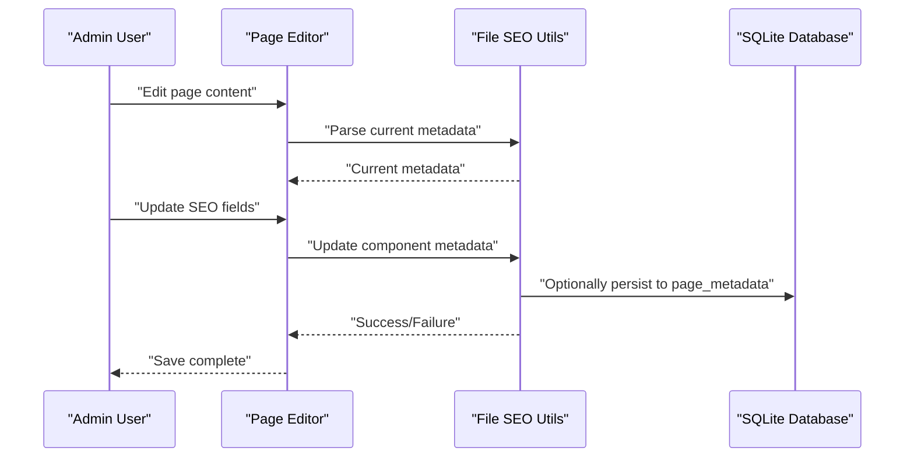

**Diagram sources**
- [src/app/admin/page-editor/page.tsx](file://src/app/admin/page-editor/page.tsx#L5-L12)
- [src/lib/fileSeoUtils.ts](file://src/lib/fileSeoUtils.ts#L120-L178)
- [src/lib/fileSeoUtils.ts](file://src/lib/fileSeoUtils.ts#L183-L298)
- [src/lib/database.ts](file://src/lib/database.ts#L159-L181)

## Detailed Component Analysis

### Blog Data Model and CRUD Operations
The blog data model defines fields for title, content, excerpt, image, slug, category, author, timestamps, and status. This structure supports:
- Publishing workflow: draft/published status and published date
- Organization: category and slug for taxonomy and URL routing
- Rich content: content and excerpt for listings and details

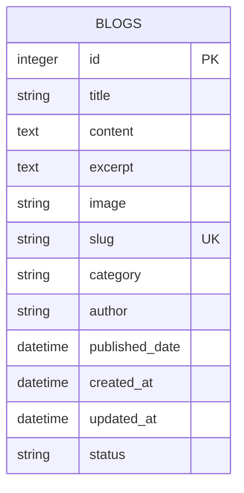

**Diagram sources**
- [src/lib/database.ts](file://src/lib/database.ts#L47-L60)

**Section sources**
- [src/lib/database.ts](file://src/lib/database.ts#L47-L60)

### File-Based SEO Metadata Management
The file-based SEO utilities enable:
- Route-to-file mapping for core pages
- Parsing metadata from component files (supports both Next.js metadata exports and a custom SEOHead component)
- Updating component metadata and writing back to files
- Generating Next.js metadata objects for rendering

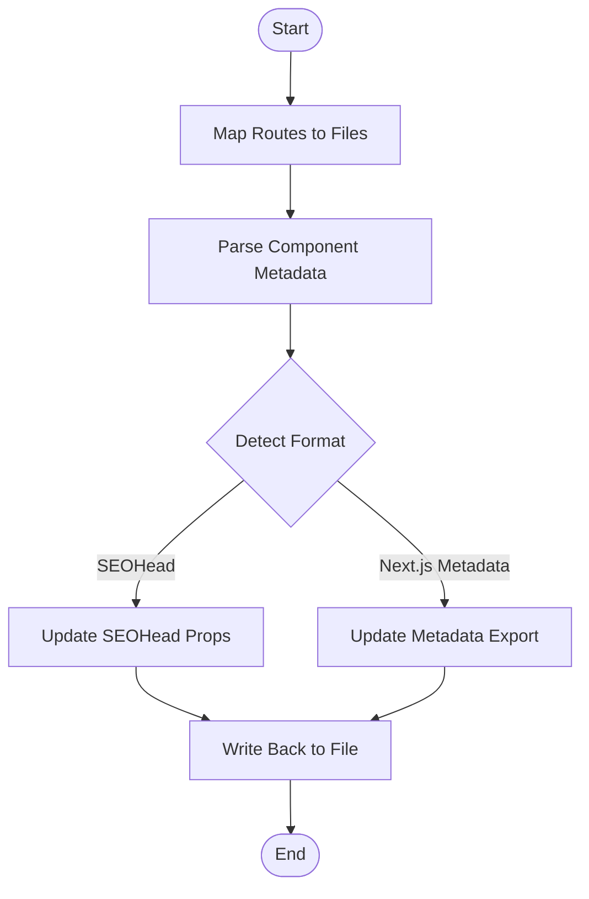

**Diagram sources**
- [src/lib/fileSeoUtils.ts](file://src/lib/fileSeoUtils.ts#L6-L31)
- [src/lib/fileSeoUtils.ts](file://src/lib/fileSeoUtils.ts#L120-L178)
- [src/lib/fileSeoUtils.ts](file://src/lib/fileSeoUtils.ts#L183-L298)

**Section sources**
- [src/lib/fileSeoUtils.ts](file://src/lib/fileSeoUtils.ts#L6-L31)
- [src/lib/fileSeoUtils.ts](file://src/lib/fileSeoUtils.ts#L120-L178)
- [src/lib/fileSeoUtils.ts](file://src/lib/fileSeoUtils.ts#L183-L298)

### Client-Side Metadata Hooks
Two sets of hooks provide client-side data fetching:
- File-based metadata: fetches and updates metadata for component files
- Database-backed metadata: fetches and updates centralized page metadata

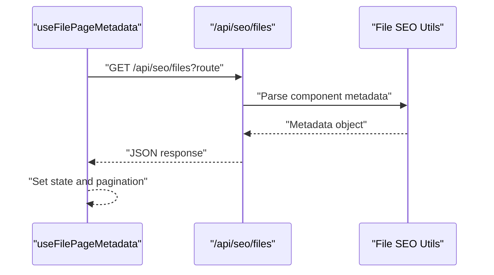

**Diagram sources**
- [src/hooks/useFilePageMetadata.ts](file://src/hooks/useFilePageMetadata.ts#L18-L52)
- [src/lib/fileSeoUtils.ts](file://src/lib/fileSeoUtils.ts#L303-L315)

**Section sources**
- [src/hooks/useFilePageMetadata.ts](file://src/hooks/useFilePageMetadata.ts#L13-L52)
- [src/hooks/usePageMetadata.ts](file://src/hooks/usePageMetadata.ts#L13-L52)

### Admin Pages: Page Editor and SEO Dashboard
- Page Editor: renders an enhanced editor for page content and metadata.
- SEO Dashboard: provides a centralized view for managing SEO metadata.

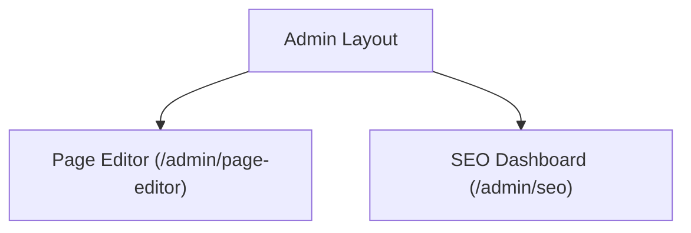

**Diagram sources**
- [src/app/admin/page-editor/page.tsx](file://src/app/admin/page-editor/page.tsx#L5-L12)
- [src/app/admin/seo/page.tsx](file://src/app/admin/seo/page.tsx#L6-L13)

**Section sources**
- [src/app/admin/page-editor/page.tsx](file://src/app/admin/page-editor/page.tsx#L1-L14)
- [src/app/admin/seo/page.tsx](file://src/app/admin/seo/page.tsx#L1-L14)

### Blog Component Architecture
The blog system includes:
- Blog listing page: displays multiple posts with excerpts and categories.
- Blog detail page: renders a single post with full content and related metadata.
- Blog sidebar page: provides supplementary content and navigation aids.

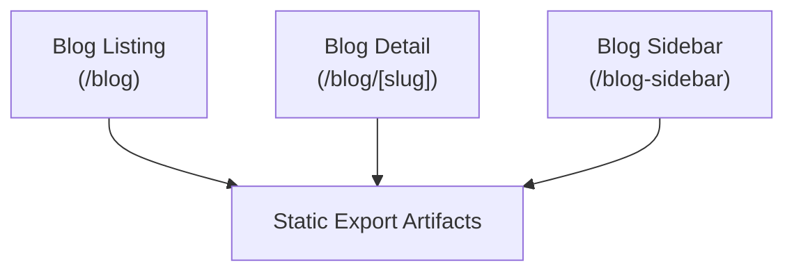

**Diagram sources**
- [out/blog/index.html](file://out/blog/index.html)
- [out/blog/blog-details/index.html](file://out/blog/blog-details/index.html)
- [out/blog-sidebar/index.html](file://out/blog-sidebar/index.html)

**Section sources**
- [out/blog/index.html](file://out/blog/index.html)
- [out/blog/blog-details/index.html](file://out/blog/blog-details/index.html)
- [out/blog-sidebar/index.html](file://out/blog-sidebar/index.html)

### Content Creation, Editing, and Deletion Workflows
- Creation: Admin creates a new blog post via the page editor; data is persisted to the blogs table; static export regenerates listing/detail pages.
- Editing: Admin updates content or metadata; file-based SEO utilities update component files; database-backed metadata can be synchronized.
- Deletion: Admin removes a post; associated records are removed from the blogs table; static export artifacts are regenerated.

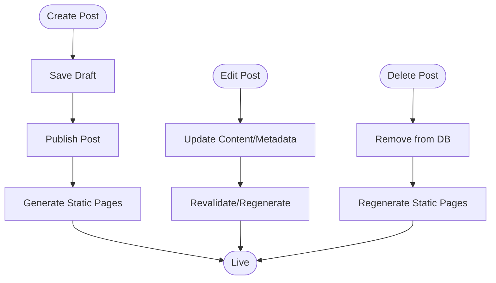

[No sources needed since this diagram shows conceptual workflow, not actual code structure]

### Category and Tagging System
- Categories: stored per blog entry for taxonomy and filtering.
- Tags: stored as a delimited string on images; can be adapted for blog post tagging by extending the model and UI.

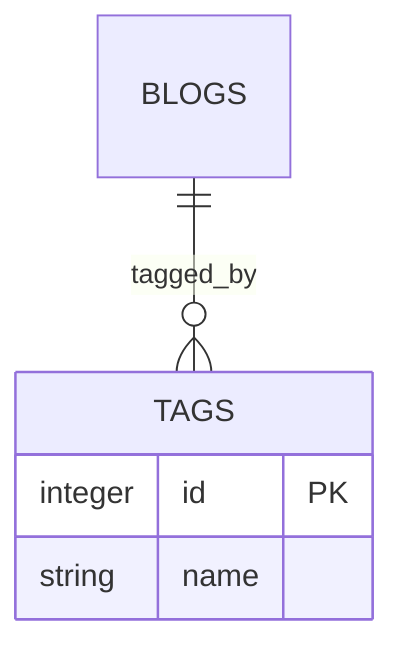

**Diagram sources**
- [src/lib/database.ts](file://src/lib/database.ts#L18-L36)

**Section sources**
- [src/lib/database.ts](file://src/lib/database.ts#L18-L36)

### Publishing Processes and Scheduling
- Status field supports draft/published workflows.
- Published date enables scheduling posts for future publication.
- Static export artifacts reflect current published state.

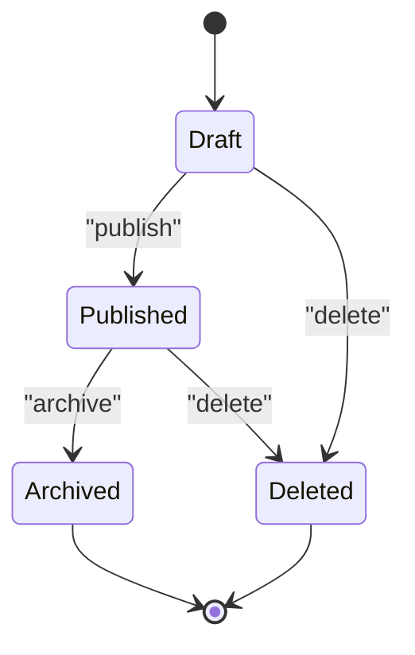

**Diagram sources**
- [src/lib/database.ts](file://src/lib/database.ts#L47-L60)

**Section sources**
- [src/lib/database.ts](file://src/lib/database.ts#L47-L60)

### Integration with File-Based SEO Optimization
- Automatic metadata generation: file-based parser extracts metadata from components and converts to Next.js metadata.
- Centralized management: database-backed metadata supports bulk operations and dashboards.
- Validation: hooks enforce network and server-side validation feedback.

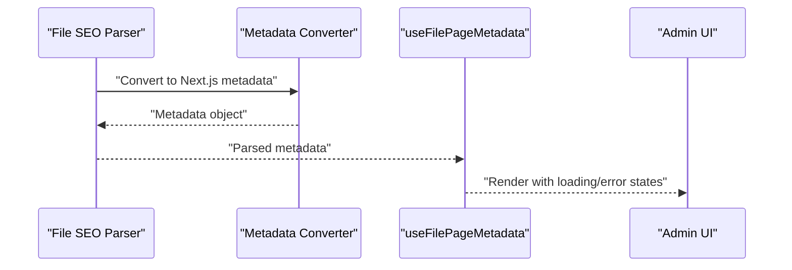

**Diagram sources**
- [src/lib/fileSeoUtils.ts](file://src/lib/fileSeoUtils.ts#L47-L115)
- [src/hooks/useFilePageMetadata.ts](file://src/hooks/useFilePageMetadata.ts#L18-L52)

**Section sources**
- [src/lib/fileSeoUtils.ts](file://src/lib/fileSeoUtils.ts#L47-L115)
- [src/hooks/useFilePageMetadata.ts](file://src/hooks/useFilePageMetadata.ts#L18-L52)

### Content Formatting and User Interaction Patterns
- Content formatting: Markdown or rich text can be rendered in blog content; ensure semantic markup for accessibility.
- User interactions: pagination, search, and filtering on metadata dashboards; real-time updates via hooks.
- Navigation integration: blog routes integrate with site navigation; canonical URLs and Open Graph improve SEO.

[No sources needed since this section provides general guidance]

## Dependency Analysis
The system exhibits clear separation of concerns:
- Data layer: SQLite tables for blogs, images, and metadata.
- Presentation layer: Next.js pages and components for blog listings, details, and sidebar.
- Admin layer: page editor and SEO dashboard for content and metadata management.
- Utilities: file-based SEO parsing and conversion utilities.

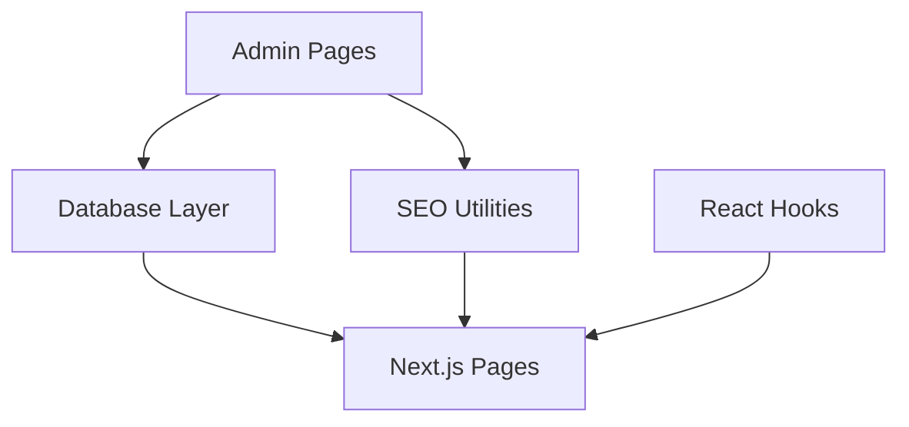

**Diagram sources**
- [src/lib/database.ts](file://src/lib/database.ts#L100-L184)
- [src/lib/fileSeoUtils.ts](file://src/lib/fileSeoUtils.ts#L303-L329)
- [src/hooks/useFilePageMetadata.ts](file://src/hooks/useFilePageMetadata.ts#L83-L139)
- [src/app/admin/page-editor/page.tsx](file://src/app/admin/page-editor/page.tsx#L5-L12)
- [src/app/admin/seo/page.tsx](file://src/app/admin/seo/page.tsx#L6-L13)

**Section sources**
- [src/lib/database.ts](file://src/lib/database.ts#L100-L184)
- [src/lib/fileSeoUtils.ts](file://src/lib/fileSeoUtils.ts#L303-L329)
- [src/hooks/useFilePageMetadata.ts](file://src/hooks/useFilePageMetadata.ts#L83-L139)
- [src/app/admin/page-editor/page.tsx](file://src/app/admin/page-editor/page.tsx#L1-L14)
- [src/app/admin/seo/page.tsx](file://src/app/admin/seo/page.tsx#L1-L14)

## Performance Considerations
- Static export: improves performance for blog listings and details by serving pre-rendered HTML.
- Pagination: client-side pagination reduces payload sizes for metadata lists.
- Database indexing: consider adding indexes on frequently queried fields (e.g., slug, category, status).
- Image optimization: leverage image metadata and usage tracking for performance and SEO.
- Caching: implement caching strategies for metadata retrieval in production deployments.

[No sources needed since this section provides general guidance]

## Troubleshooting Guide
Common issues and resolutions:
- Metadata parsing failures: verify component file format and ensure proper metadata export or SEOHead props.
- Network errors in hooks: confirm API endpoints are reachable and handle error states gracefully.
- Database initialization errors: ensure the data directory exists and the database file is writable.
- SEO script errors: validate script inputs and permissions for file system operations.

**Section sources**
- [src/lib/fileSeoUtils.ts](file://src/lib/fileSeoUtils.ts#L174-L178)
- [src/hooks/useFilePageMetadata.ts](file://src/hooks/useFilePageMetadata.ts#L32-L37)
- [src/lib/database.ts](file://src/lib/database.ts#L84-L96)
- [scripts/check-seo-data.js](file://scripts/check-seo-data.js)

## Conclusion
The attechglobal.com blog management system combines a robust data model, file-based SEO utilities, and admin interfaces to streamline content creation, categorization, and publishing. The architecture supports both static export and centralized metadata management, enabling efficient performance and strong SEO outcomes. By leveraging the provided hooks, utilities, and admin pages, teams can maintain high-quality blog content at scale while ensuring optimal user experiences and search engine visibility.