# Content Management System

<cite>
**Referenced Files in This Document**
- [README.md](file://README.md)
- [PAGE_EDITOR_README.md](file://PAGE_EDITOR_README.md)
- [enhanced-page-editor.ts](file://src/lib/enhanced-page-editor.ts)
- [page-editor.ts](file://src/lib/page-editor.ts)
- [database.ts](file://src/lib/database.ts)
- [seed-metadata.ts](file://src/lib/seed-metadata.ts)
- [backup-system.ts](file://src/lib/backup-system.ts)
- [init-database.js](file://scripts/init-database.js)
- [seed-seo-data.js](file://scripts/seed-seo-data.js)
- [page.tsx](file://src/app/admin/page-editor/page.tsx)
- [route.ts](file://src/app/api/pages/route.ts)
- [EnhancedPageEditor.tsx](file://src/app/Components/Admin/EnhancedPageEditor.tsx)
- [PageEditor.tsx](file://src/app/Components/Admin/PageEditor.tsx)
- [usePageMetadata.ts](file://src/hooks/usePageMetadata.ts)
- [useFilePageMetadata.ts](file://src/hooks/useFilePageMetadata.ts)
- [package.json](file://package.json)
</cite>

## Table of Contents
1. [Introduction](#introduction)
2. [Project Structure](#project-structure)
3. [Core Components](#core-components)
4. [Architecture Overview](#architecture-overview)
5. [Detailed Component Analysis](#detailed-component-analysis)
6. [Dependency Analysis](#dependency-analysis)
7. [Performance Considerations](#performance-considerations)
8. [Troubleshooting Guide](#troubleshooting-guide)
9. [Conclusion](#conclusion)
10. [Appendices](#appendices)

## Introduction
This document describes the attechglobal.com content management system with a focus on the enhanced page editor that enables non-technical users to modify website content in real time. It explains the dynamic component detection system, file-based content parsing, automated metadata generation, and the page editor workflow. It also documents the integration with an SQLite database for content persistence, backup and restore procedures, and content versioning. Finally, it covers validation rules, error handling, and user experience optimizations for content editors.

## Project Structure
The CMS is built with Next.js and TypeScript. Key areas include:
- Admin UI and page editor components under src/app/Components/Admin
- Backend API endpoints under src/app/api
- Core libraries for page editing, database, and backups under src/lib
- Hooks for metadata management under src/hooks
- Scripts for database initialization and seeding under scripts

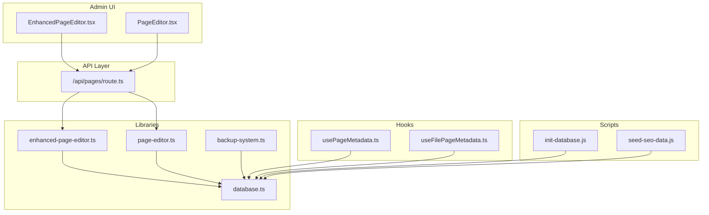

**Diagram sources**
- [EnhancedPageEditor.tsx](file://src/app/Components/Admin/EnhancedPageEditor.tsx#L1-L431)
- [PageEditor.tsx](file://src/app/Components/Admin/PageEditor.tsx#L1-L323)
- [route.ts](file://src/app/api/pages/route.ts#L1-L110)
- [enhanced-page-editor.ts](file://src/lib/enhanced-page-editor.ts#L1-L287)
- [page-editor.ts](file://src/lib/page-editor.ts#L1-L194)
- [database.ts](file://src/lib/database.ts#L1-L255)
- [backup-system.ts](file://src/lib/backup-system.ts#L1-L119)
- [usePageMetadata.ts](file://src/hooks/usePageMetadata.ts#L1-L218)
- [useFilePageMetadata.ts](file://src/hooks/useFilePageMetadata.ts#L1-L225)
- [init-database.js](file://scripts/init-database.js#L1-L120)
- [seed-seo-data.js](file://scripts/seed-seo-data.js#L1-L171)

**Section sources**
- [README.md](file://README.md#L1-L37)
- [PAGE_EDITOR_README.md](file://PAGE_EDITOR_README.md#L1-L154)

## Core Components
- EnhancedPageEditor library: Detects editable components from page files, categorizes content, and updates content via file writes.
- PageEditor library: Simplified component detection and updates.
- Database integration: SQLite-backed storage for images, blogs, and page metadata.
- Backup system: File-based backup and restore for content files.
- Admin UI: React components for browsing pages, filtering components, editing content, and previewing pages.
- Metadata hooks: React hooks to fetch, update, and manage page metadata.

Key responsibilities:
- Component discovery: Parses JSX/HTML-like content to identify text, titles, subtitles, descriptions, images, and links.
- Validation: Filters out ignorable content and validates URLs and content types.
- Persistence: Updates page files and persists metadata to SQLite.
- Preview: Provides iframe-based preview of edited pages.
- Safety: Creates backups before edits and handles errors gracefully.

**Section sources**
- [enhanced-page-editor.ts](file://src/lib/enhanced-page-editor.ts#L26-L287)
- [page-editor.ts](file://src/lib/page-editor.ts#L23-L194)
- [database.ts](file://src/lib/database.ts#L1-L255)
- [backup-system.ts](file://src/lib/backup-system.ts#L12-L119)
- [EnhancedPageEditor.tsx](file://src/app/Components/Admin/EnhancedPageEditor.tsx#L32-L431)
- [PageEditor.tsx](file://src/app/Components/Admin/PageEditor.tsx#L29-L323)
- [usePageMetadata.ts](file://src/hooks/usePageMetadata.ts#L13-L218)
- [useFilePageMetadata.ts](file://src/hooks/useFilePageMetadata.ts#L13-L225)

## Architecture Overview
The system follows a client-server architecture:
- Client-side React components render the editor UI and send requests to API endpoints.
- API endpoints coordinate with libraries to parse page files, validate content, and persist changes.
- Libraries interact with SQLite for metadata and with the filesystem for backups and content updates.
- Hooks provide metadata CRUD operations to the UI.

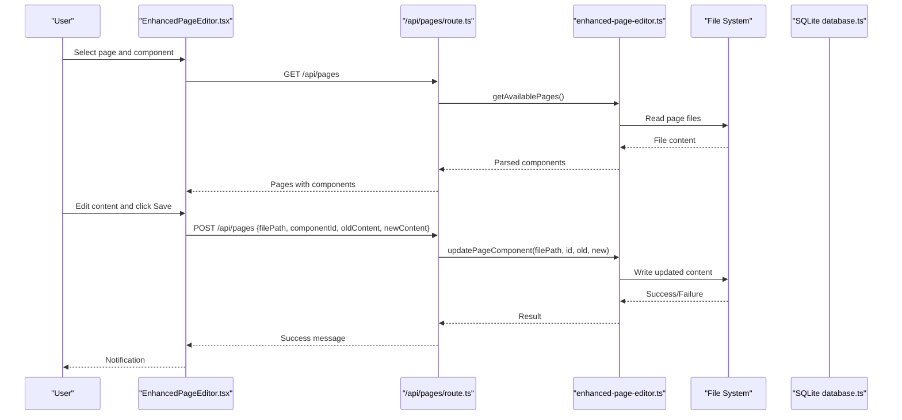

**Diagram sources**
- [EnhancedPageEditor.tsx](file://src/app/Components/Admin/EnhancedPageEditor.tsx#L47-L131)
- [route.ts](file://src/app/api/pages/route.ts#L66-L109)
- [enhanced-page-editor.ts](file://src/lib/enhanced-page-editor.ts#L50-L76)
- [enhanced-page-editor.ts](file://src/lib/enhanced-page-editor.ts#L239-L272)
- [database.ts](file://src/lib/database.ts#L84-L184)

## Detailed Component Analysis

### Enhanced Page Editor Library
The EnhancedPageEditor library performs:
- Page discovery: Iterates configured pages and checks file existence.
- Component parsing: Scans lines for text, titles, subtitles, descriptions, images, and links.
- Type determination: Heuristic classification of text length and patterns.
- Safe updates: Replaces content in the identified line and writes back to disk.
- Context extraction: Provides surrounding context for better identification.

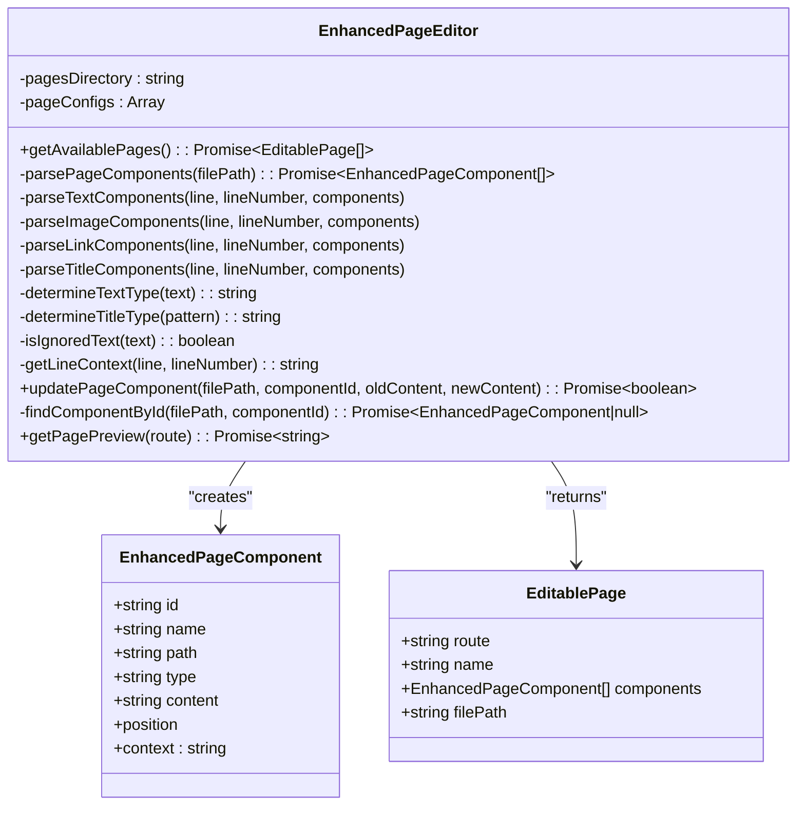

**Diagram sources**
- [enhanced-page-editor.ts](file://src/lib/enhanced-page-editor.ts#L26-L287)

**Section sources**
- [enhanced-page-editor.ts](file://src/lib/enhanced-page-editor.ts#L26-L287)

### Page Editor Library (Legacy)
The simpler PageEditor library supports basic detection and updates:
- Reads page files and extracts text, images, and links.
- Updates content via simple string replacement.
- Provides component content retrieval.

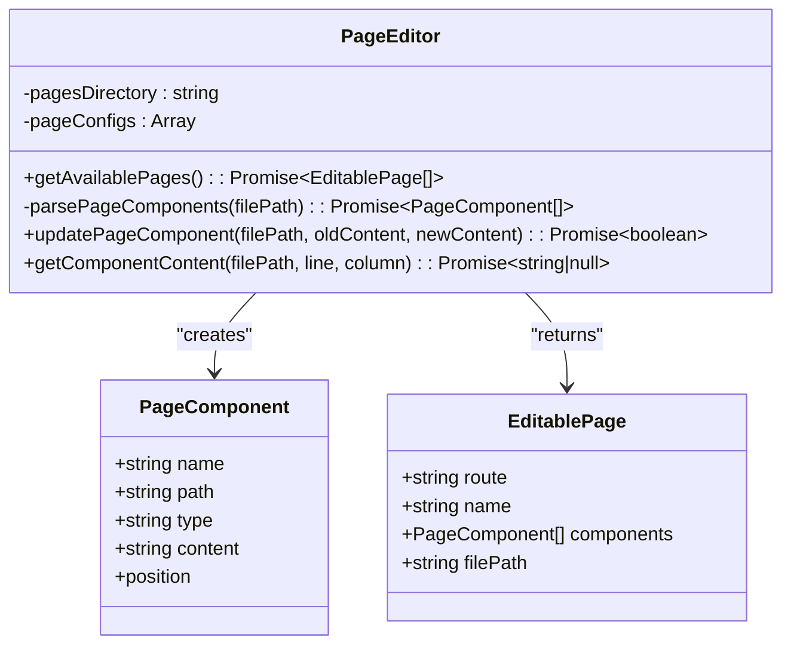

**Diagram sources**
- [page-editor.ts](file://src/lib/page-editor.ts#L23-L194)

**Section sources**
- [page-editor.ts](file://src/lib/page-editor.ts#L23-L194)

### Database Integration (SQLite)
The database module manages:
- Images, image usage, blogs, and page metadata tables.
- Initialization and schema creation.
- Query helpers for CRUD operations.
- Proper lifecycle management (init, run, get, all, close).

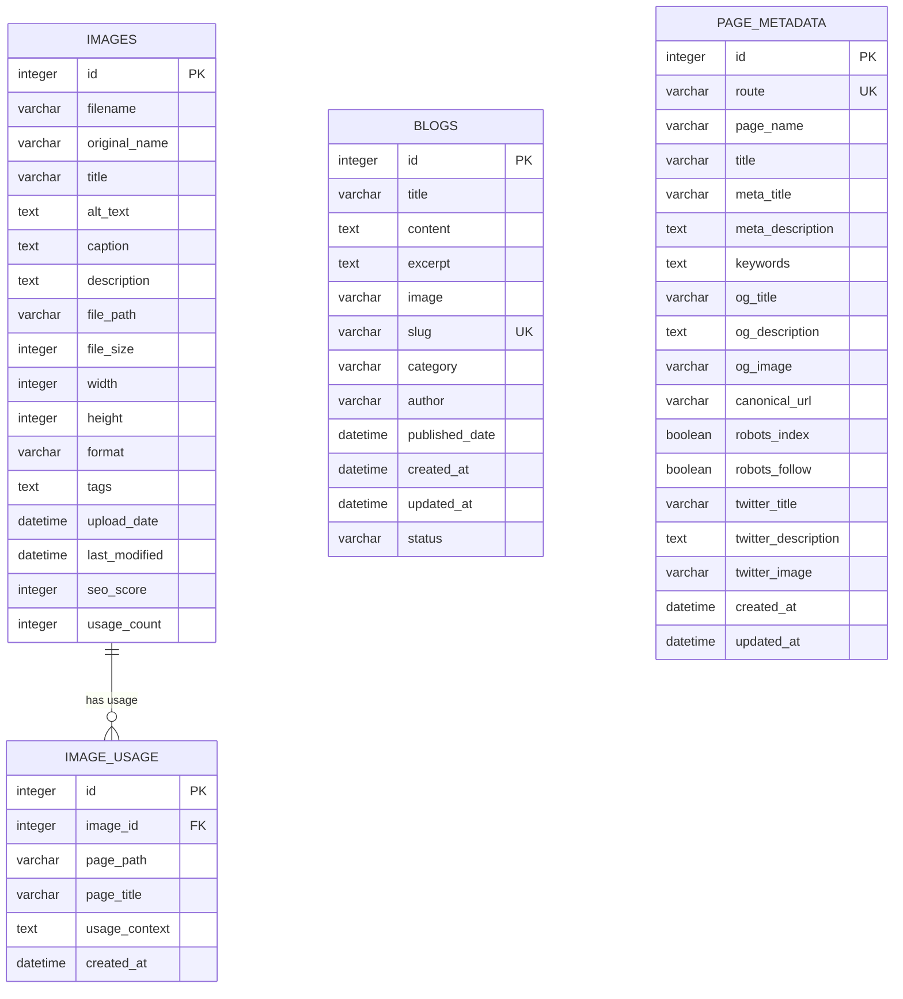

**Diagram sources**
- [database.ts](file://src/lib/database.ts#L18-L81)

**Section sources**
- [database.ts](file://src/lib/database.ts#L84-L184)
- [database.ts](file://src/lib/database.ts#L215-L254)

### Backup System
The backup system:
- Ensures a backup directory exists.
- Creates backups with metadata (file path, timestamp, original content).
- Restores backups by writing original content back to the file.
- Lists and deletes backups.

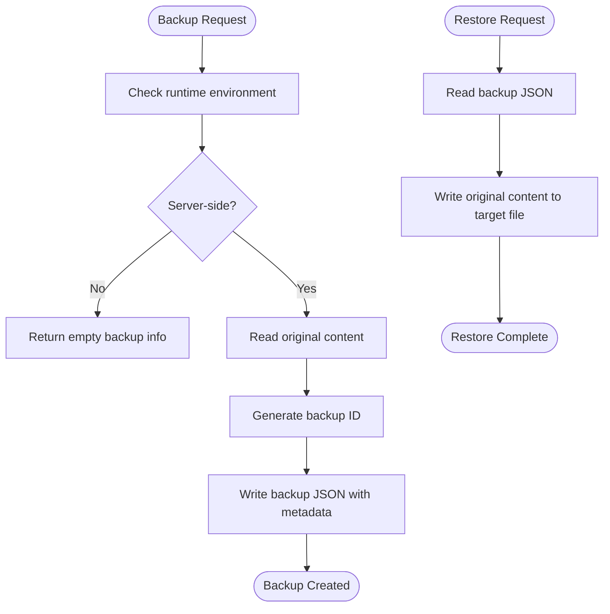

**Diagram sources**
- [backup-system.ts](file://src/lib/backup-system.ts#L33-L82)

**Section sources**
- [backup-system.ts](file://src/lib/backup-system.ts#L12-L119)

### Admin UI Components
- EnhancedPageEditor: Full-featured editor with search, filters, context display, image preview, and iframe preview.
- PageEditor: Simplified editor with similar capabilities but fewer features.

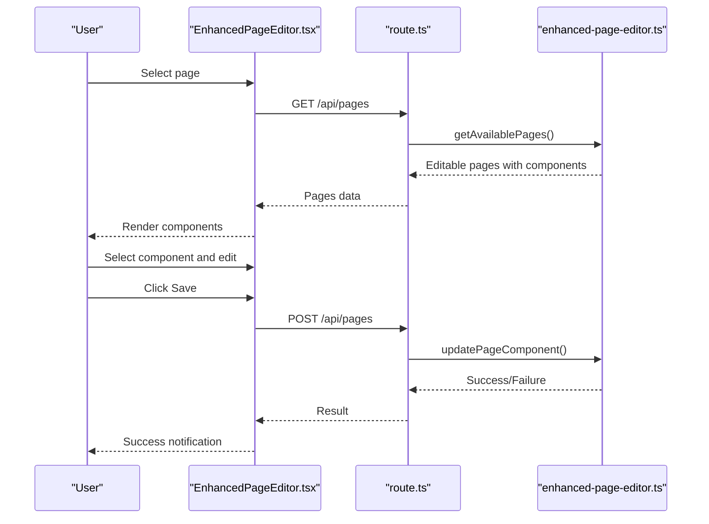

**Diagram sources**
- [EnhancedPageEditor.tsx](file://src/app/Components/Admin/EnhancedPageEditor.tsx#L47-L131)
- [route.ts](file://src/app/api/pages/route.ts#L66-L109)
- [enhanced-page-editor.ts](file://src/lib/enhanced-page-editor.ts#L50-L76)
- [enhanced-page-editor.ts](file://src/lib/enhanced-page-editor.ts#L239-L272)

**Section sources**
- [EnhancedPageEditor.tsx](file://src/app/Components/Admin/EnhancedPageEditor.tsx#L32-L431)
- [PageEditor.tsx](file://src/app/Components/Admin/PageEditor.tsx#L29-L323)
- [page.tsx](file://src/app/admin/page-editor/page.tsx#L1-L14)

### Metadata Management Hooks
React hooks provide:
- Single page metadata retrieval and refresh.
- Paginated listing of metadata with search and pagination controls.
- Update and create operations for page metadata.

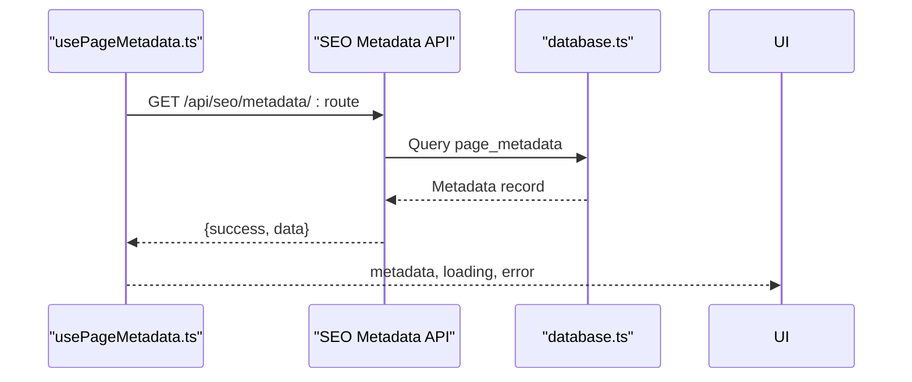

**Diagram sources**
- [usePageMetadata.ts](file://src/hooks/usePageMetadata.ts#L18-L51)
- [database.ts](file://src/lib/database.ts#L215-L254)

**Section sources**
- [usePageMetadata.ts](file://src/hooks/usePageMetadata.ts#L13-L218)
- [useFilePageMetadata.ts](file://src/hooks/useFilePageMetadata.ts#L13-L225)

### API Endpoints
- GET /api/pages: Returns available pages with parsed components (mocked in current implementation).
- POST /api/pages: Updates a specific component’s content (simulated in current implementation).

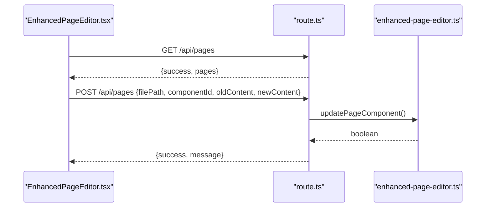

**Diagram sources**
- [route.ts](file://src/app/api/pages/route.ts#L66-L109)
- [enhanced-page-editor.ts](file://src/lib/enhanced-page-editor.ts#L239-L272)

**Section sources**
- [route.ts](file://src/app/api/pages/route.ts#L1-L110)

## Dependency Analysis
External dependencies relevant to the CMS:
- next, react, react-dom: Framework and runtime.
- sqlite3: SQLite driver for Node.js.
- bcryptjs, jsonwebtoken: Authentication-related utilities.
- bootstrap, react-bootstrap, bootstrap-icons: UI framework and icons.
- sharp, multer: Image processing and uploads.
- html-react-parser: Parsing HTML to React nodes.

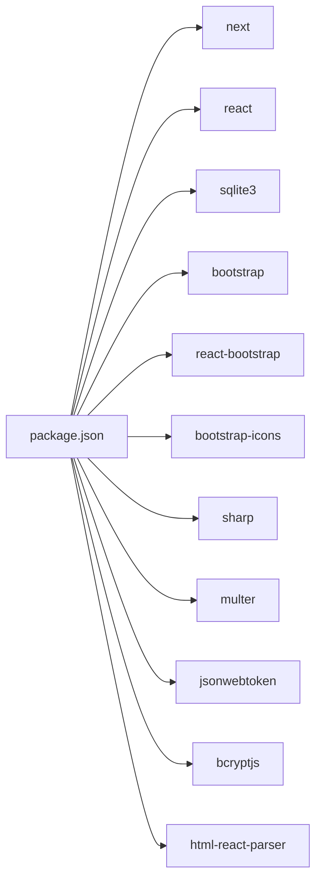

**Diagram sources**
- [package.json](file://package.json#L12-L31)

**Section sources**
- [package.json](file://package.json#L1-L41)

## Performance Considerations
- Component parsing scans entire files line-by-line; for large pages, consider caching parsed components and invalidating on file change.
- API endpoints currently return mock data; production implementations should avoid synchronous file I/O in API handlers—offload to background jobs or use streaming where appropriate.
- Image preview rendering can block UI; defer rendering until user focuses on image components.
- Database operations should use prepared statements and batch updates where feasible.
- Debounce search/filter operations to reduce re-renders.

## Troubleshooting Guide
Common issues and resolutions:
- Content not updating: Verify file path correctness and that the file exists. Ensure the component still exists after parsing.
- Images not showing: Confirm the image URL is accessible and not a data/blob URL.
- Search not working: Ensure the search term matches content in components.
- API failures: Check network connectivity and server logs; confirm API endpoints are reachable.
- Database initialization: Run the initialization script to create tables and directories.
- Metadata seeding: Use the seeding script to populate initial page metadata.

**Section sources**
- [PAGE_EDITOR_README.md](file://PAGE_EDITOR_README.md#L114-L154)
- [init-database.js](file://scripts/init-database.js#L94-L120)
- [seed-seo-data.js](file://scripts/seed-seo-data.js#L134-L171)

## Conclusion
The attechglobal.com CMS provides a robust, non-technical friendly page editor backed by dynamic component detection, file-based parsing, and SQLite metadata storage. The system emphasizes safety with automatic backups, validation, and preview capabilities. While current API endpoints are mocked, the underlying libraries and UI components are structured to support production-grade content editing workflows.

## Appendices

### Page Editor Workflow
- Discovery: The editor discovers pages from configured routes and parses components from source files.
- Selection: Users select a page and filter/editable components.
- Editing: Users edit content with context and live image previews.
- Validation: Content is validated before saving.
- Persistence: Updates are written to files; backups are created automatically.
- Preview: Users can preview the page in an iframe.

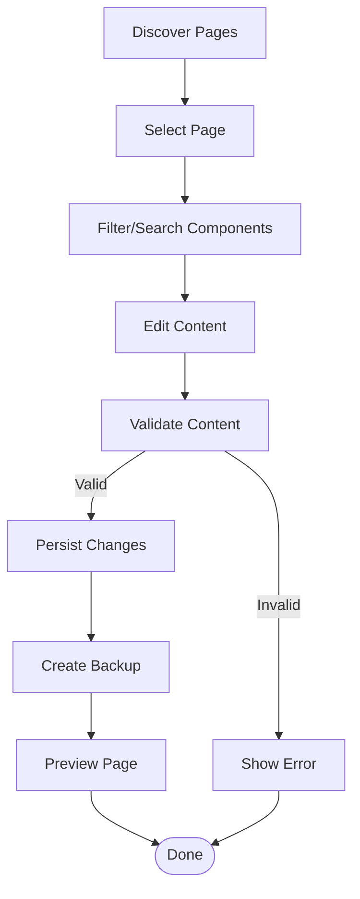

**Diagram sources**
- [enhanced-page-editor.ts](file://src/lib/enhanced-page-editor.ts#L50-L76)
- [EnhancedPageEditor.tsx](file://src/app/Components/Admin/EnhancedPageEditor.tsx#L133-L139)
- [backup-system.ts](file://src/lib/backup-system.ts#L33-L66)

### Database Initialization and Seeding
- Initialization script ensures the data directory exists and creates required tables.
- SEO seeding script inserts initial page metadata records into the database.

**Section sources**
- [init-database.js](file://scripts/init-database.js#L94-L120)
- [seed-seo-data.js](file://scripts/seed-seo-data.js#L134-L171)
- [seed-metadata.ts](file://src/lib/seed-metadata.ts#L3-L93)

### Example: Content Editing Process
- User selects a page and a component.
- The editor displays context and content type-specific input.
- User modifies content and clicks Save.
- The API endpoint receives the update request.
- The library locates the component and replaces content safely.
- The system writes the updated file and notifies the user.

**Section sources**
- [EnhancedPageEditor.tsx](file://src/app/Components/Admin/EnhancedPageEditor.tsx#L77-L131)
- [route.ts](file://src/app/api/pages/route.ts#L80-L109)
- [enhanced-page-editor.ts](file://src/lib/enhanced-page-editor.ts#L239-L272)

### Component Composition Patterns
- Text, titles, subtitles, descriptions, images, and links are supported.
- Context information helps editors understand where content appears.
- Filtering and search streamline navigation across many components.

**Section sources**
- [enhanced-page-editor.ts](file://src/lib/enhanced-page-editor.ts#L102-L205)
- [EnhancedPageEditor.tsx](file://src/app/Components/Admin/EnhancedPageEditor.tsx#L133-L139)

### Real-time Preview Functionality
- The editor can toggle a preview panel that embeds the page route in an iframe.
- This provides immediate visual feedback after edits.

**Section sources**
- [EnhancedPageEditor.tsx](file://src/app/Components/Admin/EnhancedPageEditor.tsx#L416-L427)

### Content Validation Rules
- Ignored content: Whitespace-only, numeric-only, or likely JSX tags.
- Links: Excludes fragments and JavaScript URLs.
- Images: Excludes data URLs and blob URLs.
- Titles/Subtitles: Determined by pattern and length heuristics.

**Section sources**
- [enhanced-page-editor.ts](file://src/lib/enhanced-page-editor.ts#L219-L228)
- [enhanced-page-editor.ts](file://src/lib/enhanced-page-editor.ts#L157-L176)
- [enhanced-page-editor.ts](file://src/lib/enhanced-page-editor.ts#L178-L205)

### Error Handling and User Experience
- Client-side: Alerts and notifications inform users of success or failure.
- Server-side: API endpoints return structured error responses.
- Backups: Automatic backups prevent data loss during edits.
- Context display: Surrounding code context improves confidence in edits.

**Section sources**
- [EnhancedPageEditor.tsx](file://src/app/Components/Admin/EnhancedPageEditor.tsx#L116-L131)
- [route.ts](file://src/app/api/pages/route.ts#L71-L109)
- [backup-system.ts](file://src/lib/backup-system.ts#L33-L66)