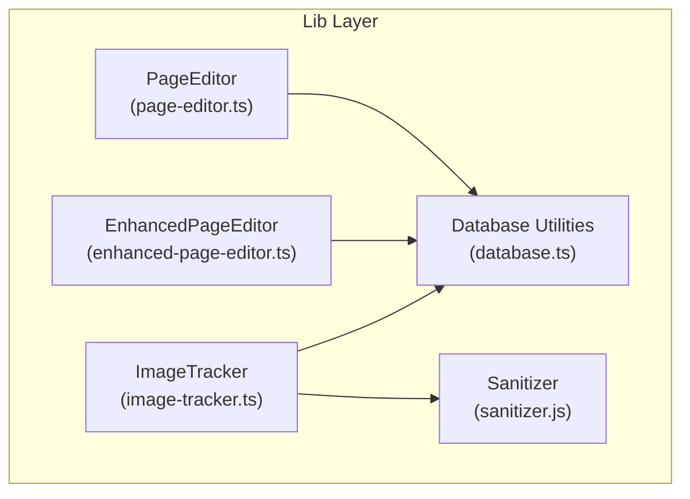
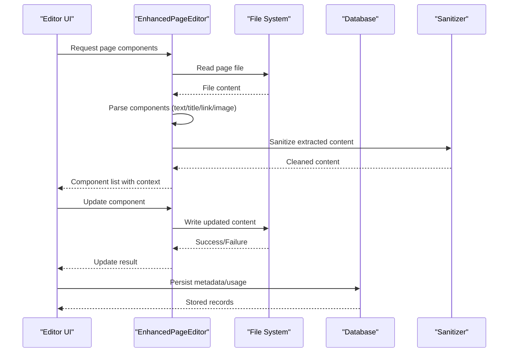
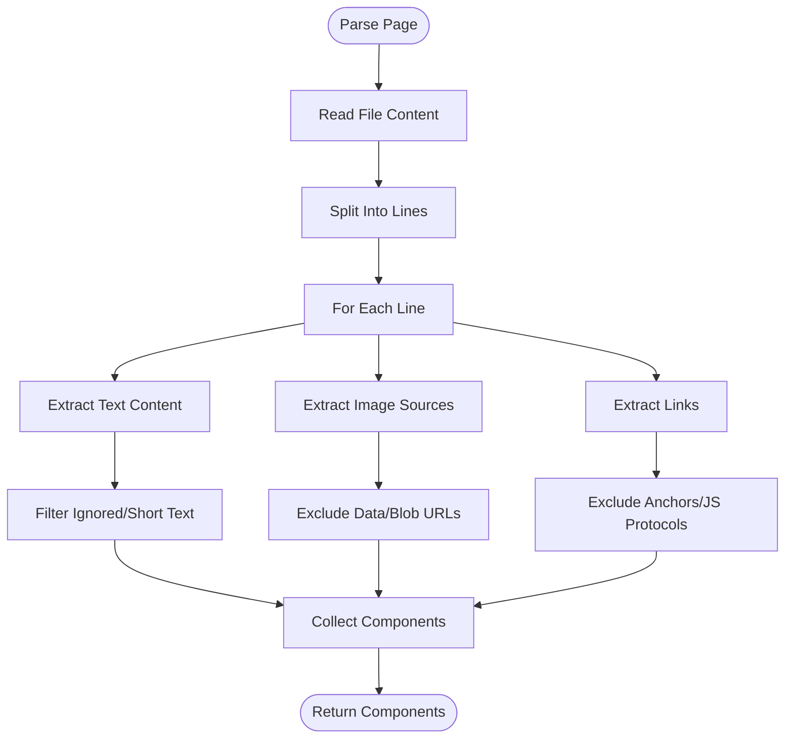
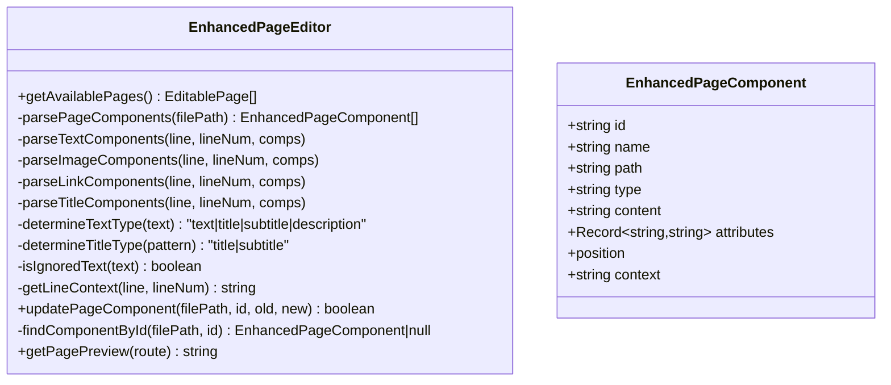
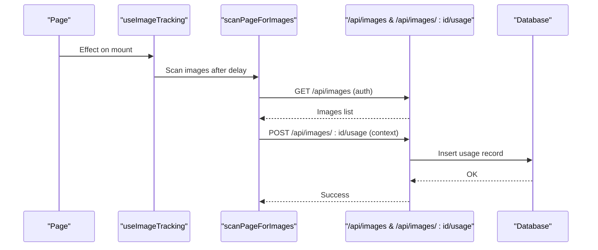
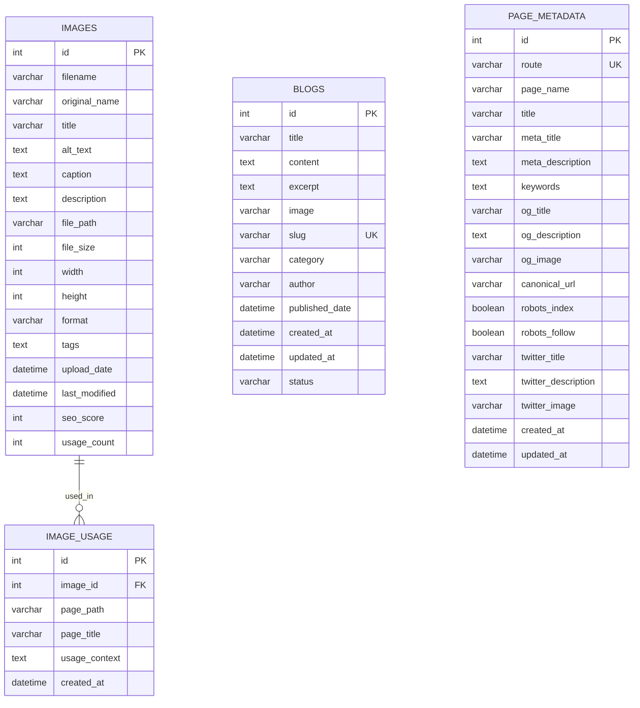
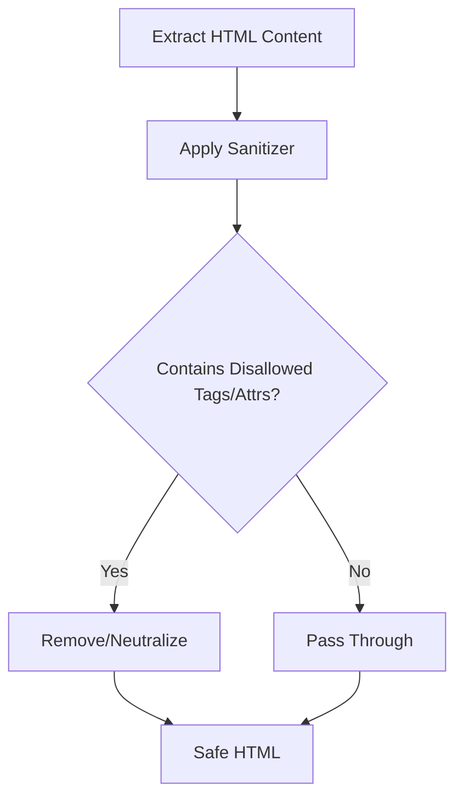
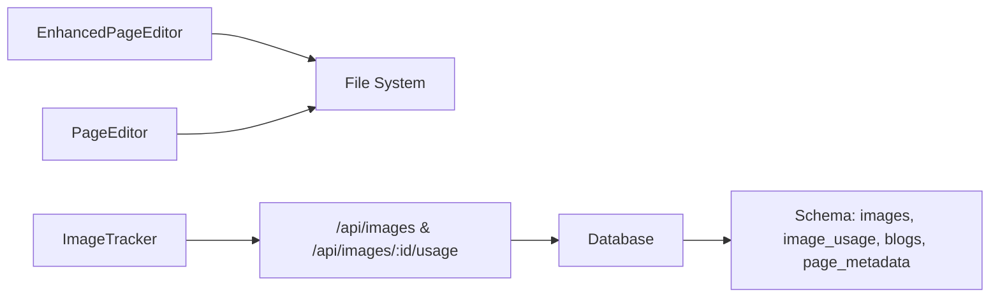

# Content Validation and Quality Control

<cite>
**Referenced Files in This Document**
- [page-editor.ts](file://src/lib/page-editor.ts)
- [enhanced-page-editor.ts](file://src/lib/enhanced-page-editor.ts)
- [image-tracker.ts](file://src/lib/image-tracker.ts)
- [database.ts](file://src/lib/database.ts)
- [sanitizer.js](file://node_modules/bootstrap/js/src/util/sanitizer.js)
- [README.md](file://README.md)
- [PAGE_EDITOR_README.md](file://PAGE_EDITOR_README.md)
</cite>

## Table of Contents
1. [Introduction](#introduction)
2. [Project Structure](#project-structure)
3. [Core Components](#core-components)
4. [Architecture Overview](#architecture-overview)
5. [Detailed Component Analysis](#detailed-component-analysis)
6. [Dependency Analysis](#dependency-analysis)
7. [Performance Considerations](#performance-considerations)
8. [Troubleshooting Guide](#troubleshooting-guide)
9. [Conclusion](#conclusion)
10. [Appendices](#appendices)

## Introduction
This document explains the content validation and quality control mechanisms implemented in the project. It covers validation rules for text, images, and links during content editing, sanitization processes to prevent cross-site scripting (XSS) and ensure content safety, performance monitoring integration for slow-loading content, error handling and user feedback mechanisms, content approval workflows, real-time validation feedback via the page editor, and consistency checks such as duplicate content prevention and quality assurance measures.

## Project Structure
The validation and quality control features are primarily implemented in the library layer under src/lib. The page editors provide parsing and editing capabilities for content, while the database layer stores metadata and usage records. A sanitizer utility is included to help sanitize HTML content safely.

**Diagram sources**
- [page-editor.ts](file://src/lib/page-editor.ts#L23-L194)
- [enhanced-page-editor.ts](file://src/lib/enhanced-page-editor.ts#L26-L287)
- [image-tracker.ts](file://src/lib/image-tracker.ts#L1-L95)
- [database.ts](file://src/lib/database.ts#L1-L255)
- [sanitizer.js](file://node_modules/bootstrap/js/src/util/sanitizer.js)

**Section sources**
- [page-editor.ts](file://src/lib/page-editor.ts#L1-L194)
- [enhanced-page-editor.ts](file://src/lib/enhanced-page-editor.ts#L1-L287)
- [image-tracker.ts](file://src/lib/image-tracker.ts#L1-L95)
- [database.ts](file://src/lib/database.ts#L1-L255)

## Core Components
- PageEditor: Parses page files to extract editable components (text, image, link), supports updates, and retrieves component content for editing.
- EnhancedPageEditor: Extends parsing with richer detection of titles, subtitles, descriptions, and surrounding context; includes improved update logic and preview capability.
- ImageTracker: Tracks image usage across pages and persists usage records to the database via API calls.
- Database Utilities: Provides schema definitions and helpers for storing and retrieving images, blogs, and page metadata.
- Sanitizer: Bootstrap’s sanitizer utility for cleaning HTML content to mitigate XSS risks.

**Section sources**
- [page-editor.ts](file://src/lib/page-editor.ts#L23-L194)
- [enhanced-page-editor.ts](file://src/lib/enhanced-page-editor.ts#L26-L287)
- [image-tracker.ts](file://src/lib/image-tracker.ts#L1-L95)
- [database.ts](file://src/lib/database.ts#L100-L184)
- [sanitizer.js](file://node_modules/bootstrap/js/src/util/sanitizer.js)

## Architecture Overview
The content validation and quality control architecture integrates parsing, sanitization, storage, and tracking:

**Diagram sources**
- [enhanced-page-editor.ts](file://src/lib/enhanced-page-editor.ts#L50-L100)
- [page-editor.ts](file://src/lib/page-editor.ts#L148-L167)
- [image-tracker.ts](file://src/lib/image-tracker.ts#L11-L43)
- [database.ts](file://src/lib/database.ts#L100-L184)
- [sanitizer.js](file://node_modules/bootstrap/js/src/util/sanitizer.js)

## Detailed Component Analysis

### PageEditor: Parsing and Editing
- Purpose: Discover editable components in page files and update them atomically.
- Validation rules:
  - Text extraction ignores isolated punctuation and whitespace.
  - Image extraction excludes data URIs and blobs.
  - Link extraction filters out anchors and JavaScript protocols.
- Update mechanism: Replaces content in the target line to minimize unintended changes.
- Real-time feedback: The editor surfaces component positions and content for immediate correction.

**Diagram sources**
- [page-editor.ts](file://src/lib/page-editor.ts#L78-L145)

**Section sources**
- [page-editor.ts](file://src/lib/page-editor.ts#L23-L194)

### EnhancedPageEditor: Rich Parsing and Contextual Updates
- Purpose: Enhance parsing with titles, subtitles, and descriptions; provide contextual awareness and safer updates.
- Enhanced parsing:
  - Detects headings and title-like content.
  - Determines content types based on length and context.
  - Builds surrounding context per component for better identification.
- Update logic:
  - Attempts to locate the component by ID and replace only the targeted line.
  - Falls back to global replacement if the component cannot be found.
- Preview capability: Returns a placeholder preview for a given route.

**Diagram sources**
- [enhanced-page-editor.ts](file://src/lib/enhanced-page-editor.ts#L26-L287)

**Section sources**
- [enhanced-page-editor.ts](file://src/lib/enhanced-page-editor.ts#L26-L287)

### ImageTracker: Usage Tracking and Quality Assurance
- Purpose: Monitor where images are used across pages and persist usage records to the database.
- Behavior:
  - Scans DOM for images hosted on the same origin.
  - Tracks usage via API calls with page path, title, and context.
  - Exposes a React hook and a component wrapper for automatic tracking.
- Quality assurance:
  - Encourages reuse tracking and helps detect orphaned or unused assets.
  - Supports duplicate content prevention by correlating image usage.

**Diagram sources**
- [image-tracker.ts](file://src/lib/image-tracker.ts#L46-L80)
- [database.ts](file://src/lib/database.ts#L128-L139)

**Section sources**
- [image-tracker.ts](file://src/lib/image-tracker.ts#L1-L95)
- [database.ts](file://src/lib/database.ts#L100-L184)

### Database Schema: Metadata and Usage
- Tables:
  - images: Stores image metadata, dimensions, format, SEO score, and usage count.
  - image_usage: Tracks where each image is used across pages.
  - blogs: Stores blog posts with content, excerpts, categories, and status.
  - page_metadata: Stores SEO metadata per route.
- Quality controls:
  - Unique constraints (e.g., image slug) to prevent duplicates.
  - Status field for approval workflows.
  - Usage counts and contexts to support audits and consistency checks.

**Diagram sources**
- [database.ts](file://src/lib/database.ts#L106-L181)

**Section sources**
- [database.ts](file://src/lib/database.ts#L100-L184)

### Content Sanitization: XSS Prevention
- Mechanism: Uses Bootstrap’s sanitizer utility to clean HTML content before rendering or storage.
- Scope: Removes disallowed tags and attributes to mitigate XSS risks.
- Integration: Apply sanitization during parsing and before saving content to the database or exposing to the UI.

**Diagram sources**
- [sanitizer.js](file://node_modules/bootstrap/js/src/util/sanitizer.js)

**Section sources**
- [sanitizer.js](file://node_modules/bootstrap/js/src/util/sanitizer.js)

## Dependency Analysis
- PageEditor depends on the file system to read/write page files.
- EnhancedPageEditor extends PageEditor’s capabilities and relies on the same file system access.
- ImageTracker depends on DOM scanning and API endpoints to persist usage records; it also interacts with the database schema.
- Database utilities centralize schema creation and query helpers for all content-related entities.

**Diagram sources**
- [enhanced-page-editor.ts](file://src/lib/enhanced-page-editor.ts#L26-L36)
- [page-editor.ts](file://src/lib/page-editor.ts#L26-L33)
- [image-tracker.ts](file://src/lib/image-tracker.ts#L14-L43)
- [database.ts](file://src/lib/database.ts#L100-L184)

**Section sources**
- [enhanced-page-editor.ts](file://src/lib/enhanced-page-editor.ts#L26-L36)
- [page-editor.ts](file://src/lib/page-editor.ts#L26-L33)
- [image-tracker.ts](file://src/lib/image-tracker.ts#L14-L43)
- [database.ts](file://src/lib/database.ts#L100-L184)

## Performance Considerations
- Parsing performance: Both editors split files into lines and iterate once. Complexity is O(L) per page, where L is the number of lines.
- DOM scanning: ImageTracker scans images after a short delay to ensure resources are loaded; tune the delay based on page complexity.
- Database writes: Batch usage inserts and avoid synchronous writes in hot paths; consider queueing for high-frequency edits.
- Caching: Cache parsed components per route to reduce repeated file reads during validation sessions.
- Sanitization overhead: Apply sanitization only when content is edited or saved to minimize CPU usage.

[No sources needed since this section provides general guidance]

## Troubleshooting Guide
- Validation errors:
  - Text too short or ignored: Adjust thresholds in parsing logic to include or exclude specific content types.
  - Invalid image URL: Ensure absolute or relative URLs are valid and hosted on the same origin.
  - Unsafe link protocol: Filter out anchors and JavaScript protocols during parsing.
- User feedback:
  - Display validation messages near the component with clear guidance on acceptable formats and lengths.
  - Provide undo/redo actions after updates to allow quick corrections.
- Approval workflows:
  - Use the status field in blogs to mark drafts, pending review, or published states.
  - Integrate with admin endpoints to approve or reject content changes.
- Slow-loading content:
  - Monitor image loading times and flag assets exceeding thresholds.
  - Use lazy loading and compression to improve perceived performance.

**Section sources**
- [enhanced-page-editor.ts](file://src/lib/enhanced-page-editor.ts#L219-L228)
- [page-editor.ts](file://src/lib/page-editor.ts#L131-L141)
- [database.ts](file://src/lib/database.ts#L142-L157)

## Conclusion
The project implements a layered validation and quality control system centered around two page editors, a sanitizer, and a robust database schema. Together, these components enforce content rules, sanitize HTML, track usage, and support approval workflows. Integrating performance monitoring and user feedback further strengthens the system’s reliability and maintainability.

[No sources needed since this section summarizes without analyzing specific files]

## Appendices

### Validation Rules Summary
- Text:
  - Minimum length threshold and exclusion of isolated punctuation/whitespace.
- Images:
  - Exclude data URIs and blob URLs; track usage across pages.
- Links:
  - Filter anchors and JavaScript protocols; validate URLs.
- Titles/Subtitles/Descriptions:
  - Determine types based on length and context for consistency.

**Section sources**
- [enhanced-page-editor.ts](file://src/lib/enhanced-page-editor.ts#L102-L129)
- [enhanced-page-editor.ts](file://src/lib/enhanced-page-editor.ts#L131-L155)
- [enhanced-page-editor.ts](file://src/lib/enhanced-page-editor.ts#L157-L176)
- [enhanced-page-editor.ts](file://src/lib/enhanced-page-editor.ts#L207-L217)
- [page-editor.ts](file://src/lib/page-editor.ts#L96-L106)
- [page-editor.ts](file://src/lib/page-editor.ts#L113-L124)
- [page-editor.ts](file://src/lib/page-editor.ts#L129-L140)

### Real-Time Validation Feedback
- The editors expose component positions and content to the UI for immediate validation feedback.
- Contextual hints and type classification aid editors in applying appropriate rules.

**Section sources**
- [enhanced-page-editor.ts](file://src/lib/enhanced-page-editor.ts#L116-L125)
- [enhanced-page-editor.ts](file://src/lib/enhanced-page-editor.ts#L142-L151)
- [enhanced-page-editor.ts](file://src/lib/enhanced-page-editor.ts#L164-L173)

### Content Approval Workflows
- Use the status field in blogs to manage draft/pending/published states.
- Integrate admin endpoints to approve or reject content changes.

**Section sources**
- [database.ts](file://src/lib/database.ts#L142-L157)

### Duplicate Content Prevention
- Enforce uniqueness constraints (e.g., image slugs) to prevent duplicates.
- Track usage via image_usage to identify redundant assets and encourage reuse.

**Section sources**
- [database.ts](file://src/lib/database.ts#L149-L150)
- [database.ts](file://src/lib/database.ts#L128-L139)

### Integration Notes
- Refer to the project’s README and the dedicated page editor guide for setup and usage instructions.

**Section sources**
- [README.md](file://README.md)
- [PAGE_EDITOR_README.md](file://PAGE_EDITOR_README.md)