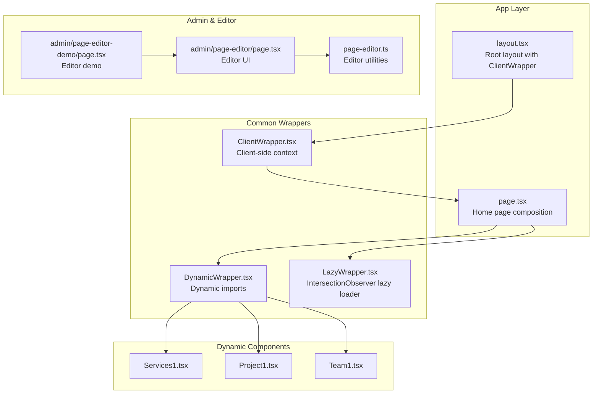
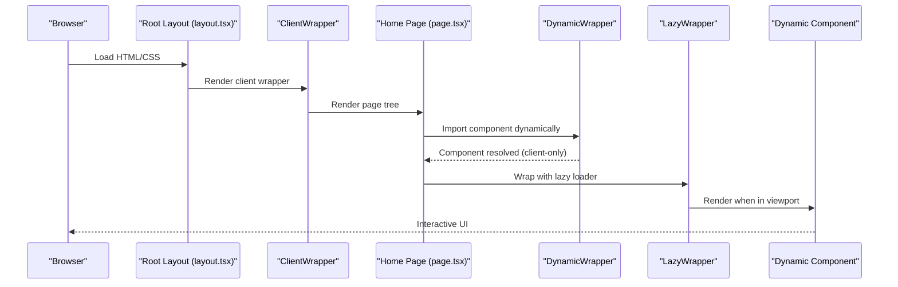
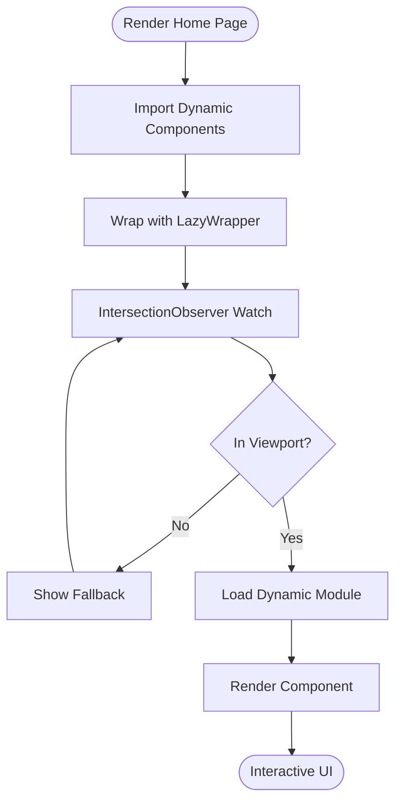
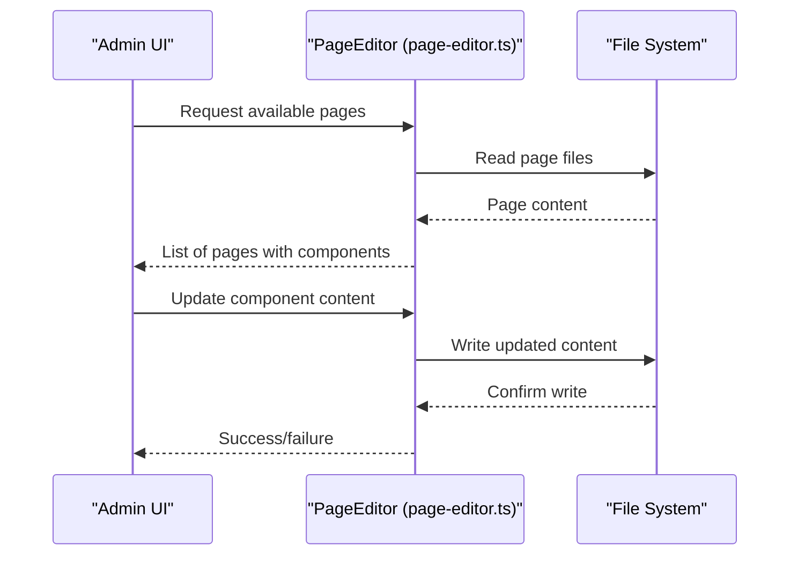
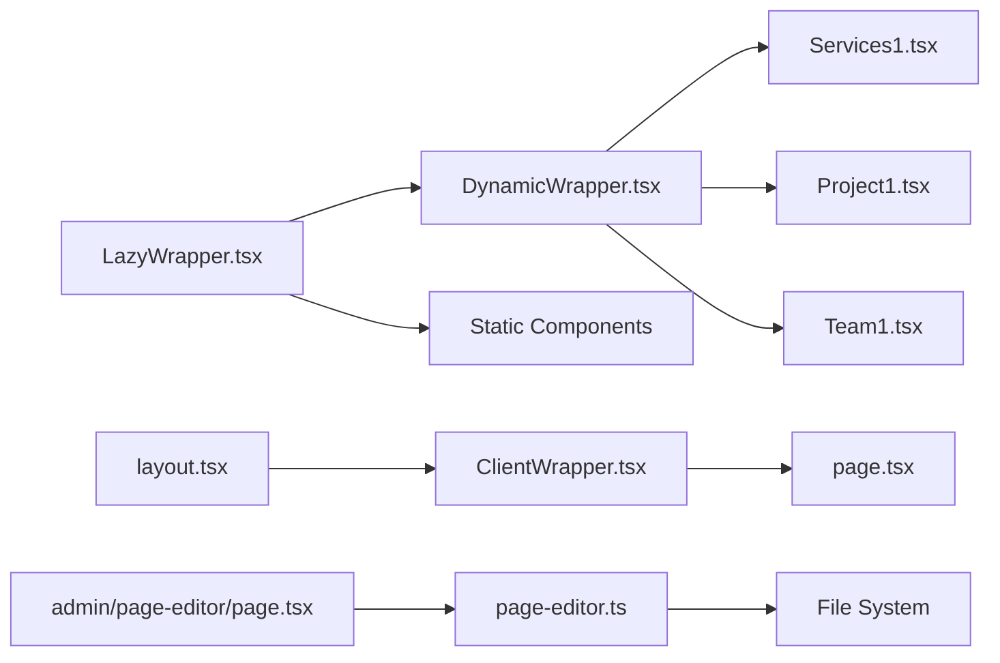

# Dynamic Component System

<cite>
**Referenced Files in This Document**
- [DynamicWrapper.tsx](file://src/app/Components/Common/DynamicWrapper.tsx)
- [LazyWrapper.tsx](file://src/app/Components/Common/LazyWrapper.tsx)
- [ClientWrapper.tsx](file://src/app/Components/Common/ClientWrapper.tsx)
- [page.tsx](file://src/app/page.tsx)
- [layout.tsx](file://src/app/layout.tsx)
- [page-editor.ts](file://src/lib/page-editor.ts)
- [page-editor\page.tsx](file://src/app/admin/page-editor/page.tsx)
- [page-editor-demo\page.tsx](file://src/app/admin/page-editor-demo/page.tsx)
- [Services1.tsx](file://src/app/Components/Services/Services1.tsx)
- [Project1.tsx](file://src/app/Components/Project/Project1.tsx)
- [Team1.tsx](file://src/app/Components/Team/Team1.tsx)
</cite>

## Table of Contents
1. [Introduction](#introduction)
2. [Project Structure](#project-structure)
3. [Core Components](#core-components)
4. [Architecture Overview](#architecture-overview)
5. [Detailed Component Analysis](#detailed-component-analysis)
6. [Dependency Analysis](#dependency-analysis)
7. [Performance Considerations](#performance-considerations)
8. [Troubleshooting Guide](#troubleshooting-guide)
9. [Conclusion](#conclusion)

## Introduction
This document explains the dynamic component system architecture used to enable runtime component loading, lazy rendering, and client-side enhancements. It covers:
- DynamicWrapper: runtime component loading with Next.js dynamic imports
- LazyWrapper: intersection observer-based lazy loading for performance
- ClientWrapper: client-side rendering context provider
- Integration with the page editor for real-time content updates
- Component lifecycle, error handling, and fallback mechanisms
- Relationship between dynamic components and the overall page structure

## Project Structure
The dynamic component system spans three primary areas:
- Common wrappers under Components/Common for cross-cutting concerns
- Page-level composition in app/page.tsx
- Client-side layout wrapping in app/layout.tsx
- Page editor utilities and admin UI for content editing

**Diagram sources**
- [layout.tsx](file://src/app/layout.tsx#L14-L46)
- [page.tsx](file://src/app/page.tsx#L24-L74)
- [DynamicWrapper.tsx](file://src/app/Components/Common/DynamicWrapper.tsx#L1-L42)
- [LazyWrapper.tsx](file://src/app/Components/Common/LazyWrapper.tsx#L1-L51)
- [ClientWrapper.tsx](file://src/app/Components/Common/ClientWrapper.tsx#L1-L11)
- [page-editor.ts](file://src/lib/page-editor.ts#L23-L194)
- [page-editor\page.tsx](file://src/app/admin/page-editor/page.tsx#L1-L14)
- [page-editor-demo\page.tsx](file://src/app/admin/page-editor-demo/page.tsx#L1-L173)

**Section sources**
- [layout.tsx](file://src/app/layout.tsx#L14-L46)
- [page.tsx](file://src/app/page.tsx#L24-L74)
- [DynamicWrapper.tsx](file://src/app/Components/Common/DynamicWrapper.tsx#L1-L42)
- [LazyWrapper.tsx](file://src/app/Components/Common/LazyWrapper.tsx#L1-L51)
- [ClientWrapper.tsx](file://src/app/Components/Common/ClientWrapper.tsx#L1-L11)
- [page-editor.ts](file://src/lib/page-editor.ts#L23-L194)
- [page-editor\page.tsx](file://src/app/admin/page-editor/page.tsx#L1-L14)
- [page-editor-demo\page.tsx](file://src/app/admin/page-editor-demo/page.tsx#L1-L173)

## Core Components
- DynamicWrapper: Provides Next.js dynamic imports for heavy components with client-only SSR disabling and loading fallbacks.
- LazyWrapper: Uses IntersectionObserver to defer rendering until components are near viewport, reducing initial load.
- ClientWrapper: Ensures client-side context for interactive elements while preserving server-rendered markup.

Key responsibilities:
- DynamicWrapper: Enables per-component lazy loading and SSR opt-out for heavy modules.
- LazyWrapper: Adds viewport-triggered rendering to improve perceived performance.
- ClientWrapper: Wraps the entire app tree to inject client-side-only features safely.

**Section sources**
- [DynamicWrapper.tsx](file://src/app/Components/Common/DynamicWrapper.tsx#L6-L15)
- [LazyWrapper.tsx](file://src/app/Components/Common/LazyWrapper.tsx#L11-L48)
- [ClientWrapper.tsx](file://src/app/Components/Common/ClientWrapper.tsx#L4-L10)

## Architecture Overview
The system composes static and dynamic components at runtime:
- Root layout wraps the app with ClientWrapper to ensure client-side interactivity.
- Home page imports dynamic components via DynamicWrapper and optionally wraps them in LazyWrapper.
- Heavy components are dynamically imported to reduce initial bundle size.
- The page editor scans server-side page files to expose editable content regions.

**Diagram sources**
- [layout.tsx](file://src/app/layout.tsx#L14-L46)
- [page.tsx](file://src/app/page.tsx#L24-L74)
- [DynamicWrapper.tsx](file://src/app/Components/Common/DynamicWrapper.tsx#L17-L41)
- [LazyWrapper.tsx](file://src/app/Components/Common/LazyWrapper.tsx#L21-L47)

## Detailed Component Analysis

### DynamicWrapper Component
Purpose:
- Enable Next.js dynamic imports for heavy components with client-only SSR and loading fallbacks.

Implementation highlights:
- Higher-order function withDynamicImport accepts an import function and optional fallback component.
- Preconfigured constants (e.g., DynamicServices1, DynamicProject1, DynamicTeam1) demonstrate usage patterns.
- Loading fallbacks are rendered while modules are being fetched.
- SSR is disabled for dynamic imports to optimize client-side performance.

Usage pattern in page composition:
- Import preconfigured dynamic components from DynamicWrapper.
- Wrap with LazyWrapper when appropriate to defer rendering.

Lifecycle and fallbacks:
- Fallback renders during module fetch.
- Once resolved, the component replaces the fallback in the UI.
- No explicit error boundary is implemented here; errors propagate to higher-level boundaries.

**Section sources**
- [DynamicWrapper.tsx](file://src/app/Components/Common/DynamicWrapper.tsx#L6-L15)
- [DynamicWrapper.tsx](file://src/app/Components/Common/DynamicWrapper.tsx#L17-L41)
- [page.tsx](file://src/app/page.tsx#L17-L21)
- [page.tsx](file://src/app/page.tsx#L38-L63)

### LazyWrapper Component
Purpose:
- Defer rendering of child components until they enter the viewport using IntersectionObserver.

Implementation highlights:
- Accepts children, fallback, threshold, and rootMargin props.
- Maintains internal state for visibility and whether loading has occurred.
- Disconnects the observer after first intersection to avoid repeated triggers.

Performance characteristics:
- Reduces initial render work by deferring non-critical sections.
- Improves perceived performance by showing lightweight fallbacks first.

Fallback mechanism:
- Renders fallback while not intersecting; switches to children upon intersection.

**Section sources**
- [LazyWrapper.tsx](file://src/app/Components/Common/LazyWrapper.tsx#L4-L9)
- [LazyWrapper.tsx](file://src/app/Components/Common/LazyWrapper.tsx#L11-L48)

### ClientWrapper Component
Purpose:
- Provide a client-side rendering context for interactive elements while keeping server-rendered content intact.

Implementation highlights:
- Wraps children with client-side-only features.
- Used at the root layout level to ensure global client behavior.

Integration:
- Ensures that client-side-only components (e.g., chat buttons, analytics) are available after hydration.

**Section sources**
- [ClientWrapper.tsx](file://src/app/Components/Common/ClientWrapper.tsx#L1-L11)
- [layout.tsx](file://src/app/layout.tsx#L40-L42)

### Page Composition and Runtime Resolution
The home page demonstrates the integration:
- Imports dynamic components from DynamicWrapper.
- Wraps heavy sections in LazyWrapper to defer rendering.
- Includes static components alongside dynamic ones.

**Diagram sources**
- [page.tsx](file://src/app/page.tsx#L24-L74)
- [DynamicWrapper.tsx](file://src/app/Components/Common/DynamicWrapper.tsx#L17-L41)
- [LazyWrapper.tsx](file://src/app/Components/Common/LazyWrapper.tsx#L21-L47)

**Section sources**
- [page.tsx](file://src/app/page.tsx#L24-L74)

### Page Editor Integration
The page editor enables real-time component updates:
- Scans server-side page files to extract editable content (text, images, links).
- Exposes available pages and component metadata for editing.
- Updates page content by replacing text content in the source file.

**Diagram sources**
- [page-editor.ts](file://src/lib/page-editor.ts#L48-L75)
- [page-editor.ts](file://src/lib/page-editor.ts#L147-L167)
- [page-editor\page.tsx](file://src/app/admin/page-editor/page.tsx#L1-L14)
- [page-editor-demo\page.tsx](file://src/app/admin/page-editor-demo/page.tsx#L1-L173)

**Section sources**
- [page-editor.ts](file://src/lib/page-editor.ts#L23-L194)
- [page-editor\page.tsx](file://src/app/admin/page-editor/page.tsx#L1-L14)
- [page-editor-demo\page.tsx](file://src/app/admin/page-editor-demo/page.tsx#L1-L173)

## Dependency Analysis
Relationships among components:
- DynamicWrapper depends on Next.js dynamic imports and React types.
- LazyWrapper depends on browser IntersectionObserver APIs.
- ClientWrapper depends on child components and is applied at the root layout.
- Home page composes dynamic and static components, integrating wrappers.

**Diagram sources**
- [DynamicWrapper.tsx](file://src/app/Components/Common/DynamicWrapper.tsx#L17-L41)
- [LazyWrapper.tsx](file://src/app/Components/Common/LazyWrapper.tsx#L11-L48)
- [ClientWrapper.tsx](file://src/app/Components/Common/ClientWrapper.tsx#L4-L10)
- [page.tsx](file://src/app/page.tsx#L24-L74)
- [layout.tsx](file://src/app/layout.tsx#L14-L46)
- [page-editor.ts](file://src/lib/page-editor.ts#L23-L194)
- [page-editor\page.tsx](file://src/app/admin/page-editor/page.tsx#L1-L14)

**Section sources**
- [DynamicWrapper.tsx](file://src/app/Components/Common/DynamicWrapper.tsx#L1-L42)
- [LazyWrapper.tsx](file://src/app/Components/Common/LazyWrapper.tsx#L1-L51)
- [ClientWrapper.tsx](file://src/app/Components/Common/ClientWrapper.tsx#L1-L11)
- [page.tsx](file://src/app/page.tsx#L24-L74)
- [layout.tsx](file://src/app/layout.tsx#L14-L46)
- [page-editor.ts](file://src/lib/page-editor.ts#L23-L194)
- [page-editor\page.tsx](file://src/app/admin/page-editor/page.tsx#L1-L14)

## Performance Considerations
- Dynamic imports reduce initial bundle size by splitting heavy components.
- LazyWrapper defers rendering until components are near the viewport, improving first paint.
- Disabling SSR for dynamic imports avoids unnecessary server work for client-heavy components.
- IntersectionObserver thresholds and margins can be tuned for optimal performance.

Recommendations:
- Use LazyWrapper for non-critical sections below the fold.
- Prefer dynamic imports for components with heavy dependencies or large bundles.
- Monitor intersection thresholds and root margins to balance performance and user experience.

[No sources needed since this section provides general guidance]

## Troubleshooting Guide
Common issues and resolutions:
- Dynamic component fails to load:
  - Verify the import path resolves correctly at runtime.
  - Ensure the component is exported as default and matches the expected type.
- LazyWrapper does not trigger:
  - Confirm the element enters the viewport and IntersectionObserver is supported.
  - Adjust threshold and rootMargin to suit layout.
- Client-side only features not working:
  - Ensure ClientWrapper is present at the root layout.
  - Confirm the component is marked as client-only.

**Section sources**
- [DynamicWrapper.tsx](file://src/app/Components/Common/DynamicWrapper.tsx#L6-L15)
- [LazyWrapper.tsx](file://src/app/Components/Common/LazyWrapper.tsx#L21-L47)
- [ClientWrapper.tsx](file://src/app/Components/Common/ClientWrapper.tsx#L1-L11)

## Conclusion
The dynamic component system combines Next.js dynamic imports, viewport-triggered lazy loading, and client-side context wrapping to deliver a performant, maintainable page structure. The page editor complements this by enabling real-time content updates without manual code changes. Together, these patterns support scalable, iterative improvements to the site’s content and performance.