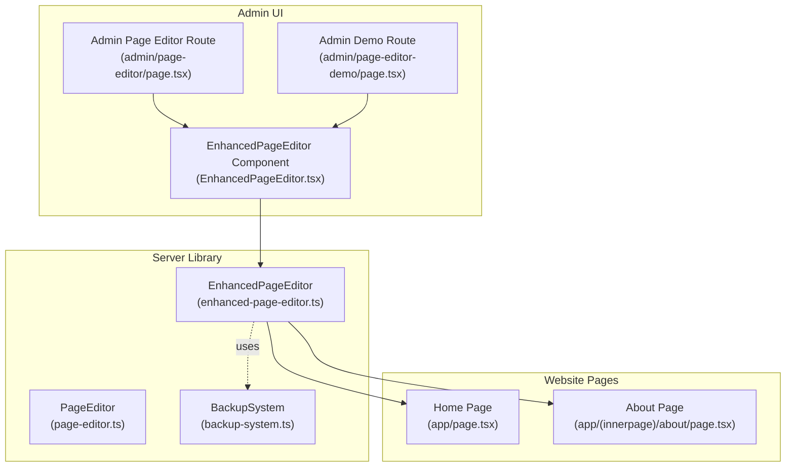
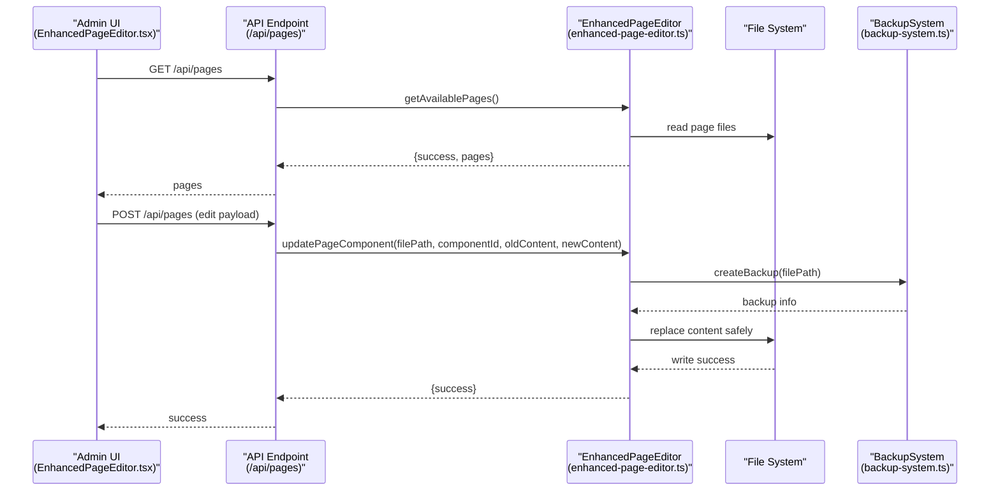
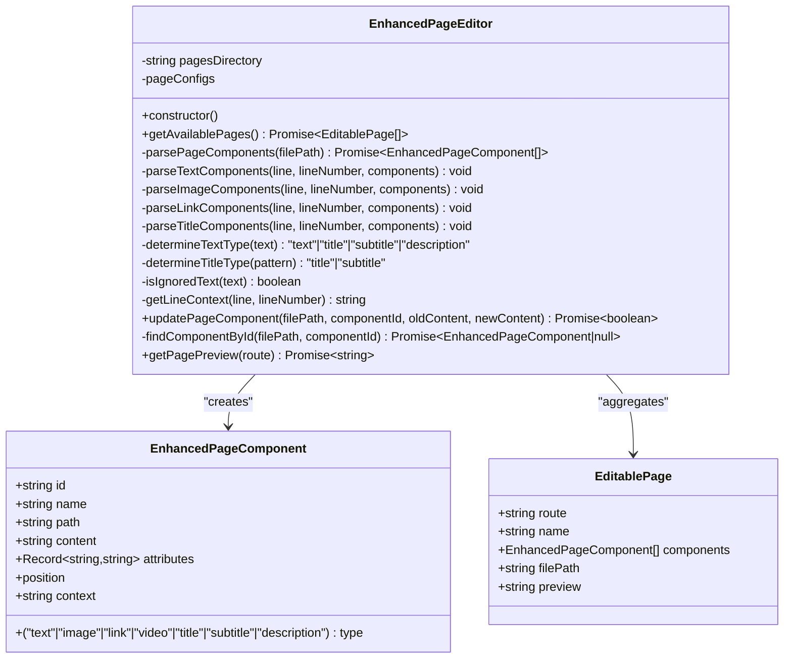
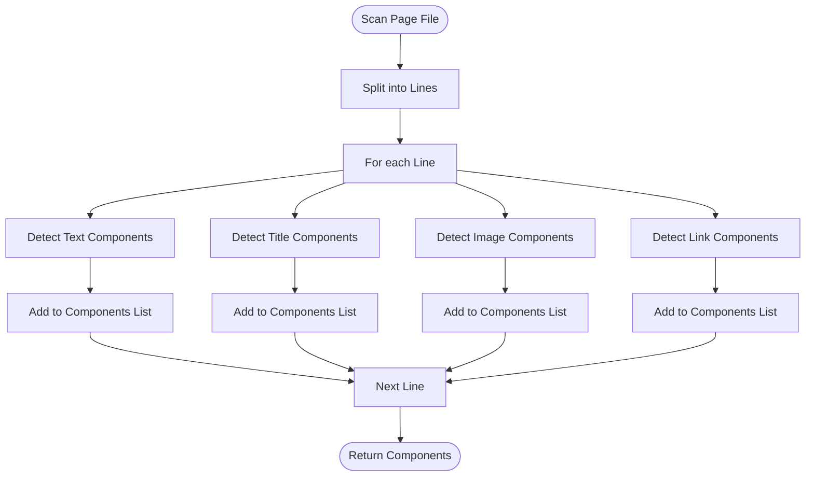
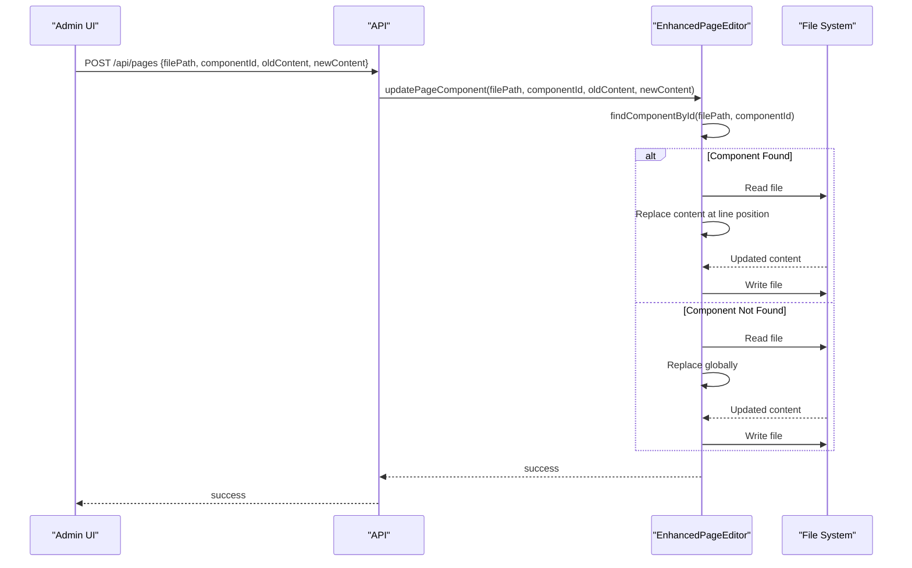
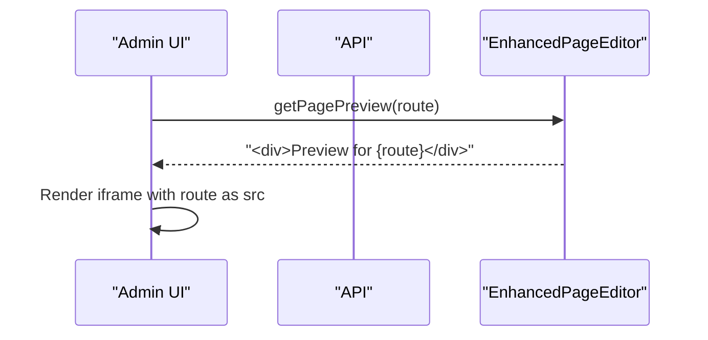
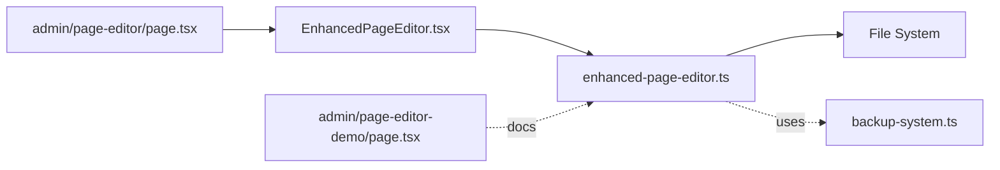

# Enhanced Page Editor

<cite>
**Referenced Files in This Document**
- [enhanced-page-editor.ts](file://src/lib/enhanced-page-editor.ts)
- [page-editor.ts](file://src/lib/page-editor.ts)
- [EnhancedPageEditor.tsx](file://src/app/Components/Admin/EnhancedPageEditor.tsx)
- [page.tsx](file://src/app/admin/page-editor/page.tsx)
- [page.tsx](file://src/app/admin/page-editor-demo/page.tsx)
- [PAGE_EDITOR_README.md](file://PAGE_EDITOR_README.md)
- [backup-system.ts](file://src/lib/backup-system.ts)
- [page.tsx](file://src/app/page.tsx)
- [page.tsx](file://src/app/(innerpage)/about/page.tsx)
</cite>

## Table of Contents
1. [Introduction](#introduction)
2. [Project Structure](#project-structure)
3. [Core Components](#core-components)
4. [Architecture Overview](#architecture-overview)
5. [Detailed Component Analysis](#detailed-component-analysis)
6. [Dependency Analysis](#dependency-analysis)
7. [Performance Considerations](#performance-considerations)
8. [Troubleshooting Guide](#troubleshooting-guide)
9. [Conclusion](#conclusion)
10. [Appendices](#appendices)

## Introduction
This document explains the Enhanced Page Editor component that enables real-time, context-aware editing of Next.js pages without requiring developers to touch code. It covers the EnhancedPageEditor class architecture, component detection and parsing mechanisms, file-based content scanning, safe content replacement, preview generation, client-side versus server-side execution, and security considerations.

## Project Structure
The Enhanced Page Editor spans three layers:
- Server-side library for parsing and editing page files
- Client-side React component for UI and user interaction
- Admin routes and demo pages for access and instructions

**Diagram sources**
- [enhanced-page-editor.ts](file://src/lib/enhanced-page-editor.ts#L26-L287)
- [page-editor.ts](file://src/lib/page-editor.ts#L23-L194)
- [backup-system.ts](file://src/lib/backup-system.ts#L12-L119)
- [EnhancedPageEditor.tsx](file://src/app/Components/Admin/EnhancedPageEditor.tsx#L32-L431)
- [page.tsx](file://src/app/admin/page-editor/page.tsx#L1-L14)
- [page.tsx](file://src/app/admin/page-editor-demo/page.tsx#L1-L173)
- [page.tsx](file://src/app/page.tsx#L24-L75)
- [page.tsx](file://src/app/(innerpage)/about/page.tsx#L135-L170)

**Section sources**
- [PAGE_EDITOR_README.md](file://PAGE_EDITOR_README.md#L52-L72)
- [enhanced-page-editor.ts](file://src/lib/enhanced-page-editor.ts#L38-L48)
- [page-editor.ts](file://src/lib/page-editor.ts#L36-L46)

## Core Components
- EnhancedPageEditor class: Parses JSX pages, detects text, titles, subtitles, descriptions, images, and links, assigns unique identifiers, and safely updates content.
- EnhancedPageEditor React component: Provides the admin UI for selecting pages, filtering and searching components, editing content, and previewing changes.
- BackupSystem: Manages automatic backups before edits for safety.
- Legacy PageEditor: Baseline implementation for comparison and historical context.

Key responsibilities:
- File-based parsing: Scans page files line-by-line for editable content using regex patterns.
- Component typing: Distinguishes text, titles, subtitles, descriptions, images, and links.
- Safe replacement: Uses component position and context-aware replacement to minimize risk.
- Client-server split: UI runs client-side; file operations run server-side via API.

**Section sources**
- [enhanced-page-editor.ts](file://src/lib/enhanced-page-editor.ts#L26-L287)
- [EnhancedPageEditor.tsx](file://src/app/Components/Admin/EnhancedPageEditor.tsx#L32-L431)
- [backup-system.ts](file://src/lib/backup-system.ts#L12-L119)
- [page-editor.ts](file://src/lib/page-editor.ts#L23-L194)

## Architecture Overview
The editor follows a layered architecture:
- Client-side React component fetches pages and components, renders UI, and submits edits.
- Server-side EnhancedPageEditor parses files, detects components, and performs safe replacements.
- BackupSystem ensures recoverability.

**Diagram sources**
- [EnhancedPageEditor.tsx](file://src/app/Components/Admin/EnhancedPageEditor.tsx#L47-L131)
- [enhanced-page-editor.ts](file://src/lib/enhanced-page-editor.ts#L50-L76)
- [enhanced-page-editor.ts](file://src/lib/enhanced-page-editor.ts#L239-L272)
- [backup-system.ts](file://src/lib/backup-system.ts#L33-L66)

## Detailed Component Analysis

### EnhancedPageEditor Class
The EnhancedPageEditor class encapsulates the core logic for detecting and editing page components.

**Diagram sources**
- [enhanced-page-editor.ts](file://src/lib/enhanced-page-editor.ts#L26-L287)

Key behaviors:
- Page discovery: Iterates predefined page configurations to locate and parse page files.
- Component detection:
  - Text: Captures content between JSX tags, with attributes like className, placeholder, aria-label.
  - Titles/Subtitles: Matches h1, h2, h3, and class-based title patterns.
  - Images: Extracts src and background image URLs.
  - Links: Extracts href attributes with basic sanitization against fragments and javascript protocols.
- Typing logic:
  - Text length thresholds and heuristics classify content as text, subtitle, or description.
  - Title/subtitle classification based on matched pattern.
- Safe replacement: Attempts context-aware replacement using component position; falls back to global replacement if component not found.
- Preview: Returns a placeholder for page preview.

Client vs server execution:
- Constructor and most methods guard against client-side execution by returning early or empty arrays.
- File system operations are restricted to server-side environments.

**Section sources**
- [enhanced-page-editor.ts](file://src/lib/enhanced-page-editor.ts#L29-L36)
- [enhanced-page-editor.ts](file://src/lib/enhanced-page-editor.ts#L50-L76)
- [enhanced-page-editor.ts](file://src/lib/enhanced-page-editor.ts#L78-L100)
- [enhanced-page-editor.ts](file://src/lib/enhanced-page-editor.ts#L102-L129)
- [enhanced-page-editor.ts](file://src/lib/enhanced-page-editor.ts#L131-L155)
- [enhanced-page-editor.ts](file://src/lib/enhanced-page-editor.ts#L157-L176)
- [enhanced-page-editor.ts](file://src/lib/enhanced-page-editor.ts#L178-L205)
- [enhanced-page-editor.ts](file://src/lib/enhanced-page-editor.ts#L207-L217)
- [enhanced-page-editor.ts](file://src/lib/enhanced-page-editor.ts#L219-L228)
- [enhanced-page-editor.ts](file://src/lib/enhanced-page-editor.ts#L239-L272)
- [enhanced-page-editor.ts](file://src/lib/enhanced-page-editor.ts#L274-L277)
- [enhanced-page-editor.ts](file://src/lib/enhanced-page-editor.ts#L279-L283)

### Component Detection and Parsing Logic
The parser scans each line and applies multiple regex patterns to detect different content types. It builds a component list with unique identifiers derived from line number, pattern index, and match index.

**Diagram sources**
- [enhanced-page-editor.ts](file://src/lib/enhanced-page-editor.ts#L78-L100)
- [enhanced-page-editor.ts](file://src/lib/enhanced-page-editor.ts#L102-L129)
- [enhanced-page-editor.ts](file://src/lib/enhanced-page-editor.ts#L131-L155)
- [enhanced-page-editor.ts](file://src/lib/enhanced-page-editor.ts#L157-L176)
- [enhanced-page-editor.ts](file://src/lib/enhanced-page-editor.ts#L178-L205)

Implementation highlights:
- Text parsing: Captures content between tags, class names, placeholders, and aria labels; ignores isolated punctuation and tag names.
- Title parsing: Matches h1 for titles, h2/h3 for subtitles, and class-based patterns.
- Image parsing: Extracts src and backgroundImage URLs; excludes data/blob URIs.
- Link parsing: Extracts href values excluding fragments and javascript protocols.
- Unique IDs: Combine line number, pattern index, and match index to form stable identifiers.

**Section sources**
- [enhanced-page-editor.ts](file://src/lib/enhanced-page-editor.ts#L104-L129)
- [enhanced-page-editor.ts](file://src/lib/enhanced-page-editor.ts#L132-L155)
- [enhanced-page-editor.ts](file://src/lib/enhanced-page-editor.ts#L158-L176)
- [enhanced-page-editor.ts](file://src/lib/enhanced-page-editor.ts#L180-L205)
- [enhanced-page-editor.ts](file://src/lib/enhanced-page-editor.ts#L219-L228)

### updatePageComponent Method and Safe Replacement
The update method performs a context-aware replacement when possible, otherwise falls back to global replacement. It writes the updated content back to disk.

**Diagram sources**
- [EnhancedPageEditor.tsx](file://src/app/Components/Admin/EnhancedPageEditor.tsx#L77-L131)
- [enhanced-page-editor.ts](file://src/lib/enhanced-page-editor.ts#L239-L272)
- [enhanced-page-editor.ts](file://src/lib/enhanced-page-editor.ts#L274-L277)

Safety and error handling:
- Client-side guard: Returns false if executed in browser.
- Component lookup: Uses parsed component metadata to target precise positions.
- Fallback replacement: Ensures edits succeed even if component metadata is stale.
- Error logging: Catches and logs exceptions during file operations.

**Section sources**
- [enhanced-page-editor.ts](file://src/lib/enhanced-page-editor.ts#L240-L272)
- [enhanced-page-editor.ts](file://src/lib/enhanced-page-editor.ts#L274-L277)

### Preview Generation System
The preview system provides a live iframe preview of the selected page route. The server-side preview placeholder can be extended to render actual pages.

**Diagram sources**
- [enhanced-page-editor.ts](file://src/lib/enhanced-page-editor.ts#L279-L283)
- [EnhancedPageEditor.tsx](file://src/app/Components/Admin/EnhancedPageEditor.tsx#L416-L427)

**Section sources**
- [enhanced-page-editor.ts](file://src/lib/enhanced-page-editor.ts#L279-L283)
- [EnhancedPageEditor.tsx](file://src/app/Components/Admin/EnhancedPageEditor.tsx#L416-L427)

### Client-Side vs Server-Side Execution
Execution boundaries:
- Client-side (admin UI): React component handles user interactions, displays pages/components, and submits edits via API.
- Server-side (library): File system operations, parsing, and content replacement occur here.

Security and isolation:
- Client-side methods return early to prevent unintended filesystem access.
- API endpoints mediate all server-side operations.

**Section sources**
- [EnhancedPageEditor.tsx](file://src/app/Components/Admin/EnhancedPageEditor.tsx#L47-L63)
- [enhanced-page-editor.ts](file://src/lib/enhanced-page-editor.ts#L50-L82)
- [enhanced-page-editor.ts](file://src/lib/enhanced-page-editor.ts#L240-L243)

### Security Considerations
- Restricted operations: File system access is guarded against client-side execution.
- Content validation: Basic sanitization for links (excludes fragments and javascript).
- Backups: Automatic backup creation before edits prevents data loss.
- Logging: Errors are logged to assist with troubleshooting.

**Section sources**
- [enhanced-page-editor.ts](file://src/lib/enhanced-page-editor.ts#L163-L164)
- [backup-system.ts](file://src/lib/backup-system.ts#L33-L66)
- [PAGE_EDITOR_README.md](file://PAGE_EDITOR_README.md#L140-L146)

## Dependency Analysis
The EnhancedPageEditor depends on:
- File system for reading/writing page files
- BackupSystem for pre-edit backups
- Client-side UI for triggering operations

**Diagram sources**
- [EnhancedPageEditor.tsx](file://src/app/Components/Admin/EnhancedPageEditor.tsx#L32-L431)
- [enhanced-page-editor.ts](file://src/lib/enhanced-page-editor.ts#L26-L287)
- [backup-system.ts](file://src/lib/backup-system.ts#L12-L119)
- [page.tsx](file://src/app/admin/page-editor/page.tsx#L1-L14)
- [page.tsx](file://src/app/admin/page-editor-demo/page.tsx#L1-L173)

**Section sources**
- [enhanced-page-editor.ts](file://src/lib/enhanced-page-editor.ts#L26-L36)
- [backup-system.ts](file://src/lib/backup-system.ts#L12-L23)

## Performance Considerations
- Parsing complexity: Linear in number of lines per page; regex scanning per line.
- Memory usage: Components stored in memory; consider pagination or lazy loading for very large pages.
- Network overhead: API calls for page listing and updates; batch operations could reduce latency.
- Preview rendering: Iframes introduce rendering overhead; consider debouncing or conditional loading.

[No sources needed since this section provides general guidance]

## Troubleshooting Guide
Common issues and resolutions:
- Content not updating: Verify file path correctness and existence; ensure server-side execution.
- Images not showing: Confirm image URL accessibility and protocol restrictions.
- Search/filter not working: Match content against component names or content; adjust search term.
- Backup failures: Check backup directory permissions and availability.

Error handling:
- Client-side guard returns false for unsupported operations.
- Server-side errors are caught and logged; API responses indicate failure with error details.

**Section sources**
- [enhanced-page-editor.ts](file://src/lib/enhanced-page-editor.ts#L52-L54)
- [enhanced-page-editor.ts](file://src/lib/enhanced-page-editor.ts#L268-L271)
- [PAGE_EDITOR_README.md](file://PAGE_EDITOR_README.md#L114-L125)

## Conclusion
The Enhanced Page Editor provides a robust, context-aware solution for editing Next.js pages. Its server-side parsing and safe replacement logic, combined with a rich client-side UI and backup system, enable confident, real-time content modifications while maintaining security and reliability.

[No sources needed since this section summarizes without analyzing specific files]

## Appendices

### Example: Identifying Different Content Types
- Text: Detected inside JSX tags and attributes; classified by length and context.
- Titles: H1 elements and class-based patterns; classified as title.
- Subtitles: H2/H3 elements and class-based patterns; classified as subtitle.
- Descriptions: Long text blocks; classified as description.
- Images: src and backgroundImage URLs; excluded data/blob URIs.
- Links: href attributes; sanitized against fragments and javascript.

**Section sources**
- [enhanced-page-editor.ts](file://src/lib/enhanced-page-editor.ts#L102-L129)
- [enhanced-page-editor.ts](file://src/lib/enhanced-page-editor.ts#L131-L155)
- [enhanced-page-editor.ts](file://src/lib/enhanced-page-editor.ts#L157-L176)
- [enhanced-page-editor.ts](file://src/lib/enhanced-page-editor.ts#L178-L205)
- [enhanced-page-editor.ts](file://src/lib/enhanced-page-editor.ts#L207-L217)

### Example: Safe Content Replacement Flow
- Locate component by ID and line position.
- Perform context-aware replacement at the exact line.
- Fallback to global replacement if component not found.
- Write updated content to disk.

**Section sources**
- [enhanced-page-editor.ts](file://src/lib/enhanced-page-editor.ts#L239-L272)
- [enhanced-page-editor.ts](file://src/lib/enhanced-page-editor.ts#L274-L277)

### Example: Page Preview
- Toggle preview panel to show iframe of the selected route.
- Preview placeholder can be extended to render actual pages.

**Section sources**
- [enhanced-page-editor.ts](file://src/lib/enhanced-page-editor.ts#L279-L283)
- [EnhancedPageEditor.tsx](file://src/app/Components/Admin/EnhancedPageEditor.tsx#L416-L427)