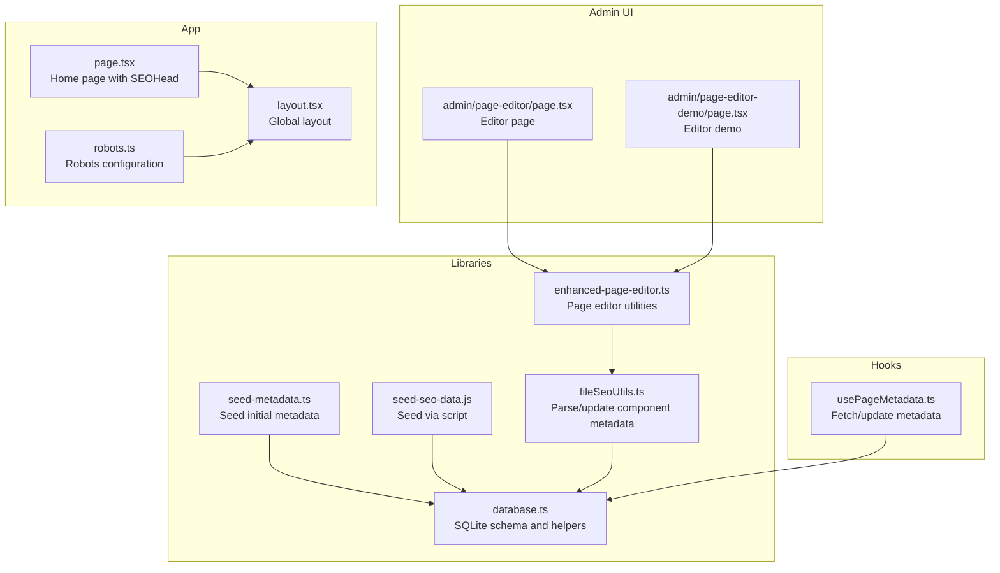
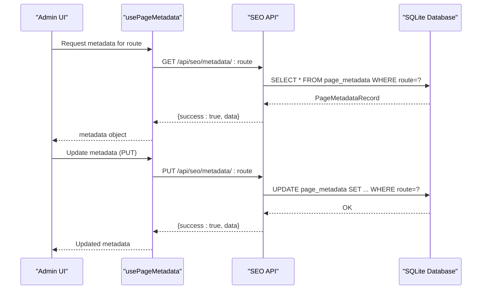
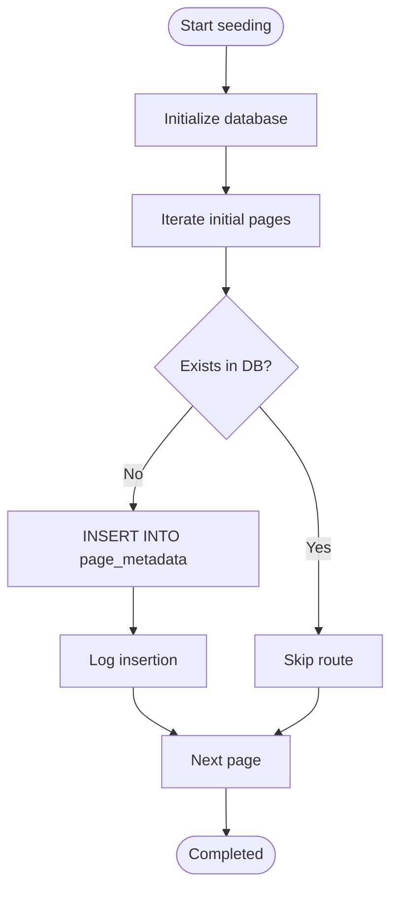
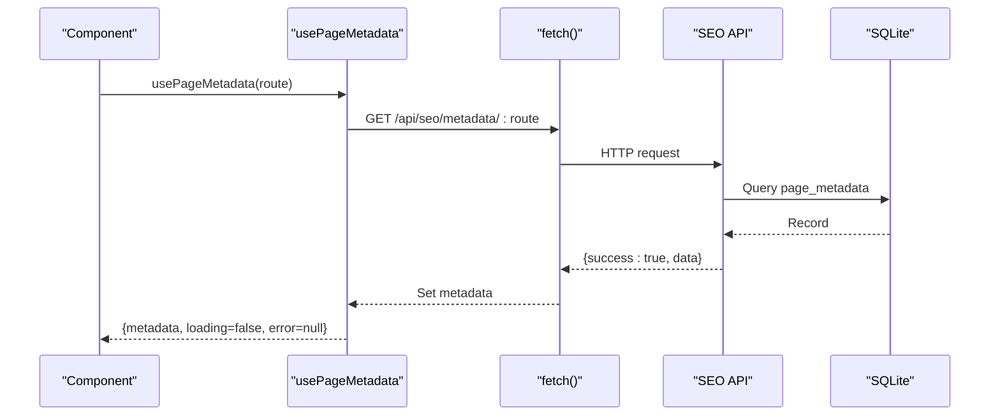
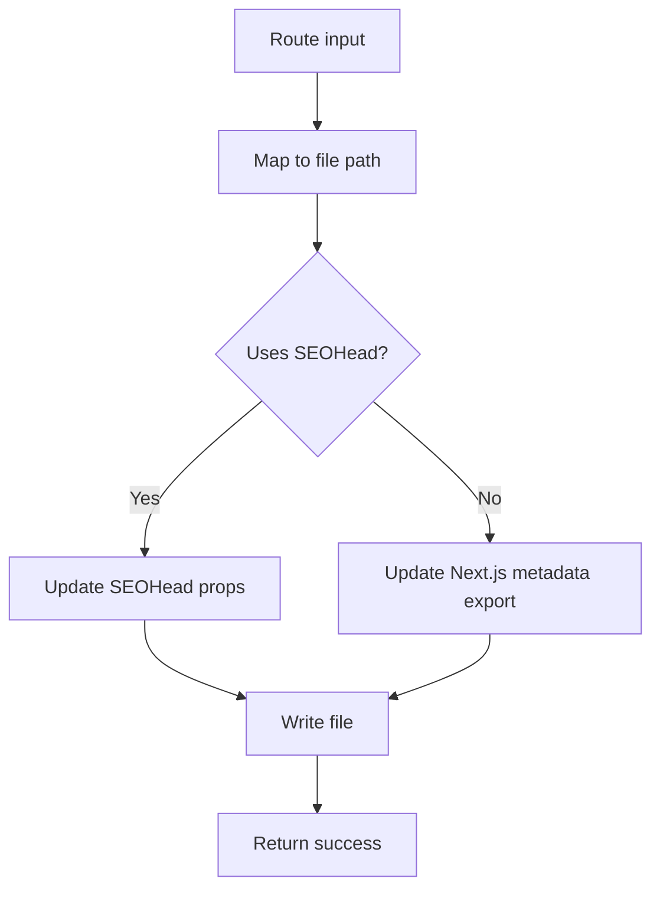
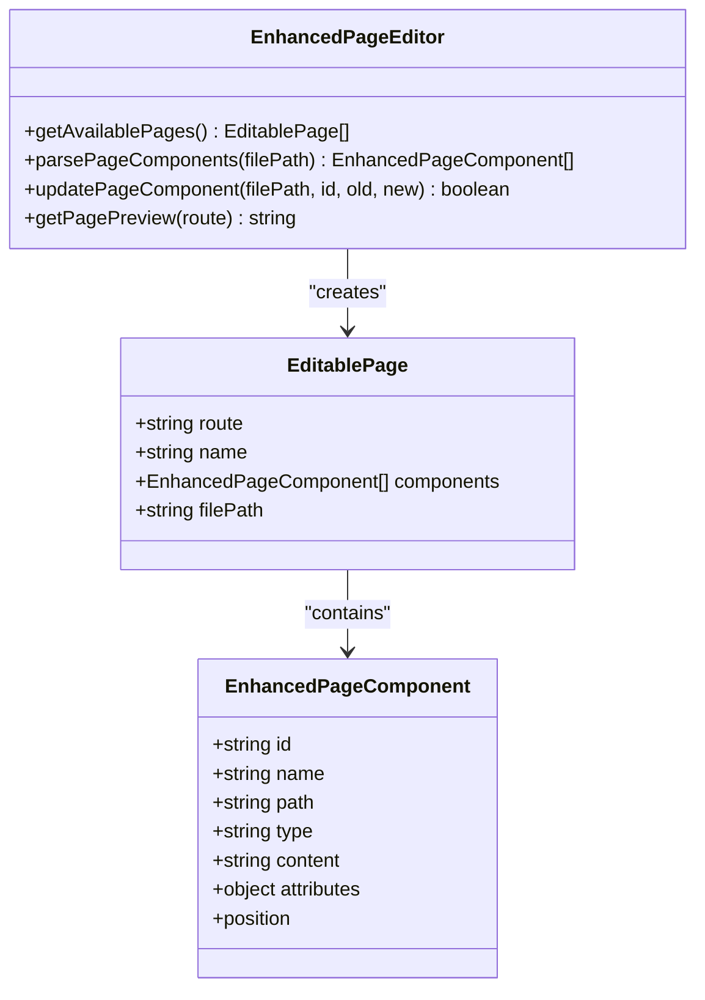
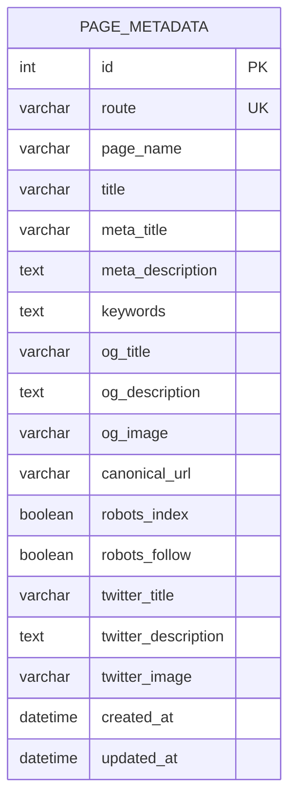
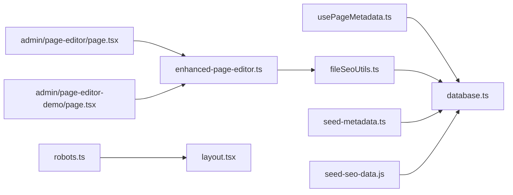

# Metadata Management

<cite>
**Referenced Files in This Document**
- [seed-metadata.ts](file://src/lib/seed-metadata.ts)
- [usePageMetadata.ts](file://src/hooks/usePageMetadata.ts)
- [fileSeoUtils.ts](file://src/lib/fileSeoUtils.ts)
- [enhanced-page-editor.ts](file://src/lib/enhanced-page-editor.ts)
- [database.ts](file://src/lib/database.ts)
- [seed-seo-data.js](file://scripts/seed-seo-data.js)
- [check-seo-data.js](file://scripts/check-seo-data.js)
- [robots.ts](file://src/app/robots.ts)
- [layout.tsx](file://src/app/layout.tsx)
- [page.tsx](file://src/app/page.tsx)
- [page.tsx](file://src/app/admin/page-editor/page.tsx)
- [page.tsx](file://src/app/admin/page-editor-demo/page.tsx)
</cite>

## Table of Contents
1. [Introduction](#introduction)
2. [Project Structure](#project-structure)
3. [Core Components](#core-components)
4. [Architecture Overview](#architecture-overview)
5. [Detailed Component Analysis](#detailed-component-analysis)
6. [Dependency Analysis](#dependency-analysis)
7. [Performance Considerations](#performance-considerations)
8. [Troubleshooting Guide](#troubleshooting-guide)
9. [Conclusion](#conclusion)

## Introduction
This document explains the metadata management system used to initialize, retrieve, update, and optimize page metadata for SEO. It covers:
- Seed-metadata functionality for initializing page configurations and default values
- The usePageMetadata hook for dynamic metadata retrieval and updates
- File-based SEO utilities for automatic metadata generation and optimization
- Examples of metadata seeding workflows, page-specific configurations, and automated SEO enhancements
- Integration with the page editor for metadata editing capabilities
- Metadata validation, conflict resolution, and caching strategies
- The relationship between metadata and SEO performance optimization

## Project Structure
The metadata management system spans libraries, hooks, scripts, and admin UI components:
- Libraries: seed and file-based SEO utilities, database schema and helpers
- Hooks: client-side metadata retrieval and update utilities
- Scripts: seeding and verification of metadata in the database
- Admin UI: page editor integration and demo instructions
- Application-level metadata: robots configuration and page-level SEO head

**Diagram sources**
- [database.ts](file://src/lib/database.ts#L62-L81)
- [seed-metadata.ts](file://src/lib/seed-metadata.ts#L1-L93)
- [seed-seo-data.js](file://scripts/seed-seo-data.js#L1-L171)
- [fileSeoUtils.ts](file://src/lib/fileSeoUtils.ts#L1-L329)
- [enhanced-page-editor.ts](file://src/lib/enhanced-page-editor.ts#L1-L287)
- [usePageMetadata.ts](file://src/hooks/usePageMetadata.ts#L1-L218)
- [page.tsx](file://src/app/admin/page-editor/page.tsx#L1-L14)
- [page.tsx](file://src/app/admin/page-editor-demo/page.tsx#L1-L173)
- [layout.tsx](file://src/app/layout.tsx#L1-L47)
- [page.tsx](file://src/app/page.tsx#L1-L75)
- [robots.ts](file://src/app/robots.ts#L1-L38)

**Section sources**
- [database.ts](file://src/lib/database.ts#L62-L81)
- [seed-metadata.ts](file://src/lib/seed-metadata.ts#L1-L93)
- [seed-seo-data.js](file://scripts/seed-seo-data.js#L1-L171)
- [fileSeoUtils.ts](file://src/lib/fileSeoUtils.ts#L1-L329)
- [enhanced-page-editor.ts](file://src/lib/enhanced-page-editor.ts#L1-L287)
- [usePageMetadata.ts](file://src/hooks/usePageMetadata.ts#L1-L218)
- [page.tsx](file://src/app/admin/page-editor/page.tsx#L1-L14)
- [page.tsx](file://src/app/admin/page-editor-demo/page.tsx#L1-L173)
- [layout.tsx](file://src/app/layout.tsx#L1-L47)
- [page.tsx](file://src/app/page.tsx#L1-L75)
- [robots.ts](file://src/app/robots.ts#L1-L38)

## Core Components
- Database schema and helpers define the page_metadata table and CRUD utilities.
- Seed utilities initialize default metadata for key pages.
- File-based SEO utilities parse and update component metadata, converting to Next.js metadata format.
- Client hooks provide dynamic retrieval, pagination, filtering, and updates.
- Scripts seed and verify metadata entries.
- Admin UI integrates the page editor and demonstrates usage.
- Application-level robots configuration ensures proper crawl behavior.

**Section sources**
- [database.ts](file://src/lib/database.ts#L62-L81)
- [seed-metadata.ts](file://src/lib/seed-metadata.ts#L1-L93)
- [seed-seo-data.js](file://scripts/seed-seo-data.js#L1-L171)
- [fileSeoUtils.ts](file://src/lib/fileSeoUtils.ts#L1-L329)
- [usePageMetadata.ts](file://src/hooks/usePageMetadata.ts#L1-L218)
- [enhanced-page-editor.ts](file://src/lib/enhanced-page-editor.ts#L1-L287)
- [page.tsx](file://src/app/admin/page-editor/page.tsx#L1-L14)
- [page.tsx](file://src/app/admin/page-editor-demo/page.tsx#L1-L173)
- [robots.ts](file://src/app/robots.ts#L1-L38)

## Architecture Overview
The system combines a SQLite-backed metadata store with client-side hooks and file-based utilities:
- Initialization: Seed utilities insert default metadata for core routes.
- Runtime: usePageMetadata fetches metadata via API endpoints and exposes update/create utilities.
- File-based optimization: fileSeoUtils parses component files and updates metadata exports or SEOHead props.
- Admin integration: enhanced-page-editor discovers components and supports editing.
- SEO policy: robots.ts defines crawl rules and sitemap location.

**Diagram sources**
- [usePageMetadata.ts](file://src/hooks/usePageMetadata.ts#L18-L51)
- [database.ts](file://src/lib/database.ts#L159-L181)

## Detailed Component Analysis

### Seed Metadata Functionality
- Purpose: Initialize default metadata for core pages (home, about, contact, services).
- Behavior: Connects to the database, iterates predefined pages, checks existence, and inserts defaults if missing.
- Output: Logs completion and per-route insertion status.

**Diagram sources**
- [seed-metadata.ts](file://src/lib/seed-metadata.ts#L3-L93)

**Section sources**
- [seed-metadata.ts](file://src/lib/seed-metadata.ts#L1-L93)

### usePageMetadata Hook
- Purpose: Provide client-side access to page metadata with loading, error, and refresh states.
- Features:
  - Single-page fetch by route
  - Paginated listing with search and pagination controls
  - Update, create, and delete utilities
- Error handling: Network errors and server-side failures are captured and surfaced.

**Diagram sources**
- [usePageMetadata.ts](file://src/hooks/usePageMetadata.ts#L18-L51)
- [database.ts](file://src/lib/database.ts#L159-L181)

**Section sources**
- [usePageMetadata.ts](file://src/hooks/usePageMetadata.ts#L1-L218)

### File-Based SEO Utilities
- Route-to-file mapping: Maps routes to component file paths for discovery and updates.
- Parsing: Extracts metadata from component files, supporting both SEOHead props and Next.js metadata exports.
- Updating: Replaces metadata values in component files while preserving structure.
- Conversion: Converts metadata to Next.js metadata format for rendering.

**Diagram sources**
- [fileSeoUtils.ts](file://src/lib/fileSeoUtils.ts#L6-L31)
- [fileSeoUtils.ts](file://src/lib/fileSeoUtils.ts#L183-L298)

**Section sources**
- [fileSeoUtils.ts](file://src/lib/fileSeoUtils.ts#L1-L329)

### Enhanced Page Editor Integration
- Discovery: Scans configured page files and extracts editable components (text, images, links, titles).
- Editing: Supports context-aware replacements and line-based updates.
- Preview: Provides a placeholder preview mechanism for rendered pages.

**Diagram sources**
- [enhanced-page-editor.ts](file://src/lib/enhanced-page-editor.ts#L26-L287)

**Section sources**
- [enhanced-page-editor.ts](file://src/lib/enhanced-page-editor.ts#L1-L287)
- [page.tsx](file://src/app/admin/page-editor/page.tsx#L1-L14)
- [page.tsx](file://src/app/admin/page-editor-demo/page.tsx#L1-L173)

### Database Schema and Helpers
- Schema: Defines page_metadata with fields for title, meta_title, meta_description, keywords, Open Graph, canonical URL, robots flags, and timestamps.
- Helpers: Initialize database, create tables, run queries, and manage connections.

**Diagram sources**
- [database.ts](file://src/lib/database.ts#L159-L181)

**Section sources**
- [database.ts](file://src/lib/database.ts#L62-L81)
- [database.ts](file://src/lib/database.ts#L83-L184)

### Scripts for Seeding and Verification
- seed-seo-data.js: Seeds metadata via a Node script, inserting records with OR IGNORE semantics.
- check-seo-data.js: Verifies table existence and counts records.

**Section sources**
- [seed-seo-data.js](file://scripts/seed-seo-data.js#L1-L171)
- [check-seo-data.js](file://scripts/check-seo-data.js#L1-L59)

### Application-Level Metadata and SEO Policy
- robots.ts: Defines robots.txt rules and sitemap location, ensuring crawlers respect site structure.
- layout.tsx: Includes global head tags and preconnect/dns-prefetch directives for performance.
- page.tsx: Demonstrates SEOHead usage on the home page.

**Section sources**
- [robots.ts](file://src/app/robots.ts#L1-L38)
- [layout.tsx](file://src/app/layout.tsx#L1-L47)
- [page.tsx](file://src/app/page.tsx#L1-L75)

## Dependency Analysis
- Libraries depend on database.ts for schema and queries.
- Hooks depend on API endpoints that delegate to database operations.
- File utilities depend on route-to-file mapping and component parsing.
- Admin UI depends on enhanced-page-editor utilities and fileSeoUtils for updates.
- Application-level metadata depends on robots.ts and layout.tsx.

**Diagram sources**
- [usePageMetadata.ts](file://src/hooks/usePageMetadata.ts#L1-L218)
- [database.ts](file://src/lib/database.ts#L1-L255)
- [fileSeoUtils.ts](file://src/lib/fileSeoUtils.ts#L1-L329)
- [enhanced-page-editor.ts](file://src/lib/enhanced-page-editor.ts#L1-L287)
- [page.tsx](file://src/app/admin/page-editor/page.tsx#L1-L14)
- [page.tsx](file://src/app/admin/page-editor-demo/page.tsx#L1-L173)
- [robots.ts](file://src/app/robots.ts#L1-L38)
- [layout.tsx](file://src/app/layout.tsx#L1-L47)
- [seed-metadata.ts](file://src/lib/seed-metadata.ts#L1-L93)
- [seed-seo-data.js](file://scripts/seed-seo-data.js#L1-L171)

**Section sources**
- [usePageMetadata.ts](file://src/hooks/usePageMetadata.ts#L1-L218)
- [database.ts](file://src/lib/database.ts#L1-L255)
- [fileSeoUtils.ts](file://src/lib/fileSeoUtils.ts#L1-L329)
- [enhanced-page-editor.ts](file://src/lib/enhanced-page-editor.ts#L1-L287)
- [page.tsx](file://src/app/admin/page-editor/page.tsx#L1-L14)
- [page.tsx](file://src/app/admin/page-editor-demo/page.tsx#L1-L173)
- [robots.ts](file://src/app/robots.ts#L1-L38)
- [layout.tsx](file://src/app/layout.tsx#L1-L47)
- [seed-metadata.ts](file://src/lib/seed-metadata.ts#L1-L93)
- [seed-seo-data.js](file://scripts/seed-seo-data.js#L1-L171)

## Performance Considerations
- Database initialization and migrations occur on demand; ensure early initialization during server startup.
- Pagination in usePageMetadata limits payload size and improves responsiveness.
- File-based updates should be batched and validated to avoid frequent disk writes.
- Robots configuration prevents crawling of admin and internal paths, reducing unnecessary load.
- Preconnect and dns-prefetch directives in layout.tsx improve resource loading performance.

[No sources needed since this section provides general guidance]

## Troubleshooting Guide
- Metadata not appearing:
  - Verify database initialization and table creation via database.ts.
  - Confirm seeding via seed-metadata.ts or seed-seo-data.js.
  - Check robots.ts rules to ensure pages are not blocked.
- Update failures:
  - Inspect usePageMetadata error handling for network and server-side errors.
  - Validate route encoding and API endpoint availability.
- File-based updates not applied:
  - Ensure component uses either SEOHead or Next.js metadata export.
  - Confirm fileSeoUtils can locate the correct route-to-file mapping.
- Conflicts between database and file metadata:
  - Prefer database-driven metadata for centralized control.
  - Resolve discrepancies by updating the database and regenerating file metadata.

**Section sources**
- [database.ts](file://src/lib/database.ts#L83-L184)
- [seed-metadata.ts](file://src/lib/seed-metadata.ts#L1-L93)
- [seed-seo-data.js](file://scripts/seed-seo-data.js#L1-L171)
- [robots.ts](file://src/app/robots.ts#L1-L38)
- [usePageMetadata.ts](file://src/hooks/usePageMetadata.ts#L18-L51)
- [fileSeoUtils.ts](file://src/lib/fileSeoUtils.ts#L183-L298)

## Conclusion
The metadata management system integrates seeded defaults, client-side retrieval and updates, file-based optimization, and admin editing capabilities. By centralizing metadata in a SQLite store and exposing it through hooks and APIs, it enables consistent, scalable SEO across the site. Proper validation, conflict resolution, and caching strategies ensure reliability and performance.

[No sources needed since this section summarizes without analyzing specific files]