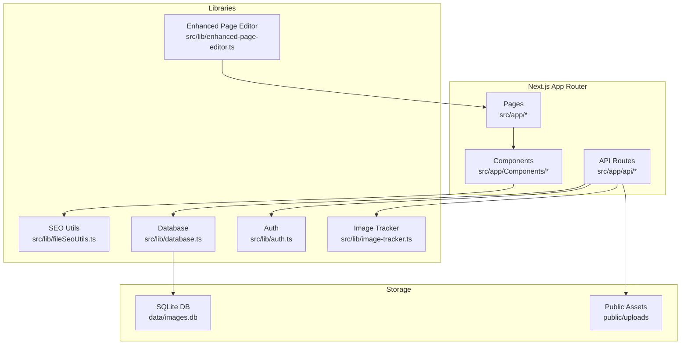
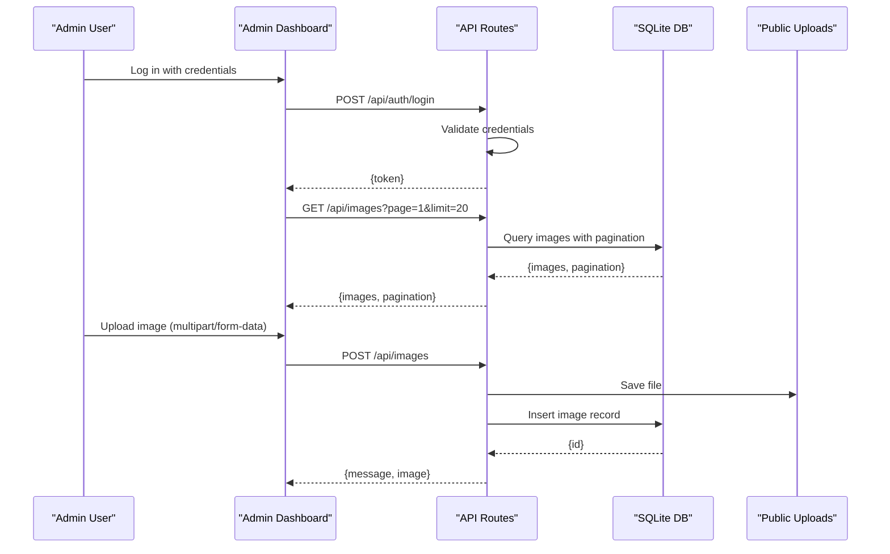
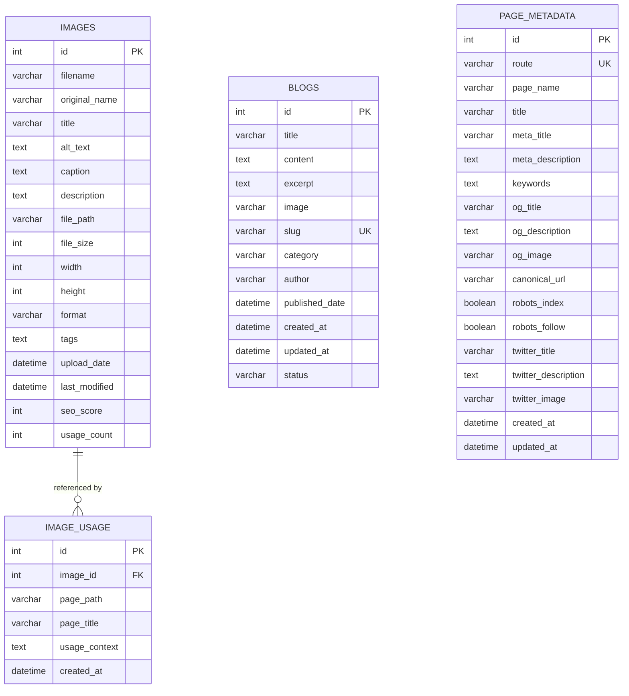
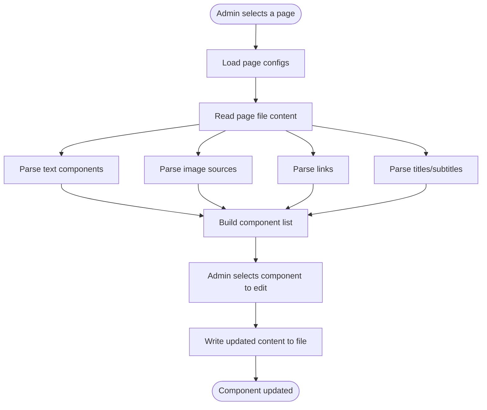
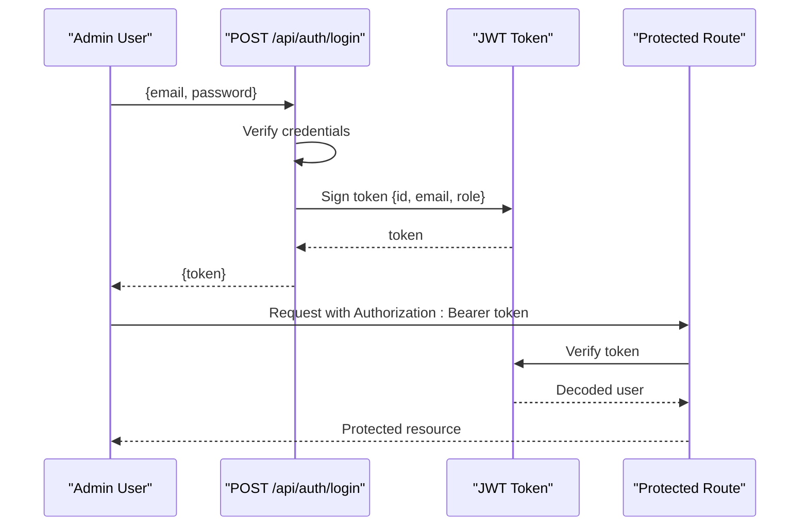
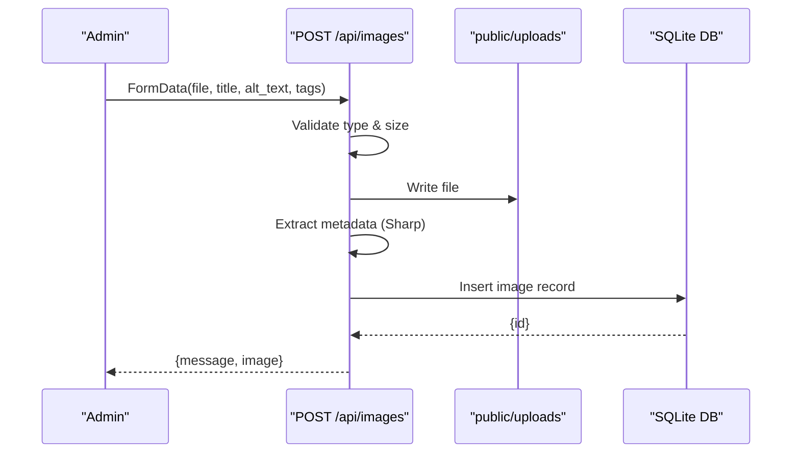
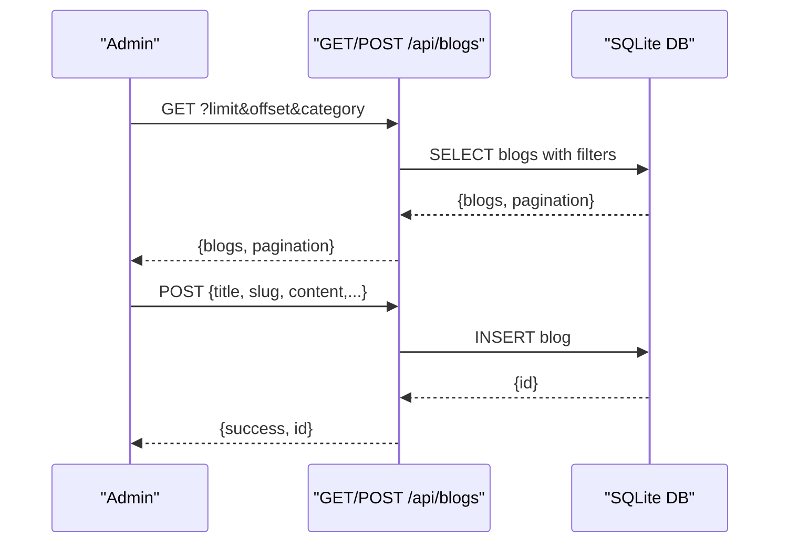
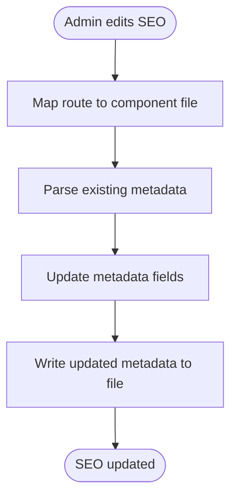
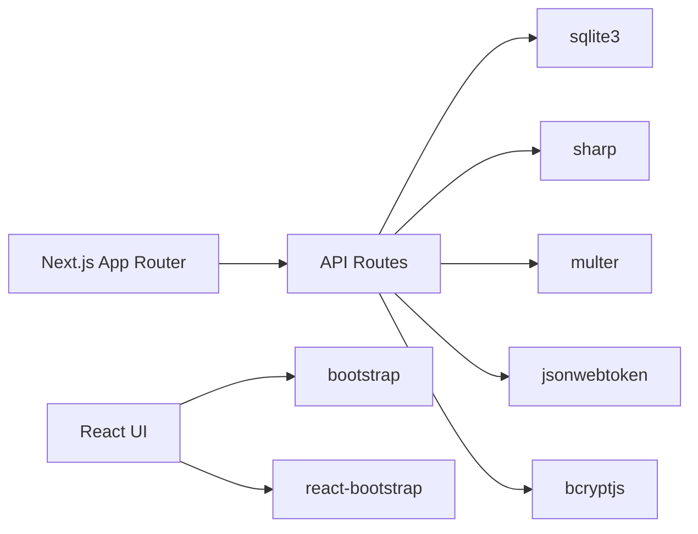

# Core Features

<cite>
**Referenced Files in This Document**
- [README.md](file://README.md)
- [package.json](file://package.json)
- [src/lib/database.ts](file://src/lib/database.ts)
- [src/lib/enhanced-page-editor.ts](file://src/lib/enhanced-page-editor.ts)
- [src/lib/auth.ts](file://src/lib/auth.ts)
- [src/lib/image-tracker.ts](file://src/lib/image-tracker.ts)
- [src/lib/fileSeoUtils.ts](file://src/lib/fileSeoUtils.ts)
- [src/app/api/blogs/route.ts](file://src/app/api/blogs/route.ts)
- [src/app/api/images/route.ts](file://src/app/api/images/route.ts)
- [src/app/api/pages/route.ts](file://src/app/api/pages/route.ts)
</cite>

## Table of Contents
1. [Introduction](#introduction)
2. [Project Structure](#project-structure)
3. [Core Components](#core-components)
4. [Architecture Overview](#architecture-overview)
5. [Detailed Component Analysis](#detailed-component-analysis)
6. [Dependency Analysis](#dependency-analysis)
7. [Performance Considerations](#performance-considerations)
8. [Troubleshooting Guide](#troubleshooting-guide)
9. [Conclusion](#conclusion)

## Introduction
This document explains the core features of attechglobal.com, focusing on the responsive marketing website built with Next.js App Router, the admin dashboard with real-time content editing, the comprehensive blog management system, the optimized image gallery, and the SEO management tools. It documents the component-based architecture, the enhanced page editor for non-technical users, and the SQLite-based content storage system. Both conceptual overviews for stakeholders and technical implementation details for developers are included, with practical examples and diagrams illustrating feature relationships and user workflows.

## Project Structure
The project follows a Next.js App Router structure with:
- Application routes under src/app organized by feature and page groups
- Shared UI components under src/app/Components organized by domain (e.g., Header, Footer, Services)
- API routes under src/app/api for backend operations (blogs, images, pages)
- Libraries under src/lib encapsulating database, authentication, SEO, and utilities
- Static assets under public and src/app/assets

Key highlights:
- Next.js 15 with TypeScript
- SQLite via sqlite3 for content persistence
- Sharp for image metadata extraction
- Bootstrap and React Bootstrap for UI primitives
- Multer for multipart form handling

**Diagram sources**
- [src/app/api/blogs/route.ts](file://src/app/api/blogs/route.ts#L1-L107)
- [src/app/api/images/route.ts](file://src/app/api/images/route.ts#L1-L182)
- [src/app/api/pages/route.ts](file://src/app/api/pages/route.ts#L1-L110)
- [src/lib/database.ts](file://src/lib/database.ts#L1-L255)
- [src/lib/enhanced-page-editor.ts](file://src/lib/enhanced-page-editor.ts#L1-L287)
- [src/lib/fileSeoUtils.ts](file://src/lib/fileSeoUtils.ts#L1-L315)
- [src/lib/image-tracker.ts](file://src/lib/image-tracker.ts#L1-L95)

**Section sources**
- [README.md](file://README.md#L1-L37)
- [package.json](file://package.json#L1-L41)

## Core Components
- SQLite-backed content store: Stores images, blogs, and page metadata with helper functions for initialization, migrations, and queries.
- Enhanced Page Editor: Scans page files to extract editable components and supports non-technical updates via the admin UI.
- Admin Authentication: JWT-based login for admin users with role checks.
- Image Gallery: Uploads, metadata extraction, and usage tracking with SEO scoring.
- Blog Management: CRUD APIs for posts with pagination and filtering.
- SEO Management: Utilities to parse and update Next.js metadata blocks in component files and maintain canonical URLs and social previews.

**Section sources**
- [src/lib/database.ts](file://src/lib/database.ts#L1-L255)
- [src/lib/enhanced-page-editor.ts](file://src/lib/enhanced-page-editor.ts#L1-L287)
- [src/lib/auth.ts](file://src/lib/auth.ts#L1-L85)
- [src/lib/image-tracker.ts](file://src/lib/image-tracker.ts#L1-L95)
- [src/lib/fileSeoUtils.ts](file://src/lib/fileSeoUtils.ts#L1-L315)
- [src/app/api/blogs/route.ts](file://src/app/api/blogs/route.ts#L1-L107)
- [src/app/api/images/route.ts](file://src/app/api/images/route.ts#L1-L182)
- [src/app/api/pages/route.ts](file://src/app/api/pages/route.ts#L1-L110)

## Architecture Overview
The system integrates a frontend built with Next.js App Router and a small set of server-side API routes. Data is persisted in a local SQLite database, while media assets are stored in the public directory. Admin workflows rely on JWT tokens and the enhanced page editor to enable non-technical content updates.

**Diagram sources**
- [src/app/api/images/route.ts](file://src/app/api/images/route.ts#L1-L182)
- [src/lib/database.ts](file://src/lib/database.ts#L1-L255)
- [src/lib/auth.ts](file://src/lib/auth.ts#L1-L85)

## Detailed Component Analysis

### SQLite Content Storage System
The storage layer defines three primary tables:
- images: stores file metadata, dimensions, SEO score, and usage counters
- image_usage: tracks where images are used across pages
- blogs: stores blog posts with slugs, categories, authors, and statuses
- page_metadata: stores Next.js metadata per route for SEO

Key capabilities:
- Initialization and table creation on first use
- CRUD helpers for run, get, and all queries
- Safe promise-based wrappers around sqlite3

**Diagram sources**
- [src/lib/database.ts](file://src/lib/database.ts#L18-L81)

**Section sources**
- [src/lib/database.ts](file://src/lib/database.ts#L1-L255)

### Enhanced Page Editor (Non-Technical Content Editing)
The enhanced page editor scans page files to identify editable components (text, images, links, titles) and supports targeted updates. It maintains a registry of editable pages and parses JSX-like content to extract components with positions and contexts.

**Diagram sources**
- [src/lib/enhanced-page-editor.ts](file://src/lib/enhanced-page-editor.ts#L1-L287)

**Section sources**
- [src/lib/enhanced-page-editor.ts](file://src/lib/enhanced-page-editor.ts#L1-L287)

### Admin Authentication and Authorization
Authentication uses JWT with bcrypt for password hashing. The system supports role-based access (super_admin/admin) and exposes a login endpoint.

**Diagram sources**
- [src/lib/auth.ts](file://src/lib/auth.ts#L1-L85)
- [src/app/api/pages/route.ts](file://src/app/api/pages/route.ts#L80-L109)

**Section sources**
- [src/lib/auth.ts](file://src/lib/auth.ts#L1-L85)

### Image Gallery and Optimization
The image gallery supports:
- Upload via multipart/form-data with type and size validation
- Metadata extraction using Sharp for non-SVG images
- SEO scoring based on provided fields
- Pagination and filtering
- Usage tracking across pages

**Diagram sources**
- [src/app/api/images/route.ts](file://src/app/api/images/route.ts#L77-L182)
- [src/lib/database.ts](file://src/lib/database.ts#L100-L184)

**Section sources**
- [src/app/api/images/route.ts](file://src/app/api/images/route.ts#L1-L182)
- [src/lib/image-tracker.ts](file://src/lib/image-tracker.ts#L1-L95)

### Blog Management System
The blog API provides:
- Listing with pagination and category filtering
- Creation with validation and conflict detection
- Status management (default published)

**Diagram sources**
- [src/app/api/blogs/route.ts](file://src/app/api/blogs/route.ts#L14-L107)
- [src/lib/database.ts](file://src/lib/database.ts#L141-L157)

**Section sources**
- [src/app/api/blogs/route.ts](file://src/app/api/blogs/route.ts#L1-L107)

### SEO Management Tools
SEO utilities:
- Map routes to component files and vice versa
- Parse and update Next.js metadata blocks (title, description, keywords, openGraph, twitter, robots)
- Generate Next.js metadata objects for rendering

**Diagram sources**
- [src/lib/fileSeoUtils.ts](file://src/lib/fileSeoUtils.ts#L1-L315)

**Section sources**
- [src/lib/fileSeoUtils.ts](file://src/lib/fileSeoUtils.ts#L1-L315)

## Dependency Analysis
External dependencies relevant to core features:
- sqlite3: SQLite driver for Node.js
- sharp: Image metadata extraction
- multer: Multipart form handling for uploads
- bcryptjs, jsonwebtoken: Authentication
- bootstrap, react-bootstrap: UI components

**Diagram sources**
- [package.json](file://package.json#L12-L30)

**Section sources**
- [package.json](file://package.json#L1-L41)

## Performance Considerations
- Image processing: Offload heavy transformations to Sharp; consider CDN caching for uploaded assets.
- Database queries: Use indexed columns (e.g., slug) and limit/sort parameters to reduce overhead.
- Pagination: Always apply limit/offset for lists (blogs, images).
- Static generation: Prefer static generation for content-heavy pages; use ISR/SSG where feasible.
- Asset optimization: Serve modern formats (AVIF/WebP) and lazy-load images.

## Troubleshooting Guide
Common issues and resolutions:
- Database not initialized: Ensure initDatabase is called before queries; check data directory permissions.
- Upload errors: Validate file types and sizes; confirm public/uploads exists and is writable.
- JWT verification failures: Confirm secret matches environment; check token expiration.
- Page editor not detecting components: Verify page file paths and JSX patterns; ensure server-side execution for file reads.

**Section sources**
- [src/lib/database.ts](file://src/lib/database.ts#L84-L97)
- [src/app/api/images/route.ts](file://src/app/api/images/route.ts#L94-L103)
- [src/lib/auth.ts](file://src/lib/auth.ts#L48-L59)
- [src/lib/enhanced-page-editor.ts](file://src/lib/enhanced-page-editor.ts#L50-L76)

## Conclusion
The attechglobal.com platform combines a Next.js frontend with a compact but capable backend powered by SQLite. The enhanced page editor enables non-technical users to manage content, while the admin dashboard streamlines blog and image workflows. SEO utilities integrate tightly with Next.js metadata, and the image gallery provides optimization and usage tracking. Together, these features deliver a flexible, maintainable, and SEO-friendly marketing website.