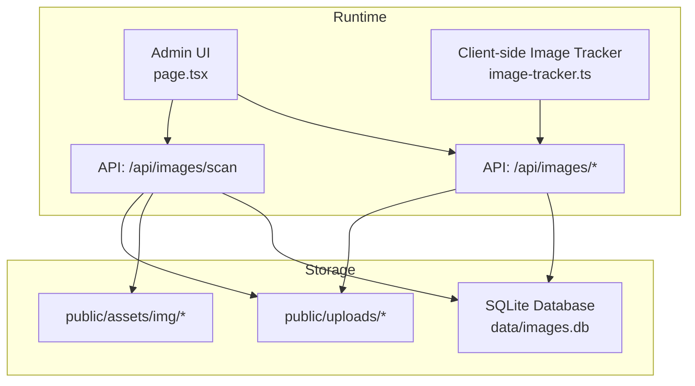
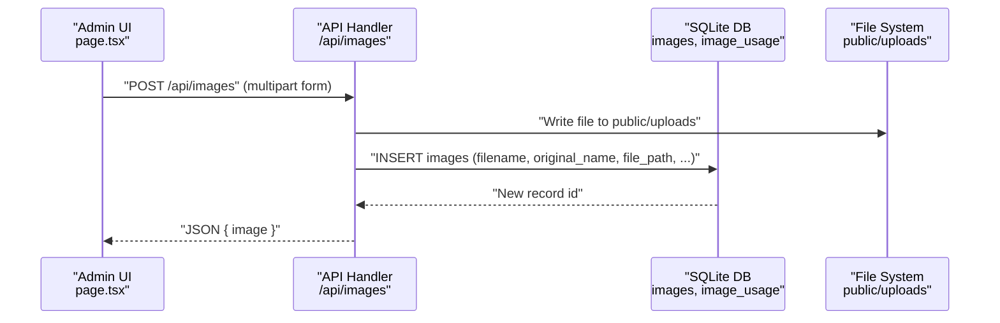
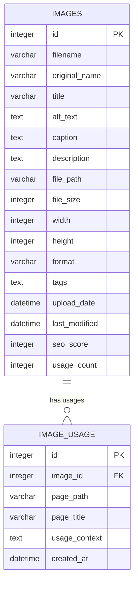
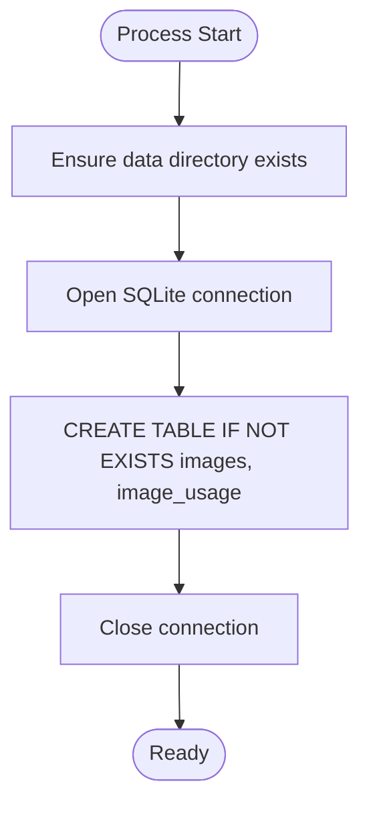
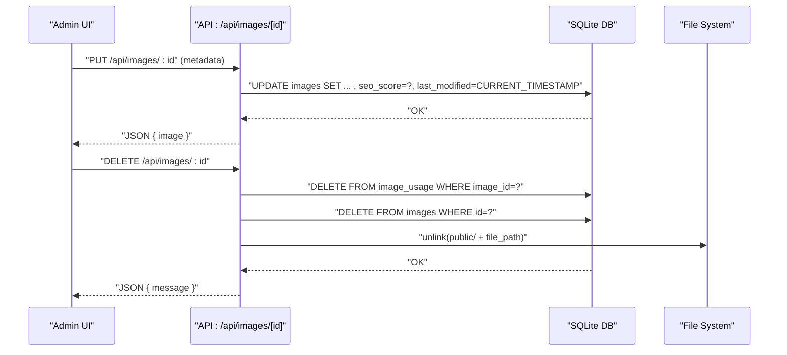
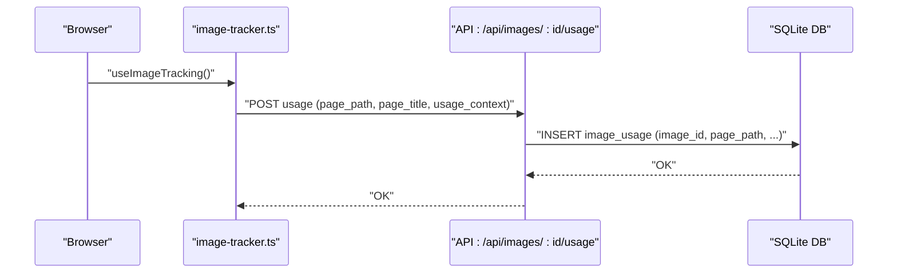
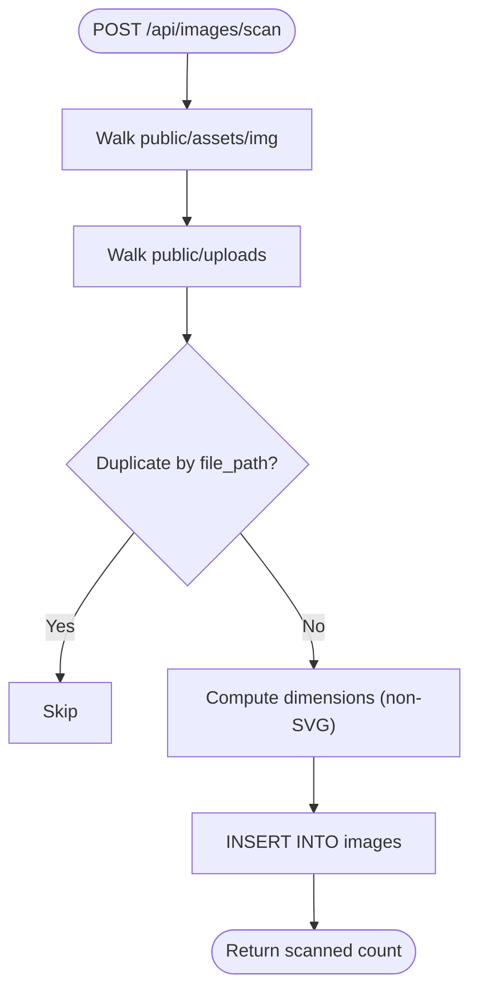
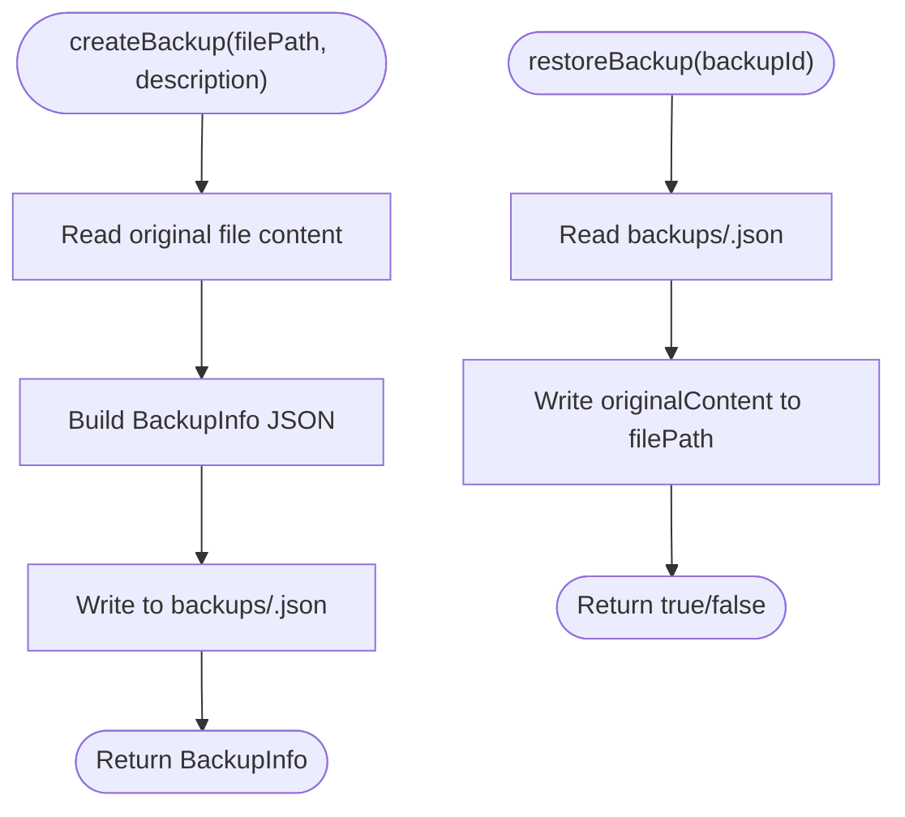
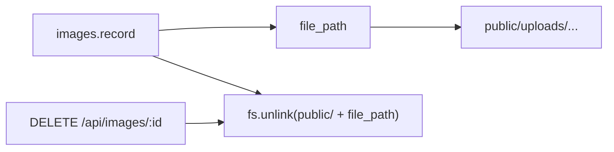
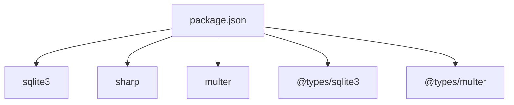

# Database Schema and Storage

<cite>
**Referenced Files in This Document**
- [scripts/init-database.js](file://scripts/init-database.js)
- [src/lib/database.ts](file://src/lib/database.ts)
- [src/app/api/images/route.ts](file://src/app/api/images/route.ts)
- [src/app/api/images/[id]/route.ts](file://src/app/api/images/[id]/route.ts)
- [src/app/api/images/scan/route.ts](file://src/app/api/images/scan/route.ts)
- [src/lib/image-tracker.ts](file://src/lib/image-tracker.ts)
- [src/lib/backup-system.ts](file://src/lib/backup-system.ts)
- [src/app/admin/images/page.tsx](file://src/app/admin/images/page.tsx)
- [IMAGE_MANAGEMENT_SETUP.md](file://IMAGE_MANAGEMENT_SETUP.md)
- [package.json](file://package.json)
</cite>

## Table of Contents
1. [Introduction](#introduction)
2. [Project Structure](#project-structure)
3. [Core Components](#core-components)
4. [Architecture Overview](#architecture-overview)
5. [Detailed Component Analysis](#detailed-component-analysis)
6. [Dependency Analysis](#dependency-analysis)
7. [Performance Considerations](#performance-considerations)
8. [Troubleshooting Guide](#troubleshooting-guide)
9. [Conclusion](#conclusion)
10. [Appendices](#appendices)

## Introduction
This document describes the media database schema and storage management system used by the project. It covers the SQLite database structure for image metadata, table relationships, indexing strategies, initialization and migration patterns, and the lifecycle of image records including creation, updates, and cleanup. It also documents backup and restore mechanisms, integration between database operations and file system management, and practical guidance for queries, performance tuning, and maintenance.

## Project Structure
The media management system centers around:
- A SQLite database located at data/images.db
- An images table storing metadata and file references
- An image_usage table for tracking page-level usage of images
- API endpoints for CRUD operations, scanning, and usage tracking
- Client-side components for administration and usage scanning
- A backup system for protecting critical configuration-like artifacts

**Diagram sources**
- [src/app/admin/images/page.tsx](file://src/app/admin/images/page.tsx#L1-L480)
- [src/app/api/images/route.ts](file://src/app/api/images/route.ts#L1-L182)
- [src/app/api/images/scan/route.ts](file://src/app/api/images/scan/route.ts#L1-L124)
- [src/lib/image-tracker.ts](file://src/lib/image-tracker.ts#L1-L95)
- [src/lib/database.ts](file://src/lib/database.ts#L1-L255)

**Section sources**
- [src/lib/database.ts](file://src/lib/database.ts#L1-L255)
- [src/app/api/images/route.ts](file://src/app/api/images/route.ts#L1-L182)
- [src/app/api/images/scan/route.ts](file://src/app/api/images/scan/route.ts#L1-L124)
- [src/app/admin/images/page.tsx](file://src/app/admin/images/page.tsx#L1-L480)
- [src/lib/image-tracker.ts](file://src/lib/image-tracker.ts#L1-L95)

## Core Components
- Database initialization and schema creation
- Image record lifecycle (create, update, delete)
- Usage tracking across pages
- Scanning existing assets and uploads
- Backup system for configuration-like artifacts

Key implementation references:
- Initialization and schema creation: [src/lib/database.ts](file://src/lib/database.ts#L84-L184), [scripts/init-database.js](file://scripts/init-database.js#L14-L92)
- Image API endpoints: [src/app/api/images/route.ts](file://src/app/api/images/route.ts#L16-L182), [src/app/api/images/[id]/route.ts](file://src/app/api/images/[id]/route.ts#L16-L158)
- Scanning endpoint: [src/app/api/images/scan/route.ts](file://src/app/api/images/scan/route.ts#L16-L124)
- Usage tracking: [src/lib/image-tracker.ts](file://src/lib/image-tracker.ts#L11-L43)
- Admin UI: [src/app/admin/images/page.tsx](file://src/app/admin/images/page.tsx#L55-L165)

**Section sources**
- [src/lib/database.ts](file://src/lib/database.ts#L84-L184)
- [scripts/init-database.js](file://scripts/init-database.js#L14-L92)
- [src/app/api/images/route.ts](file://src/app/api/images/route.ts#L16-L182)
- [src/app/api/images/[id]/route.ts](file://src/app/api/images/[id]/route.ts#L16-L158)
- [src/app/api/images/scan/route.ts](file://src/app/api/images/scan/route.ts#L16-L124)
- [src/lib/image-tracker.ts](file://src/lib/image-tracker.ts#L11-L43)
- [src/app/admin/images/page.tsx](file://src/app/admin/images/page.tsx#L55-L165)

## Architecture Overview
The system integrates a Next.js API with a SQLite backend and a file system for image storage. The images table stores metadata and a relative file_path pointing to public/uploads or public/assets/img. The image_usage table maintains page-level references to images. The admin UI drives operations via API endpoints, and a client-side tracker can submit usage events.

**Diagram sources**
- [src/app/admin/images/page.tsx](file://src/app/admin/images/page.tsx#L147-L165)
- [src/app/api/images/route.ts](file://src/app/api/images/route.ts#L77-L182)
- [src/lib/database.ts](file://src/lib/database.ts#L106-L126)

**Section sources**
- [src/app/api/images/route.ts](file://src/app/api/images/route.ts#L77-L182)
- [src/lib/database.ts](file://src/lib/database.ts#L106-L126)

## Detailed Component Analysis

### Database Schema and Relationships
- images table
  - Primary key: id
  - Columns include filename, original_name, title, alt_text, caption, description, file_path, file_size, width, height, format, tags, upload_date, last_modified, seo_score, usage_count
- image_usage table
  - Primary key: id
  - Foreign key: image_id references images(id)
  - Columns include page_path, page_title, usage_context, created_at

Indexing and constraints:
- No explicit indexes are defined in the schema creation code.
- image_usage.image_id is constrained via a foreign key to images.id.

**Diagram sources**
- [src/lib/database.ts](file://src/lib/database.ts#L106-L139)
- [scripts/init-database.js](file://scripts/init-database.js#L54-L86)

**Section sources**
- [src/lib/database.ts](file://src/lib/database.ts#L106-L139)
- [scripts/init-database.js](file://scripts/init-database.js#L54-L86)

### Database Initialization and Migration Patterns
- Initialization script creates the data directory and tables if they do not exist.
- Runtime initialization ensures the database is ready for API requests.
- Migration pattern: new CREATE TABLE IF NOT EXISTS statements can be added to evolve the schema without breaking existing deployments.

**Diagram sources**
- [scripts/init-database.js](file://scripts/init-database.js#L8-L37)
- [src/lib/database.ts](file://src/lib/database.ts#L84-L97)

**Section sources**
- [scripts/init-database.js](file://scripts/init-database.js#L8-L37)
- [src/lib/database.ts](file://src/lib/database.ts#L84-L97)

### Image Record Lifecycle
- Creation
  - Upload endpoint validates type and size, writes file to public/uploads, computes dimensions for non-SVG, calculates an SEO score, and inserts a record into images.
- Update
  - Update endpoint recalculates SEO score and updates metadata, preserving last_modified.
- Deletion
  - Delete endpoint removes usage records, deletes the image record, and removes the physical file from public/.

**Diagram sources**
- [src/app/api/images/[id]/route.ts](file://src/app/api/images/[id]/route.ts#L55-L158)
- [src/app/api/images/route.ts](file://src/app/api/images/route.ts#L77-L182)

**Section sources**
- [src/app/api/images/[id]/route.ts](file://src/app/api/images/[id]/route.ts#L55-L158)
- [src/app/api/images/route.ts](file://src/app/api/images/route.ts#L77-L182)

### Usage Tracking Across Pages
- Client-side tracker scans DOM for images and posts usage events to the backend.
- Backend stores page_path, page_title, and usage_context linked to the image via image_id.

**Diagram sources**
- [src/lib/image-tracker.ts](file://src/lib/image-tracker.ts#L11-L43)
- [src/app/api/images/[id]/route.ts](file://src/app/api/images/[id]/route.ts#L16-L53)

**Section sources**
- [src/lib/image-tracker.ts](file://src/lib/image-tracker.ts#L11-L43)
- [src/app/api/images/[id]/route.ts](file://src/app/api/images/[id]/route.ts#L16-L53)

### Scanning Existing Assets and Uploads
- The scan endpoint traverses public/assets/img and public/uploads, skipping duplicates by file_path, computing dimensions for non-SVG, and inserting records into images.

**Diagram sources**
- [src/app/api/images/scan/route.ts](file://src/app/api/images/scan/route.ts#L27-L118)

**Section sources**
- [src/app/api/images/scan/route.ts](file://src/app/api/images/scan/route.ts#L27-L118)

### Backup and Restore Mechanisms
- The backup system persists JSON snapshots of files to a backups directory, including filePath, timestamp, and originalContent.
- Restore writes the stored content back to the original file path.
- The system is designed for server-side environments; client-side invocations return placeholder data.

**Diagram sources**
- [src/lib/backup-system.ts](file://src/lib/backup-system.ts#L33-L82)

**Section sources**
- [src/lib/backup-system.ts](file://src/lib/backup-system.ts#L33-L82)

### Integration Between Database and File System
- The images table stores file_path as a relative path under public/.
- On deletion, the system removes the physical file to maintain consistency.
- On upload, the system writes to public/uploads and sets file_path accordingly.

**Diagram sources**
- [src/app/api/images/route.ts](file://src/app/api/images/route.ts#L116-L122)
- [src/app/api/images/[id]/route.ts](file://src/app/api/images/[id]/route.ts#L144-L148)

**Section sources**
- [src/app/api/images/route.ts](file://src/app/api/images/route.ts#L116-L122)
- [src/app/api/images/[id]/route.ts](file://src/app/api/images/[id]/route.ts#L144-L148)

## Dependency Analysis
External dependencies relevant to storage and media:
- sqlite3: SQLite driver for database operations
- sharp: Image metadata extraction (dimensions)
- multer: Form data handling for uploads
- @types dependencies for TypeScript support

**Diagram sources**
- [package.json](file://package.json#L12-L31)

**Section sources**
- [package.json](file://package.json#L12-L31)

## Performance Considerations
- Indexing: Consider adding indexes on frequently queried columns such as images.filename, images.original_name, images.upload_date, and image_usage.page_path for improved query performance.
- Query patterns: The usage_count is computed per request by counting image_usage entries; consider caching or denormalizing usage_count in images for frequent reads.
- Scanning: Directory traversal during scan can be expensive; consider batching inserts and limiting concurrency.
- File I/O: Writing to public/uploads and unlinking files occurs synchronously; consider asynchronous operations for better responsiveness.
- SEO scoring: Recalculation is performed on updates; keep metadata fields concise to minimize overhead.

[No sources needed since this section provides general guidance]

## Troubleshooting Guide
Common issues and remedies:
- Database not found or uninitialized
  - Run the initialization script to create the database and tables.
  - Ensure the data directory exists and is writable.
- Upload failures
  - Verify allowed MIME types and size limits.
  - Confirm public/uploads directory is writable.
- Images not loading
  - Check file_path correctness and file existence under public/.
- Usage tracking not recorded
  - Ensure the client-side tracker runs after images are loaded.
  - Confirm API availability and network connectivity.
- Cleanup and orphan files
  - Use the delete endpoint to remove records and associated files.
  - Manually verify and remove any orphaned files if necessary.

**Section sources**
- [scripts/init-database.js](file://scripts/init-database.js#L8-L37)
- [src/app/api/images/route.ts](file://src/app/api/images/route.ts#L94-L103)
- [src/app/api/images/[id]/route.ts](file://src/app/api/images/[id]/route.ts#L144-L148)
- [src/lib/image-tracker.ts](file://src/lib/image-tracker.ts#L11-L43)

## Conclusion
The media database schema provides a compact yet effective model for managing image metadata and usage tracking with SQLite. The API endpoints and admin UI enable efficient upload, scanning, editing, and deletion workflows. Integrating database operations with file system management ensures consistency between metadata and actual files. With targeted indexing and operational safeguards, the system can scale to meet growing media needs.

[No sources needed since this section summarizes without analyzing specific files]

## Appendices

### Example Queries for Common Operations
- List images with pagination and filtering
  - Reference: [src/app/api/images/route.ts](file://src/app/api/images/route.ts#L16-L75)
- Insert a new image record
  - Reference: [src/app/api/images/route.ts](file://src/app/api/images/route.ts#L147-L168)
- Update image metadata and recalculate SEO score
  - Reference: [src/app/api/images/[id]/route.ts](file://src/app/api/images/[id]/route.ts#L86-L102)
- Delete an image and its usage records
  - Reference: [src/app/api/images/[id]/route.ts](file://src/app/api/images/[id]/route.ts#L138-L148)
- Scan existing images and populate database
  - Reference: [src/app/api/images/scan/route.ts](file://src/app/api/images/scan/route.ts#L27-L118)

### Maintenance Procedures
- Periodic cleanup
  - Remove unused images and their files using the delete endpoint.
  - Audit image_usage to identify orphaned records.
- Backup strategy
  - Use the backup system to snapshot critical configuration-like files.
  - Schedule regular backups of the SQLite database file.
- Monitoring
  - Monitor disk usage in public/uploads and public/assets/img.
  - Track database size and query performance.

**Section sources**
- [src/app/api/images/[id]/route.ts](file://src/app/api/images/[id]/route.ts#L138-L148)
- [src/lib/backup-system.ts](file://src/lib/backup-system.ts#L33-L82)