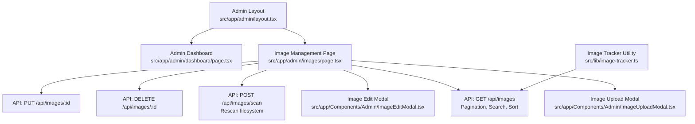
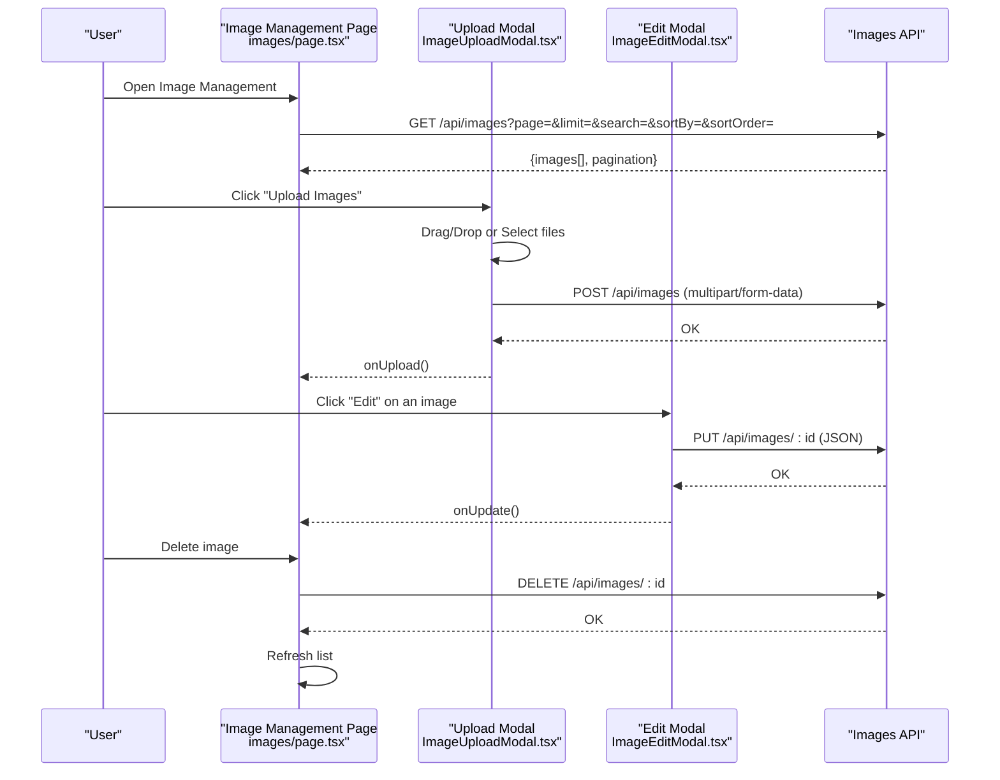
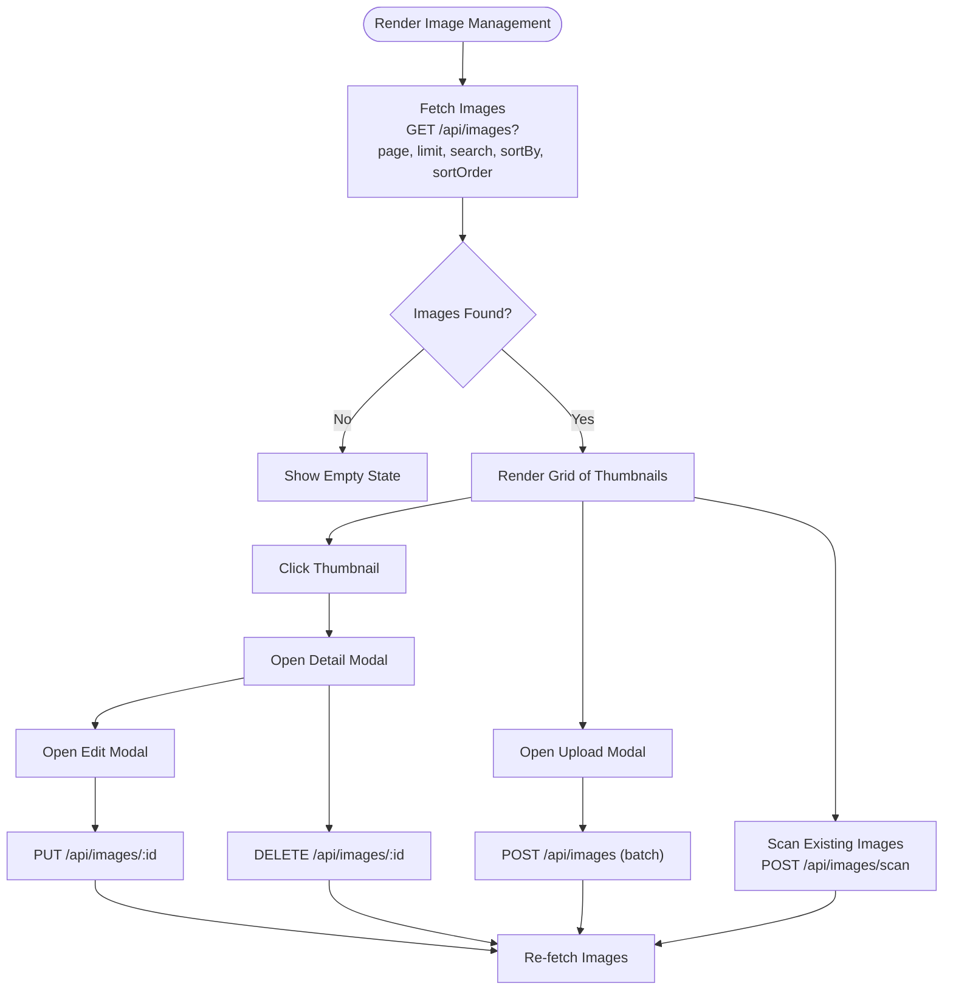
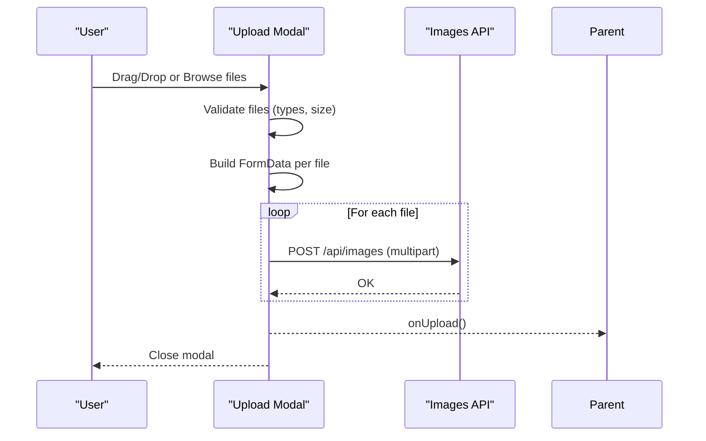
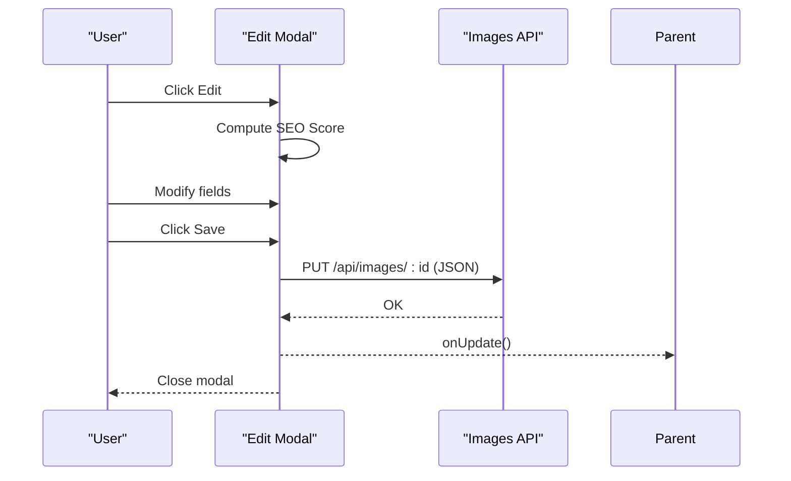
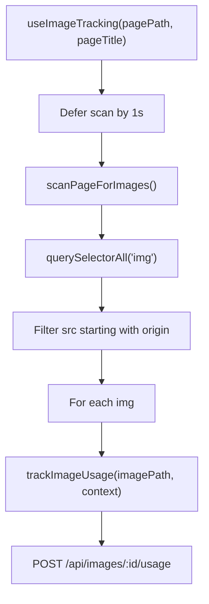
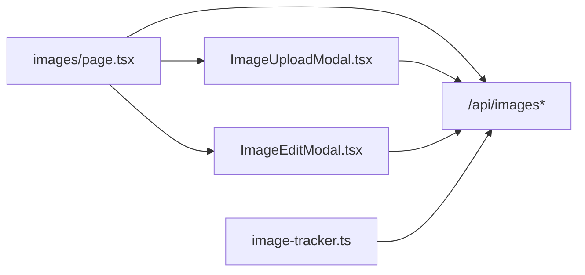

# Gallery Management

<cite>
**Referenced Files in This Document**
- [src/app/admin/layout.tsx](file://src/app/admin/layout.tsx)
- [src/app/admin/dashboard/page.tsx](file://src/app/admin/dashboard/page.tsx)
- [src/app/admin/images/page.tsx](file://src/app/admin/images/page.tsx)
- [src/app/Components/Admin/ImageUploadModal.tsx](file://src/app/Components/Admin/ImageUploadModal.tsx)
- [src/app/Components/Admin/ImageEditModal.tsx](file://src/app/Components/Admin/ImageEditModal.tsx)
- [src/lib/image-tracker.ts](file://src/lib/image-tracker.ts)
</cite>

## Table of Contents
1. [Introduction](#introduction)
2. [Project Structure](#project-structure)
3. [Core Components](#core-components)
4. [Architecture Overview](#architecture-overview)
5. [Detailed Component Analysis](#detailed-component-analysis)
6. [Dependency Analysis](#dependency-analysis)
7. [Performance Considerations](#performance-considerations)
8. [Troubleshooting Guide](#troubleshooting-guide)
9. [Conclusion](#conclusion)
10. [Appendices](#appendices)

## Introduction
This document describes the gallery management interface and functionality for the admin dashboard. It covers the administrative workflows for uploading, organizing, editing, and managing images, including bulk upload operations via drag-and-drop, modal-based editing, and search/sorting/pagination. It also documents the tagging and categorization mechanisms, SEO scoring, and the gallery API surface used by the frontend. Guidance is included for integrating the gallery into content management workflows, along with troubleshooting tips for upload failures, permissions, and performance optimization for large galleries.

## Project Structure
The gallery management feature is implemented as a client-side Next.js application with a dedicated admin area. The admin layout composes the header and sidebar, while the image management page orchestrates data fetching, search, sorting, pagination, and modals for upload and editing. Supporting utilities provide image usage tracking across pages.

**Diagram sources**
- [src/app/admin/layout.tsx](file://src/app/admin/layout.tsx#L1-L23)
- [src/app/admin/dashboard/page.tsx](file://src/app/admin/dashboard/page.tsx#L1-L197)
- [src/app/admin/images/page.tsx](file://src/app/admin/images/page.tsx#L1-L480)
- [src/app/Components/Admin/ImageUploadModal.tsx](file://src/app/Components/Admin/ImageUploadModal.tsx#L1-L203)
- [src/app/Components/Admin/ImageEditModal.tsx](file://src/app/Components/Admin/ImageEditModal.tsx#L1-L300)
- [src/lib/image-tracker.ts](file://src/lib/image-tracker.ts#L1-L95)

**Section sources**
- [src/app/admin/layout.tsx](file://src/app/admin/layout.tsx#L1-L23)
- [src/app/admin/dashboard/page.tsx](file://src/app/admin/dashboard/page.tsx#L1-L197)
- [src/app/admin/images/page.tsx](file://src/app/admin/images/page.tsx#L1-L480)
- [src/app/Components/Admin/ImageUploadModal.tsx](file://src/app/Components/Admin/ImageUploadModal.tsx#L1-L203)
- [src/app/Components/Admin/ImageEditModal.tsx](file://src/app/Components/Admin/ImageEditModal.tsx#L1-L300)
- [src/lib/image-tracker.ts](file://src/lib/image-tracker.ts#L1-L95)

## Core Components
- Admin layout: Provides the shell for the admin area with header and sidebar.
- Admin dashboard: Presents summary statistics and quick actions.
- Image management page: Central hub for listing, searching, sorting, paginating, and operating on images.
- Image upload modal: Handles drag-and-drop and file selection, validates file types and sizes, and performs batch uploads.
- Image edit modal: Edits metadata (title, alt text, caption, description, tags), computes an SEO score, and persists changes.
- Image tracker utility: Scans pages for images and records usage contexts against the image catalog.

Key implementation specifics:
- Bulk upload: Iterates through selected files and posts each to the images endpoint.
- Drag-and-drop: Tracks drag events to toggle visual feedback and extracts files on drop.
- Search and filters: Builds query parameters for page, limit, search term, sort field, and order.
- Pagination: Manages current page and total pages, with navigation controls.
- Tagging and categorization: Uses a comma-separated tags field for categorization.
- SEO scoring: Computes a synthetic score based on presence of title, alt text, caption, description, and tags.
- Preview system: Displays thumbnails and full-size previews in modals.

**Section sources**
- [src/app/admin/layout.tsx](file://src/app/admin/layout.tsx#L1-L23)
- [src/app/admin/dashboard/page.tsx](file://src/app/admin/dashboard/page.tsx#L1-L197)
- [src/app/admin/images/page.tsx](file://src/app/admin/images/page.tsx#L1-L480)
- [src/app/Components/Admin/ImageUploadModal.tsx](file://src/app/Components/Admin/ImageUploadModal.tsx#L1-L203)
- [src/app/Components/Admin/ImageEditModal.tsx](file://src/app/Components/Admin/ImageEditModal.tsx#L1-L300)
- [src/lib/image-tracker.ts](file://src/lib/image-tracker.ts#L1-L95)

## Architecture Overview
The gallery management UI is a client-driven interface that communicates with backend APIs for CRUD operations, scanning, and usage tracking. The image management page coordinates state for search, sort, pagination, and modal workflows. Modals encapsulate upload and editing logic, while the image tracker utility integrates with the page rendering lifecycle to monitor image usage.

**Diagram sources**
- [src/app/admin/images/page.tsx](file://src/app/admin/images/page.tsx#L55-L124)
- [src/app/Components/Admin/ImageUploadModal.tsx](file://src/app/Components/Admin/ImageUploadModal.tsx#L52-L85)
- [src/app/Components/Admin/ImageEditModal.tsx](file://src/app/Components/Admin/ImageEditModal.tsx#L53-L79)

## Detailed Component Analysis

### Admin Layout
- Responsibilities: Wraps child routes with header and sidebar, applies base layout classes.
- Integration: Used by admin routes to provide consistent navigation and spacing.

**Section sources**
- [src/app/admin/layout.tsx](file://src/app/admin/layout.tsx#L1-L23)

### Admin Dashboard
- Responsibilities: Renders summary cards and recent activity feed; serves as a landing page for admin tasks.
- Observations: Uses simulated data; in a real system, API calls would populate stats and activities.

**Section sources**
- [src/app/admin/dashboard/page.tsx](file://src/app/admin/dashboard/page.tsx#L1-L197)

### Image Management Page
- Responsibilities:
  - Fetch images with pagination, search, and sorting.
  - Render image grid with thumbnails, SEO badges, and metadata.
  - Open detail/edit/upload modals.
  - Trigger filesystem scan and deletion operations.
- Data model: Defines an Image interface and Pagination shape used across the component.
- Interactions:
  - Search form updates pagination and triggers reload.
  - Sorting dropdowns control query parameters.
  - Pagination controls adjust page number.
  - Clicking an image opens the detail modal; edit/delete actions are handled within modals.

**Diagram sources**
- [src/app/admin/images/page.tsx](file://src/app/admin/images/page.tsx#L55-L165)

**Section sources**
- [src/app/admin/images/page.tsx](file://src/app/admin/images/page.tsx#L1-L480)

### Image Upload Modal
- Capabilities:
  - Drag-and-drop area with visual feedback.
  - File input fallback.
  - Validation: allowed MIME types and size limit per file.
  - Batch upload: iterates through selected files and posts each to the images endpoint.
  - File list display with remove capability.
- UX: Disabled upload button when no files; shows progress state during upload.

**Diagram sources**
- [src/app/Components/Admin/ImageUploadModal.tsx](file://src/app/Components/Admin/ImageUploadModal.tsx#L16-L85)

**Section sources**
- [src/app/Components/Admin/ImageUploadModal.tsx](file://src/app/Components/Admin/ImageUploadModal.tsx#L1-L203)

### Image Edit Modal
- Capabilities:
  - Editable fields: title, alt_text, caption, description, tags.
  - Real-time SEO score computation based on completeness.
  - Alt-text suggestion generator.
  - Persist changes via PUT to the images endpoint.
- UX: Displays image info (size, dimensions, format, usage count) alongside the edit form.

**Diagram sources**
- [src/app/Components/Admin/ImageEditModal.tsx](file://src/app/Components/Admin/ImageEditModal.tsx#L42-L79)

**Section sources**
- [src/app/Components/Admin/ImageEditModal.tsx](file://src/app/Components/Admin/ImageEditModal.tsx#L1-L300)

### Image Tracker Utility
- Capabilities:
  - Scans the DOM for images hosted under the site origin.
  - Tracks usage by posting to a usage endpoint for each found image.
  - Provides a React hook and a component wrapper to automate tracking after initial render.
- Integration: Used to associate images with pages and contexts for reporting.

**Diagram sources**
- [src/lib/image-tracker.ts](file://src/lib/image-tracker.ts#L46-L79)

**Section sources**
- [src/lib/image-tracker.ts](file://src/lib/image-tracker.ts#L1-L95)

## Dependency Analysis
- Component coupling:
  - The image management page depends on the upload and edit modals for user interactions.
  - Modals depend on the images API for persistence.
  - The image tracker utility depends on the images API for usage recording.
- External dependencies:
  - Browser File API for drag-and-drop and FormData for uploads.
  - Next.js runtime for client-side routing and state management.
- Potential circular dependencies:
  - None observed among the analyzed components.

**Diagram sources**
- [src/app/admin/images/page.tsx](file://src/app/admin/images/page.tsx#L1-L480)
- [src/app/Components/Admin/ImageUploadModal.tsx](file://src/app/Components/Admin/ImageUploadModal.tsx#L1-L203)
- [src/app/Components/Admin/ImageEditModal.tsx](file://src/app/Components/Admin/ImageEditModal.tsx#L1-L300)
- [src/lib/image-tracker.ts](file://src/lib/image-tracker.ts#L1-L95)

**Section sources**
- [src/app/admin/images/page.tsx](file://src/app/admin/images/page.tsx#L1-L480)
- [src/app/Components/Admin/ImageUploadModal.tsx](file://src/app/Components/Admin/ImageUploadModal.tsx#L1-L203)
- [src/app/Components/Admin/ImageEditModal.tsx](file://src/app/Components/Admin/ImageEditModal.tsx#L1-L300)
- [src/lib/image-tracker.ts](file://src/lib/image-tracker.ts#L1-L95)

## Performance Considerations
- Batch upload strategy:
  - Current implementation uploads files sequentially. For large batches, consider parallel uploads with concurrency limits to reduce total time while respecting server constraints.
- Pagination and virtualization:
  - With large galleries, implement virtualized lists to render only visible items and improve scroll performance.
- Image previews:
  - Use appropriately sized thumbnails and lazy-loading to minimize initial payload.
- Debounced search:
  - Debounce search input to avoid excessive network requests during rapid typing.
- Asset caching:
  - Ensure CDN and browser caching policies are configured for static assets to reduce bandwidth and latency.
- SEO score computation:
  - Keep the calculation lightweight; avoid unnecessary re-computations by memoizing derived values.

[No sources needed since this section provides general guidance]

## Troubleshooting Guide
- Upload failures:
  - Verify allowed MIME types and file size limits enforced by the upload modal.
  - Confirm network connectivity and CORS settings for the images API endpoints.
  - Check server logs for 4xx/5xx responses during POST /api/images.
- Permission issues:
  - Ensure the admin session has a valid token used for Authorization headers in API calls.
  - Validate that the backend enforces appropriate authentication and authorization for image operations.
- Large gallery performance:
  - Use pagination and virtualized rendering to keep the UI responsive.
  - Optimize thumbnail generation and storage to reduce load times.
- Drag-and-drop not working:
  - Confirm that drag events are not blocked by parent containers and that the drop zone handlers are attached correctly.
- Search and sorting not applied:
  - Ensure query parameters are constructed and passed to the images API endpoint.
- Usage tracking not recorded:
  - Verify that images are served from the same origin and that the usage endpoint exists and is reachable.

**Section sources**
- [src/app/Components/Admin/ImageUploadModal.tsx](file://src/app/Components/Admin/ImageUploadModal.tsx#L21-L27)
- [src/app/admin/images/page.tsx](file://src/app/admin/images/page.tsx#L60-L66)
- [src/lib/image-tracker.ts](file://src/lib/image-tracker.ts#L14-L42)

## Conclusion
The gallery management interface provides a comprehensive admin experience for uploading, organizing, and maintaining images. With drag-and-drop uploads, modal-based editing, robust search and sorting, pagination, and usage tracking, it supports efficient content management workflows. By following the performance and troubleshooting recommendations, teams can maintain a responsive and reliable gallery system at scale.

[No sources needed since this section summarizes without analyzing specific files]

## Appendices

### Gallery Creation Workflow Example
- Navigate to the admin area and open the image management page.
- Click “Upload Images” and select multiple files via drag-and-drop or file picker.
- Review the selected files and confirm upload; the modal reports progress and closes upon completion.
- On successful upload, refresh the list to see new entries with default metadata.
- Open the edit modal to set title, alt text, caption, description, and tags; the SEO score updates automatically.
- Use search and sorting to locate images quickly; apply filters as needed.

**Section sources**
- [src/app/admin/images/page.tsx](file://src/app/admin/images/page.tsx#L176-L188)
- [src/app/Components/Admin/ImageUploadModal.tsx](file://src/app/Components/Admin/ImageUploadModal.tsx#L52-L85)
- [src/app/Components/Admin/ImageEditModal.tsx](file://src/app/Components/Admin/ImageEditModal.tsx#L53-L79)

### Image Organization Strategies
- Use descriptive titles and concise alt texts for accessibility and SEO.
- Apply tags to group images by themes, campaigns, or content types.
- Maintain consistent naming conventions for original filenames to simplify manual identification.
- Regularly scan existing images to reconcile the catalog with the filesystem.

**Section sources**
- [src/app/Components/Admin/ImageEditModal.tsx](file://src/app/Components/Admin/ImageEditModal.tsx#L87-L92)
- [src/app/admin/images/page.tsx](file://src/app/admin/images/page.tsx#L146-L165)

### Integration Patterns with Content Management
- Use the image tracker utility to monitor where images appear across pages for maintenance and audits.
- Leverage the images API for dynamic insertion into page editors and CMS components.
- Coordinate with the page editor quick-start to streamline adding galleries to content.

**Section sources**
- [src/lib/image-tracker.ts](file://src/lib/image-tracker.ts#L46-L79)
- [src/app/admin/dashboard/page.tsx](file://src/app/admin/dashboard/page.tsx#L164-L193)