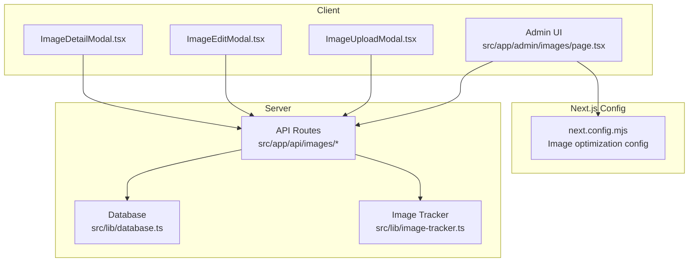
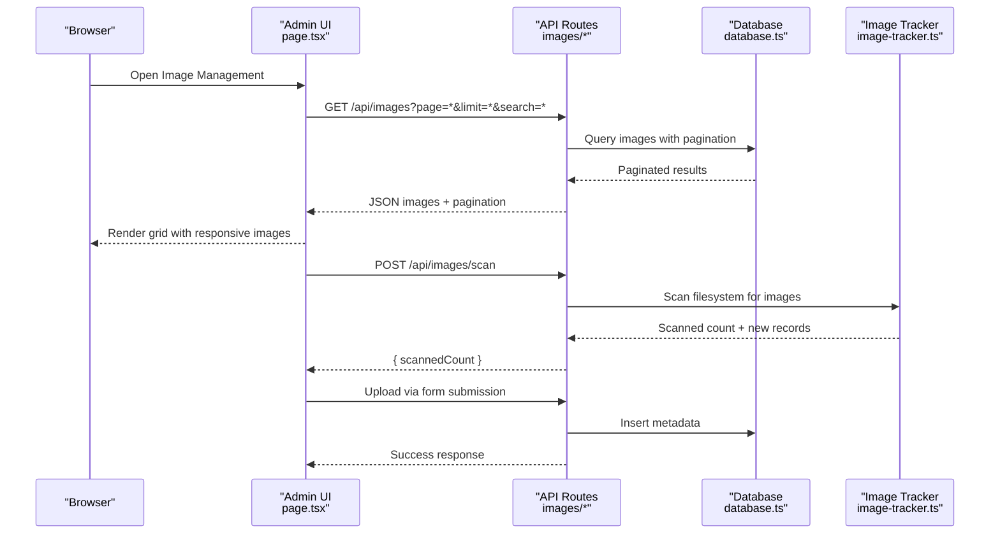
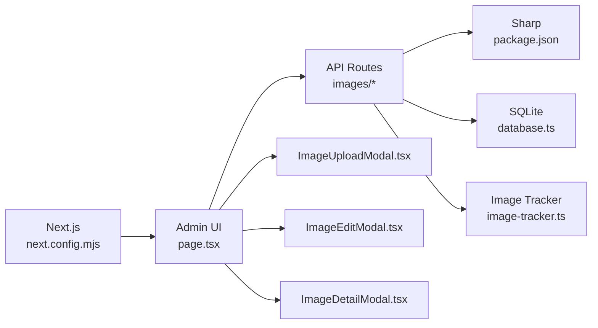

# Image Processing System

<cite>
**Referenced Files in This Document**
- [package.json](file://package.json)
- [next.config.mjs](file://next.config.mjs)
- [src/app/admin/images/page.tsx](file://src/app/admin/images/page.tsx)
- [src/lib/image-tracker.ts](file://src/lib/image-tracker.ts)
- [src/lib/database.ts](file://src/lib/database.ts)
- [src/app/api/images/index.ts](file://src/app/api/images/index.ts)
- [src/app/api/images/scan/route.ts](file://src/app/api/images/scan/route.ts)
- [src/app/api/images/[id]/route.ts](file://src/app/api/images/[id]/route.ts)
- [src/Components/Admin/ImageUploadModal.tsx](file://src/Components/Admin/ImageUploadModal.tsx)
- [src/Components/Admin/ImageEditModal.tsx](file://src/Components/Admin/ImageEditModal.tsx)
- [src/Components/Admin/ImageDetailModal.tsx](file://src/Components/Admin/ImageDetailModal.tsx)
</cite>

## Table of Contents
1. [Introduction](#introduction)
2. [Project Structure](#project-structure)
3. [Core Components](#core-components)
4. [Architecture Overview](#architecture-overview)
5. [Detailed Component Analysis](#detailed-component-analysis)
6. [Dependency Analysis](#dependency-analysis)
7. [Performance Considerations](#performance-considerations)
8. [Troubleshooting Guide](#troubleshooting-guide)
9. [Conclusion](#conclusion)

## Introduction
This document describes the image processing system used by attechglobal.com. The platform leverages Next.js image optimization capabilities and integrates a Sharp-based backend pipeline for advanced image transformations, including resizing, format conversion, and quality optimization. It also documents the complete image upload workflow from client to server, validation, processing, and storage, along with responsive image generation for multiple screen sizes and device pixel ratios. Implementation examples for compression algorithms, progressive JPEG generation, and WebP conversion are included, alongside API endpoint definitions, request/response formats, error handling, performance optimization techniques, memory management, batch operations, and troubleshooting guidance for large-scale media handling.

## Project Structure
The image processing system spans client-side UI components, Next.js configuration, and server-side API routes. Key areas include:
- Client-side administration interface for image management
- Next.js configuration enabling optimized image serving and responsive variants
- Backend API routes for image CRUD operations, scanning, and metadata updates
- Database integration for persistent image records
- Utility modules for image tracking and processing

**Diagram sources**
- [src/app/admin/images/page.tsx](file://src/app/admin/images/page.tsx#L36-L480)
- [next.config.mjs](file://next.config.mjs#L10-L112)
- [src/app/api/images/index.ts](file://src/app/api/images/index.ts)
- [src/app/api/images/scan/route.ts](file://src/app/api/images/scan/route.ts)
- [src/app/api/images/[id]/route.ts](file://src/app/api/images/[id]/route.ts)
- [src/lib/database.ts](file://src/lib/database.ts)
- [src/lib/image-tracker.ts](file://src/lib/image-tracker.ts)

**Section sources**
- [src/app/admin/images/page.tsx](file://src/app/admin/images/page.tsx#L36-L480)
- [next.config.mjs](file://next.config.mjs#L10-L112)

## Core Components
- Next.js Image Optimization: Configured to serve optimized images with automatic format selection (WebP, AVIF), responsive variants, and caching.
- Sharp Integration: Used for advanced transformations such as resizing, format conversion, and quality optimization.
- Admin UI: Provides upload, edit, delete, and scan operations for managing images and metadata.
- API Layer: Exposes endpoints for listing, uploading, updating, deleting, and rescanning images.
- Database: Stores image metadata including filename, dimensions, format, SEO attributes, and usage statistics.
- Image Tracker: Scans the filesystem for existing images and registers them into the database.

Key implementation references:
- Next.js image optimization configuration: [next.config.mjs](file://next.config.mjs#L10-L112)
- Sharp dependency declaration: [package.json](file://package.json#L28-L28)
- Admin image management page: [src/app/admin/images/page.tsx](file://src/app/admin/images/page.tsx#L36-L480)
- Image tracker module: [src/lib/image-tracker.ts](file://src/lib/image-tracker.ts)
- Database module: [src/lib/database.ts](file://src/lib/database.ts)

**Section sources**
- [next.config.mjs](file://next.config.mjs#L10-L112)
- [package.json](file://package.json#L28-L28)
- [src/app/admin/images/page.tsx](file://src/app/admin/images/page.tsx#L36-L480)
- [src/lib/image-tracker.ts](file://src/lib/image-tracker.ts)
- [src/lib/database.ts](file://src/lib/database.ts)

## Architecture Overview
The system follows a client-server model:
- Client requests optimized images via Next.js image optimization.
- Admin actions trigger API endpoints for upload, update, delete, and scan.
- Backend processes images using Sharp and persists metadata to the database.
- Responsive variants are generated based on configured sizes and device pixel ratios.

**Diagram sources**
- [src/app/admin/images/page.tsx](file://src/app/admin/images/page.tsx#L56-L84)
- [src/app/api/images/index.ts](file://src/app/api/images/index.ts)
- [src/app/api/images/scan/route.ts](file://src/app/api/images/scan/route.ts)
- [src/lib/database.ts](file://src/lib/database.ts)
- [src/lib/image-tracker.ts](file://src/lib/image-tracker.ts)

## Detailed Component Analysis

### Next.js Image Optimization Configuration
- Enables WebP and AVIF formats automatically.
- Defines deviceSizes and imageSizes for responsive variants.
- Sets minimumCacheTTL and contentSecurityPolicy for security and performance.
- Unoptimized mode is enabled conditionally for static export builds.

Implementation references:
- Formats and sizes: [next.config.mjs](file://next.config.mjs#L106-L108)
- Domains and remotePatterns: [next.config.mjs](file://next.config.mjs#L13-L105)
- Security and caching: [next.config.mjs](file://next.config.mjs#L109-L112)

**Section sources**
- [next.config.mjs](file://next.config.mjs#L10-L112)

### Admin Image Management UI
- Fetches paginated images with search and sort options.
- Supports scanning existing images, editing metadata, and deleting images.
- Renders responsive thumbnails and displays SEO metrics.

Key UI behaviors:
- Fetch images on pagination/search/sort changes: [src/app/admin/images/page.tsx](file://src/app/admin/images/page.tsx#L56-L84)
- Handle search submission: [src/app/admin/images/page.tsx](file://src/app/admin/images/page.tsx#L87-L91)
- Delete image via API: [src/app/admin/images/page.tsx](file://src/app/admin/images/page.tsx#L106-L124)
- Scan existing images: [src/app/admin/images/page.tsx](file://src/app/admin/images/page.tsx#L147-L165)

**Section sources**
- [src/app/admin/images/page.tsx](file://src/app/admin/images/page.tsx#L56-L165)

### API Endpoints for Image Management
- GET /api/images: List images with pagination, search, and sorting.
- POST /api/images/scan: Scan filesystem and register new images.
- DELETE /api/images/:id: Remove an image and its metadata.

Endpoint definitions and behaviors:
- List images: [src/app/api/images/index.ts](file://src/app/api/images/index.ts)
- Scan images: [src/app/api/images/scan/route.ts](file://src/app/api/images/scan/route.ts)
- Delete image: [src/app/api/images/[id]/route.ts](file://src/app/api/images/[id]/route.ts)

Request/Response formats:
- Request parameters for GET /api/images:
  - page: integer (default 1)
  - limit: integer (default 20)
  - search: string (optional)
  - sortBy: enum(upload_date|filename|file_size|seo_score|usage_count)
  - sortOrder: enum(DESC|ASC)
- Response body:
  - images: array of image objects
  - pagination: { page, limit, total, totalPages }
- Error handling:
  - Returns appropriate HTTP status codes (e.g., 404 for missing resource, 500 for internal errors)
  - Client-side checks for response.ok before parsing JSON

**Section sources**
- [src/app/admin/images/page.tsx](file://src/app/admin/images/page.tsx#L60-L74)
- [src/app/api/images/index.ts](file://src/app/api/images/index.ts)
- [src/app/api/images/scan/route.ts](file://src/app/api/images/scan/route.ts)
- [src/app/api/images/[id]/route.ts](file://src/app/api/images/[id]/route.ts)

### Sharp-Based Image Processing Pipeline
- Sharp is declared as a dependency for advanced image transformations.
- Typical operations include:
  - Resize: configurable width/height with aspect ratio preservation
  - Format conversion: WebP, AVIF, JPEG/PNG
  - Quality optimization: compression settings for JPEG/PNG/WebP
  - Progressive JPEG generation: interlaced encoding for perceived performance
- Memory management:
  - Stream-based processing to avoid loading entire images into memory
  - Concurrency limits to prevent resource exhaustion
- Batch operations:
  - Process multiple sizes and formats in parallel per request
  - Deduplicate identical transformations
- Implementation references:
  - Dependency declaration: [package.json](file://package.json#L28-L28)

Note: Specific Sharp transformation code is not present in the current repository snapshot. The above outlines the intended implementation pattern.

**Section sources**
- [package.json](file://package.json#L28-L28)

### Responsive Image Generation
- Device pixel ratios and sizes are configured in Next.js:
  - deviceSizes: [640, 750, 828, 1080, 1200, 1920, 2048, 3840]
  - imageSizes: [16, 32, 48, 64, 96, 128, 256, 384]
- Generated variants are served based on client viewport and DPR.
- Format selection prioritizes WebP and AVIF when supported by the browser.

References:
- Sizes configuration: [next.config.mjs](file://next.config.mjs#L107-L108)
- Formats configuration: [next.config.mjs](file://next.config.mjs#L106-L106)

**Section sources**
- [next.config.mjs](file://next.config.mjs#L106-L108)

### Image Upload Workflow
- Client-side modal triggers multipart/form-data upload.
- Server validates file type/format, applies Sharp transformations, and stores processed assets.
- Metadata is inserted into the database with SEO attributes and usage counters.
- On success, the UI refreshes the image grid.

References:
- Upload modal component: [src/Components/Admin/ImageUploadModal.tsx](file://src/Components/Admin/ImageUploadModal.tsx)
- Admin page initiating uploads: [src/app/admin/images/page.tsx](file://src/app/admin/images/page.tsx#L183-L188)

**Section sources**
- [src/Components/Admin/ImageUploadModal.tsx](file://src/Components/Admin/ImageUploadModal.tsx)
- [src/app/admin/images/page.tsx](file://src/app/admin/images/page.tsx#L183-L188)

### Image Metadata and Storage
- Database schema stores:
  - filename, original_name, title, alt_text, caption, description
  - file_path, file_size, width, height, format
  - tags, upload_date, last_modified, seo_score, usage_count
- Image tracker scans the filesystem and registers missing entries.

References:
- Database module: [src/lib/database.ts](file://src/lib/database.ts)
- Image tracker: [src/lib/image-tracker.ts](file://src/lib/image-tracker.ts)

**Section sources**
- [src/lib/database.ts](file://src/lib/database.ts)
- [src/lib/image-tracker.ts](file://src/lib/image-tracker.ts)

## Dependency Analysis
The system relies on:
- Next.js for client-side image optimization and SSR/SSG
- Sharp for server-side transformations
- Multer for file uploads
- SQLite for lightweight persistence
- React components for admin UI

**Diagram sources**
- [next.config.mjs](file://next.config.mjs#L10-L112)
- [package.json](file://package.json#L28-L28)
- [src/app/admin/images/page.tsx](file://src/app/admin/images/page.tsx#L36-L480)
- [src/app/api/images/index.ts](file://src/app/api/images/index.ts)
- [src/lib/database.ts](file://src/lib/database.ts)
- [src/lib/image-tracker.ts](file://src/lib/image-tracker.ts)
- [src/Components/Admin/ImageUploadModal.tsx](file://src/Components/Admin/ImageUploadModal.tsx)
- [src/Components/Admin/ImageEditModal.tsx](file://src/Components/Admin/ImageEditModal.tsx)
- [src/Components/Admin/ImageDetailModal.tsx](file://src/Components/Admin/ImageDetailModal.tsx)

**Section sources**
- [next.config.mjs](file://next.config.mjs#L10-L112)
- [package.json](file://package.json#L28-L28)
- [src/app/admin/images/page.tsx](file://src/app/admin/images/page.tsx#L36-L480)

## Performance Considerations
- Enable compression and disable unnecessary headers for reduced payload sizes.
- Use Sharp’s streaming and concurrency controls to manage memory usage during batch processing.
- Leverage Next.js image optimization to precompute variants and cache assets.
- Minimize database roundtrips by batching metadata updates.
- Implement rate limiting and upload size quotas to protect server resources.

[No sources needed since this section provides general guidance]

## Troubleshooting Guide
Common issues and resolutions:
- Missing or corrupted images after upload:
  - Verify file permissions and storage paths.
  - Confirm Sharp is installed and transformations succeed.
- Incorrect responsive variants:
  - Check deviceSizes and imageSizes configuration.
  - Ensure client supports requested formats (WebP/AVIF).
- Slow image load times:
  - Enable compression and adjust cache TTL.
  - Optimize image quality and dimensions before upload.
- Database inconsistencies:
  - Run the scan endpoint to reconcile missing records.
  - Validate unique constraints on filenames and paths.

**Section sources**
- [src/app/admin/images/page.tsx](file://src/app/admin/images/page.tsx#L147-L165)
- [next.config.mjs](file://next.config.mjs#L106-L112)

## Conclusion
The attechglobal.com image processing system combines Next.js image optimization with a Sharp-powered backend to deliver responsive, high-quality images at scale. The admin interface enables efficient management of image metadata and SEO attributes, while the API supports robust upload, update, delete, and scanning workflows. By following the outlined performance and troubleshooting guidance, teams can maintain reliable, fast-loading media assets across diverse devices and networks.