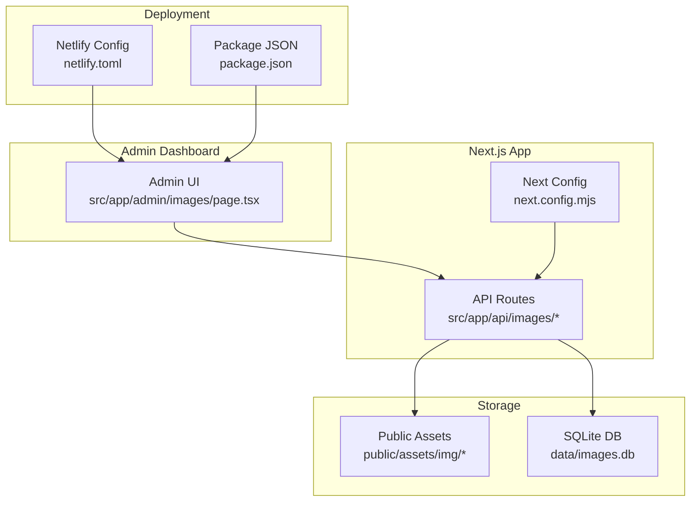
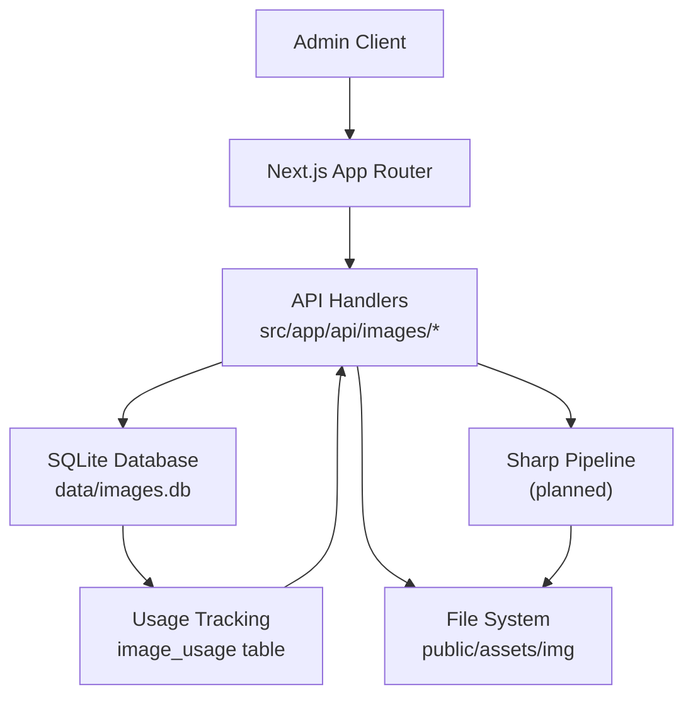
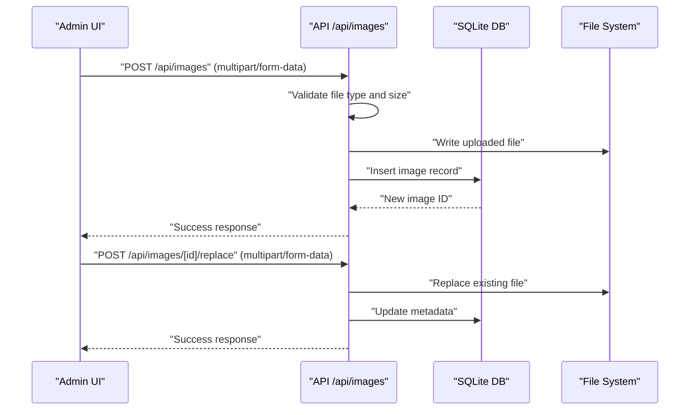
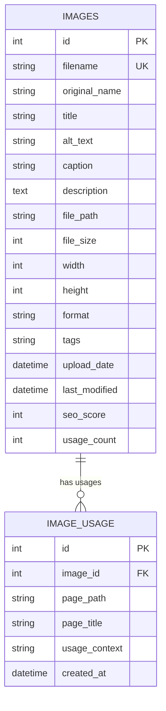
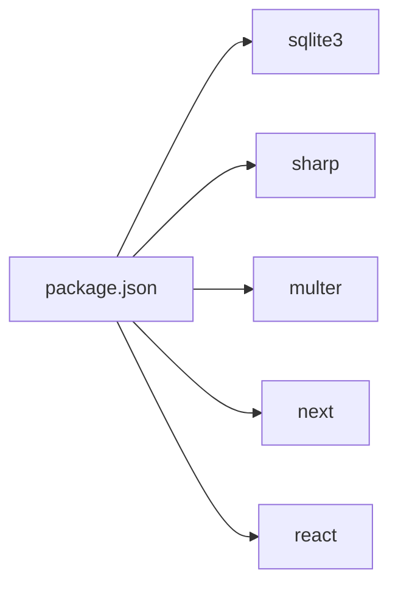

# Media Management

<cite>
**Referenced Files in This Document**
- [IMAGE_MANAGEMENT_SETUP.md](file://IMAGE_MANAGEMENT_SETUP.md)
- [init-database.js](file://scripts/init-database.js)
- [images.db](file://data/images.db)
- [package.json](file://package.json)
- [next.config.mjs](file://next.config.mjs)
- [netlify.toml](file://netlify.toml)
- [README.md](file://README.md)
</cite>

## Table of Contents
1. [Introduction](#introduction)
2. [Project Structure](#project-structure)
3. [Core Components](#core-components)
4. [Architecture Overview](#architecture-overview)
5. [Detailed Component Analysis](#detailed-component-analysis)
6. [Dependency Analysis](#dependency-analysis)
7. [Performance Considerations](#performance-considerations)
8. [Troubleshooting Guide](#troubleshooting-guide)
9. [Conclusion](#conclusion)
10. [Appendices](#appendices)

## Introduction
This document describes the media management system for attechglobal.com with a focus on image handling, optimization, and usage tracking. It explains the centralized dashboard, upload and replacement workflows, SEO metadata management, scanning of existing assets, and the underlying SQLite schema. It also outlines the planned enhancements for compression, CDN integration, and performance monitoring.

## Project Structure
The media management system is built as part of a Next.js application and integrates with:
- A SQLite database storing image metadata and usage records
- A file system for storing uploaded images
- An admin dashboard for managing images and viewing analytics
- API endpoints for CRUD operations, scanning, and usage queries

Key directories and files:
- Admin dashboard and pages under src/app/admin
- API routes under src/app/api
- Database initialization script under scripts
- SQLite database file under data
- Frontend assets under public/assets/img
- Build and deployment configuration under next.config.mjs, netlify.toml, and package.json

**Diagram sources**
- [next.config.mjs](file://next.config.mjs)
- [netlify.toml](file://netlify.toml)
- [package.json](file://package.json)

**Section sources**
- [IMAGE_MANAGEMENT_SETUP.md](file://IMAGE_MANAGEMENT_SETUP.md#L1-L190)
- [next.config.mjs](file://next.config.mjs)
- [netlify.toml](file://netlify.toml)
- [package.json](file://package.json)

## Core Components
- Image Management Dashboard: Centralized UI for browsing, searching, editing, and bulk operations on images; includes SEO analysis and usage insights.
- API Layer: Provides endpoints for listing, uploading, replacing, updating, deleting images, scanning existing assets, and retrieving usage analytics.
- Database: SQLite-backed schema with images and image_usage tables for metadata and usage tracking.
- File Storage: Local filesystem for uploaded images; future enhancements plan cloud storage integration.
- Optimization Pipeline: Planned integration with Sharp for resizing, format conversion, and quality optimization; current setup focuses on metadata and usage tracking.

**Section sources**
- [IMAGE_MANAGEMENT_SETUP.md](file://IMAGE_MANAGEMENT_SETUP.md#L5-L14)
- [IMAGE_MANAGEMENT_SETUP.md](file://IMAGE_MANAGEMENT_SETUP.md#L101-L114)
- [IMAGE_MANAGEMENT_SETUP.md](file://IMAGE_MANAGEMENT_SETUP.md#L115-L144)

## Architecture Overview
The system follows a layered architecture:
- Presentation: Admin UI renders image galleries, metadata forms, and analytics.
- Application: API routes handle requests, validate inputs, and orchestrate database updates and file operations.
- Persistence: SQLite stores image metadata and usage mapping; file paths reference assets in public/assets/img.
- Optimization: Sharp integration is planned for resizing, format conversion, and quality tuning.

**Diagram sources**
- [IMAGE_MANAGEMENT_SETUP.md](file://IMAGE_MANAGEMENT_SETUP.md#L101-L114)
- [IMAGE_MANAGEMENT_SETUP.md](file://IMAGE_MANAGEMENT_SETUP.md#L115-L144)

## Detailed Component Analysis

### Image Upload and Replacement Workflow
- Upload: The system accepts new images via the upload endpoint, validates file type and size, and stores metadata and the file in the configured directory.
- Replace: Replaces an existing image file while preserving metadata and usage history.
- Scanning: Automatically detects existing images in the public assets directory and registers them in the database.

**Diagram sources**
- [IMAGE_MANAGEMENT_SETUP.md](file://IMAGE_MANAGEMENT_SETUP.md#L101-L114)

**Section sources**
- [IMAGE_MANAGEMENT_SETUP.md](file://IMAGE_MANAGEMENT_SETUP.md#L51-L100)
- [IMAGE_MANAGEMENT_SETUP.md](file://IMAGE_MANAGEMENT_SETUP.md#L101-L114)

### Image Gallery Management and Bulk Operations
- Grid view with sorting and filtering by name, title, alt text, tags, upload date, file size, and SEO score.
- Bulk edit operations to update metadata across multiple images simultaneously.
- Search and filter to quickly locate images for maintenance or optimization.

**Section sources**
- [IMAGE_MANAGEMENT_SETUP.md](file://IMAGE_MANAGEMENT_SETUP.md#L57-L80)

### SEO Metadata and Analytics
- Metadata fields include title, alt text, caption, description, tags, and calculated SEO score.
- SEO Analysis tab displays score distribution, missing metadata indicators, and recommendations.
- Page Mapping tracks which pages use each image to identify unused assets and enable targeted updates.

**Section sources**
- [IMAGE_MANAGEMENT_SETUP.md](file://IMAGE_MANAGEMENT_SETUP.md#L65-L99)
- [IMAGE_MANAGEMENT_SETUP.md](file://IMAGE_MANAGEMENT_SETUP.md#L115-L144)

### Database Schema and Usage Tracking
- Images table: Stores unique identifiers, filenames, titles, alt text, captions, descriptions, file paths, sizes, dimensions, MIME type, tags, timestamps, SEO score, and usage counts.
- Image Usage table: Tracks page paths, titles, usage contexts, and timestamps for each image’s usage.

**Diagram sources**
- [IMAGE_MANAGEMENT_SETUP.md](file://IMAGE_MANAGEMENT_SETUP.md#L115-L144)

**Section sources**
- [IMAGE_MANAGEMENT_SETUP.md](file://IMAGE_MANAGEMENT_SETUP.md#L115-L144)

### API Endpoints
- List images with pagination and filtering
- Upload new images
- Retrieve specific image details
- Update image metadata
- Delete images
- Replace image files
- Get image usage information
- Scan existing images
- Retrieve SEO analysis

**Section sources**
- [IMAGE_MANAGEMENT_SETUP.md](file://IMAGE_MANAGEMENT_SETUP.md#L101-L114)

### Optimization Pipeline (Planned)
- Sharp integration for resizing, format conversion, and quality optimization.
- Responsive image generation for multiple breakpoints.
- Compression strategies to reduce file sizes while maintaining quality.
- CDN integration for global delivery and caching.

**Section sources**
- [IMAGE_MANAGEMENT_SETUP.md](file://IMAGE_MANAGEMENT_SETUP.md#L168-L178)

## Dependency Analysis
External dependencies used by the media management system:
- sqlite3 and @types/sqlite3 for database operations
- sharp for image processing and optimization
- multer and @types/multer for multipart form handling
- Additional Next.js and build tooling dependencies

**Diagram sources**
- [package.json](file://package.json)

**Section sources**
- [package.json](file://package.json)
- [IMAGE_MANAGEMENT_SETUP.md](file://IMAGE_MANAGEMENT_SETUP.md#L17-L23)

## Performance Considerations
- File size limits and type validation prevent oversized or unsafe uploads.
- SEO scoring and metadata completeness improve indexing and accessibility.
- Planned compression and CDN integration will reduce bandwidth and latency.
- Responsive image generation minimizes payload sizes for different devices.

[No sources needed since this section provides general guidance]

## Troubleshooting Guide
Common issues and resolutions:
- Database not found: Run the database initialization script to create tables.
- Upload failures: Verify file size and type restrictions; ensure write permissions for data and asset directories.
- Images not loading: Confirm file paths and filesystem permissions.
- SEO scores not updating: Refresh the page after editing metadata.

Permissions checklist:
- data/ directory must be writable for SQLite
- public/assets/img/ directory must be writable for uploaded images

**Section sources**
- [IMAGE_MANAGEMENT_SETUP.md](file://IMAGE_MANAGEMENT_SETUP.md#L153-L167)

## Conclusion
The attechglobal.com media management system provides a robust foundation for centralized image governance, with strong SEO metadata controls, usage tracking, and a clear path toward automated optimization and CDN integration. The SQLite schema supports efficient querying and analytics, while the admin dashboard streamlines day-to-day operations.

[No sources needed since this section summarizes without analyzing specific files]

## Appendices

### Deployment and Build Configuration
- Next.js configuration defines static generation and runtime behavior.
- Netlify configuration governs deployment targets and redirects.
- Package manifest lists all dependencies and scripts.

**Section sources**
- [next.config.mjs](file://next.config.mjs)
- [netlify.toml](file://netlify.toml)
- [package.json](file://package.json)

### Database Initialization
- The initialization script creates the SQLite database and required tables for images and usage tracking.

**Section sources**
- [init-database.js](file://scripts/init-database.js)

### Example Workflows
- Upload a new image: Use the upload endpoint to add a new asset; metadata and file are persisted.
- Replace an existing image: Use the replace endpoint to swap the file while retaining metadata and usage history.
- Scan existing images: Trigger a scan to register all images currently present in the assets directory.

**Section sources**
- [IMAGE_MANAGEMENT_SETUP.md](file://IMAGE_MANAGEMENT_SETUP.md#L51-L100)
- [IMAGE_MANAGEMENT_SETUP.md](file://IMAGE_MANAGEMENT_SETUP.md#L101-L114)