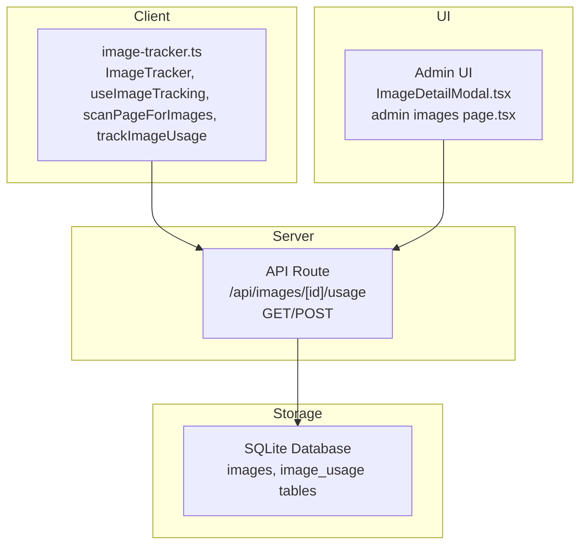
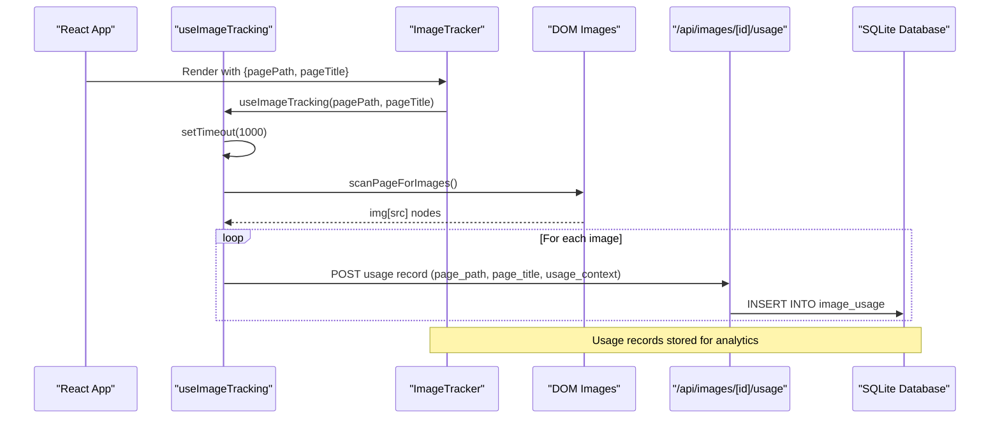
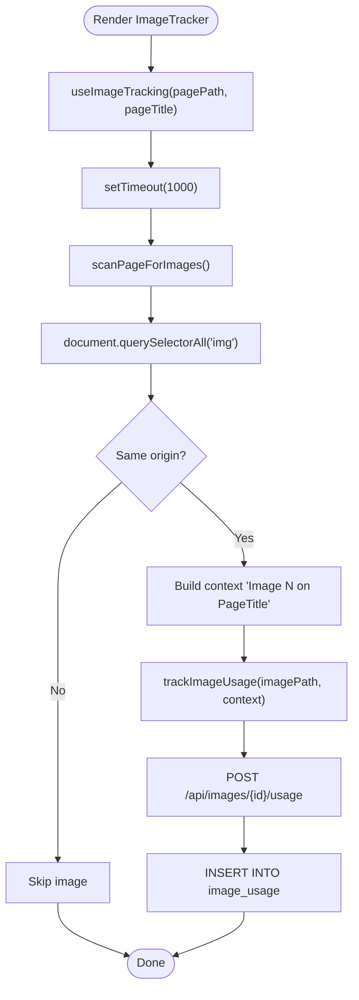
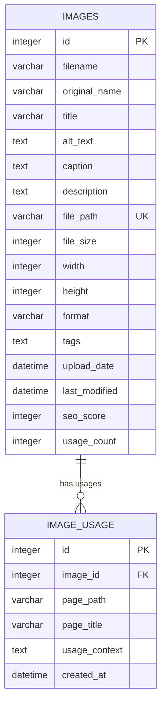
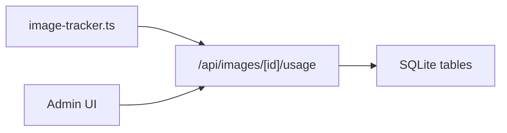

# Usage Tracking and Analytics

<cite>
**Referenced Files in This Document**
- [image-tracker.ts](file://src/lib/image-tracker.ts)
- [database.ts](file://src/lib/database.ts)
- [IMAGE_MANAGEMENT_SETUP.md](file://IMAGE_MANAGEMENT_SETUP.md)
- [ImageDetailModal.tsx](file://src/app/Components/Admin/ImageDetailModal.tsx)
- [page.tsx](file://src/app/admin/images/page.tsx)
- [route.ts](file://src/app/api/images/[id]/usage/route.ts)
</cite>

## Table of Contents
1. [Introduction](#introduction)
2. [Project Structure](#project-structure)
3. [Core Components](#core-components)
4. [Architecture Overview](#architecture-overview)
5. [Detailed Component Analysis](#detailed-component-analysis)
6. [Dependency Analysis](#dependency-analysis)
7. [Performance Considerations](#performance-considerations)
8. [Troubleshooting Guide](#troubleshooting-guide)
9. [Conclusion](#conclusion)
10. [Appendices](#appendices)

## Introduction
This document explains the image usage tracking and analytics system implemented in the project. It covers:
- Automatic discovery of media assets on pages
- Recording of usage contexts (page path, title, and contextual metadata)
- The ImageTracker component and useImageTracking hook for React applications
- The underlying database schema for usage records
- Analytics data collection and reporting capabilities
- Performance impact, debouncing, and selective tracking strategies
- Guidance on interpreting analytics, identifying unused assets, and optimizing storage
- Troubleshooting tracking failures, context resolution issues, and performance monitoring

## Project Structure
The tracking system spans client-side utilities, database schema, and server-side API endpoints:
- Client-side tracking utilities: image-tracker.ts
- Database schema and helpers: database.ts
- Admin UI components that consume usage data: ImageDetailModal.tsx and admin images page
- API endpoints for usage records: route.ts
- Documentation and schema reference: IMAGE_MANAGEMENT_SETUP.md

**Diagram sources**
- [image-tracker.ts](file://src/lib/image-tracker.ts#L1-L95)
- [route.ts](file://src/app/api/images/[id]/usage/route.ts#L13-L45)
- [database.ts](file://src/lib/database.ts#L100-L184)
- [ImageDetailModal.tsx](file://src/app/Components/Admin/ImageDetailModal.tsx#L48-L48)
- [page.tsx](file://src/app/admin/images/page.tsx#L67-L67)

**Section sources**
- [image-tracker.ts](file://src/lib/image-tracker.ts#L1-L95)
- [database.ts](file://src/lib/database.ts#L100-L184)
- [IMAGE_MANAGEMENT_SETUP.md](file://IMAGE_MANAGEMENT_SETUP.md#L101-L144)

## Core Components
- ImageTracker: A React component that wraps page content and triggers automatic image discovery and tracking.
- useImageTracking: A React hook that schedules page scanning after render.
- scanPageForImages: Scans DOM for images and records usage via trackImageUsage.
- trackImageUsage: Sends usage context to the backend API for persistence.

Key behaviors:
- Debounce scanning to allow images to load before tracking.
- Extract page path and title from props and construct a simple usage context.
- Use localStorage for admin authentication token when calling APIs.

**Section sources**
- [image-tracker.ts](file://src/lib/image-tracker.ts#L67-L95)

## Architecture Overview
The tracking pipeline connects client-side discovery to server-side persistence and UI reporting.

**Diagram sources**
- [image-tracker.ts](file://src/lib/image-tracker.ts#L45-L95)
- [route.ts](file://src/app/api/images/[id]/usage/route.ts#L45-L45)
- [database.ts](file://src/lib/database.ts#L128-L139)

## Detailed Component Analysis

### ImageTracker Component and useImageTracking Hook
- Purpose: Automatically discover images on a page and record their usage with context.
- Behavior:
  - Debounces scanning by 1 second to ensure images are loaded.
  - Iterates through all img elements and filters those whose src belongs to the current origin.
  - Builds a simple usage context indicating position and page title.
  - Calls trackImageUsage to persist the record.

**Diagram sources**
- [image-tracker.ts](file://src/lib/image-tracker.ts#L45-L95)

**Section sources**
- [image-tracker.ts](file://src/lib/image-tracker.ts#L45-L95)

### Usage Context Recording
- Fields captured:
  - page_path: The page path where the image appears.
  - page_title: The page title associated with the path.
  - usage_context: A simple textual context derived from the image’s position and page title.
  - created_at: Timestamp recorded by the server.
- Context construction:
  - Uses index-based labeling and the provided page title to form a concise context string.

**Section sources**
- [image-tracker.ts](file://src/lib/image-tracker.ts#L45-L65)

### Database Schema for Usage Records
The schema supports efficient tracking and reporting of image usage across pages.

- Notes:
  - The images table includes a usage_count field that can be used for quick analytics.
  - The image_usage table stores per-page usage records with timestamps.

**Diagram sources**
- [database.ts](file://src/lib/database.ts#L105-L140)

**Section sources**
- [database.ts](file://src/lib/database.ts#L18-L45)
- [database.ts](file://src/lib/database.ts#L105-L140)

### API Endpoints for Usage Analytics
- GET /api/images/[id]/usage
  - Returns usage records for a given image, enabling UI components to display usage history.
- POST /api/images/[id]/usage
  - Creates a new usage record with page_path, page_title, and usage_context.

These endpoints integrate with the client-side tracking to persist usage events.

**Section sources**
- [route.ts](file://src/app/api/images/[id]/usage/route.ts#L13-L45)

### Admin UI Integration
- ImageDetailModal displays usage records for a selected image by fetching /api/images/[id]/usage.
- The admin images page integrates with the API for listing, editing, and scanning images.

**Section sources**
- [ImageDetailModal.tsx](file://src/app/Components/Admin/ImageDetailModal.tsx#L48-L48)
- [page.tsx](file://src/app/admin/images/page.tsx#L67-L67)

## Dependency Analysis
- Client-side dependency chain:
  - ImageTracker -> useImageTracking -> scanPageForImages -> trackImageUsage -> fetch('/api/images/[id]/usage')
- Server-side dependency chain:
  - API route -> database helpers -> SQLite tables
- UI dependency chain:
  - Admin components -> API endpoints -> database

**Diagram sources**
- [image-tracker.ts](file://src/lib/image-tracker.ts#L11-L43)
- [route.ts](file://src/app/api/images/[id]/usage/route.ts#L45-L45)
- [database.ts](file://src/lib/database.ts#L105-L140)

**Section sources**
- [image-tracker.ts](file://src/lib/image-tracker.ts#L11-L43)
- [route.ts](file://src/app/api/images/[id]/usage/route.ts#L45-L45)
- [database.ts](file://src/lib/database.ts#L105-L140)

## Performance Considerations
- Debouncing:
  - The 1-second delay in useImageTracking reduces premature tracking before images finish loading.
- Selective tracking:
  - Only images with src matching the current origin are tracked, minimizing cross-origin noise.
- Batch overhead:
  - Current implementation posts each usage event individually. For high-volume pages, consider batching or throttling to reduce network overhead.
- Database writes:
  - Frequent INSERT operations can be optimized with transaction batching or periodic flush strategies.
- UI rendering:
  - Usage retrieval in admin components should be paginated and cached to avoid heavy DOM updates.

[No sources needed since this section provides general guidance]

## Troubleshooting Guide
Common issues and remedies:
- Tracking does not record usage:
  - Verify that the admin token is present in localStorage and passed in Authorization headers.
  - Confirm that the image src is within the current origin; cross-origin images are ignored.
  - Ensure the backend endpoint /api/images/[id]/usage is reachable and the database is initialized.
- Context resolution problems:
  - If pagePath or pageTitle are empty, the usage context will reflect generic labels. Provide accurate props to ImageTracker.
- Performance concerns:
  - Reduce debounce time or disable tracking on low-priority pages if needed.
  - Consider disabling tracking for images loaded via third-party domains.
- Database and file permissions:
  - Ensure the data directory exists and is writable for SQLite operations.

**Section sources**
- [image-tracker.ts](file://src/lib/image-tracker.ts#L11-L43)
- [image-tracker.ts](file://src/lib/image-tracker.ts#L45-L95)
- [IMAGE_MANAGEMENT_SETUP.md](file://IMAGE_MANAGEMENT_SETUP.md#L153-L167)

## Conclusion
The image usage tracking system provides automatic discovery and context-aware analytics for media assets. By combining a React component and hook with a lightweight SQLite-backed API, it enables administrators to monitor image usage, identify unused assets, and optimize storage and SEO. For production-scale deployments, consider batching, caching, and selective tracking strategies to minimize performance impact.

[No sources needed since this section summarizes without analyzing specific files]

## Appendices

### Implementation Examples and Workflows
- Tracking workflow:
  - Wrap page content with ImageTracker and pass pagePath and pageTitle.
  - On mount, useImageTracking schedules scanPageForImages after a short delay.
  - For each in-scope image, trackImageUsage posts usage context to the backend.
- Context extraction:
  - Construct usage_context using image index and page title.
- Analytics data collection:
  - Fetch /api/images/[id]/usage in admin components to display usage history.

**Section sources**
- [image-tracker.ts](file://src/lib/image-tracker.ts#L45-L95)
- [ImageDetailModal.tsx](file://src/app/Components/Admin/ImageDetailModal.tsx#L48-L48)

### Reporting Capabilities
- Admin dashboard:
  - Lists images, metadata, SEO scores, and usage counts.
  - Provides “Images Needing Attention” lists for missing alt text, low SEO scores, and large file sizes.
- Usage analytics:
  - Per-image usage history via GET /api/images/[id]/usage.
  - Aggregate metrics (total images, average SEO score, total usage) available in the admin view.

**Section sources**
- [IMAGE_MANAGEMENT_SETUP.md](file://IMAGE_MANAGEMENT_SETUP.md#L74-L99)
- [page.tsx](file://src/app/admin/images/page.tsx#L67-L67)