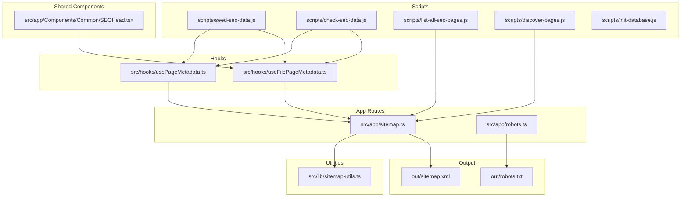
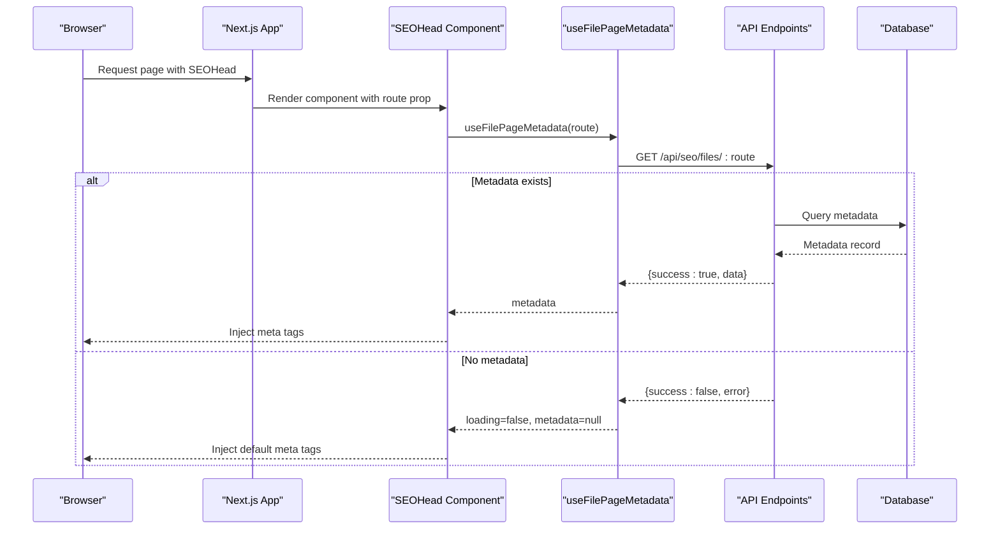
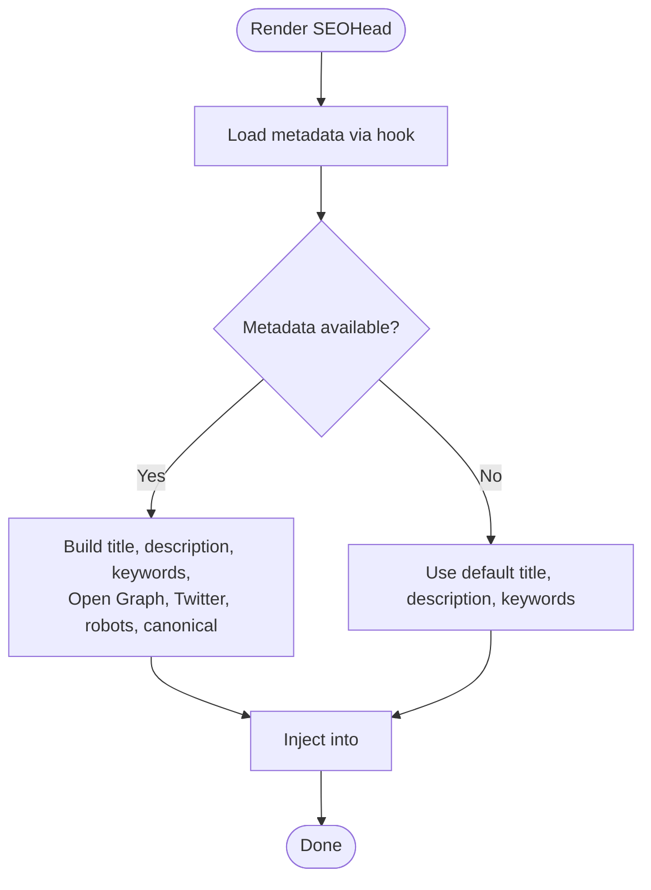
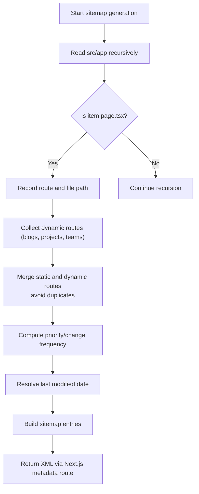
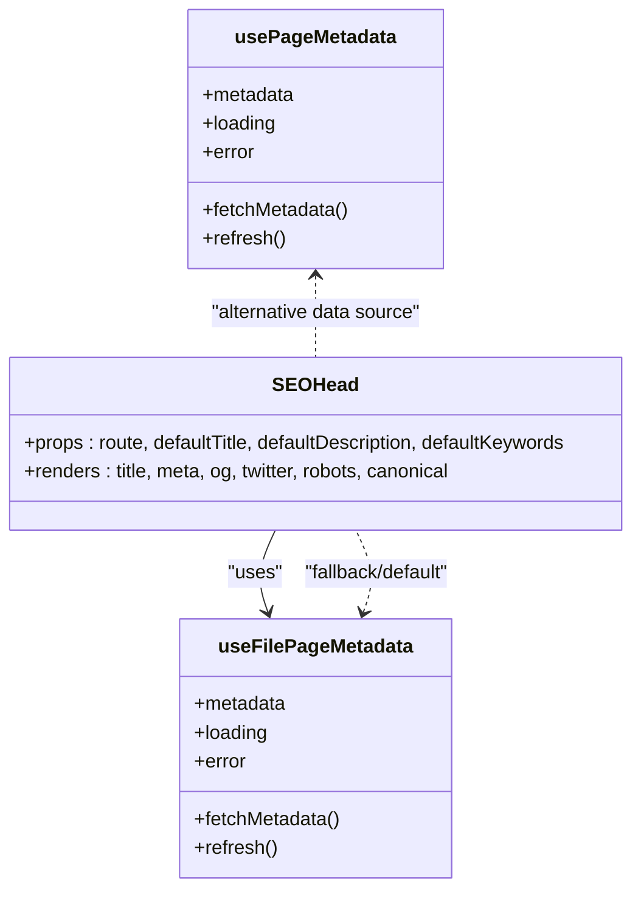
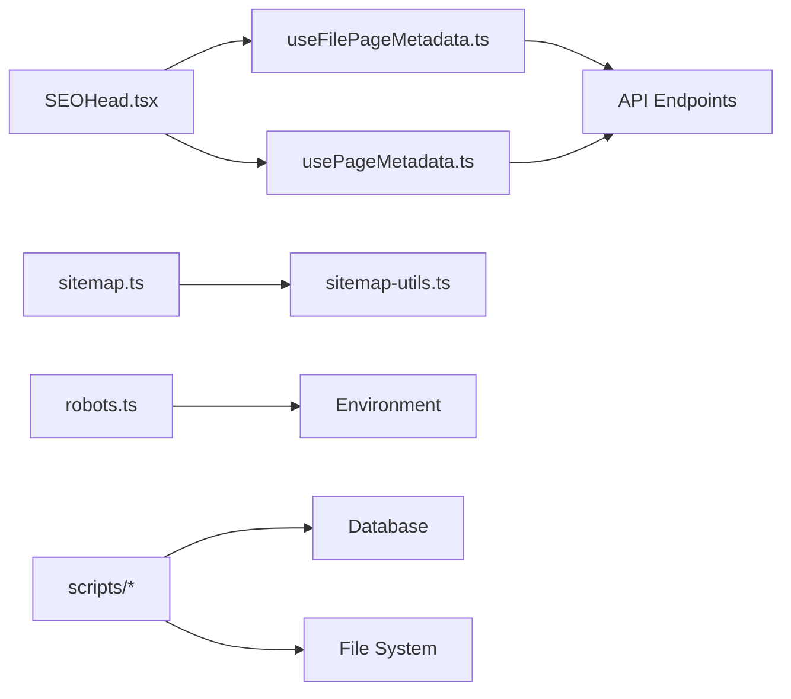

# SEO Management

<cite>
**Referenced Files in This Document**
- [README.md](file://README.md)
- [SEO_MANAGEMENT_GUIDE.md](file://SEO_MANAGEMENT_GUIDE.md)
- [SITEMAP_SETUP.md](file://SITEMAP_SETUP.md)
- [src/app/sitemap.ts](file://src/app/sitemap.ts)
- [src/app/robots.ts](file://src/app/robots.ts)
- [src/lib/sitemap-utils.ts](file://src/lib/sitemap-utils.ts)
- [src/app/Components/Common/SEOHead.tsx](file://src/app/Components/Common/SEOHead.tsx)
- [src/hooks/usePageMetadata.ts](file://src/hooks/usePageMetadata.ts)
- [src/hooks/useFilePageMetadata.ts](file://src/hooks/useFilePageMetadata.ts)
- [debug-seo.js](file://debug-seo.js)
- [scripts/check-seo-data.js](file://scripts/check-seo-data.js)
- [scripts/seed-seo-data.js](file://scripts/seed-seo-data.js)
- [scripts/list-all-seo-pages.js](file://scripts/list-all-seo-pages.js)
- [scripts/discover-pages.js](file://scripts/discover-pages.js)
- [scripts/init-database.js](file://scripts/init-database.js)
- [out/sitemap.xml](file://out/sitemap.xml)
- [out/robots.txt](file://out/robots.txt)
</cite>

## Table of Contents
1. [Introduction](#introduction)
2. [Project Structure](#project-structure)
3. [Core Components](#core-components)
4. [Architecture Overview](#architecture-overview)
5. [Detailed Component Analysis](#detailed-component-analysis)
6. [Dependency Analysis](#dependency-analysis)
7. [Performance Considerations](#performance-considerations)
8. [Troubleshooting Guide](#troubleshooting-guide)
9. [Conclusion](#conclusion)
10. [Appendices](#appendices)

## Introduction
This document describes the SEO management system for attechglobal.com. It explains the automated architecture for metadata generation, sitemap creation, and robots.txt management. It documents the SEOHead component for dynamic meta tag management, file-based SEO data organization, and automated content optimization. It also covers sitemap generation, XML structure, submission strategies, SEO data seeding, metadata validation, performance monitoring, configuration workflows, analytics integration touchpoints, and the relationship between SEO tools and the content management system.

## Project Structure
The SEO system spans Next.js app routes, shared components, hooks for data access, and supporting scripts for seeding and discovery. Key areas:
- App routes for sitemap and robots generation
- Shared SEOHead component for dynamic meta tags
- Hooks for database-backed and file-backed metadata
- Utilities for sitemap route discovery and metadata
- Scripts for seeding, validation, and discovery
- Output artifacts (sitemap.xml and robots.txt) for deployment

**Diagram sources**
- [src/app/sitemap.ts](file://src/app/sitemap.ts#L1-L154)
- [src/app/robots.ts](file://src/app/robots.ts#L1-L38)
- [src/lib/sitemap-utils.ts](file://src/lib/sitemap-utils.ts#L1-L196)
- [src/app/Components/Common/SEOHead.tsx](file://src/app/Components/Common/SEOHead.tsx#L1-L78)
- [src/hooks/usePageMetadata.ts](file://src/hooks/usePageMetadata.ts#L1-L218)
- [src/hooks/useFilePageMetadata.ts](file://src/hooks/useFilePageMetadata.ts#L1-L225)
- [scripts/seed-seo-data.js](file://scripts/seed-seo-data.js)
- [scripts/check-seo-data.js](file://scripts/check-seo-data.js)
- [scripts/list-all-seo-pages.js](file://scripts/list-all-seo-pages.js)
- [scripts/discover-pages.js](file://scripts/discover-pages.js)
- [scripts/init-database.js](file://scripts/init-database.js)
- [out/sitemap.xml](file://out/sitemap.xml)
- [out/robots.txt](file://out/robots.txt)

**Section sources**
- [README.md](file://README.md#L1-L37)
- [SEO_MANAGEMENT_GUIDE.md](file://SEO_MANAGEMENT_GUIDE.md#L1-L92)
- [SITEMAP_SETUP.md](file://SITEMAP_SETUP.md#L1-L142)

## Core Components
- SEOHead: A reusable component that injects dynamic meta tags into the document head, falling back to defaults when database metadata is unavailable.
- Sitemap generator: Dynamically discovers static pages and supports adding dynamic content via utilities.
- Robots generator: Produces robots.txt with allow/disallow rules and references the sitemap.
- Metadata hooks: Provide CRUD and listing capabilities for page metadata backed by the database and file-based storage.
- Sitemap utilities: Define route metadata (priority, change frequency), last-modified logic, and dynamic route discovery helpers.
- Scripts: Seed initial metadata, validate data, list pages, discover pages, and initialize the database.

**Section sources**
- [src/app/Components/Common/SEOHead.tsx](file://src/app/Components/Common/SEOHead.tsx#L1-L78)
- [src/app/sitemap.ts](file://src/app/sitemap.ts#L1-L154)
- [src/app/robots.ts](file://src/app/robots.ts#L1-L38)
- [src/hooks/usePageMetadata.ts](file://src/hooks/usePageMetadata.ts#L1-L218)
- [src/hooks/useFilePageMetadata.ts](file://src/hooks/useFilePageMetadata.ts#L1-L225)
- [src/lib/sitemap-utils.ts](file://src/lib/sitemap-utils.ts#L1-L196)
- [scripts/seed-seo-data.js](file://scripts/seed-seo-data.js)
- [scripts/check-seo-data.js](file://scripts/check-seo-data.js)
- [scripts/list-all-seo-pages.js](file://scripts/list-all-seo-pages.js)
- [scripts/discover-pages.js](file://scripts/discover-pages.js)
- [scripts/init-database.js](file://scripts/init-database.js)

## Architecture Overview
The system integrates Next.js metadata routes with a shared component and hooks to deliver dynamic, centralized SEO control. The sitemap and robots routes are generated at runtime, while the SEOHead component reads metadata from either database-backed hooks or file-based endpoints. Scripts support seeding and validation.

**Diagram sources**
- [src/app/Components/Common/SEOHead.tsx](file://src/app/Components/Common/SEOHead.tsx#L1-L78)
- [src/hooks/useFilePageMetadata.ts](file://src/hooks/useFilePageMetadata.ts#L1-L225)
- [src/app/sitemap.ts](file://src/app/sitemap.ts#L1-L154)

## Detailed Component Analysis

### SEOHead Component
Responsibilities:
- Reads route-based metadata via a hook
- Renders default meta tags if metadata is missing
- Emits Open Graph, Twitter Cards, robots, and canonical URL meta tags when present

Key behaviors:
- Uses a file-based metadata endpoint when available
- Falls back to defaults for title, description, and keywords
- Supports optional children injection

**Diagram sources**
- [src/app/Components/Common/SEOHead.tsx](file://src/app/Components/Common/SEOHead.tsx#L1-L78)
- [src/hooks/useFilePageMetadata.ts](file://src/hooks/useFilePageMetadata.ts#L1-L225)

**Section sources**
- [src/app/Components/Common/SEOHead.tsx](file://src/app/Components/Common/SEOHead.tsx#L1-L78)
- [src/hooks/useFilePageMetadata.ts](file://src/hooks/useFilePageMetadata.ts#L1-L225)

### Sitemap Generation
Responsibilities:
- Discover static pages by scanning the file system
- Support route groups and nested routes
- Combine static pages with dynamic routes from utilities
- Compute priority, change frequency, and last modified date per route
- Export a standard XML sitemap

Processing logic:
- Recursively scan src/app for page files
- Skip non-route directories
- Merge static and dynamic routes, avoiding duplicates
- Compute metadata and last modified timestamps
- Return a MetadataRoute.Sitemap array

**Diagram sources**
- [src/app/sitemap.ts](file://src/app/sitemap.ts#L1-L154)
- [src/lib/sitemap-utils.ts](file://src/lib/sitemap-utils.ts#L1-L196)

**Section sources**
- [src/app/sitemap.ts](file://src/app/sitemap.ts#L1-L154)
- [src/lib/sitemap-utils.ts](file://src/lib/sitemap-utils.ts#L1-L196)
- [SITEMAP_SETUP.md](file://SITEMAP_SETUP.md#L1-L142)

### Robots.txt Management
Responsibilities:
- Generate robots.txt with allow/disallow rules
- Reference the sitemap URL
- Dynamically resolve base URL from environment

Behavior:
- Defines rules for crawlers
- Blocks administrative and asset paths
- Sets sitemap link to the generated sitemap

**Section sources**
- [src/app/robots.ts](file://src/app/robots.ts#L1-L38)

### Metadata Hooks and File-Based Organization
Responsibilities:
- Provide CRUD and listing for page metadata
- Support both database-backed and file-based endpoints
- Offer pagination, search, and refresh mechanisms

Patterns:
- usePageMetadata: fetch single metadata by route
- useAllPageMetadata: paginated listing with search
- useUpdatePageMetadata/useCreatePageMetadata: mutations
- useFilePageMetadata: file-based equivalent
- useAllFilePageMetadata/useUpdateFilePageMetadata/useCreateFilePageMetadata: file-based equivalents

**Diagram sources**
- [src/app/Components/Common/SEOHead.tsx](file://src/app/Components/Common/SEOHead.tsx#L1-L78)
- [src/hooks/usePageMetadata.ts](file://src/hooks/usePageMetadata.ts#L1-L218)
- [src/hooks/useFilePageMetadata.ts](file://src/hooks/useFilePageMetadata.ts#L1-L225)

**Section sources**
- [src/hooks/usePageMetadata.ts](file://src/hooks/usePageMetadata.ts#L1-L218)
- [src/hooks/useFilePageMetadata.ts](file://src/hooks/useFilePageMetadata.ts#L1-L225)

### Sitemap Utilities
Responsibilities:
- Discover dynamic content routes (blog posts, projects, team members)
- Determine route metadata (priority, change frequency)
- Provide last modified date resolution

Extensibility:
- Add new dynamic content types by extending discovery functions
- Customize route metadata per pattern
- Implement last modified logic from files, CMS, or database

**Section sources**
- [src/lib/sitemap-utils.ts](file://src/lib/sitemap-utils.ts#L1-L196)

### Scripts for SEO Data Management
- seed-seo-data.js: Initialize or seed SEO metadata
- check-seo-data.js: Validate SEO data completeness
- list-all-seo-pages.js: Enumerate managed pages
- discover-pages.js: Discover pages for SEO coverage
- init-database.js: Initialize database for metadata storage

Operational guidance:
- Run seeding once to populate baseline metadata
- Use validation scripts to audit coverage
- Use discovery scripts to expand coverage to new pages

**Section sources**
- [scripts/seed-seo-data.js](file://scripts/seed-seo-data.js)
- [scripts/check-seo-data.js](file://scripts/check-seo-data.js)
- [scripts/list-all-seo-pages.js](file://scripts/list-all-seo-pages.js)
- [scripts/discover-pages.js](file://scripts/discover-pages.js)
- [scripts/init-database.js](file://scripts/init-database.js)

## Dependency Analysis
The SEO system exhibits clear separation of concerns:
- SEOHead depends on hooks for metadata retrieval
- Hooks depend on API endpoints for database/file-backed metadata
- Sitemap depends on sitemap-utils for dynamic route discovery and metadata
- Robots depends on environment configuration for base URL
- Scripts depend on database and filesystem for seeding and validation

**Diagram sources**
- [src/app/Components/Common/SEOHead.tsx](file://src/app/Components/Common/SEOHead.tsx#L1-L78)
- [src/hooks/usePageMetadata.ts](file://src/hooks/usePageMetadata.ts#L1-L218)
- [src/hooks/useFilePageMetadata.ts](file://src/hooks/useFilePageMetadata.ts#L1-L225)
- [src/app/sitemap.ts](file://src/app/sitemap.ts#L1-L154)
- [src/lib/sitemap-utils.ts](file://src/lib/sitemap-utils.ts#L1-L196)
- [src/app/robots.ts](file://src/app/robots.ts#L1-L38)
- [scripts/seed-seo-data.js](file://scripts/seed-seo-data.js)
- [scripts/check-seo-data.js](file://scripts/check-seo-data.js)
- [scripts/list-all-seo-pages.js](file://scripts/list-all-seo-pages.js)
- [scripts/discover-pages.js](file://scripts/discover-pages.js)
- [scripts/init-database.js](file://scripts/init-database.js)

**Section sources**
- [src/app/sitemap.ts](file://src/app/sitemap.ts#L1-L154)
- [src/app/robots.ts](file://src/app/robots.ts#L1-L38)
- [src/lib/sitemap-utils.ts](file://src/lib/sitemap-utils.ts#L1-L196)
- [src/app/Components/Common/SEOHead.tsx](file://src/app/Components/Common/SEOHead.tsx#L1-L78)
- [src/hooks/usePageMetadata.ts](file://src/hooks/usePageMetadata.ts#L1-L218)
- [src/hooks/useFilePageMetadata.ts](file://src/hooks/useFilePageMetadata.ts#L1-L225)
- [scripts/seed-seo-data.js](file://scripts/seed-seo-data.js)
- [scripts/check-seo-data.js](file://scripts/check-seo-data.js)
- [scripts/list-all-seo-pages.js](file://scripts/list-all-seo-pages.js)
- [scripts/discover-pages.js](file://scripts/discover-pages.js)
- [scripts/init-database.js](file://scripts/init-database.js)

## Performance Considerations
- Incremental Static Regeneration (ISR): The sitemap route is configured for regeneration at intervals to keep the sitemap fresh without full rebuilds.
- Dynamic route discovery: Utility functions should be efficient; avoid heavy filesystem or network calls during sitemap generation.
- Metadata retrieval: Prefer caching and minimal network requests in hooks; leverage environment variables for base URL to avoid runtime computation overhead.
- Robots rules: Blocking unnecessary paths reduces crawler load and improves crawl efficiency.
- Monitoring: Use built-in Next.js telemetry and external analytics to track indexing and traffic metrics.

[No sources needed since this section provides general guidance]

## Troubleshooting Guide
Common issues and resolutions:
- Missing or stale metadata: Ensure seeding has been run and the database is initialized. Use validation scripts to check coverage.
- Incorrect route paths: Confirm that the route prop passed to SEOHead matches the actual URL path.
- Sitemap not updating: Verify ISR revalidation settings and environment base URL configuration.
- Robots blocking pages: Review robots rules and ensure administrative and asset paths remain blocked.
- Debugging SEO: Use the provided debug script and validator tools to inspect meta tags and sitemap entries.

**Section sources**
- [SEO_MANAGEMENT_GUIDE.md](file://SEO_MANAGEMENT_GUIDE.md#L87-L92)
- [SITEMAP_SETUP.md](file://SITEMAP_SETUP.md#L114-L119)
- [debug-seo.js](file://debug-seo.js)
- [scripts/check-seo-data.js](file://scripts/check-seo-data.js)

## Conclusion
The attechglobal.com SEO management system combines dynamic metadata injection, automated sitemap generation, and robots.txt management with a robust component and hooks layer. It supports both database-backed and file-based SEO data, offers extensible utilities for dynamic content, and provides scripts for seeding and validation. By following the documented workflows and best practices, teams can maintain high-quality SEO with minimal manual effort.

[No sources needed since this section summarizes without analyzing specific files]

## Appendices

### SEO Configuration Workflows
- Initial setup: Start the development server, seed metadata, and access the SEO dashboard.
- Page migration: Add the SEOHead component to each page and register routes in the SEO dashboard.
- Validation: Run validation scripts to ensure all pages have required metadata.
- Ongoing maintenance: Update metadata via the dashboard or scripts, monitor sitemap coverage, and adjust robots rules as needed.

**Section sources**
- [SEO_MANAGEMENT_GUIDE.md](file://SEO_MANAGEMENT_GUIDE.md#L3-L92)

### Content Optimization Processes
- Character limits: Keep meta titles under recommended lengths and descriptions concise.
- Social media tags: Ensure Open Graph and Twitter Cards are populated for improved sharing.
- Canonicalization: Use canonical URLs to prevent duplicate content issues.
- Regular updates: Refresh metadata seasonally and after major content changes.

**Section sources**
- [SEO_MANAGEMENT_GUIDE.md](file://SEO_MANAGEMENT_GUIDE.md#L58-L86)

### Analytics Integration Touchpoints
- Monitor indexing: Use the generated sitemap and robots.txt to guide search engine crawlers.
- Track traffic: Integrate analytics to observe traffic trends and ranking signals.
- Validate tags: Use validator tools to confirm meta tag correctness across platforms.

[No sources needed since this section provides general guidance]

### Relationship Between SEO Tools and CMS
- Centralized management: All SEO data is stored centrally, enabling real-time updates without redeployment.
- Automatic updates: Changes made in the SEO dashboard propagate immediately to pages using SEOHead.
- Batch processing: Scripts support seeding and discovery, facilitating bulk operations across many pages.

**Section sources**
- [SEO_MANAGEMENT_GUIDE.md](file://SEO_MANAGEMENT_GUIDE.md#L49-L57)
- [scripts/seed-seo-data.js](file://scripts/seed-seo-data.js)
- [scripts/discover-pages.js](file://scripts/discover-pages.js)

### Sitemap Submission Strategies
- Submit sitemap: Provide the sitemap URL to search engines via their webmaster tools.
- Monitor coverage: Use the generated sitemap to verify that all intended pages are included.
- Keep updated: Rely on dynamic generation and ISR to maintain freshness.

**Section sources**
- [SITEMAP_SETUP.md](file://SITEMAP_SETUP.md#L120-L127)
- [out/sitemap.xml](file://out/sitemap.xml)