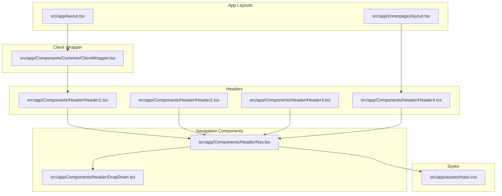
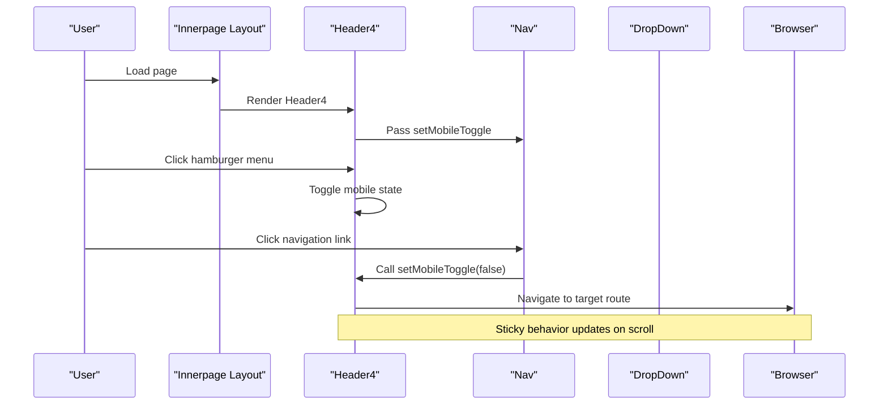
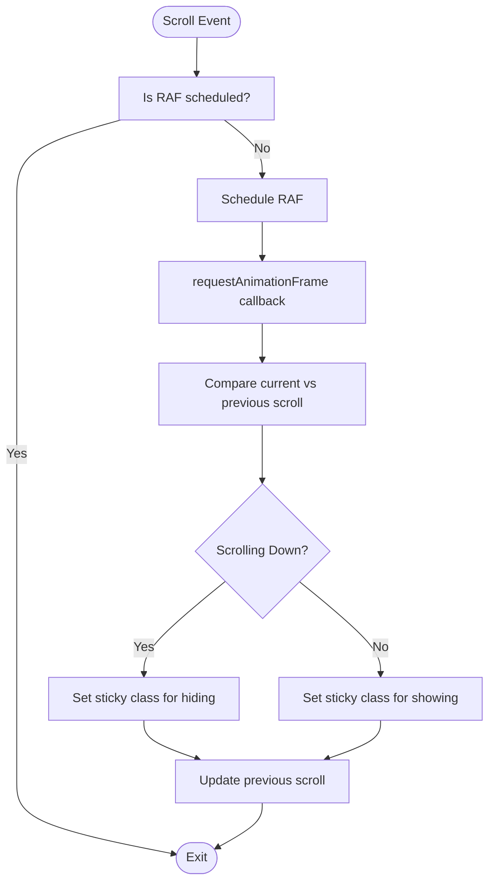
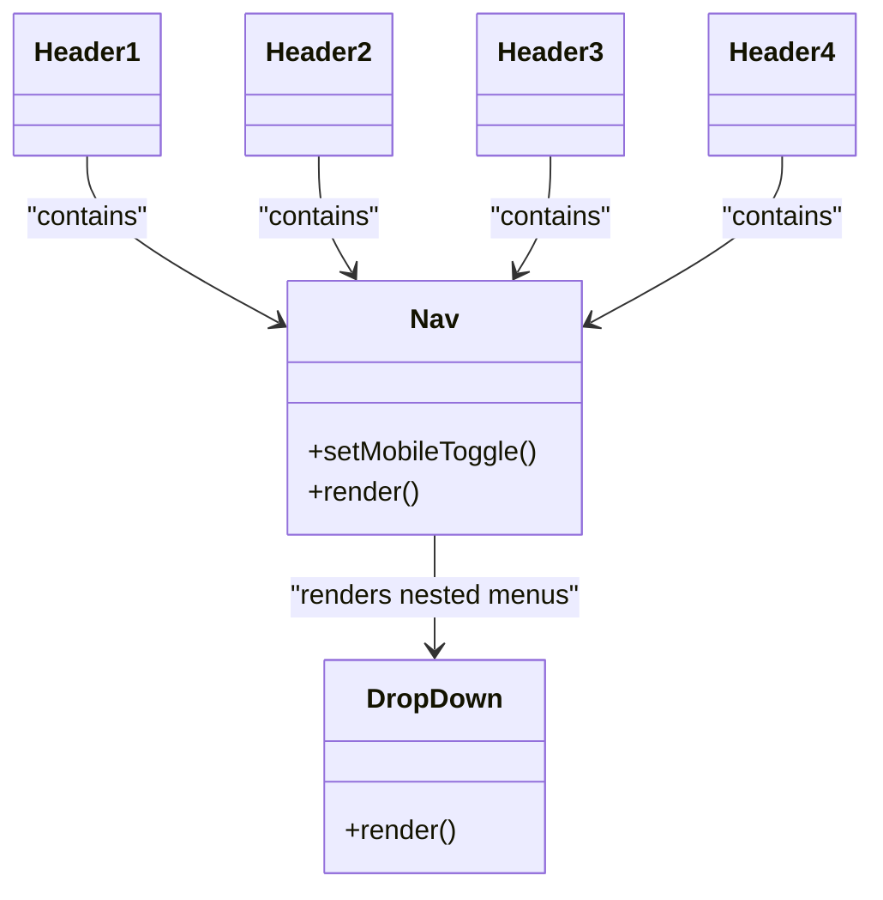
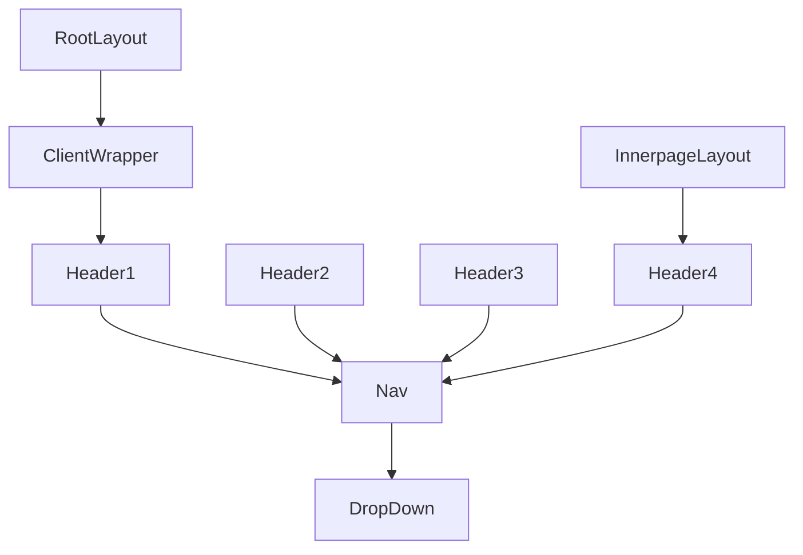

# Navigation System

<cite>
**Referenced Files in This Document**
- [Header1.tsx](file://src/app/Components/Header/Header1.tsx)
- [Header2.tsx](file://src/app/Components/Header/Header2.tsx)
- [Header3.tsx](file://src/app/Components/Header/Header3.tsx)
- [Header4.tsx](file://src/app/Components/Header/Header4.tsx)
- [Nav.tsx](file://src/app/Components/Header/Nav.tsx)
- [DropDown.tsx](file://src/app/Components/Header/DropDown.tsx)
- [layout.tsx](file://src/app/(innerpage)/layout.tsx)
- [page.tsx](file://src/app/page.tsx)
- [ClientWrapper.tsx](file://src/app/Components/Common/ClientWrapper.tsx)
- [main.css](file://src/app/assets/main.css)
</cite>

## Table of Contents
1. [Introduction](#introduction)
2. [Project Structure](#project-structure)
3. [Core Components](#core-components)
4. [Architecture Overview](#architecture-overview)
5. [Detailed Component Analysis](#detailed-component-analysis)
6. [Dependency Analysis](#dependency-analysis)
7. [Performance Considerations](#performance-considerations)
8. [Troubleshooting Guide](#troubleshooting-guide)
9. [Conclusion](#conclusion)

## Introduction
This document provides comprehensive documentation for the navigation system components of the Next.js application. It details the four header variants (Header1, Header2, Header3, Header4) and their responsive behaviors, the navigation dropdown functionality, mobile menu handling, component composition patterns, prop configurations, styling approaches, and integration with Next.js routing. It also covers navigation state management, active link highlighting, accessibility features, scroll behavior optimization, and performance considerations.

## Project Structure
The navigation system is primarily composed of four header variants and supporting navigation components. Headers are integrated via page layouts and rendered within a client-side wrapper to enable interactive behavior.

**Diagram sources**
- [layout.tsx](file://src/app/(innerpage)/layout.tsx#L1-L10)
- [page.tsx](file://src/app/page.tsx#L1-L40)
- [Header1.tsx](file://src/app/Components/Header/Header1.tsx#L1-L94)
- [Header2.tsx](file://src/app/Components/Header/Header2.tsx#L1-L81)
- [Header3.tsx](file://src/app/Components/Header/Header3.tsx#L1-L128)
- [Header4.tsx](file://src/app/Components/Header/Header4.tsx#L1-L100)
- [Nav.tsx](file://src/app/Components/Header/Nav.tsx#L1-L111)
- [DropDown.tsx](file://src/app/Components/Header/DropDown.tsx#L1-L200)
- [ClientWrapper.tsx](file://src/app/Components/Common/ClientWrapper.tsx#L1-L11)
- [main.css](file://src/app/assets/main.css#L1-L200)

**Section sources**
- [layout.tsx](file://src/app/(innerpage)/layout.tsx#L1-L10)
- [page.tsx](file://src/app/page.tsx#L1-L40)

## Core Components
- Header1: Sticky header with scroll-aware behavior and mobile toggle. Uses requestAnimationFrame for scroll optimization.
- Header2: Similar to Header1 but without requestAnimationFrame optimization.
- Header3: Adds a top header bar with contact information and social links above the main navigation.
- Header4: Includes prominent social media links in the header right area.
- Nav: Central navigation component rendering primary links and nested dropdowns.
- DropDown: Renders nested dropdown menus for hierarchical navigation items.
- ClientWrapper: Wraps child content to enable client-side interactivity for headers.

Key prop configurations:
- variant: Optional variant class passed to headers for styling customization.
- setMobileToggle: Function prop passed to Nav to close mobile menus on link click.

Styling approach:
- Class names prefixed with "cs_" indicate custom styles applied via main.css.
- Responsive behavior is controlled through toggled CSS classes (e.g., sticky states, mobile toggle).
- Bootstrap Icons are used for social and contact icons.

**Section sources**
- [Header1.tsx](file://src/app/Components/Header/Header1.tsx#L1-L94)
- [Header2.tsx](file://src/app/Components/Header/Header2.tsx#L1-L81)
- [Header3.tsx](file://src/app/Components/Header/Header3.tsx#L1-L128)
- [Header4.tsx](file://src/app/Components/Header/Header4.tsx#L1-L100)
- [Nav.tsx](file://src/app/Components/Header/Nav.tsx#L1-L111)
- [DropDown.tsx](file://src/app/Components/Header/DropDown.tsx#L1-L200)
- [ClientWrapper.tsx](file://src/app/Components/Common/ClientWrapper.tsx#L1-L11)
- [main.css](file://src/app/assets/main.css#L1-L200)

## Architecture Overview
The navigation system follows a layered architecture:
- Page layouts import specific headers.
- Headers manage scroll-aware state and mobile toggle state.
- Nav renders the primary navigation and delegates dropdown rendering to DropDown.
- ClientWrapper ensures client-side hydration for interactive features.

**Diagram sources**
- [layout.tsx](file://src/app/(innerpage)/layout.tsx#L1-L10)
- [Header4.tsx](file://src/app/Components/Header/Header4.tsx#L1-L100)
- [Nav.tsx](file://src/app/Components/Header/Nav.tsx#L1-L111)

## Detailed Component Analysis

### Header Variants Overview
All headers share a similar structure:
- Logo area linking to the home route.
- Center navigation area containing the Nav component and a mobile toggle button.
- Right area with a contact button and optional social links.

Responsive behaviors:
- Mobile toggle: Toggles a class to display/hide the mobile menu.
- Sticky behavior: Updates classes based on scroll direction and position.
- Scroll optimization: Header1 uses requestAnimationFrame; Header2 uses direct scroll handler.

Accessibility features:
- Social links include aria-label attributes.
- Phone and email links use appropriate HTML elements.

Integration points:
- Header1 is rendered in the root layout via ClientWrapper.
- Header4 is rendered in the innerpage layout.

**Section sources**
- [Header1.tsx](file://src/app/Components/Header/Header1.tsx#L1-L94)
- [Header2.tsx](file://src/app/Components/Header/Header2.tsx#L1-L81)
- [Header3.tsx](file://src/app/Components/Header/Header3.tsx#L1-L128)
- [Header4.tsx](file://src/app/Components/Header/Header4.tsx#L1-L100)
- [layout.tsx](file://src/app/(innerpage)/layout.tsx#L1-L10)
- [page.tsx](file://src/app/page.tsx#L1-L40)

### Header1 Analysis
Responsibilities:
- Manages sticky header state using scroll position comparison.
- Implements requestAnimationFrame-based scroll handler for performance.
- Controls mobile menu visibility.

State management:
- mobileToggle: Boolean controlling mobile menu visibility.
- isSticky: String class applied for sticky behavior.
- prevScrollPos: Tracks previous scroll position.

Scroll behavior optimization:
- Uses requestAnimationFrame to batch scroll updates.
- Passive scroll listener to improve scrolling performance.

**Diagram sources**
- [Header1.tsx](file://src/app/Components/Header/Header1.tsx#L12-L42)

**Section sources**
- [Header1.tsx](file://src/app/Components/Header/Header1.tsx#L1-L94)

### Header2 Analysis
Responsibilities:
- Similar to Header1 but without requestAnimationFrame optimization.
- Uses a ref to track previous scroll position.

State management:
- mobileToggle: Boolean controlling mobile menu visibility.
- isSticky: String class applied for sticky behavior.
- prevScrollPosRef: Ref storing previous scroll position.

Scroll behavior:
- Direct scroll handler attached to window.
- Cleanup on component unmount.

**Section sources**
- [Header2.tsx](file://src/app/Components/Header/Header2.tsx#L1-L81)

### Header3 Analysis
Responsibilities:
- Extends the main header with a top header bar.
- Top header contains contact information and social links.

Structure:
- cs_top_header: Displays contact details and social icons.
- cs_main_header: Contains logo, navigation, and contact button.

Accessibility:
- Social links include aria-label attributes.
- Contact links use semantic HTML elements.

**Section sources**
- [Header3.tsx](file://src/app/Components/Header/Header3.tsx#L1-L128)

### Header4 Analysis
Responsibilities:
- Includes prominent social media links in the header right area.
- Uses Bootstrap Icons for social platform icons.

Structure:
- Social links container with styled buttons.
- Responsive spacing adjustments via inline styles.

Accessibility:
- All social links include aria-label attributes.
- External links use target="_blank" and rel="noopener noreferrer".

**Section sources**
- [Header4.tsx](file://src/app/Components/Header/Header4.tsx#L1-L100)

### Navigation Dropdown Functionality
The Nav component renders primary navigation links and nested dropdowns. DropDown handles the rendering of nested lists.

Composition pattern:
- Nav passes setMobileToggle to child links to close the mobile menu on navigation.
- Nested DropDown components render hierarchical menus.

Active link highlighting:
- Current page highlighting is not implemented in the provided code. To implement, compare the current route with the link href and apply an "active" class conditionally.

Accessibility:
- Dropdowns use semantic HTML lists.
- Links include proper href attributes for navigation.

**Diagram sources**
- [Nav.tsx](file://src/app/Components/Header/Nav.tsx#L1-L111)
- [DropDown.tsx](file://src/app/Components/Header/DropDown.tsx#L1-L200)
- [Header1.tsx](file://src/app/Components/Header/Header1.tsx#L1-L94)
- [Header2.tsx](file://src/app/Components/Header/Header2.tsx#L1-L81)
- [Header3.tsx](file://src/app/Components/Header/Header3.tsx#L1-L128)
- [Header4.tsx](file://src/app/Components/Header/Header4.tsx#L1-L100)

**Section sources**
- [Nav.tsx](file://src/app/Components/Header/Nav.tsx#L1-L111)
- [DropDown.tsx](file://src/app/Components/Header/DropDown.tsx#L1-L200)

### Mobile Menu Handling
Mobile menu behavior is consistent across headers:
- Hamburger toggle button controls visibility via a CSS class.
- On link click, the mobile menu closes automatically.
- Touch-friendly interactions supported by CSS transitions.

Implementation details:
- mobileToggle state toggles the presence of a class that controls visibility.
- setMobileToggle is passed down from headers to Nav.

**Section sources**
- [Header1.tsx](file://src/app/Components/Header/Header1.tsx#L6-L74)
- [Header2.tsx](file://src/app/Components/Header/Header2.tsx#L6-L71)
- [Header3.tsx](file://src/app/Components/Header/Header3.tsx#L6-L119)
- [Header4.tsx](file://src/app/Components/Header/Header4.tsx#L6-L91)
- [Nav.tsx](file://src/app/Components/Header/Nav.tsx#L4-L111)

### Breadcrumb Implementation
Breadcrumbs are not implemented in the provided navigation components. To integrate breadcrumbs:
- Add a separate Breadcrumb component that receives the current route.
- Use Next.js router to derive path segments and construct breadcrumb links.
- Render breadcrumbs above the main content area in page layouts.

[No sources needed since this section provides conceptual guidance]

### Next.js Routing Integration
The navigation system integrates with Next.js routing through:
- next/link components for client-side navigation.
- Static routes defined in Nav component.
- Automatic prefetching and smooth navigation transitions.

Active link highlighting:
- Not currently implemented. Recommended approach: compare current route with link href and apply an "active" class.

Accessibility:
- Links use proper href attributes.
- Social links include aria-label attributes.

**Section sources**
- [Nav.tsx](file://src/app/Components/Header/Nav.tsx#L1-L111)

## Dependency Analysis
The navigation system exhibits clear separation of concerns:
- Headers depend on Nav for navigation rendering.
- Nav depends on DropDown for nested menu rendering.
- Layouts import specific headers for different page contexts.
- ClientWrapper enables client-side interactivity.

**Diagram sources**
- [Header1.tsx](file://src/app/Components/Header/Header1.tsx#L1-L94)
- [Header2.tsx](file://src/app/Components/Header/Header2.tsx#L1-L81)
- [Header3.tsx](file://src/app/Components/Header/Header3.tsx#L1-L128)
- [Header4.tsx](file://src/app/Components/Header/Header4.tsx#L1-L100)
- [Nav.tsx](file://src/app/Components/Header/Nav.tsx#L1-L111)
- [DropDown.tsx](file://src/app/Components/Header/DropDown.tsx#L1-L200)
- [layout.tsx](file://src/app/(innerpage)/layout.tsx#L1-L10)
- [page.tsx](file://src/app/page.tsx#L1-L40)
- [ClientWrapper.tsx](file://src/app/Components/Common/ClientWrapper.tsx#L1-L11)

**Section sources**
- [Header1.tsx](file://src/app/Components/Header/Header1.tsx#L1-L94)
- [Header2.tsx](file://src/app/Components/Header/Header2.tsx#L1-L81)
- [Header3.tsx](file://src/app/Components/Header/Header3.tsx#L1-L128)
- [Header4.tsx](file://src/app/Components/Header/Header4.tsx#L1-L100)
- [Nav.tsx](file://src/app/Components/Header/Nav.tsx#L1-L111)
- [layout.tsx](file://src/app/(innerpage)/layout.tsx#L1-L10)
- [page.tsx](file://src/app/page.tsx#L1-L40)
- [ClientWrapper.tsx](file://src/app/Components/Common/ClientWrapper.tsx#L1-L11)

## Performance Considerations
- Scroll optimization: Header1 uses requestAnimationFrame to reduce layout thrashing during scroll events. Header2 uses a direct scroll handler.
- Event listener cleanup: All headers properly remove scroll listeners on unmount.
- Passive listeners: Header1 attaches the scroll listener with passive: true to improve scrolling performance.
- CSS-driven animations: Mobile toggle and sticky states rely on CSS classes for smooth transitions.
- Bundle impact: Keep dropdown nesting minimal to avoid excessive DOM depth.

Recommendations:
- Consider throttling scroll handlers if additional scroll-based effects are introduced.
- Lazy load heavy assets in dropdown content if needed.
- Use CSS containment for dropdowns to limit layout recalculations.

**Section sources**
- [Header1.tsx](file://src/app/Components/Header/Header1.tsx#L24-L42)
- [Header2.tsx](file://src/app/Components/Header/Header2.tsx#L11-L29)

## Troubleshooting Guide
Common issues and resolutions:
- Mobile menu not closing on link click: Ensure setMobileToggle is passed to Nav and called on each link click.
- Sticky header not working: Verify that sticky classes are defined in main.css and that scroll listeners are attached.
- Social links not accessible: Confirm aria-label attributes are present on all social links.
- Active link highlighting missing: Implement route comparison and apply an "active" class conditionally.

Debugging tips:
- Use browser devtools to inspect applied CSS classes on the header element.
- Check console for any JavaScript errors during scroll or click events.
- Validate Next.js router integration by testing navigation links.

**Section sources**
- [Nav.tsx](file://src/app/Components/Header/Nav.tsx#L4-L111)
- [Header1.tsx](file://src/app/Components/Header/Header1.tsx#L44-L94)
- [Header2.tsx](file://src/app/Components/Header/Header2.tsx#L31-L81)
- [Header3.tsx](file://src/app/Components/Header/Header3.tsx#L33-L128)
- [Header4.tsx](file://src/app/Components/Header/Header4.tsx#L34-L100)

## Conclusion
The navigation system provides a robust, responsive foundation with four distinct header variants, efficient mobile menu handling, and extensible dropdown functionality. By leveraging Next.js routing, optimizing scroll behavior, and incorporating accessibility features, the system delivers a solid user experience. Future enhancements could include active link highlighting, breadcrumb integration, and further performance optimizations for complex dropdown hierarchies.