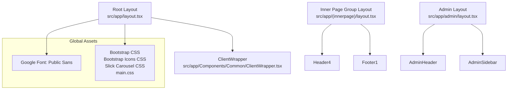
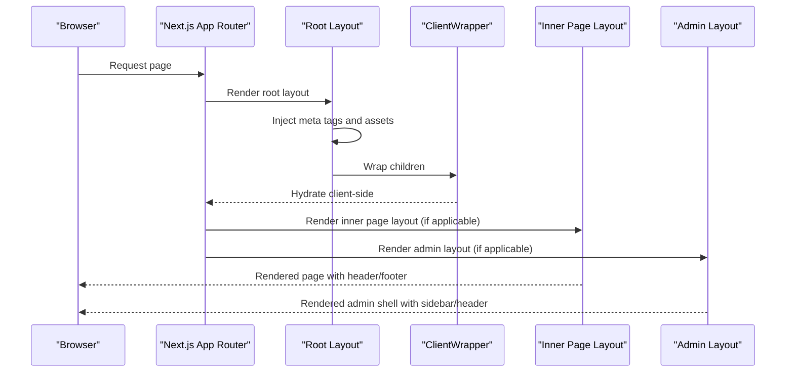
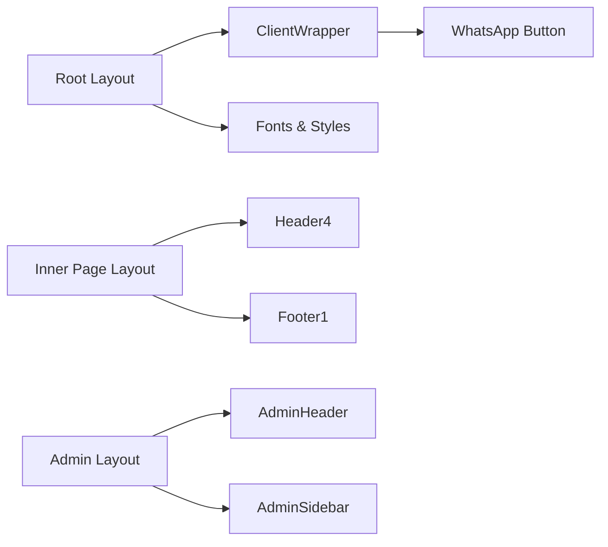

# Page Layouts and Templates

<cite>
**Referenced Files in This Document**
- [src/app/layout.tsx](file://src/app/layout.tsx)
- [src/app/(innerpage)/layout.tsx](file://src/app/(innerpage)/layout.tsx)
- [src/app/admin/layout.tsx](file://src/app/admin/layout.tsx)
- [src/app/Components/Common/ClientWrapper.tsx](file://src/app/Components/Common/ClientWrapper.tsx)
- [src/app/Components/Common/LazyWrapper.tsx](file://src/app/Components/Common/LazyWrapper.tsx)
- [src/app/page.tsx](file://src/app/page.tsx)
</cite>

## Table of Contents
1. [Introduction](#introduction)
2. [Project Structure](#project-structure)
3. [Core Components](#core-components)
4. [Architecture Overview](#architecture-overview)
5. [Detailed Component Analysis](#detailed-component-analysis)
6. [Dependency Analysis](#dependency-analysis)
7. [Performance Considerations](#performance-considerations)
8. [Troubleshooting Guide](#troubleshooting-guide)
9. [Conclusion](#conclusion)

## Introduction
This document explains the page layout architecture and template system used in the project. It covers the root layout configuration, inner page layouts, and wrapper components. It documents the ClientWrapper pattern for client-side hydration, the LazyWrapper pattern for performance optimization, and how layouts compose across the Next.js App Router. It also describes meta tag management, asset loading strategies, responsive breakpoints, and SEO meta tag injection.

## Project Structure
The layout system is organized around three primary layout roots:
- Root layout: Defines global HTML, fonts, styles, and analytics scripts, and wraps all pages with a client-side wrapper.
- Inner page group layout: Provides a default page area with header and footer for inner pages.
- Admin layout: Provides a responsive admin shell with sidebar and header.

**Diagram sources**
- [src/app/layout.tsx](file://src/app/layout.tsx#L1-L47)
- [src/app/(innerpage)/layout.tsx](file://src/app/(innerpage)/layout.tsx#L1-L15)
- [src/app/admin/layout.tsx](file://src/app/admin/layout.tsx#L1-L23)
- [src/app/Components/Common/ClientWrapper.tsx](file://src/app/Components/Common/ClientWrapper.tsx#L1-L11)

**Section sources**
- [src/app/layout.tsx](file://src/app/layout.tsx#L1-L47)
- [src/app/(innerpage)/layout.tsx](file://src/app/(innerpage)/layout.tsx#L1-L15)
- [src/app/admin/layout.tsx](file://src/app/admin/layout.tsx#L1-L23)

## Core Components
- Root layout: Sets the HTML document structure, loads fonts and styles, injects analytics scripts, and wraps children with ClientWrapper for client-side hydration.
- Inner page group layout: Provides a default page area with a header and footer for pages under the inner page route group.
- Admin layout: Provides a responsive admin shell with a fixed header and collapsible sidebar, rendering child content in a main panel.
- ClientWrapper: Ensures client-side hydration and renders a persistent WhatsApp button.
- LazyWrapper: A lightweight wrapper intended to defer rendering of heavy components until hydration completes.

**Section sources**
- [src/app/layout.tsx](file://src/app/layout.tsx#L14-L46)
- [src/app/(innerpage)/layout.tsx](file://src/app/(innerpage)/layout.tsx#L5-L13)
- [src/app/admin/layout.tsx](file://src/app/admin/layout.tsx#L6-L22)
- [src/app/Components/Common/ClientWrapper.tsx](file://src/app/Components/Common/ClientWrapper.tsx#L4-L10)
- [src/app/Components/Common/LazyWrapper.tsx](file://src/app/Components/Common/LazyWrapper.tsx#L3-L49)

## Architecture Overview
The layout architecture follows Next.js App Router conventions:
- Root layout defines global HTML, meta tags, fonts, and styles.
- Route groups encapsulate related pages with shared layouts.
- Wrapper components manage client-side hydration and optional lazy rendering.

**Diagram sources**
- [src/app/layout.tsx](file://src/app/layout.tsx#L14-L46)
- [src/app/Components/Common/ClientWrapper.tsx](file://src/app/Components/Common/ClientWrapper.tsx#L4-L10)
- [src/app/(innerpage)/layout.tsx](file://src/app/(innerpage)/layout.tsx#L5-L13)
- [src/app/admin/layout.tsx](file://src/app/admin/layout.tsx#L6-L22)

## Detailed Component Analysis

### Root Layout
Responsibilities:
- Define the HTML document structure and language.
- Load fonts and global styles.
- Inject meta tags and performance hints.
- Inject analytics scripts.
- Wrap children with ClientWrapper for client-side hydration.

Key behaviors:
- Meta tags include author, favicon, and preconnect/dns-prefetch entries.
- Analytics script injection uses a self-executing script block.
- Body class applies a font variable for typography.

Integration points:
- ClientWrapper ensures client-side interactivity after SSR.
- Inner page and admin layouts render inside this root.

**Section sources**
- [src/app/layout.tsx](file://src/app/layout.tsx#L14-L46)

### Inner Page Group Layout
Responsibilities:
- Provide a consistent page area with a header and footer for inner pages.
- Encapsulate route group styling and structure.

Composition:
- Renders Header4 and Footer1 around the page’s children.
- Wrapping occurs outside the root layout via the route group.

**Section sources**
- [src/app/(innerpage)/layout.tsx](file://src/app/(innerpage)/layout.tsx#L5-L13)

### Admin Layout
Responsibilities:
- Provide a responsive admin shell with a fixed header and collapsible sidebar.
- Render child content in a flexible main panel.

Structure:
- Uses Bootstrap utilities for responsiveness and layout.
- AdminHeader and AdminSidebar are rendered alongside the main content area.

**Section sources**
- [src/app/admin/layout.tsx](file://src/app/admin/layout.tsx#L6-L22)

### ClientWrapper Pattern
Purpose:
- Ensure client-side hydration for interactive components.
- Render persistent client-side elements (e.g., a WhatsApp button) after hydration.

Behavior:
- Accepts children and renders them.
- Appends a client-side-only element after the children.

Integration:
- Wrapped by the root layout to guarantee hydration across all pages.

**Section sources**
- [src/app/Components/Common/ClientWrapper.tsx](file://src/app/Components/Common/ClientWrapper.tsx#L4-L10)
- [src/app/layout.tsx](file://src/app/layout.tsx#L40-L42)

### LazyWrapper Pattern
Purpose:
- Defer rendering of heavy components until after hydration to improve initial load performance.

Usage:
- Imported and used around heavy sections in the main page component.
- Intended to reduce server-rendered payload and improve TTFB/FCP.

Note:
- The wrapper is present in the main page component but not defined in the provided context. Its interface and behavior are inferred from usage.

**Section sources**
- [src/app/page.tsx](file://src/app/page.tsx#L14-L14)
- [src/app/page.tsx](file://src/app/page.tsx#L37-L60)

### Layout Composition Examples
- Root → ClientWrapper → Inner Page Layout → Page content.
- Root → Admin Layout → Admin content.
- Inner Page Layout provides a consistent header/footer for pages under the inner page route group.

Responsive breakpoints:
- Admin layout uses Bootstrap grid utilities to adapt to different screen sizes.
- Inner page layout relies on its own internal responsive classes.

**Section sources**
- [src/app/layout.tsx](file://src/app/layout.tsx#L40-L42)
- [src/app/admin/layout.tsx](file://src/app/admin/layout.tsx#L11-L21)
- [src/app/(innerpage)/layout.tsx](file://src/app/(innerpage)/layout.tsx#L7-L11)

### Meta Tag Management and Asset Loading
Meta tags:
- Author, favicon, and preconnect/dns-prefetch entries are injected in the root layout head.
- Analytics scripts are injected via inline script blocks.

Assets:
- Google Fonts (Public Sans) and CSS libraries (Bootstrap, Bootstrap Icons, Slick Carousel) are loaded globally.
- A project-wide stylesheet is included.

SEO considerations:
- Meta author and favicon are set at the root level.
- Additional page-specific metadata can be managed via page components and metadata APIs.

**Section sources**
- [src/app/layout.tsx](file://src/app/layout.tsx#L17-L38)
- [src/app/layout.tsx](file://src/app/layout.tsx#L8-L12)

### Concurrent Rendering Patterns
- The root layout and wrappers are designed to work with Next.js concurrent rendering by keeping client-side hydration minimal and predictable.
- ClientWrapper isolates client-side behavior, enabling safe concurrent rendering of server-rendered content.

**Section sources**
- [src/app/layout.tsx](file://src/app/layout.tsx#L40-L42)
- [src/app/Components/Common/ClientWrapper.tsx](file://src/app/Components/Common/ClientWrapper.tsx#L4-L10)

## Dependency Analysis
The layout system exhibits clear separation of concerns:
- Root layout depends on ClientWrapper and global assets.
- Inner page group layout depends on Header4 and Footer1.
- Admin layout depends on AdminHeader and AdminSidebar.
- ClientWrapper depends on client-side-only components.

**Diagram sources**
- [src/app/layout.tsx](file://src/app/layout.tsx#L1-L47)
- [src/app/(innerpage)/layout.tsx](file://src/app/(innerpage)/layout.tsx#L1-L15)
- [src/app/admin/layout.tsx](file://src/app/admin/layout.tsx#L1-L23)
- [src/app/Components/Common/ClientWrapper.tsx](file://src/app/Components/Common/ClientWrapper.tsx#L1-L11)

**Section sources**
- [src/app/layout.tsx](file://src/app/layout.tsx#L1-L47)
- [src/app/(innerpage)/layout.tsx](file://src/app/(innerpage)/layout.tsx#L1-L15)
- [src/app/admin/layout.tsx](file://src/app/admin/layout.tsx#L1-L23)
- [src/app/Components/Common/ClientWrapper.tsx](file://src/app/Components/Common/ClientWrapper.tsx#L1-L11)

## Performance Considerations
- ClientWrapper ensures client-side hydration occurs after SSR, reducing hydration overhead.
- LazyWrapper usage defers heavy components to after hydration, improving initial load metrics.
- Global assets are loaded in the root layout to avoid duplication across pages.
- Preconnect and dns-prefetch entries reduce third-party resource latency.

Recommendations:
- Keep ClientWrapper minimal to avoid blocking hydration.
- Use LazyWrapper for components that are not critical above the fold.
- Audit asset sizes and defer non-critical resources.

**Section sources**
- [src/app/Components/Common/ClientWrapper.tsx](file://src/app/Components/Common/ClientWrapper.tsx#L4-L10)
- [src/app/page.tsx](file://src/app/page.tsx#L37-L60)
- [src/app/layout.tsx](file://src/app/layout.tsx#L21-L24)

## Troubleshooting Guide
Common issues and resolutions:
- Client-side components not hydrating: Verify ClientWrapper is wrapping the page content and that the component is marked as client.
- Missing fonts or styles: Confirm global asset imports in the root layout are present and reachable.
- Admin layout not responsive: Ensure Bootstrap utilities are properly imported and used in the Admin layout.
- Analytics not firing: Check that the analytics script is included in the root layout head and that inline script execution is allowed.

**Section sources**
- [src/app/layout.tsx](file://src/app/layout.tsx#L17-L38)
- [src/app/layout.tsx](file://src/app/layout.tsx#L2-L5)
- [src/app/admin/layout.tsx](file://src/app/admin/layout.tsx#L11-L21)
- [src/app/Components/Common/ClientWrapper.tsx](file://src/app/Components/Common/ClientWrapper.tsx#L4-L10)

## Conclusion
The layout system leverages Next.js App Router conventions to provide a clean separation between global and page-specific layouts. The root layout centralizes asset and meta management, while ClientWrapper ensures client-side hydration. Inner page and admin layouts encapsulate reusable UI shells. LazyWrapper supports performance optimization by deferring heavy components. Together, these patterns enable scalable, maintainable, and performant page rendering.