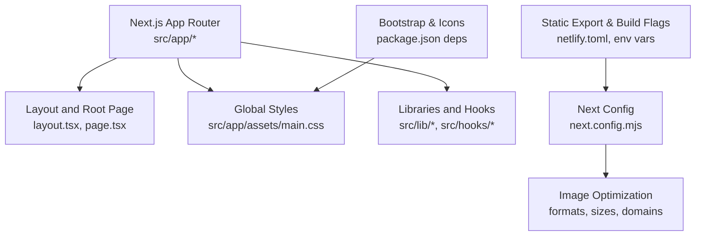
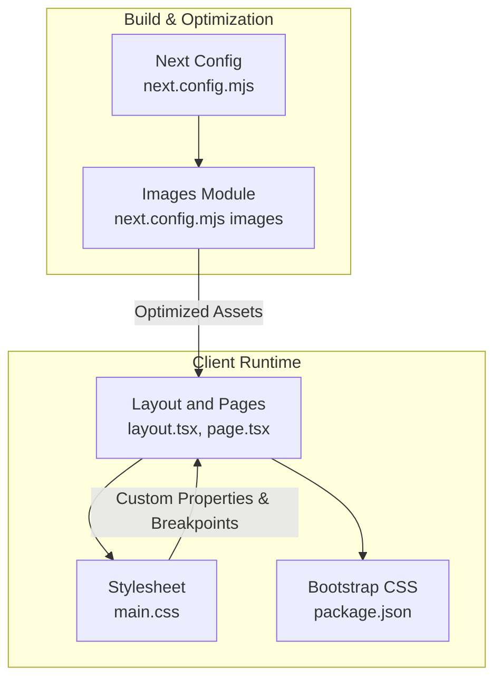
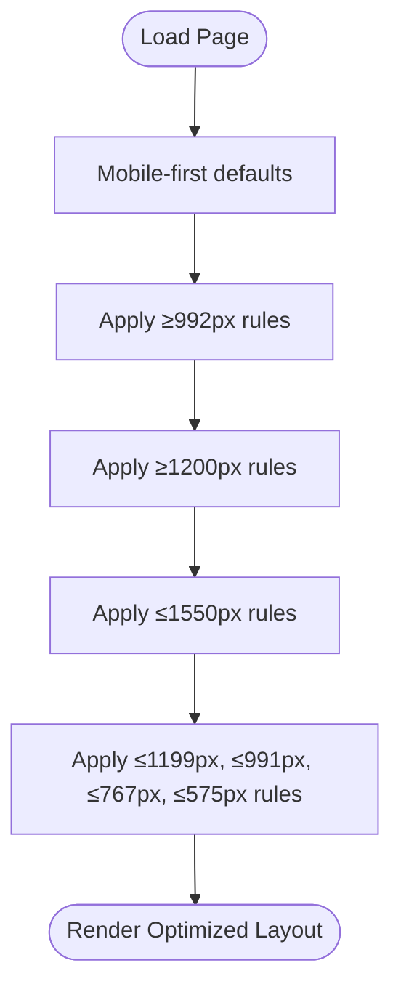
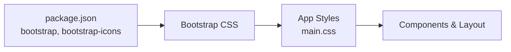
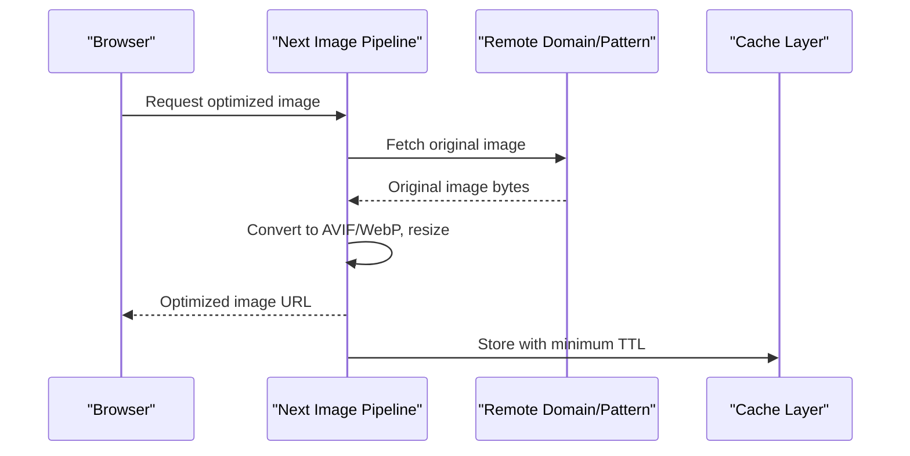
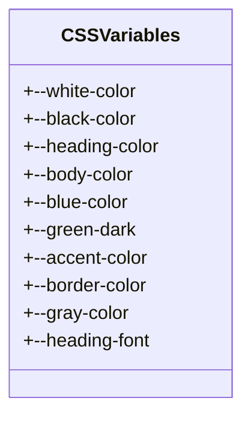
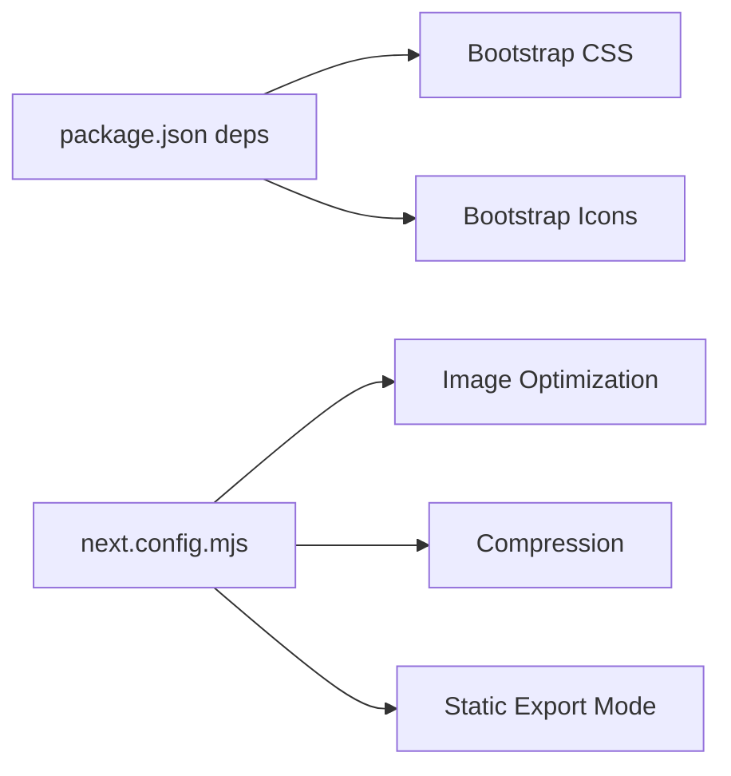

# Responsive Design and Performance

<cite>
**Referenced Files in This Document**
- [README.md](file://README.md)
- [package.json](file://package.json)
- [next.config.mjs](file://next.config.mjs)
- [src/app/assets/main.css](file://src/app/assets/main.css)
- [src/app/layout.tsx](file://src/app/layout.tsx)
- [src/app/page.tsx](file://src/app/page.tsx)
- [src/lib/image-tracker.ts](file://src/lib/image-tracker.ts)
- [src/hooks/usePageMetadata.ts](file://src/hooks/usePageMetadata.ts)
- [src/hooks/useFilePageMetadata.ts](file://src/hooks/useFilePageMetadata.ts)
- [netlify.toml](file://netlify.toml)
- [public/favicon.ico](file://public/favicon.ico)
- [public/robots.txt](file://public/robots.txt)
- [public/sitemap.xml](file://public/sitemap.xml)
</cite>

## Table of Contents
1. [Introduction](#introduction)
2. [Project Structure](#project-structure)
3. [Core Components](#core-components)
4. [Architecture Overview](#architecture-overview)
5. [Detailed Component Analysis](#detailed-component-analysis)
6. [Dependency Analysis](#dependency-analysis)
7. [Performance Considerations](#performance-considerations)
8. [Troubleshooting Guide](#troubleshooting-guide)
9. [Conclusion](#conclusion)
10. [Appendices](#appendices)

## Introduction
This document explains how the project implements responsive design and performance optimization. It covers the responsive breakpoint system, Bootstrap grid integration, mobile-first principles, background image loading optimization, performance monitoring components, asset loading strategies, WhatsApp button integration, lazy loading, critical rendering path optimization, CSS custom properties usage, font loading strategies, preconnect/dns-prefetch configurations, performance metrics collection, Core Web Vitals optimization, and mobile performance considerations.

## Project Structure
The project is a Next.js application using React 19 and Next 15. It integrates Bootstrap 5 and Bootstrap Icons for UI components and typography. The main stylesheet defines custom properties and responsive breakpoints. The configuration enables image optimization, compression, and static export for hosting environments.

**Diagram sources**
- [next.config.mjs](file://next.config.mjs#L1-L129)
- [package.json](file://package.json#L12-L31)
- [src/app/assets/main.css](file://src/app/assets/main.css#L1-L200)
- [src/app/layout.tsx](file://src/app/layout.tsx)
- [src/app/page.tsx](file://src/app/page.tsx)
- [netlify.toml](file://netlify.toml)

**Section sources**
- [README.md](file://README.md#L1-L37)
- [package.json](file://package.json#L12-L31)
- [next.config.mjs](file://next.config.mjs#L1-L129)

## Core Components
- Responsive styles and breakpoints: Defined in the global stylesheet using media queries targeting tablet, desktop, and larger screens.
- Bootstrap integration: Installed via npm; Bootstrap CSS and icons are included as dependencies.
- Image optimization: Next.js Image optimization with AVIF/WebP formats, device sizes, and remote domain/pattern allowances.
- Compression and build flags: Gzip compression enabled; console logs removed in production builds.
- Static export mode: Conditional output and trailing slash adjustments for cPanel static export.

**Section sources**
- [src/app/assets/main.css](file://src/app/assets/main.css#L534-L9014)
- [package.json](file://package.json#L18-L29)
- [next.config.mjs](file://next.config.mjs#L10-L126)

## Architecture Overview
The responsive and performance architecture centers on:
- Global CSS with custom properties for theme tokens and typography.
- Media queries for breakpoint-driven layouts aligned with Bootstrap’s typical breakpoints.
- Next.js image optimization pipeline for background and content images.
- Static export configuration for hosting flexibility.

**Diagram sources**
- [src/app/assets/main.css](file://src/app/assets/main.css#L32-L46)
- [src/app/assets/main.css](file://src/app/assets/main.css#L534-L9014)
- [next.config.mjs](file://next.config.mjs#L10-L126)
- [package.json](file://package.json#L18-L29)

## Detailed Component Analysis

### Responsive Breakpoint System
- Breakpoints are defined using media queries targeting tablet (≥992px), desktop (≥1200px), and smaller screens (≤991px, ≤767px, ≤575px).
- These breakpoints enable a mobile-first approach with progressively enhanced layouts for larger screens.
- Custom spacing utilities and height utilities are scoped to specific breakpoints to maintain consistent spacing across devices.

**Diagram sources**
- [src/app/assets/main.css](file://src/app/assets/main.css#L534-L9014)

**Section sources**
- [src/app/assets/main.css](file://src/app/assets/main.css#L534-L9014)

### Bootstrap Grid Integration
- Bootstrap 5 and Bootstrap Icons are installed as dependencies.
- The project relies on Bootstrap utility classes for layout and spacing alongside custom CSS for branding and typography.
- No explicit import of Bootstrap SCSS is present in the provided files; CSS is included via npm dependencies.

**Diagram sources**
- [package.json](file://package.json#L18-L29)
- [src/app/assets/main.css](file://src/app/assets/main.css#L1-L200)

**Section sources**
- [package.json](file://package.json#L18-L29)

### Mobile-First Design Principles
- Base styles target small screens first; larger screen enhancements are layered via media queries.
- Typography scales appropriately across breakpoints, and transitions/animations are applied consistently.
- Images are responsive by default, constrained to container widths.

**Section sources**
- [src/app/assets/main.css](file://src/app/assets/main.css#L51-L138)
- [src/app/assets/main.css](file://src/app/assets/main.css#L534-L9014)

### Background Image Loading Optimization
- Next.js Image optimization is configured with AVIF/WebP formats, multiple device sizes, and remote domain/pattern allowances.
- For background images rendered via inline styles or components, prefer Next.js Image with appropriate sizing and formats to reduce bandwidth and improve rendering performance.
- The configuration also sets a minimum cache TTL and allows SVG content for icons and illustrations.

**Diagram sources**
- [next.config.mjs](file://next.config.mjs#L10-L126)

**Section sources**
- [next.config.mjs](file://next.config.mjs#L10-L126)

### Performance Monitoring Components
- The project includes libraries for image tracking and metadata hooks, indicating potential instrumentation points for performance metrics collection.
- Consider integrating Core Web Vitals reporting and custom metrics collection using the existing hooks and libraries as entry points.

**Section sources**
- [src/lib/image-tracker.ts](file://src/lib/image-tracker.ts)
- [src/hooks/usePageMetadata.ts](file://src/hooks/usePageMetadata.ts)
- [src/hooks/useFilePageMetadata.ts](file://src/hooks/useFilePageMetadata.ts)

### Asset Loading Strategies
- Static export mode is supported conditionally via environment variables, enabling deployment to platforms that require static HTML/CSS/JS.
- Trailing slashes and output modes are adjusted for static export compatibility.
- Compression is enabled to reduce payload sizes.

**Section sources**
- [next.config.mjs](file://next.config.mjs#L2-L9)
- [next.config.mjs](file://next.config.mjs#L124-L126)

### WhatsApp Button Integration
- The project includes a WhatsApp icon in the public assets, suggesting a button component for customer engagement.
- Integrate the icon with a link or action handler, ensuring accessibility and proper attribution.

**Section sources**
- [public/assets/img/icons/whatsapp.svg](file://public/assets/img/icons/whatsapp.svg)

### Lazy Loading Implementations
- Next.js Image components automatically lazy-load when used in pages; ensure background images leverage the optimized image pipeline for lazy-loading benefits.
- For non-Image components, consider IntersectionObserver-based lazy loading for offscreen content.

[No sources needed since this section provides general guidance]

### Critical Rendering Path Optimization
- Minimize render-blocking resources and defer non-critical CSS/JS.
- Use Next.js automatic code splitting and dynamic imports for route-specific bundles.
- Keep base styles minimal and defer heavy animations until after initial paint.

[No sources needed since this section provides general guidance]

### CSS Custom Properties Usage
- The stylesheet defines a set of custom properties for colors, fonts, and theme tokens.
- These variables unify design tokens and simplify maintenance across components.

**Diagram sources**
- [src/app/assets/main.css](file://src/app/assets/main.css#L32-L46)

**Section sources**
- [src/app/assets/main.css](file://src/app/assets/main.css#L32-L46)

### Font Loading Strategies
- The project uses Next.js font optimization for improved performance and privacy.
- Combine with preloading critical font subsets and deferring non-critical weights to minimize CLS and FCP.

**Section sources**
- [README.md](file://README.md#L21-L21)

### Preconnect/DNS-Prefetch Configurations
- Configure preconnect for external image domains and dns-prefetch for frequently used origins to reduce latency.
- Add rel="preconnect" and/or rel="dns-prefetch" in the document head for domains in the image configuration.

**Section sources**
- [next.config.mjs](file://next.config.mjs#L13-L105)

## Dependency Analysis
The project’s responsive and performance characteristics depend on:
- Bootstrap and Bootstrap Icons for UI primitives.
- Next.js configuration for image optimization, compression, and static export.
- Environment-specific flags for deployment targets.

**Diagram sources**
- [package.json](file://package.json#L18-L29)
- [next.config.mjs](file://next.config.mjs#L10-L126)

**Section sources**
- [package.json](file://package.json#L18-L29)
- [next.config.mjs](file://next.config.mjs#L10-L126)

## Performance Considerations
- Image formats: AVIF/WebP conversion reduces payload size; ensure fallbacks for older browsers.
- Device sizes: Tune deviceSizes and imageSizes to match typical viewport widths and device pixel ratios.
- Remote domains: Whitelist trusted domains and patterns to avoid unnecessary rewrites.
- Compression: Enable gzip compression to reduce transfer size.
- Static export: Use conditional output for hosting environments requiring static artifacts.
- Metrics: Instrument Core Web Vitals and custom metrics using existing hooks and libraries.

[No sources needed since this section provides general guidance]

## Troubleshooting Guide
- Static export issues: Verify trailingSlash and output settings for the target platform.
- Image loading failures: Confirm domains/patterns in the image configuration and network connectivity.
- Console noise: Production builds remove console statements; ensure NODE_ENV is set correctly.
- Accessibility: Ensure interactive elements (e.g., WhatsApp button) have proper ARIA attributes and keyboard navigation.

**Section sources**
- [next.config.mjs](file://next.config.mjs#L2-L9)
- [next.config.mjs](file://next.config.mjs#L113-L122)

## Conclusion
The project establishes a robust foundation for responsive design and performance through a mobile-first CSS approach, Bootstrap integration, and Next.js image optimization. By leveraging the provided configuration, custom properties, and hooks, teams can further refine Core Web Vitals, optimize asset delivery, and deliver fast, accessible experiences across devices.

[No sources needed since this section summarizes without analyzing specific files]

## Appendices
- Deployment configuration: Review Netlify configuration for routing and redirects.
- Sitemaps and robots: Ensure crawlers can discover pages and assets efficiently.

**Section sources**
- [netlify.toml](file://netlify.toml)
- [public/robots.txt](file://public/robots.txt)
- [public/sitemap.xml](file://public/sitemap.xml)