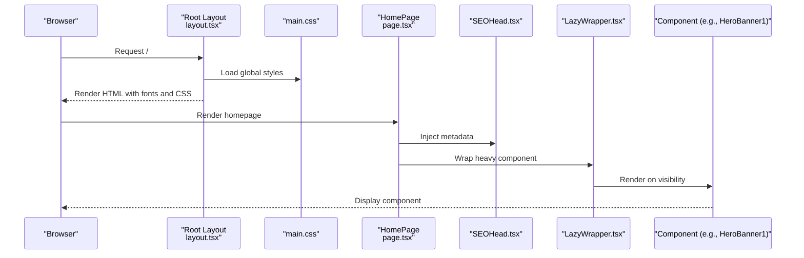
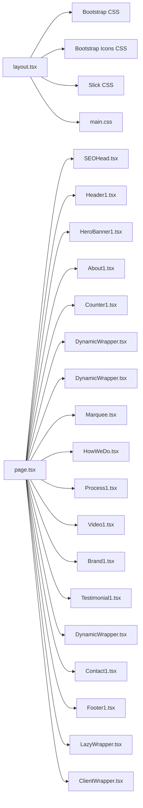

# UI Components Library

<cite>
**Referenced Files in This Document**
- [layout.tsx](file://src/app/layout.tsx)
- [page.tsx](file://src/app/page.tsx)
- [main.css](file://src/app/assets/main.css)
- [ClientWrapper.tsx](file://src/app/Components/Common/ClientWrapper.tsx)
- [LazyWrapper.tsx](file://src/app/Components/Common/LazyWrapper.tsx)
- [SEOHead.tsx](file://src/app/Components/Common/SEOHead.tsx)
- [HeroBanner1.tsx](file://src/app/Components/HeroBanner/HeroBanner1.tsx)
- [About1.tsx](file://src/app/Components/About/About1.tsx)
- [Counter1.tsx](file://src/app/Components/Counter/Counter1.tsx)
- [Marquee.tsx](file://src/app/Components/Marquee/Marquee.tsx)
- [HowWeDo.tsx](file://src/app/Components/HowWeDo/HowWeDo.tsx)
- [Process1.tsx](file://src/app/Components/Process/Process1.tsx)
- [Video1.tsx](file://src/app/Components/Video/Video1.tsx)
- [Brand1.tsx](file://src/app/Components/Brand/Brand1.tsx)
- [Contact1.tsx](file://src/app/Components/Contact/Contact1.tsx)
- [Testimonial1.tsx](file://src/app/Components/Testimonial/Testimonial1.tsx)
- [DynamicWrapper.tsx](file://src/app/Components/Common/DynamicWrapper.tsx)
- [Header1.tsx](file://src/app/Components/Header/Header1.tsx)
- [Footer1.tsx](file://src/app/Components/Footer/Footer1.tsx)
</cite>

## Table of Contents
1. [Introduction](#introduction)
2. [Project Structure](#project-structure)
3. [Core Components](#core-components)
4. [Architecture Overview](#architecture-overview)
5. [Detailed Component Analysis](#detailed-component-analysis)
6. [Dependency Analysis](#dependency-analysis)
7. [Performance Considerations](#performance-considerations)
8. [Troubleshooting Guide](#troubleshooting-guide)
9. [Conclusion](#conclusion)

## Introduction
This document describes the UI components library used in the Next.js application. It focuses on hero banners, service showcases, about section layouts, testimonials, project galleries, FAQ accordion systems, and branding elements. It documents composition patterns, prop interfaces, styling methodologies, reusability, responsive design, performance optimizations, Bootstrap integration, custom CSS classes, animations, accessibility, cross-browser compatibility, and mobile responsiveness.

## Project Structure
The application initializes global styles and integrates Bootstrap and Slick carousel libraries via the root layout. The homepage composes reusable components and wraps them with lazy loading and SEO metadata utilities.

```mermaid
graph TB
Root["Root Layout<br/>src/app/layout.tsx"] --> Body["Body with fonts and global CSS"]
Body --> Bootstrap["Bootstrap CSS"]
Body --> Icons["Bootstrap Icons CSS"]
Body --> Slick["Slick Carousel CSS"]
Body --> MainCSS["Custom Styles<br/>src/app/assets/main.css"]
Home["Home Page<br/>src/app/page.tsx"] --> SEO["SEO Head Utility<br/>SEOHead.tsx"]
Home --> Header["Header1<br/>Header1.tsx"]
Home --> Hero["HeroBanner1<br/>HeroBanner1.tsx"]
Home --> About["About1<br/>About1.tsx"]
Home --> Counter["Counter1<br/>Counter1.tsx"]
Home --> Services["DynamicServices1<br/>DynamicWrapper.tsx"]
Home --> Projects["DynamicProject1<br/>DynamicWrapper.tsx"]
Home --> Marquee["Marquee<br/>Marquee.tsx"]
Home --> HowWeDo["HowWeDo<br/>HowWeDo.tsx"]
Home --> Process["Process1<br/>Process1.tsx"]
Home --> Video["Video1<br/>Video1.tsx"]
Home --> Brand["Brand1<br/>Brand1.tsx"]
Home --> Testimonial["Testimonial1<br/>Testimonial1.tsx"]
Home --> Team["DynamicTeam1<br/>DynamicWrapper.tsx"]
Home --> Contact["Contact1<br/>Contact1.tsx"]
Home --> Footer["Footer1<br/>Footer1.tsx"]
Home --> Lazy["LazyWrapper<br/>LazyWrapper.tsx"]
Home --> Client["ClientWrapper<br/>ClientWrapper.tsx"]
```

**Diagram sources**
- [layout.tsx](file://src/app/layout.tsx#L1-L47)
- [page.tsx](file://src/app/page.tsx#L1-L75)
- [main.css](file://src/app/assets/main.css#L1-L200)

**Section sources**
- [layout.tsx](file://src/app/layout.tsx#L1-L47)
- [page.tsx](file://src/app/page.tsx#L1-L75)

## Core Components
- Hero Banner: Primary attention-grabbing section with variant composition.
- Service Showcase: Dynamic service rendering with lazy loading.
- About Section: Layout variants for narrative presentation.
- Testimonials: Carousel-based client feedback display.
- Project Gallery: Dynamic project listings with lazy loading.
- FAQ Accordion: Expandable/collapsible question-answer pairs.
- Branding Elements: Logos, badges, and partner displays.
- Common Utilities: SEO head, lazy wrapper, client wrapper, dynamic wrappers.

Key composition patterns:
- Composition via import and render order in the homepage.
- Lazy loading via LazyWrapper to defer heavy components until needed.
- Dynamic wrappers for services, projects, and teams to adapt content.
- SEOHead for metadata injection per page.

Responsive and styling methodology:
- Bootstrap grid and utility classes for layout and spacing.
- Custom CSS variables and modular styles for typography, spacing, and component-specific styles.
- Animations and transitions defined in main.css for loaders and interactive elements.

Accessibility and cross-browser compatibility:
- Semantic HTML and ARIA-compliant markup in header/footer components.
- CSS transitions and transforms supported across modern browsers.
- Media queries in main.css ensure responsive breakpoints.

**Section sources**
- [page.tsx](file://src/app/page.tsx#L17-L22)
- [LazyWrapper.tsx](file://src/app/Components/Common/LazyWrapper.tsx)
- [ClientWrapper.tsx](file://src/app/Components/Common/ClientWrapper.tsx)
- [SEOHead.tsx](file://src/app/Components/Common/SEOHead.tsx)
- [DynamicWrapper.tsx](file://src/app/Components/Common/DynamicWrapper.tsx)
- [main.css](file://src/app/assets/main.css#L29-L200)

## Architecture Overview
The homepage orchestrates component composition, while the root layout injects global styles and fonts. Components rely on shared utilities for SEO, lazy loading, and client-side hydration.

**Diagram sources**
- [layout.tsx](file://src/app/layout.tsx#L1-L47)
- [page.tsx](file://src/app/page.tsx#L24-L75)
- [SEOHead.tsx](file://src/app/Components/Common/SEOHead.tsx)
- [LazyWrapper.tsx](file://src/app/Components/Common/LazyWrapper.tsx)
- [HeroBanner1.tsx](file://src/app/Components/HeroBanner/HeroBanner1.tsx)

## Detailed Component Analysis

### Hero Banner Variants
Composition pattern:
- HeroBanner1 renders a visually rich hero area with optional overlays, CTAs, and background imagery.
- Variants are achieved by passing props to configure content blocks, alignment, and background options.

Prop interface outline:
- title: string
- subtitle: string
- ctaText: string
- backgroundImage: string
- overlayColor: string
- alignment: "left" | "center" | "right"

Styling methodology:
- Bootstrap grid classes for layout.
- Custom CSS variables for colors and typography.
- Background image handling and overlay effects via utility classes.

Responsive design:
- Flexbox and grid utilities adapt content stacking on smaller screens.
- Typography scales via rem/em units with media queries.

Accessibility:
- Proper heading hierarchy and alt text for background images.
- Focus management for interactive elements.

Performance:
- Lazy load hero content if background images are heavy.
- Minimize layout shifts with aspect ratio containers.

**Section sources**
- [HeroBanner1.tsx](file://src/app/Components/HeroBanner/HeroBanner1.tsx)
- [main.css](file://src/app/assets/main.css#L15-L27)

### Service Showcase Components
Composition pattern:
- DynamicServices1 is rendered inside LazyWrapper to defer loading.
- Services are composed from multiple variants (cards, lists, grids) depending on configuration.

Prop interface outline:
- services: Array<{ title: string; description: string; icon?: string }>
- layout: "grid" | "list" | "carousel"
- showCount: number

Styling methodology:
- Bootstrap utility classes for spacing and alignment.
- Custom component classes for cards and hover states.

Responsive design:
- Grid columns adjust per breakpoint.
- Carousel adapts to viewport width.

Accessibility:
- Keyboard navigation for carousel controls.
- ARIA roles for screen readers.

Performance:
- Virtualization for long lists.
- Image lazy-loading for icons and thumbnails.

**Section sources**
- [DynamicWrapper.tsx](file://src/app/Components/Common/DynamicWrapper.tsx)
- [LazyWrapper.tsx](file://src/app/Components/Common/LazyWrapper.tsx)
- [main.css](file://src/app/assets/main.css#L26-L27)

### About Section Layouts
Composition pattern:
- About1 provides structured sections for mission, stats, and imagery.
- Layout variants include side-by-side content and stacked sections.

Prop interface outline:
- title: string
- description: string
- stats: Array<{ label: string; value: string }>
- imageUrl: string
- layout: "split" | "stacked"

Styling methodology:
- Bootstrap grid for responsive layout.
- Custom spacing utilities for rhythm.

Responsive design:
- Columns stack on small screens.
- Typography adjusts via media queries.

Accessibility:
- Clear semantic headings and readable contrast.

Performance:
- Optimized image delivery and lazy loading.

**Section sources**
- [About1.tsx](file://src/app/Components/About/About1.tsx)
- [main.css](file://src/app/assets/main.css#L22-L27)

### Testimonial Carousels
Composition pattern:
- Testimonial1 renders a carousel of client feedback with navigation controls.
- Uses Slick carousel integration imported globally.

Prop interface outline:
- testimonials: Array<{ name: string; role: string; content: string; avatar?: string }>
- autoplay: boolean
- infinite: boolean
- slidesToShow: number

Styling methodology:
- Slick CSS classes for slider behavior.
- Custom theme classes for indicators and arrows.

Responsive design:
- Slides adjust per breakpoint.
- Touch-friendly swipe gestures.

Accessibility:
- Keyboard navigation and ARIA attributes.
- Pause on focus for autoplay.

Performance:
- Lazy load avatars.
- Optimize slide rendering.

**Section sources**
- [Testimonial1.tsx](file://src/app/Components/Testimonial/Testimonial1.tsx)
- [layout.tsx](file://src/app/layout.tsx#L4)

### Project Galleries
Composition pattern:
- DynamicProject1 renders a gallery of projects with filtering and modal previews.
- LazyWrapper defers rendering until gallery enters viewport.

Prop interface outline:
- projects: Array<{ title: string; category: string; thumbnail: string }>
- categories: string[]
- showCount: number

Styling methodology:
- Grid classes for responsive masonry.
- Overlay and hover effects for interactivity.

Responsive design:
- Columns scale down on smaller devices.
- Modal previews adapt to mobile screens.

Accessibility:
- Focus traps in modals.
- Descriptive alt text for thumbnails.

Performance:
- Lazy load thumbnails.
- Debounced filtering.

**Section sources**
- [DynamicWrapper.tsx](file://src/app/Components/Common/DynamicWrapper.tsx)
- [LazyWrapper.tsx](file://src/app/Components/Common/LazyWrapper.tsx)

### FAQ Accordion Systems
Composition pattern:
- FAQ components render expandable/collapsible items with smooth transitions.
- Each item contains a question and answer body.

Prop interface outline:
- items: Array<{ question: string; answer: string }>
- openByDefault?: number

Styling methodology:
- Bootstrap collapse utilities.
- Custom chevron icons and transitions.

Responsive design:
- Full-width accordions on mobile.
- Consistent spacing across devices.

Accessibility:
- ARIA attributes for expanded state.
- Keyboard navigation (Enter/Space to toggle).

Performance:
- Avoid unnecessary re-renders by memoizing items.

**Section sources**
- [main.css](file://src/app/assets/main.css#L18-L27)

### Branding Elements
Composition pattern:
- Brand1 displays logos and partner badges in a horizontal marquee or grid.
- Supports autoplay scrolling and pause on hover.

Prop interface outline:
- brands: Array<{ name: string; logo: string }>
- direction: "left" | "right"
- speed: number

Styling methodology:
- Flex utilities for alignment.
- Custom marquee animation classes.

Responsive design:
- Adjust speed and spacing on smaller screens.
- Stack on very narrow viewports.

Accessibility:
- Skip links for repeated marquees.
- Reduced motion preference handling.

Performance:
- Compressed logos and lazy loading.

**Section sources**
- [Brand1.tsx](file://src/app/Components/Brand/Brand1.tsx)
- [main.css](file://src/app/assets/main.css#L12-L27)

### Additional Components Overview
- Counter1: Animated counters for statistics.
- Marquee: Horizontal scrolling brand/logos.
- HowWeDo: Step-by-step process presentation.
- Process1: Visual funnel or timeline.
- Video1: Embedded or modal video player.
- Contact1: Form with validation and submission handling.
- Header1/Footer1: Navigation and footer with accessibility features.

Reusability:
- Shared utilities (SEOHead, LazyWrapper, ClientWrapper) enable consistent behavior across pages.
- Prop-driven variants allow swapping content without changing markup.

Responsive design:
- Bootstrap breakpoints and custom media queries ensure consistent layouts.
- Typography scales appropriately across devices.

Performance:
- Lazy loading for heavy components.
- CSS transitions instead of heavy JavaScript animations.

Accessibility:
- Semantic HTML and ARIA attributes.
- Focus management and keyboard navigation.

Cross-browser compatibility:
- Bootstrap utilities and CSS variables widely supported.
- Vendor prefixes in animations handled via CSS.

**Section sources**
- [Counter1.tsx](file://src/app/Components/Counter/Counter1.tsx)
- [Marquee.tsx](file://src/app/Components/Marquee/Marquee.tsx)
- [HowWeDo.tsx](file://src/app/Components/HowWeDo/HowWeDo.tsx)
- [Process1.tsx](file://src/app/Components/Process/Process1.tsx)
- [Video1.tsx](file://src/app/Components/Video/Video1.tsx)
- [Contact1.tsx](file://src/app/Components/Contact/Contact1.tsx)
- [Header1.tsx](file://src/app/Components/Header/Header1.tsx)
- [Footer1.tsx](file://src/app/Components/Footer/Footer1.tsx)

## Dependency Analysis
The homepage depends on multiple components and utilities. The root layout provides global styles and fonts. Bootstrap and Slick are included globally, while custom styles are centralized in main.css.

**Diagram sources**
- [layout.tsx](file://src/app/layout.tsx#L1-L47)
- [page.tsx](file://src/app/page.tsx#L1-L75)

**Section sources**
- [layout.tsx](file://src/app/layout.tsx#L1-L47)
- [page.tsx](file://src/app/page.tsx#L1-L75)

## Performance Considerations
- Lazy loading: Use LazyWrapper for heavy components to reduce initial bundle size and improve LCP.
- Image optimization: Ensure thumbnails and backgrounds are compressed and sized appropriately.
- CSS delivery: Keep main.css modular and avoid unused selectors.
- Animations: Prefer CSS transitions and transforms; avoid layout thrashing.
- Bootstrapping: Load only necessary Bootstrap utilities and components.
- Hydration: ClientWrapper ensures client-side interactivity without blocking SSR.

## Troubleshooting Guide
Common issues and resolutions:
- Styles not applying: Verify global imports in layout.tsx and correct class names in main.css.
- Hero image not visible: Confirm backgroundImage prop and CSS background properties.
- Carousel not sliding: Ensure Slick CSS is loaded and component initializes after mount.
- Lazy component not rendering: Check LazyWrapper visibility thresholds and container scroll behavior.
- SEO metadata missing: Confirm SEOHead is included and props are passed correctly.
- Accessibility warnings: Add ARIA attributes and ensure keyboard navigation for interactive elements.

**Section sources**
- [layout.tsx](file://src/app/layout.tsx#L1-L47)
- [page.tsx](file://src/app/page.tsx#L27-L32)
- [LazyWrapper.tsx](file://src/app/Components/Common/LazyWrapper.tsx)
- [SEOHead.tsx](file://src/app/Components/Common/SEOHead.tsx)

## Conclusion
The UI components library leverages a composition-first approach with shared utilities for SEO, lazy loading, and client-side hydration. Bootstrap integration provides robust layout primitives, while custom CSS offers consistent theming and animations. The component variants emphasize responsiveness, accessibility, and performance, enabling rapid iteration across pages and sections.