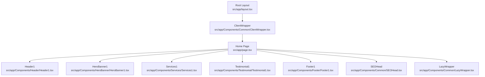
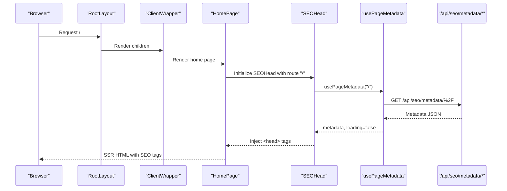
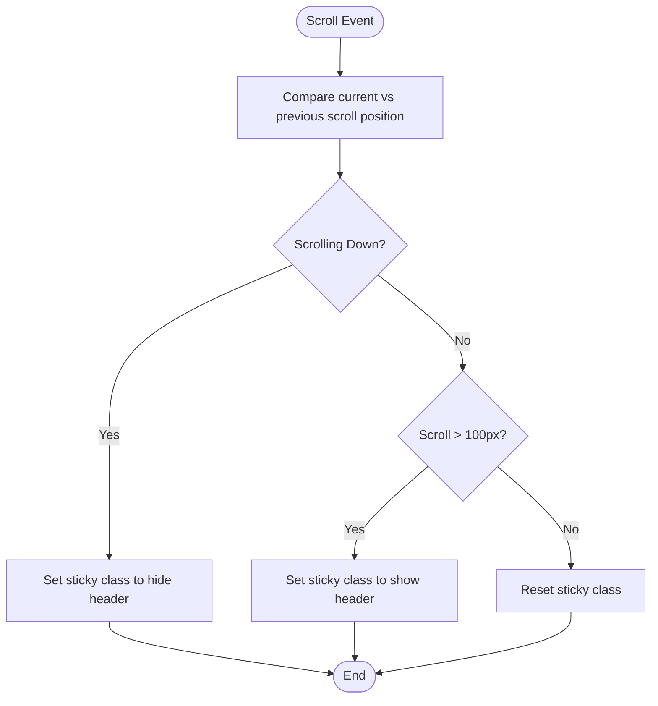
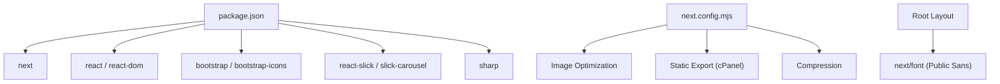

# Website Frontend

<cite>
**Referenced Files in This Document**
- [README.md](file://README.md)
- [package.json](file://package.json)
- [next.config.mjs](file://next.config.mjs)
- [src/app/layout.tsx](file://src/app/layout.tsx)
- [src/app/page.tsx](file://src/app/page.tsx)
- [src/app/Components/Common/ClientWrapper.tsx](file://src/app/Components/Common/ClientWrapper.tsx)
- [src/app/Components/Common/LazyWrapper.tsx](file://src/app/Components/Common/LazyWrapper.tsx)
- [src/app/Components/Common/WhatsAppButton.tsx](file://src/app/Components/Common/WhatsAppButton.tsx)
- [src/app/Components/Common/SEOHead.tsx](file://src/app/Components/Common/SEOHead.tsx)
- [src/app/Components/Header/Header1.tsx](file://src/app/Components/Header/Header1.tsx)
- [src/app/Components/Footer/Footer1.tsx](file://src/app/Components/Footer/Footer1.tsx)
- [src/app/Components/HeroBanner/HeroBanner1.tsx](file://src/app/Components/HeroBanner/HeroBanner1.tsx)
- [src/app/Components/Testimonial/Testimonial1.tsx](file://src/app/Components/Testimonial/Testimonial1.tsx)
- [src/app/Components/Services/Services1.tsx](file://src/app/Components/Services/Services1.tsx)
- [src/hooks/usePageMetadata.ts](file://src/hooks/usePageMetadata.ts)
</cite>

## Table of Contents
1. [Introduction](#introduction)
2. [Project Structure](#project-structure)
3. [Core Components](#core-components)
4. [Architecture Overview](#architecture-overview)
5. [Detailed Component Analysis](#detailed-component-analysis)
6. [Dependency Analysis](#dependency-analysis)
7. [Performance Considerations](#performance-considerations)
8. [Troubleshooting Guide](#troubleshooting-guide)
9. [Conclusion](#conclusion)
10. [Appendices](#appendices)

## Introduction
This document describes the frontend system for attechglobal.com, a responsive marketing website built with Next.js App Router. The site comprises 15+ pages including Home, About, Services, Projects, Blog, Contact, Pricing, and related inner pages. It follows a component-based design with Bootstrap integration, modern UI patterns, and SEO-first page structures. The documentation covers the header and footer navigation systems, hero banners, service showcases, testimonials, and client-side hydration via a ClientWrapper pattern. It also details responsive design, performance optimizations (lazy loading, image optimization), font loading strategies, asset optimization, accessibility, cross-browser compatibility, and mobile-first principles.

## Project Structure
The project uses Next.js App Router with a strict file-based routing model under src/app. The root layout initializes global styles, fonts, and analytics. Pages are composed from modular components organized under src/app/Components. SEO metadata is managed dynamically via an SEOHead component and a metadata hook that queries the backend API.

**Diagram sources**
- [src/app/layout.tsx](file://src/app/layout.tsx#L1-L47)
- [src/app/Components/Common/ClientWrapper.tsx](file://src/app/Components/Common/ClientWrapper.tsx#L1-L11)
- [src/app/page.tsx](file://src/app/page.tsx#L1-L75)
- [src/app/Components/Header/Header1.tsx](file://src/app/Components/Header/Header1.tsx#L1-L94)
- [src/app/Components/HeroBanner/HeroBanner1.tsx](file://src/app/Components/HeroBanner/HeroBanner1.tsx#L1-L127)
- [src/app/Components/Services/Services1.tsx](file://src/app/Components/Services/Services1.tsx#L1-L56)
- [src/app/Components/Testimonial/Testimonial1.tsx](file://src/app/Components/Testimonial/Testimonial1.tsx#L1-L124)
- [src/app/Components/Footer/Footer1.tsx](file://src/app/Components/Footer/Footer1.tsx#L1-L112)
- [src/app/Components/Common/SEOHead.tsx](file://src/app/Components/Common/SEOHead.tsx#L1-L78)
- [src/app/Components/Common/LazyWrapper.tsx](file://src/app/Components/Common/LazyWrapper.tsx#L1-L51)

**Section sources**
- [README.md](file://README.md#L1-L37)
- [package.json](file://package.json#L1-L41)
- [next.config.mjs](file://next.config.mjs#L1-L129)
- [src/app/layout.tsx](file://src/app/layout.tsx#L1-L47)
- [src/app/page.tsx](file://src/app/page.tsx#L1-L75)

## Core Components
- Root layout and global initialization:
  - Font loading via next/font (Public Sans), Bootstrap CSS, Bootstrap Icons, Slick carousel CSS, and a global stylesheet.
  - Analytics script injection and preconnect/dns-prefetch hints.
  - ClientWrapper ensures client-side interactivity and a persistent WhatsApp floating action button.
- Home page composition:
  - Uses SEOHead for dynamic SEO metadata.
  - Composes Header, Hero Banner, About, Counter, Services, Projects, Marquee, How We Do, Process, Video, Brands, Testimonials, Team, Contact, and Footer.
  - Wraps heavy sections with LazyWrapper to defer rendering until in viewport.
- ClientWrapper pattern:
  - Provides a boundary for client-side-only components and side effects.
  - Includes a fixed-position WhatsApp button for quick customer engagement.
- LazyWrapper:
  - Implements IntersectionObserver to render child components only when they enter the viewport, improving initial load performance.
- SEOHead:
  - Dynamically injects meta tags, Open Graph, Twitter cards, canonical URLs, and robots directives based on per-route metadata.
  - Falls back to default values if metadata is unavailable.

**Section sources**
- [src/app/layout.tsx](file://src/app/layout.tsx#L1-L47)
- [src/app/page.tsx](file://src/app/page.tsx#L1-L75)
- [src/app/Components/Common/ClientWrapper.tsx](file://src/app/Components/Common/ClientWrapper.tsx#L1-L11)
- [src/app/Components/Common/LazyWrapper.tsx](file://src/app/Components/Common/LazyWrapper.tsx#L1-L51)
- [src/app/Components/Common/SEOHead.tsx](file://src/app/Components/Common/SEOHead.tsx#L1-L78)

## Architecture Overview
The architecture centers on a single-page home composition that composes multiple feature sections. Each section is a self-contained component with its own styling and optional client-side behavior. The ClientWrapper isolates client-side logic, enabling smooth hydration and persistent UI elements. SEOHead integrates with a metadata hook to fetch and render page-specific SEO data from the backend.

**Diagram sources**
- [src/app/layout.tsx](file://src/app/layout.tsx#L1-L47)
- [src/app/Components/Common/ClientWrapper.tsx](file://src/app/Components/Common/ClientWrapper.tsx#L1-L11)
- [src/app/page.tsx](file://src/app/page.tsx#L1-L75)
- [src/app/Components/Common/SEOHead.tsx](file://src/app/Components/Common/SEOHead.tsx#L1-L78)
- [src/hooks/usePageMetadata.ts](file://src/hooks/usePageMetadata.ts#L1-L218)

## Detailed Component Analysis

### Header Navigation System
- Sticky behavior:
  - Uses requestAnimationFrame to optimize scroll handling and toggles sticky classes based on scroll direction and position.
- Mobile responsiveness:
  - Toggles a mobile menu state and renders a navigation component accordingly.
- Branding and actions:
  - Displays the logo and a primary CTA link to the contact page.

**Diagram sources**
- [src/app/Components/Header/Header1.tsx](file://src/app/Components/Header/Header1.tsx#L12-L42)

**Section sources**
- [src/app/Components/Header/Header1.tsx](file://src/app/Components/Header/Header1.tsx#L1-L94)

### Footer Layout
- Structure:
  - Top CTA area with animated elements.
  - Main footer grid with company info, quick links, services, and contact details.
  - Bottom bar with copyright and legal links.
- Social links:
  - Integrates Bootstrap Icons and external links for social platforms.
- Accessibility:
  - Uses aria-label attributes on interactive elements.

**Section sources**
- [src/app/Components/Footer/Footer1.tsx](file://src/app/Components/Footer/Footer1.tsx#L1-L112)

### Hero Banner
- Interactive video modal:
  - Toggles an embedded YouTube player via state updates.
- Performance:
  - Uses Next/Image with priority and lazy loading for supporting imagery.
- Social proof and stats:
  - Displays client counts, market value, and social links with lazy-loaded images.

**Section sources**
- [src/app/Components/HeroBanner/HeroBanner1.tsx](file://src/app/Components/HeroBanner/HeroBanner1.tsx#L1-L127)

### Services Showcase
- Composition:
  - Renders a grid of service items with background images and call-to-action buttons.
- Linking:
  - Provides navigation to the services page from the section.

**Section sources**
- [src/app/Components/Services/Services1.tsx](file://src/app/Components/Services/Services1.tsx#L1-L56)

### Testimonial Carousel
- Behavior:
  - Uses react-slick to create a responsive, auto-scrolling carousel with manual controls.
- Responsiveness:
  - Defines breakpoints to adjust visible slides across screen sizes.
- Accessibility:
  - Slides are visually distinct; consider adding ARIA roles and labels for improved screen reader support.

**Section sources**
- [src/app/Components/Testimonial/Testimonial1.tsx](file://src/app/Components/Testimonial/Testimonial1.tsx#L1-L124)

### ClientWrapper Pattern
- Purpose:
  - Ensures client-side-only components render after hydration.
  - Hosts persistent UI elements like the WhatsApp floating button.
- Implementation:
  - Adds the WhatsAppButton as a fixed-position element.

**Section sources**
- [src/app/Components/Common/ClientWrapper.tsx](file://src/app/Components/Common/ClientWrapper.tsx#L1-L11)
- [src/app/Components/Common/WhatsAppButton.tsx](file://src/app/Components/Common/WhatsAppButton.tsx#L1-L33)

### Lazy Loading Strategy
- IntersectionObserver:
  - LazyWrapper defers rendering until the element enters the viewport, reducing initial bundle size and improving LCP.
- Configurable thresholds and margins:
  - Tunable via props to balance perceived performance and perceived content availability.

**Section sources**
- [src/app/Components/Common/LazyWrapper.tsx](file://src/app/Components/Common/LazyWrapper.tsx#L1-L51)

### SEO Metadata Management
- Dynamic head injection:
  - SEOHead reads per-route metadata and injects appropriate meta tags, OG, Twitter, canonical, and robots directives.
- Fallback behavior:
  - Uses default values when metadata is not yet available.
- Client-side hook:
  - usePageMetadata fetches metadata from the backend API and supports pagination and search for admin use.

**Section sources**
- [src/app/Components/Common/SEOHead.tsx](file://src/app/Components/Common/SEOHead.tsx#L1-L78)
- [src/hooks/usePageMetadata.ts](file://src/hooks/usePageMetadata.ts#L1-L218)

## Dependency Analysis
- Core libraries:
  - Next.js 15, React 19, Bootstrap 5, Bootstrap Icons, react-bootstrap, react-slick, slick-carousel, sharp.
- Build-time and runtime optimizations:
  - Next.js configuration enables static export for cPanel, image optimization with WebP/AVIF, domain allowlists, and compression.
- Fonts:
  - next/font loads Public Sans with multiple weights and exposes a CSS variable for typography.

**Diagram sources**
- [package.json](file://package.json#L12-L31)
- [next.config.mjs](file://next.config.mjs#L1-L129)
- [src/app/layout.tsx](file://src/app/layout.tsx#L1-L12)

**Section sources**
- [package.json](file://package.json#L1-L41)
- [next.config.mjs](file://next.config.mjs#L1-L129)
- [src/app/layout.tsx](file://src/app/layout.tsx#L1-L12)

## Performance Considerations
- Image optimization:
  - Next/Image with automatic WebP/AVIF conversion and device-size selection; unoptimized mode for static export when required.
- Lazy loading:
  - LazyWrapper defers non-critical sections; hero and key visuals use priority and lazy loading appropriately.
- Client hydration:
  - ClientWrapper isolates client-only components to minimize server payload.
- Build optimizations:
  - Compression enabled, console removal in production, and scroll restoration experimental flag.
- Asset delivery:
  - Preconnect and dns-prefetch for external domains used in images and icons.

[No sources needed since this section provides general guidance]

## Troubleshooting Guide
- Missing or incorrect SEO metadata:
  - Verify the metadata hook is receiving data from the API endpoint and that SEOHead is rendering the expected tags.
- Client-side components not hydrating:
  - Ensure the component is marked as client and rendered inside ClientWrapper.
- Lazy sections not appearing:
  - Confirm the IntersectionObserver threshold and rootMargin are appropriate for the viewport and network conditions.
- Static export issues:
  - Check cPanel export mode and image optimization settings; unoptimized images may be required for static export.

**Section sources**
- [src/app/Components/Common/SEOHead.tsx](file://src/app/Components/Common/SEOHead.tsx#L1-L78)
- [src/hooks/usePageMetadata.ts](file://src/hooks/usePageMetadata.ts#L1-L218)
- [src/app/Components/Common/LazyWrapper.tsx](file://src/app/Components/Common/LazyWrapper.tsx#L1-L51)
- [next.config.mjs](file://next.config.mjs#L1-L129)

## Conclusion
The attechglobal.com frontend leverages Next.js App Router to compose a highly responsive, SEO-friendly marketing website. The component-based architecture, combined with ClientWrapper for client-side hydration, LazyWrapper for performance, and dynamic SEO metadata, creates a maintainable and scalable system. Bootstrap integration and modern UI patterns ensure consistent design and cross-browser compatibility, while performance optimizations and mobile-first principles deliver a fast, accessible experience.

[No sources needed since this section summarizes without analyzing specific files]

## Appendices

### Responsive Design and Mobile-First Principles
- Components consistently use Bootstrap utility classes for spacing, alignment, and responsive breakpoints.
- Hero and testimonials adapt their slide counts and spacing across breakpoints.
- LazyWrapper reduces initial payload, improving mobile performance.

**Section sources**
- [src/app/Components/HeroBanner/HeroBanner1.tsx](file://src/app/Components/HeroBanner/HeroBanner1.tsx#L1-L127)
- [src/app/Components/Testimonial/Testimonial1.tsx](file://src/app/Components/Testimonial/Testimonial1.tsx#L1-L124)
- [src/app/Components/Common/LazyWrapper.tsx](file://src/app/Components/Common/LazyWrapper.tsx#L1-L51)

### Accessibility Considerations
- Use of aria-labels on interactive elements (social links, WhatsApp button).
- Semantic markup and focusable elements in navigation and carousels.
- Consider enhancing carousel with ARIA roles and keyboard navigation for improved screen reader support.

**Section sources**
- [src/app/Components/Footer/Footer1.tsx](file://src/app/Components/Footer/Footer1.tsx#L32-L49)
- [src/app/Components/Common/WhatsAppButton.tsx](file://src/app/Components/Common/WhatsAppButton.tsx#L1-L33)
- [src/app/Components/Testimonial/Testimonial1.tsx](file://src/app/Components/Testimonial/Testimonial1.tsx#L83-L110)