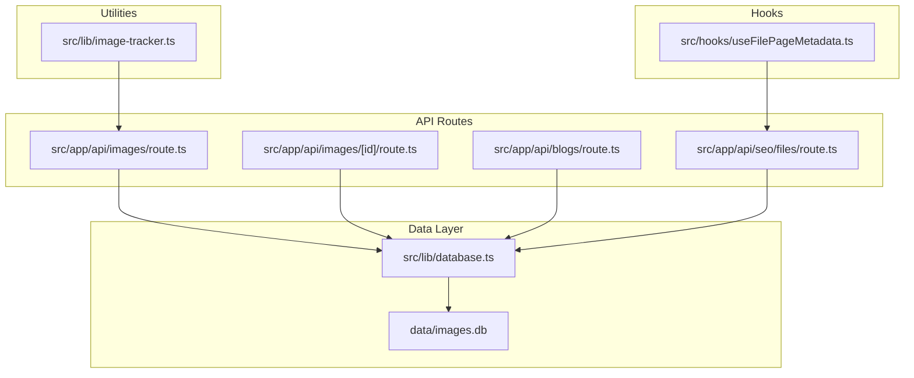
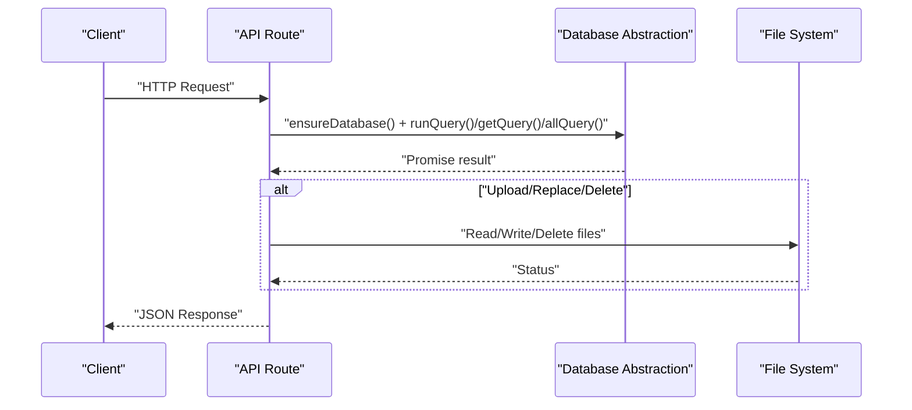
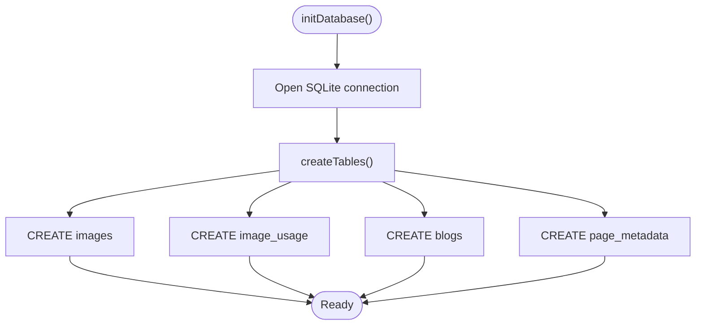
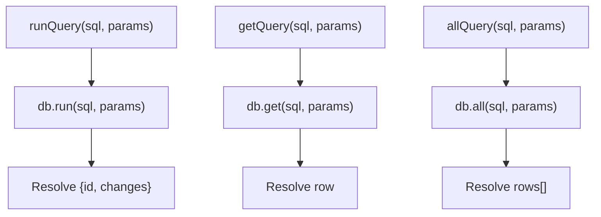
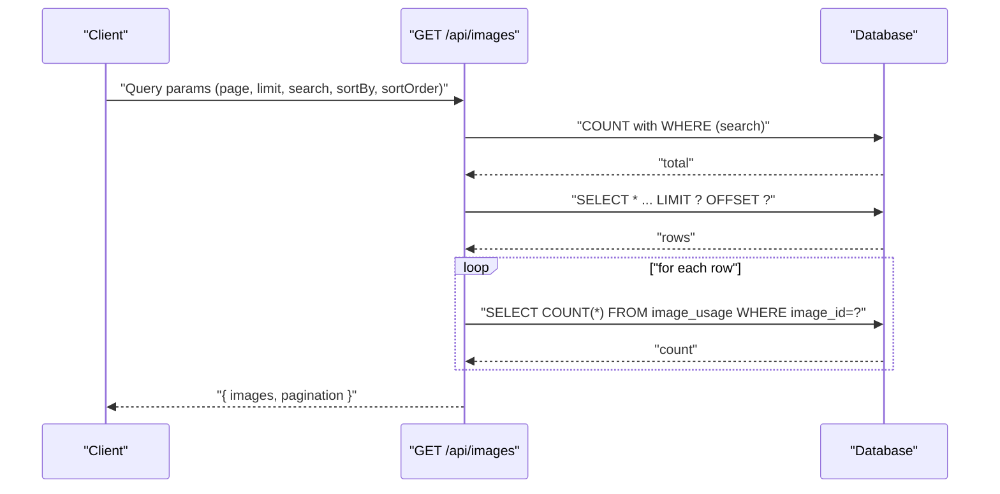
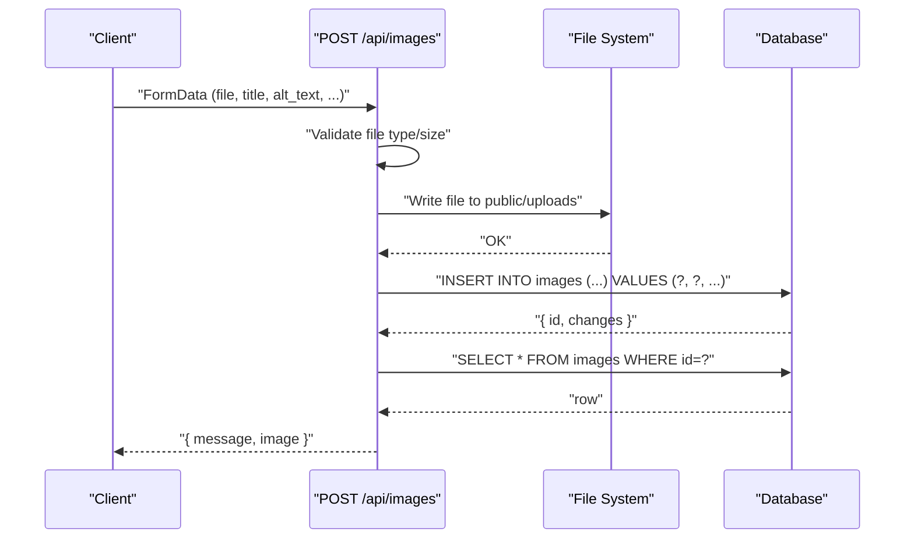
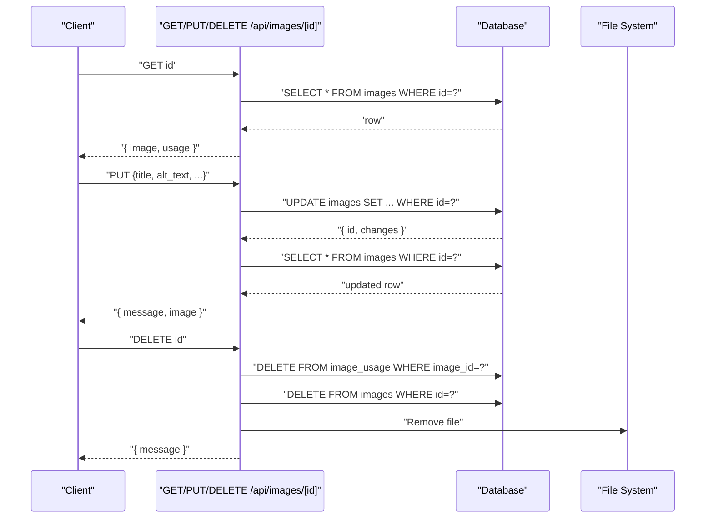
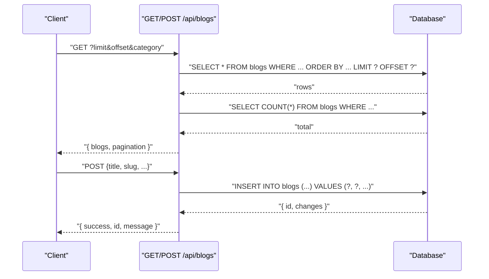
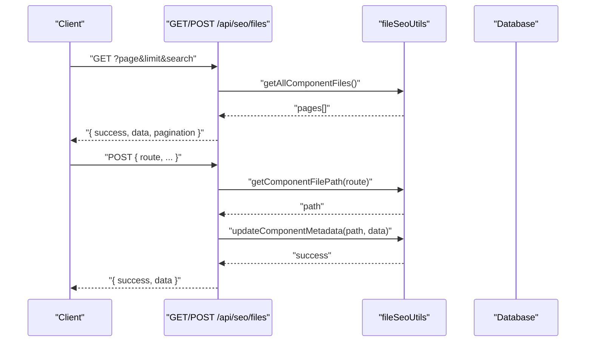
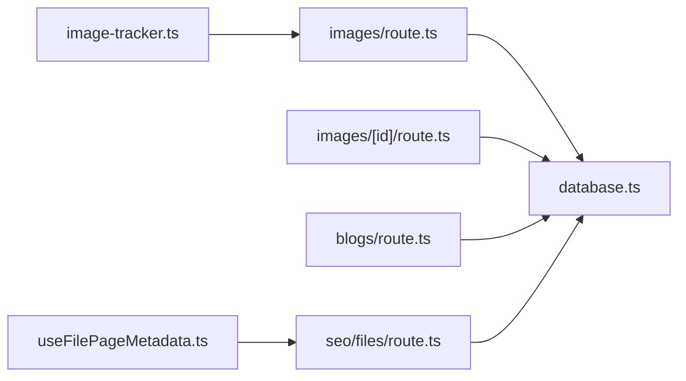

# Data Access Patterns

<cite>
**Referenced Files in This Document**
- [database.ts](file://src/lib/database.ts)
- [init-database.js](file://scripts/init-database.js)
- [route.ts](file://src/app/api/images/route.ts)
- [route.ts](file://src/app/api/images/[id]/route.ts)
- [route.ts](file://src/app/api/blogs/route.ts)
- [route.ts](file://src/app/api/seo/files/route.ts)
- [useFilePageMetadata.ts](file://src/hooks/useFilePageMetadata.ts)
- [image-tracker.ts](file://src/lib/image-tracker.ts)
</cite>

## Table of Contents
1. [Introduction](#introduction)
2. [Project Structure](#project-structure)
3. [Core Components](#core-components)
4. [Architecture Overview](#architecture-overview)
5. [Detailed Component Analysis](#detailed-component-analysis)
6. [Dependency Analysis](#dependency-analysis)
7. [Performance Considerations](#performance-considerations)
8. [Troubleshooting Guide](#troubleshooting-guide)
9. [Conclusion](#conclusion)

## Introduction
This document explains the database access patterns and CRUD operations used by attechglobal.com. It focuses on the SQLite-based data layer implemented in the project, covering:
- Database initialization and lifecycle management
- The three core query helpers: runQuery(), getQuery(), and allQuery()
- Parameter binding and promise-based async handling
- Transaction handling and connection management
- Practical CRUD examples across entities (images, blogs, page metadata)
- Error handling strategies and performance considerations for Next.js

## Project Structure
The data access layer centers around a single SQLite database file located under the data directory. The primary abstraction is a TypeScript module that exposes:
- Database initialization and table creation
- A singleton database instance getter
- Helper functions for run, get, and all queries
- A close function for lifecycle cleanup

**Diagram sources**
- [database.ts](file://src/lib/database.ts#L84-L212)
- [route.ts](file://src/app/api/images/route.ts#L1-L182)
- [route.ts](file://src/app/api/images/[id]/route.ts#L1-L158)
- [route.ts](file://src/app/api/blogs/route.ts#L1-L107)
- [route.ts](file://src/app/api/seo/files/route.ts#L1-L90)
- [useFilePageMetadata.ts](file://src/hooks/useFilePageMetadata.ts#L1-L225)
- [image-tracker.ts](file://src/lib/image-tracker.ts#L1-L95)

**Section sources**
- [database.ts](file://src/lib/database.ts#L1-L255)
- [route.ts](file://src/app/api/images/route.ts#L1-L182)
- [route.ts](file://src/app/api/images/[id]/route.ts#L1-L158)
- [route.ts](file://src/app/api/blogs/route.ts#L1-L107)
- [route.ts](file://src/app/api/seo/files/route.ts#L1-L90)
- [useFilePageMetadata.ts](file://src/hooks/useFilePageMetadata.ts#L1-L225)
- [image-tracker.ts](file://src/lib/image-tracker.ts#L1-L95)

## Core Components
- Database initialization and table creation
  - initDatabase(): Creates the SQLite connection and ensures all tables exist.
  - createTables(): Defines and creates images, image_usage, blogs, and page_metadata tables.
- Singleton database instance
  - getDatabase(): Returns the current connection or throws if uninitialized.
  - closeDatabase(): Safely closes the connection and resets the internal reference.
- Query helpers
  - runQuery(sql, params[]): Executes INSERT/UPDATE/DELETE and returns { id, changes }.
  - getQuery(sql, params[]): Executes SELECT with a single result.
  - allQuery(sql, params[]): Executes SELECT returning an array of rows.
- Promisified SQLite operations
  - Uses util.promisify on db.run/db.get/db.all to enable async/await patterns.

**Section sources**
- [database.ts](file://src/lib/database.ts#L84-L254)

## Architecture Overview
The system follows a layered pattern:
- API routes orchestrate requests, validate inputs, and delegate to the database layer.
- The database layer encapsulates SQLite connectivity and exposes typed helpers.
- Utilities and hooks consume API endpoints to present data to the UI.

**Diagram sources**
- [route.ts](file://src/app/api/images/route.ts#L17-L182)
- [route.ts](file://src/app/api/images/[id]/route.ts#L16-L158)
- [database.ts](file://src/lib/database.ts#L84-L254)

## Detailed Component Analysis

### Database Initialization and Lifecycle
- Initialization
  - initDatabase() opens the SQLite connection and invokes createTables().
  - createTables() defines four tables and uses promisified db.run for DDL statements.
- Lifecycle
  - getDatabase() enforces initialization before use.
  - closeDatabase() closes the connection and clears the singleton reference.
- Directory handling
  - Ensures the data directory exists before opening the database.

**Diagram sources**
- [database.ts](file://src/lib/database.ts#L84-L184)

**Section sources**
- [database.ts](file://src/lib/database.ts#L84-L212)
- [init-database.js](file://scripts/init-database.js#L14-L92)

### Query Helpers: runQuery(), getQuery(), allQuery()
- runQuery()
  - Purpose: INSERT/UPDATE/DELETE with parameter binding.
  - Returns: { id, changes } via db.run callback.
- getQuery()
  - Purpose: Single-row SELECT with parameter binding.
  - Returns: First row or undefined via db.get callback.
- allQuery()
  - Purpose: Multi-row SELECT with parameter binding.
  - Returns: Array of rows via db.all callback.
- Promisification
  - Promisifies db.run/db.get/db.all to support async/await.

**Diagram sources**
- [database.ts](file://src/lib/database.ts#L214-L254)

**Section sources**
- [database.ts](file://src/lib/database.ts#L214-L254)

### CRUD Operations: Images

#### Retrieve all images with pagination and search
- Endpoint: GET /api/images
- Behavior:
  - Parses page, limit, search, sortBy, sortOrder.
  - Builds a parameterized WHERE clause for filename/title/alt/tags.
  - Counts total rows and fetches paginated results.
  - Computes usage counts per image by querying image_usage.
- Parameter binding:
  - Uses positional parameters for LIKE clauses and LIMIT/OFFSET.

**Diagram sources**
- [route.ts](file://src/app/api/images/route.ts#L16-L75)
- [database.ts](file://src/lib/database.ts#L242-L254)

**Section sources**
- [route.ts](file://src/app/api/images/route.ts#L16-L75)

#### Upload a new image
- Endpoint: POST /api/images
- Behavior:
  - Validates multipart/form-data and file type/size.
  - Saves file to public/uploads and computes dimensions for non-SVG images.
  - Calculates an SEO score based on provided metadata.
  - Inserts a new record into images using runQuery().
  - Returns the newly inserted row.
- Parameter binding:
  - Uses ordered parameters for INSERT INTO images (...fields...) VALUES (?, ?, ...).

**Diagram sources**
- [route.ts](file://src/app/api/images/route.ts#L77-L182)
- [database.ts](file://src/lib/database.ts#L214-L226)

**Section sources**
- [route.ts](file://src/app/api/images/route.ts#L77-L182)

#### Get, update, and delete a specific image
- GET /api/images/[id]
  - Fetches image details and recent usage records.
- PUT /api/images/[id]
  - Updates metadata and recalculates SEO score.
- DELETE /api/images/[id]
  - Removes usage records, then the image record, then deletes the file.

**Diagram sources**
- [route.ts](file://src/app/api/images/[id]/route.ts#L16-L158)
- [database.ts](file://src/lib/database.ts#L214-L254)

**Section sources**
- [route.ts](file://src/app/api/images/[id]/route.ts#L16-L158)

### CRUD Operations: Blogs
- GET /api/blogs
  - Supports limit/offset/category filters.
  - Orders by published_date or created_at fallback.
  - Returns paginated results and total count.
- POST /api/blogs
  - Inserts a new blog with default values and status=published.
  - Handles uniqueness constraint for slug.

**Diagram sources**
- [route.ts](file://src/app/api/blogs/route.ts#L14-L107)
- [database.ts](file://src/lib/database.ts#L214-L254)

**Section sources**
- [route.ts](file://src/app/api/blogs/route.ts#L14-L107)

### CRUD Operations: Page Metadata (File-based)
- GET /api/seo/files
  - Lists component files with metadata, supports search and pagination.
- POST /api/seo/files
  - Updates existing component metadata; creation is not supported in this endpoint.

**Diagram sources**
- [route.ts](file://src/app/api/seo/files/route.ts#L5-L90)

**Section sources**
- [route.ts](file://src/app/api/seo/files/route.ts#L5-L90)

### Hooks and Utilities
- useFilePageMetadata(route)
  - Fetches single page metadata by route.
  - Provides loading/error states and a refresh function.
- useAllFilePageMetadata(initialPage, initialSearch)
  - Fetches paginated metadata with search and pagination controls.
- useUpdateFilePageMetadata() and useCreateFilePageMetadata()
  - Encapsulate PUT and POST to /api/seo/files with optimistic updates and error handling.
- Image usage tracking
  - Tracks image usage across pages and persists usage records.

**Section sources**
- [useFilePageMetadata.ts](file://src/hooks/useFilePageMetadata.ts#L13-L225)
- [image-tracker.ts](file://src/lib/image-tracker.ts#L11-L95)

## Dependency Analysis
- API routes depend on the database abstraction for all data operations.
- The database abstraction depends on sqlite3 and util.promisify.
- Utilities and hooks depend on API endpoints for data access.
- File operations (uploads/deletes) are independent of the database but coordinated by API routes.

**Diagram sources**
- [route.ts](file://src/app/api/images/route.ts#L1-L182)
- [route.ts](file://src/app/api/images/[id]/route.ts#L1-L158)
- [route.ts](file://src/app/api/blogs/route.ts#L1-L107)
- [route.ts](file://src/app/api/seo/files/route.ts#L1-L90)
- [database.ts](file://src/lib/database.ts#L1-L255)
- [useFilePageMetadata.ts](file://src/hooks/useFilePageMetadata.ts#L1-L225)
- [image-tracker.ts](file://src/lib/image-tracker.ts#L1-L95)

**Section sources**
- [route.ts](file://src/app/api/images/route.ts#L1-L182)
- [route.ts](file://src/app/api/images/[id]/route.ts#L1-L158)
- [route.ts](file://src/app/api/blogs/route.ts#L1-L107)
- [route.ts](file://src/app/api/seo/files/route.ts#L1-L90)
- [database.ts](file://src/lib/database.ts#L1-L255)
- [useFilePageMetadata.ts](file://src/hooks/useFilePageMetadata.ts#L1-L225)
- [image-tracker.ts](file://src/lib/image-tracker.ts#L1-L95)

## Performance Considerations
- Parameter binding
  - Always use parameter arrays to prevent SQL injection and enable query plan caching.
- Indexing
  - Consider adding indexes on frequently filtered/sorted columns (e.g., slug in blogs, route in page_metadata).
- Pagination
  - Use LIMIT and OFFSET for large datasets; avoid loading entire tables.
- Batch operations
  - For bulk inserts/updates, group operations within a single transaction to reduce overhead.
- File I/O
  - Image dimension calculation and file writes occur in API routes; keep file sizes reasonable and avoid synchronous heavy operations in hot paths.
- Caching
  - For read-heavy endpoints, consider Next.js caching strategies (e.g., unstable_cache) to cache query results.

[No sources needed since this section provides general guidance]

## Troubleshooting Guide
- Database not initialized
  - Symptom: getDatabase() throws an error.
  - Fix: Ensure initDatabase() is awaited before any database operations.
- Connection errors
  - Symptom: initDatabase() rejects with an error.
  - Fix: Verify data directory permissions and DB file accessibility.
- Unique constraint violations
  - Symptom: POST blogs returns 409 with a unique constraint message.
  - Fix: Ensure slugs are unique before insertion.
- Invalid IDs
  - Symptom: GET/PUT/DELETE images/[id] returns 400 for invalid numeric ID.
  - Fix: Validate numeric conversion before querying.
- File deletion failures
  - Symptom: DELETE images/[id] succeeds but file remains.
  - Fix: Confirm file path resolution and filesystem permissions.

**Section sources**
- [database.ts](file://src/lib/database.ts#L186-L192)
- [route.ts](file://src/app/api/blogs/route.ts#L98-L104)
- [route.ts](file://src/app/api/images/[id]/route.ts#L24-L28)

## Conclusion
The project implements a clean, promise-based SQLite abstraction with three core helpers that simplify CRUD operations across images, blogs, and page metadata. API routes orchestrate business logic, parameter binding, and file operations, while the database layer centralizes connection management and lifecycle. Following the outlined patterns ensures predictable error handling, maintainable code, and efficient performance in the Next.js environment.