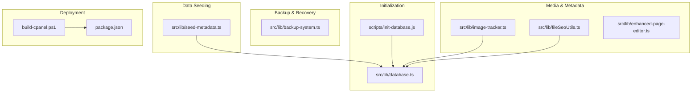
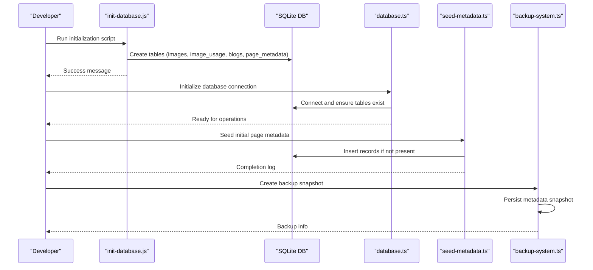
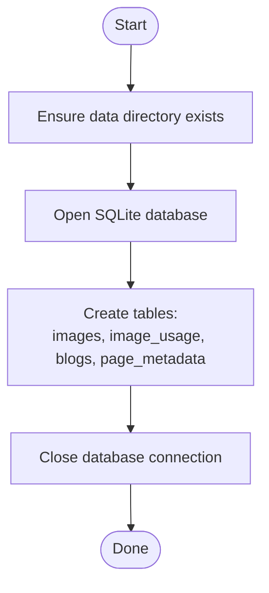
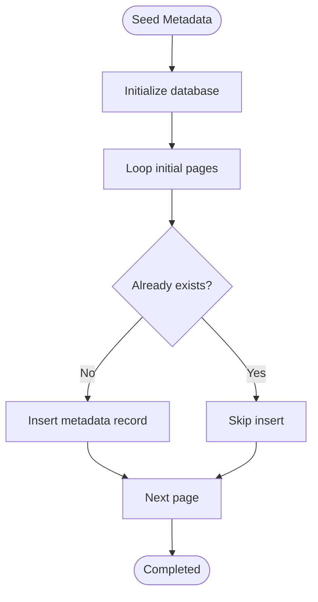
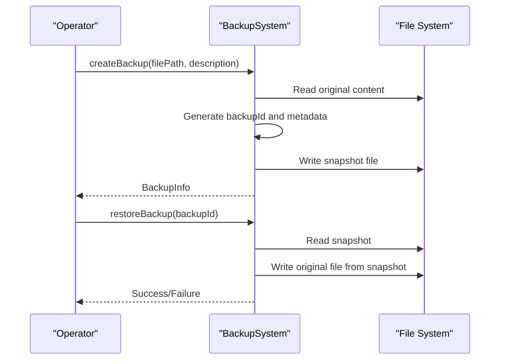
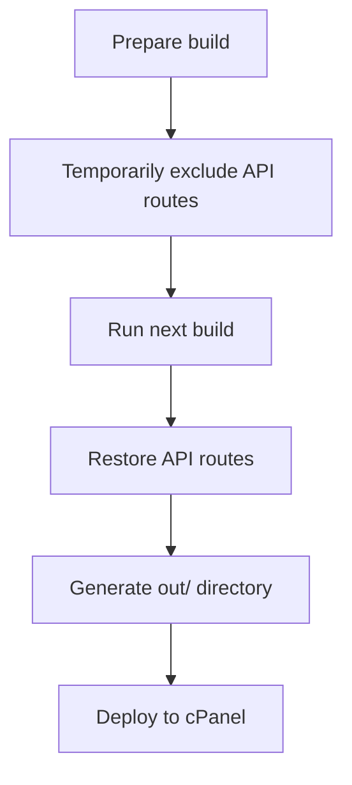
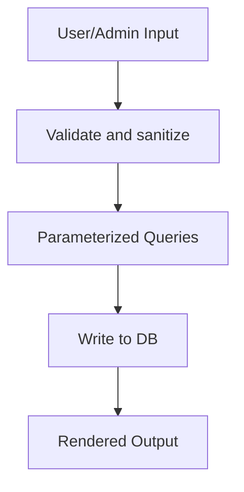
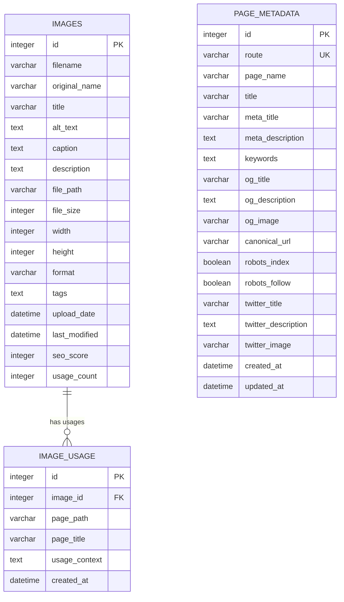
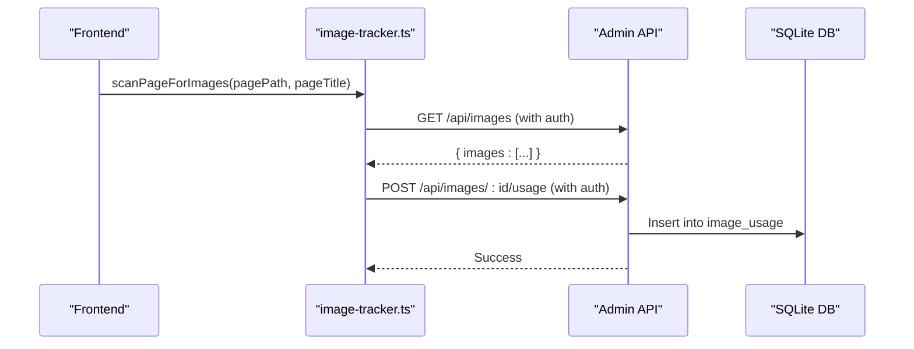
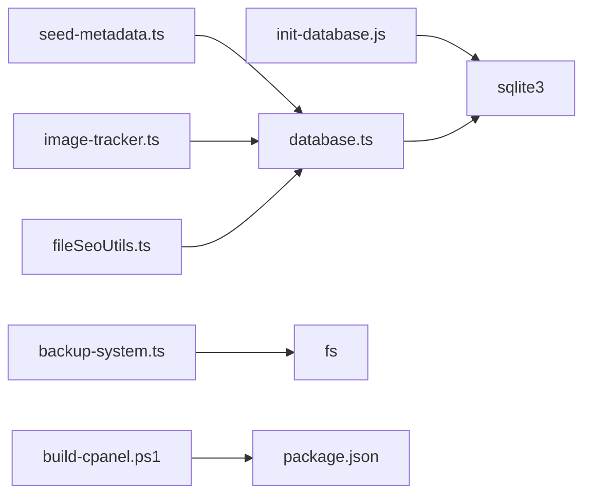

# Data Lifecycle Management

<cite>
**Referenced Files in This Document**
- [scripts/init-database.js](file://scripts/init-database.js)
- [src/lib/database.ts](file://src/lib/database.ts)
- [src/lib/backup-system.ts](file://src/lib/backup-system.ts)
- [src/lib/seed-metadata.ts](file://src/lib/seed-metadata.ts)
- [src/lib/image-tracker.ts](file://src/lib/image-tracker.ts)
- [src/lib/fileSeoUtils.ts](file://src/lib/fileSeoUtils.ts)
- [src/lib/enhanced-page-editor.ts](file://src/lib/enhanced-page-editor.ts)
- [build-cpanel.ps1](file://build-cpanel.ps1)
- [package.json](file://package.json)
- [IMAGE_MANAGEMENT_SETUP.md](file://IMAGE_MANAGEMENT_SETUP.md)
- [CPANEL_DEPLOYMENT.md](file://CPANEL_DEPLOYMENT.md)
</cite>

## Table of Contents
1. [Introduction](#introduction)
2. [Project Structure](#project-structure)
3. [Core Components](#core-components)
4. [Architecture Overview](#architecture-overview)
5. [Detailed Component Analysis](#detailed-component-analysis)
6. [Dependency Analysis](#dependency-analysis)
7. [Performance Considerations](#performance-considerations)
8. [Troubleshooting Guide](#troubleshooting-guide)
9. [Conclusion](#conclusion)
10. [Appendices](#appendices)

## Introduction
This document describes the data lifecycle management for attechglobal.com. It covers database initialization and schema, data seeding for page metadata, backup and recovery mechanisms, export/import for static deployment, retention and cleanup strategies, validation and security controls, integrity and audit considerations, versioning and migration approaches, and operational procedures for maintenance and troubleshooting. It also explains the relationship between file system storage and database records for media management.

## Project Structure
The repository organizes data lifecycle assets across initialization scripts, runtime database utilities, backup and recovery helpers, SEO and page metadata utilities, and deployment tooling. The key areas are:
- Database initialization and schema: scripts and runtime library
- Data seeding: page metadata seeding
- Backup and recovery: backup system utility
- Media and page metadata: image tracking, file-based SEO utilities, and enhanced page editor
- Deployment and export: cPanel build script and package configuration

**Diagram sources**
- [scripts/init-database.js](file://scripts/init-database.js#L1-L120)
- [src/lib/database.ts](file://src/lib/database.ts#L1-L255)
- [src/lib/seed-metadata.ts](file://src/lib/seed-metadata.ts#L1-L93)
- [src/lib/backup-system.ts](file://src/lib/backup-system.ts#L1-L119)
- [src/lib/image-tracker.ts](file://src/lib/image-tracker.ts#L1-L95)
- [src/lib/fileSeoUtils.ts](file://src/lib/fileSeoUtils.ts#L1-L329)
- [src/lib/enhanced-page-editor.ts](file://src/lib/enhanced-page-editor.ts#L1-L287)
- [build-cpanel.ps1](file://build-cpanel.ps1#L1-L92)
- [package.json](file://package.json#L1-L41)

**Section sources**
- [scripts/init-database.js](file://scripts/init-database.js#L1-L120)
- [src/lib/database.ts](file://src/lib/database.ts#L1-L255)
- [src/lib/seed-metadata.ts](file://src/lib/seed-metadata.ts#L1-L93)
- [src/lib/backup-system.ts](file://src/lib/backup-system.ts#L1-L119)
- [src/lib/image-tracker.ts](file://src/lib/image-tracker.ts#L1-L95)
- [src/lib/fileSeoUtils.ts](file://src/lib/fileSeoUtils.ts#L1-L329)
- [src/lib/enhanced-page-editor.ts](file://src/lib/enhanced-page-editor.ts#L1-L287)
- [build-cpanel.ps1](file://build-cpanel.ps1#L1-L92)
- [package.json](file://package.json#L1-L41)

## Core Components
- Database initialization and schema: initializes SQLite database and creates tables for images, image usage, blogs, and page metadata.
- Backup system: captures and restores arbitrary files by storing metadata snapshots.
- Data seeding: inserts initial page metadata into the page_metadata table.
- Image tracking: records where images are used across pages.
- File-based SEO utilities: map routes to component files, parse and update metadata in components.
- Enhanced page editor: discovers editable components in page files and supports targeted updates.
- Deployment build: prepares a static export suitable for cPanel hosting.

**Section sources**
- [scripts/init-database.js](file://scripts/init-database.js#L14-L119)
- [src/lib/database.ts](file://src/lib/database.ts#L84-L184)
- [src/lib/backup-system.ts](file://src/lib/backup-system.ts#L12-L118)
- [src/lib/seed-metadata.ts](file://src/lib/seed-metadata.ts#L3-L92)
- [src/lib/image-tracker.ts](file://src/lib/image-tracker.ts#L11-L42)
- [src/lib/fileSeoUtils.ts](file://src/lib/fileSeoUtils.ts#L120-L298)
- [src/lib/enhanced-page-editor.ts](file://src/lib/enhanced-page-editor.ts#L50-L76)
- [build-cpanel.ps1](file://build-cpanel.ps1#L36-L61)

## Architecture Overview
The data lifecycle spans initialization, runtime operations, and deployment/export. Initialization ensures the database and tables exist. Runtime utilities manage data insertion, updates, and retrieval. Backup and recovery preserve file content snapshots. Image tracking maintains referential integrity between images and pages. File-based SEO utilities keep component metadata synchronized with database records. The deployment pipeline produces a static export for hosting.

**Diagram sources**
- [scripts/init-database.js](file://scripts/init-database.js#L14-L119)
- [src/lib/database.ts](file://src/lib/database.ts#L84-L184)
- [src/lib/seed-metadata.ts](file://src/lib/seed-metadata.ts#L3-L92)
- [src/lib/backup-system.ts](file://src/lib/backup-system.ts#L33-L66)

## Detailed Component Analysis

### Database Initialization and Schema
- Purpose: Ensure the SQLite database file and required tables exist.
- Tables created:
  - images: stores image metadata and attributes.
  - image_usage: tracks page usage of images with foreign key linkage.
  - blogs: stores blog posts with slugs and statuses.
  - page_metadata: stores SEO metadata per route.
- Initialization flow:
  - Creates the data directory if missing.
  - Opens the SQLite database.
  - Creates tables via synchronous runs.
  - Closes the connection and logs completion.

**Diagram sources**
- [scripts/init-database.js](file://scripts/init-database.js#L8-L37)
- [src/lib/database.ts](file://src/lib/database.ts#L100-L184)

**Section sources**
- [scripts/init-database.js](file://scripts/init-database.js#L14-L119)
- [src/lib/database.ts](file://src/lib/database.ts#L84-L184)

### Data Seeding for Page Metadata
- Purpose: Populate initial page metadata for core routes.
- Process:
  - Initialize database.
  - Iterate predefined pages and insert only if not present.
  - Uses parameterized queries to avoid injection.
- Outcome: Ensures baseline SEO metadata for routes.

**Diagram sources**
- [src/lib/seed-metadata.ts](file://src/lib/seed-metadata.ts#L3-L92)

**Section sources**
- [src/lib/seed-metadata.ts](file://src/lib/seed-metadata.ts#L3-L92)

### Backup and Recovery Procedures
- Purpose: Preserve and restore file content snapshots with metadata.
- Capabilities:
  - Create backup: reads target file, generates unique backup ID, writes snapshot metadata.
  - Restore backup: rewrites original file from stored snapshot.
  - List backups: enumerates snapshots sorted by timestamp.
  - Delete backup: removes a specific snapshot file.
- Environment awareness: operates only in server-side contexts.

**Diagram sources**
- [src/lib/backup-system.ts](file://src/lib/backup-system.ts#L33-L82)

**Section sources**
- [src/lib/backup-system.ts](file://src/lib/backup-system.ts#L12-L118)

### Data Export/Import and Disaster Recovery Planning
- Static export for cPanel:
  - Build script temporarily excludes API routes to produce a static export.
  - Restores API routes after build completes.
  - Produces an out/ directory containing static assets and pages.
- Disaster recovery:
  - Use backups to restore modified component files.
  - Re-run initialization and seeding to rebuild database state if needed.
  - Re-deploy static export to recover frontend content.

**Diagram sources**
- [build-cpanel.ps1](file://build-cpanel.ps1#L23-L48)

**Section sources**
- [build-cpanel.ps1](file://build-cpanel.ps1#L1-L92)
- [CPANEL_DEPLOYMENT.md](file://CPANEL_DEPLOYMENT.md#L5-L30)

### Data Validation, Sanitization, and Security Measures
- Parameterized queries: Used in seeding and database utilities to prevent SQL injection.
- Input filtering: Client-side image tracking filters internal-origin images and ignores invalid patterns.
- File permissions: Ensure write access to data/ and upload directories for SQLite and uploads.
- Authentication: Admin endpoints require bearer tokens; client-side tracking requires admin session tokens.
- XSS protection: Backups store original content as-is; ensure downstream rendering is safe.

**Diagram sources**
- [src/lib/seed-metadata.ts](file://src/lib/seed-metadata.ts#L70-L84)
- [src/lib/database.ts](file://src/lib/database.ts#L215-L226)
- [src/lib/image-tracker.ts](file://src/lib/image-tracker.ts#L11-L42)

**Section sources**
- [src/lib/seed-metadata.ts](file://src/lib/seed-metadata.ts#L70-L84)
- [src/lib/database.ts](file://src/lib/database.ts#L215-L226)
- [src/lib/image-tracker.ts](file://src/lib/image-tracker.ts#L11-L42)
- [IMAGE_MANAGEMENT_SETUP.md](file://IMAGE_MANAGEMENT_SETUP.md#L145-L151)

### Data Integrity Checks, Consistency Validation, and Audit Trails
- Referential integrity: image_usage links to images via foreign key.
- Timestamps: tables include created_at/updated_at defaults for auditability.
- Usage tracking: image-tracker records page usage of images for consistency validation.
- Audit trail mechanisms:
  - image_usage table provides usage history.
  - page_metadata timestamps reflect last modification.
  - backups provide historical snapshots of files.

**Diagram sources**
- [src/lib/database.ts](file://src/lib/database.ts#L106-L181)

**Section sources**
- [src/lib/database.ts](file://src/lib/database.ts#L106-L181)
- [src/lib/image-tracker.ts](file://src/lib/image-tracker.ts#L11-L42)

### Data Versioning, Migration Scripts, and Backward Compatibility
- Versioning approach: No explicit migration scripts are present; schema is created via initialization.
- Migration strategy:
  - Add ALTER TABLE statements in initialization or a dedicated migration utility.
  - Maintain a migrations table to track applied versions.
- Backward compatibility:
  - Keep default values for new columns.
  - Avoid changing primary keys or unique constraints without careful planning.

[No sources needed since this section provides general guidance]

### Operational Procedures: Maintenance, Monitoring, and Troubleshooting
- Database maintenance:
  - Periodically review image_usage counts and page_metadata freshness.
  - Monitor SQLite file size and disk space.
- Performance monitoring:
  - Track query execution times for large scans (e.g., image scanning).
  - Optimize queries with indexes if needed.
- Troubleshooting:
  - Database not found: run initialization script.
  - Upload failures: check file type and size limits.
  - Images not loading: verify file paths and permissions.
  - SEO scores not updating: refresh page after edits.

**Section sources**
- [IMAGE_MANAGEMENT_SETUP.md](file://IMAGE_MANAGEMENT_SETUP.md#L153-L167)

### Relationship Between File System Storage and Database Records (Media Management)
- File system storage:
  - Images are stored under public assets and copied during static export.
  - Uploads are handled by admin APIs (not available in static export).
- Database records:
  - images table stores metadata and file_path.
  - image_usage table tracks which pages reference which images.
- Client-side tracking:
  - Scans DOM for images and records usage via API calls.

**Diagram sources**
- [src/lib/image-tracker.ts](file://src/lib/image-tracker.ts#L11-L42)
- [src/lib/database.ts](file://src/lib/database.ts#L128-L139)

**Section sources**
- [src/lib/image-tracker.ts](file://src/lib/image-tracker.ts#L45-L65)
- [IMAGE_MANAGEMENT_SETUP.md](file://IMAGE_MANAGEMENT_SETUP.md#L94-L100)

## Dependency Analysis
- Initialization depends on SQLite3 and filesystem utilities.
- Runtime database library depends on SQLite3 and path/fs modules.
- Backup system depends on path and fs modules.
- Seeding depends on database initialization and runQuery.
- Image tracking depends on admin API and localStorage.
- File-based SEO utilities depend on fs and path.
- Enhanced page editor depends on fs and path.
- Build script depends on Next.js build and environment variables.

**Diagram sources**
- [scripts/init-database.js](file://scripts/init-database.js#L1-L3)
- [src/lib/database.ts](file://src/lib/database.ts#L1-L4)
- [src/lib/seed-metadata.ts](file://src/lib/seed-metadata.ts#L1)
- [src/lib/image-tracker.ts](file://src/lib/image-tracker.ts#L14-L18)
- [src/lib/fileSeoUtils.ts](file://src/lib/fileSeoUtils.ts#L1-L2)
- [src/lib/backup-system.ts](file://src/lib/backup-system.ts#L1-L2)
- [build-cpanel.ps1](file://build-cpanel.ps1#L38-L39)
- [package.json](file://package.json#L5-L11)

**Section sources**
- [scripts/init-database.js](file://scripts/init-database.js#L1-L3)
- [src/lib/database.ts](file://src/lib/database.ts#L1-L4)
- [src/lib/seed-metadata.ts](file://src/lib/seed-metadata.ts#L1)
- [src/lib/image-tracker.ts](file://src/lib/image-tracker.ts#L14-L18)
- [src/lib/fileSeoUtils.ts](file://src/lib/fileSeoUtils.ts#L1-L2)
- [src/lib/backup-system.ts](file://src/lib/backup-system.ts#L1-L2)
- [build-cpanel.ps1](file://build-cpanel.ps1#L38-L39)
- [package.json](file://package.json#L5-L11)

## Performance Considerations
- Prefer parameterized queries to reduce overhead and prevent injection.
- Indexes: Consider adding indexes on frequently queried columns (e.g., image_usage(page_path), page_metadata(route)).
- Batch operations: Group inserts/updates where possible.
- Static export optimization: Ensure images are optimized and paths are correct for cPanel deployment.

[No sources needed since this section provides general guidance]

## Troubleshooting Guide
Common issues and resolutions:
- Database not found: run the initialization script to create tables.
- Upload failures: verify file type and size limits; ensure upload directory is writable.
- Images not loading: confirm file paths and permissions; check static export includes images.
- SEO scores not updating: refresh page after editing metadata.
- Static build fails: ensure API routes are temporarily excluded; verify build output.

**Section sources**
- [IMAGE_MANAGEMENT_SETUP.md](file://IMAGE_MANAGEMENT_SETUP.md#L153-L167)
- [CPANEL_DEPLOYMENT.md](file://CPANEL_DEPLOYMENT.md#L111-L138)

## Conclusion
The attechglobal.com data lifecycle relies on a straightforward SQLite-based schema initialized by a dedicated script, supplemented by runtime utilities for seeding, backup/recovery, image usage tracking, and file-based SEO management. The static export pipeline enables efficient deployment to cPanel, while operational procedures and security measures protect data integrity and availability.

[No sources needed since this section summarizes without analyzing specific files]

## Appendices
- Deployment checklist and troubleshooting steps are documented in the cPanel deployment guide.
- Image management setup provides feature coverage, API endpoints, and security notes.

**Section sources**
- [CPANEL_DEPLOYMENT.md](file://CPANEL_DEPLOYMENT.md#L139-L186)
- [IMAGE_MANAGEMENT_SETUP.md](file://IMAGE_MANAGEMENT_SETUP.md#L101-L152)