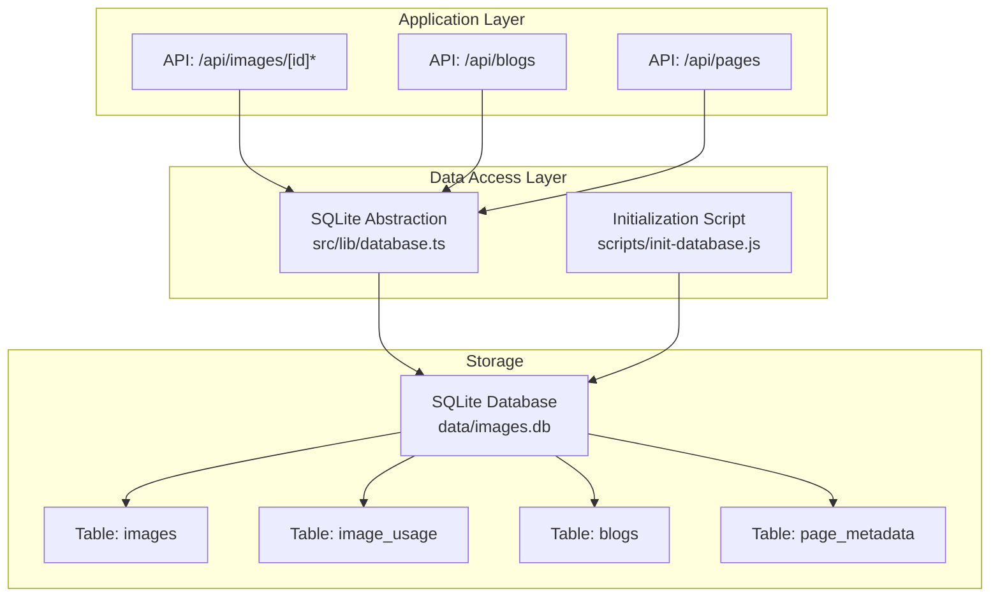
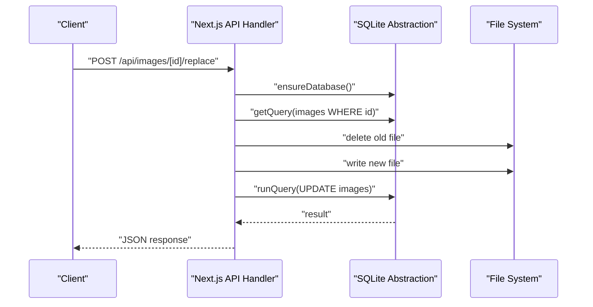
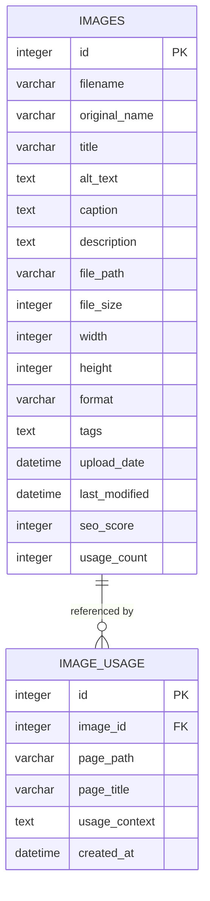
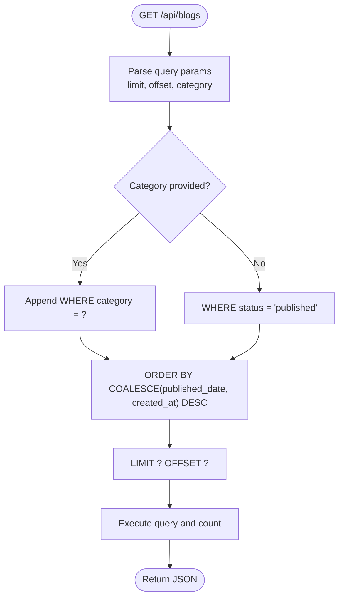
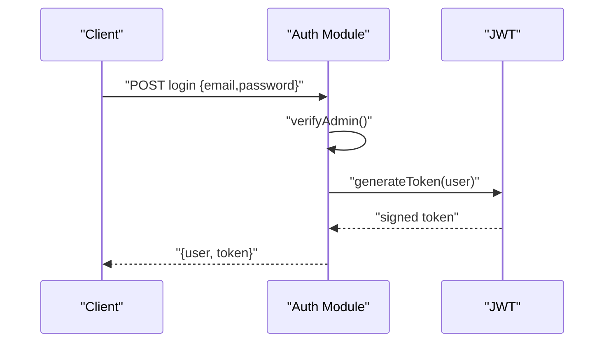
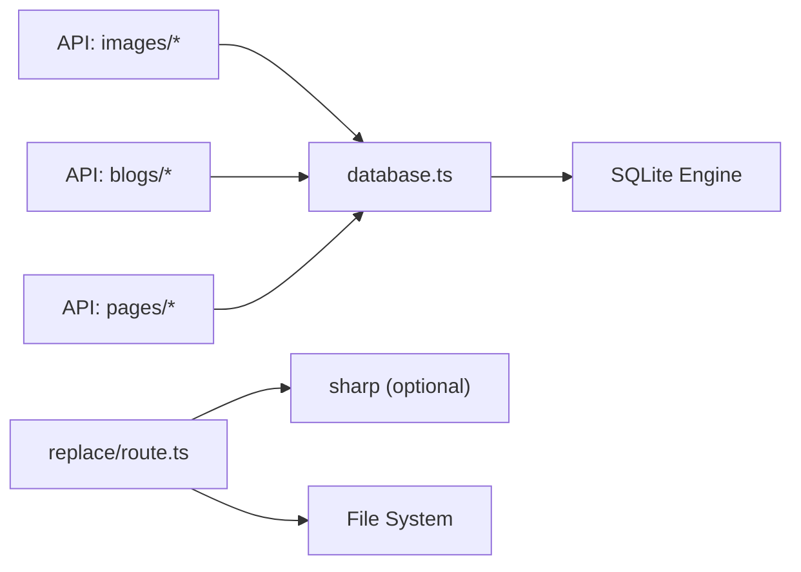

# Database Design

<cite>
**Referenced Files in This Document**
- [database.ts](file://src/lib/database.ts)
- [init-database.js](file://scripts/init-database.js)
- [auth.ts](file://src/lib/auth.ts)
- [route.ts](file://src/app/api/images/[id]/route.ts)
- [usage/route.ts](file://src/app/api/images/[id]/usage/route.ts)
- [replace/route.ts](file://src/app/api/images/[id]/replace/route.ts)
- [blogs/route.ts](file://src/app/api/blogs/route.ts)
- [pages/route.ts](file://src/app/api/pages/route.ts)
</cite>

## Table of Contents
1. [Introduction](#introduction)
2. [Project Structure](#project-structure)
3. [Core Components](#core-components)
4. [Architecture Overview](#architecture-overview)
5. [Detailed Component Analysis](#detailed-component-analysis)
6. [Dependency Analysis](#dependency-analysis)
7. [Performance Considerations](#performance-considerations)
8. [Troubleshooting Guide](#troubleshooting-guide)
9. [Conclusion](#conclusion)
10. [Appendices](#appendices)

## Introduction
This document describes the database design and data model for attechglobal.com. It focuses on the SQLite-backed schema used for media management (ImageRecord and ImageUsageRecord), content publishing (BlogRecord), SEO configuration (PageMetadataRecord), and authentication (AdminUser). It documents table structures, relationships, constraints, indexes, CRUD operations via the SQLite abstraction layer, transaction handling, data lifecycle, and operational guidance.

## Project Structure
The database is implemented as a local SQLite file located under the data directory. Initialization scripts and runtime database helpers live in the src/lib directory, while API endpoints expose CRUD operations for images, blogs, and page metadata.

**Diagram sources**
- [database.ts](file://src/lib/database.ts#L100-L184)
- [init-database.js](file://scripts/init-database.js#L14-L92)
- [route.ts](file://src/app/api/images/[id]/route.ts#L1-L158)
- [blogs/route.ts](file://src/app/api/blogs/route.ts#L1-L107)
- [pages/route.ts](file://src/app/api/pages/route.ts#L1-L110)

**Section sources**
- [database.ts](file://src/lib/database.ts#L1-L255)
- [init-database.js](file://scripts/init-database.js#L1-L120)

## Core Components
This section defines the core entities and their fields, data types, constraints, and relationships.

- ImageRecord
  - Purpose: Stores metadata and metrics for uploaded images.
  - Fields and constraints:
    - id: integer, primary key, autoincrement
    - filename: varchar(255), not null
    - original_name: varchar(255)
    - title: varchar(255)
    - alt_text: text
    - caption: text
    - description: text
    - file_path: varchar(500), not null
    - file_size: integer
    - width: integer
    - height: integer
    - format: varchar(10)
    - tags: text
    - upload_date: datetime, default current_timestamp
    - last_modified: datetime, default current_timestamp
    - seo_score: integer, default 0
    - usage_count: integer, default 0
  - Notes: No explicit indexes are defined in the schema creation; consider adding indexes on filename, format, and tags for frequent queries.

- ImageUsageRecord
  - Purpose: Tracks where and how images are used across pages.
  - Fields and constraints:
    - id: integer, primary key, autoincrement
    - image_id: integer, foreign key references images(id)
    - page_path: varchar(500)
    - page_title: varchar(255)
    - usage_context: text
    - created_at: datetime, default current_timestamp
  - Notes: Foreign key relationship ensures referential integrity between image_usage and images.

- BlogRecord
  - Purpose: Stores blog posts for content publishing.
  - Fields and constraints:
    - id: integer, primary key, autoincrement
    - title: varchar(500), not null
    - content: text
    - excerpt: text
    - image: varchar(500)
    - slug: varchar(500), unique, not null
    - category: varchar(255)
    - author: varchar(255), default 'Admin'
    - published_date: datetime
    - created_at: datetime, default current_timestamp
    - updated_at: datetime, default current_timestamp
    - status: varchar(50), default 'published'
  - Notes: Unique constraint on slug enforces uniqueness of URLs.

- PageMetadataRecord
  - Purpose: Manages SEO metadata per route/page.
  - Fields and constraints:
    - id: integer, primary key, autoincrement
    - route: varchar(500), unique, not null
    - page_name: varchar(255), not null
    - title: varchar(255)
    - meta_title: varchar(255)
    - meta_description: text
    - keywords: text
    - og_title: varchar(255)
    - og_description: text
    - og_image: varchar(500)
    - canonical_url: varchar(500)
    - robots_index: boolean, default 1
    - robots_follow: boolean, default 1
    - twitter_title: varchar(255)
    - twitter_description: text
    - twitter_image: varchar(500)
    - created_at: datetime, default current_timestamp
    - updated_at: datetime, default current_timestamp
  - Notes: Unique constraint on route prevents duplicate SEO configurations per route.

- AdminUser
  - Purpose: Authentication and authorization for administrative actions.
  - Fields and constraints:
    - id: string, primary key (token-based identity)
    - email: string
    - role: string
  - Notes: Stored credentials are embedded for demo purposes; in production, use environment variables and secure secret storage.

**Section sources**
- [database.ts](file://src/lib/database.ts#L18-L81)
- [database.ts](file://src/lib/database.ts#L100-L184)
- [auth.ts](file://src/lib/auth.ts#L13-L22)

## Architecture Overview
The system uses a thin SQLite abstraction layer to manage schema creation, queries, and transactions. APIs expose CRUD endpoints backed by these abstractions. Authentication is handled separately with JWT tokens.

**Diagram sources**
- [replace/route.ts](file://src/app/api/images/[id]/replace/route.ts#L16-L124)
- [database.ts](file://src/lib/database.ts#L84-L97)
- [database.ts](file://src/lib/database.ts#L215-L254)

## Detailed Component Analysis

### ImageRecord and ImageUsageRecord
- Schema and relationships
  - images and image_usage are linked by image_id → images.id.
  - image_usage is used to track usage contexts and page locations.
- Data validation and constraints
  - image_usage.image_id references images.id; deletion of an image cascades to usage records via DELETE CASCADE (implicit via foreign key).
  - SEO scoring logic updates images.seo_score based on presence of title, alt_text, caption, description, and tags.
- CRUD operations
  - Retrieve image with usage history via GET /api/images/[id].
  - Update metadata and recalculate SEO score via PUT /api/images/[id].
  - Replace file and update metadata via POST /api/images/[id]/replace.
  - Track usage via POST /api/images/[id]/usage and list via GET /api/images/[id]/usage.
- Transaction handling
  - Operations are executed as individual statements; no explicit transaction blocks are used in the current implementation. For atomicity across file and DB updates (e.g., replace), wrap operations in a transaction block in future enhancements.

**Diagram sources**
- [database.ts](file://src/lib/database.ts#L106-L139)
- [route.ts](file://src/app/api/images/[id]/route.ts#L16-L53)
- [usage/route.ts](file://src/app/api/images/[id]/usage/route.ts#L14-L44)

**Section sources**
- [database.ts](file://src/lib/database.ts#L106-L139)
- [route.ts](file://src/app/api/images/[id]/route.ts#L16-L158)
- [usage/route.ts](file://src/app/api/images/[id]/usage/route.ts#L14-L95)
- [replace/route.ts](file://src/app/api/images/[id]/replace/route.ts#L16-L124)

### BlogRecord
- Schema and relationships
  - blogs table stores posts with a unique slug and optional published date.
- Data validation and constraints
  - Unique constraint on slug prevents duplicate URLs.
  - Status defaults to published; filtering in API GET restricts to published posts.
- CRUD operations
  - List paginated and filtered blogs via GET /api/blogs with limit, offset, and category query parameters.
  - Create a new blog via POST /api/blogs with validation for required fields.

**Diagram sources**
- [blogs/route.ts](file://src/app/api/blogs/route.ts#L14-L61)

**Section sources**
- [database.ts](file://src/lib/database.ts#L141-L157)
- [blogs/route.ts](file://src/app/api/blogs/route.ts#L14-L107)

### PageMetadataRecord
- Schema and relationships
  - page_metadata table stores SEO metadata keyed by route with a unique constraint on route.
- CRUD operations
  - API endpoints exist for pages; current implementation returns mock data. Production logic should integrate with page_metadata for dynamic SEO configuration.

**Section sources**
- [database.ts](file://src/lib/database.ts#L159-L181)
- [pages/route.ts](file://src/app/api/pages/route.ts#L1-L110)

### AdminUser and Authentication
- Authentication flow
  - Admin credentials are validated against embedded values; in production, use environment variables and secure secret storage.
  - JWT tokens are generated with expiration and verified centrally.
- Authorization
  - Role-based checks determine administrative privileges.

**Diagram sources**
- [auth.ts](file://src/lib/auth.ts#L62-L79)
- [auth.ts](file://src/lib/auth.ts#L34-L59)

**Section sources**
- [auth.ts](file://src/lib/auth.ts#L4-L85)

## Dependency Analysis
- Internal dependencies
  - API handlers depend on the SQLite abstraction layer for database operations.
  - Image replacement logic depends on the file system for uploads and Sharp for image metadata extraction.
- External dependencies
  - sqlite3 for database connectivity.
  - bcryptjs and jsonwebtoken for authentication.
  - sharp for image dimension extraction (optional, used in replace flow).

**Diagram sources**
- [database.ts](file://src/lib/database.ts#L1-L255)
- [route.ts](file://src/app/api/images/[id]/route.ts#L1-L158)
- [blogs/route.ts](file://src/app/api/blogs/route.ts#L1-L107)
- [pages/route.ts](file://src/app/api/pages/route.ts#L1-L110)
- [replace/route.ts](file://src/app/api/images/[id]/replace/route.ts#L84-L91)

**Section sources**
- [database.ts](file://src/lib/database.ts#L1-L255)
- [replace/route.ts](file://src/app/api/images/[id]/replace/route.ts#L84-L91)

## Performance Considerations
- Indexing recommendations
  - Consider adding indexes on frequently queried columns:
    - images(filename), images(format), images(tags)
    - blogs(slug), blogs(category), blogs(status)
    - page_metadata(route)
- Query patterns
  - Blogs listing uses COALESCE(published_date, created_at) ordering; ensure appropriate indexes to optimize sorting.
- File operations
  - Image replacement writes to disk; batch or queue heavy operations to avoid blocking requests.
- Concurrency
  - SQLite supports concurrent reads; write contention may occur. Consider WAL mode and connection pooling for improved concurrency.

[No sources needed since this section provides general guidance]

## Troubleshooting Guide
- Database initialization
  - Ensure the data directory exists and the database file is writable.
  - Use the initialization script to create tables if missing.
- Connection errors
  - Verify the database path and permissions; the abstraction throws if not initialized.
- Constraint violations
  - Slug uniqueness failures on blog creation return a conflict response.
  - Image ID validation errors return 400 for invalid identifiers.
- File handling
  - Replacement endpoint validates MIME type and size; adjust limits as needed.
  - Old files are deleted upon replacement; ensure backups before destructive operations.

**Section sources**
- [database.ts](file://src/lib/database.ts#L84-L97)
- [database.ts](file://src/lib/database.ts#L187-L212)
- [blogs/route.ts](file://src/app/api/blogs/route.ts#L98-L104)
- [route.ts](file://src/app/api/images/[id]/route.ts#L26-L28)
- [replace/route.ts](file://src/app/api/images/[id]/replace/route.ts#L44-L52)

## Conclusion
The database design centers on four core entities supporting media, content, SEO, and admin authentication. The SQLite abstraction layer provides a clean interface for schema creation and queries, while API endpoints implement CRUD operations with validation and constraints. Future enhancements should focus on transactional safety for file and DB updates, targeted indexing, and production-grade authentication and secrets management.

[No sources needed since this section summarizes without analyzing specific files]

## Appendices

### Data Access Patterns and CRUD Implementations
- SQLite abstraction
  - Initialization, table creation, and connection lifecycle are managed by the abstraction.
  - Query helpers encapsulate run/get/all operations with promises.
- Image management
  - Fetch image and usage, update metadata and SEO score, delete with file cleanup, replace file with metadata refresh.
- Blog management
  - Paginated listing with category filter and total count; creation with slug uniqueness enforcement.
- Page metadata
  - Current pages API returns mock data; production integration should read/write page_metadata.

**Section sources**
- [database.ts](file://src/lib/database.ts#L84-L254)
- [route.ts](file://src/app/api/images/[id]/route.ts#L16-L158)
- [usage/route.ts](file://src/app/api/images/[id]/usage/route.ts#L14-L95)
- [replace/route.ts](file://src/app/api/images/[id]/replace/route.ts#L16-L124)
- [blogs/route.ts](file://src/app/api/blogs/route.ts#L14-L107)
- [pages/route.ts](file://src/app/api/pages/route.ts#L1-L110)

### Data Lifecycle, Backup, and Recovery
- Lifecycle
  - Images: upload → metadata update → usage tracking → optional replacement → deletion with file removal.
  - Blogs: create → publish → update metadata → unpublish/change status.
  - SEO: configure per route → update as needed → maintain canonical and robots directives.
- Backup
  - Back up the SQLite file regularly; consider WAL mode for crash-safe writes.
- Recovery
  - Restore from the latest backup; verify integrity and re-run initialization if schema changes are detected.

[No sources needed since this section provides general guidance]

### Security Considerations and Access Control
- Authentication
  - Use environment variables for secrets and enforce HTTPS in production.
- Authorization
  - Restrict admin endpoints to authorized users; validate roles before performing sensitive operations.
- Data protection
  - Sanitize inputs and escape special characters in queries; prefer parameterized queries as implemented.

**Section sources**
- [auth.ts](file://src/lib/auth.ts#L11-L11)
- [auth.ts](file://src/lib/auth.ts#L62-L84)

### Sample Data Examples and Common Queries
- Sample ImageRecord fields
  - filename, original_name, title, alt_text, caption, description, file_path, file_size, width, height, format, tags, upload_date, last_modified, seo_score, usage_count.
- Sample BlogRecord fields
  - title, content, excerpt, image, slug, category, author, published_date, created_at, updated_at, status.
- Sample PageMetadataRecord fields
  - route, page_name, title, meta_title, meta_description, keywords, og_title, og_description, og_image, canonical_url, robots_index, robots_follow, twitter_title, twitter_description, twitter_image, created_at, updated_at.
- Common queries
  - Blogs by category and pagination (implemented in API).
  - Image usage by image_id ordered by created_at desc.
  - Unique slug enforcement for blogs.

**Section sources**
- [database.ts](file://src/lib/database.ts#L18-L81)
- [blogs/route.ts](file://src/app/api/blogs/route.ts#L14-L61)
- [usage/route.ts](file://src/app/api/images/[id]/usage/route.ts#L28-L34)