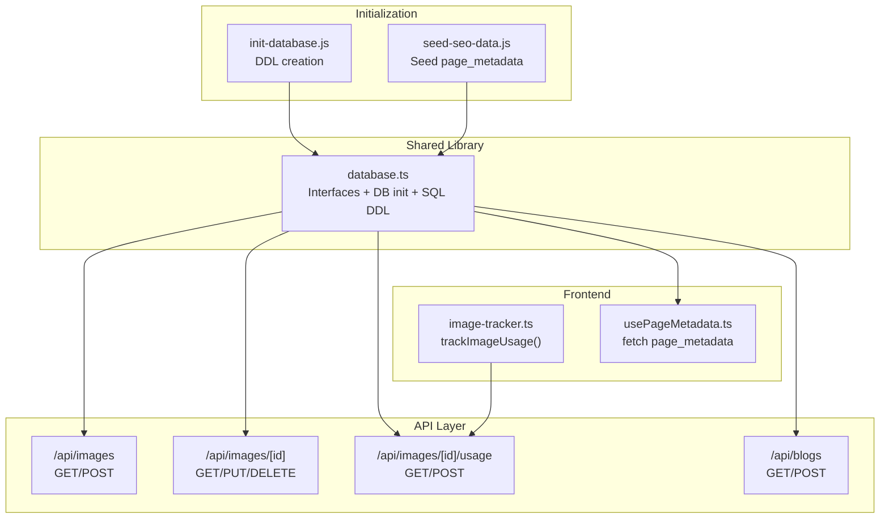
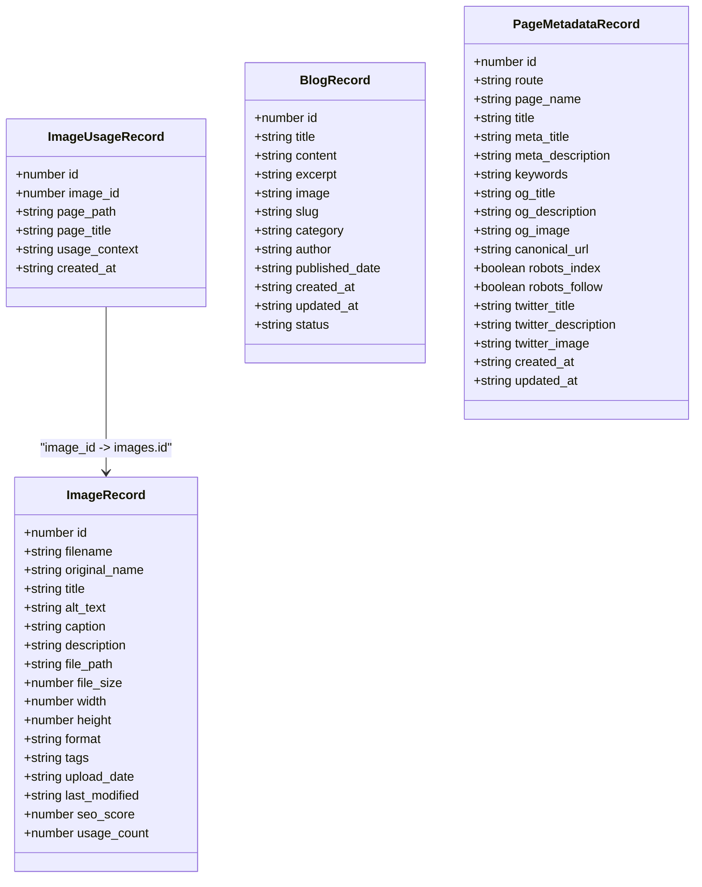
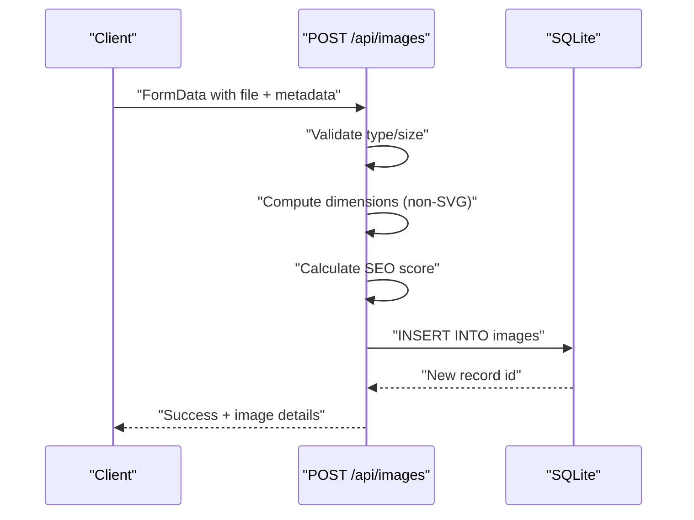
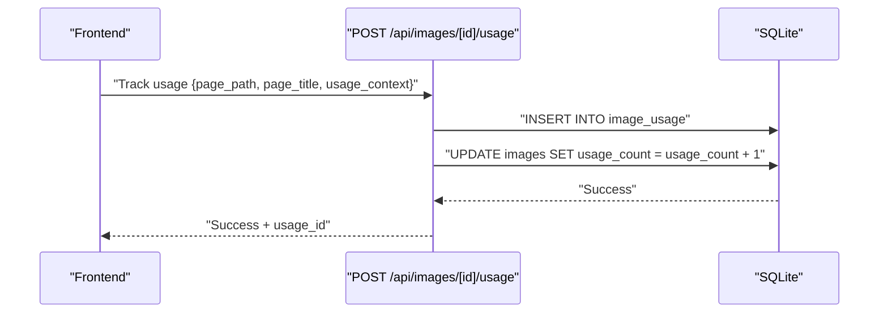
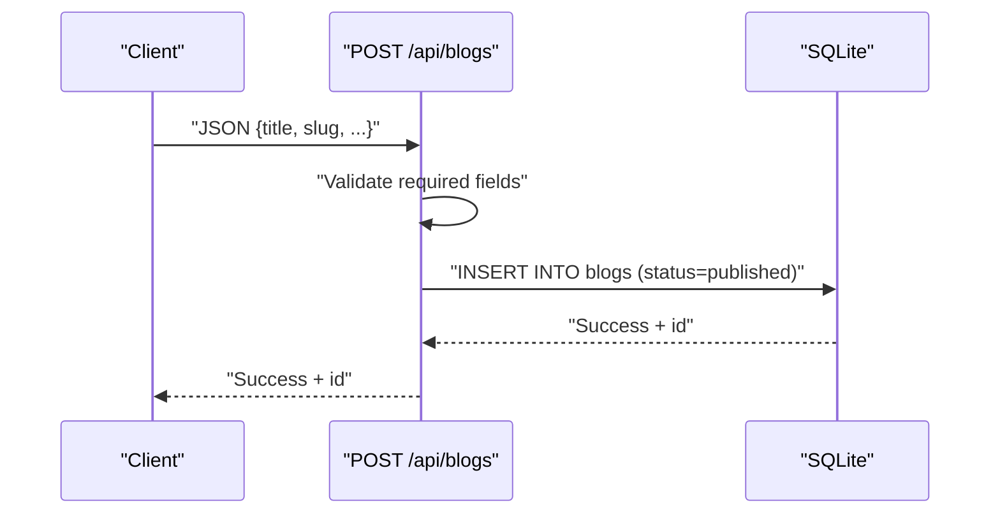
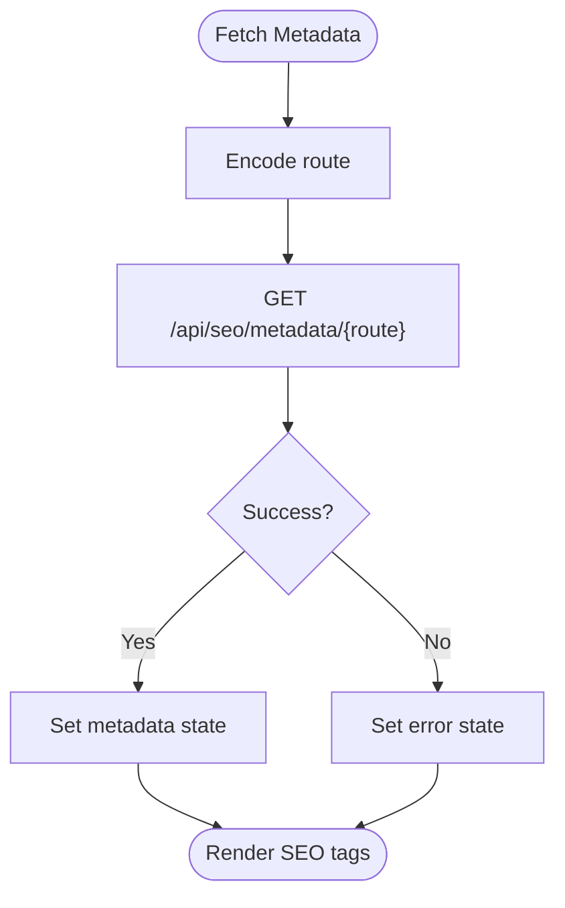
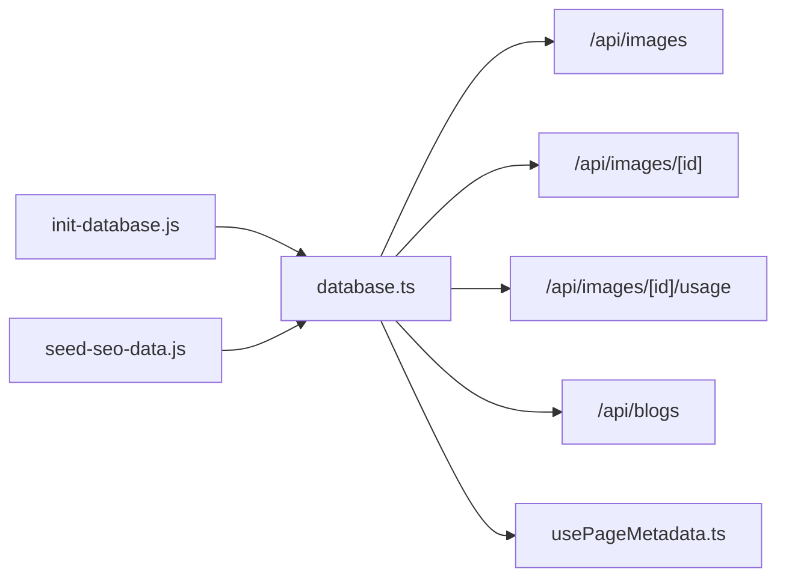

# Entity Models

<cite>
**Referenced Files in This Document**
- [database.ts](file://src/lib/database.ts)
- [init-database.js](file://scripts/init-database.js)
- [seed-seo-data.js](file://scripts/seed-seo-data.js)
- [image-tracker.ts](file://src/lib/image-tracker.ts)
- [route.ts (images)](file://src/app/api/images/route.ts)
- [route.ts (images/[id])](file://src/app/api/images/[id]/route.ts)
- [route.ts (images/[id]/usage)](file://src/app/api/images/[id]/usage/route.ts)
- [route.ts (blogs)](file://src/app/api/blogs/route.ts)
- [usePageMetadata.ts](file://src/hooks/usePageMetadata.ts)
</cite>

## Table of Contents
1. [Introduction](#introduction)
2. [Project Structure](#project-structure)
3. [Core Components](#core-components)
4. [Architecture Overview](#architecture-overview)
5. [Detailed Component Analysis](#detailed-component-analysis)
6. [Dependency Analysis](#dependency-analysis)
7. [Performance Considerations](#performance-considerations)
8. [Troubleshooting Guide](#troubleshooting-guide)
9. [Conclusion](#conclusion)

## Introduction
This document describes the database entity models used by attechglobal.com. It focuses on four primary entities:
- ImageRecord: stores image metadata, file attributes, SEO score, and usage statistics
- ImageUsageRecord: tracks where and how images are used across pages
- BlogRecord: stores blog posts with content, categorization, authorship, and publication lifecycle
- PageMetadataRecord: manages SEO configuration per route, including meta tags, social media metadata, canonical URLs, and robots directives

The document explains field definitions, data types, constraints, defaults, validation rules, and the business logic behind each field. It also provides examples of typical data instances and illustrates how these entities integrate with the application’s APIs and runtime behavior.

## Project Structure
The entity models are defined in a shared library module and backed by SQLite tables. Initialization scripts create the tables, and API routes provide CRUD operations and usage tracking. Hooks consume the SEO metadata in the frontend.

**Diagram sources**
- [database.ts](file://src/lib/database.ts#L18-L81)
- [init-database.js](file://scripts/init-database.js#L40-L92)
- [seed-seo-data.js](file://scripts/seed-seo-data.js#L134-L169)
- [route.ts (images)](file://src/app/api/images/route.ts#L16-L75)
- [route.ts (images/[id])](file://src/app/api/images/[id]/route.ts#L16-L53)
- [route.ts (images/[id]/usage)](file://src/app/api/images/[id]/usage/route.ts#L14-L44)
- [route.ts (blogs)](file://src/app/api/blogs/route.ts#L14-L61)
- [image-tracker.ts](file://src/lib/image-tracker.ts#L11-L43)
- [usePageMetadata.ts](file://src/hooks/usePageMetadata.ts#L13-L52)

**Section sources**
- [database.ts](file://src/lib/database.ts#L18-L81)
- [init-database.js](file://scripts/init-database.js#L40-L92)
- [seed-seo-data.js](file://scripts/seed-seo-data.js#L134-L169)
- [route.ts (images)](file://src/app/api/images/route.ts#L16-L75)
- [route.ts (images/[id])](file://src/app/api/images/[id]/route.ts#L16-L53)
- [route.ts (images/[id]/usage)](file://src/app/api/images/[id]/usage/route.ts#L14-L44)
- [route.ts (blogs)](file://src/app/api/blogs/route.ts#L14-L61)
- [image-tracker.ts](file://src/lib/image-tracker.ts#L11-L43)
- [usePageMetadata.ts](file://src/hooks/usePageMetadata.ts#L13-L52)

## Core Components
This section defines each entity with its fields, types, constraints, defaults, and validation rules. It also explains the business purpose of each field.

- ImageRecord
  - Purpose: Central storage for image metadata, file attributes, SEO metrics, and usage counters.
  - Fields and types:
    - id: number (primary key, autoincrement)
    - filename: string (VARCHAR 255, NOT NULL)
    - original_name: string (VARCHAR 255)
    - title: string (VARCHAR 255)
    - alt_text: string (TEXT)
    - caption: string (TEXT)
    - description: string (TEXT)
    - file_path: string (VARCHAR 500, NOT NULL)
    - file_size: number (INTEGER)
    - width: number (INTEGER)
    - height: number (INTEGER)
    - format: string (VARCHAR 10)
    - tags: string (TEXT)
    - upload_date: string (DATETIME, DEFAULT CURRENT_TIMESTAMP)
    - last_modified: string (DATETIME, DEFAULT CURRENT_TIMESTAMP)
    - seo_score: number (INTEGER, DEFAULT 0)
    - usage_count: number (INTEGER, DEFAULT 0)
  - Constraints and defaults:
    - filename and file_path are required.
    - upload_date and last_modified default to current timestamp.
    - seo_score and usage_count default to 0.
    - Dimensions (width/height) are stored for non-SVG images.
  - Validation rules:
    - During upload, only specific MIME types are accepted.
    - File size is limited (e.g., 10 MB).
    - SEO score is computed from presence of title, alt_text, caption, description, and tags.
  - Business logic:
    - SEO score increases with richer metadata.
    - usage_count increments when usage records are added via the usage API.
    - Deleting an image removes associated usage records and the physical file.

- ImageUsageRecord
  - Purpose: Tracks where an image appears across pages and the context of its usage.
  - Fields and types:
    - id: number (primary key, autoincrement)
    - image_id: number (foreign key to images.id)
    - page_path: string (VARCHAR 500)
    - page_title: string (VARCHAR 255)
    - usage_context: string (TEXT)
    - created_at: string (DATETIME, DEFAULT CURRENT_TIMESTAMP)
  - Constraints and defaults:
    - image_id references images.id with foreign key.
    - created_at defaults to current timestamp.
  - Business logic:
    - On POST to usage endpoint, usage_count in images is incremented atomically.
    - Frontend scanning detects images on a page and records usage automatically.

- BlogRecord
  - Purpose: Stores blog posts with content, excerpts, categorization, authorship, and publication lifecycle.
  - Fields and types:
    - id: number (primary key, autoincrement)
    - title: string (VARCHAR 500, NOT NULL)
    - content: string (TEXT)
    - excerpt: string (TEXT)
    - image: string (VARCHAR 500)
    - slug: string (VARCHAR 500, UNIQUE NOT NULL)
    - category: string (VARCHAR 255)
    - author: string (VARCHAR 255, DEFAULT 'Admin')
    - published_date: string (DATETIME)
    - created_at: string (DATETIME, DEFAULT CURRENT_TIMESTAMP)
    - updated_at: string (DATETIME, DEFAULT CURRENT_TIMESTAMP)
    - status: string (VARCHAR 50, DEFAULT 'published')
  - Constraints and defaults:
    - title and slug are required; slug is unique.
    - Status defaults to published.
    - Author defaults to Admin.
    - created_at and updated_at default to current timestamp.
  - Validation rules:
    - POST requires title and slug; slug uniqueness is enforced by DB.
    - GET filters to published posts by default and supports category filtering.

- PageMetadataRecord
  - Purpose: Manages SEO configuration per route, including meta tags, Open Graph, Twitter Cards, canonical URLs, and robots directives.
  - Fields and types:
    - id: number (primary key, autoincrement)
    - route: string (VARCHAR 500, UNIQUE NOT NULL)
    - page_name: string (VARCHAR 255, NOT NULL)
    - title: string (VARCHAR 255)
    - meta_title: string (VARCHAR 255)
    - meta_description: string (TEXT)
    - keywords: string (TEXT)
    - og_title: string (VARCHAR 255)
    - og_description: string (TEXT)
    - og_image: string (VARCHAR 500)
    - canonical_url: string (VARCHAR 500)
    - robots_index: boolean (BOOLEAN, DEFAULT 1)
    - robots_follow: boolean (BOOLEAN, DEFAULT 1)
    - twitter_title: string (VARCHAR 255)
    - twitter_description: string (TEXT)
    - twitter_image: string (VARCHAR 500)
    - created_at: string (DATETIME, DEFAULT CURRENT_TIMESTAMP)
    - updated_at: string (DATETIME, DEFAULT CURRENT_TIMESTAMP)
  - Constraints and defaults:
    - route is unique and required.
    - robots_index and robots_follow default to enabled.
    - created_at and updated_at default to current timestamp.
  - Business logic:
    - Used by frontend hooks to inject SEO tags.
    - Seeding script populates initial metadata for key routes.

**Section sources**
- [database.ts](file://src/lib/database.ts#L18-L81)
- [route.ts (images)](file://src/app/api/images/route.ts#L94-L103)
- [route.ts (images/[id])](file://src/app/api/images/[id]/route.ts#L78-L84)
- [route.ts (images/[id]/usage)](file://src/app/api/images/[id]/usage/route.ts#L67-L78)
- [route.ts (blogs)](file://src/app/api/blogs/route.ts#L71-L74)
- [seed-seo-data.js](file://scripts/seed-seo-data.js#L134-L169)
- [usePageMetadata.ts](file://src/hooks/usePageMetadata.ts#L13-L52)

## Architecture Overview
The entity models are implemented as TypeScript interfaces and backed by SQLite tables. APIs expose CRUD operations and specialized workflows (e.g., image usage tracking). Frontend hooks fetch and manage page metadata for SEO.

**Diagram sources**
- [database.ts](file://src/lib/database.ts#L18-L81)

**Section sources**
- [database.ts](file://src/lib/database.ts#L18-L81)

## Detailed Component Analysis

### ImageRecord
- Data model
  - Fields: filename, original_name, title, alt_text, caption, description, file_path, file_size, width, height, format, tags, upload_date, last_modified, seo_score, usage_count.
  - Types: strings for identifiers and paths, numbers for sizes and dimensions, booleans implied by flags in other entities, timestamps as strings.
  - Defaults: upload_date, last_modified, seo_score, usage_count.
  - Constraints: filename and file_path required; dimensions optional; format constrained to MIME type strings.
- Validation and business logic
  - Upload validates MIME type and size limits.
  - SEO score computed from metadata presence.
  - Usage count maintained via usage API.
- Typical instance example
  - filename: "1719973212_x4j2k3.jpg"
  - original_name: "IMG_20240501_123456.jpg"
  - title: "Corporate Team Photo"
  - alt_text: "Team meeting at headquarters"
  - caption: "Annual planning session"
  - description: "Leaders and team members discussing Q3 goals"
  - file_path: "/uploads/1719973212_x4j2k3.jpg"
  - file_size: 1234567
  - width: 1920
  - height: 1080
  - format: "image/jpeg"
  - tags: "team, corporate, meeting"
  - seo_score: 100
  - usage_count: 5

**Diagram sources**
- [route.ts (images)](file://src/app/api/images/route.ts#L77-L182)

**Section sources**
- [route.ts (images)](file://src/app/api/images/route.ts#L94-L103)
- [route.ts (images)](file://src/app/api/images/route.ts#L138-L145)
- [route.ts (images)](file://src/app/api/images/route.ts#L147-L168)

### ImageUsageRecord
- Data model
  - Fields: id, image_id, page_path, page_title, usage_context, created_at.
  - Types: integers for ids, strings for paths/titles/context, timestamp as string.
  - Defaults: created_at.
  - Constraints: image_id references images.id.
- Validation and business logic
  - POST usage increments usage_count in images.
  - Frontend scans page images and records usage automatically.
- Typical instance example
  - page_path: "/services/seo"
  - page_title: "SEO Services"
  - usage_context: "Hero banner image 1 on SEO Services"

**Diagram sources**
- [route.ts (images/[id]/usage)](file://src/app/api/images/[id]/usage/route.ts#L46-L95)
- [image-tracker.ts](file://src/lib/image-tracker.ts#L11-L43)

**Section sources**
- [route.ts (images/[id]/usage)](file://src/app/api/images/[id]/usage/route.ts#L67-L78)
- [route.ts (images/[id]/usage)](file://src/app/api/images/[id]/usage/route.ts#L80-L84)
- [image-tracker.ts](file://src/lib/image-tracker.ts#L11-L43)

### BlogRecord
- Data model
  - Fields: title, content, excerpt, image, slug, category, author, published_date, created_at, updated_at, status.
  - Types: strings for titles and slugs, text for content/excerpts, datetime strings, status string.
  - Defaults: author, status, timestamps.
  - Constraints: slug unique; title and slug required for creation.
- Validation and business logic
  - GET filters to published posts and supports category filtering.
  - POST inserts with status default to published.
- Typical instance example
  - title: "The Future of Digital Marketing"
  - slug: "future-of-digital-marketing"
  - category: "Strategy"
  - author: "Admin"
  - status: "published"
  - published_date: "2025-01-15T10:00:00Z"

**Diagram sources**
- [route.ts (blogs)](file://src/app/api/blogs/route.ts#L63-L105)

**Section sources**
- [route.ts (blogs)](file://src/app/api/blogs/route.ts#L71-L74)
- [route.ts (blogs)](file://src/app/api/blogs/route.ts#L76-L90)

### PageMetadataRecord
- Data model
  - Fields: route (unique), page_name, title, meta_title, meta_description, keywords, og_title, og_description, og_image, canonical_url, robots_index, robots_follow, twitter_title, twitter_description, twitter_image, created_at, updated_at.
  - Types: strings for paths and titles, booleans for robots flags, timestamps as strings.
  - Defaults: robots_index, robots_follow, timestamps.
- Validation and business logic
  - Route uniqueness enforced by DB.
  - Frontend hooks fetch and update metadata via dedicated endpoints.
  - Seeding script inserts initial metadata for key routes.
- Typical instance example
  - route: "/services/seo"
  - page_name: "SEO Services"
  - meta_title: "Professional SEO Services | Search Engine Optimization"
  - meta_description: "Expert SEO services to improve your website rankings..."
  - og_title: "Professional SEO Services - Boost Your Rankings"
  - canonical_url: "https://attechglobal.com/services/seo"
  - robots_index: true
  - robots_follow: true

**Diagram sources**
- [usePageMetadata.ts](file://src/hooks/usePageMetadata.ts#L18-L37)
- [seed-seo-data.js](file://scripts/seed-seo-data.js#L134-L169)

**Section sources**
- [usePageMetadata.ts](file://src/hooks/usePageMetadata.ts#L13-L52)
- [seed-seo-data.js](file://scripts/seed-seo-data.js#L134-L169)

## Dependency Analysis
- Internal dependencies
  - API routes depend on the shared database module for initialization, queries, and table definitions.
  - Image usage tracking depends on the usage API to persist usage records and increment counts.
  - Page metadata hooks depend on the SEO metadata API to fetch and update records.
- External dependencies
  - SQLite3 for database operations.
  - sharp for non-SVG image dimension extraction during upload.
- Initialization
  - Initialization scripts create tables and seed SEO metadata for key routes.

**Diagram sources**
- [database.ts](file://src/lib/database.ts#L84-L184)
- [init-database.js](file://scripts/init-database.js#L40-L92)
- [seed-seo-data.js](file://scripts/seed-seo-data.js#L134-L169)
- [route.ts (images)](file://src/app/api/images/route.ts#L16-L75)
- [route.ts (images/[id])](file://src/app/api/images/[id]/route.ts#L16-L53)
- [route.ts (images/[id]/usage)](file://src/app/api/images/[id]/usage/route.ts#L14-L44)
- [route.ts (blogs)](file://src/app/api/blogs/route.ts#L14-L61)
- [usePageMetadata.ts](file://src/hooks/usePageMetadata.ts#L13-L52)

**Section sources**
- [database.ts](file://src/lib/database.ts#L84-L184)
- [init-database.js](file://scripts/init-database.js#L40-L92)
- [seed-seo-data.js](file://scripts/seed-seo-data.js#L134-L169)
- [route.ts (images)](file://src/app/api/images/route.ts#L16-L75)
- [route.ts (images/[id])](file://src/app/api/images/[id]/route.ts#L16-L53)
- [route.ts (images/[id]/usage)](file://src/app/api/images/[id]/usage/route.ts#L14-L44)
- [route.ts (blogs)](file://src/app/api/blogs/route.ts#L14-L61)
- [usePageMetadata.ts](file://src/hooks/usePageMetadata.ts#L13-L52)

## Performance Considerations
- Indexing recommendations
  - Consider indexing images(filename), images(slug), blogs(slug), and page_metadata(route) for frequent lookups.
  - Index image_usage(image_id) to optimize usage queries.
- Query patterns
  - Pagination and filtering are supported in the images and blogs APIs; prefer indexed columns for WHERE clauses.
  - Batch operations (e.g., seeding) can leverage transactional batches to reduce overhead.
- Storage and file handling
  - Store only necessary metadata; large file_size and dimensions are retained for display decisions.
  - Ensure uploads directory exists and is writable to avoid runtime errors.

## Troubleshooting Guide
- Database initialization
  - Ensure the data directory exists and the database file is created. Initialization scripts handle this automatically.
- Unique constraint violations
  - Blogs: slug uniqueness is enforced; attempting to create duplicates yields a conflict error.
- Missing or invalid IDs
  - Usage and image-specific endpoints validate numeric IDs; malformed IDs return 400.
- File operations
  - Deleting an image removes both DB records and the physical file; verify file permissions and existence before deletion.
- SEO metadata retrieval
  - If metadata is missing for a route, ensure it was seeded or created via the metadata API.

**Section sources**
- [init-database.js](file://scripts/init-database.js#L8-L12)
- [route.ts (blogs)](file://src/app/api/blogs/route.ts#L100-L102)
- [route.ts (images/[id])](file://src/app/api/images/[id]/route.ts#L26-L28)
- [route.ts (images/[id])](file://src/app/api/images/[id]/route.ts#L132-L136)
- [seed-seo-data.js](file://scripts/seed-seo-data.js#L134-L169)

## Conclusion
The entity models define a cohesive data layer for images, blog posts, and page SEO metadata. They enforce constraints at the DB level, provide sensible defaults, and integrate with API endpoints and frontend hooks. Following the validation rules and constraints outlined here ensures reliable data integrity and predictable behavior across the application.