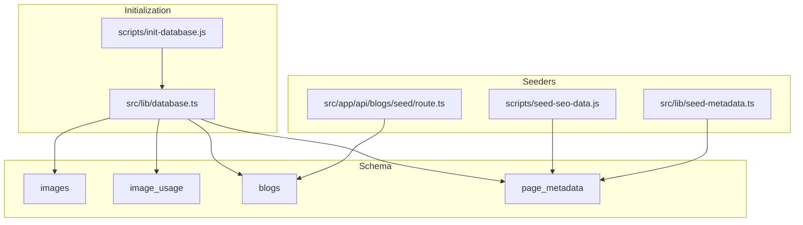
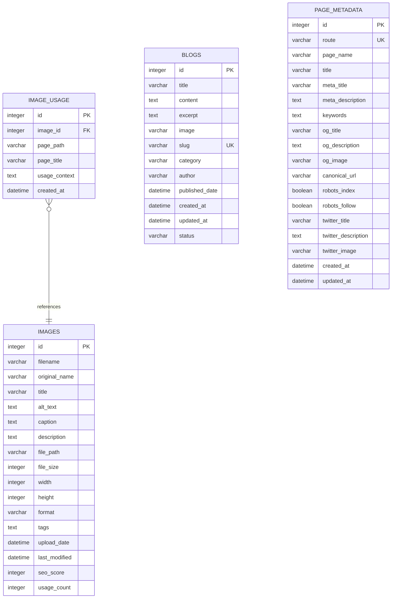
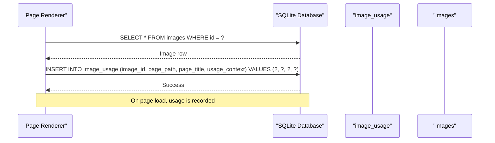
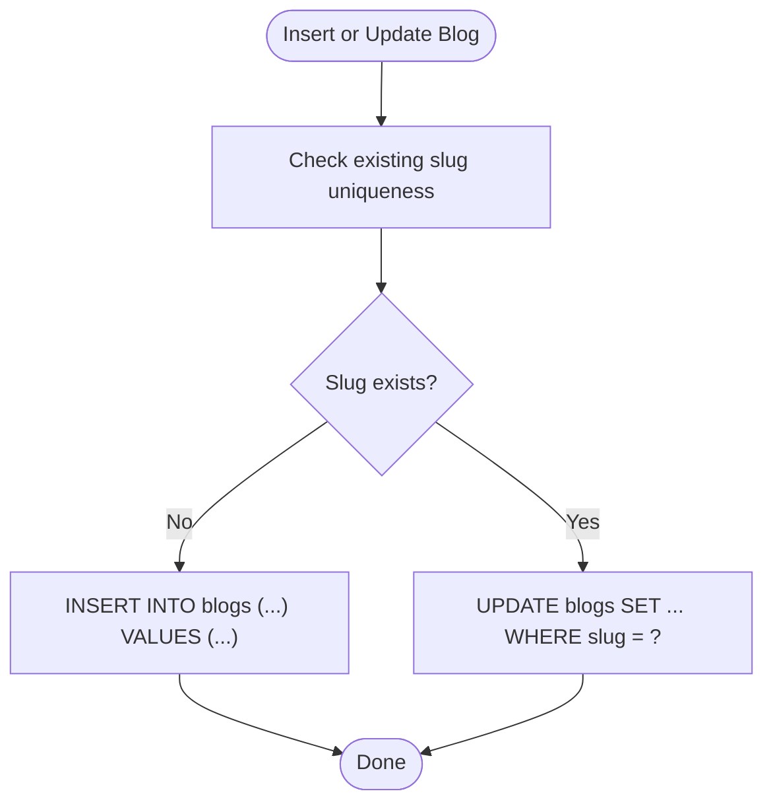
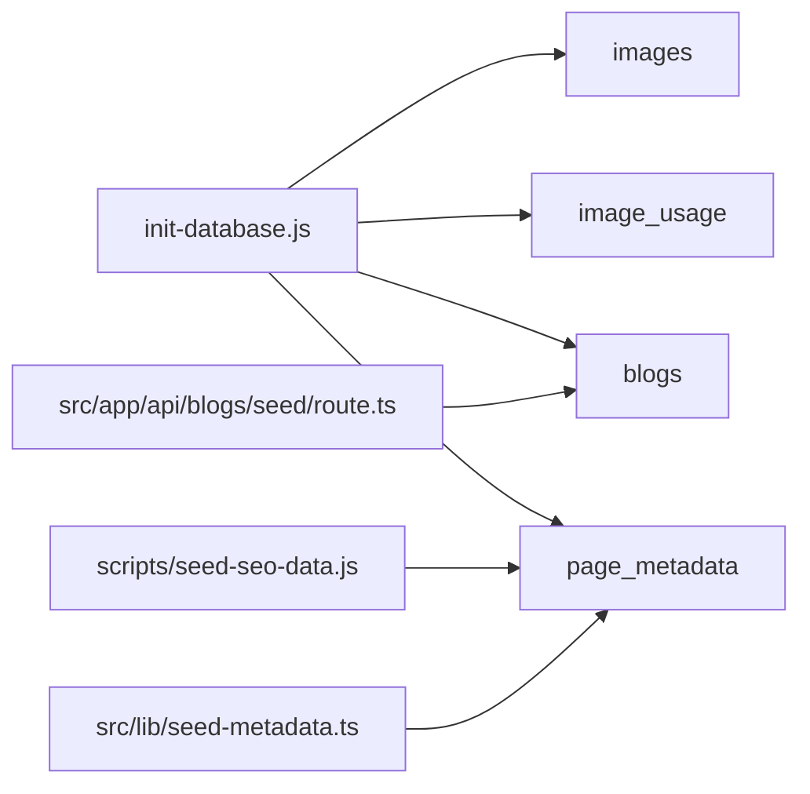

# Table Schema

<cite>
**Referenced Files in This Document**
- [init-database.js](file://scripts/init-database.js)
- [database.ts](file://src/lib/database.ts)
- [seed-seo-data.js](file://scripts/seed-seo-data.js)
- [seed-metadata.ts](file://src/lib/seed-metadata.ts)
- [route.ts](file://src/app/api/blogs/seed/route.ts)
</cite>

## Table of Contents
1. [Introduction](#introduction)
2. [Project Structure](#project-structure)
3. [Core Components](#core-components)
4. [Architecture Overview](#architecture-overview)
5. [Detailed Component Analysis](#detailed-component-analysis)
6. [Dependency Analysis](#dependency-analysis)
7. [Performance Considerations](#performance-considerations)
8. [Troubleshooting Guide](#troubleshooting-guide)
9. [Conclusion](#conclusion)
10. [Appendices](#appendices)

## Introduction
This document describes the SQLite database schema used by the project, focusing on four core tables: images, image_usage, blogs, and page_metadata. It explains table structures, primary keys, foreign key relationships, data types, constraints, indexes, and the rationale behind design decisions. It also provides SQL examples for common operations and query patterns.

## Project Structure
The database schema is initialized programmatically during application startup and development-time scripts. The authoritative table definitions are defined in the shared database library and validated by initialization scripts.

**Diagram sources**
- [init-database.js](file://scripts/init-database.js#L54-L92)
- [database.ts](file://src/lib/database.ts#L105-L181)
- [seed-seo-data.js](file://scripts/seed-seo-data.js#L134-L170)
- [seed-metadata.ts](file://src/lib/seed-metadata.ts#L69-L93)
- [route.ts](file://src/app/api/blogs/seed/route.ts#L84-L96)

**Section sources**
- [init-database.js](file://scripts/init-database.js#L54-L92)
- [database.ts](file://src/lib/database.ts#L105-L181)

## Core Components
This section documents each table’s structure, constraints, and typical usage patterns.

- images
  - Purpose: Stores uploaded image metadata, dimensions, file paths, SEO metrics, and usage counters.
  - Primary key: id (autoincrement)
  - Notable columns: filename, original_name, title, alt_text, caption, description, file_path, file_size, width, height, format, tags, upload_date, last_modified, seo_score, usage_count
  - Defaults and constraints: CURRENT_TIMESTAMP for timestamps; seo_score and usage_count default to 0
  - Indexes: None declared in schema; consider adding indexes on frequently filtered columns (e.g., filename, upload_date) for performance

- image_usage
  - Purpose: Tracks where images are used across pages, enabling usage analytics and cleanup decisions.
  - Primary key: id (autoincrement)
  - Foreign key: image_id references images(id)
  - Columns: page_path, page_title, usage_context, created_at
  - Defaults and constraints: CURRENT_TIMESTAMP for created_at; foreign key ensures referential integrity
  - Indexes: None declared; consider indexing image_id and page_path for frequent joins and lookups

- blogs
  - Purpose: Stores blog posts with SEO-friendly slugs, categorization, authorship, and status.
  - Primary key: id (autoincrement)
  - Unique constraints: slug (enforced via UNIQUE)
  - Columns: title, content, excerpt, image, slug, category, author, published_date, created_at, updated_at, status
  - Defaults and constraints: author defaults to Admin; status defaults to published; timestamps default to CURRENT_TIMESTAMP
  - Indexes: No explicit indexes; consider indexing slug, category, status, published_date for filtering and sorting

- page_metadata
  - Purpose: Centralizes SEO metadata per route, including Open Graph, Twitter Cards, canonical URL, and robots directives.
  - Primary key: id (autoincrement)
  - Unique constraints: route (enforced via UNIQUE)
  - Columns: route, page_name, title, meta_title, meta_description, keywords, og_title, og_description, og_image, canonical_url, robots_index, robots_follow, twitter_title, twitter_description, twitter_image, created_at, updated_at
  - Defaults and constraints: robots_index and robots_follow default to enabled; timestamps default to CURRENT_TIMESTAMP
  - Indexes: No explicit indexes; consider indexing route for fast lookups

**Section sources**
- [database.ts](file://src/lib/database.ts#L106-L181)
- [init-database.js](file://scripts/init-database.js#L55-L92)

## Architecture Overview
The schema supports two primary use cases:
- Image management and SEO: images and image_usage track file metadata and usage across pages.
- Page-level SEO: page_metadata centralizes SEO fields per route, with seeders ensuring baseline coverage.

**Diagram sources**
- [database.ts](file://src/lib/database.ts#L106-L181)

## Detailed Component Analysis

### images table
- Auto-incrementing primary key id
- File metadata: filename, original_name, file_path, file_size, format
- Dimensions: width, height
- SEO fields: title, alt_text, caption, description, tags, seo_score
- Timestamps: upload_date, last_modified
- Usage tracking: usage_count
- Typical operations:
  - Insert new image with metadata
  - Update alt_text and seo_score after SEO review
  - Increment usage_count when referenced by page metadata
  - Soft-delete pattern: mark as unused by clearing alt_text and tags, then prune by usage_count and last_modified

**Section sources**
- [database.ts](file://src/lib/database.ts#L106-L126)

### image_usage table
- Foreign key relationship: image_id → images.id
- Tracks page_path, page_title, usage_context, and created_at
- Typical operations:
  - Log usage when a page renders an image
  - Query usage by image_id to list pages
  - Query usage by page_path to find images used on a page
  - Cleanup orphaned usage entries when images are deleted

**Diagram sources**
- [database.ts](file://src/lib/database.ts#L129-L139)

**Section sources**
- [database.ts](file://src/lib/database.ts#L129-L139)

### blogs table
- Unique slug constraint ensures SEO-friendly, conflict-free URLs
- Authorship and categorization: author, category
- Status management: status field with default published
- Timestamps: created_at, updated_at, published_date
- Typical operations:
  - Upsert by slug for idempotent updates
  - Filter by category and status for listings
  - Publish/unpublish by toggling status

**Diagram sources**
- [route.ts](file://src/app/api/blogs/seed/route.ts#L84-L96)

**Section sources**
- [database.ts](file://src/lib/database.ts#L142-L157)
- [route.ts](file://src/app/api/blogs/seed/route.ts#L84-L96)

### page_metadata table
- Unique route constraint ensures one metadata record per page
- Comprehensive SEO fields: meta_title, meta_description, keywords, Open Graph, Twitter Cards, canonical_url
- Robots directives: robots_index, robots_follow
- Timestamps: created_at, updated_at
- Typical operations:
  - Seed initial routes during setup
  - Update metadata per route
  - Retrieve metadata by route for SSR/SSG rendering

**Section sources**
- [database.ts](file://src/lib/database.ts#L160-L181)
- [seed-seo-data.js](file://scripts/seed-seo-data.js#L134-L170)
- [seed-metadata.ts](file://src/lib/seed-metadata.ts#L69-L93)

## Dependency Analysis
- Referential integrity:
  - image_usage.image_id references images.id
- Initialization order:
  - images is created first
  - image_usage is created second with foreign key to images
  - blogs and page_metadata are created independently
- Seeders:
  - scripts/seed-seo-data.js seeds page_metadata with INSERT OR IGNORE
  - src/lib/seed-metadata.ts seeds page_metadata with existence checks
  - src/app/api/blogs/seed/route.ts seeds blogs with idempotent insert and UNIQUE handling

**Diagram sources**
- [init-database.js](file://scripts/init-database.js#L54-L92)
- [seed-seo-data.js](file://scripts/seed-seo-data.js#L134-L170)
- [seed-metadata.ts](file://src/lib/seed-metadata.ts#L69-L93)
- [route.ts](file://src/app/api/blogs/seed/route.ts#L84-L96)

**Section sources**
- [init-database.js](file://scripts/init-database.js#L54-L92)
- [database.ts](file://src/lib/database.ts#L105-L181)

## Performance Considerations
- Indexes: Add indexes on frequently queried columns:
  - images: filename, upload_date
  - image_usage: image_id, page_path
  - blogs: slug, category, status, published_date
  - page_metadata: route
- Queries:
  - Prefer selective projections (avoid SELECT *) to reduce IO
  - Use LIMIT and OFFSET for paginated lists
  - Consider partial indexes for status filtering if applicable
- Maintenance:
  - Periodic cleanup of unused images and usage logs
  - Vacuum and analyze periodically for large datasets

## Troubleshooting Guide
- UNIQUE constraint failures:
  - blogs.slug: handled by idempotent insert logic
  - page_metadata.route: INSERT OR IGNORE prevents duplicates
- Foreign key violations:
  - Ensure images exist before inserting into image_usage
- Missing records:
  - Use seeders to populate initial data for page_metadata and blogs
- Timestamp anomalies:
  - Defaults rely on CURRENT_TIMESTAMP; verify server timezone settings if discrepancies arise

**Section sources**
- [route.ts](file://src/app/api/blogs/seed/route.ts#L92-L96)
- [seed-seo-data.js](file://scripts/seed-seo-data.js#L149-L168)
- [seed-metadata.ts](file://src/lib/seed-metadata.ts#L74-L86)

## Conclusion
The schema is designed to support robust image management with usage tracking and comprehensive page-level SEO metadata. The foreign key relationship between image_usage and images enforces referential integrity, while unique constraints on slug and route prevent conflicts. With targeted indexes and maintenance routines, the schema scales to support growing content and usage volumes.

## Appendices

### SQL Examples for Common Operations
- Create tables (as executed by initialization):
  - See authoritative definitions in:
    - [database.ts](file://src/lib/database.ts#L106-L181)
    - [init-database.js](file://scripts/init-database.js#L55-L92)
- Insert or update blog by slug:
  - Upsert pattern using slug as unique key:
    - [route.ts](file://src/app/api/blogs/seed/route.ts#L84-L96)
- Seed page metadata:
  - Idempotent insertion by route:
    - [seed-seo-data.js](file://scripts/seed-seo-data.js#L134-L170)
    - [seed-metadata.ts](file://src/lib/seed-metadata.ts#L69-L93)
- Track image usage:
  - Record usage on page render:
    - [database.ts](file://src/lib/database.ts#L129-L139)
- Query usage by image:
  - List pages where an image is used:
    - [database.ts](file://src/lib/database.ts#L129-L139)
- Query usage by page:
  - Find images used on a specific page:
    - [database.ts](file://src/lib/database.ts#L129-L139)