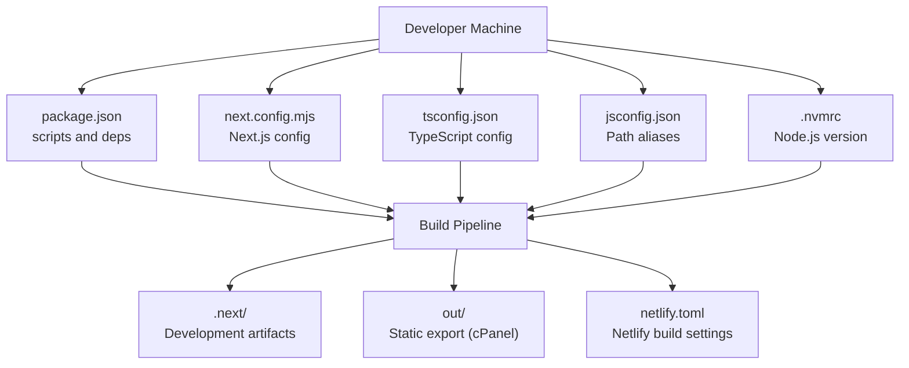
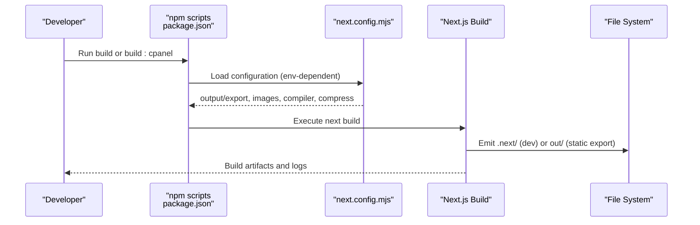
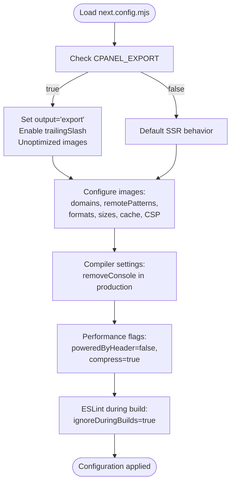
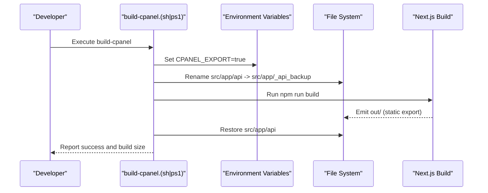
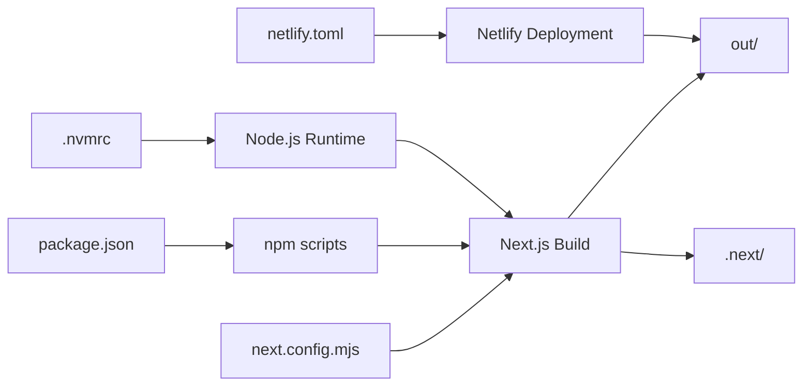

# Build Processes and Optimization

<cite>
**Referenced Files in This Document**
- [package.json](file://package.json)
- [next.config.mjs](file://next.config.mjs)
- [.nvmrc](file://.nvmrc)
- [netlify.toml](file://netlify.toml)
- [build-cpanel.sh](file://build-cpanel.sh)
- [build-cpanel.ps1](file://build-cpanel.ps1)
- [jsconfig.json](file://jsconfig.json)
- [tsconfig.json](file://tsconfig.json)
- [eslint.config.mjs](file://eslint.config.mjs)
</cite>

## Table of Contents
1. [Introduction](#introduction)
2. [Project Structure](#project-structure)
3. [Core Components](#core-components)
4. [Architecture Overview](#architecture-overview)
5. [Detailed Component Analysis](#detailed-component-analysis)
6. [Dependency Analysis](#dependency-analysis)
7. [Performance Considerations](#performance-considerations)
8. [Troubleshooting Guide](#troubleshooting-guide)
9. [Conclusion](#conclusion)
10. [Appendices](#appendices)

## Introduction
This document provides comprehensive build process documentation for attechglobal.com. It covers Next.js build configuration, static export settings, image optimization, performance optimizations, compiler settings, multi-environment build strategies, environment variable configuration, and build verification procedures. It also documents the build pipeline, dependency management via .nvmrc, package.json scripts, performance monitoring, bundle analysis, and troubleshooting guidance for build failures, memory issues, and optimization bottlenecks.

## Project Structure
The repository follows a Next.js App Router project layout with TypeScript and a clear separation of concerns:
- Source code resides under src/
- Build artifacts are emitted to .next/ during development and to out/ during static export
- Static export output is published to the out/ directory for hosting platforms that require static sites
- Environment-specific configuration is managed via environment variables and platform configuration files

**Diagram sources**
- [package.json](file://package.json#L5-L11)
- [next.config.mjs](file://next.config.mjs#L1-L129)
- [.nvmrc](file://.nvmrc#L1-L2)
- [tsconfig.json](file://tsconfig.json#L1-L39)
- [jsconfig.json](file://jsconfig.json#L1-L8)
- [netlify.toml](file://netlify.toml#L1-L21)

**Section sources**
- [package.json](file://package.json#L1-L41)
- [next.config.mjs](file://next.config.mjs#L1-L129)
- [.nvmrc](file://.nvmrc#L1-L2)
- [tsconfig.json](file://tsconfig.json#L1-L39)
- [jsconfig.json](file://jsconfig.json#L1-L8)
- [netlify.toml](file://netlify.toml#L1-L21)

## Core Components
- Next.js configuration: Controls static export, image optimization, console removal in production, compression, and ESLint behavior during builds.
- Package scripts: Define development, build, and deployment commands, including a dedicated cPanel export script.
- Environment configuration: Uses .nvmrc to pin Node.js version and environment variables to toggle static export behavior.
- Platform configuration: netlify.toml defines build command, publish directory, redirects, and security headers for Netlify deployments.

Key build configuration highlights:
- Static export for cPanel via CPANEL_EXPORT environment variable
- Image optimization with unoptimized mode for static export and remote pattern/domain allowances
- Console removal in production via compiler setting
- Compression enabled globally
- ESLint ignored during builds to reduce overhead

**Section sources**
- [next.config.mjs](file://next.config.mjs#L2-L126)
- [package.json](file://package.json#L5-L11)
- [.nvmrc](file://.nvmrc#L1-L2)
- [netlify.toml](file://netlify.toml#L1-L21)

## Architecture Overview
The build pipeline supports multiple environments and targets:
- Development: next dev with turbopack for fast refresh
- Production: next build for static export (cPanel) or server-side rendering (Netlify/Vercel)
- Static export: Controlled by CPANEL_EXPORT environment variable and validated by platform configuration

**Diagram sources**
- [package.json](file://package.json#L5-L11)
- [next.config.mjs](file://next.config.mjs#L2-L126)

## Detailed Component Analysis

### Next.js Build Configuration
- Static export toggle: When CPANEL_EXPORT is true, output is set to export, trailingSlash is enabled, and images are unoptimized.
- Image optimization: Remote patterns and domains are configured; formats include webp and avif; deviceSizes and imageSizes define responsive breakpoints; minimumCacheTTL sets caching behavior; SVG allowance and CSP are defined.
- Compiler settings: removeConsole is enabled in production to strip console statements.
- Performance flags: poweredByHeader disabled and compress enabled globally.
- ESLint: ignoreDuringBuilds is true to skip linting during builds.

**Diagram sources**
- [next.config.mjs](file://next.config.mjs#L2-L126)

**Section sources**
- [next.config.mjs](file://next.config.mjs#L5-L126)

### Multi-Environment Build Process
- cPanel static export: Triggered by CPANEL_EXPORT=true and build:cpanel script. The build excludes API routes by temporarily renaming src/app/api to src/app/_api_backup during build and restoring it afterward.
- Netlify/Vercel: Uses standard next build with publish directory out/, redirecting all routes to index.html for client-side routing, and applies security headers.

**Diagram sources**
- [build-cpanel.sh](file://build-cpanel.sh#L10-L62)
- [build-cpanel.ps1](file://build-cpanel.ps1#L9-L61)

**Section sources**
- [build-cpanel.sh](file://build-cpanel.sh#L1-L95)
- [build-cpanel.ps1](file://build-cpanel.ps1#L1-L92)
- [netlify.toml](file://netlify.toml#L1-L21)

### Environment Variable Configuration
- .nvmrc pins Node.js version to 20.x for consistent builds across environments.
- CPANEL_EXPORT toggles static export behavior in next.config.mjs.
- Netlify environment variable NODE_VERSION ensures the correct runtime for Netlify builds.

**Section sources**
- [.nvmrc](file://.nvmrc#L1-L2)
- [next.config.mjs](file://next.config.mjs#L3-L3)
- [netlify.toml](file://netlify.toml#L5-L6)

### Build Verification Procedures
- cPanel build verification: The scripts confirm the presence of out/ and print build size; they restore API routes on success or error to maintain repository integrity.
- Netlify verification: Redirects ensure SPA routing works; publish directory is out/.

**Section sources**
- [build-cpanel.sh](file://build-cpanel.sh#L64-L90)
- [build-cpanel.ps1](file://build-cpanel.ps1#L63-L87)
- [netlify.toml](file://netlify.toml#L8-L12)

### Image Optimization Settings
- Static export requires images to be unoptimized; domains and remotePatterns are configured to allow external images.
- Formats include webp and avif; deviceSizes and imageSizes define responsive breakpoints; minimumCacheTTL controls caching; SVG is allowed with a strict CSP.

**Section sources**
- [next.config.mjs](file://next.config.mjs#L10-L112)

### Compiler and Performance Optimizations
- Console removal: Enabled in production via compiler.removeConsole to reduce bundle size and log noise.
- Compression: Enabled globally via compress flag.
- ESLint during build: Disabled via ignoreDuringBuilds to speed up builds.

**Section sources**
- [next.config.mjs](file://next.config.mjs#L113-L126)

### Dependency Management with .nvmrc and package.json
- .nvmrc enforces Node.js 20.x for consistent builds.
- package.json scripts define dev, build, build:cpanel, start, and lint commands.
- Dependencies include Next.js, React, Bootstrap, sharp, and SQLite.

**Section sources**
- [.nvmrc](file://.nvmrc#L1-L2)
- [package.json](file://package.json#L5-L11)
- [package.json](file://package.json#L12-L39)

### TypeScript and Path Aliases
- tsconfig.json and jsconfig.json define path aliases (@/*) pointing to src/ for convenient imports.

**Section sources**
- [tsconfig.json](file://tsconfig.json#L25-L27)
- [jsconfig.json](file://jsconfig.json#L3-L5)

### ESLint Configuration
- eslint.config.mjs extends next/core-web-vitals for recommended rules and ignores TypeScript declaration files.

**Section sources**
- [eslint.config.mjs](file://eslint.config.mjs#L12-L14)

## Dependency Analysis
The build pipeline depends on:
- Node.js version pinned by .nvmrc
- Next.js configuration controlling export vs SSR behavior
- Platform configuration (netlify.toml) for Netlify deployments
- OS-specific build scripts for cPanel static export

**Diagram sources**
- [.nvmrc](file://.nvmrc#L1-L2)
- [package.json](file://package.json#L5-L11)
- [next.config.mjs](file://next.config.mjs#L1-L129)
- [netlify.toml](file://netlify.toml#L1-L21)

**Section sources**
- [.nvmrc](file://.nvmrc#L1-L2)
- [package.json](file://package.json#L5-L11)
- [next.config.mjs](file://next.config.mjs#L1-L129)
- [netlify.toml](file://netlify.toml#L1-L21)

## Performance Considerations
- Console removal in production reduces bundle size and removes noisy logs.
- Compression enabled globally improves transfer speeds.
- Static export with unoptimized images is required for cPanel hosting; external images are allowed via domains and remotePatterns.
- Device sizes and image sizes are tuned for responsive delivery; minimumCacheTTL helps with CDN caching.
- ESLint is skipped during builds to minimize overhead.

[No sources needed since this section provides general guidance]

## Troubleshooting Guide
Common build issues and resolutions:
- Static export fails due to API routes:
  - Use the cPanel build scripts which temporarily move src/app/api to src/app/_api_backup during build and restore it afterward.
- Memory issues during build:
  - Ensure Node.js version matches .nvmrc; consider increasing Node heap size if necessary.
- Image optimization errors:
  - Verify domains and remotePatterns in next.config.mjs; ensure images are served over HTTPS.
- Netlify deployment misconfiguration:
  - Confirm build command, publish directory, and redirects in netlify.toml.
- Console pollution in production:
  - Confirm compiler.removeConsole is enabled in production builds.

**Section sources**
- [build-cpanel.sh](file://build-cpanel.sh#L24-L61)
- [build-cpanel.ps1](file://build-cpanel.ps1#L23-L61)
- [next.config.mjs](file://next.config.mjs#L120-L126)
- [netlify.toml](file://netlify.toml#L1-L21)

## Conclusion
The build process for attechglobal.com is designed to support both static export for cPanel and server-side rendering for Netlify/Vercel. The configuration leverages environment variables to toggle static export behavior, optimizes images for performance, removes console statements in production, and enables compression. The provided scripts and platform configurations ensure reliable builds and predictable deployment outcomes.

[No sources needed since this section summarizes without analyzing specific files]

## Appendices

### Build Commands Reference
- Development: Runs Next.js dev server with turbopack for fast refresh.
- Production build: Standard Next.js build.
- cPanel build: Sets CPANEL_EXPORT and builds a static export.
- Start: Starts the production server.
- Lint: Runs ESLint.

**Section sources**
- [package.json](file://package.json#L5-L11)

### Static Export Checklist
- Confirm CPANEL_EXPORT is set for cPanel builds.
- Verify out/ directory is present after build.
- Ensure API routes are excluded from static export using the provided scripts.
- Validate image domains and remotePatterns in next.config.mjs.

**Section sources**
- [build-cpanel.sh](file://build-cpanel.sh#L10-L62)
- [build-cpanel.ps1](file://build-cpanel.ps1#L9-L61)
- [next.config.mjs](file://next.config.mjs#L10-L112)