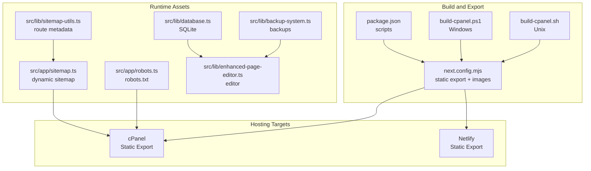
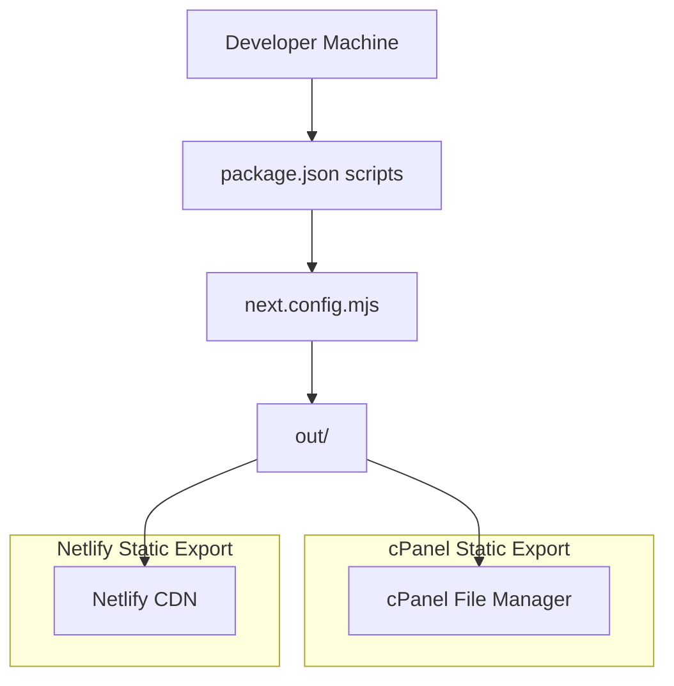
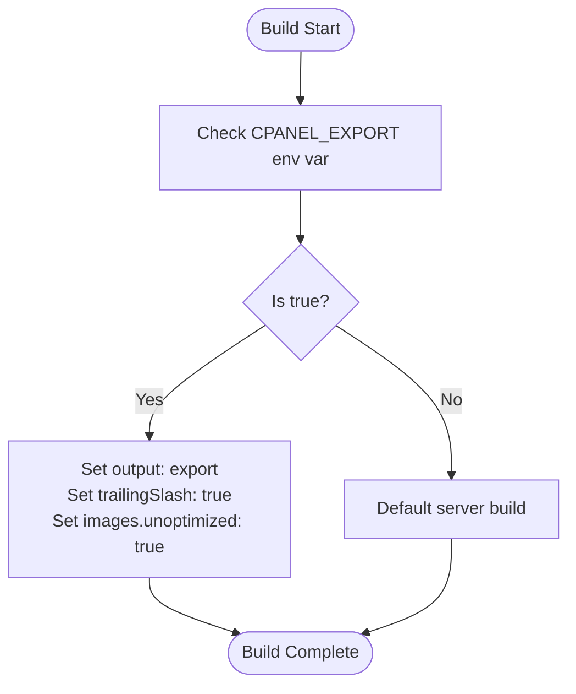
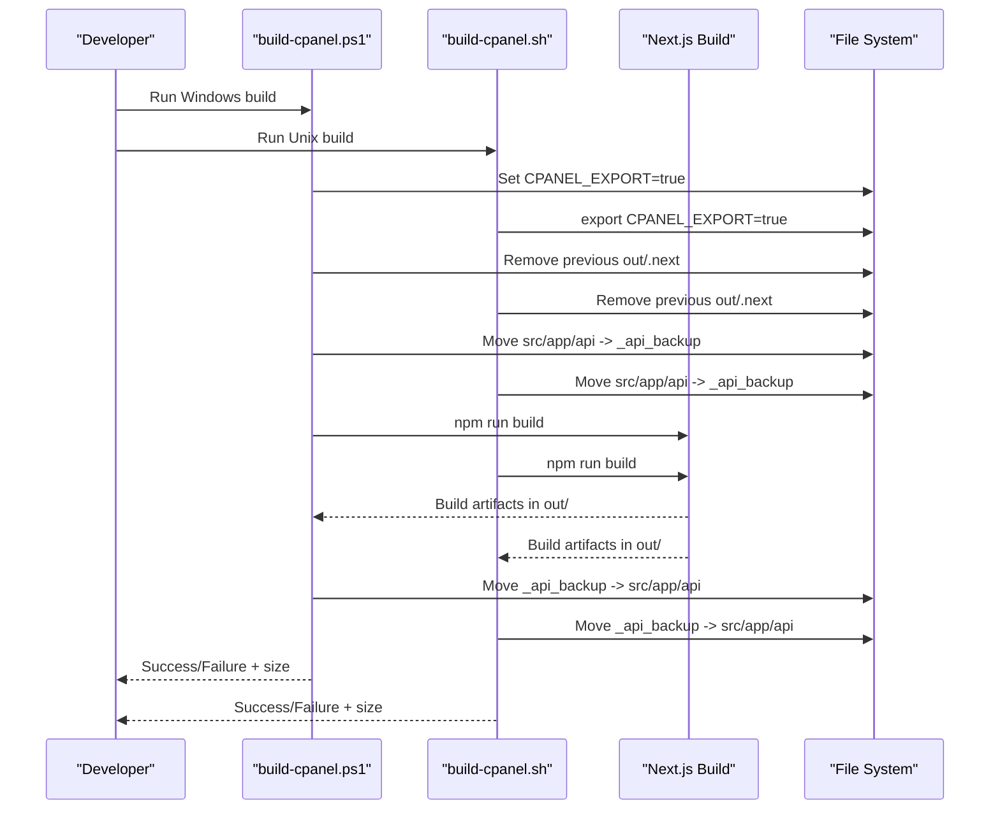
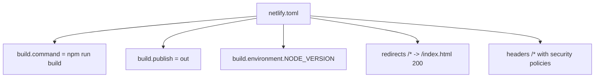
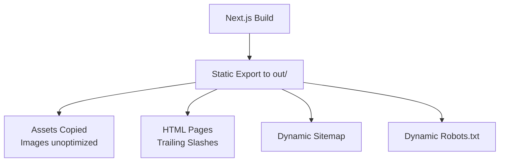
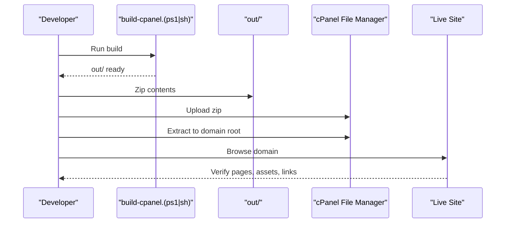
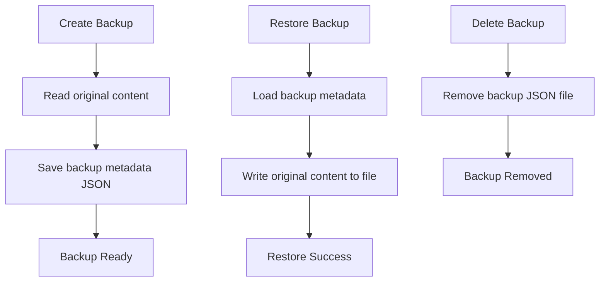
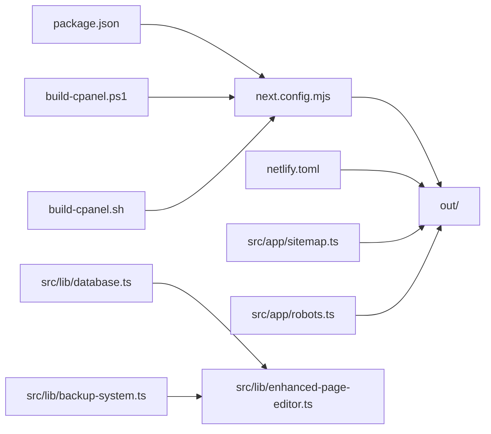

# Deployment and Operations

<cite>
**Referenced Files in This Document**
- [package.json](file://package.json)
- [next.config.mjs](file://next.config.mjs)
- [netlify.toml](file://netlify.toml)
- [build-cpanel.ps1](file://build-cpanel.ps1)
- [build-cpanel.sh](file://build-cpanel.sh)
- [CPANEL_DEPLOYMENT.md](file://CPANEL_DEPLOYMENT.md)
- [README.md](file://README.md)
- [src/app/layout.tsx](file://src/app/layout.tsx)
- [src/app/page.tsx](file://src/app/page.tsx)
- [src/app/sitemap.ts](file://src/app/sitemap.ts)
- [src/app/robots.ts](file://src/app/robots.ts)
- [src/lib/sitemap-utils.ts](file://src/lib/sitemap-utils.ts)
- [src/lib/database.ts](file://src/lib/database.ts)
- [src/lib/backup-system.ts](file://src/lib/backup-system.ts)
- [src/lib/enhanced-page-editor.ts](file://src/lib/enhanced-page-editor.ts)
</cite>

## Table of Contents
1. [Introduction](#introduction)
2. [Project Structure](#project-structure)
3. [Core Components](#core-components)
4. [Architecture Overview](#architecture-overview)
5. [Detailed Component Analysis](#detailed-component-analysis)
6. [Dependency Analysis](#dependency-analysis)
7. [Performance Considerations](#performance-considerations)
8. [Troubleshooting Guide](#troubleshooting-guide)
9. [Conclusion](#conclusion)
10. [Appendices](#appendices)

## Introduction
This document provides comprehensive deployment and operations guidance for attechglobal.com. It covers the complete deployment pipeline for Next.js static export targeting cPanel hosting, build optimization processes, environment configuration management, multi-platform build scripts, Netlify deployment configuration, and cPanel-specific deployment procedures. It also explains static site generation, asset optimization, performance monitoring setup, practical examples of build commands, environment variable configuration, deployment verification steps, monitoring and maintenance procedures, backup strategies, disaster recovery planning, scaling considerations, CDN integration, and security considerations for production environments.

## Project Structure
The project is a Next.js 15 application configured for both traditional server deployments and static export for cPanel. Key elements include:
- Next.js configuration for static export and image optimization
- Multi-platform build scripts for cPanel static export
- Netlify configuration for static hosting
- Dynamic sitemap and robots generation
- Local database and backup utilities for admin/editor features
- Enhanced page editor for content updates

**Diagram sources**
- [package.json](file://package.json#L5-L11)
- [next.config.mjs](file://next.config.mjs#L1-L129)
- [build-cpanel.ps1](file://build-cpanel.ps1#L1-L92)
- [build-cpanel.sh](file://build-cpanel.sh#L1-L95)
- [netlify.toml](file://netlify.toml#L1-L21)
- [src/app/sitemap.ts](file://src/app/sitemap.ts#L1-L154)
- [src/app/robots.ts](file://src/app/robots.ts#L1-L38)
- [src/lib/sitemap-utils.ts](file://src/lib/sitemap-utils.ts#L1-L196)
- [src/lib/database.ts](file://src/lib/database.ts#L1-L255)
- [src/lib/backup-system.ts](file://src/lib/backup-system.ts#L1-L119)
- [src/lib/enhanced-page-editor.ts](file://src/lib/enhanced-page-editor.ts#L1-L287)

**Section sources**
- [README.md](file://README.md#L1-L37)
- [package.json](file://package.json#L1-L41)
- [next.config.mjs](file://next.config.mjs#L1-L129)
- [netlify.toml](file://netlify.toml#L1-L21)
- [build-cpanel.ps1](file://build-cpanel.ps1#L1-L92)
- [build-cpanel.sh](file://build-cpanel.sh#L1-L95)

## Core Components
- Next.js static export configuration for cPanel
- Multi-platform build scripts that temporarily exclude API routes during static export
- Netlify configuration for static hosting with redirects and security headers
- Dynamic sitemap and robots generation with environment-aware base URLs
- Local SQLite-backed database and backup system for admin/editor features
- Enhanced page editor for content updates

**Section sources**
- [next.config.mjs](file://next.config.mjs#L1-L129)
- [build-cpanel.ps1](file://build-cpanel.ps1#L1-L92)
- [build-cpanel.sh](file://build-cpanel.sh#L1-L95)
- [netlify.toml](file://netlify.toml#L1-L21)
- [src/app/sitemap.ts](file://src/app/sitemap.ts#L1-L154)
- [src/app/robots.ts](file://src/app/robots.ts#L1-L38)
- [src/lib/database.ts](file://src/lib/database.ts#L1-L255)
- [src/lib/backup-system.ts](file://src/lib/backup-system.ts#L1-L119)
- [src/lib/enhanced-page-editor.ts](file://src/lib/enhanced-page-editor.ts#L1-L287)

## Architecture Overview
The deployment architecture supports two primary hosting targets:
- cPanel static export: Uses environment-driven configuration to enable static export, unoptimized images, and trailing slashes required for static hosting.
- Netlify static export: Uses a standard static export configuration with redirects to serve SPA-style routing and security headers.

**Diagram sources**
- [package.json](file://package.json#L5-L11)
- [next.config.mjs](file://next.config.mjs#L1-L129)
- [netlify.toml](file://netlify.toml#L1-L21)

## Detailed Component Analysis

### Next.js Static Export Configuration
Key behaviors for cPanel static export:
- Output mode set to static export when CPANEL_EXPORT is true
- Trailing slashes enabled for cPanel compatibility
- Images set to unoptimized for static export
- Image domains and remote patterns configured for static export
- ESLint ignored during builds, console removal in production, compression enabled

**Diagram sources**
- [next.config.mjs](file://next.config.mjs#L1-L129)

**Section sources**
- [next.config.mjs](file://next.config.mjs#L1-L129)

### Multi-Platform Build Scripts for cPanel
Both Windows (PowerShell) and Unix (Bash) scripts:
- Set CPANEL_EXPORT=true
- Clean previous builds
- Temporarily move API routes out of the way during build
- Run Next.js build
- Restore API routes after build completion
- Provide success/failure messaging and build size reporting
- Clear environment variable afterward

**Diagram sources**
- [build-cpanel.ps1](file://build-cpanel.ps1#L1-L92)
- [build-cpanel.sh](file://build-cpanel.sh#L1-L95)

**Section sources**
- [build-cpanel.ps1](file://build-cpanel.ps1#L1-L92)
- [build-cpanel.sh](file://build-cpanel.sh#L1-L95)

### Netlify Deployment Configuration
- Build command runs the standard Next.js build
- Publish directory is out/
- Node.js version pinned via environment variable
- Redirects all routes to index.html for SPA routing
- Security headers applied globally

**Diagram sources**
- [netlify.toml](file://netlify.toml#L1-L21)

**Section sources**
- [netlify.toml](file://netlify.toml#L1-L21)

### Static Site Generation and Asset Optimization
- Static export produces a complete static site in out/
- Images are unoptimized for static export; original assets are included
- Trailing slashes ensure correct static routing
- Compression enabled in Next.js config
- Sitemap and robots are generated dynamically with environment-aware base URLs

**Diagram sources**
- [next.config.mjs](file://next.config.mjs#L1-L129)
- [src/app/sitemap.ts](file://src/app/sitemap.ts#L1-L154)
- [src/app/robots.ts](file://src/app/robots.ts#L1-L38)

**Section sources**
- [next.config.mjs](file://next.config.mjs#L1-L129)
- [src/app/sitemap.ts](file://src/app/sitemap.ts#L1-L154)
- [src/app/robots.ts](file://src/app/robots.ts#L1-L38)

### Environment Variable Configuration
- CPANEL_EXPORT=true enables static export and related settings
- NEXT_PUBLIC_BASE_URL drives sitemap and robots base URLs
- NODE_VERSION pinned for Netlify builds

Practical examples:
- Build for cPanel: set CPANEL_EXPORT=true && next build
- Build via npm script: npm run build:cpanel
- Netlify build: npm run build (with NODE_VERSION set)

**Section sources**
- [next.config.mjs](file://next.config.mjs#L1-L129)
- [package.json](file://package.json#L5-L11)
- [netlify.toml](file://netlify.toml#L5-L6)
- [src/app/sitemap.ts](file://src/app/sitemap.ts#L89-L101)
- [src/app/robots.ts](file://src/app/robots.ts#L8-L20)

### cPanel-Specific Deployment Procedures
- Build using either PowerShell or Bash script
- Zip the contents of out/ (not the folder itself)
- Upload to cPanel File Manager
- Extract into public_html or domain folder
- Verify deployment and test pages

**Diagram sources**
- [CPANEL_DEPLOYMENT.md](file://CPANEL_DEPLOYMENT.md#L1-L187)
- [build-cpanel.ps1](file://build-cpanel.ps1#L1-L92)
- [build-cpanel.sh](file://build-cpanel.sh#L1-L95)

**Section sources**
- [CPANEL_DEPLOYMENT.md](file://CPANEL_DEPLOYMENT.md#L1-L187)

### Monitoring and Maintenance Procedures
- Monitor site performance using built-in compression and image formats
- Track deployment success via build scripts’ success/failure messages
- Maintain sitemap and robots for SEO health
- Use backup system for content and configuration changes
- Keep Netlify logs and cPanel error logs for troubleshooting

**Section sources**
- [next.config.mjs](file://next.config.mjs#L120-L126)
- [src/lib/backup-system.ts](file://src/lib/backup-system.ts#L1-L119)
- [src/app/sitemap.ts](file://src/app/sitemap.ts#L12-L15)
- [src/app/robots.ts](file://src/app/robots.ts#L1-L38)

### Backup Strategies and Disaster Recovery
- Backup system stores JSON metadata with original content snapshots
- Backups are stored in a local backups directory
- Restoration writes original content back to the target file
- Deletion supported for individual backups

**Diagram sources**
- [src/lib/backup-system.ts](file://src/lib/backup-system.ts#L33-L82)

**Section sources**
- [src/lib/backup-system.ts](file://src/lib/backup-system.ts#L1-L119)

### Security Considerations for Production
- Security headers enforced on Netlify (X-Frame-Options, X-XSS-Protection, X-Content-Type-Options, Referrer-Policy)
- Image security policy restricts scripts and sandboxes
- Console logging removed in production builds
- API routes excluded from static export to prevent runtime errors

**Section sources**
- [netlify.toml](file://netlify.toml#L14-L21)
- [next.config.mjs](file://next.config.mjs#L110-L122)
- [build-cpanel.ps1](file://build-cpanel.ps1#L23-L34)
- [build-cpanel.sh](file://build-cpanel.sh#L24-L37)

### Automated Deployment Workflows
- Use build scripts to automate cPanel deployments
- For Netlify, commit changes and rely on CI/CD pipeline using netlify.toml
- Maintain environment variables for base URLs and Node version

**Section sources**
- [build-cpanel.ps1](file://build-cpanel.ps1#L1-L92)
- [build-cpanel.sh](file://build-cpanel.sh#L1-L95)
- [netlify.toml](file://netlify.toml#L1-L21)

## Dependency Analysis
The deployment pipeline depends on:
- Next.js configuration controlling static export and image behavior
- Build scripts orchestrating environment variables and API route exclusion
- Hosting configurations (cPanel and Netlify) for static delivery
- Runtime utilities for sitemap, robots, database, backup, and page editing

**Diagram sources**
- [next.config.mjs](file://next.config.mjs#L1-L129)
- [package.json](file://package.json#L5-L11)
- [build-cpanel.ps1](file://build-cpanel.ps1#L1-L92)
- [build-cpanel.sh](file://build-cpanel.sh#L1-L95)
- [netlify.toml](file://netlify.toml#L1-L21)
- [src/app/sitemap.ts](file://src/app/sitemap.ts#L1-L154)
- [src/app/robots.ts](file://src/app/robots.ts#L1-L38)
- [src/lib/database.ts](file://src/lib/database.ts#L1-L255)
- [src/lib/backup-system.ts](file://src/lib/backup-system.ts#L1-L119)
- [src/lib/enhanced-page-editor.ts](file://src/lib/enhanced-page-editor.ts#L1-L287)

**Section sources**
- [package.json](file://package.json#L5-L11)
- [next.config.mjs](file://next.config.mjs#L1-L129)
- [netlify.toml](file://netlify.toml#L1-L21)
- [src/app/sitemap.ts](file://src/app/sitemap.ts#L1-L154)
- [src/app/robots.ts](file://src/app/robots.ts#L1-L38)
- [src/lib/database.ts](file://src/lib/database.ts#L1-L255)
- [src/lib/backup-system.ts](file://src/lib/backup-system.ts#L1-L119)
- [src/lib/enhanced-page-editor.ts](file://src/lib/enhanced-page-editor.ts#L1-L287)

## Performance Considerations
- Compression enabled in Next.js configuration improves transfer speeds
- Image formats AVIF and WebP configured for modern browsers
- Console logs removed in production builds to reduce bundle size
- Static export eliminates server costs and improves global CDN performance
- Trailing slashes ensure correct static routing and reduce 404s

**Section sources**
- [next.config.mjs](file://next.config.mjs#L120-L126)
- [next.config.mjs](file://next.config.mjs#L106-L111)

## Troubleshooting Guide
Common issues and resolutions:
- Build fails due to API routes: scripts automatically exclude API routes during static export
- Pages not loading: verify trailing slashes and correct extraction in cPanel
- Images not showing: confirm assets are included and paths are correct
- CSS/JS not loading: verify _next/static is present and file permissions are correct
- Netlify deployment errors: check build logs, redirects, and security headers

Verification steps:
- Confirm out/ exists and contains expected files
- Validate sitemap and robots generation
- Test navigation and responsiveness
- Review browser console for 404s or CSP violations

**Section sources**
- [build-cpanel.ps1](file://build-cpanel.ps1#L113-L137)
- [build-cpanel.sh](file://build-cpanel.sh#L40-L62)
- [CPANEL_DEPLOYMENT.md](file://CPANEL_DEPLOYMENT.md#L111-L137)
- [netlify.toml](file://netlify.toml#L8-L21)

## Conclusion
The deployment and operations strategy leverages Next.js static export for efficient cPanel hosting, with robust multi-platform build scripts, Netlify configuration for alternative hosting, and comprehensive runtime utilities for SEO, backups, and content editing. By following the documented procedures and troubleshooting steps, teams can reliably deploy, monitor, and maintain the attechglobal.com marketing agency website.

## Appendices

### Practical Examples
- Build for cPanel (Windows): [build-cpanel.ps1](file://build-cpanel.ps1#L8-L21)
- Build for cPanel (Unix): [build-cpanel.sh](file://build-cpanel.sh#L10-L22)
- Build via npm script: [package.json](file://package.json#L8-L8)
- Netlify build configuration: [netlify.toml](file://netlify.toml#L1-L3)
- Environment variables: [next.config.mjs](file://next.config.mjs#L3-L3), [netlify.toml](file://netlify.toml#L5-L6), [src/app/sitemap.ts](file://src/app/sitemap.ts#L89-L101), [src/app/robots.ts](file://src/app/robots.ts#L8-L20)

### Deployment Verification Checklist
- [ ] Build completes successfully
- [ ] out/ contains expected pages and assets
- [ ] Sitemap and robots generated correctly
- [ ] Live site loads without 404s
- [ ] Images and styles render properly
- [ ] Navigation works across pages
- [ ] Mobile responsiveness verified

**Section sources**
- [CPANEL_DEPLOYMENT.md](file://CPANEL_DEPLOYMENT.md#L139-L156)
- [src/app/sitemap.ts](file://src/app/sitemap.ts#L12-L15)
- [src/app/robots.ts](file://src/app/robots.ts#L1-L5)