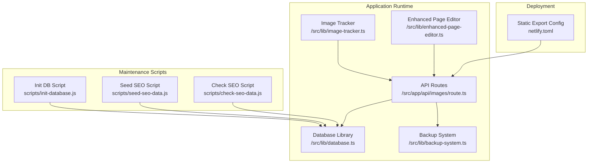
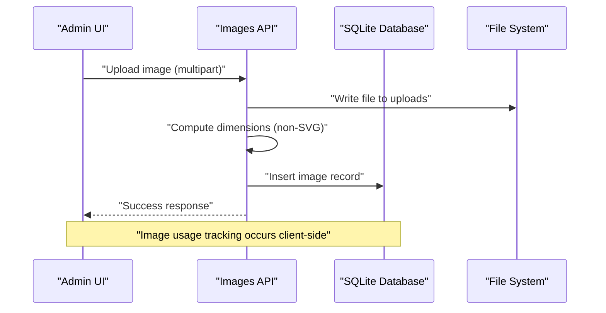
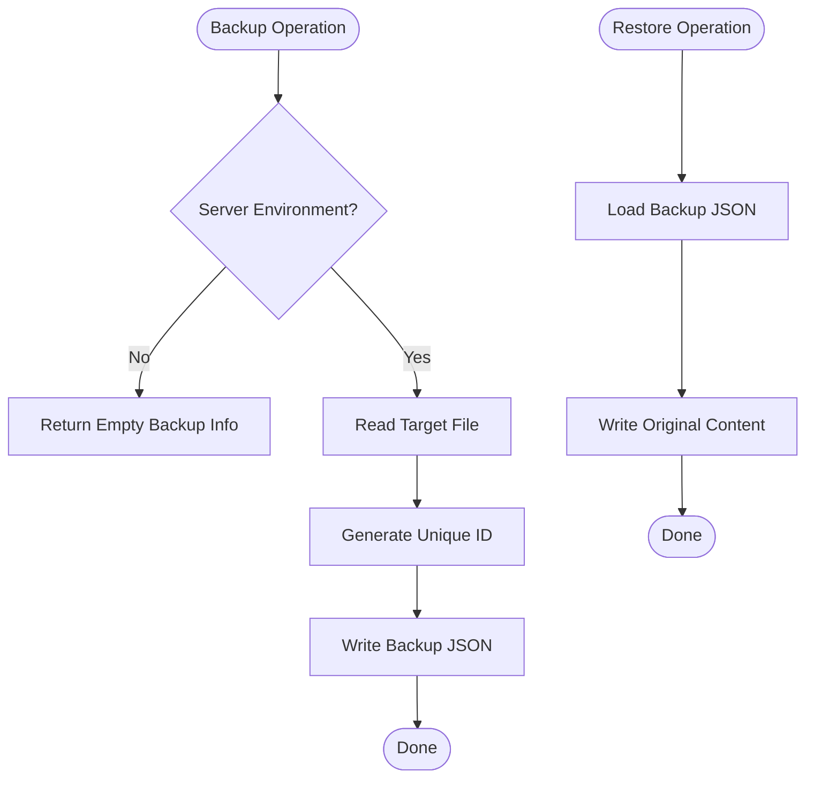
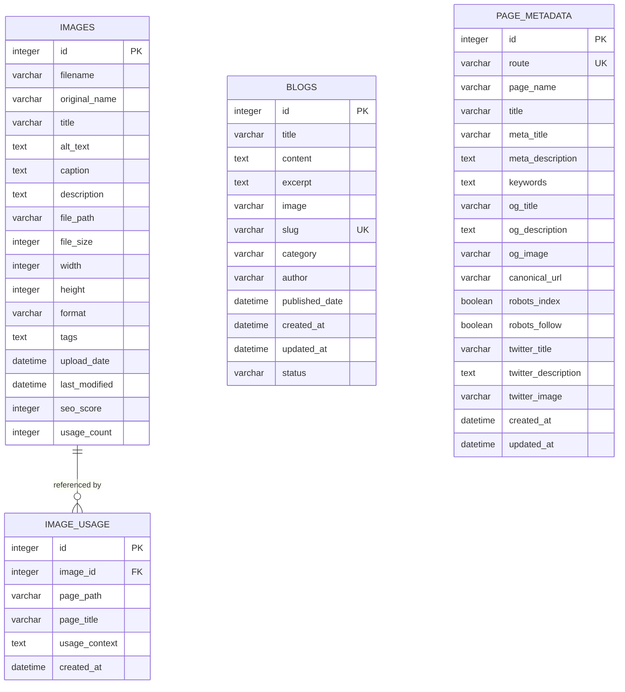
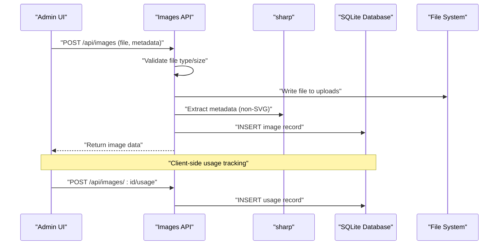
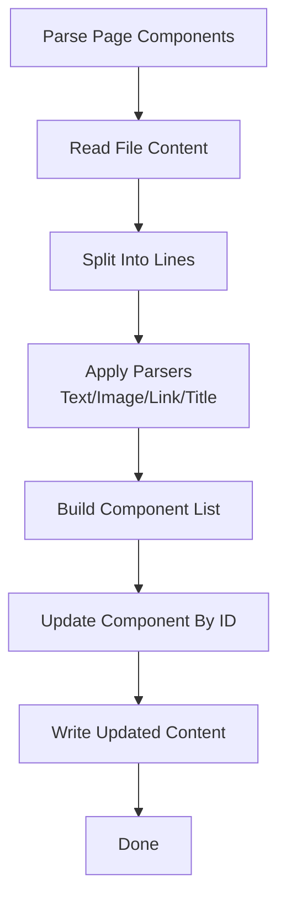
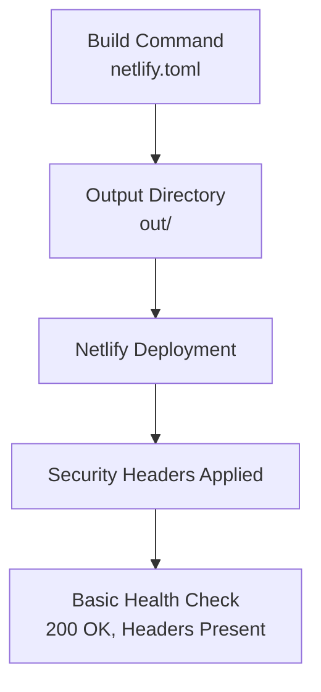
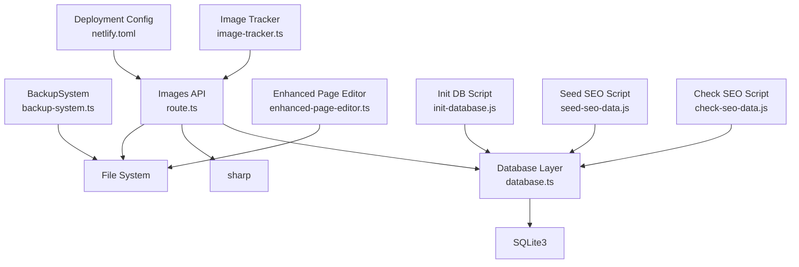

# Monitoring and Maintenance

<cite>
**Referenced Files in This Document**
- [backup-system.ts](file://src/lib/backup-system.ts)
- [database.ts](file://src/lib/database.ts)
- [init-database.js](file://scripts/init-database.js)
- [netlify.toml](file://netlify.toml)
- [package.json](file://package.json)
- [image-tracker.ts](file://src/lib/image-tracker.ts)
- [enhanced-page-editor.ts](file://src/lib/enhanced-page-editor.ts)
- [route.ts](file://src/app/api/images/route.ts)
- [ADMIN_DASHBOARD_SETUP.md](file://ADMIN_DASHBOARD_SETUP.md)
- [IMAGE_MANAGEMENT_SETUP.md](file://IMAGE_MANAGEMENT_SETUP.md)
- [SEO_MANAGEMENT_GUIDE.md](file://SEO_MANAGEMENT_GUIDE.md)
- [check-seo-data.js](file://scripts/check-seo-data.js)
- [seed-seo-data.js](file://scripts/seed-seo-data.js)
</cite>

## Table of Contents
1. [Introduction](#introduction)
2. [Project Structure](#project-structure)
3. [Core Components](#core-components)
4. [Architecture Overview](#architecture-overview)
5. [Detailed Component Analysis](#detailed-component-analysis)
6. [Dependency Analysis](#dependency-analysis)
7. [Performance Considerations](#performance-considerations)
8. [Troubleshooting Guide](#troubleshooting-guide)
9. [Conclusion](#conclusion)
10. [Appendices](#appendices)

## Introduction
This document provides comprehensive monitoring and maintenance guidance for attechglobal.com. It covers the backup system implementation, database maintenance procedures, automated backup strategies, performance monitoring setup, error tracking, health checks, maintenance workflows (database cleanup, image optimization, content updates), disaster recovery and rollback procedures, alerting integration, and operational practices. The content is grounded in the repository’s code and documentation to ensure accuracy and practical applicability.

## Project Structure
The project is a Next.js application with a focus on admin dashboards, image management, and SEO metadata management. Key areas relevant to monitoring and maintenance include:
- Backup system library for file-based backups
- SQLite-based image and metadata database
- Admin dashboard with authentication and management features
- Image upload and usage tracking APIs
- Static export deployment configuration
- Scripts for database initialization and seeding

**Diagram sources**
- [route.ts](file://src/app/api/images/route.ts#L1-L182)
- [database.ts](file://src/lib/database.ts#L1-L255)
- [backup-system.ts](file://src/lib/backup-system.ts#L1-L119)
- [image-tracker.ts](file://src/lib/image-tracker.ts#L1-L95)
- [enhanced-page-editor.ts](file://src/lib/enhanced-page-editor.ts#L1-L287)
- [netlify.toml](file://netlify.toml#L1-L21)
- [init-database.js](file://scripts/init-database.js#L1-L120)
- [seed-seo-data.js](file://scripts/seed-seo-data.js#L1-L171)
- [check-seo-data.js](file://scripts/check-seo-data.js#L1-L59)

**Section sources**
- [package.json](file://package.json#L1-L41)
- [netlify.toml](file://netlify.toml#L1-L21)

## Core Components
- Backup System: Provides backup creation, restoration, listing, and deletion for arbitrary files. Backups are stored as JSON metadata alongside original content.
- Database Layer: Initializes and manages SQLite tables for images, image usage, blogs, and page metadata. Includes helpers for queries and connection lifecycle.
- Image Management API: Handles uploads, metadata persistence, dimension extraction, SEO scoring, and usage tracking.
- Image Tracker: Client-side utility to scan pages and record image usage via API calls.
- Enhanced Page Editor: Parses page components for editable content and supports targeted updates.
- Admin Dashboard: Authentication and management UI for administrative tasks.
- Deployment: Static export configuration for Netlify with security headers.

**Section sources**
- [backup-system.ts](file://src/lib/backup-system.ts#L1-L119)
- [database.ts](file://src/lib/database.ts#L1-L255)
- [route.ts](file://src/app/api/images/route.ts#L1-L182)
- [image-tracker.ts](file://src/lib/image-tracker.ts#L1-L95)
- [enhanced-page-editor.ts](file://src/lib/enhanced-page-editor.ts#L1-L287)
- [ADMIN_DASHBOARD_SETUP.md](file://ADMIN_DASHBOARD_SETUP.md#L1-L244)
- [netlify.toml](file://netlify.toml#L1-L21)

## Architecture Overview
The monitoring and maintenance architecture centers around:
- Centralized logging and error handling in API routes and libraries
- Database-backed state for images, usage, and SEO metadata
- Static export deployment with security headers
- Client-side image usage tracking and server-side backup/restore

**Diagram sources**
- [route.ts](file://src/app/api/images/route.ts#L77-L182)
- [database.ts](file://src/lib/database.ts#L100-L184)

## Detailed Component Analysis

### Backup System
The backup system enables safe modifications by preserving original content and metadata. It operates in server environments and writes backup JSON files containing the original content and identifying metadata.

Key behaviors:
- Backup creation: Reads target file, generates unique ID, persists JSON backup
- Restore: Loads backup JSON, writes original content back to target path
- Listing: Scans backup directory and parses JSON metadata
- Deletion: Removes backup JSON file

Operational notes:
- Backups are stored in a dedicated directory and are JSON-based
- Client-side environments return empty metadata for safety
- Errors are logged to console during backup/restore/list/delete operations

**Diagram sources**
- [backup-system.ts](file://src/lib/backup-system.ts#L33-L115)

**Section sources**
- [backup-system.ts](file://src/lib/backup-system.ts#L1-L119)

### Database Layer and Maintenance Procedures
The database layer initializes SQLite tables for images, image usage, blogs, and page metadata. It exposes helpers for running queries and managing connections.

Maintenance procedures:
- Initialization: Ensures data directory exists and creates tables on first run
- Connection lifecycle: Initialize, use, and close database connections
- Query helpers: Run, get, and list queries with promise-based wrappers
- Cleanup: Drop and recreate tables via initialization script for testing/reset scenarios

**Diagram sources**
- [database.ts](file://src/lib/database.ts#L18-L81)
- [database.ts](file://src/lib/database.ts#L100-L184)

**Section sources**
- [database.ts](file://src/lib/database.ts#L1-L255)
- [init-database.js](file://scripts/init-database.js#L1-L120)

### Image Management API and Workflows
The image management API handles uploads, metadata persistence, dimension extraction, SEO scoring, and usage tracking. It integrates with the database layer and file system.

Key workflows:
- Upload: Validates type/size, saves file, computes dimensions (non-SVG), calculates SEO score, inserts record
- Usage tracking: Client-side scanning detects images and records usage via API
- Metadata editing: Supports updates to titles, alt text, captions, descriptions, and tags
- Cleanup: Deletion removes both database records and files

**Diagram sources**
- [route.ts](file://src/app/api/images/route.ts#L77-L182)
- [image-tracker.ts](file://src/lib/image-tracker.ts#L10-L43)
- [database.ts](file://src/lib/database.ts#L100-L184)

**Section sources**
- [route.ts](file://src/app/api/images/route.ts#L1-L182)
- [image-tracker.ts](file://src/lib/image-tracker.ts#L1-L95)
- [IMAGE_MANAGEMENT_SETUP.md](file://IMAGE_MANAGEMENT_SETUP.md#L1-L190)

### Enhanced Page Editor
The enhanced page editor parses page components to identify editable content and supports targeted updates. It is server-side focused and reads page files to extract components.

Key behaviors:
- Parse components: Detects text, images, links, and titles across JSX patterns
- Context-aware updates: Replaces content considering line positions and surrounding context
- Preview: Provides a placeholder for page previews

**Diagram sources**
- [enhanced-page-editor.ts](file://src/lib/enhanced-page-editor.ts#L78-L287)

**Section sources**
- [enhanced-page-editor.ts](file://src/lib/enhanced-page-editor.ts#L1-L287)

### Admin Dashboard and Security
The admin dashboard provides authentication, protected routes, and management features. Security includes JWT-based authentication, middleware protection, and session management.

Operational notes:
- Default credentials are provided for development; must be changed in production
- Environment variables for JWT secret and base URL should be configured
- Middleware protects admin routes and redirects unauthenticated users

**Section sources**
- [ADMIN_DASHBOARD_SETUP.md](file://ADMIN_DASHBOARD_SETUP.md#L1-L244)

### Deployment and Health Checks
The project uses static export for deployment with security headers applied globally. Health checks can be performed by verifying:
- Build succeeds and publishes to the expected output directory
- Security headers are present in responses
- API endpoints respond without internal errors

**Diagram sources**
- [netlify.toml](file://netlify.toml#L1-L21)

**Section sources**
- [netlify.toml](file://netlify.toml#L1-L21)

## Dependency Analysis
The following diagram highlights key dependencies among components relevant to monitoring and maintenance.

**Diagram sources**
- [backup-system.ts](file://src/lib/backup-system.ts#L1-L119)
- [database.ts](file://src/lib/database.ts#L1-L255)
- [route.ts](file://src/app/api/images/route.ts#L1-L182)
- [image-tracker.ts](file://src/lib/image-tracker.ts#L1-L95)
- [enhanced-page-editor.ts](file://src/lib/enhanced-page-editor.ts#L1-L287)
- [init-database.js](file://scripts/init-database.js#L1-L120)
- [seed-seo-data.js](file://scripts/seed-seo-data.js#L1-L171)
- [check-seo-data.js](file://scripts/check-seo-data.js#L1-L59)
- [netlify.toml](file://netlify.toml#L1-L21)

**Section sources**
- [package.json](file://package.json#L1-L41)

## Performance Considerations
- Image processing: Non-SVG images are processed to extract dimensions; ensure sufficient memory for large images.
- Database queries: Pagination and filtering are supported in the images API; use them to avoid heavy loads.
- Static export: Deployment relies on static export; monitor build times and output size.
- Client-side tracking: Image usage tracking runs after page load; ensure minimal impact on perceived performance.

[No sources needed since this section provides general guidance]

## Troubleshooting Guide
Common issues and remedies:
- Database not initialized: Run the initialization script to create tables and directories.
- Upload failures: Verify file type and size constraints; ensure write permissions for uploads directory.
- Images not loading: Confirm file paths and permissions; check that uploads directory exists.
- SEO scores not updating: Refresh the page after editing metadata.
- Authentication problems: Verify JWT secret, localStorage tokens, and middleware configuration.
- Missing page metadata: Use the SEO seed script to populate initial records; confirm table existence and counts.

**Section sources**
- [IMAGE_MANAGEMENT_SETUP.md](file://IMAGE_MANAGEMENT_SETUP.md#L153-L167)
- [ADMIN_DASHBOARD_SETUP.md](file://ADMIN_DASHBOARD_SETUP.md#L210-L231)
- [check-seo-data.js](file://scripts/check-seo-data.js#L1-L59)
- [seed-seo-data.js](file://scripts/seed-seo-data.js#L1-L171)

## Conclusion
The attechglobal.com codebase provides a solid foundation for monitoring and maintenance through its backup system, SQLite-backed data model, image management API, client-side usage tracking, and admin dashboard. By following the documented procedures for initialization, backups, cleanup, and deployments, the site can maintain reliability and performance. Integrating external monitoring and alerting tools, along with adhering to the maintenance schedules and security practices outlined below, will further strengthen operations.

[No sources needed since this section summarizes without analyzing specific files]

## Appendices

### Backup and Disaster Recovery Procedures
- Automated backup strategies:
  - Use the backup system to snapshot critical files before content or metadata changes.
  - Schedule periodic backups of the data directory and uploads folder.
- Manual backup/restore:
  - Create backups via the backup system before performing destructive edits.
  - Restore from backups when rollbacks are required.
- Rollback strategy:
  - Maintain multiple backup snapshots to enable granular rollbacks.
  - Validate restored content and database integrity after rollback.
- Disaster recovery:
  - Recreate the database using the initialization script.
  - Re-seed SEO metadata using the seed script if needed.
  - Re-upload or restore images from the uploads directory.

**Section sources**
- [backup-system.ts](file://src/lib/backup-system.ts#L33-L115)
- [init-database.js](file://scripts/init-database.js#L94-L120)
- [seed-seo-data.js](file://scripts/seed-seo-data.js#L134-L171)

### Database Maintenance Procedures
- Regular maintenance:
  - Periodically review and prune unused images and metadata.
  - Monitor database size and optimize queries with filters and pagination.
- Cleanup:
  - Remove orphaned records and unused files.
  - Reinitialize the database for testing/reset scenarios using the initialization script.
- Integrity checks:
  - Verify table existence and counts using the SEO check script.

**Section sources**
- [database.ts](file://src/lib/database.ts#L84-L212)
- [check-seo-data.js](file://scripts/check-seo-data.js#L14-L58)

### Performance Monitoring and Error Tracking
- Logging:
  - API routes and libraries log errors to the console; surface these logs in your hosting environment.
- Metrics collection:
  - Integrate external monitoring tools to track build success, response times, and error rates.
- Health checks:
  - Verify deployment health by checking static export output and response headers.
  - Monitor API endpoints for successful responses and database connectivity.

**Section sources**
- [route.ts](file://src/app/api/images/route.ts#L71-L75)
- [netlify.toml](file://netlify.toml#L14-L21)

### Maintenance Workflows
- Database cleanup:
  - Identify unused images and remove associated records and files.
- Image optimization:
  - Use the image management dashboard to update metadata and ensure alt texts are descriptive.
- Content updates:
  - Use the enhanced page editor to locate and update specific components.
- SEO updates:
  - Use the admin dashboard to manage page metadata and ensure canonical URLs and robots settings are correct.

**Section sources**
- [enhanced-page-editor.ts](file://src/lib/enhanced-page-editor.ts#L50-L100)
- [IMAGE_MANAGEMENT_SETUP.md](file://IMAGE_MANAGEMENT_SETUP.md#L49-L100)
- [SEO_MANAGEMENT_GUIDE.md](file://SEO_MANAGEMENT_GUIDE.md#L1-L92)

### Alerting Systems and Monitoring Tools Integration
- Recommended integrations:
  - Build and deployment alerts via your CI/CD provider.
  - Application error tracking using hosted logging and error reporting services.
  - Uptime and synthetic monitoring for critical endpoints.
- Configuration:
  - Ensure logs are streamed and searchable.
  - Set up alerts for failed builds, database errors, and API downtime.

[No sources needed since this section provides general guidance]

### Maintenance Schedules and Update Procedures
- Daily:
  - Monitor error logs and API health.
- Weekly:
  - Review image usage reports and SEO metadata completeness.
  - Perform database integrity checks.
- Monthly:
  - Audit backups and verify restore procedures.
  - Update content and metadata based on business needs.
- Quarterly:
  - Re-seed or refresh SEO metadata as part of seasonal content updates.

[No sources needed since this section provides general guidance]

### Security Maintenance Practices
- Authentication:
  - Change default admin credentials immediately.
  - Use strong JWT secrets and enforce HTTPS in production.
- Access control:
  - Protect admin routes with middleware and secure tokens.
- File permissions:
  - Ensure write permissions for data and uploads directories.
- Headers:
  - Rely on security headers configured in the deployment configuration.

**Section sources**
- [ADMIN_DASHBOARD_SETUP.md](file://ADMIN_DASHBOARD_SETUP.md#L137-L156)
- [netlify.toml](file://netlify.toml#L14-L21)