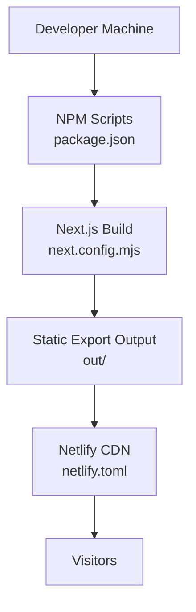
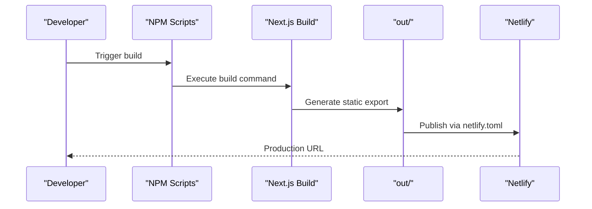
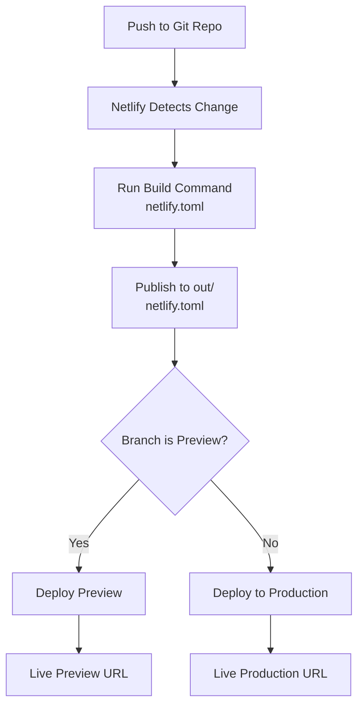
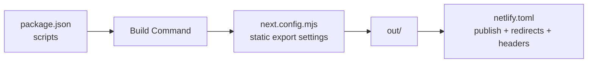

# Netlify Deployment

<cite>
**Referenced Files in This Document**
- [netlify.toml](file://netlify.toml)
- [package.json](file://package.json)
- [next.config.mjs](file://next.config.mjs)
- [CPANEL_DEPLOYMENT.md](file://CPANEL_DEPLOYMENT.md)
- [build-cpanel.ps1](file://build-cpanel.ps1)
- [build-cpanel.sh](file://build-cpanel.sh)
- [middleware.ts](file://middleware.ts)
</cite>

## Table of Contents
1. [Introduction](#introduction)
2. [Project Structure](#project-structure)
3. [Core Components](#core-components)
4. [Architecture Overview](#architecture-overview)
5. [Detailed Component Analysis](#detailed-component-analysis)
6. [Dependency Analysis](#dependency-analysis)
7. [Performance Considerations](#performance-considerations)
8. [Troubleshooting Guide](#troubleshooting-guide)
9. [Conclusion](#conclusion)
10. [Appendices](#appendices)

## Introduction
This document explains how to deploy attechglobal.com to Netlify using the provided configuration and build artifacts. It covers the Netlify configuration, build settings, deployment triggers, and how this differs from the cPanel static export deployment. It also documents Netlify-specific features (redirects, headers), continuous deployment workflows, preview and production processes, and provides troubleshooting guidance for common build and runtime issues.

## Project Structure
The repository is a Next.js 15 application configured for both static export (for cPanel) and server-based hosting. Netlify deployment leverages the static export output produced by the Next.js build process.

**Diagram sources**
- [package.json](file://package.json#L5-L11)
- [next.config.mjs](file://next.config.mjs#L1-L129)
- [netlify.toml](file://netlify.toml#L1-L21)

**Section sources**
- [package.json](file://package.json#L5-L11)
- [next.config.mjs](file://next.config.mjs#L1-L129)
- [netlify.toml](file://netlify.toml#L1-L21)

## Core Components
- Netlify configuration: Defines build command, publish directory, environment variables, redirects, and security headers.
- Next.js configuration: Controls static export behavior, image optimization, trailing slash handling, and production optimizations.
- Build scripts: Produce the static export suitable for Netlify deployment.
- Middleware: Disabled for static hosting compatibility.

**Section sources**
- [netlify.toml](file://netlify.toml#L1-L21)
- [next.config.mjs](file://next.config.mjs#L1-L129)
- [build-cpanel.ps1](file://build-cpanel.ps1#L1-L92)
- [build-cpanel.sh](file://build-cpanel.sh#L1-L95)
- [middleware.ts](file://middleware.ts#L1-L15)

## Architecture Overview
The deployment pipeline produces a static site from Next.js and publishes it to Netlify. Netlify serves the site globally with built-in redirects and security headers.

**Diagram sources**
- [package.json](file://package.json#L5-L11)
- [next.config.mjs](file://next.config.mjs#L1-L129)
- [netlify.toml](file://netlify.toml#L1-L21)

## Detailed Component Analysis

### Netlify Configuration (netlify.toml)
- Build command: Runs the Next.js build to produce a static export.
- Publish directory: Uses the out/ directory as the static site root.
- Environment: Sets Node.js version for the build environment.
- Redirects: Implements client-side routing for single-page app behavior using a catch-all redirect to index.html with 200 status.
- Headers: Applies security headers for all routes.

Key behaviors:
- Static export compatibility: The catch-all redirect ensures deep links resolve to index.html for SPA-like routing.
- Security posture: Adds X-Frame-Options, X-XSS-Protection, X-Content-Type-Options, and Referrer-Policy headers.

**Section sources**
- [netlify.toml](file://netlify.toml#L1-L21)

### Next.js Build Configuration (next.config.mjs)
- Conditional static export: When CPANEL_EXPORT is true, the output is set to static export and trailingSlash is enabled. Otherwise, defaults apply for server-based deployments.
- Images: Unoptimized images for static export; extensive domains and remotePatterns configured; formats include webp and avif; CSP for images is set.
- Production optimizations: Removes console statements in production, disables powered-by header, enables compression.

These settings ensure the static export is fully functional and optimized for Netlify’s static hosting model.

**Section sources**
- [next.config.mjs](file://next.config.mjs#L1-L129)

### Build Scripts (cPanel-style)
Although designed for cPanel, these scripts demonstrate how the static export is produced and can inform Netlify deployments:
- Environment variable CPANEL_EXPORT toggles static export behavior.
- API routes are temporarily excluded during build to avoid server-side dependencies.
- The build artifacts are placed in out/.

For Netlify, you can adapt this approach by ensuring the static export is generated and published according to netlify.toml.

**Section sources**
- [build-cpanel.ps1](file://build-cpanel.ps1#L1-L92)
- [build-cpanel.sh](file://build-cpanel.sh#L1-L95)

### Middleware Compatibility
The middleware is intentionally minimal and disabled for static hosting scenarios. This avoids server-side processing requirements that are incompatible with static hosting.

**Section sources**
- [middleware.ts](file://middleware.ts#L1-L15)

### Differences Between Netlify and cPanel Deployments
- Build target:
  - Netlify: Uses the static export produced by Next.js build and publishes from out/.
  - cPanel: Also uses static export but requires packaging and uploading to cPanel file manager.
- API routes:
  - Netlify: Static export excludes server-side API routes; admin and API-dependent features are not available.
  - cPanel: Same limitation applies; admin features require server-side support.
- Routing:
  - Netlify: Relies on netlify.toml redirects for client-side routing.
  - cPanel: Relies on server configuration (.htaccess) and trailing slashes for routing.
- Environment variables:
  - Netlify: Uses netlify.toml build.environment for Node.js version and any environment variables configured in the Netlify UI.
  - cPanel: Uses environment variables configured in cPanel or via .htaccess as needed.
- Build optimization:
  - Netlify: Benefits from Next.js optimizations defined in next.config.mjs (compression, console removal, image formats).
  - cPanel: Similar optimizations apply, but the cPanel guide emphasizes excluding API routes and enabling trailing slashes.

**Section sources**
- [netlify.toml](file://netlify.toml#L1-L21)
- [next.config.mjs](file://next.config.mjs#L1-L129)
- [CPANEL_DEPLOYMENT.md](file://CPANEL_DEPLOYMENT.md#L1-L187)

### Continuous Deployment Workflow
- Trigger: Connect your Git repository to Netlify. Netlify monitors the repository and triggers builds on commits to selected branches.
- Build: Netlify executes the build command defined in netlify.toml, producing the static export in out/.
- Preview: Netlify creates preview deploys for pull requests or branch pushes, enabling review before merging.
- Production: Merging to the production branch triggers a production deploy to the live site.

**Diagram sources**
- [netlify.toml](file://netlify.toml#L1-L21)
- [package.json](file://package.json#L5-L11)

### Preview and Production Processes
- Preview: Netlify generates a unique preview URL for each deploy, allowing stakeholders to review changes.
- Production: Deploys merge to the production branch to the main site URL.

[No sources needed since this section provides general guidance]

### Netlify-Specific Features Utilization
- Redirects: The catch-all redirect ensures client-side routing works for single-page app behavior.
- Headers: Security headers are applied globally for improved protection.
- Functions: Not used in this configuration; static export is sufficient for the current feature set.

**Section sources**
- [netlify.toml](file://netlify.toml#L8-L21)

## Dependency Analysis
The deployment depends on the build command and publish directory alignment between package.json and netlify.toml, and on next.config.mjs controlling static export behavior.

**Diagram sources**
- [package.json](file://package.json#L5-L11)
- [next.config.mjs](file://next.config.mjs#L1-L129)
- [netlify.toml](file://netlify.toml#L1-L21)

**Section sources**
- [package.json](file://package.json#L5-L11)
- [next.config.mjs](file://next.config.mjs#L1-L129)
- [netlify.toml](file://netlify.toml#L1-L21)

## Performance Considerations
- Static export: Ensures fast global delivery via Netlify’s CDN.
- Compression: Enabled in next.config.mjs to reduce payload sizes.
- Image optimization: WebP and AVIF formats are supported; images are unoptimized for static export to ensure compatibility.
- Console removal: Production removes console statements to reduce bundle size and noise.
- Redirects: Minimizes server-side logic by delegating routing to the client.

[No sources needed since this section provides general guidance]

## Troubleshooting Guide
Common issues and resolutions:

- Build fails with module or API route errors
  - Cause: API routes are not compatible with static export.
  - Resolution: Ensure static export is used and API routes are excluded from the build. Confirm the build command runs successfully locally.

- Pages show 404 after deploy
  - Cause: Missing or incorrect redirects for client-side routing.
  - Resolution: Verify the catch-all redirect to index.html is present and active in netlify.toml.

- Images not loading
  - Cause: Image optimization settings for static export.
  - Resolution: Confirm images are included in the static export and paths are correct.

- Middleware-related errors
  - Cause: Middleware expects server-side processing.
  - Resolution: Keep middleware minimal or disable as appropriate for static hosting.

- Build timeouts
  - Cause: Large build artifacts or slow dependencies.
  - Resolution: Optimize dependencies, reduce asset sizes, and ensure environment variables are configured efficiently.

- Performance optimization
  - Recommendations: Enable compression, leverage Netlify CDN, minimize third-party scripts, and monitor bundle sizes.

**Section sources**
- [netlify.toml](file://netlify.toml#L8-L21)
- [next.config.mjs](file://next.config.mjs#L100-L129)
- [middleware.ts](file://middleware.ts#L1-L15)

## Conclusion
Deploying attechglobal.com to Netlify involves generating a static export with Next.js and publishing it via netlify.toml. The configuration emphasizes client-side routing through redirects, strong security headers, and production-ready optimizations. Compared to cPanel, Netlify simplifies deployment with automated builds, preview deploys, and global CDN distribution. Admin and API-dependent features remain unavailable in static export; they would require a server-based deployment.

[No sources needed since this section summarizes without analyzing specific files]

## Appendices

### Appendix A: Netlify Configuration Reference
- Build command: Executes the Next.js build to produce static export.
- Publish directory: out/
- Environment variables: Node.js version set for the build environment.
- Redirects: Catch-all redirect to index.html with 200 status for client-side routing.
- Headers: Security headers applied to all routes.

**Section sources**
- [netlify.toml](file://netlify.toml#L1-L21)

### Appendix B: Next.js Build Settings Reference
- Static export toggle via environment variable.
- Image optimization settings for static export.
- Production optimizations: compression, console removal, and header adjustments.

**Section sources**
- [next.config.mjs](file://next.config.mjs#L1-L129)

### Appendix C: Migration Notes from cPanel
- Static export remains the same for Netlify.
- API routes are excluded for both platforms.
- Trailing slashes and image handling are aligned with static export expectations.

**Section sources**
- [CPANEL_DEPLOYMENT.md](file://CPANEL_DEPLOYMENT.md#L1-L187)