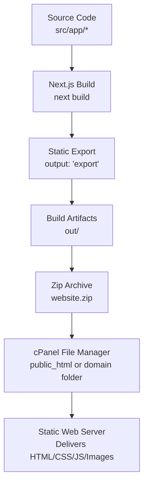
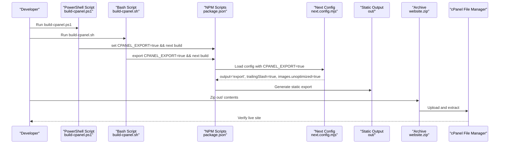
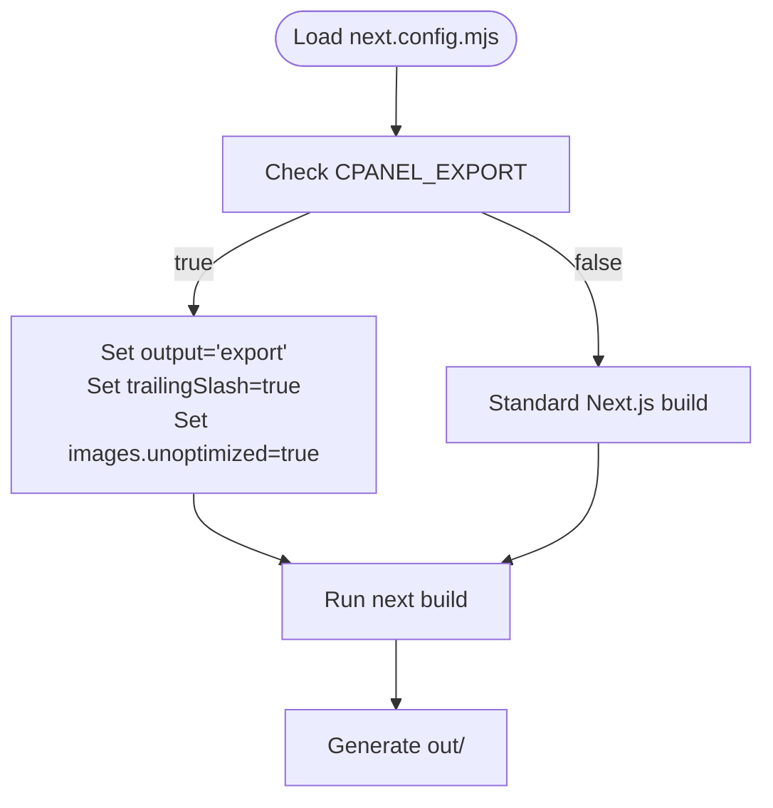
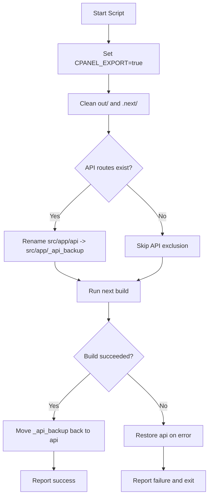
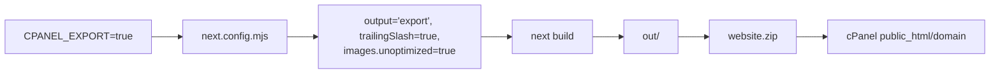

# cPanel Deployment

<cite>
**Referenced Files in This Document**
- [CPANEL_DEPLOYMENT.md](file://CPANEL_DEPLOYMENT.md)
- [next.config.mjs](file://next.config.mjs)
- [build-cpanel.ps1](file://build-cpanel.ps1)
- [build-cpanel.sh](file://build-cpanel.sh)
- [package.json](file://package.json)
- [netlify.toml](file://netlify.toml)
- [middleware.ts](file://middleware.ts)
- [src/app/layout.tsx](file://src/app/layout.tsx)
- [out/sitemap.xml](file://out/sitemap.xml)
- [out/robots.txt](file://out/robots.txt)
</cite>

## Table of Contents
1. [Introduction](#introduction)
2. [Project Structure](#project-structure)
3. [Core Components](#core-components)
4. [Architecture Overview](#architecture-overview)
5. [Detailed Component Analysis](#detailed-component-analysis)
6. [Dependency Analysis](#dependency-analysis)
7. [Performance Considerations](#performance-considerations)
8. [Troubleshooting Guide](#troubleshooting-guide)
9. [Conclusion](#conclusion)
10. [Appendices](#appendices)

## Introduction
This document provides comprehensive cPanel deployment guidance for attechglobal.com. It explains how the project is configured for static export using Next.js output: 'export', how environment variables enable cPanel-specific behavior, and how platform-specific build scripts prepare the static artifact. It also documents the deployment workflow, differences from standard Next.js builds, security considerations, performance tips for shared hosting, and troubleshooting steps.

## Project Structure
The repository is a Next.js 15 application using the App Router. For cPanel static export, the build process produces a static snapshot under the out/ directory, which is then packaged and uploaded to cPanel’s public_html or domain folder.

**Diagram sources**
- [next.config.mjs](file://next.config.mjs#L1-L129)
- [build-cpanel.ps1](file://build-cpanel.ps1#L1-L92)
- [build-cpanel.sh](file://build-cpanel.sh#L1-L95)
- [package.json](file://package.json#L5-L11)

**Section sources**
- [next.config.mjs](file://next.config.mjs#L1-L129)
- [build-cpanel.ps1](file://build-cpanel.ps1#L1-L92)
- [build-cpanel.sh](file://build-cpanel.sh#L1-L95)
- [package.json](file://package.json#L5-L11)

## Core Components
- Static export configuration via Next.js output: 'export'
- Environment-driven configuration controlled by CPANEL_EXPORT
- Platform-specific build scripts for Windows and Unix
- Exclusion of API routes during static export
- Image optimization settings adapted for static hosting
- Trailing slash behavior for static hosting compatibility
- Middleware disabled for static hosting

**Section sources**
- [next.config.mjs](file://next.config.mjs#L1-L129)
- [build-cpanel.ps1](file://build-cpanel.ps1#L9-L11)
- [build-cpanel.sh](file://build-cpanel.sh#L10-L11)
- [package.json](file://package.json#L8-L8)
- [middleware.ts](file://middleware.ts#L4-L8)

## Architecture Overview
The cPanel deployment pipeline transforms the Next.js application into a static website and uploads it to cPanel. The key steps are:
- Set CPANEL_EXPORT to trigger static export and related toggles
- Exclude API routes from the build
- Run next build to produce out/
- Package out/ contents into website.zip
- Upload and extract to cPanel public_html or domain folder

**Diagram sources**
- [build-cpanel.ps1](file://build-cpanel.ps1#L9-L40)
- [build-cpanel.sh](file://build-cpanel.sh#L10-L41)
- [package.json](file://package.json#L8-L8)
- [next.config.mjs](file://next.config.mjs#L2-L12)

## Detailed Component Analysis

### Static Export Configuration (Next.js)
- output: 'export' enables static export for cPanel hosting
- trailingSlash: true ensures paths end with '/' for static hosting
- images.unoptimized: true disables Next.js image optimization for static export
- images.domains and images.remotePatterns define allowed external image sources
- images.contentSecurityPolicy enforces strict CSP for images
- eslint.ignoreDuringBuilds suppresses lint errors during static export builds
- compiler.removeConsole removes console statements in production builds
- poweredByHeader and compress reduce metadata and enable gzip-like compression

**Diagram sources**
- [next.config.mjs](file://next.config.mjs#L2-L12)

**Section sources**
- [next.config.mjs](file://next.config.mjs#L2-L12)

### Build Scripts (Windows and Unix)
Both scripts:
- Set CPANEL_EXPORT to 'true'
- Clean previous out/ and .next/ artifacts
- Temporarily move API routes directory to exclude it from static export
- Execute next build
- Restore API routes after success or on error
- Report success/failure and build size
- Unset CPANEL_EXPORT

Key differences:
- Windows uses PowerShell syntax and environment variable setting
- Unix uses Bash syntax and export

**Diagram sources**
- [build-cpanel.ps1](file://build-cpanel.ps1#L13-L61)
- [build-cpanel.sh](file://build-cpanel.sh#L13-L62)

**Section sources**
- [build-cpanel.ps1](file://build-cpanel.ps1#L9-L61)
- [build-cpanel.sh](file://build-cpanel.sh#L10-L62)

### NPM Script for cPanel Builds
- The build:cpanel script sets CPANEL_EXPORT and runs next build
- This provides a cross-platform invocation without OS-specific scripts

**Section sources**
- [package.json](file://package.json#L8-L8)

### Middleware Behavior for Static Hosting
- The middleware is intentionally minimal and disabled for static hosting
- It avoids server-side processing that is unavailable on static hosts

**Section sources**
- [middleware.ts](file://middleware.ts#L4-L8)

### Layout and Assets
- Global styles and fonts are imported in the root layout
- Favicon and preconnect/dns-prefetch hints are configured
- These assets are included in the static export

**Section sources**
- [src/app/layout.tsx](file://src/app/layout.tsx#L1-L47)

### Netlify Reference (for comparison)
While not used for cPanel, the Netlify configuration demonstrates static export handling and security headers for comparison.

**Section sources**
- [netlify.toml](file://netlify.toml#L1-L21)

## Dependency Analysis
The cPanel deployment depends on:
- Environment variable CPANEL_EXPORT controlling Next.js configuration
- Build scripts invoking next build with CPANEL_EXPORT
- Exclusion of API routes during static export
- Static export output structure under out/

**Diagram sources**
- [next.config.mjs](file://next.config.mjs#L2-L12)
- [build-cpanel.ps1](file://build-cpanel.ps1#L9-L40)
- [build-cpanel.sh](file://build-cpanel.sh#L10-L41)

**Section sources**
- [next.config.mjs](file://next.config.mjs#L2-L12)
- [build-cpanel.ps1](file://build-cpanel.ps1#L9-L40)
- [build-cpanel.sh](file://build-cpanel.sh#L10-L41)

## Performance Considerations
- Minimize console logs in production via compiler.removeConsole
- Disable unnecessary headers like poweredByHeader to reduce payload
- Enable compression via next.config.mjs compress option
- Keep images unoptimized for static export to avoid server-side processing overhead
- Prefer static assets and avoid dynamic API calls for public pages
- Validate that robots.txt and sitemap.xml are present in out/ for SEO

**Section sources**
- [next.config.mjs](file://next.config.mjs#L120-L126)
- [out/robots.txt](file://out/robots.txt)
- [out/sitemap.xml](file://out/sitemap.xml)

## Troubleshooting Guide
Common issues and resolutions:
- Build fails with module or API route errors
  - The scripts automatically exclude API routes; re-run the script
  - Verify CPANEL_EXPORT is set during build
- Pages load with 404 errors
  - Ensure trailing slashes are used in links
  - Confirm files were extracted correctly in cPanel
- Images not displaying
  - Verify images are included in the build output
  - Check image paths and CSP configuration
- CSS/JS not loading
  - Ensure _next/static/ is uploaded
  - Check file permissions (files 644, folders 755)
  - Clear browser cache
- Admin/dashboard not functioning
  - Expected for static export; requires server-side API routes

Verification checklist:
- Build completes successfully and out/ exists
- All public pages and assets are present
- Zip contains out/ contents (not the out/ folder itself)
- After upload, visit the domain and test navigation and responsiveness

**Section sources**
- [CPANEL_DEPLOYMENT.md](file://CPANEL_DEPLOYMENT.md#L111-L138)
- [build-cpanel.ps1](file://build-cpanel.ps1#L36-L61)
- [build-cpanel.sh](file://build-cpanel.sh#L39-L62)

## Conclusion
Deploying attechglobal.com to cPanel involves configuring Next.js for static export, preparing platform-specific build scripts, and uploading the generated out/ artifact. The CPANEL_EXPORT environment variable centralizes cPanel-specific behavior, ensuring trailing slashes, unoptimized images, and excluded API routes. Following the documented workflow and troubleshooting steps will yield a reliable static deployment suitable for shared hosting.

## Appendices

### Step-by-Step Deployment Instructions
1. Prepare the build
   - Run the Windows PowerShell script or the Unix Bash script to build static export
   - Alternatively, use the npm script to set CPANEL_EXPORT and run next build
2. Verify the out/ folder
   - Confirm it contains index.html, nested pages, _next/static/, and assets
3. Create a zip archive
   - Zip the contents of out/ (not the out/ folder itself)
4. Upload to cPanel
   - Log in to cPanel File Manager
   - Navigate to public_html or your domain folder
   - Upload and extract the zip file to the current directory
5. Verify deployment
   - Visit your domain in a browser
   - Check that pages, images, and styles load correctly
   - Test navigation and responsiveness

**Section sources**
- [CPANEL_DEPLOYMENT.md](file://CPANEL_DEPLOYMENT.md#L48-L84)
- [build-cpanel.ps1](file://build-cpanel.ps1#L36-L87)
- [build-cpanel.sh](file://build-cpanel.sh#L39-L90)
- [package.json](file://package.json#L8-L8)

### Configuration Differences from Standard Next.js Builds
- output: 'export' for static hosting
- trailingSlash: true for static hosting compatibility
- images.unoptimized: true to avoid server-side image optimization
- images.contentSecurityPolicy: strict policy for static image delivery
- API routes excluded from static export
- Middleware disabled for static hosting

**Section sources**
- [next.config.mjs](file://next.config.mjs#L7-L12)
- [next.config.mjs](file://next.config.mjs#L111-L111)
- [build-cpanel.ps1](file://build-cpanel.ps1#L23-L34)
- [build-cpanel.sh](file://build-cpanel.sh#L24-L37)
- [middleware.ts](file://middleware.ts#L4-L8)

### Security Considerations
- images.contentSecurityPolicy restricts script execution and enforces sandboxing for images
- poweredByHeader disabled to minimize fingerprinting
- compress enabled for efficient delivery
- robots.txt and sitemap.xml included in out/ for SEO compliance

**Section sources**
- [next.config.mjs](file://next.config.mjs#L124-L126)
- [next.config.mjs](file://next.config.mjs#L111-L111)
- [out/robots.txt](file://out/robots.txt)
- [out/sitemap.xml](file://out/sitemap.xml)