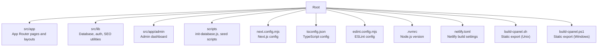
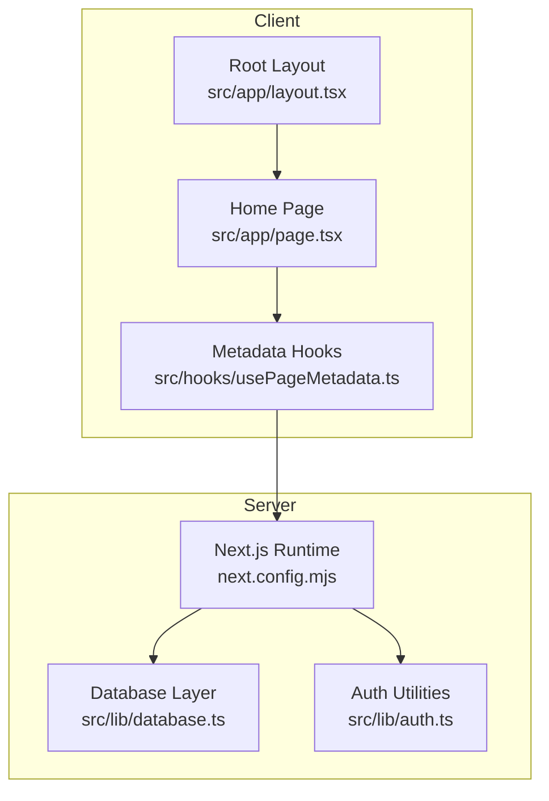
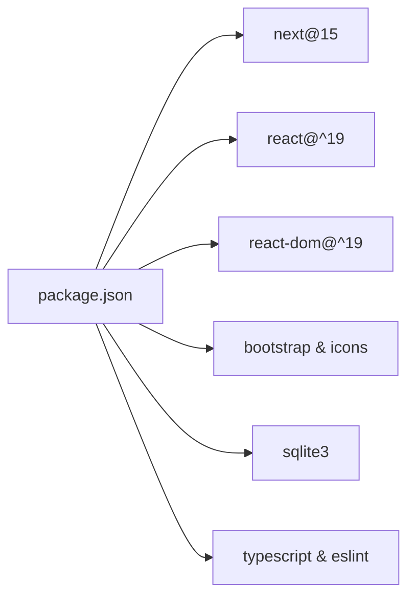

# Getting Started

<cite>
**Referenced Files in This Document**
- [package.json](file://package.json)
- [README.md](file://README.md)
- [next.config.mjs](file://next.config.mjs)
- [tsconfig.json](file://tsconfig.json)
- [eslint.config.mjs](file://eslint.config.mjs)
- [.nvmrc](file://.nvmrc)
- [netlify.toml](file://netlify.toml)
- [src/lib/database.ts](file://src/lib/database.ts)
- [scripts/init-database.js](file://scripts/init-database.js)
- [src/lib/seed-metadata.ts](file://src/lib/seed-metadata.ts)
- [src/hooks/usePageMetadata.ts](file://src/hooks/usePageMetadata.ts)
- [src/app/layout.tsx](file://src/app/layout.tsx)
- [src/app/page.tsx](file://src/app/page.tsx)
- [src/lib/auth.ts](file://src/lib/auth.ts)
- [build-cpanel.sh](file://build-cpanel.sh)
- [build-cpanel.ps1](file://build-cpanel.ps1)
</cite>

## Table of Contents
1. [Introduction](#introduction)
2. [Project Structure](#project-structure)
3. [Core Components](#core-components)
4. [Architecture Overview](#architecture-overview)
5. [Detailed Component Analysis](#detailed-component-analysis)
6. [Dependency Analysis](#dependency-analysis)
7. [Performance Considerations](#performance-considerations)
8. [Troubleshooting Guide](#troubleshooting-guide)
9. [Conclusion](#conclusion)
10. [Appendices](#appendices)

## Introduction
This guide helps you install, configure, and run attechglobal.com locally. It covers prerequisites, dependency installation, environment configuration, first-time setup, development server startup, hot reloading, and local development workflow. It also documents environment variables, database initialization, and provides troubleshooting tips for Windows and Unix-like systems.

## Project Structure
The project is a Next.js 15 application using TypeScript and React. It includes:
- Application code under src/app and src/lib
- Admin dashboard under src/app/admin
- Scripts for database initialization and seeding
- Build and deployment helpers for cPanel and Netlify
- Configuration files for Next.js, ESLint, TypeScript, and Node.js version pinning

**Diagram sources**
- [next.config.mjs](file://next.config.mjs#L1-L129)
- [tsconfig.json](file://tsconfig.json#L1-L39)
- [eslint.config.mjs](file://eslint.config.mjs#L1-L15)
- [.nvmrc](file://.nvmrc#L1-L2)
- [netlify.toml](file://netlify.toml#L1-L21)
- [build-cpanel.sh](file://build-cpanel.sh#L1-L95)
- [build-cpanel.ps1](file://build-cpanel.ps1#L1-L92)

**Section sources**
- [package.json](file://package.json#L1-L41)
- [next.config.mjs](file://next.config.mjs#L1-L129)
- [tsconfig.json](file://tsconfig.json#L1-L39)
- [eslint.config.mjs](file://eslint.config.mjs#L1-L15)
- [.nvmrc](file://.nvmrc#L1-L2)
- [netlify.toml](file://netlify.toml#L1-L21)

## Core Components
- Next.js 15 application with App Router
- SQLite-backed image and page metadata management
- Admin authentication and dashboard
- SEO metadata management via API hooks
- Static export support for cPanel and Netlify

Key runtime dependencies include Next.js, React, Bootstrap, and sqlite3. Development dependencies include TypeScript and ESLint.

**Section sources**
- [package.json](file://package.json#L12-L39)
- [src/lib/database.ts](file://src/lib/database.ts#L1-L255)
- [src/lib/auth.ts](file://src/lib/auth.ts#L1-L85)

## Architecture Overview
The application follows a client-side rendered Next.js App Router architecture with:
- A root layout injecting global styles and analytics
- A home page composed of reusable components
- An admin area for content management
- A database layer for images and page metadata
- API routes for admin and SEO operations
- Utility hooks to fetch and manage page metadata

**Diagram sources**
- [src/app/layout.tsx](file://src/app/layout.tsx#L1-L47)
- [src/app/page.tsx](file://src/app/page.tsx#L1-L75)
- [src/hooks/usePageMetadata.ts](file://src/hooks/usePageMetadata.ts#L1-L218)
- [next.config.mjs](file://next.config.mjs#L1-L129)
- [src/lib/database.ts](file://src/lib/database.ts#L1-L255)
- [src/lib/auth.ts](file://src/lib/auth.ts#L1-L85)

## Detailed Component Analysis

### Prerequisites and Environment Setup
- Node.js version is pinned to 20.x via .nvmrc. Use nvm to switch to the correct version before installing dependencies.
- Supported package managers: npm, yarn, pnpm, bun. The project’s dev script uses Next.js Turbopack.

Verification steps:
- Confirm Node.js version: node --version
- Switch Node version if needed: nvm use
- Install dependencies: npm install (or yarn install or pnpm install or bun install)

Notes:
- On Unix-like systems, ensure bash is available for build scripts.
- On Windows, ensure PowerShell is available for the cPanel build script.

**Section sources**
- [.nvmrc](file://.nvmrc#L1-L2)
- [package.json](file://package.json#L5-L11)
- [README.md](file://README.md#L3-L17)

### First-Time Database Initialization
The project uses an SQLite database for images and page metadata. Run the initialization script to create tables and prepare the database.

Steps:
- Run the initialization script: node scripts/init-database.js
- The script ensures the data directory exists and creates tables for images, image_usage, blogs, and page_metadata.
- After successful initialization, start the development server and navigate to the admin login.

Verification:
- Look for success logs indicating tables created and the initialization summary.
- Access the admin login route and use the default credentials for initial access.

**Section sources**
- [scripts/init-database.js](file://scripts/init-database.js#L1-L120)
- [src/lib/database.ts](file://src/lib/database.ts#L84-L184)

### Environment Variables
- JWT_SECRET: Used for admin authentication tokens. Set this in your environment for secure admin sessions.
- CPANEL_EXPORT: Controls Next.js static export behavior for cPanel deployments.
- NODE_ENV: Production removes console logs per compiler settings.

Recommended:
- Create a .env.local file at the project root for local development secrets.
- For production, set environment variables in your hosting provider.

**Section sources**
- [src/lib/auth.ts](file://src/lib/auth.ts#L11)
- [next.config.mjs](file://next.config.mjs#L3)
- [next.config.mjs](file://next.config.mjs#L120-L122)

### Development Server Startup and Hot Reloading
Start the development server using your preferred package manager. The project enables Turbopack for fast rebuilds.

Commands:
- npm run dev
- yarn dev
- pnpm dev
- bun dev

Access:
- Open http://localhost:3000 in your browser.

Workflow:
- Edit files under src/app to see changes reflected immediately.
- The admin area is accessible at /admin.

**Section sources**
- [README.md](file://README.md#L5-L17)
- [package.json](file://package.json#L6)

### Admin Authentication and Dashboard
- Default admin credentials are embedded for quick setup. In production, override these via environment variables.
- JWT_SECRET must be set for token generation and verification.
- The admin login route is part of the admin area.

Best practices:
- Change default admin credentials in production.
- Store JWT_SECRET securely in your environment.

**Section sources**
- [src/lib/auth.ts](file://src/lib/auth.ts#L4-L9)
- [src/lib/auth.ts](file://src/lib/auth.ts#L11)
- [src/lib/auth.ts](file://src/lib/auth.ts#L62-L79)

### SEO Metadata Management
- Page metadata is stored in the database and managed via API endpoints.
- Client-side hooks fetch, list, create, and update metadata for routes.
- Initial metadata can be seeded programmatically.

Key APIs:
- GET /api/seo/metadata/:route
- GET /api/seo/metadata
- PUT /api/seo/metadata/:route
- POST /api/seo/metadata

**Section sources**
- [src/hooks/usePageMetadata.ts](file://src/hooks/usePageMetadata.ts#L18-L52)
- [src/hooks/usePageMetadata.ts](file://src/hooks/usePageMetadata.ts#L83-L135)
- [src/hooks/usePageMetadata.ts](file://src/hooks/usePageMetadata.ts#L141-L177)
- [src/hooks/usePageMetadata.ts](file://src/hooks/usePageMetadata.ts#L183-L218)
- [src/lib/seed-metadata.ts](file://src/lib/seed-metadata.ts#L1-L93)

### Static Export for cPanel and Netlify
The project supports static export for deployment scenarios.

- cPanel export: Uses CPANEL_EXPORT environment variable to enable static export and adjust trailing slashes and image optimization.
- Netlify export: Uses netlify.toml to build and publish the out directory.

Build scripts:
- Unix: build-cpanel.sh sets CPANEL_EXPORT and temporarily excludes API routes during build.
- Windows: build-cpanel.ps1 performs the same steps with PowerShell.

**Section sources**
- [next.config.mjs](file://next.config.mjs#L3-L9)
- [next.config.mjs](file://next.config.mjs#L10-L112)
- [netlify.toml](file://netlify.toml#L1-L21)
- [build-cpanel.sh](file://build-cpanel.sh#L1-L95)
- [build-cpanel.ps1](file://build-cpanel.ps1#L1-L92)

### Local Development Workflow
- Install dependencies once.
- Initialize the database.
- Start the dev server.
- Navigate to the admin area to manage content and metadata.
- Use the provided scripts to seed initial metadata if needed.

**Section sources**
- [scripts/init-database.js](file://scripts/init-database.js#L94-L120)
- [src/lib/seed-metadata.ts](file://src/lib/seed-metadata.ts#L1-L93)
- [README.md](file://README.md#L5-L17)

## Dependency Analysis
The project relies on Next.js 15, React, Bootstrap, and SQLite. TypeScript and ESLint are configured for type checking and linting.

**Diagram sources**
- [package.json](file://package.json#L12-L39)

**Section sources**
- [package.json](file://package.json#L12-L39)

## Performance Considerations
- Turbopack is enabled for faster development rebuilds.
- Console logs are removed in production builds.
- Image optimization is configured for static export compatibility.
- ESLint ignores are disabled during builds to reduce overhead.

**Section sources**
- [package.json](file://package.json#L6)
- [next.config.mjs](file://next.config.mjs#L120-L122)
- [next.config.mjs](file://next.config.mjs#L113-L115)

## Troubleshooting Guide

Common issues and resolutions:
- Node version mismatch
  - Cause: Using a Node version other than 20.x.
  - Fix: nvm use to switch to the pinned version.
  - Verify: node --version

- Missing dependencies
  - Cause: Dependencies not installed.
  - Fix: npm install (or yarn install or pnpm install or bun install)

- Database initialization errors
  - Symptoms: Errors when running the initialization script.
  - Fix: Ensure write permissions in the project directory and rerun node scripts/init-database.js

- Admin login fails
  - Symptoms: Login does not work or redirects incorrectly.
  - Fix: Ensure JWT_SECRET is set in your environment; default credentials are for testing only

- Static export failures
  - Symptoms: Build fails when exporting for cPanel.
  - Fix: Use the provided build scripts; ensure API routes are temporarily moved during export

Platform-specific notes:
- Windows
  - Use PowerShell to run build-cpanel.ps1
  - Ensure execution policy allows script execution if needed

- Unix-like systems
  - Use bash to run build-cpanel.sh
  - Ensure the script is executable: chmod +x build-cpanel.sh

**Section sources**
- [.nvmrc](file://.nvmrc#L1-L2)
- [scripts/init-database.js](file://scripts/init-database.js#L1-L120)
- [src/lib/auth.ts](file://src/lib/auth.ts#L11)
- [build-cpanel.sh](file://build-cpanel.sh#L1-L95)
- [build-cpanel.ps1](file://build-cpanel.ps1#L1-L92)

## Conclusion
You now have the essentials to install, configure, and run attechglobal.com locally. Initialize the database, start the development server, and explore the admin dashboard. For production or static hosting, use the provided configuration and build scripts to export and deploy the site.

## Appendices

### Quick Start Checklist
- Install Node.js 20.x using nvm
- Install dependencies
- Initialize the database
- Start the dev server
- Visit the admin login and manage content
- Seed initial metadata if desired

**Section sources**
- [.nvmrc](file://.nvmrc#L1-L2)
- [scripts/init-database.js](file://scripts/init-database.js#L94-L120)
- [src/lib/seed-metadata.ts](file://src/lib/seed-metadata.ts#L1-L93)
- [README.md](file://README.md#L5-L17)