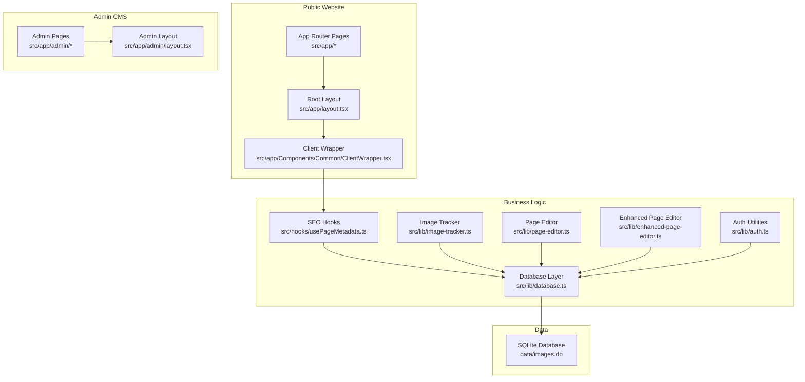
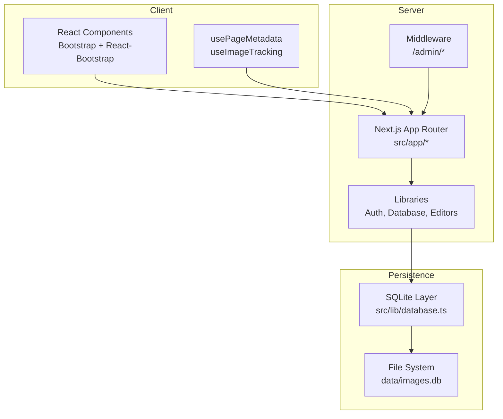
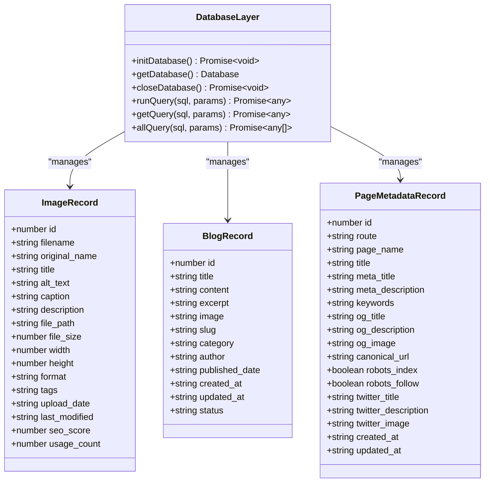
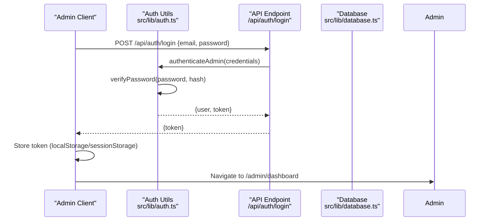
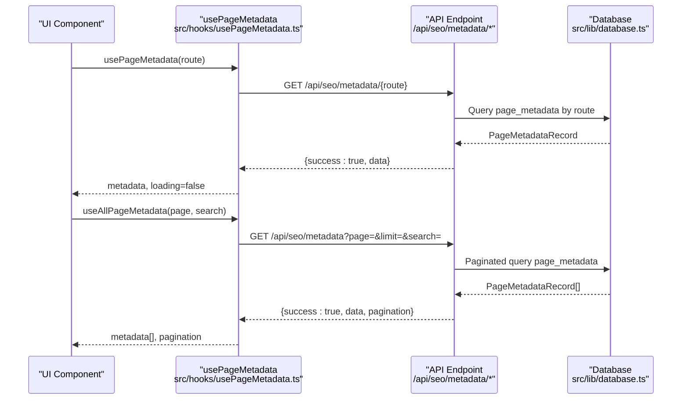
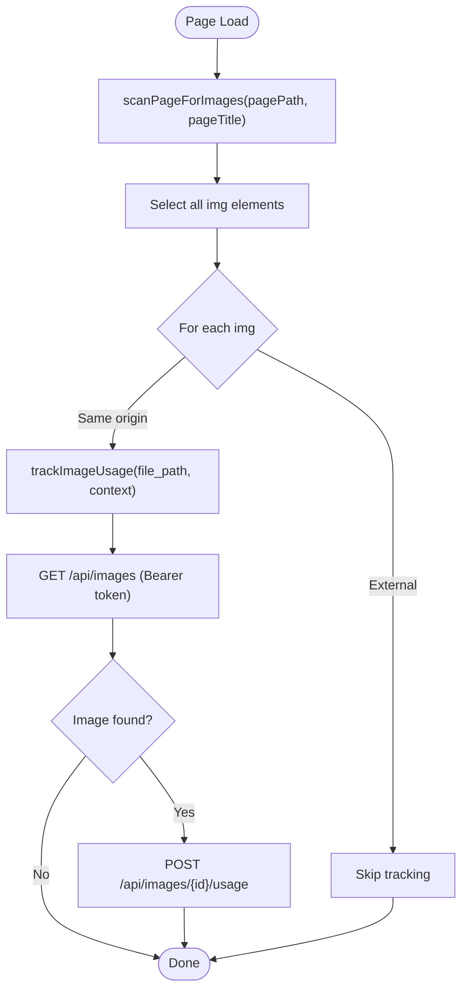
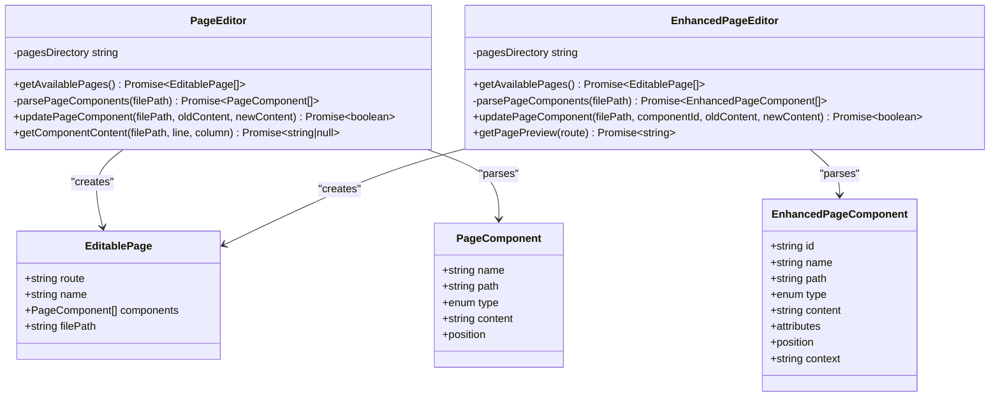
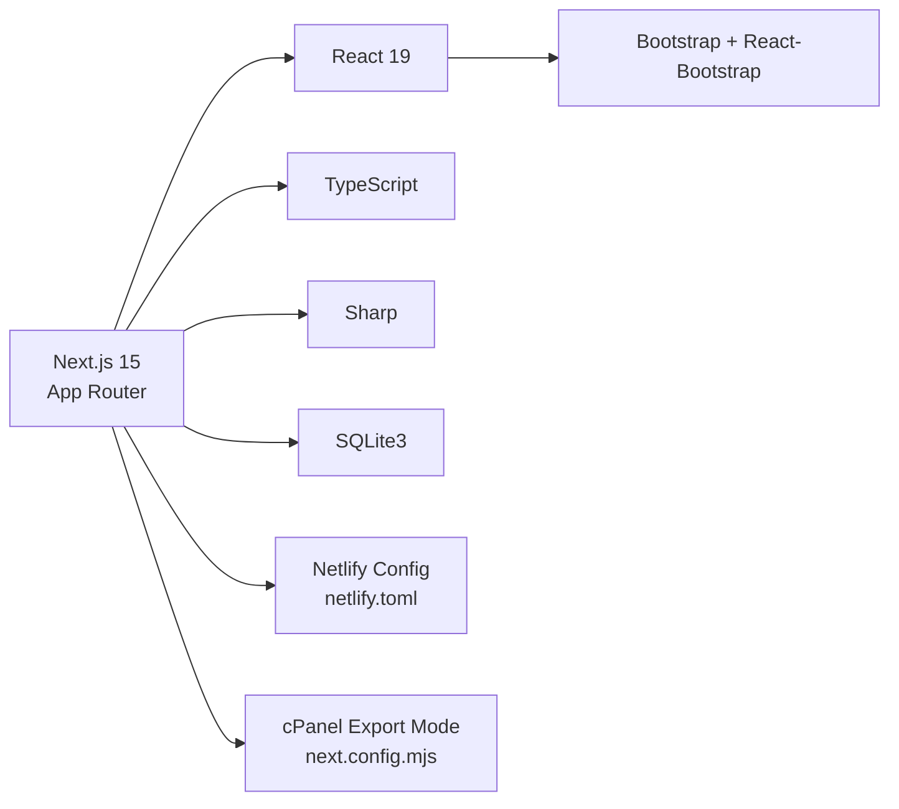

# Architecture Overview

<cite>
**Referenced Files in This Document**
- [package.json](file://package.json)
- [next.config.mjs](file://next.config.mjs)
- [netlify.toml](file://netlify.toml)
- [middleware.ts](file://middleware.ts)
- [src/app/layout.tsx](file://src/app/layout.tsx)
- [src/app/admin/layout.tsx](file://src/app/admin/layout.tsx)
- [src/lib/database.ts](file://src/lib/database.ts)
- [src/lib/auth.ts](file://src/lib/auth.ts)
- [src/lib/image-tracker.ts](file://src/lib/image-tracker.ts)
- [src/lib/page-editor.ts](file://src/lib/page-editor.ts)
- [src/lib/enhanced-page-editor.ts](file://src/lib/enhanced-page-editor.ts)
- [src/hooks/usePageMetadata.ts](file://src/hooks/usePageMetadata.ts)
- [src/app/Components/Common/ClientWrapper.tsx](file://src/app/Components/Common/ClientWrapper.tsx)
</cite>

## Table of Contents
1. [Introduction](#introduction)
2. [Project Structure](#project-structure)
3. [Core Components](#core-components)
4. [Architecture Overview](#architecture-overview)
5. [Detailed Component Analysis](#detailed-component-analysis)
6. [Dependency Analysis](#dependency-analysis)
7. [Performance Considerations](#performance-considerations)
8. [Security Considerations](#security-considerations)
9. [Scalability Considerations](#scalability-considerations)
10. [Troubleshooting Guide](#troubleshooting-guide)
11. [Conclusion](#conclusion)

## Introduction
This document describes the overall system design and technical foundation of attechglobal.com. The site is built with Next.js 15 App Router and adopts a layered architecture:
- Presentation Layer: React 19 components organized under the Next.js App Router
- Business Logic Layer: TypeScript utilities for authentication, SEO metadata management, page editing, and image usage tracking
- Data Persistence Layer: SQLite via sqlite3 for images, blogs, page metadata, and usage tracking

The system integrates React 19, TypeScript, Bootstrap, Sharp image processing, and SQLite3. It supports a public website, an admin CMS dashboard, and API endpoints for content and SEO management. Deployment targets include Netlify static export and cPanel static export, with middleware configured for admin routes.

## Project Structure
The repository follows Next.js conventions with:
- src/app: App Router pages, layouts, and API routes
- src/lib: Shared utilities for database, authentication, SEO, page editing, and image tracking
- src/hooks: React hooks for client-side data fetching and state
- public: Static assets and exported build artifacts
- next.config.mjs: Next.js configuration for static export, image optimization, and performance
- netlify.toml: Build commands and redirects for Netlify deployment

**Diagram sources**
- [src/app/layout.tsx](file://src/app/layout.tsx#L14-L46)
- [src/app/admin/layout.tsx](file://src/app/admin/layout.tsx#L6-L22)
- [src/lib/database.ts](file://src/lib/database.ts#L84-L184)
- [src/lib/auth.ts](file://src/lib/auth.ts#L62-L79)
- [src/hooks/usePageMetadata.ts](file://src/hooks/usePageMetadata.ts#L13-L52)
- [src/lib/image-tracker.ts](file://src/lib/image-tracker.ts#L11-L43)
- [src/lib/page-editor.ts](file://src/lib/page-editor.ts#L23-L75)
- [src/lib/enhanced-page-editor.ts](file://src/lib/enhanced-page-editor.ts#L26-L76)

**Section sources**
- [package.json](file://package.json#L12-L31)
- [next.config.mjs](file://next.config.mjs#L1-L129)
- [netlify.toml](file://netlify.toml#L1-L21)
- [src/app/layout.tsx](file://src/app/layout.tsx#L1-L47)
- [src/app/admin/layout.tsx](file://src/app/admin/layout.tsx#L1-L23)

## Core Components
- Next.js App Router: Pages and layouts under src/app define the public website and admin CMS boundaries
- React 19 + TypeScript: Strong typing and modern React features drive component composition
- Bootstrap + React Bootstrap: UI components and grid system
- Sharp: Image processing for optimization and format conversion
- SQLite3: Local-first data persistence for images, blogs, and SEO metadata
- Middleware: Route-based admin protection and static hosting compatibility
- Hooks: Client-side data fetching for SEO metadata and paginated listings

Key implementation references:
- Database initialization and schema creation: [src/lib/database.ts](file://src/lib/database.ts#L84-L184)
- Authentication utilities: [src/lib/auth.ts](file://src/lib/auth.ts#L62-L79)
- SEO metadata hooks: [src/hooks/usePageMetadata.ts](file://src/hooks/usePageMetadata.ts#L13-L52)
- Image usage tracking: [src/lib/image-tracker.ts](file://src/lib/image-tracker.ts#L11-L43)
- Page editors: [src/lib/page-editor.ts](file://src/lib/page-editor.ts#L23-L75), [src/lib/enhanced-page-editor.ts](file://src/lib/enhanced-page-editor.ts#L26-L76)
- Middleware: [middleware.ts](file://middleware.ts#L4-L14)

**Section sources**
- [src/lib/database.ts](file://src/lib/database.ts#L18-L81)
- [src/lib/auth.ts](file://src/lib/auth.ts#L1-L85)
- [src/hooks/usePageMetadata.ts](file://src/hooks/usePageMetadata.ts#L13-L52)
- [src/lib/image-tracker.ts](file://src/lib/image-tracker.ts#L1-L95)
- [src/lib/page-editor.ts](file://src/lib/page-editor.ts#L23-L194)
- [src/lib/enhanced-page-editor.ts](file://src/lib/enhanced-page-editor.ts#L26-L287)
- [middleware.ts](file://middleware.ts#L1-L15)

## Architecture Overview
The system separates concerns across three primary boundaries:
- Public Website: Rendered by Next.js App Router pages, styled with Bootstrap, and hydrated with React 19
- Admin CMS: Protected routes under /admin with a dedicated layout and sidebar
- API Endpoints: Server actions and fetch-based clientside hooks for managing SEO metadata, images, and page content

**Diagram sources**
- [src/app/layout.tsx](file://src/app/layout.tsx#L14-L46)
- [src/app/admin/layout.tsx](file://src/app/admin/layout.tsx#L6-L22)
- [src/lib/database.ts](file://src/lib/database.ts#L84-L184)
- [middleware.ts](file://middleware.ts#L4-L14)

**Section sources**
- [src/app/layout.tsx](file://src/app/layout.tsx#L1-L47)
- [src/app/admin/layout.tsx](file://src/app/admin/layout.tsx#L1-L23)
- [middleware.ts](file://middleware.ts#L1-L15)
- [src/lib/database.ts](file://src/lib/database.ts#L1-L255)

## Detailed Component Analysis

### Database Layer
The database layer encapsulates SQLite operations with typed interfaces for images, blogs, and page metadata. It initializes tables on startup and exposes helpers for queries.

**Diagram sources**
- [src/lib/database.ts](file://src/lib/database.ts#L18-L81)
- [src/lib/database.ts](file://src/lib/database.ts#L84-L184)

**Section sources**
- [src/lib/database.ts](file://src/lib/database.ts#L18-L81)
- [src/lib/database.ts](file://src/lib/database.ts#L84-L184)

### Authentication and Admin Access
Authentication uses bcrypt for password hashing and JWT for tokens. The admin login flow produces a token stored client-side for protected admin routes.

**Diagram sources**
- [src/lib/auth.ts](file://src/lib/auth.ts#L62-L79)
- [src/lib/database.ts](file://src/lib/database.ts#L84-L184)

**Section sources**
- [src/lib/auth.ts](file://src/lib/auth.ts#L1-L85)

### SEO Metadata Management
Client-side hooks fetch, paginate, and update page metadata via API endpoints. They handle loading, errors, and pagination state.

**Diagram sources**
- [src/hooks/usePageMetadata.ts](file://src/hooks/usePageMetadata.ts#L13-L52)
- [src/hooks/usePageMetadata.ts](file://src/hooks/usePageMetadata.ts#L70-L135)
- [src/lib/database.ts](file://src/lib/database.ts#L84-L184)

**Section sources**
- [src/hooks/usePageMetadata.ts](file://src/hooks/usePageMetadata.ts#L13-L52)
- [src/hooks/usePageMetadata.ts](file://src/hooks/usePageMetadata.ts#L70-L135)

### Image Usage Tracking
The image tracker scans rendered images and records usage against the database through an API endpoint, using a stored admin token for authorization.

**Diagram sources**
- [src/lib/image-tracker.ts](file://src/lib/image-tracker.ts#L46-L65)
- [src/lib/image-tracker.ts](file://src/lib/image-tracker.ts#L11-L43)

**Section sources**
- [src/lib/image-tracker.ts](file://src/lib/image-tracker.ts#L1-L95)

### Page Editing Utilities
Two page editors parse page components and enable updates:
- PageEditor: Basic parsing and replacement for editable components
- EnhancedPageEditor: Advanced parsing with context-aware component identification

**Diagram sources**
- [src/lib/page-editor.ts](file://src/lib/page-editor.ts#L23-L75)
- [src/lib/enhanced-page-editor.ts](file://src/lib/enhanced-page-editor.ts#L26-L76)

**Section sources**
- [src/lib/page-editor.ts](file://src/lib/page-editor.ts#L23-L194)
- [src/lib/enhanced-page-editor.ts](file://src/lib/enhanced-page-editor.ts#L26-L287)

## Dependency Analysis
The system relies on Next.js 15, React 19, TypeScript, Bootstrap, Sharp, and SQLite3. The build configuration supports static export for platforms like Netlify and cPanel.

**Diagram sources**
- [package.json](file://package.json#L12-L31)
- [next.config.mjs](file://next.config.mjs#L1-L129)
- [netlify.toml](file://netlify.toml#L1-L21)

**Section sources**
- [package.json](file://package.json#L12-L31)
- [next.config.mjs](file://next.config.mjs#L1-L129)
- [netlify.toml](file://netlify.toml#L1-L21)

## Performance Considerations
- Static Export: next.config.mjs enables output='export' for cPanel and sets trailingSlash appropriately; images are unoptimized for static export to ensure compatibility
- Image Optimization: Next.js image optimization is configured with supported formats and device sizes; CSP restricts script execution for safety
- Console Removal: Console logs are removed in production builds to reduce bundle size
- Compression: Gzip compression is enabled for smaller payloads

Recommendations:
- Prefer static generation for content-heavy pages where feasible
- Use Sharp for server-side image transformations to precompute optimized variants
- Implement caching headers and CDN for static assets
- Monitor image usage and prune unused assets to keep the SQLite database lean

**Section sources**
- [next.config.mjs](file://next.config.mjs#L3-L129)

## Security Considerations
- Middleware: A route matcher is configured for /admin/*; current middleware is disabled for static hosting scenarios
- Headers: Netlify adds security headers (X-Frame-Options, X-XSS-Protection, X-Content-Type-Options, Referrer-Policy)
- Authentication: JWT tokens are used; in production, store secrets in environment variables and enforce HTTPS
- CSP: Next.js image configuration includes a restrictive CSP for images

Recommendations:
- Re-enable and harden middleware for admin routes when moving to server-side hosting
- Enforce HTTPS and secure cookies for JWT storage
- Sanitize and validate all inputs for page editing and metadata updates
- Limit admin credentials exposure and rotate secrets regularly

**Section sources**
- [middleware.ts](file://middleware.ts#L4-L14)
- [netlify.toml](file://netlify.toml#L14-L21)
- [src/lib/auth.ts](file://src/lib/auth.ts#L11-L11)

## Scalability Considerations
- Current Design: SQLite is suitable for small to medium workloads; data/images.db resides on the filesystem
- Horizontal Scaling: Moving to serverless or containerized hosting may require a managed database and shared storage for images
- Static Hosting: Netlify and cPanel static export simplify scaling but limit server-side logic; API endpoints remain server-side compatible

Recommendations:
- Introduce a managed database (PostgreSQL/MySQL) and object storage (S3-compatible) for larger scale
- Cache frequently accessed metadata and images at CDN edge
- Modularize APIs and introduce rate limiting and monitoring

**Section sources**
- [src/lib/database.ts](file://src/lib/database.ts#L7-L13)
- [netlify.toml](file://netlify.toml#L1-L21)
- [next.config.mjs](file://next.config.mjs#L3-L129)

## Troubleshooting Guide
Common issues and resolutions:
- Database Not Initialized: Ensure initDatabase() is called before queries; verify data directory exists
  - Reference: [src/lib/database.ts](file://src/lib/database.ts#L84-L97)
- Admin Authentication Failures: Confirm credentials and JWT secret; ensure tokens are present in client requests
  - Reference: [src/lib/auth.ts](file://src/lib/auth.ts#L62-L79)
- SEO Metadata Fetch Errors: Check API endpoint availability and route encoding; inspect network tab for 4xx/5xx responses
  - Reference: [src/hooks/usePageMetadata.ts](file://src/hooks/usePageMetadata.ts#L18-L38)
- Image Tracking Not Recording: Verify admin token presence and that images are served from the same origin
  - Reference: [src/lib/image-tracker.ts](file://src/lib/image-tracker.ts#L14-L18)
- Static Export Issues: Confirm output='export' and trailingSlash settings; ensure images are unoptimized for static export
  - Reference: [next.config.mjs](file://next.config.mjs#L7-L12)

**Section sources**
- [src/lib/database.ts](file://src/lib/database.ts#L84-L97)
- [src/lib/auth.ts](file://src/lib/auth.ts#L62-L79)
- [src/hooks/usePageMetadata.ts](file://src/hooks/usePageMetadata.ts#L18-L38)
- [src/lib/image-tracker.ts](file://src/lib/image-tracker.ts#L14-L18)
- [next.config.mjs](file://next.config.mjs#L7-L12)

## Conclusion
attechglobal.com employs a clean layered architecture with Next.js 15 App Router driving the presentation layer, TypeScript utilities powering business logic, and SQLite for persistence. The admin CMS and API endpoints are integrated with client-side hooks for SEO metadata management and image usage tracking. The build configuration supports static export for Netlify and cPanel, while middleware and security headers protect admin routes. For future growth, consider migrating to a managed database and CDN-backed storage to improve scalability and performance.