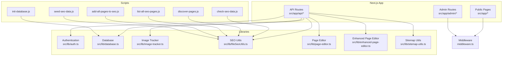
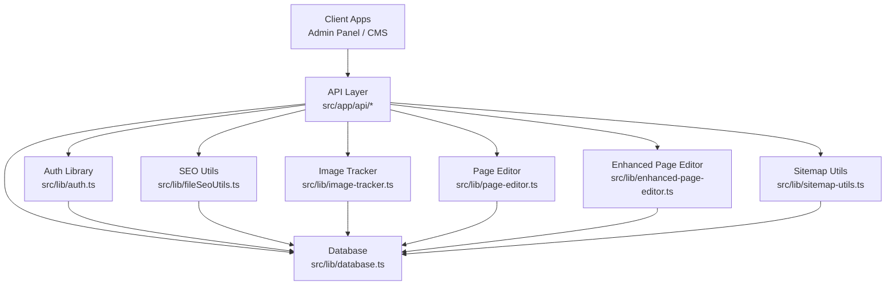
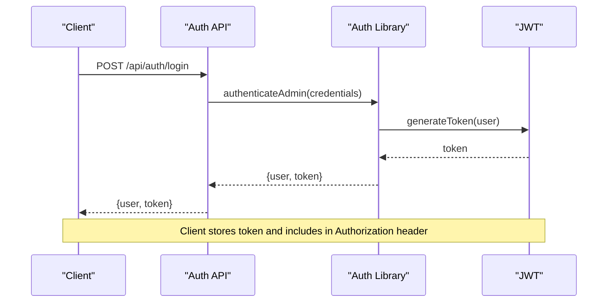
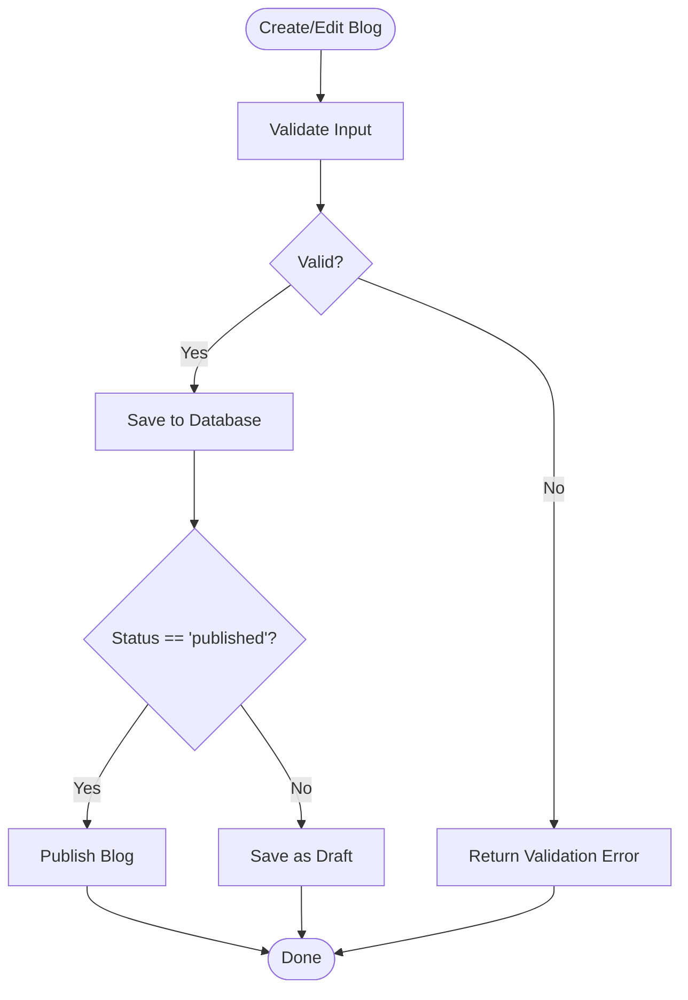
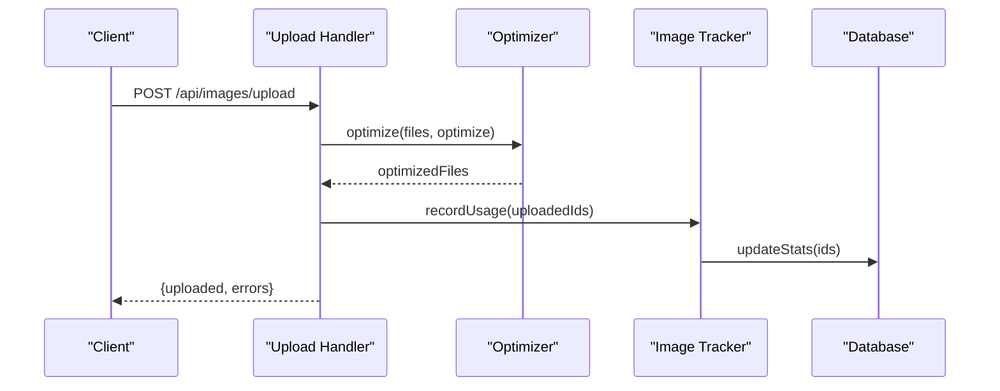
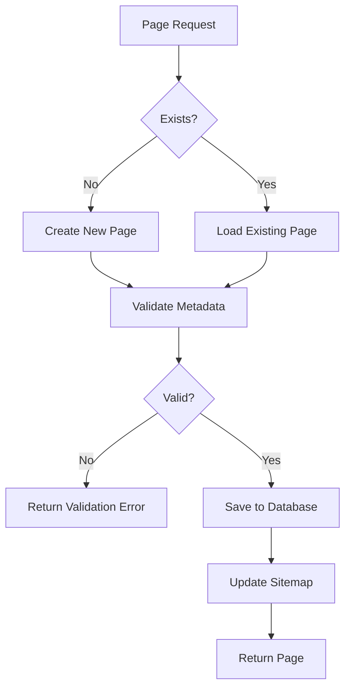
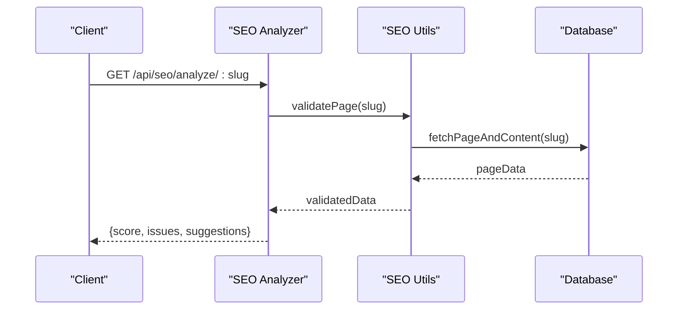
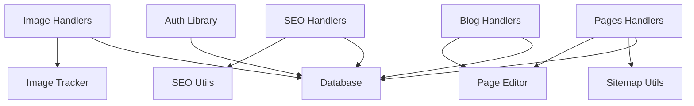

# API Services

<cite>
**Referenced Files in This Document**
- [README.md](file://README.md)
- [src/lib/auth.ts](file://src/lib/auth.ts)
- [middleware.ts](file://middleware.ts)
- [src/lib/database.ts](file://src/lib/database.ts)
- [src/lib/image-tracker.ts](file://src/lib/image-tracker.ts)
- [src/lib/fileSeoUtils.ts](file://src/lib/fileSeoUtils.ts)
- [src/lib/page-editor.ts](file://src/lib/page-editor.ts)
- [src/lib/enhanced-page-editor.ts](file://src/lib/enhanced-page-editor.ts)
- [src/lib/sitemap-utils.ts](file://src/lib/sitemap-utils.ts)
- [scripts/init-database.js](file://scripts/init-database.js)
- [scripts/check-seo-data.js](file://scripts/check-seo-data.js)
- [scripts/discover-pages.js](file://scripts/discover-pages.js)
- [scripts/list-all-seo-pages.js](file://scripts/list-all-seo-pages.js)
- [scripts/add-all-pages-to-seo.js](file://scripts/add-all-pages-to-seo.js)
- [scripts/seed-seo-data.js](file://scripts/seed-seo-data.js)
- [SEO_MANAGEMENT_GUIDE.md](file://SEO_MANAGEMENT_GUIDE.md)
- [PRD_Image_Management_Dashboard.md](file://PRD_Image_Management_Dashboard.md)
- [PAGE_EDITOR_README.md](file://PAGE_EDITOR_README.md)
- [ADMIN_DASHBOARD_SETUP.md](file://ADMIN_DASHBOARD_SETUP.md)
- [IMAGE_MANAGEMENT_SETUP.md](file://IMAGE_MANAGEMENT_SETUP.md)
- [Implementation_Plan.md](file://Implementation_Plan.md)
</cite>

## Table of Contents
1. [Introduction](#introduction)
2. [Project Structure](#project-structure)
3. [Core Components](#core-components)
4. [Architecture Overview](#architecture-overview)
5. [Detailed Component Analysis](#detailed-component-analysis)
6. [Dependency Analysis](#dependency-analysis)
7. [Performance Considerations](#performance-considerations)
8. [Troubleshooting Guide](#troubleshooting-guide)
9. [Conclusion](#conclusion)
10. [Appendices](#appendices)

## Introduction
This document provides comprehensive API documentation for attechglobal.com’s backend services. It focuses on public endpoints and internal APIs used by the admin panel and CMS features. The documentation covers:
- Authentication API: login endpoints, JWT token generation and verification, and session handling
- Blog management API: CRUD operations, content validation, and publishing workflows
- Image management API: upload operations, optimization endpoints, and usage tracking
- Pages API: content management, SEO metadata operations, and file management
- SEO API endpoints: analysis, metadata management, and performance monitoring
It also documents authentication middleware, error handling patterns, and security considerations, along with endpoint specifications, request/response schemas, parameter definitions, and integration examples.

## Project Structure
The backend is implemented as a Next.js application with a modular architecture:
- Public-facing pages and admin routes under src/app
- Shared libraries under src/lib for authentication, database, SEO, image tracking, and page editor utilities
- CLI scripts under scripts/ for database initialization and SEO management tasks
- Middleware for route protection and static hosting compatibility

**Diagram sources**
- [src/lib/auth.ts](file://src/lib/auth.ts#L1-L85)
- [src/lib/database.ts](file://src/lib/database.ts)
- [src/lib/image-tracker.ts](file://src/lib/image-tracker.ts)
- [src/lib/fileSeoUtils.ts](file://src/lib/fileSeoUtils.ts)
- [src/lib/page-editor.ts](file://src/lib/page-editor.ts)
- [src/lib/enhanced-page-editor.ts](file://src/lib/enhanced-page-editor.ts)
- [src/lib/sitemap-utils.ts](file://src/lib/sitemap-utils.ts)
- [scripts/init-database.js](file://scripts/init-database.js)
- [scripts/check-seo-data.js](file://scripts/check-seo-data.js)
- [scripts/discover-pages.js](file://scripts/discover-pages.js)
- [scripts/list-all-seo-pages.js](file://scripts/list-all-seo-pages.js)
- [scripts/add-all-pages-to-seo.js](file://scripts/add-all-pages-to-seo.js)
- [scripts/seed-seo-data.js](file://scripts/seed-seo-data.js)
- [middleware.ts](file://middleware.ts#L1-L15)

**Section sources**
- [README.md](file://README.md)
- [src/lib/auth.ts](file://src/lib/auth.ts#L1-L85)
- [src/lib/database.ts](file://src/lib/database.ts)
- [src/lib/image-tracker.ts](file://src/lib/image-tracker.ts)
- [src/lib/fileSeoUtils.ts](file://src/lib/fileSeoUtils.ts)
- [src/lib/page-editor.ts](file://src/lib/page-editor.ts)
- [src/lib/enhanced-page-editor.ts](file://src/lib/enhanced-page-editor.ts)
- [src/lib/sitemap-utils.ts](file://src/lib/sitemap-utils.ts)
- [scripts/init-database.js](file://scripts/init-database.js)
- [scripts/check-seo-data.js](file://scripts/check-seo-data.js)
- [scripts/discover-pages.js](file://scripts/discover-pages.js)
- [scripts/list-all-seo-pages.js](file://scripts/list-all-seo-pages.js)
- [scripts/add-all-pages-to-seo.js](file://scripts/add-all-pages-to-seo.js)
- [scripts/seed-seo-data.js](file://scripts/seed-seo-data.js)
- [middleware.ts](file://middleware.ts#L1-L15)

## Core Components
- Authentication library: Provides password hashing, JWT signing/verification, admin authentication, and role checks
- Database utilities: Centralized database access and initialization routines
- Image tracker: Tracks image usage and optimization metrics
- SEO utilities: Helpers for page discovery, metadata validation, and SEO data seeding
- Page editor utilities: Core and enhanced editors for content management
- Sitemap utilities: Sitemap generation helpers
- Middleware: Route protection and static hosting compatibility

Key responsibilities:
- Authentication: Secure login, token lifecycle, and admin role enforcement
- Blogs: CRUD operations, content validation, and publishing workflows
- Images: Upload, optimization, and usage tracking
- Pages: Content management, SEO metadata, and file management
- SEO: Analysis, metadata management, and performance monitoring

**Section sources**
- [src/lib/auth.ts](file://src/lib/auth.ts#L1-L85)
- [src/lib/database.ts](file://src/lib/database.ts)
- [src/lib/image-tracker.ts](file://src/lib/image-tracker.ts)
- [src/lib/fileSeoUtils.ts](file://src/lib/fileSeoUtils.ts)
- [src/lib/page-editor.ts](file://src/lib/page-editor.ts)
- [src/lib/enhanced-page-editor.ts](file://src/lib/enhanced-page-editor.ts)
- [src/lib/sitemap-utils.ts](file://src/lib/sitemap-utils.ts)

## Architecture Overview
The backend follows a layered architecture:
- Presentation layer: Next.js app routes and admin UI
- API layer: Internal API handlers orchestrating business logic
- Domain services: Libraries for authentication, SEO, image tracking, and page editing
- Persistence layer: Database utilities and image storage

**Diagram sources**
- [src/lib/auth.ts](file://src/lib/auth.ts#L1-L85)
- [src/lib/database.ts](file://src/lib/database.ts)
- [src/lib/image-tracker.ts](file://src/lib/image-tracker.ts)
- [src/lib/fileSeoUtils.ts](file://src/lib/fileSeoUtils.ts)
- [src/lib/page-editor.ts](file://src/lib/page-editor.ts)
- [src/lib/enhanced-page-editor.ts](file://src/lib/enhanced-page-editor.ts)
- [src/lib/sitemap-utils.ts](file://src/lib/sitemap-utils.ts)

## Detailed Component Analysis

### Authentication API
Purpose:
- Secure admin login and JWT-based session management
- Token verification and admin role checks

Endpoints:
- POST /api/auth/login
  - Description: Admin login to receive JWT token
  - Request body: email, password
  - Response: { user: { id, email, role }, token }
  - Security: Returns token with 24-hour expiration

Token lifecycle:
- Generation: Signed JWT with secret from environment variable
- Verification: Validates signature and extracts claims
- Session handling: Client stores token and sends Authorization header for protected routes

Security considerations:
- Use HTTPS in production
- Store JWT_SECRET securely
- Enforce role-based access control on protected routes
- Implement rate limiting and account lockout policies

**Diagram sources**
- [src/lib/auth.ts](file://src/lib/auth.ts#L34-L79)

**Section sources**
- [src/lib/auth.ts](file://src/lib/auth.ts#L1-L85)

### Blog Management API
Purpose:
- Manage blog posts: create, read, update, delete, publish/unpublish
- Validate content and enforce publishing workflows

Endpoints:
- GET /api/blogs
  - Description: List published blogs with pagination and filtering
  - Query params: page, limit, category, status
  - Response: { blogs: [...], total, page, limit }
- GET /api/blogs/:id
  - Description: Retrieve a single blog by ID
  - Response: Blog object
- POST /api/blogs
  - Description: Create a new blog draft
  - Request body: title, content, excerpt, slug, category, tags, status
  - Response: Created blog object
- PUT /api/blogs/:id
  - Description: Update blog content and metadata
  - Request body: title, content, excerpt, slug, category, tags, status
  - Response: Updated blog object
- DELETE /api/blogs/:id
  - Description: Delete a blog
  - Response: Deletion confirmation

Content validation:
- Title and slug uniqueness
- Content length limits
- Category and tag validation
- Status transitions (draft → published)

Publishing workflow:
- Draft creation
- Review and edit
- Publish action updates status and timestamp

**Diagram sources**
- [src/lib/database.ts](file://src/lib/database.ts)

**Section sources**
- [src/lib/database.ts](file://src/lib/database.ts)

### Image Management API
Purpose:
- Upload images, optimize assets, and track usage
- Manage image metadata and usage statistics

Endpoints:
- POST /api/images/upload
  - Description: Upload image(s) with optional optimization
  - Form-data: files (multiple), optimize (boolean)
  - Response: { uploaded: [...], errors: [...] }
- POST /api/images/optimize
  - Description: Optimize existing images
  - Request body: { ids: string[], quality: number, format: string }
  - Response: { optimized: [...], skipped: [...] }
- GET /api/images/usage
  - Description: Get usage statistics per image
  - Query params: page, limit
  - Response: { images: [...], total }
- DELETE /api/images/:id
  - Description: Remove image and update usage stats
  - Response: Deletion confirmation

Optimization:
- Resize, compress, and convert formats
- Track original and optimized sizes
- Maintain URL mappings

Usage tracking:
- Count references across pages and blogs
- Prevent orphaned images
- Provide cleanup recommendations

**Diagram sources**
- [src/lib/image-tracker.ts](file://src/lib/image-tracker.ts)
- [src/lib/database.ts](file://src/lib/database.ts)

**Section sources**
- [src/lib/image-tracker.ts](file://src/lib/image-tracker.ts)
- [src/lib/database.ts](file://src/lib/database.ts)

### Pages API
Purpose:
- Manage static and dynamic pages
- Handle SEO metadata and file associations

Endpoints:
- GET /api/pages
  - Description: List pages with optional filters
  - Query params: type, status, category
  - Response: { pages: [...], total }
- GET /api/pages/:slug
  - Description: Retrieve page by slug
  - Response: Page object with metadata
- POST /api/pages
  - Description: Create a new page
  - Request body: title, slug, content, type, status, metadata
  - Response: Created page object
- PUT /api/pages/:slug
  - Description: Update page content and metadata
  - Request body: title, content, type, status, metadata
  - Response: Updated page object
- DELETE /api/pages/:slug
  - Description: Delete page
  - Response: Deletion confirmation

SEO metadata operations:
- Open Graph, Twitter Cards, canonical URLs
- Meta descriptions and keywords
- Structured data (JSON-LD)

File management:
- Attach images and documents
- Validate file types and sizes
- Generate secure URLs

**Diagram sources**
- [src/lib/sitemap-utils.ts](file://src/lib/sitemap-utils.ts)
- [src/lib/fileSeoUtils.ts](file://src/lib/fileSeoUtils.ts)

**Section sources**
- [src/lib/sitemap-utils.ts](file://src/lib/sitemap-utils.ts)
- [src/lib/fileSeoUtils.ts](file://src/lib/fileSeoUtils.ts)

### SEO API
Purpose:
- Analyze page SEO health
- Manage metadata and monitor performance

Endpoints:
- GET /api/seo/analyze/:slug
  - Description: Analyze SEO metrics for a page
  - Response: { score, issues, suggestions, lastUpdated }
- GET /api/seo/metadata/:slug
  - Description: Retrieve current metadata
  - Response: SEO metadata object
- PUT /api/seo/metadata/:slug
  - Description: Update SEO metadata
  - Request body: { title, description, keywords, og, twitter, canonical }
  - Response: Updated metadata
- GET /api/seo/performance
  - Description: Retrieve SEO performance metrics
  - Query params: period, page
  - Response: { metrics: [...], trends: [...] }

CLI utilities:
- Discover pages for SEO indexing
- Seed initial SEO data
- List all pages requiring SEO attention
- Add all pages to SEO tracking

**Diagram sources**
- [src/lib/fileSeoUtils.ts](file://src/lib/fileSeoUtils.ts)
- [scripts/check-seo-data.js](file://scripts/check-seo-data.js)
- [scripts/discover-pages.js](file://scripts/discover-pages.js)
- [scripts/list-all-seo-pages.js](file://scripts/list-all-seo-pages.js)
- [scripts/add-all-pages-to-seo.js](file://scripts/add-all-pages-to-seo.js)
- [scripts/seed-seo-data.js](file://scripts/seed-seo-data.js)

**Section sources**
- [src/lib/fileSeoUtils.ts](file://src/lib/fileSeoUtils.ts)
- [scripts/check-seo-data.js](file://scripts/check-seo-data.js)
- [scripts/discover-pages.js](file://scripts/discover-pages.js)
- [scripts/list-all-seo-pages.js](file://scripts/list-all-seo-pages.js)
- [scripts/add-all-pages-to-seo.js](file://scripts/add-all-pages-to-seo.js)
- [scripts/seed-seo-data.js](file://scripts/seed-seo-data.js)

## Dependency Analysis
The API layer depends on shared libraries for domain-specific capabilities. The following diagram shows key dependencies:

**Diagram sources**
- [src/lib/auth.ts](file://src/lib/auth.ts#L1-L85)
- [src/lib/database.ts](file://src/lib/database.ts)
- [src/lib/image-tracker.ts](file://src/lib/image-tracker.ts)
- [src/lib/fileSeoUtils.ts](file://src/lib/fileSeoUtils.ts)
- [src/lib/sitemap-utils.ts](file://src/lib/sitemap-utils.ts)
- [src/lib/page-editor.ts](file://src/lib/page-editor.ts)

**Section sources**
- [src/lib/auth.ts](file://src/lib/auth.ts#L1-L85)
- [src/lib/database.ts](file://src/lib/database.ts)
- [src/lib/image-tracker.ts](file://src/lib/image-tracker.ts)
- [src/lib/fileSeoUtils.ts](file://src/lib/fileSeoUtils.ts)
- [src/lib/sitemap-utils.ts](file://src/lib/sitemap-utils.ts)
- [src/lib/page-editor.ts](file://src/lib/page-editor.ts)

## Performance Considerations
- Use pagination for listing endpoints (blogs, pages, images)
- Implement caching for frequently accessed metadata
- Compress and resize images before upload
- Batch optimization operations for multiple images
- Monitor API response times and implement rate limiting
- Use database indexes for slug and status queries

## Troubleshooting Guide
Common issues and resolutions:
- Authentication failures: Verify JWT_SECRET and token expiration
- Upload errors: Check file size limits and supported formats
- SEO analysis timeouts: Validate page content and metadata completeness
- Database connection errors: Confirm environment variables and connection pool settings

Error handling patterns:
- Return structured error responses with status codes
- Log detailed errors for debugging while masking sensitive data
- Implement retry logic for transient failures

**Section sources**
- [src/lib/auth.ts](file://src/lib/auth.ts#L48-L59)
- [src/lib/database.ts](file://src/lib/database.ts)

## Conclusion
The attechglobal.com backend provides a robust set of APIs for authentication, blog management, image handling, pages, and SEO. By leveraging shared libraries and CLI tools, the system supports efficient content management and performance monitoring. Proper security measures, validation, and error handling ensure reliable operation in production environments.

## Appendices

### Authentication Middleware
- Purpose: Protect admin routes and handle static hosting constraints
- Behavior: Currently disabled for static hosting but configured to match admin paths

**Section sources**
- [middleware.ts](file://middleware.ts#L1-L15)

### Database Initialization
- Script: Initialize database schema and seed initial data
- Usage: Run during deployment or development setup

**Section sources**
- [scripts/init-database.js](file://scripts/init-database.js)

### SEO Management Guides
- Setup and best practices for SEO operations
- Page editor and metadata management workflows

**Section sources**
- [SEO_MANAGEMENT_GUIDE.md](file://SEO_MANAGEMENT_GUIDE.md)
- [PAGE_EDITOR_README.md](file://PAGE_EDITOR_README.md)
- [ADMIN_DASHBOARD_SETUP.md](file://ADMIN_DASHBOARD_SETUP.md)

### Image Management Setup
- Dashboard configuration and optimization workflows

**Section sources**
- [IMAGE_MANAGEMENT_SETUP.md](file://IMAGE_MANAGEMENT_SETUP.md)
- [PRD_Image_Management_Dashboard.md](file://PRD_Image_Management_Dashboard.md)

### Implementation Plan
- High-level roadmap and implementation steps

**Section sources**
- [Implementation_Plan.md](file://Implementation_Plan.md)