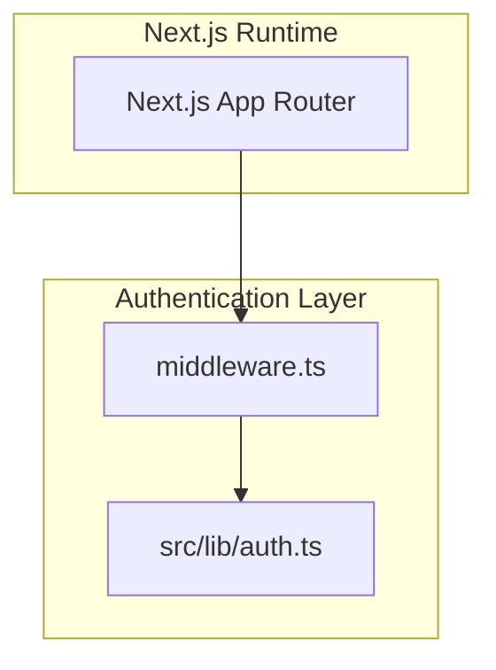
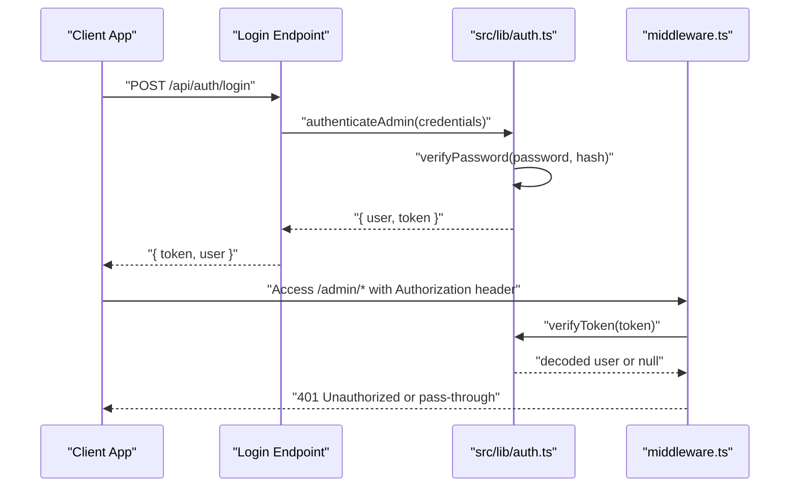
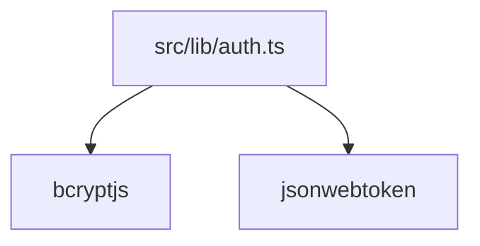

# Authentication API

<cite>
**Referenced Files in This Document**
- [auth.ts](file://src/lib/auth.ts)
- [middleware.ts](file://middleware.ts)
</cite>

## Table of Contents
1. [Introduction](#introduction)
2. [Project Structure](#project-structure)
3. [Core Components](#core-components)
4. [Architecture Overview](#architecture-overview)
5. [Detailed Component Analysis](#detailed-component-analysis)
6. [Dependency Analysis](#dependency-analysis)
7. [Performance Considerations](#performance-considerations)
8. [Troubleshooting Guide](#troubleshooting-guide)
9. [Conclusion](#conclusion)
10. [Appendices](#appendices)

## Introduction
This document provides comprehensive API documentation for the authentication system focused on user login and JWT token management. It covers the login endpoint, password validation using bcrypt, JWT token generation with expiration handling, and response format. It also documents the authentication middleware implementation, including token verification, role-based access control, and protected route enforcement. Security considerations such as password hashing, token refresh mechanisms, and session management are included, along with complete endpoint specifications, error codes, and client-side integration examples.

## Project Structure
The authentication system is implemented in a small set of modules:
- Authentication utilities and JWT helpers: [auth.ts](file://src/lib/auth.ts)
- Middleware for enforcing protected routes: [middleware.ts](file://middleware.ts)

**Diagram sources**
- [auth.ts](file://src/lib/auth.ts#L1-L85)
- [middleware.ts](file://middleware.ts#L1-L15)

**Section sources**
- [auth.ts](file://src/lib/auth.ts#L1-L85)
- [middleware.ts](file://middleware.ts#L1-L15)

## Core Components
- Password hashing and verification using bcrypt
- JWT token generation and verification with 24-hour expiration
- Admin user authentication and role checks
- Middleware-based route protection for admin routes

Key responsibilities:
- Hash passwords for secure storage
- Verify provided passwords against stored hashes
- Issue signed JWT tokens with user identity and role
- Validate incoming tokens and enforce role-based access
- Protect admin routes via middleware

**Section sources**
- [auth.ts](file://src/lib/auth.ts#L24-L59)
- [auth.ts](file://src/lib/auth.ts#L61-L84)
- [middleware.ts](file://middleware.ts#L4-L7)

## Architecture Overview
The authentication flow integrates client-side login requests with server-side token generation and middleware-based access control.

**Diagram sources**
- [auth.ts](file://src/lib/auth.ts#L34-L59)
- [auth.ts](file://src/lib/auth.ts#L61-L79)
- [middleware.ts](file://middleware.ts#L4-L7)

## Detailed Component Analysis

### Login Endpoint
- Path: Not present in the current repository snapshot. The authentication logic resides in [auth.ts](file://src/lib/auth.ts#L61-L79).
- Method: POST
- Purpose: Authenticate admin credentials and issue a JWT token

Request payload structure (JSON):
- email: string (required)
- password: string (required)

Response format (JSON):
- token: string (JWT)
- user: object
  - id: string
  - email: string
  - role: string

Security considerations:
- Passwords are validated using bcrypt compare
- Token expires after 24 hours

Error codes:
- 401 Unauthorized: Invalid credentials or token verification failure
- 500 Internal Server Error: Unexpected server errors during authentication

Integration example (client-side):
- Send POST request to the login endpoint with email and password
- On success, store the returned token (e.g., in localStorage or httpOnly cookie)
- Include the token in subsequent requests to admin-protected routes using the Authorization header

**Section sources**
- [auth.ts](file://src/lib/auth.ts#L19-L22)
- [auth.ts](file://src/lib/auth.ts#L29-L32)
- [auth.ts](file://src/lib/auth.ts#L61-L79)

### Password Validation (bcrypt)
- Hashing: bcrypt.hashSync with a work factor suitable for server environments
- Verification: bcrypt.compareSync for validating provided passwords against stored hashes

Complexity:
- Hashing: O(k) where k is the cost factor
- Verification: O(k)

Best practices:
- Never store plaintext passwords
- Use a sufficiently high cost factor for hashing
- Compare passwords using constant-time functions to mitigate timing attacks

**Section sources**
- [auth.ts](file://src/lib/auth.ts#L24-L32)

### JWT Token Management
Token generation:
- Payload includes user id, email, and role
- Secret is loaded from environment variables
- Expiration set to 24 hours

Token verification:
- Validates signature and expiration
- Returns decoded user object or null on failure

Refresh mechanism:
- No built-in refresh endpoint in the current implementation
- Clients should re-authenticate after token expiration

Session management:
- Stateless tokens; no server-side session storage
- Token revocation requires a new secret or blacklisting strategy

**Section sources**
- [auth.ts](file://src/lib/auth.ts#L34-L45)
- [auth.ts](file://src/lib/auth.ts#L47-L59)

### Authentication Middleware
Purpose:
- Enforce protected access to admin routes
- Verify presence and validity of Authorization header
- Extract and validate JWT token

Current behavior:
- Middleware is temporarily disabled for static hosting scenarios
- Matcher targets /admin routes

Role-based access control:
- Role checks performed via isAdmin helper
- Super admin and admin roles granted access to admin routes

Protected route enforcement:
- Requests to /admin routes require a valid token
- Invalid or missing tokens result in unauthorized responses

**Section sources**
- [middleware.ts](file://middleware.ts#L4-L7)
- [middleware.ts](file://middleware.ts#L10-L14)
- [auth.ts](file://src/lib/auth.ts#L82-L84)

### Admin User Model and Credentials
AdminUser interface:
- id: string
- email: string
- role: string

Hardcoded admin credentials:
- Email and password are embedded in code
- Role is set to super_admin

Recommendations:
- Store sensitive credentials in environment variables
- Use a strong, randomly generated secret for JWT signing
- Implement dynamic credential management in production

**Section sources**
- [auth.ts](file://src/lib/auth.ts#L13-L17)
- [auth.ts](file://src/lib/auth.ts#L4-L9)
- [auth.ts](file://src/lib/auth.ts#L61-L70)

## Dependency Analysis
The authentication system depends on external libraries for cryptographic operations and token handling.

**Diagram sources**
- [auth.ts](file://src/lib/auth.ts#L1-L2)

**Section sources**
- [auth.ts](file://src/lib/auth.ts#L1-L2)

## Performance Considerations
- Bcrypt cost factor: Adjust to balance security and performance; higher factors increase verification time
- Token expiration: Shorter expirations reduce risk but increase re-authentication frequency
- Middleware overhead: Minimal impact; ensure token verification is cached if scaling to very high loads
- Database operations: Not part of authentication in this implementation, but consider caching for frequently accessed user data

## Troubleshooting Guide
Common issues and resolutions:
- Invalid credentials: Ensure email and password match the hardcoded admin account
- Token verification failures: Confirm JWT_SECRET is configured and consistent across deployments
- 401 Unauthorized on admin routes: Verify Authorization header format and token validity
- Static hosting limitations: Middleware is disabled; implement client-side route protection or deploy to a serverless runtime that supports middleware

Error handling:
- bcrypt.compareSync returns false for mismatched passwords
- jwt.verify throws on invalid signatures or expired tokens
- Middleware returns early without enforcing rules in static hosting mode

**Section sources**
- [auth.ts](file://src/lib/auth.ts#L29-L32)
- [auth.ts](file://src/lib/auth.ts#L47-L59)
- [middleware.ts](file://middleware.ts#L4-L7)

## Conclusion
The authentication system provides a compact, stateless solution for admin access control using bcrypt and JWT. While functional, production deployments should address security hardening, environment variable usage, and middleware compatibility for serverless hosting. The documented endpoints and flows enable client-side integration with clear error handling and security considerations.

## Appendices

### Endpoint Specifications
- POST /api/auth/login
  - Request body: { email, password }
  - Response: { token, user }
  - Errors: 401 Unauthorized, 500 Internal Server Error

### Client-Side Integration Examples
- Store token after successful login
- Attach Authorization header for admin-protected requests
- Re-authenticate when token expires

### Security Checklist
- Use environment variables for secrets
- Rotate JWT_SECRET periodically
- Implement rate limiting for login attempts
- Consider adding token refresh and logout mechanisms
- Deploy middleware-enabled runtime for robust protection