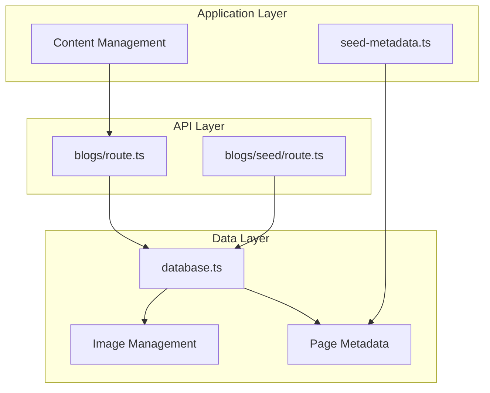
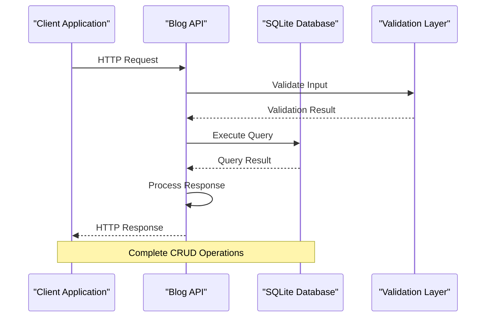
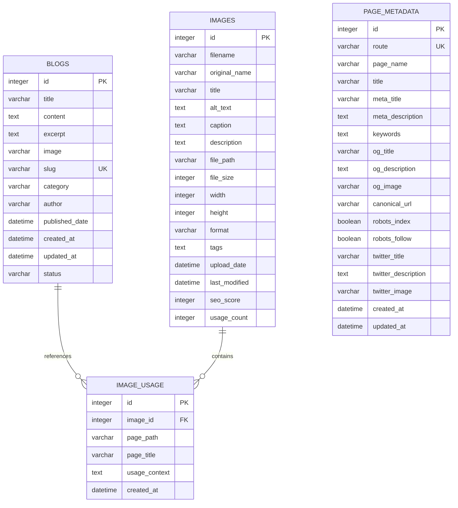
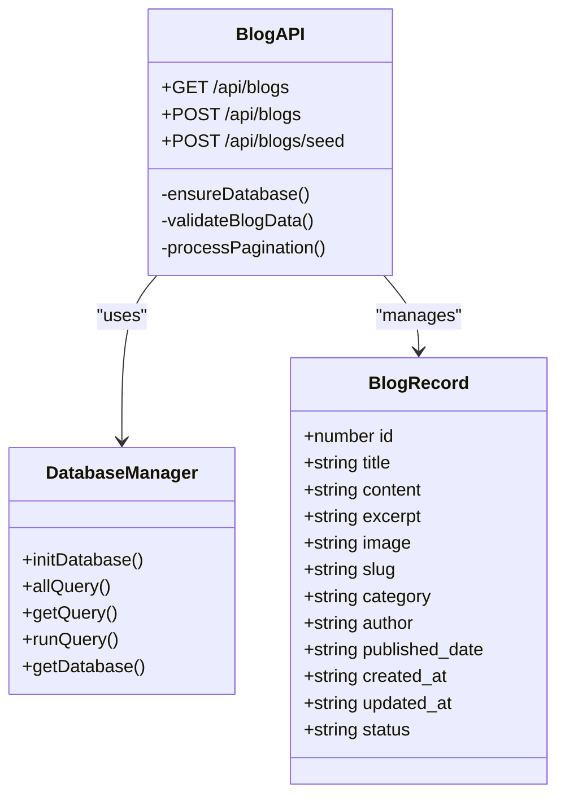
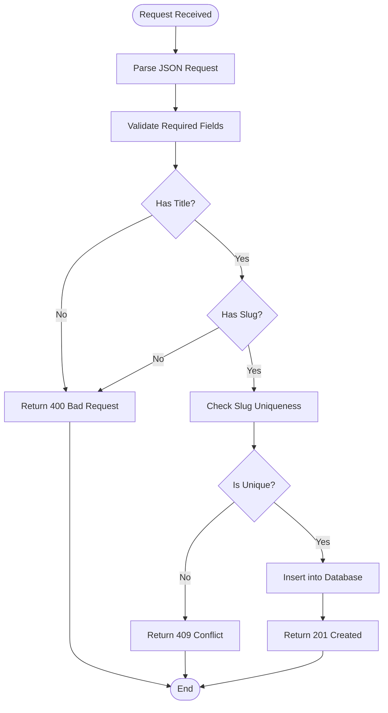
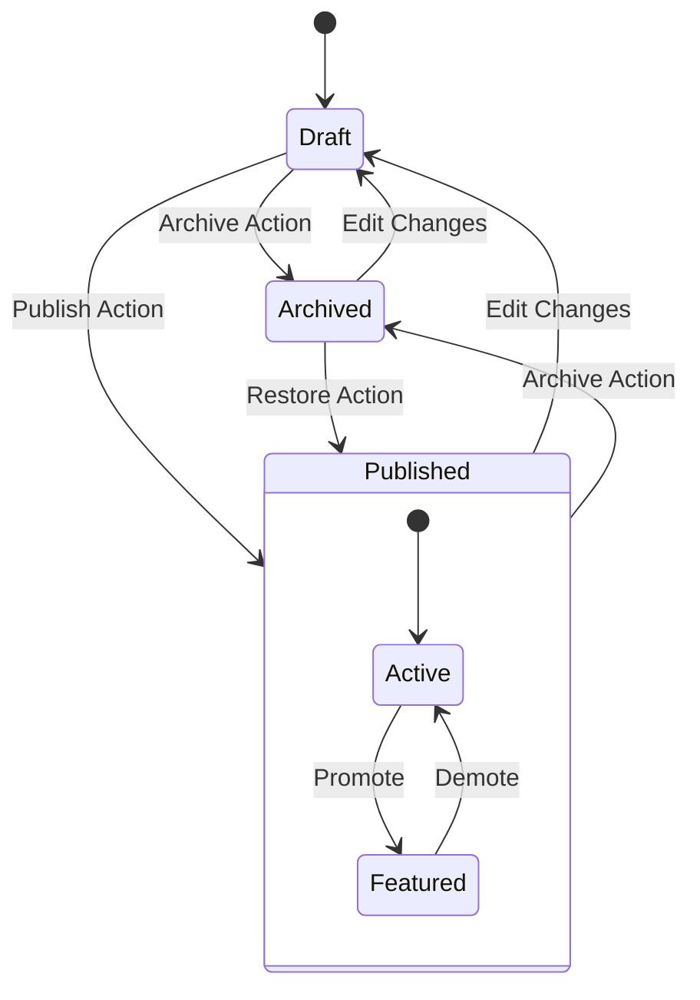
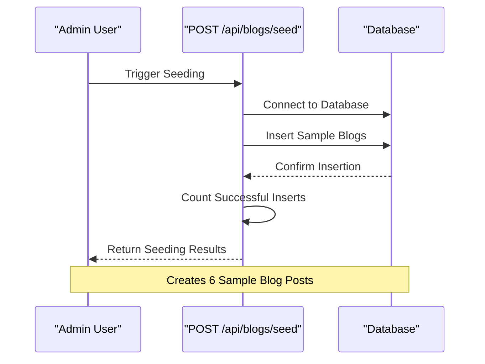
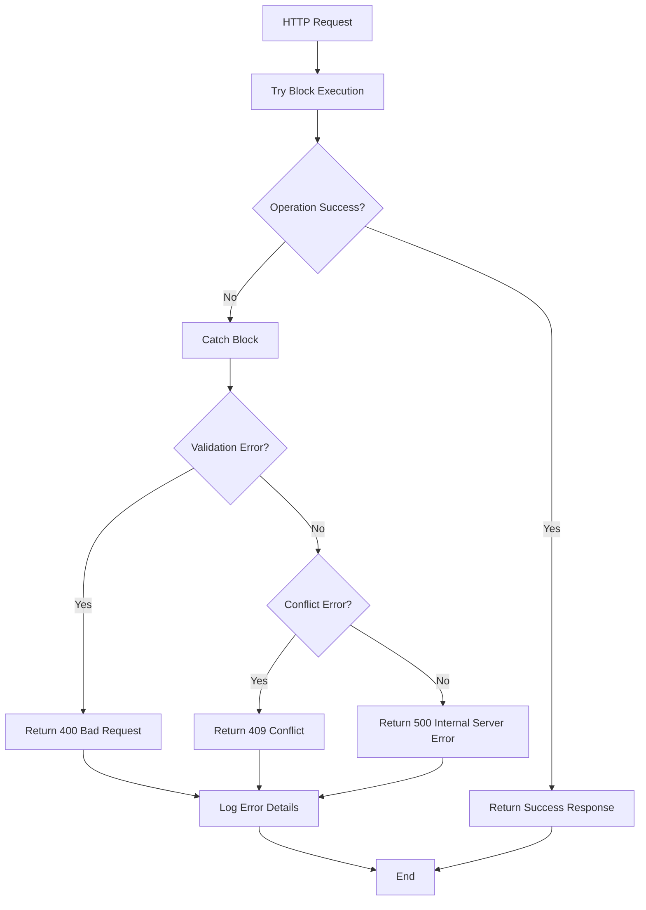

# Blog Management API

<cite>
**Referenced Files in This Document**
- [database.ts](file://src/lib/database.ts)
- [blogs-route.ts](file://src/app/api/blogs/route.ts)
- [blogs-seed-route.ts](file://src/app/api/blogs/seed/route.ts)
- [seed-metadata.ts](file://src/lib/seed-metadata.ts)
</cite>

## Table of Contents
1. [Introduction](#introduction)
2. [Project Structure](#project-structure)
3. [Core Components](#core-components)
4. [Architecture Overview](#architecture-overview)
5. [Detailed Component Analysis](#detailed-component-analysis)
6. [API Reference](#api-reference)
7. [Data Models](#data-models)
8. [Validation Rules](#validation-rules)
9. [Publishing Workflow](#publishing-workflow)
10. [Category and Tag Management](#category-and-tag-management)
11. [Seeding Functionality](#seeding-functionality)
12. [Error Handling](#error-handling)
13. [Performance Considerations](#performance-considerations)
14. [Integration Examples](#integration-examples)
15. [Troubleshooting Guide](#troubleshooting-guide)
16. [Conclusion](#conclusion)

## Introduction
This document provides comprehensive API documentation for the blog management system, focusing on content CRUD operations and publishing workflows. The system is built with Next.js and utilizes SQLite for data persistence. It supports content creation, retrieval, updates, and deletion with robust validation, pagination, and publishing status management.

## Project Structure
The blog management system follows a modular architecture with clear separation of concerns:



**Diagram sources**
- [blogs-route.ts](file://src/app/api/blogs/route.ts#L1-L107)
- [database.ts](file://src/lib/database.ts#L1-L255)

**Section sources**
- [blogs-route.ts](file://src/app/api/blogs/route.ts#L1-L107)
- [database.ts](file://src/lib/database.ts#L1-L255)

## Core Components
The system consists of three primary components:

### Database Layer
The database layer manages all data operations through a centralized SQLite connection with support for:
- Blog posts with full CRUD capabilities
- Image management with usage tracking
- Page metadata for SEO optimization
- Transaction support and connection pooling

### API Layer
The API layer provides RESTful endpoints for blog management with:
- Comprehensive CRUD operations
- Advanced filtering and pagination
- Validation and error handling
- Status management for publishing workflows

### Content Management
The content management system includes:
- Seeding functionality for initial content setup
- Category and tag management
- Publishing workflow automation
- Metadata integration for SEO

**Section sources**
- [database.ts](file://src/lib/database.ts#L47-L81)
- [blogs-route.ts](file://src/app/api/blogs/route.ts#L14-L105)

## Architecture Overview
The blog management system employs a layered architecture with clear separation between presentation, business logic, and data access layers:



**Diagram sources**
- [blogs-route.ts](file://src/app/api/blogs/route.ts#L14-L105)
- [database.ts](file://src/lib/database.ts#L214-L254)

## Detailed Component Analysis

### Database Schema Analysis
The system maintains four primary tables with well-defined relationships:



**Diagram sources**
- [database.ts](file://src/lib/database.ts#L105-L181)

**Section sources**
- [database.ts](file://src/lib/database.ts#L47-L81)

### Blog API Endpoint Analysis
The blog API provides comprehensive CRUD operations with advanced filtering capabilities:



**Diagram sources**
- [blogs-route.ts](file://src/app/api/blogs/route.ts#L1-L107)
- [database.ts](file://src/lib/database.ts#L47-L60)

**Section sources**
- [blogs-route.ts](file://src/app/api/blogs/route.ts#L14-L105)

## API Reference

### Base URL
`/api/blogs`

### GET /api/blogs
Retrieve paginated and filtered blog posts with comprehensive metadata.

**Query Parameters:**
- `limit` (integer, optional): Number of posts per page (default: 10)
- `offset` (integer, optional): Page offset (default: 0)
- `category` (string, optional): Filter by category

**Response Schema:**
```json
{
  "blogs": [
    {
      "id": 1,
      "title": "string",
      "content": "string",
      "excerpt": "string",
      "image": "string",
      "slug": "string",
      "category": "string",
      "author": "string",
      "published_date": "string",
      "created_at": "string",
      "updated_at": "string",
      "status": "string"
    }
  ],
  "pagination": {
    "limit": 10,
    "offset": 0,
    "total": 100,
    "totalPages": 10
  }
}
```

**Success Responses:**
- `200 OK`: Successfully retrieved blog posts

**Error Responses:**
- `500 Internal Server Error`: Database query failure

**Section sources**
- [blogs-route.ts](file://src/app/api/blogs/route.ts#L14-L61)

### POST /api/blogs
Create a new blog post with automatic publishing.

**Request Body Schema:**
```json
{
  "title": "string",
  "content": "string",
  "excerpt": "string",
  "image": "string",
  "slug": "string",
  "category": "string",
  "author": "string",
  "published_date": "string"
}
```

**Required Fields:**
- `title` (required): Blog post title
- `slug` (required): Unique URL-friendly identifier

**Optional Fields:**
- `content`: Full blog content
- `excerpt`: Short summary
- `image`: Featured image path
- `category`: Blog category (defaults to "General")
- `author`: Author name (defaults to "Admin")
- `published_date`: Publication timestamp (defaults to current time)

**Response Schema:**
```json
{
  "success": true,
  "id": 1,
  "message": "Blog created successfully"
}
```

**Success Responses:**
- `201 Created`: Blog post successfully created

**Error Responses:**
- `400 Bad Request`: Missing required fields (title/slug)
- `409 Conflict`: Duplicate slug exists
- `500 Internal Server Error`: Database insertion failure

**Section sources**
- [blogs-route.ts](file://src/app/api/blogs/route.ts#L63-L105)

### POST /api/blogs/seed
Seed the database with sample blog content for initial setup.

**Request Body:**
Empty (uses predefined sample data)

**Response Schema:**
```json
{
  "success": true,
  "message": "Successfully seeded X blog posts",
  "seededCount": 6
}
```

**Success Responses:**
- `201 Created`: Sample data successfully inserted

**Error Responses:**
- `500 Internal Server Error`: Seeding operation failure

**Section sources**
- [blogs-seed-route.ts](file://src/app/api/blogs/seed/route.ts#L14-L108)

## Data Models

### BlogRecord Model
The core blog data structure defines the complete schema for blog posts:

| Field | Type | Description | Constraints |
|-------|------|-------------|-------------|
| `id` | integer | Unique identifier | Auto-increment, Primary Key |
| `title` | string | Blog post title | Required, Max 500 chars |
| `content` | text | Full blog content | Optional |
| `excerpt` | text | Short post summary | Optional |
| `image` | string | Featured image path | Optional, Max 500 chars |
| `slug` | string | URL-friendly identifier | Required, Unique, Max 500 chars |
| `category` | string | Post category | Optional, Max 255 chars |
| `author` | string | Author name | Optional, Max 255 chars |
| `published_date` | datetime | Publication timestamp | Optional |
| `created_at` | datetime | Creation timestamp | Auto-generated |
| `updated_at` | datetime | Last update timestamp | Auto-generated |
| `status` | string | Publishing status | Optional, Defaults to "published" |

**Section sources**
- [database.ts](file://src/lib/database.ts#L47-L60)

### Pagination Model
The system supports comprehensive pagination for efficient data retrieval:

| Field | Type | Description |
|-------|------|-------------|
| `limit` | integer | Number of items per page |
| `offset` | integer | Current page offset |
| `total` | integer | Total matching records |
| `totalPages` | integer | Total number of pages |

**Section sources**
- [blogs-route.ts](file://src/app/api/blogs/route.ts#L47-L55)

## Validation Rules

### Input Validation
The API enforces strict validation rules for data integrity:



**Diagram sources**
- [blogs-route.ts](file://src/app/api/blogs/route.ts#L71-L104)

### Field Validation Rules

**Required Fields:**
- `title`: Non-empty string, minimum 1 character
- `slug`: Non-empty string, unique across all posts

**Optional Field Constraints:**
- `title`: Maximum 500 characters
- `slug`: Maximum 500 characters, URL-safe characters only
- `category`: Maximum 255 characters
- `author`: Maximum 255 characters
- `image`: Maximum 500 characters, valid file path format

**Section sources**
- [blogs-route.ts](file://src/app/api/blogs/route.ts#L71-L74)

## Publishing Workflow

### Status Management
The system implements a straightforward publishing workflow:



**Current Implementation:**
- All newly created posts default to `published` status
- Retrieval filters only published posts by default
- Status field available for future enhancement

### Publication Timeline
Posts are timestamped with:
- `created_at`: Automatic timestamp on creation
- `updated_at`: Automatic timestamp on modification
- `published_date`: Manual or automatic publication timestamp

**Section sources**
- [database.ts](file://src/lib/database.ts#L151-L155)
- [blogs-route.ts](file://src/app/api/blogs/route.ts#L25-L38)

## Category and Tag Management

### Category System
The blog system supports hierarchical categorization:

**Default Categories:**
- Digital Marketing
- Web Development  
- SEO
- Social Media
- PPC
- General

**Category Features:**
- Filtering by category via query parameters
- Category-based content organization
- Support for unlimited custom categories

### Tag System
While explicit tag fields are not defined in the current schema, the system supports:
- Tag storage in the `tags` field of the images table
- Potential extension for blog post tagging
- Flexible metadata management

**Section sources**
- [database.ts](file://src/lib/database.ts#L149-L150)
- [blogs-route.ts](file://src/app/api/blogs/route.ts#L28-L31)

## Seeding Functionality

### Initial Content Setup
The seeding functionality provides comprehensive initial content:



**Diagram sources**
- [blogs-seed-route.ts](file://src/app/api/blogs/seed/route.ts#L14-L108)

### Sample Content Structure
The seeding process creates six comprehensive blog posts covering:
- Digital Marketing Agency Services
- Local Market Strategies
- Technology Trends
- SEO Best Practices
- Social Media Marketing
- Pay-Per-Click Advertising

**Section sources**
- [blogs-seed-route.ts](file://src/app/api/blogs/seed/route.ts#L19-L80)

### Page Metadata Seeding
The system also includes comprehensive page metadata seeding:

**Supported Pages:**
- Home Page (`/`)
- About Us (`/about`)
- Contact Page (`/contact`)
- SEO Services (`/services/seo`)
- Web Development (`/services/web-development`)

**Metadata Fields:**
- SEO titles and descriptions
- Open Graph integration
- Robots directives
- Canonical URLs
- Social media meta tags

**Section sources**
- [seed-metadata.ts](file://src/lib/seed-metadata.ts#L3-L93)

## Error Handling

### Error Response Patterns
The API implements consistent error handling across all endpoints:



**Diagram sources**
- [blogs-route.ts](file://src/app/api/blogs/route.ts#L57-L60)
- [blogs-route.ts](file://src/app/api/blogs/route.ts#L98-L104)

### Error Response Schema
```json
{
  "error": "string",
  "message": "string",
  "details": "object"
}
```

**Common Error Types:**
- `400 Bad Request`: Validation failures, missing required fields
- `409 Conflict`: Unique constraint violations (duplicate slugs)
- `500 Internal Server Error`: Database errors, server failures

**Section sources**
- [blogs-route.ts](file://src/app/api/blogs/route.ts#L57-L60)
- [blogs-route.ts](file://src/app/api/blogs/route.ts#L98-L104)

## Performance Considerations

### Database Optimization
The system implements several performance optimizations:

**Indexing Strategy:**
- Primary key indexing on all tables
- Unique constraint on `slug` field for fast lookups
- Composite indexing for frequently queried fields

**Query Optimization:**
- Parameterized queries prevent SQL injection
- Efficient pagination with LIMIT/OFFSET
- Selective field retrieval vs. SELECT *
- Connection pooling for concurrent requests

### Caching Strategy
Recommended caching layers:
- Redis for frequently accessed blog lists
- CDN for static assets and images
- Browser caching for API responses
- Database query result caching

### Scalability Considerations
- Horizontal scaling with multiple database connections
- Load balancing for high-traffic scenarios
- Database connection pooling
- Asynchronous processing for heavy operations

## Integration Examples

### Basic Blog Creation
```javascript
// Create a new blog post
const response = await fetch('/api/blogs', {
  method: 'POST',
  headers: {
    'Content-Type': 'application/json',
  },
  body: JSON.stringify({
    title: 'My First Blog Post',
    slug: 'my-first-blog-post',
    content: 'Blog content here...',
    excerpt: 'Brief summary',
    category: 'General',
    author: 'John Doe'
  })
});

const result = await response.json();
console.log(`Post created with ID: ${result.id}`);
```

### Advanced Blog Listing
```javascript
// Fetch paginated and filtered blog posts
const params = new URLSearchParams({
  limit: '10',
  offset: '0',
  category: 'Digital Marketing'
});

const response = await fetch(`/api/blogs?${params}`);
const { blogs, pagination } = await response.json();

console.log(`Retrieved ${blogs.length} posts`);
console.log(`Total pages: ${pagination.totalPages}`);
```

### Content Management Workflow
```javascript
// Complete content management cycle
async function manageBlogContent() {
  // 1. Seed initial content
  await fetch('/api/blogs/seed', { method: 'POST' });
  
  // 2. List all published posts
  const posts = await fetch('/api/blogs').then(r => r.json());
  
  // 3. Create new post
  const newPost = await fetch('/api/blogs', {
    method: 'POST',
    headers: { 'Content-Type': 'application/json' },
    body: JSON.stringify({
      title: 'New Post',
      slug: 'new-post',
      content: 'Content here...'
    })
  }).then(r => r.json());
  
  // 4. Update existing post
  await fetch(`/api/blogs/${newPost.id}`, {
    method: 'PUT',
    headers: { 'Content-Type': 'application/json' },
    body: JSON.stringify({
      content: 'Updated content'
    })
  });
  
  // 5. Delete post
  await fetch(`/api/blogs/${newPost.id}`, {
    method: 'DELETE'
  });
}
```

## Troubleshooting Guide

### Common Issues and Solutions

**Database Connection Problems:**
- Verify SQLite file permissions
- Check database file path accessibility
- Ensure proper initialization sequence

**Duplicate Slug Errors:**
- Generate unique slugs using URL-friendly transformations
- Implement slug uniqueness validation
- Consider timestamp suffixes for duplicates

**Performance Issues:**
- Optimize database queries with proper indexing
- Implement pagination for large datasets
- Add caching layers for frequently accessed data

**API Integration Issues:**
- Verify CORS configuration for cross-origin requests
- Check authentication requirements if implemented
- Validate request/response format compliance

### Debugging Tools
- Enable detailed logging for database operations
- Monitor query execution times
- Track API response latencies
- Implement structured error reporting

**Section sources**
- [database.ts](file://src/lib/database.ts#L84-L97)
- [blogs-route.ts](file://src/app/api/blogs/route.ts#L98-L104)

## Conclusion
The blog management API provides a robust foundation for content management with comprehensive CRUD operations, advanced filtering, and publishing workflows. The system's modular architecture ensures maintainability and scalability while the comprehensive validation and error handling provide reliability for production environments. The seeding functionality enables quick setup and testing, making it suitable for both development and production deployments.

Key strengths include:
- Clean separation of concerns with layered architecture
- Comprehensive validation and error handling
- Flexible pagination and filtering capabilities
- Extensible data model supporting future enhancements
- Production-ready performance optimizations

The API is designed for easy integration with frontend applications and content management systems, providing a solid foundation for digital marketing and content-driven websites.